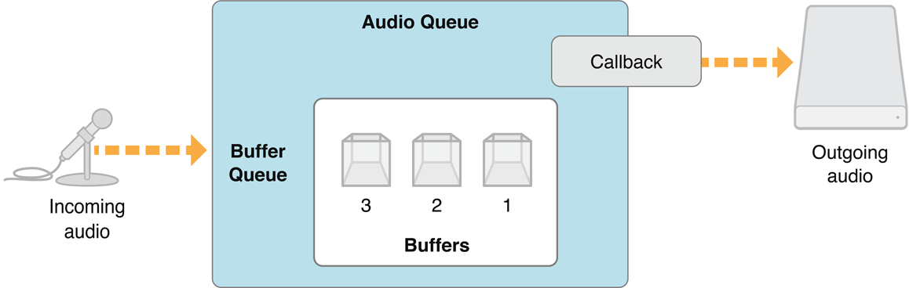
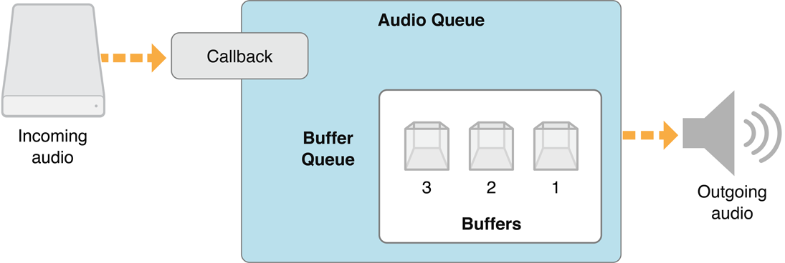
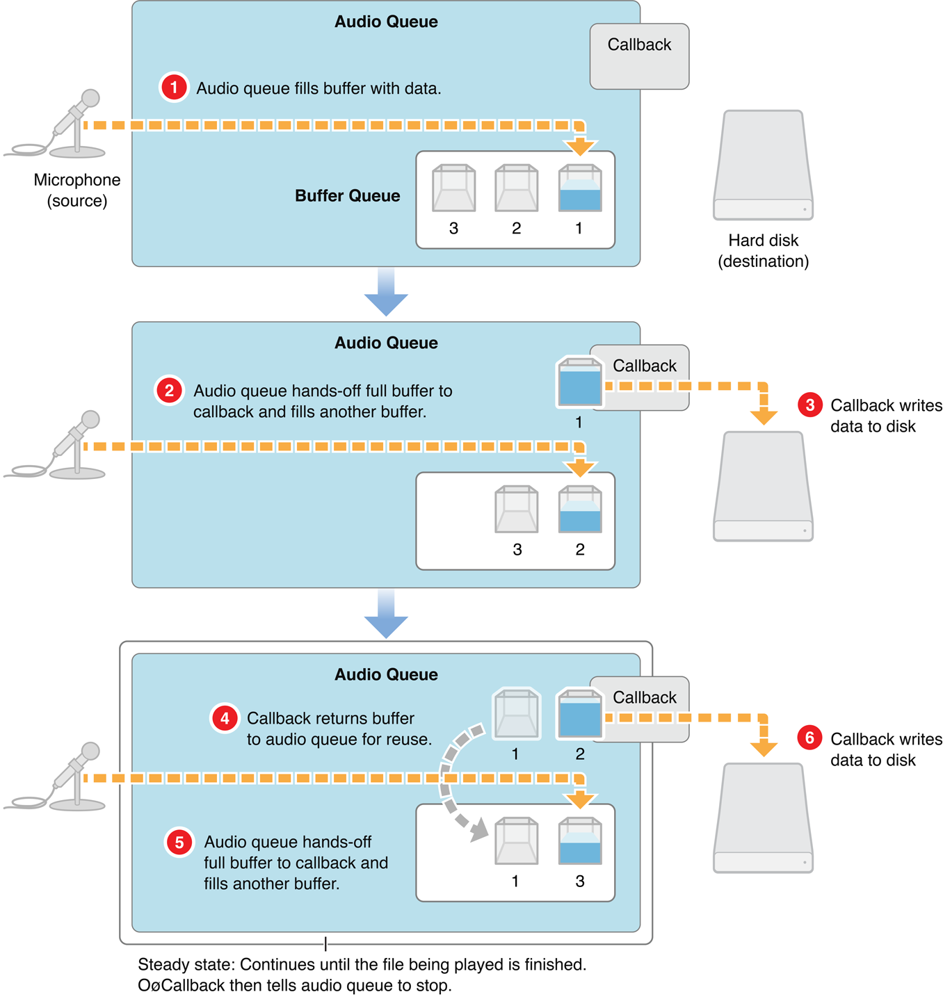
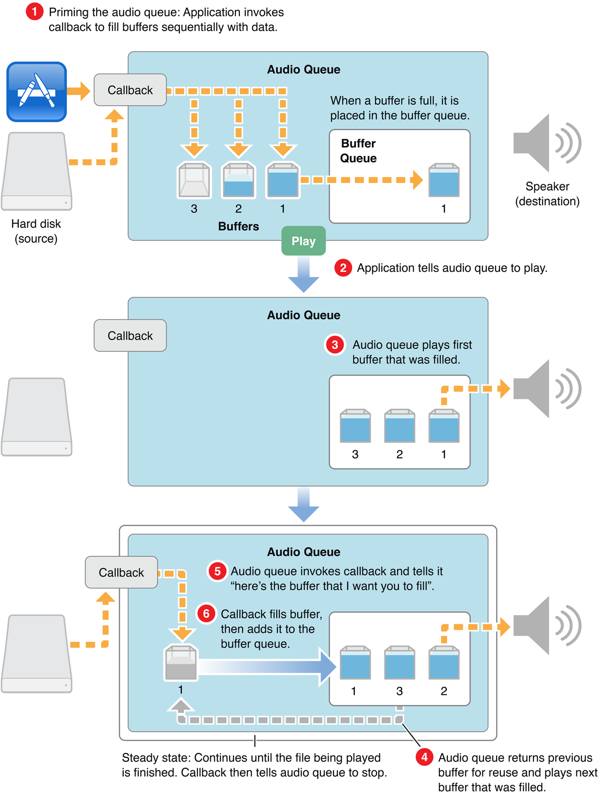
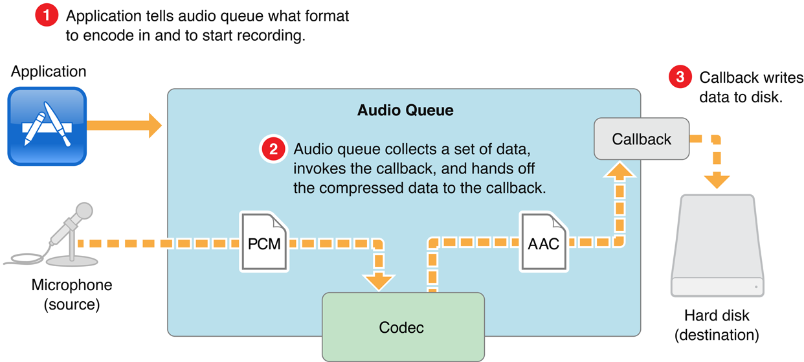
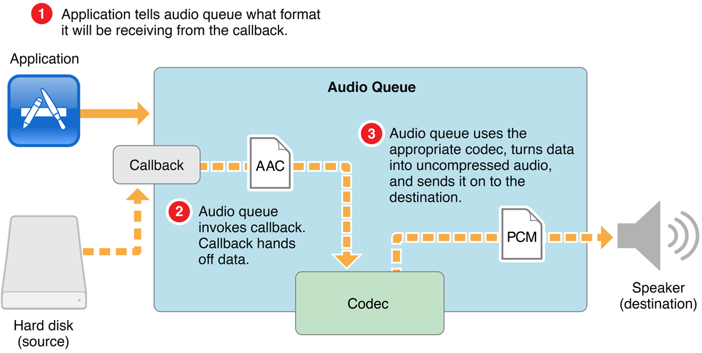

> 导航：[总目录](../../../README.md) · [documentation](../../../_indexes/documentation.md) · [Audio Queue Services Programming Guide](Introduction.md)


[Next](Recording%20Audio.md)[Previous](Introduction.md)

# About Audio Queues

In this chapter you learn about the capabilities, architecture, and internal workings of audio queues. You get introduced to audio queues, audio queue buffers, and the callback functions that audio queues use for recording or playback. You also find out about audio queue states and parameters. By the end of this chapter you will have gained the conceptual understanding you need to use this technology effectively.

An __audio queue__ is a software object you use for recording or playing audio in iOS or Mac OS X. It is represented by the `AudioQueueRef` opaque data type, declared in the `AudioQueue.h` header file.

An audio queue does the work of:

- Connecting to audio hardware
- Managing memory
- Employing codecs, as needed, for compressed audio formats
- Mediating recording or playback

You can use audio queues with other Core Audio interfaces, and a relatively small amount of custom code, to create a complete digital audio recording or playback solution in your application.

All audio queues have the same general structure, consisting of these parts:

- A set of __audio queue buffers__, each of which is a temporary repository for some audio data
- A __buffer queue__, an ordered list for the audio queue buffers
- An __audio queue callback__ function, that you write

The architecture varies depending on whether an audio queue is for recording or playback. The differences are in how the audio queue connects its input and output, and in the role of the callback function.

A recording audio queue, created with the [AudioQueueNewInput](https://developer.apple.com/documentation/audiotoolbox/1501687-audioqueuenewinput) function, has the structure shown in Figure 1-1.

__Figure 1-1__  A recording audio queue



The input side of a recording audio queue typically connects to external audio hardware, such as a microphone. In iOS, the audio comes from the device connected by the user—built-in microphone or headset microphone, for example. In the default case for Mac OS X, the audio comes from the system’s default audio input device as set by a user in System Preferences.

The output side of a recording audio queue makes use of a callback function that you write. When recording to disk, the callback writes buffers of new audio data, that it receives from its audio queue, to an audio file. However, recording audio queues can be used in other ways. For example, your callback could provide audio data directly to your application instead of writing it to disk.

You’ll learn more about this callback in [The Recording Audio Queue Callback Function](#apple-f4xwc4dqnrsv64tfmyxwi33df52wszbpkridimbqga2tgnbtfvbuqnjnknltcma).

Every audio queue—whether for recording or playback—has one or more audio queue buffers. These buffers are arranged in a specific sequence called a buffer queue. In the figure, the audio queue buffers are numbered according to the order in which they are filled—which is the same order in which they are handed off to the callback. You’ll learn how an audio queue uses its buffers in [The Buffer Queue and Enqueuing](#apple-f4xwc4dqnrsv64tfmyxwi33df52wszbpkridimbqga2tgnbtfvbuqnjnknlts).

A playback audio queue (created with the [AudioQueueNewOutput](https://developer.apple.com/documentation/audiotoolbox/1503207-audioqueuenewoutput) function) has the structure shown in Figure 1-2.

__Figure 1-2__  A playback audio queue



In a playback audio queue, the callback is on the input side. The callback is responsible for obtaining audio data from disk (or some other source) and handing it off to the audio queue. Playback callbacks also tell their audio queues to stop when there’s no more data to play. You’ll learn more about this callback in [The Playback Audio Queue Callback Function](#apple-f4xwc4dqnrsv64tfmyxwi33df52wszbpkridimbqga2tgnbtfvbuqnjnknltcmi).

A playback audio queue’s output typically connects to external audio hardware, such as a loudspeaker. In iOS, the audio goes to the device chosen by the user—for example, the receiver or the headset. In the default case in Mac OS X, the audio goes to the system’s default audio output device as set by a user in System Preferences.

An __audio queue buffer__ is a data structure, of type [AudioQueueBuffer](https://developer.apple.com/documentation/audiotoolbox/audioqueuebuffer), as declared in the `AudioQueue.h` header file:

```
typedef struct AudioQueueBuffer {
    const UInt32   mAudioDataBytesCapacity;
    void *const    mAudioData; ```  ``` 
    UInt32         mAudioDataByteSize;
    void           *mUserData;
} AudioQueueBuffer;
typedef AudioQueueBuffer *AudioQueueBufferRef;
```

The `mAudioData` field, highlighted in the code listing, points to the buffer per se: a block of memory that serves as a container for transient blocks of audio data being played or recorded. The information in the other fields helps an audio queue manage the buffer.

An audio queue can use any number of buffers. Your application specifies how many. A typical number is three. This allows one to be busy with, say, writing to disk while another is being filled with fresh audio data. The third buffer is available if needed to compensate for such things as disk I/O delays. [Figure 1-3](#apple-f4xwc4dqnrsv64tfmyxwi33df52wszbpkridimbqga2tgnbtfvbuqnjnknlte) illustrates this.

Audio queues perform memory management for their buffers.

- An audio queue allocates a buffer when you call the [AudioQueueAllocateBuffer](https://developer.apple.com/documentation/audiotoolbox/1502248-audioqueueallocatebuffer) function.
- When you release an audio queue by calling the [AudioQueueDispose](https://developer.apple.com/documentation/audiotoolbox/1502229-audioqueuedispose) function, the queue releases its buffers.

This improves the robustness of the recording and playback features you add to your application. It also helps optimize resource usage.

For a complete description of the `AudioQueueBuffer` data structure, see _[Audio Queue Services Reference](https://developer.apple.com/documentation/audiotoolbox/audio_queue_services)_.

The buffer queue is what gives audio queues, and indeed Audio Queue Services, their names. You met the buffer queue—an ordered list of buffers—in [Audio Queue Architecture](#apple-f4xwc4dqnrsv64tfmyxwi33df52wszbpkridimbqga2tgnbtfvbuqnjnknltcmq). Here you learn about how an audio queue object, together with your callback function, manage the buffer queue during recording or playback. In particular, you learn about __enqueuing__, the addition of an audio queue buffer to a buffer queue. Whether you are implementing recording or playback, enqueuing is a task that your callback performs.

When recording, one audio queue buffer is being filled with audio data acquired from an input device, such as a microphone. The remaining buffers in the buffer queue are lined up behind the current buffer, waiting to be filled with audio data in turn.

The audio queue hands off filled buffers of audio data to your callback in the order in which they were acquired. Figure 1-3 illustrates how recording works when using an audio queue.

__Figure 1-3__  The recording process



In step 1 of Figure 1-3, recording begins. The audio queue fills a buffer with acquired data.

In step 2, the first buffer has been filled. The audio queue invokes the callback, handing it the full buffer (buffer 1). The callback (step 3) writes the contents of the buffer to an audio file. At the same time, the audio queue fills another buffer (buffer 2) with freshly acquired data.

In step 4, the callback enqueues the buffer (buffer 1) that it has just written to disk, putting it in line to be filled again. The audio queue again invokes the callback (step 5), handing it the next full buffer (buffer 2). The callback (step 6) writes the contents of this buffer to the audio file. This looping steady state continues until the user stops the recording.

When playing, one audio queue buffer is being sent to an output device, such as a loudspeaker. The remaining buffers in the buffer queue are lined up behind the current buffer, waiting to be played in turn.

The audio queue hands off played buffers of audio data to your callback in the order in which they were played. The callback reads new audio data into a buffer and then enqueues it. Figure 1-4 illustrates how playback works when using an audio queue.

__Figure 1-4__  The playback process



In step 1 of Figure 1-4, the application primes the playback audio queue. The application invokes the callback once for each of the audio queue buffers, filling them and adding them to the buffer queue. Priming ensures that playback can start instantly when your application calls the [AudioQueueStart](https://developer.apple.com/documentation/audiotoolbox/1502689-audioqueuestart) function (step 2).

In step 3, the audio queue sends the first buffer (buffer 1) to output.

As soon as the first buffer has been played, the playback audio queue enters a looping steady state. The audio queue starts playing the next buffer (buffer 2, step 4) and invokes the callback (step 5), handing it the just-played buffer (buffer 1). The callback (step 6) fills the buffer from the audio file and then enqueues it for playback.

Audio queue buffers are always played in the order in which they are enqueued. However, Audio Queue Services provides you with some control over the playback process with the[AudioQueueEnqueueBufferWithParameters](https://developer.apple.com/documentation/audiotoolbox/1503258-audioqueueenqueuebufferwithparam) function. This function lets you:

- Set the precise playback time for a buffer. This lets you support synchronization.
- Trim frames at the start or end of an audio queue buffer. This lets you remove leading or trailing silence.
- Set the playback gain at the granularity of a buffer.

For more about setting playback gain, see [Audio Queue Parameters](#apple-f4xwc4dqnrsv64tfmyxwi33df52wszbpkridimbqga2tgnbtfvbuqnjnknltcni). For a complete description of the `AudioQueueEnqueueBufferWithParameters` function, see _[Audio Queue Services Reference](https://developer.apple.com/documentation/audiotoolbox/audio_queue_services)_.

Typically, the bulk of your programming work in using Audio Queue Services consists of writing an audio queue callback function.

During recording or playback, an audio queue callback is invoked repeatedly by the audio queue that owns it. The time between calls depends on the capacity of the audio queue’s buffers and will typically range from half a second to several seconds.

One responsibility of an audio queue callback, whether it is for recording or playback, is to return audio queue buffers to the buffer queue. The callback adds a buffer to the end of the buffer queue using the [AudioQueueEnqueueBuffer](https://developer.apple.com/documentation/audiotoolbox/1502779-audioqueueenqueuebuffer) function. For playback, you can instead use the [AudioQueueEnqueueBufferWithParameters](https://developer.apple.com/documentation/audiotoolbox/1503258-audioqueueenqueuebufferwithparam) function if you need more control, as described in [Controlling the Playback Process](#apple-f4xwc4dqnrsv64tfmyxwi33df52wszbpkridimbqga2tgnbtfvbuqnjnknltcnq).

This section introduces the callback you’d write for the common case of recording audio to an on-disk file. Here is the prototype for a recording audio queue callback, as declared in the `AudioQueue.h` header file:

```
AudioQueueInputCallback (
    void                               *inUserData,
    AudioQueueRef                      inAQ,
    AudioQueueBufferRef                inBuffer,
    const AudioTimeStamp               *inStartTime,
    UInt32                             inNumberPacketDescriptions,
    const AudioStreamPacketDescription *inPacketDescs
);
```

A recording audio queue, in invoking your callback, supplies everything the callback needs to write the next set of audio data to the audio file:

- _inUserData_ is, typically, a custom structure that you’ve set up to contain state information for the audio queue and its buffers, an audio file object (of type `AudioFileID`) representing the file you’re writing to, and audio data format information for the file.
- _inAQ_ is the audio queue that invoked the callback.
- _inBuffer_ is an audio queue buffer, freshly filled by the audio queue, containing the new data your callback needs to write to disk. The data is already formatted according to the format you specify in the custom structure (passed in the _inUserData_ parameter). For more on this, see [Using Codecs and Audio Data Formats](#apple-f4xwc4dqnrsv64tfmyxwi33df52wszbpkridimbqga2tgnbtfvbuqnjnknltcna).
- _inStartTime_ is the sample time of the first sample in the buffer. For basic recording, your callback doesn’t use this parameter.
- _inNumberPacketDescriptions_ is the number of packet descriptions in the `inPacketDescs` parameter. If you are recording to a VBR (variable bitrate) format, the audio queue supplies a value for this parameter to your callback, which in turn passes it on to the [AudioFileWritePackets](https://developer.apple.com/documentation/audiotoolbox/1502135-audiofilewritepackets) function. CBR (constant bitrate) formats don’t use packet descriptions. For a CBR recording, the audio queue sets this and the _inPacketDescs_ parameter to `NULL`.
- _inPacketDescs_ is the set of packet descriptions corresponding to the samples in the buffer. Again, the audio queue supplies the value for this parameter, if the audio data is in a VBR format, and your callback passes it on to the `AudioFileWritePackets` function (declared in the `AudioFile.h` header file).

For more information on the recording callback, see [Recording Audio](Recording%20Audio.md#apple-f4xwc4dqnrsv64tfmyxwi33df52wszbpkridimbqga2tgnbtfvbuqnbnknltc) in this document, and see _[Audio Queue Services Reference](https://developer.apple.com/documentation/audiotoolbox/audio_queue_services)_.

This section introduces the callback you’d write for the common case of playing audio from an on-disk file. Here is the prototype for a playback audio queue callback, as declared in the `AudioQueue.h` header file:

```
AudioQueueOutputCallback (
    void                  *inUserData,
    AudioQueueRef         inAQ,
    AudioQueueBufferRef   inBuffer
);
```

A playback audio queue, in invoking your callback, supplies what the callback needs to read the next set of audio data from the audio file:

- _inUserData_ is, typically, a custom structure that you’ve set up to contain state information for the audio queue and its buffers, an audio file object (of type `AudioFileID`) representing the file you’re writing to, and audio data format information for the file.

  In the case of a playback audio queue, your callback keeps track of the current packet index using a field in this structure.
- _inAQ_ is the audio queue that invoked the callback.
- _inBuffer_ is an audio queue buffer, made available by the audio queue, that your callback is to fill with the next set of data read from the file being played.

If your application is playing back VBR data, the callback needs to get the packet information for the audio data it’s reading. It does this by calling the [AudioFileReadPackets](https://developer.apple.com/documentation/audiotoolbox/1503274-audiofilereadpackets) function, declared in the `AudioFile.h` header file. The callback then places the packet information in the custom data structure to make it available to the playback audio queue.

For more information on the playback callback, see [Playing Audio](Playing%20Audio.md#apple-f4xwc4dqnrsv64tfmyxwi33df52wszbpkridimbqga2tgnbtfvbuqmznknltc) in this document, and see _[Audio Queue Services Reference](https://developer.apple.com/documentation/audiotoolbox/audio_queue_services)_.

Audio Queue Services employs codecs (audio data coding/decoding components) as needed for converting between audio formats. Your recording or playback application can use any audio format for which there is an installed codec. You do not need to write custom code to handle various audio formats. Specifically, your callback does not need to know about data formats.

Here’s how this works. Each audio queue has an audio data format, represented in an `AudioStreamBasicDescription` structure. When you specify the format—in the `mFormatID` field of the structure—the audio queue uses the appropriate codec. You then specify sample rate and channel count, and that’s all there is to it. You'll see examples of setting audio data format in [Recording Audio](Recording%20Audio.md#apple-f4xwc4dqnrsv64tfmyxwi33df52wszbpkridimbqga2tgnbtfvbuqnbnknltc) and [Playing Audio](Playing%20Audio.md#apple-f4xwc4dqnrsv64tfmyxwi33df52wszbpkridimbqga2tgnbtfvbuqmznknltc).

A recording audio queue makes use of an installed codec as shown in Figure 1-5.

__Figure 1-5__  Audio format conversion during recording



In step 1 of Figure 1-5, your application tells an audio queue to start recording, and also tells it the data format to use. In step 2, the audio queue obtains new audio data and converts it, using a codec, according to the format you’ve specified. The audio queue then invokes the callback, handing it a buffer containing appropriately formated audio data. In step 3, your callback writes the formatted audio data to disk. Again, your callback does not need to know about the data formats.

A playback audio queue makes use of an installed codec as shown in Figure 1-6.

__Figure 1-6__  Audio format conversion during playback



In step 1 of Figure 1-6, your application tells an audio queue to start playing, and also tells it the data format contained in the audio file to be played. In step 2, the audio queue invokes your callback, which reads data from the audio file. The callback hands off the data, in its original format, to the audio queue. In step 3, the audio queue uses the appropriate codec and then sends the audio along to the destination.

An audio queue can make use of any installed codec, whether native to Mac OS X or provided by a third party. To designate a codec to use, you supply its four-character code ID to an audio queue’s `AudioStreamBasicDescription` structure. You’ll see an example of this in [Recording Audio](Recording%20Audio.md#apple-f4xwc4dqnrsv64tfmyxwi33df52wszbpkridimbqga2tgnbtfvbuqnbnknltc).

Mac OS X includes a wide range of audio codecs, as listed in the format IDs enumeration in the `CoreAudioTypes.h` header file and as documented in _[Core Audio Data Types Reference](https://developer.apple.com/documentation/coreaudio/core_audio_data_types)_. You can determine the codecs available on a system by using the interfaces in the `AudioFormat.h` header file, in the Audio Toolbox Framework. You can display the codecs on a system using the Fiendishthngs application, available as sample code at [http://developer.apple.com/samplecode/Fiendishthngs/](https://developer.apple.com/samplecode/Fiendishthngs/).

An audio queue has a life cycle between creation and disposal. Your application manages this life cycle—and controls the audio queue’s state—using six functions declared in the `AudioQueue.h` header file:

- __Start__ ([AudioQueueStart](https://developer.apple.com/documentation/audiotoolbox/1502689-audioqueuestart)). Call to initiate recording or playback.
- __Prime__ ([AudioQueuePrime](https://developer.apple.com/documentation/audiotoolbox/1503220-audioqueueprime)). For playback, call before calling `AudioQueueStart` to ensure that there is data available immediately for the audio queue to play. This function is not relevant to recording.
- __Stop__ ([AudioQueueStop](https://developer.apple.com/documentation/audiotoolbox/1501970-audioqueuestop)). Call to reset the audio queue (see the description below for `AudioQueueReset`) and to then stop recording or playback. A playback audio queue callback calls this function when there’s no more data to play.
- __Pause__ ([AudioQueuePause](https://developer.apple.com/documentation/audiotoolbox/1502109-audioqueuepause)). Call to pause recording or playback without affecting buffers or resetting the audio queue. To resume, call the `AudioQueueStart` function.
- __Flush__ ([AudioQueueFlush](https://developer.apple.com/documentation/audiotoolbox/1502477-audioqueueflush)). Call after enqueuing the last audio queue buffer to ensure that all buffered data, as well as all audio data in the midst of processing, gets recorded or played.
- __Reset__ ([AudioQueueReset](https://developer.apple.com/documentation/audiotoolbox/1502329-audioqueuereset)). Call to immediately silence an audio queue, remove all buffers from previously scheduled use, and reset all decoder and DSP state.

You can use the `AudioQueueStop` function in a synchronous or asynchronous mode:

- __Synchronous__ stopping happens immediately, without regard for previously buffered audio data.
- __Asynchronous__ stopping happens after all queued buffers have been played or recorded.

See _[Audio Queue Services Reference](https://developer.apple.com/documentation/audiotoolbox/audio_queue_services)_ for a complete description of each of these functions, including more information on synchronous and asynchronous stopping of audio queues.

An audio queue has adjustable settings called __parameters__. Each parameter has an enumeration constant as its key, and a floating-point number as its value. Parameters are typically used in playback, not recording.

In Mac OS X v10.5, the only audio queue parameter available is for gain. The value for this parameter is set or retrieved using the [kAudioQueueParam_Volume](https://developer.apple.com/documentation/audiotoolbox/kaudioqueueparam_volume) constant, and has an available range of `0.0` for silence, to `1.0` for unity gain.

Your application can set audio queue parameters in two ways:

- Per audio queue, using the [AudioQueueSetParameter](https://developer.apple.com/documentation/audiotoolbox/1503293-audioqueuesetparameter) function. This lets you change settings for an audio queue directly. Such changes take effect immediately.
- Per audio queue buffer, using the [AudioQueueEnqueueBufferWithParameters](https://developer.apple.com/documentation/audiotoolbox/1503258-audioqueueenqueuebufferwithparam) function. This lets you assign audio queue settings that are, in effect, carried by an audio queue buffer as you enqueue it. Such changes take effect when the audio queue buffer begins playing.

In both cases, parameter settings for an audio queue remain in effect until you change them.

You can access an audio queue’s current parameter values at any time with the [AudioQueueGetParameter](https://developer.apple.com/documentation/audiotoolbox/1503353-audioqueuegetparameter) function. See _[Audio Queue Services Reference](https://developer.apple.com/documentation/audiotoolbox/audio_queue_services)_ for complete descriptions of the functions for getting and setting parameter values.

[Next](Recording%20Audio.md)[Previous](Introduction.md)

