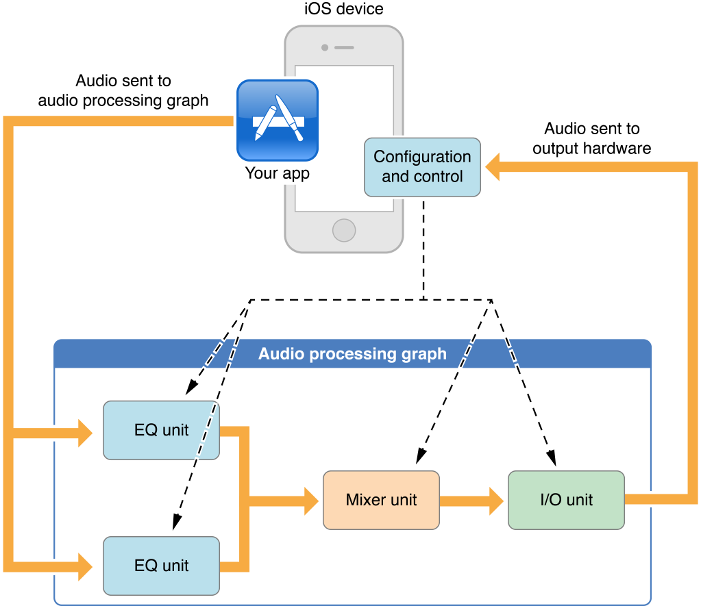

> 导航：[总目录](../../../README.md) · [documentation](../../../_indexes/documentation.md)

[Next](Audio%20Unit%20Hosting%20Fundamentals.md)

# About Audio Unit Hosting

iOS provides audio processing plug-ins that support mixing, equalization, format conversion, and realtime input/output for recording, playback, offline rendering, and live conversation such as for VoIP (Voice over Internet Protocol). You can dynamically load and use—that is, _host_—these powerful and flexible plug-ins, known as _audio units_, from your iOS application.

Audio units usually do their work in the context of an enclosing object called an _audio processing graph_, as shown in the figure. In this example, your app sends audio to the first audio units in the graph by way of one or more callback functions and exercises individual control over each audio unit. The output of the I/O unit—the last audio unit in this or any audio processing graph—connects directly to the output hardware.

Because audio units constitute the lowest programming layer in the iOS audio stack, to use them effectively requires deeper understanding than you need for other iOS audio technologies. Unless you require realtime playback of synthesized sounds, low-latency I/O (input and output), or specific audio unit features, look first at the Media Player, AV Foundation, OpenAL, or Audio Toolbox frameworks. These higher-level technologies employ audio units on your behalf and provide important additional features, as described in _[Multimedia Programming Guide](../../Audio%20Video/Multimedia%20Programming%20Guide/About%20Audio%20and%20Video.md#apple-f4xwc4dqnrsv64tfmyxwi33df52wszbpkridimbqga4tonrx)_.

### Audio Units Provide Fast, Modular Audio Processing

The two greatest advantages of using audio units directly are:

- Excellent responsiveness. Because you have access to a realtime priority thread in an audio unit render callback function, your audio code is as close as possible to the metal. Synthetic musical instruments and realtime simultaneous voice I/O benefit the most from using audio units directly.
- Dynamic reconfiguration. The audio processing graph API, built around the [AUGraph](https://developer.apple.com/documentation/audiotoolbox/augraph) opaque type, lets you dynamically assemble, reconfigure, and rearrange complex audio processing chains in a thread-safe manner, all while processing audio. This is the only audio API in iOS offering this capability.

An audio unit’s life cycle proceeds as follows:

1. At runtime, obtain a reference to the dynamically-linkable library that defines an audio unit you want to use.
2. Instantiate the audio unit.
3. Configure the audio unit as required for its type and to accomodate the intent of your app.
4. Initialize the audio unit to prepare it to handle audio.
5. Start audio flow.
6. Control the audio unit.
7. When finished, deallocate the audio unit.

Audio units provide highly useful individual features such as stereo panning, mixing, volume control, and audio level metering. Hosting audio units lets you add such features to your app. To reap these benefits, however, you must gain facility with a set of fundamental concepts including audio data stream formats, render callback functions, and audio unit architecture.

### Choosing a Design Pattern and Constructing Your App

An audio unit hosting design pattern provides a flexible blueprint to customize for the specifics of your app. Each pattern indicates:

- How to configure the I/O unit. I/O units have two independent elements, one that accepts audio from the input hardware, one that sends audio to the output hardware. Each design pattern indicates which element or elements you should enable.
- Where, within the audio processing graph, you must specify audio data stream formats. You must correctly specify formats to support audio flow.
- Where to establish audio unit connections and where to attach your render callback functions. An audio unit connection is a formal construct that propagates a stream format from an output of one audio unit to an input of another audio unit. A render callback lets you feed audio into a graph or manipulate audio at the individual sample level within a graph.

No matter which design pattern you choose, the steps for constructing an audio unit hosting app are basically the same:

1. Configure your application audio session to ensure your app works correctly in the context of the system and device hardware.
2. Construct an audio processing graph. This multistep process makes use of everything you learned in [Audio Unit Hosting Fundamentals](Audio%20Unit%20Hosting%20Fundamentals.md#apple-f4xwc4dqnrsv64tfmyxwi33df52wszbpkridimbqga4tiojsfvbuqmznknltcmi).
3. Provide a user interface for controlling the graph’s audio units.

Become familiar with these steps so you can apply them to your own projects.

### Get the Most Out of Each Audio Unit

Most of this document teaches you that all iOS audio units share important, common attributes. These attributes include, for example, the need for your app to specify and load the audio unit at runtime, and then to correctly specify its audio stream formats.

At the same time, each audio unit has certain unique features and requirements, ranging from the correct audio sample data type to use, to required configuration for correct behavior. Understand the usage details and specific capabilities of each audio unit so you know, for example, when to use the 3D Mixer unit and when to instead use the Multichannel Mixer.

If you prefer to begin with a hands-on introduction to audio unit hosting in iOS, download one of the sample apps available in the iOS Dev Center, such as _Audio Mixer (MixerHost)_. Come back to this document to answer questions you may have and to learn more.

If you want a solid conceptual grounding before starting your project, read [Audio Unit Hosting Fundamentals](Audio%20Unit%20Hosting%20Fundamentals.md#apple-f4xwc4dqnrsv64tfmyxwi33df52wszbpkridimbqga4tiojsfvbuqmznknltcmi) first. This chapter explains the concepts behind the APIs. Continue with [Constructing Audio Unit Apps](Constructing%20Audio%20Unit%20Apps.md#apple-f4xwc4dqnrsv64tfmyxwi33df52wszbpkridimbqga4tiojsfvbuqmjwfvjvomi) to learn about picking a design pattern for your project and the workflow for building your app.

If you have some experience with audio units and just want the specifics for a given type, you can start with [Using Specific Audio Units](Using%20Specific%20Audio%20Units.md#apple-f4xwc4dqnrsv64tfmyxwi33df52wszbpkridimbqga4tiojsfvbuqmjxfvjvomi).

Before reading this document, it’s a good idea to read the section [A Little About Digital Audio and Linear PCM](../Core%20Audio%20Overview/What%20Is%20Core%20Audio.md#apple-f4xwc4dqnrsv64tfmyxwi33df52wszbpkridimbqgaztknzxfvbuqmznknltcmi) in _[Core Audio Overview](../Core%20Audio%20Overview/Introduction.md#apple-f4xwc4dqnrsv64tfmyxwi33df52wszbpkridimbqgaztknzx)_. Also, review _[Core Audio Glossary](../Core%20Audio%20Glossary/Introduction.md#apple-f4xwc4dqnrsv64tfmyxwi33df52wszbpkridimbqga2dinjt)_ for terms you may not already be familiar with. To check if your audio needs might be met by a higher-level technology, review [Using Audio](https://developer.apple.com/library/archive/documentation/AudioVideo/Conceptual/MultimediaPG/UsingAudio/UsingAudio.html#//apple_ref/doc/uid/TP40009767-CH2) in _[Multimedia Programming Guide](../../Audio%20Video/Multimedia%20Programming%20Guide/About%20Audio%20and%20Video.md#apple-f4xwc4dqnrsv64tfmyxwi33df52wszbpkridimbqga4tonrx)_.

Essential reference documentation for building an audio unit hosting app includes the following:

- _[Audio Unit Properties Reference](https://developer.apple.com/documentation/audiounit/audio_unit_properties)_ describes the properties you can use to configure each type of audio unit.
- _[Audio Unit Parameters Reference](https://developer.apple.com/documentation/audiounit/audio_unit_parameters)_ describes the parameters you can use to control each type of audio unit.
- _[Audio Unit Component Services Reference](https://developer.apple.com/documentation/audiounit/audio_unit_component_services)_ describes the API for accessing audio unit parameters and properties, and describes the various audio unit callback functions.
- _[Audio Component Services Reference](https://developer.apple.com/documentation/audiounit/audio_component_services)_ describes the API for accessing audio units at runtime and for managing audio unit instances.
- _[Audio Unit Processing Graph Services Reference](https://developer.apple.com/documentation/audiotoolbox/audio_unit_processing_graph_services)_ describes the API for constructing and manipulating audio processing graphs, which are dynamically reconfigurable audio processing chains.
- _[Core Audio Data Types Reference](https://developer.apple.com/documentation/coreaudio/core_audio_data_types)_ describes the data structures and types you need for hosting audio units.
[Next](Audio%20Unit%20Hosting%20Fundamentals.md)

