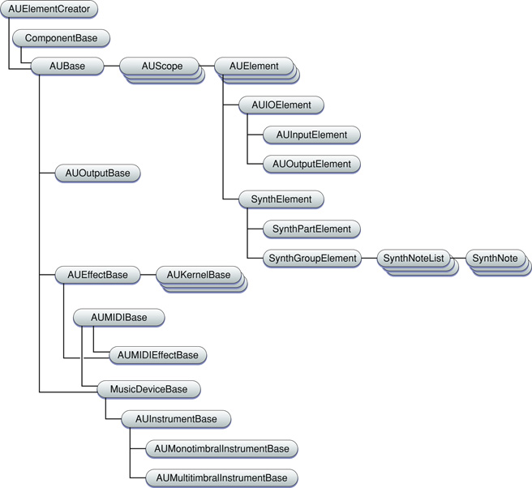

> 导航：[总目录](../../../README.md) · [documentation](../../../_indexes/documentation.md) · [Audio Unit Programming Guide](Introduction.md)

[Next](Document%20Revision%20History.md)[Previous](Tutorial-%20Building%20a%20Simple%20Effect%20Unit%20with%20a%20Generic%20View.md)

# Appendix: Audio Unit Class Hierarchy

This appendix describes the Core Audio SDK audio unit class hierarchy, including starting points for common types of audio units.

The following figure illustrates the main classes and class relationships in the Core Audio SDK audio unit class hierarchy, for Core Audio SDK v1.4.3.

__Figure 6-1__  Core Audio SDK audio unit class hierarchy

- For general, _n_-to-_m_ channel effect units, start with the `AUBase` class
- For _n_-to-_n_ channel effect units, which map each input channel to a corresponding output channel, start with the `AUEffectBase` class
- For monotimbral instrument units (either monophonic or polyphonic), start with the `AUMonotimbralInstrumentBase` class
- For multitimbral instrument units, start with the `AUMultitimbralInstrumentBase` class
- For format converter or generator audio units, start with the `AUBase` class
- For music effect units, start with the `AUMIDIEffectBase` class

[Next](Document%20Revision%20History.md)[Previous](Tutorial-%20Building%20a%20Simple%20Effect%20Unit%20with%20a%20Generic%20View.md)

