> 导航：[总目录](../../../README.md) · [documentation](../../../_indexes/documentation.md) · [Audio Unit Programming Guide](Introduction.md)


[Next](The%20Audio%20Unit.md)[Previous](Introduction.md)

# Audio Unit Development Fundamentals

When you set out to create an audio unit, the power and flexibility of Core Audio’s _Audio Unit framework_ give you the ability to go just about anywhere with sound. However, this power and flexibility also mean that there is a lot to learn to get started on the right foot. In this chapter, you get a bird’s-eye view of this leading edge technology, to serve you as you take the first steps toward becoming an audio unit developer.

You begin here with a quick look at the audio unit development cycle. Then, you focus in on what audio units are, and discover the important role of the _Core Audio SDK_ in audio unit development. You learn how audio units function as plug-ins in OS X and in concert with the applications that use them. Finally, you get introduced to the _Audio Unit Specification_, and how it defines the _plug-in API_ that audio unit developers and application developers both write to.

After reading this chapter you’ll be ready to dig in to the architectural and development details presented in [The Audio Unit](The%20Audio%20Unit.md#apple-f4xwc4dqnrsv64tfmyxwi33df52wszbpkridimbqgaztenzyfvbuqmjsfvjvomi).

If you want to get your hands on building an audio unit right away, you can skip this chapter for now and go straight to [Tutorial: Building a Simple Effect Unit with a Generic View](Tutorial-%20Building%20a%20Simple%20Effect%20Unit%20with%20a%20Generic%20View.md#apple-f4xwc4dqnrsv64tfmyxwi33df52wszbpkridimbqgaztenzyfvbuqnjnknlti). As you build the audio unit, you can refer back to this chapter, and to other sections in this document, for conceptual information related to what you’re doing.

Audio unit development typically follows these steps:

1. Design the audio unit: specify the audio unit’s action, programmatic and user interface, and bundle configuration information.
2. Create and configure an appropriate Xcode project.
3. Implement the audio unit including parameters, factory presets, and properties—all described in the next chapter; implement copy protection, if desired; implement the synthesis, DSP, or data format conversion code.
4. Implement a graphical user interface—known as a custom view—if desired. Implement parameter automation support, if desired.
5. Validate and test the audio unit.
6. Deploy the audio unit bundle by packaging it in an installer or by providing installation instructions.

As with any software development, each of these steps typically entails iteration.

The tutorial later in this document, [Tutorial: Building a Simple Effect Unit with a Generic View](Tutorial-%20Building%20a%20Simple%20Effect%20Unit%20with%20a%20Generic%20View.md#apple-f4xwc4dqnrsv64tfmyxwi33df52wszbpkridimbqgaztenzyfvbuqnjnknlti), leads you through most of these steps.

An _audio unit_ (often abbreviated as _AU_ in header files and elsewhere) is an OS X plug-in that enhances digital audio applications such as Logic Pro and GarageBand. You can also use audio units to build audio features into your own application. Programmatically, an audio unit is packaged as a _bundle_ and configured as a _component_ as defined by the OS X Component Manager.

At a deeper level, and depending on your viewpoint, an audio unit is one of two very different things.

From the inside—as seen by an audio unit developer—an audio unit is executable implementation code within a standard plug-in API. The API is standard so that any application designed to work with audio units will know how to use yours. The API is defined by the _Audio Unit Specification_.

An audio unit developer can add the ability for users or applications to control an audio unit in real time through the audio unit parameter mechanism. Parameters are self-describing; their values and capabilities are visible to applications that use audio units.

From the outside—as seen from an application that uses the audio unit—an audio unit is just its plug-in API. This plug-in API lets applications query an audio unit about its particular features, defined by the audio unit developer as parameters and properties.

Because of this encapsulation, how you implement an audio unit is up to you. The quickest way, the one endorsed by Apple, and the one described in this document, is to subclass the appropriate C++ superclasses of the freely-downloadable Core Audio SDK.

The following figure represents a running audio unit built with the SDK. The figure shows the audio unit in context with its view and with an application—known as a _host_—that is using the audio unit:

__Figure 1-1__  A running audio unit, built using the Core Audio SDK

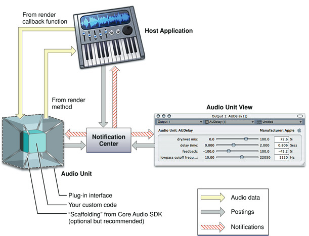

The figure shows two distinct internal parts of an audio unit bundle: the audio unit itself, on the left, and the audio unit view, on the right. The audio unit performs the audio work. The view provides a graphical user interface for the audio unit, and, if you provide it, support for parameter automation. (See [Supporting Parameter Automation](#apple-f4xwc4dqnrsv64tfmyxwi33df52wszbpkridimbqgaztenzyfvbuqnznknltcmy).) When you create an audio unit, you normally package both pieces in the same bundle—as you learn to do later—but they are logically separate pieces of code.

The audio unit, its view, and the host application communicate with each other by way of a notification center set up by the host application. This allows all three entities to remain synchronized. The functions for the notification center are part of the Core Audio _Audio Unit Event API_.

When a user first launches a host application, neither the audio unit nor its view is instantiated. In this state, none of the pieces shown in Figure 1-1 are present except for the host application.

The audio unit and its view come into existence, and into play, in one of two ways:

- Typically, a user indicates to a host application that they’d like to use an audio unit. For example, a user could ask the host to apply a reverb effect to a channel of audio.
- For an audio unit that you supply to add a feature to your own application, the application opens the audio unit directly, probably upon application launch.

When the host opens the audio unit, it hooks the audio unit up to the host’s audio data chain—represented in the figure by the light yellow (audio data) arrows. This hook up has two parts: providing fresh audio data to the audio unit, and retrieving processed audio data from the audio unit.

- To provide fresh audio data to an audio unit, a host defines a callback function (to be called by the audio unit) that supplies audio data one slice at a time. A _slice_ is a number of frames of audio data. A _frame_ is one sample of audio data across all channels.
- To retrieve processed audio data from an audio unit, a host invokes an audio unit’s render method.

Here is how the audio data flow proceeds between a host application and an audio unit:

1. The host invokes the audio unit’s render method, effectively asking the audio unit for a slice of processed audio data
2. The audio unit responds by calling the host’s callback function to get a slice of audio data samples to process
3. The audio unit processes the audio data samples and places the result in an output buffer for the host to retrieve
4. The host retrieves the processed data and then again invokes the audio unit’s render method

In the depiction of the audio unit in [Figure 1-1](#apple-f4xwc4dqnrsv64tfmyxwi33df52wszbpkridimbqgaztenzyfvbuqnznknltm), the outer cube represents the plug-in API. Apple provides the _Audio Unit Specification_ that defines the plug-in API for a variety of audio unit types. When you develop your audio unit to this specification, it will work with any host application that also follows the specification.

Inside, an audio unit contains programmatic scaffolding to connect the plug-in API to your custom code. When you use the Core Audio SDK to build your audio unit, this scaffolding is supplied in the form of glue code for the Component Manager along with a C++ class hierarchy. [Figure 1-1](#apple-f4xwc4dqnrsv64tfmyxwi33df52wszbpkridimbqgaztenzyfvbuqnznknltm) (rather figuratively) represents your custom code as an inner cube within the audio unit, and represents the SDK’s classes and glue code as struts connecting the inner cube to the outer cube.

You can build an audio unit without using the Core Audio SDK, but doing so entails a great deal more work. Apple recommends that you use the Core Audio SDK for all but the most specialized audio unit development.

To learn about the internal architecture of an audio unit, read [Audio Unit Architecture](The%20Audio%20Unit.md#apple-f4xwc4dqnrsv64tfmyxwi33df52wszbpkridimbqgaztenzyfvbuqmjsfvjvomjw) in [The Audio Unit](The%20Audio%20Unit.md#apple-f4xwc4dqnrsv64tfmyxwi33df52wszbpkridimbqgaztenzyfvbuqmjsfvjvomi).

An audio unit looks like this within the OS X file system:

__Figure 1-2__  An audio unit in the OS X file system

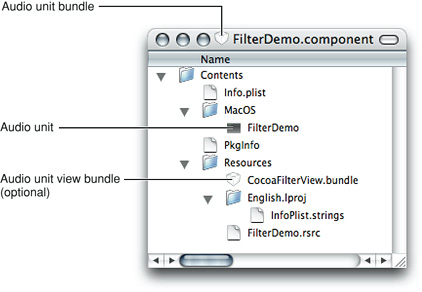

When you build an audio unit using Xcode and a supplied audio unit template, your Xcode project takes care of packaging all these pieces appropriately.

As a component, an audio unit has the following file system characteristics:

- It is a bundle with a `.component` file name extension
- It is a package; users see the bundle as opaque when they view it in the Finder

The information property list (`Info.plist`) file within the bundle’s top-level `Contents` folder provides critical information to the system and to host applications that want to use the audio unit. For example, this file provides:

- The unique bundle identifier string in the form of a reverse domain name (or uniform type identifier). For example, for the FilterDemo audio unit provided in the Core Audio SDK, this identifier is `com.apple.demo.audiounit.FilterDemo`.
- The name of the file, within the bundle, that is the audio unit proper. This file is within the `MacOS` folder in the bundle.

An audio unit bundle can contain a custom user interface, called a view. The standard location for the view is in the audio unit bundle’s `Resources` folder. The audio unit shown in Figure 1-2 includes such a view, packaged as an opaque bundle itself. Looking inside the audio unit view bundle shows the view bundle file structure:

__Figure 1-3__  An audio unit view in the OS X file system

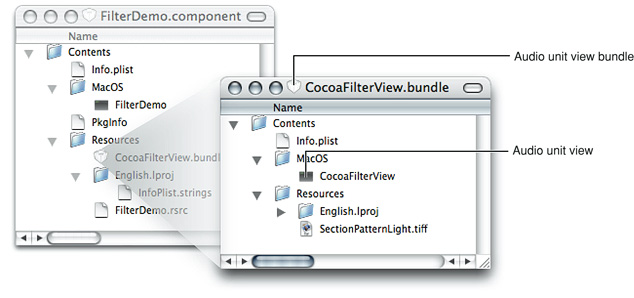

When a host application opens an audio unit, it can ask the audio unit if it has a custom view. If there is one, the audio unit can respond by providing the path to the view bundle. You can put the view bundle anywhere, including a network location. Typically, however, views are packaged as shown here.

An audio unit bundle typically contains one audio unit, as described in this section. But a single audio unit bundle can contain any number of audio units. For example, Apple packages all of its audio units in one bundle, `System/Library/Components/CoreAudio.component`. The `CoreAudio.component` bundle includes a single file of executable code containing all of the Apple audio units, and another file containing all of the supplied custom views:

__Figure 1-4__  The Apple audio units in the OS X file system

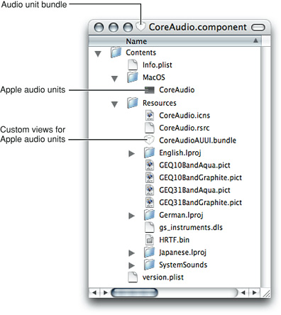

To understand this document, it’s important to understand the terms “audio unit,“ “audio unit view,“ and “audio unit bundle,“ as well as their relationships to each other.

- “Audio unit” usually refers to the executable code within the `MacOS` folder in the audio unit bundle, as shown in [Figure 1-2](#apple-f4xwc4dqnrsv64tfmyxwi33df52wszbpkridimbqgaztenzyfvbuqnznknlto). This is the part that performs the audio work. Sometimes, as in the title of this document, “audio unit” refers in context to the entire audio unit bundle and its contents. In this case, the term “audio unit” corresponds to a user’s view of a plug-in in the OS X file system.
- “Audio unit view” refers to the graphical user interface for an audio unit, as described in [The Audio Unit View](The%20Audio%20Unit%20View.md#apple-f4xwc4dqnrsv64tfmyxwi33df52wszbpkridimbqgaztenzyfvbuqmjtfvjvomi). As shown in Figure 1-2, the code for a custom view typically lives in its own bundle in the `Resources` folder inside the audio unit bundle. Views are optional, because the `AudioUnit` framework lets a host application create a generic view based on parameter and property code in the audio unit.
- “Audio unit bundle” refers to the file system packaging that contains an audio unit and, optionally, a custom view. When this document uses “audio unit bundle,“ it is the characteristics of the packaging, such as the file name extension and the `Info.plist` file, that are important. Sometimes, as in the description of where to install audio units, “audio unit bundle” refers to the contents as well as the packaging. In this case, it’s analogous to talking about a folder while meaning the folder and its contents.

In this section you learn about audio units from the outside in. First you take a look at using an audio unit in Apple’s AU Lab host application. From there, you see how an audio unit plays a role as a component in OS X.

A plug-in is executable code with some special characteristics. As a library rather than a program, a plug-in cannot run by itself. Instead, a plug-in exists to provide features to host applications. For example, an audio unit could provide GarageBand with the ability to add tube-amplifier distortion to an audio signal.

OS X provides two plug-in technologies: Core Foundation’s CFPlugin architecture, and the Component Manager. Audio units are Component Manager–based plug-ins. Later in this section you learn about supporting the Component Manager in your audio units.

Host applications can ship with plug-ins, in which case the plug-in’s use is transparent to a user. In other cases, a user can acquire a plug-in and explicitly add it to a running application.

What makes plug-ins special relative to other code libraries is their ability to contribute features dynamically to running host applications. You can see this in the AU Lab application, part of the Xcode Tools installation.

This mini-tutorial illustrates the dynamic nature of plug-ins by:

- Adding an audio unit to a running host application
- Using the audio unit
- Removing the audio unit from the running host application

Along the way, this tutorial shows you how to get started with the very useful AU Lab application.

1. Launch the AU Lab audio unit host application (in `/Developer/Applications/Audio/`) and create a new AU Lab document. Unless you've configured AU Lab to use a default document style, the Create New Document window opens. If AU Lab was already running, choose File > New to get this window.

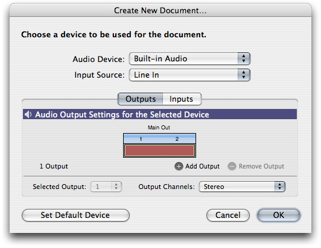

Ensure that the configuration matches the settings shown in the figure: Built-In Audio for the Audio Device, Line In for the Input Source, and Stereo for Output Channels. Leave the window's Inputs tab unconfigured; you will specify the input later. Click OK.

A new AU Lab window opens, showing the output channel you specified.

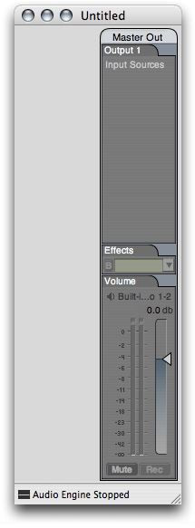

At this point, AU Lab has already instantiated all of the available audio units on your computer, queried them to find out such things as how each can be used in combination with other audio units, and has then closed them all again.

(More precisely, the OS X Component Manager has invoked the instantiation and closing of the audio units on behalf of AU Lab. [Component Manager Requirements for Audio Units](#apple-f4xwc4dqnrsv64tfmyxwi33df52wszbpkridimbqgaztenzyfvbuqnznknlts), below, explains this.)

2. In AU Lab, choose Edit > Add Audio Unit Generator. A dialog opens from the AU Lab window to let you specify the generator unit to serve as the audio source.

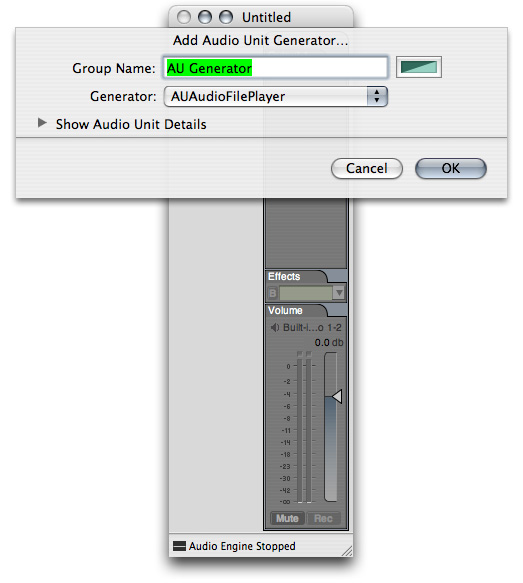

In the dialog, ensure that the AUAudioFilePlayer generator unit is selected in the Generator pop-up. To follow this example, change the Group Name to Player. Click OK.

You can change the group name at any time by double-clicking it in the AU Lab window.

The AU Lab window now shows a stereo input track. In addition, an inspector window has opened for the generator unit. If you close the inspector, you can reopen it by clicking the rectangular "AU" button near the top of the Player track.

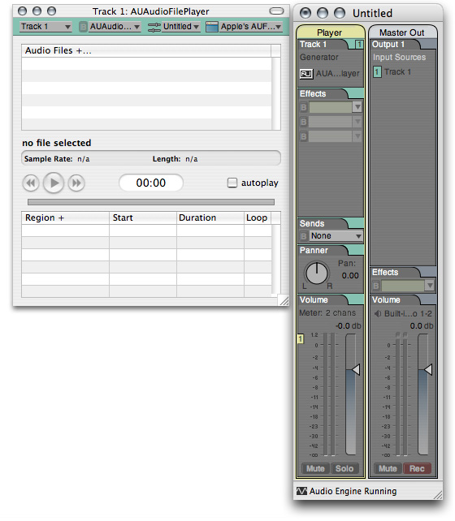

3. Add one or more audio files to the Audio Files list in the player inspector window. Do this by dragging audio files from the Finder, as shown in the figure. Putting some audio files in the player inspector window lets you send audio through the AU Lab application, and through an audio unit that you add to the Player track. Just about any audio file will do. For this example, a music file works well.

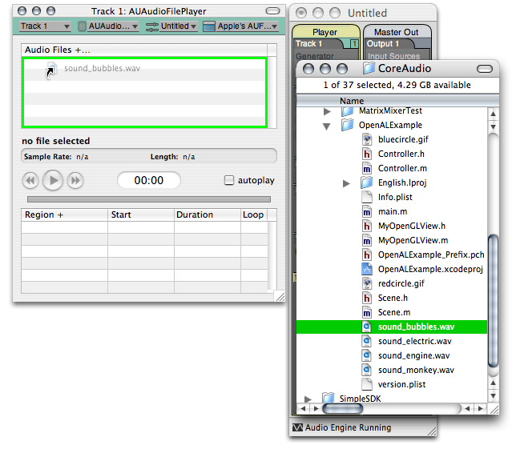

Now AU Lab is configured and ready for you to add an audio unit.

4. To dynamically add an audio unit to the AU Lab host application, click the triangular menu button in the first row of the Effects section in the Player track in AU Lab, as shown in the figure.

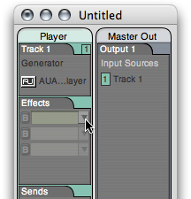

A menu opens, listing all the audio units available on your system, arranged by category and manufacturer. AU Lab gets this list from the Component Manager, which maintains a registry of installed audio units.

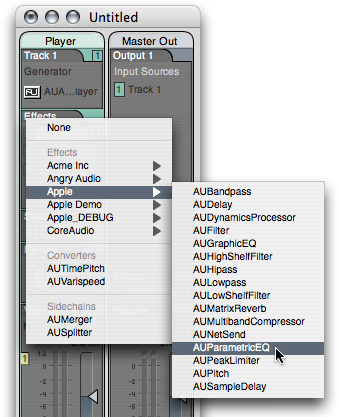

Choose an audio unit from the pop-up. To follow this example, choose the AUParametricEQ audio unit from the Apple submenu. (This audio unit, supplied as part of OS X, is a single-band equalizer with controls for center frequency, gain, and Q.)

AU Lab asks the Component Manager to instantiate the audio unit you have chosen. AU Lab then initializes the audio unit. AU Lab also opens the audio unit’s Cocoa generic view, which appears as a utility window:

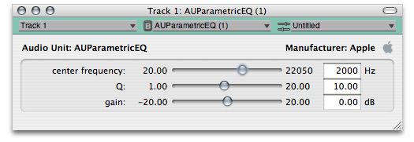

You have now dynamically added the AUParametricEQ audio unit to the running AU Lab host application.

5. To demonstrate the features of the audio unit in AU Lab, click the Play button in the AUAudioFilePlayer inspector to send audio through the audio unit. Vary the sliders in the generic view to hear the audio unit working.

6. To remove the audio unit from the host application, once again click the triangular menu button in the first row of the Effects section in the Player track, as shown in the figure.

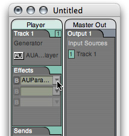

From the pop-up menu, choose Remove AUParametricEQ.

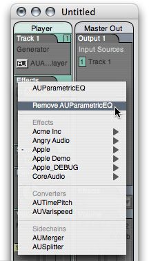

The Component Manager closes the audio unit on behalf of AU Lab. You have now dynamically removed the audio unit, and its features, from the running AU Lab host application.

When you build an audio unit using the Core Audio SDK, you get Component Manager scaffolding for free. You also get comprehensive support for most of the _Audio Unit Specification_. This lets you concentrate on the more interesting aspects of audio unit development: the audio processing and the user interface.

You create an SDK-based audio unit by subclassing the appropriate classes in the SDK’s audio unit C++ class hierarchy. [Appendix: Audio Unit Class Hierarchy](Appendix-%20Audio%20Unit%20Class%20Hierarchy.md#apple-f4xwc4dqnrsv64tfmyxwi33df52wszbpkridimbqgaztenzyfvbuqojnknlte) shows this hierarchy.

Host applications communicate with audio units through their plug-in API and by way of the Component Manager. In all, there are six bodies of code that cooperate to support a running audio unit:

- The audio unit bundle. The bundle wraps the audio unit and its view (if you provide a custom view), and provides identification for the audio unit that lets OS X and the Component Manager use the audio unit.
- The audio unit itself. When you build your audio unit with the Core Audio SDK, as recommended, the audio unit inherits from the SDK’s class hierarchy.
- The audio unit view.
- The Core Audio API frameworks.
- The Component Manager.
- The host application.

Refer to [A Quick Tour of the Core Audio SDK](A%20Quick%20Tour%20of%20the%20Core%20Audio%20SDK.md#apple-f4xwc4dqnrsv64tfmyxwi33df52wszbpkridimbqgaztenzyfvbuqmjrfvjvomi) if you’d like to learn about the rest of the SDK.

The Component Manager acts as a go-between for a host application and the audio units it uses—finding, opening, instantiating, and closing audio units on behalf of the host.

For OS X to recognize your audio units, they must meet certain requirements. They must:

- Be packaged as a component, as defined by the Component Manager
- Have a single entry point that the Component Manager recognizes
- Have a resource (`.rsrc`) file that specifies a system wide unique identifier and version string
- Respond to Component Manager calls

Satisfying these requirements from scratch is a significant effort and requires a strong grasp of the Component Manager API. However, the Core Audio SDK insulates you from this. As demonstrated in the chapter [Tutorial: Building a Simple Effect Unit with a Generic View](Tutorial-%20Building%20a%20Simple%20Effect%20Unit%20with%20a%20Generic%20View.md#apple-f4xwc4dqnrsv64tfmyxwi33df52wszbpkridimbqgaztenzyfvbuqnjnknlti), accommodating the Component Manager requires very little work when you use the SDK.

The OS X Component Manager looks for audio units in some specific locations, one of which is reserved for use by Apple.

When you install your audio units during development or deployment, you typically put them in one of the following two locations:

- `~/Library/Audio/Plug-Ins/Components/`

  Audio units installed here can be used only by the owner of the home folder
- `/Library/Audio/Plug-Ins/Components/`

  Audio units installed here can be used by all users on the computer

It is up to you which of these locations you use or recommend to your users.

The OS X preinstalled audio units go in a location reserved for Apple’s use:

```
/System/Library/Components/
```

The Component Manager maintains a cached registry of the audio units in these locations (along with any other plug-ins it finds in other standard locations). Only registered audio units are available to host applications. The Component Manager refreshes the registry on system boot, on user log-in, and whenever the modification timestamp of one of the three `Components` folders changes.

A host application can explicitly register audio units installed in arbitrary locations by using the Component Manager’s `RegisterComponent`, `RegisterComponentResource`, or `RegisterComponentResourceFile` functions. Audio units registered in this way are available only to the host application that invokes the registration. This lets you use audio units to add features to a host application you are developing, without making your audio units available to other hosts.

Every audio unit on a system must have a unique signature. The _Audio Unit Specification_ takes advantage of this to let host applications know the plug-in API for any audio unit, based on its signature. This section describes how this works.

The Component Manager identifies audio units by a triplet of four-character codes:

- The “type” specifies the general type of functionality provided by an audio unit. In so doing, the type also identifies the audio unit’s plug-in API. In this way, the type code is programmatically significant. For example, a host application knows that any audio unit of type `'aufx'` (for “audio unit effect”) provides DSP functionality.

  The _Audio Unit Specification_ specifies the available type codes for audio units, as well as the plug-in API for each audio unit type.
- The “subtype” describes more precisely what an audio unit does, but is not programmatically significant for audio units.

  For example, OS X includes an effect unit of subtype `'lpas'`, named to suggest that it provides low-pass filtering. If, for your audio unit, you use one of the subtypes listed in the `AUComponent.h` header file in the Audio Unit framework (such as `'lpas'`), you are suggesting to users of your audio unit that it behaves like the named subtype. However, host applications make no assumptions about your audio unit based on its subtype. You are free to use any subtype code, including subtypes named with only lowercase letters.
- The “manufacturer code” identifies the developer of an audio unit.

  Apple expects each developer to register a manufacturer code, as a “creator code,“ on the [Data Type Registration](https://developer.apple.com/datatype/) page. Manufacturer codes must contain at least one uppercase character. Once registered, you can use the same manufacturer code for all your audio units.

In addition to these four-character codes, each audio unit must specify a correctly formatted version number. When the Component Manager registers audio units, it picks the most recent version if more than one is present on a system.

As a component, an audio unit identifies its version as an eight-digit hexadecimal number in its resource (`.rsrc`) file. As you’ll see in [Tutorial: Building a Simple Effect Unit with a Generic View](Tutorial-%20Building%20a%20Simple%20Effect%20Unit%20with%20a%20Generic%20View.md#apple-f4xwc4dqnrsv64tfmyxwi33df52wszbpkridimbqgaztenzyfvbuqnjnknlti), you specify this information using Xcode.

Here is an example of how to construct a version number. It uses an artificially large number to illustrate the format unambiguously. For a decimal version number of `29.33.40`, the hexadecimal equivalent is `0x001d2128`. The format works as follows for this number:

__Figure 1-5__  Constructing an audio unit version number

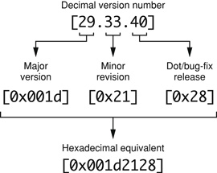

The four most significant hexadecimal digits represent the major version number. The next two represent the minor version number. The two least significant digits represent the dot release number.

When you release a new version of an audio unit, you must ensure that its version number has a higher value than the previous version—not equal to the previous version, and not lower. Otherwise, users who have a previous version of your audio unit installed won’t be able to use the new version.

Audio units are typed, as described above in [Audio Unit Identification](#apple-f4xwc4dqnrsv64tfmyxwi33df52wszbpkridimbqgaztenzyfvbuqnznknltc). When a host application sees an audio unit’s type, it knows how to communicate with it.

Implementing the plug-in API for any given type of audio unit from scratch is a significant effort. It requires a strong grasp of the Audio Unit and Audio Toolbox framework APIs and of the _Audio Unit Specification_. However, the Core Audio SDK insulates you from much of this as well. Using the SDK, you need to implement only those methods and properties that are relevant to your audio unit. (You learn about the audio unit property mechanism in the next chapter, [The Audio Unit](The%20Audio%20Unit.md#apple-f4xwc4dqnrsv64tfmyxwi33df52wszbpkridimbqgaztenzyfvbuqmjsfvjvomi).)

The _Audio Unit Specification_ defines the common interface that audio unit developers and host application developers must support.

The _Audio Unit Specification_ describes:

- The various Apple types defined for audio units, as listed in the “AudioUnit component types and subtypes” enumeration in the `AUComponent.h` header file in the Audio Unit framework
- The functional and behavioral requirements for each type of audio unit
- The plug-in API for each type of audio unit, including required and optional properties

You develop your audio units to conform to the _Audio Unit Specification_. You then test this conformance with the `auval` command-line tool, described in the next section.

The _Audio Unit Specification_ defines the plug-in API for the following audio unit types:

- Effect units (`'aufx'`), such as volume controls, equalizers, and reverbs, which modify an audio data stream
- Music effect units (`'aumf'`), such as loopers, which combine features of instrument units (such as starting and stopping a sample) with features of effect units
- Offline effect units (`'auol'`), which let you do things with audio that aren’t practical in real time, such as time reversal or look-ahead level normalization
- Instrument units (`'aumu'`), which take MIDI and soundbank data as input and provide audio data as output—letting a user play a virtual instrument
- Generator units (`'augn'`), which programmatically generate an audio data stream or play audio from a file
- Data format converter units (`'aufc'`), which change characteristics of an audio data stream such as bit depth, sample rate, or playback speed
- Mixer units (`'aumx'`), which combine audio data streams
- Panner units (`'aupn'`), which distribute a set of input channels, using a spatialization algorithm, to a set of output channels

Apple’s Core Audio team designed the Audio Unit technology around one of the more popular software design patterns, the Model-View-Controller, or MVC. See [Model-View-Controller](https://developer.apple.com/library/archive/documentation/General/Conceptual/CocoaEncyclopedia/Model-View-Controller/Model-View-Controller.html#//apple_ref/doc/uid/TP40010810-CH14) for more about this pattern.

Keep the MVC pattern in mind as you build your audio units:

- The audio unit serves as the model, encapsulating all of the knowledge to perform the audio work
- The audio unit’s view serves, naturally, as the view, displaying the audio unit’s current settings and allowing a user to change them
- The Audio Unit Event API, and the code in an audio unit and its view that calls this API, corresponds to the controller, supporting communication between the audio unit, its view, and a host application

Host applications are responsible—with the help of the Component Manager—for finding, opening, and closing audio units. Audio units, in turn, need to be findable, openable, and closable. Your audio unit gets these attributes when you build it from the Core Audio SDK and use the Xcode audio unit templates.

There is a two-step sequence for an audio unit becoming available for use in a host. These two steps are opening and initializing. Opening an audio unit amounts to instantiating an object of the audio unit’s main class. Initializing amounts to allocating resources so the audio unit is ready to do work.

To be a well-behaved, host-friendly plug-in, your audio unit’s instantiation must be fast and lightweight. Resource intensive startup work for an audio unit goes into the initialization step. For example, an instrument unit that employs a large bank of sample data should load it on initialization, not instantiation.

For more on finding, opening, and closing from your perspective as an audio unit developer, see [Audio Unit Initialization and Uninitialization](The%20Audio%20Unit.md#apple-f4xwc4dqnrsv64tfmyxwi33df52wszbpkridimbqgaztenzyfvbuqmjsfvjvomy) and [Closing](The%20Audio%20Unit.md#apple-f4xwc4dqnrsv64tfmyxwi33df52wszbpkridimbqgaztenzyfvbuqmjsfvjvona) in [The Audio Unit](The%20Audio%20Unit.md#apple-f4xwc4dqnrsv64tfmyxwi33df52wszbpkridimbqgaztenzyfvbuqmjsfvjvomi).

If you choose to add copy protection to your audio unit, it’s especially important to consider the audio unit’s opening sequence. The time for copy protection is during audio unit initialization—not instantiation. Therefore, you put copy protection code into an override of the `Initialize` method from the SDK’s `AUBase` superclass. You do not put copy protection code into an audio unit’s constructor.

Here is a scenario where this matters. Suppose a user doesn’t have the required hardware dongle for your (copy protected) audio unit. Perhaps he left it at home when he brought his laptop to a performance. If your audio unit invokes its copy protection on instantiation, this could prevent a host application from opening. If your audio unit invokes its copy protection on initialization, as recommended, the performer could at least use the host application.

An audio unit can be instantiated any number of times by a host application and by any number of hosts. More precisely, the Component Manager invokes audio unit instantiation on behalf of host applications. The Component Manager infrastructure ensures that each audio unit instance exists and behaves independently.

You can demonstrate multiple instantiation in AU Lab. First add one instance of the AUParametricEQ effect unit to an AU Lab document, as described above in [Tutorial: Using an Audio Unit in a Host Application](#apple-f4xwc4dqnrsv64tfmyxwi33df52wszbpkridimbqgaztenzyfvbuqnznknltq). Then invoke the pop-up menus in additional rows of the Effects section in the Player track. You can add as many one-band parametric equalizers to the track as you like. Each of these instances of the audio unit behaves independently, as you can see by the varied settings in the figure:

__Figure 1-6__  Multiple instantiation of audio units in AU Lab

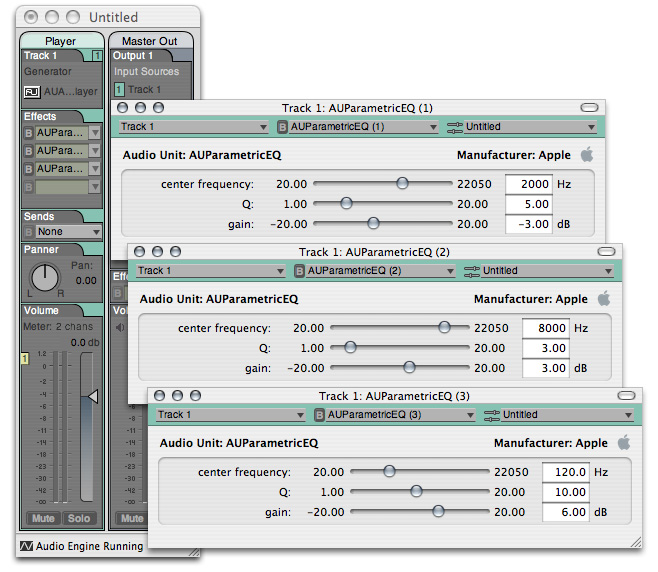

Host applications can connect audio units to each other so that the output of one audio unit feeds the input of the next. Such an interconnected series of audio units is called an _audio processing graph_. In the context of a graph, each connected audio unit is called a _node_.

When you worked through the [Tutorial: Using an Audio Unit in a Host Application](#apple-f4xwc4dqnrsv64tfmyxwi33df52wszbpkridimbqgaztenzyfvbuqnznknltq) section earlier in this chapter, the AU Lab application constructed an audio processing graph for you. This graph consisted of the AUAudioFilePlayer generator unit, the AUParametricEQ effect unit, and finally (not represented in the user interface of AU Lab) the Apple-supplied AUHAL I/O unit that interfaces with external hardware such as loudspeakers.

[Audio Processing Graph Connections](The%20Audio%20Unit.md#apple-f4xwc4dqnrsv64tfmyxwi33df52wszbpkridimbqgaztenzyfvbuqmjsfvjvomjx) provides details on how these connections work.

The Audio Processing Graph API, declared in the Audio Toolbox framework, provides interfaces for assisting host applications to create and manage audio processing graphs. When a host application employs this API, it uses an opaque data type called a _graph object_ (of type AUGraph).

Some applications, such as AU Lab, always use graph objects when interconnecting audio units. Others, like Logic, connect audio units to each other directly. An individual audio unit, however, is not aware whether its connections are managed by a graph object on behalf of a host application, or by a host directly.

Audio data flow in graphs proceeds from the first (input) to last (output) node, as you’d expect. Control, however, flows from the last node back to the first. In Core Audio, this is called the _pull model_. The host application is in charge of invoking the pull.

You can think of the pull model in terms of a straw in a glass of water. The water in the glass represents fresh audio data waiting to be processed. The straw represents an audio processing graph, or even a single audio unit. Acting as a host application, you begin the flow of audio data by “pulling” (sipping) on the end of the straw. Specifically, a host application initiates the flow of audio data by calling the rendering method of the final node in a graph. Each sip that you take through the straw corresponds to another pull of a slice of audio data frames—another call to the final node’s rendering method.

Before audio or control flow can start, the host application performs the work to hook up audio units to each other. In a case such as the one shown in the figure, the host also makes connections to and from the audio processing graph. But hosts do not necessarily feed audio data to graphs that they use. In a case where the first audio unit in a graph is a generator unit, there is no input connection; the generator provides audio data algorithmically or by playing a file.

Figure 1-7 shows the pull model in the particular case of a host application employing two effect units in sequence.

__Figure 1-7__  The pull model in action with two effect units

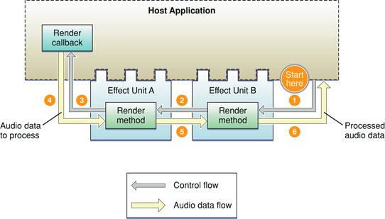

Here is how the pull proceeds in Figure 1-7:

1. The host application calls the render method of the final node (effect unit B) in the graph, asking for one slice worth of processed audio data frames.
2. The render method of effect unit B looks in its input buffers for audio data to process, to satisfy the call to render. If there is audio data waiting to be processed, effect unit B uses it. Otherwise, and as shown in the figure, effect unit B (employing a superclass in the SDK’s audio unit class hierarchy) calls the render method of whatever the host has connected to effect unit B’s inputs. In this example, effect unit A is connected to B’s inputs—so effect unit B pulls on effect unit A, asking for a slice audio data frames.
3. Effect unit A behaves just as effect unit B does. When it needs audio data, it gets it from its input connection, which was also established by the host. The host connected effect unit A’s inputs to a render callback in the host. Effect unit A pulls on the host’s render callback.
4. The host’s render callback supplies the requested audio data frames to effect unit A.
5. Effect unit A processes the slice of data supplied by the host. Effect unit A then supplies the processed audio data frames that were previously requested (in step 2) to effect unit B.
6. Effect unit B processes the slice of data provided by effect unit A. Effect unit B then supplies the processed audio data frames that were originally requested (in step 1) to the host application. This completes one cycle of pull.

Audio units normally do not know whether their inputs and outputs are connected to other audio units, or to host applications, or to something else. Audio units simply respond to rendering calls. Hosts are in charge of establishing connections, and superclasses (for audio units built with the Core Audio SDK) take care of implementing the pull.

As an audio unit developer, you don’t need to work directly with audio processing graphs except to ensure that your audio unit plays well with them. You do this, in part, by ensuring that your audio unit passes Apple’s validation test, described in [Audio Unit Validation with the auval Tool](#apple-f4xwc4dqnrsv64tfmyxwi33df52wszbpkridimbqgaztenzyfvbuqnznknltg). You should also perform testing by hooking up your audio unit in various processing graphs using host applications, as described in [Audio Unit Testing and Host Applications](#apple-f4xwc4dqnrsv64tfmyxwi33df52wszbpkridimbqgaztenzyfvbuqnznknlti).

Audio units process audio data, of course. They also need to know how to stop processing gracefully, and how to modify their processing based on user adjustments. This section briefly discusses these things. [The Audio Unit](The%20Audio%20Unit.md#apple-f4xwc4dqnrsv64tfmyxwi33df52wszbpkridimbqgaztenzyfvbuqmjsfvjvomi) describes processing in greater detail.

An audio unit that processes audio data, such as an effect unit, works in terms of rendering cycles. In each rendering cycle, the audio unit:

- Gets a slice of fresh audio data frames to process. It does this by calling the rendering callback function that has been registered in the audio unit.
- Processes the audio data frames.
- Puts the resulting audio data frames into the audio unit’s output buffers.

An audio unit does this work at the beck and call of its host application. The host application also sets number of audio data frames per slice. For example, AU Lab uses 512 frames per slice as a default, and you can vary this number from 24 to 4,096. See [Testing with AU Lab](#apple-f4xwc4dqnrsv64tfmyxwi33df52wszbpkridimbqgaztenzyfvbuqnznknltcni).

The programmatic call to render the next slice of frames can arrive from either of two places:

- From the host application itself, in the case of the host using the audio unit directly
- From the downstream neighbor of the audio unit, in the case of the audio unit being part of an audio processing graph

Audio units behave exactly the same way regardless of the calling context—that is, regardless of whether it is a host application or a downstream audio unit asking for audio data.

Audio units also need to be able to gracefully stop rendering. For example, an audio unit that implements an IIR filter uses an internal buffer of samples. It uses the values of these buffered samples when applying a frequency curve to the samples it is processing. Say that a user of such an audio unit stops playing an audio file and then starts again at a different point in the file. The audio unit, in this case, must start with an empty processing buffer to avoid inducing artifacts.

When you develop an audio unit’s DSP code, you implement a `Reset` method to return the DSP state of the audio unit to what it was when the audio unit was first initialized. Host applications call the `Reset` method as needed.

While an audio unit is rendering, a user can adjust the rendering behavior using the audio unit’s view. For example, in a parametric filter audio unit, a user can adjust the center frequency. It’s also possible for host applications to alter rendering using parameter automation, described in the next section.

Parameters let users adjust audio units. For instance, Apple’s low-pass filter audio unit has parameters for cut-off frequency and resonance.

_Parameter automation_ lets users program parameter adjustments along a time line. For example, a user might want to use a low pass filter audio unit to provide an effect like a guitar wah-wah pedal. With parameter automation, the user could record the wah-wah effect and make it part of a musical composition. The host application records the manual changes along with synchronization information, tying the changes to time markers for an audio track. The host can then play back the parameter changes to provide automated control of the audio unit.

Host applications can also provide the ability for a user to indirectly specify parameter manipulation. For example, a host could let a user draw a gain or panning curve along an audio track’s waveform representation. The host could then translate such graphical input into parameter automation data.

Parameter automation relies on three things:

- The ability of an audio unit to change its parameter values programmatically on request from a host application
- The ability of an audio unit view to post notifications as parameter values are changed by a user
- The ability of a host application to support recording and playback of parameter automation data

Some hosts that support parameter automation with audio units are Logic Pro, Ableton Live, and Sagan Metro.

Parameter automation uses the Audio Unit Event API, declared in the `AudioUnitUtilties.h` header file as part of the Audio Toolbox framework. This thread-safe API provides a notification mechanism that supports keeping audio units, their views, and hosts in sync.

To support parameter automation in your audio unit, you must create a custom view. You add automation support to the view’s executable code, making use of the Audio Unit Event API to support some or all of the following event types:

- Parameter _gestures_, which include the `kAudioUnitEvent_BeginParameterChangeGesture` and `kAudioUnitEvent_EndParameterChangeGesture` event types
- Parameter value changes, identified by the `kAudioUnitEvent_ParameterValueChange` event type
- Property changes, identified by the `kAudioUnitEvent_PropertyChange` event type

In some unusual cases you may need to add support for parameter automation to the audio unit itself. For example, you may create a bandpass filter with adjustable upper and lower corner frequencies. Your audio unit then needs to ensure that the upper frequency is never set below the lower frequency. When an audio unit invokes a parameter change in a case like this, it needs to issue a parameter change notification.

[The Audio Unit View](The%20Audio%20Unit%20View.md#apple-f4xwc4dqnrsv64tfmyxwi33df52wszbpkridimbqgaztenzyfvbuqmjtfvjvomi) and [Defining and Using Parameters](The%20Audio%20Unit.md#apple-f4xwc4dqnrsv64tfmyxwi33df52wszbpkridimbqgaztenzyfvbuqmjsfvjvomjv) give more information on parameter automation.

Apple strongly recommends validating your audio units using the `auval` command-line tool during development. The `auval` tool (named as a contraction of "audio unit validation") comes with OS X. It performs a comprehensive suite of tests on:

- An audio unit’s plug-in API, as defined by its programmatic type
- An audio unit’s basic functionality including such things as which audio data channel configurations are available, time required to instantiate the audio unit, and the ability of the audio unit to render audio

The `auval` tool tests only an audio unit proper. It does not test any of the following:

- Audio unit views
- Audio unit architecture, in terms of using the recommended model-view-controller design pattern for separation of concerns
- Correct use of the Audio Unit Event API
- Quality of DSP, quality of audio generation, or quality of audio data format conversion

The `auval` tool can validate every type of audio unit defined by Apple. When you run it, it outputs a test log and summarizes the results with a “pass” or "fail” indication.

For more information, refer to the `auval` built-in help system. To see `auval` help text, enter the following command at a prompt in the Terminal application:

```
auval -h
```


When you build to the _Audio Unit Specification_, you’ve done the right thing. Such an audio unit should work with all hosts. But practically speaking, development isn’t complete until you test your audio units in commercial applications. The reasons include:

- Evolution of the Core Audio frameworks and SDK
- Variations across host application versions
- Idiosyncrasies in the implementation of some host applications

As host applications that recognize audio units proliferate, the task of testing your audio unit in all potential hosts becomes more involved.

The situation is somewhat analogous to testing a website in various browsers: your code may perfectly fit the relevant specifications, but nonconformance in one or another browser requires you to compensate.

With this in mind, the following sections provide an overview of host-based audio unit testing.

AU Lab, the application you used in Tutorial: Using an Audio Unit in a Host Application, is the reference audio unit host. It is in active development by Apple’s Core Audio team. They keep it in sync with the `auval` tool, with the Core Audio frameworks and SDK, and with OS X itself. This makes AU Lab the first place to test your audio units.

Testing your audio unit with AU Lab lets you test:

- Behavior, in terms of being found by a host, displayed in a menu, and opened
- View, both generic and custom
- Audible performance
- Interaction with other audio units when placed in an audio processing graph
- I/O capabilities, such as sidechains and multiple outputs, as well as basic testing of monaural and stereophonic operation

In OS X v10.4 “Tiger,” AU Lab lets you test the following types of audio units:

- Converter units
- Effect units
- Generator units
- Instrument units

AU Lab lets you control some of its hosting characteristics, which lets you test the behavior of your audio unit under varying conditions. For example, you can change the number of frames of audio data to process in each rendering cycle. You do this using Devices Preferences.

In AU Lab, choose Preferences from the AU Lab menu. Click Devices to show Devices Preferences:

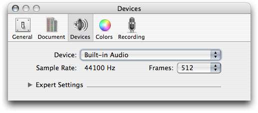

Click the Frames pop-up menu. You can choose the number of frames for your audio unit to process in each rendering cycle:

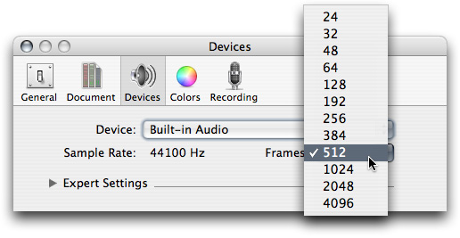

Click the disclosure triangle for Expert Settings. You can vary the slider to choose the percentage of CPU time to devote to audio processing. This lets you test the behavior of your audio unit under varying load conditions:

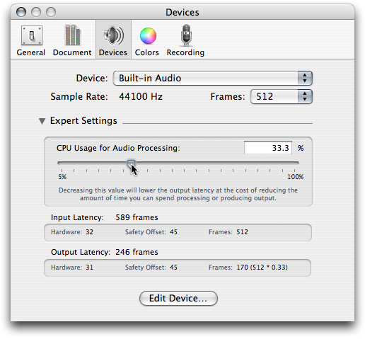

As an audio unit developer, you'll want to stay up to date with the host applications your target market is using. Apple recommends that you test your audio units with, at least, Apple’s suite of professional host applications:

- GarageBand
- Logic Pro
- Soundtrack Pro
- Final Cut Pro

There are many third-party and open source applications that support audio units, among them Ableton Live, Amadeus, Audacity, Cubase, Digital Performer, DSP-Quattro, Peak, Rax, and Metro.

[Next](The%20Audio%20Unit.md)[Previous](Introduction.md)

