> 导航：[总目录](../../../README.md) · [documentation](../../../_indexes/documentation.md) · [Audio Unit Programming Guide](Introduction.md)


[Next](A%20Quick%20Tour%20of%20the%20Core%20Audio%20SDK.md)[Previous](The%20Audio%20Unit.md)

# The Audio Unit View

Almost every audio unit needs a graphical interface to let the user adjust the audio unit’s operation and see what it’s doing. In Core Audio terminology, such a graphical interface is called a view. When you understand how views work and how to build them, you can add a great deal of value to the audio units you create.

There are two main types of views:

- _Generic views_ provide a functional yet decidedly non-flashy interface. You get a generic view for free. It is built for you by the host application that opens your audio unit, based on parameter and property definitions in your audio unit source files.
- _Custom views_ are graphical user interfaces that you design and build. Creating a great custom view may entail more than half of the development time for an audio unit. For your effort you can offer something to your users that is not only more attractive but more functional as well.

  You may choose to wait on developing a custom view until after your audio unit is working, or you may forgo the custom view option entirely. If you do create a custom view, you can use Carbon or Cocoa.

From the standpoint of a user, a view _is_ an audio unit. From your standpoint as a developer, the situation is a bit more subtle.

You build a view to be logically separate from the audio unit executable code, yet packaged within the same bundle. To achieve this programmatic separation, Apple recommends that you develop your custom views so that they would work running in a separate address space, in a separate process, and on a separate machine from the audio unit executable code. For example, you pass data between the audio unit executable code and its view only by value, never by reference.

Without impinging on this formal separation, however, it’s often convenient to share a header file between an audio unit executable code and its view. You’ll see this done in the SDK’s FilterDemo project. A shared header file can provide, for example, data types and constants for custom properties that an audio unit’s executable code and its view can both use.

Both generic and custom views make use of a notification mechanism to communicate with their associated audio unit executable code, as described in [Parameter and Property Events](#apple-f4xwc4dqnrsv64tfmyxwi33df52wszbpkridimbqgaztenzyfvbuqmjtfvjvoni).

Host applications create a generic view for your audio unit based on your parameter and property definitions. Starting with OS X v10.4, Tiger, host applications can generate Carbon or Cocoa generic views.

Here’s the Cocoa generic view for the FilterDemo audio unit, one of the sample projects in the Core Audio SDK:

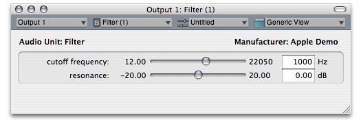

The audio unit associated with this view has two continuously variable parameters, each represented in the view by a simple slider along with a text field showing the parameter’s current value. The generic view for your audio unit will have a similar look.

Table 3-1 describes where each user interface element in a generic view comes from. The “Source of value” column in the table refers to files you see in an audio unit Xcode project built using the “Audio Unit Effect with Cocoa View” template.

__Table 3-1__  User interface items in an audio unit generic view

| User interface item | Example value | Source of value |
| Audio unit name, at upper left of view utility window | Audio Unit: Filter | `NAME` defined constant in the`<className>.r` file |
| Audio unit name, in title bar of view utility window and in pop-up | Filter | `NAME` defined constant in the `<className>.r` file |
| Manufacturer name, at upper right of view utility window | Apple Demo | `NAME` defined constant in the `<className>.r` file |
| Parameter name | cutoff frequency | `kParameterOneName` CFStringRef string value in the `<className>.h` file |
| Parameter maximum value | 22050 | `GetParameterInfo` method in the `<className>.cpp` file |
| Parameter minimum value | 12.00 | `GetParameterInfo` method in the `<className>.cpp` file |
| Parameter default value | 1000 | `kDefaultValue_ParamOne` float value from the `<className>.h` file |
| Measurement units name | Hz | Measurement unit as specified in the `GetParameterInfo` method in the `<className>.cpp` file. |
| Slider | User adjustable. Initially set to indicate the parameter default value. | The generic view mechanism presents a slider for this parameter. This is because the parameter unit of measurement, as defined in the `GetParameterInfo` method, is “linear gain.“ |

As shown next, a custom view can provide significantly more value and utility than a generic view.

When a host opens your audio unit, it asks if there’s a custom view available. If so, it can use it as described in [View Instantiation and Initialization](#apple-f4xwc4dqnrsv64tfmyxwi33df52wszbpkridimbqgaztenzyfvbuqmjtfvjvony).

Here’s the custom view for the same audio unit described in The Generic View, namely, the FilterDemo audio unit from the Core Audio SDK:

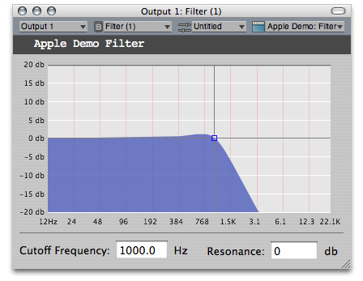

The primary feature of this custom view is a realtime frequency response curve. This makes the custom view (and, by association, the audio unit) more attractive and far more useful. Instead of seeing just a pair of numbers, a user can now see the frequency response, including how filter resonance and cutoff frequency influence the response. No matter what sort of audio unit you build, you can provide similar benefits to users when you include a custom view with your audio unit.

The advantages of custom views over generic views include:

- The ability to hide unneeded detail, or to provide progressive disclosure of controls
- The ability to provide support for parameter automation
- Choice of user-interface controls, for example knobs, faders, or horizontal sliders
- Much more information for the user through real-time graphs, such as frequency response curves
- A branding opportunity for your company

The SDK’s FilterDemo audio unit project is a good example to follow when creating a custom view for your audio unit. See [Tutorial: Demonstrating Parameter Gestures and Audio Unit Events](#apple-f4xwc4dqnrsv64tfmyxwi33df52wszbpkridimbqgaztenzyfvbuqmjtfvjvooa) later in this chapter for more on custom views.

When a host application opens an audio unit, it can query the audio unit as to whether it has a custom view. The host does this with code such as this snippet from the CocoaAUHost project in the SDK:

__Listing 3-1__  A host application gets a Cocoa custom view from an audio unit

```swift
if (AudioUnitGetProperty (
        inAU,                       // the audio unit the host is checking
        kAudioUnitProperty_CocoaUI, // the property the host is querying
        kAudioUnitScope_Global,
        0,
        cocoaViewInfo,
        &dataSize) == noErr) {
    CocoaViewBundlePath =            // the host gets the path to the view bundle
        (NSURL *) cocoaViewInfo -> mCocoaAUViewBundleLocation;
    factoryClassName    =            // the host gets the view's class name
        (NSString *) cocoaViewInfo -> mCocoaAUViewClass[0];
}
```

If you do not supply a custom view with your audio unit, the host will build a generic view based on your audio unit’s parameter and property definitions.

Here is what happens, in terms of presenting a view to the user, when a host opens an audio unit:

1. The host application calls the `GetProperty` method on an audio unit to find out if it has a custom view, as shown in Listing 3-1. If the audio unit provides a Cocoa view, the audio unit should implement the `kAudioUnitProperty_CocoaUI` property. If the audio unit provides a Carbon view, the audio unit should implement the `kAudioUnitProperty_GetUIComponentList` property. The rest of this sequence assumes the use of a Cocoa custom view.
2. The host calls the `GetPropertyInfo` method for the `kAudioUnitProperty_CocoaUI` property to find out how many Cocoa custom views are available. As a short cut, a host can skip the call to `GetPropertyInfo`. In this case, the host would take the first view in the view class array by using code such as shown in the listing above, using an array index of `0`: `factoryClassName = (NSString *) cocoaViewInfo -> mCocoaAUViewClass[0];`. In this case, skip ahead to step 4.
3. The audio unit returns the size of the `AudioUnitCocoaViewInfo` structure as an integer value, indicating how many Cocoa custom views are available. Typically, developers create one view per audio unit.
4. The host examines the value of _cocoaViewInfo_ to find out where the view bundle is and what the main view class is for the view (or for the specified view if the audio unit provides more than one).
5. The host loads the view bundle, starting by loading the main view class to instantiate it.

There are some rules about how to structure the main view class for a Cocoa view:

- The view must implement the `AUCocoaUIBase` protocol. This protocol specifies that the view class acts as a factory for views, and returns an `NSView` object using the `uiViewForAudioUnit:withSize:` method. This method tells the view which audio unit owns it, and provides a hint regarding screen size for the view in pixels (using an `NSSize` structure).

```objc
- (NSView *) uiViewForAudioUnit: (AudioUnit) inAudioUnit
                       withSize: (NSSize) inPreferredSize;
```
- If you’re using a nib file to construct the view (as opposed to generating the view programmatically), the owner of the nib file is the main (factory) class for the view.

An audio unit’s view should work whether the audio unit is simply instantiated or whether it has been initialized. The view should continue to work if the host uninitializes the audio unit. That is, a view should not assume that its audio unit is initialized. This is important enough in practice that the `auval` tool includes a test for retention of parameter values across uninitialization and reinitialization.

Audio unit automation (as described back in [Supporting Parameter Automation](Audio%20Unit%20Development%20Fundamentals.md#apple-f4xwc4dqnrsv64tfmyxwi33df52wszbpkridimbqgaztenzyfvbuqnznknltcmy)) is a feature implemented by host applications and custom views. It relies on parameter and property events—which in turn rely on the Audio Unit Event API, described next.

Hosts, views, and audio units can take advantage of Core Audio notifications to ensure that all three of these entities stay in sync in terms of parameter adjustments. The notifications, accessed through the Audio Unit Event API, work no matter which of the three entities invokes a parameter change. The API is declared in the `AudioUnitUtilities.h` header file in the Audio Toolbox framework.

The Audio Unit Event API defines an `AudioUnitEvent` data type, shown in Listing 3-2:

__Listing 3-2__  The AudioUnitEvent structure

```
typedef struct AudioUnitEvent {
    AudioUnitEventType mEventType;          // 1
        union {
            AudioUnitParameter mParameter;  // 2
            AudioUnitProperty mProperty;    // 3
        } mArgument;
} AudioUnitEvent;
```

Here’s how this structure works:

1. Identifies the type of the notification, as defined in the `AudioUnitEventType` enumeration.
2. Identifies the parameter involved in the notification, for notifications that are begin or end gestures or changes to parameters. (See [Parameter Gestures](#apple-f4xwc4dqnrsv64tfmyxwi33df52wszbpkridimbqgaztenzyfvbuqmjtfvjvona).) The `AudioUnitParameter` data type is used by the Audio Unit Event API and not by the Audio Unit framework, even though it is defined in the Audio Unit framework.
3. Identifies the property involved in the notification, for notifications that are property change notifications.

A corresponding `AudioUnitEventType` enumeration lists the various defined `AudioUnitEvent` event types, shown in Listing 3-3:

__Listing 3-3__  The AudioUnitEventType enumeration

```
typedef UInt32 AudioUnitEventType;

enum {
    kAudioUnitEvent_ParameterValueChange        = 0,
    kAudioUnitEvent_BeginParameterChangeGesture = 1,
    kAudioUnitEvent_EndParameterChangeGesture   = 2,
    kAudioUnitEvent_PropertyChange              = 3
};
```

**kAudioUnitEvent_ParameterValueChange**
: Indicates that the notification describes a change in the value of a parameter

**kAudioUnitEvent_BeginParameterChangeGesture**
: Indicates that the notification describes a parameter “begin” gesture; a parameter value is about to change

**kAudioUnitEvent_EndParameterChangeGesture**
: Indicates that the notification describes a parameter “end” gesture; a parameter value has finished changing

**kAudioUnitEvent_PropertyChange**
: Indicates that the notification describes a change in the value of an audio unit property

User-interface events that signal the start or end of a parameter change are called _gestures_. These events can serve to pass notifications among a host, a view, and an audio unit that a parameter is about to be changed, or has just finished being changed. Like parameter and property changes, gestures are communicated using the Audio Unit Event API. Specifically, gestures use the `kAudioUnitEvent_BeginParameterChangeGesture` and `kAudioUnitEvent_EndParameterChangeGesture` event types, as shown in [Listing 3-3](#apple-f4xwc4dqnrsv64tfmyxwi33df52wszbpkridimbqgaztenzyfvbuqmjtfvjvomjq), above.

For basic parameter adjustment, Core Audio provides the `AudioUnitSetParameter` function, declared in the `AUComponent.h` header file in the Audio Unit framework. When a host or a view calls this function, it sets the specified parameter in the audio unit by invoking the `SetParameter` method in the audio unit. It does not provide notification to support automation or updating of views.

To add notification that a parameter has changed, a host or custom view follows a call to the `AudioUnitSetParameter` function with a call to the `AUParameterListenerNotify` function from the Audio Unit Event API in the `AudioUnitUtilities.h` header file.

To set a parameter and notify listeners in one step, a host or a custom view calls the `AUParameterSet` function, also from the Audio Unit Event API.

Sometimes an audio unit itself changes the value of one of its parameters. In such a case, it should issue a notification about the value change. For a discussion on this, refer back to [Defining and Using Parameters](The%20Audio%20Unit.md#apple-f4xwc4dqnrsv64tfmyxwi33df52wszbpkridimbqgaztenzyfvbuqmjsfvjvomjv) in The Audio Unit.

This mini-tutorial illustrates how gestures and audio unit events work by:

- Instantiating two views for an audio unit
- Performing adjustments in one of the views while observing the effect in the other view

Along the way, this tutorial:

- Introduces you to compiling an audio unit project with Xcode
- Shows how AU Lab can display a generic view and a custom view for the same audio unit
- Shows how a custom property supports communication between an audio unit and a custom view

Before you start, make sure that you’ve installed Xcode and the Core Audio SDK, both of which are part of Apple’s Xcode Tools installation.

1. Open the `FilterDemo.xcodeproj` Xcode project file in the `Developer/Examples/CoreAudio/AudioUnits/FilterDemo` folder.

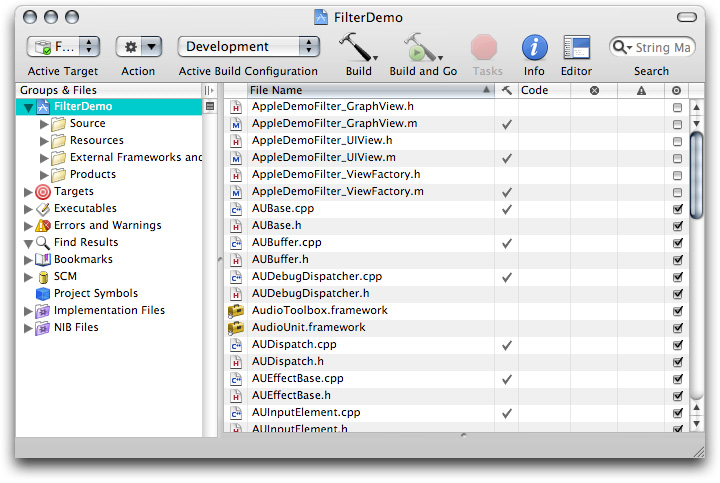

2. Click Build to build the audio unit project. (You may see some warnings about “non-virtual destructors.“ Ignore these warnings.)

Xcode creates a new `build` folder inside the `FilterDemo` project folder.

3. Open the `build` folder and look inside the `Development` target folder.

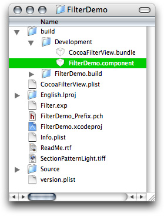

The newly built audio unit bundle is named `FilterDemo.component`, as shown in the figure.

4. Copy the `FilterDemo.component` bundle to the `~/Library/Audio/Plug-Ins/Components` folder. In this location, the newly built audio unit is available to host applications.

5. Launch the AU Lab audio unit host application (in `/Developer/Applications/Audio/`) and create a new AU Lab document. Unless you've configured AU Lab to use a default document style, the Create New Document window opens. If AU Lab was already running, choose File > New to get this window.


Ensure that the configuration matches the settings shown in the figure: Built-In Audio for the Audio Device, Line In for the Input Source, and Stereo for Output Channels. Leave the window's Inputs tab unconfigured; you will specify the input later. Click OK.

A new AU Lab window opens, showing the output channel you specified.


6. Click the triangular menu button in the one row of the Effects section in the Master Out track in AU Lab, as shown in the figure.

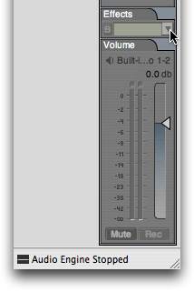

In the menu that opens, choose the Filter audio unit from the Apple Demo group:

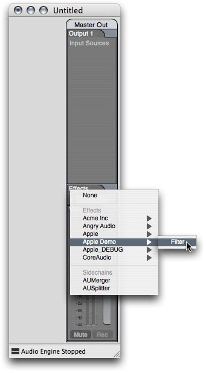

The custom view for the Filter audio unit opens.

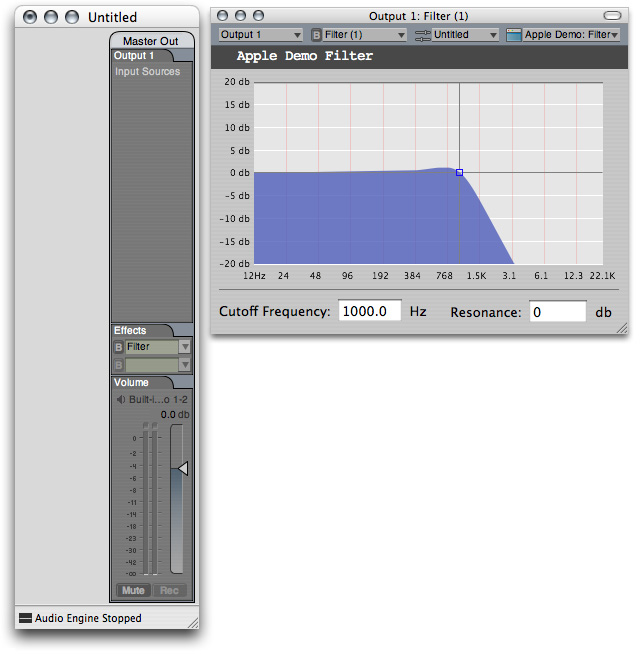

The custom view’s frequency response curve is drawn in real time based on the audio unit’s actual frequency response. The audio unit makes its frequency response data available to the custom view by declaring a custom property. The audio unit keeps the value of its custom property up to date. The custom view queries the audio unit’s custom property to draw the frequency response curve.

7. Option-click the audio unit name in the Effects row.

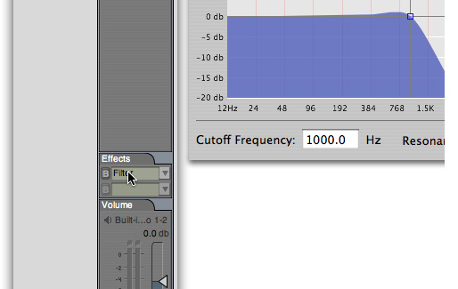

A second instance of a view for the Filter audio unit opens.

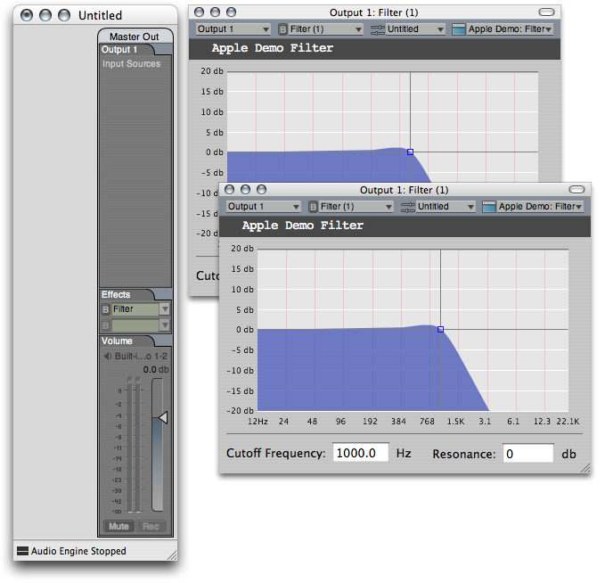

8. Click the view type pop-up menu in one instance of the audio unit’s view, as shown in the figure:

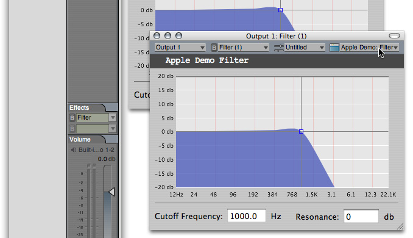

In the menu that opens, choose the Generic View item:

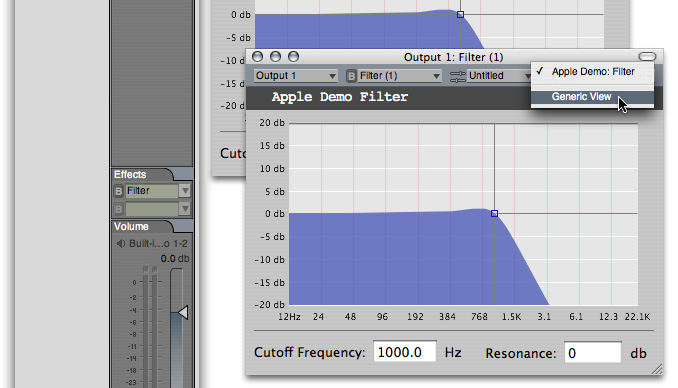

The view changes to the generic view, as shown in the next figure. You are now set up to demonstrate gestures and audio unit events.

9. Click and hold one of the sliders in the generic view, as shown in the figure. When you click, observe that the crosshairs in the custom view become highlighted in bright blue. They remain highlighted as long as you hold down the mouse button.

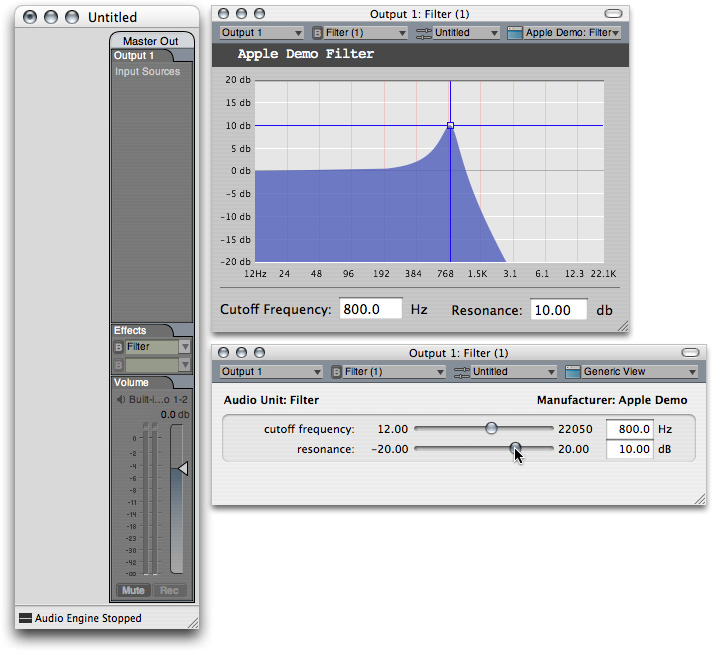

As you move the slider in the generic view, frequency response curve in the custom view keeps pace with the new setting.

- The highlighting and un-highlighting of the crosshairs in the custom view, when you click and release on a slider in the generic view, result from gesture events.
- The changes in the frequency response curve in the custom view, as you move a slider in the generic view, result from parameter change events

10. Finally, click and hold at the intersection of the crosshairs in the custom view. When you click, observe that the sliders in the generic view become highlighted. As you move the crosshairs in the custom view, the sliders in the generic view keep pace with the new settings.

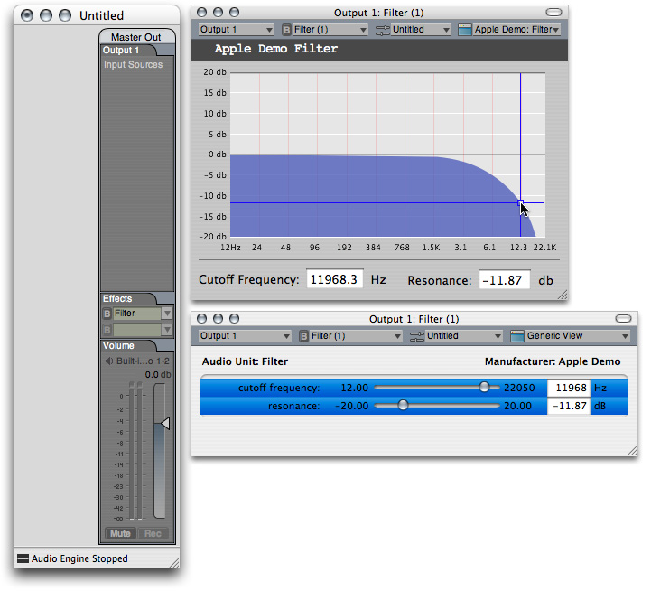

This demonstrates that both views, and the audio unit itself, remain in sync by way of audio unit events.

[Next](A%20Quick%20Tour%20of%20the%20Core%20Audio%20SDK.md)[Previous](The%20Audio%20Unit.md)

