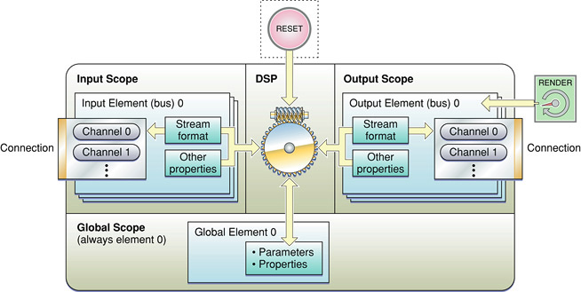

> 导航：[总目录](../../../README.md) · [documentation](../../../_indexes/documentation.md) · [Audio Unit Programming Guide](Introduction.md)


[Next](The%20Audio%20Unit%20View.md)[Previous](Audio%20Unit%20Development%20Fundamentals.md)

# The Audio Unit

When you develop an audio unit, you begin with the part that performs the audio work. This part exists within the `MacOS` folder inside the audio unit bundle as shown in [Figure 1-2](Audio%20Unit%20Development%20Fundamentals.md#apple-f4xwc4dqnrsv64tfmyxwi33df52wszbpkridimbqgaztenzyfvbuqnznknlto). You can optionally add a custom user interface, or view, as described in the next chapter, [The Audio Unit View](The%20Audio%20Unit%20View.md#apple-f4xwc4dqnrsv64tfmyxwi33df52wszbpkridimbqgaztenzyfvbuqmjtfvjvomi).

In this chapter you learn about the architecture and programmatic elements of an audio unit. You also learn about the steps you take when you create an audio unit.

The internal architecture of an audio unit consists of scopes, elements, connections, and channels, all of which serve the audio processing code. Figure 2-1 illustrates these parts as they exist in a typical effect unit. This section describes each of these parts in turn. For discussion on the section marked _DSP_ in the figure, representing the audio processing code in an effect unit, see [Synthesis, Processing, and Data Format Conversion Code](#apple-f4xwc4dqnrsv64tfmyxwi33df52wszbpkridimbqgaztenzyfvbuqmjsfvjvomju).

__Figure 2-1__  Audio unit architecture for an effect unit



An audio unit _scope_ is a programmatic context. Unlike the general computer science notion of scopes, however, audio unit scopes cannot be nested. Each scope is a discrete context.

You use scopes when writing code that sets or retrieves values of parameters and properties. For example, Listing 2-1 shows an implementation of a standard `GetProperty` method, as used in the effect unit you build in [Tutorial: Building a Simple Effect Unit with a Generic View](Tutorial-%20Building%20a%20Simple%20Effect%20Unit%20with%20a%20Generic%20View.md#apple-f4xwc4dqnrsv64tfmyxwi33df52wszbpkridimbqgaztenzyfvbuqnjnknlti):

__Listing 2-1__  Using “scope” in the GetProperty method

```
ComponentResult TremoloUnit::GetProperty (
    AudioUnitPropertyID    inID,
    AudioUnitScope         inScope,   // the host specifies the scope ```  ``` 
    AudioUnitElement       inElement,
    void                   *outData
) {
    return AUEffectBase::GetProperty (inID, inScope, inElement, outData);
}
```

When a host application calls this method to retrieve the value of a property, the host specifies the scope in which the property is defined. The implementation of the GetProperty method, in turn, can respond to various scopes with code such as this:

```
if (inScope == kAudioUnitScope_Global) {
    // respond to requests targeting the global scope
} else if (inScope == kAudioUnitScope_Input) {
    // respond to requests targeting the input scope
} else {
    // respond to other requests
}
```

There are five scopes defined by Apple in the `AudioUnitProperties.h` header file in the Audio Unit framework, shown in Listing 2-2:

__Listing 2-2__  Audio unit scopes

```
enum {
    kAudioUnitScope_Global   = 0,
    kAudioUnitScope_Input    = 1,
    kAudioUnitScope_Output   = 2,
    kAudioUnitScope_Group    = 3,
    kAudioUnitScope_Part     = 4
};
```

The three most important scopes are:

- Input scope: The context for audio data coming into an audio unit. Code in an audio unit, a host application, or an audio unit view can address an audio unit’s input scope for such things as the following:

  - An audio unit defining additional input elements
  - An audio unit or a host setting an input audio data stream format
  - An audio unit view setting the various input levels on a mixer audio unit
  - A host application connecting audio units into an audio processing graph

  Host applications also use the input scope when registering a render callback, as described in [Render Callback Connections](#apple-f4xwc4dqnrsv64tfmyxwi33df52wszbpkridimbqgaztenzyfvbuqmjsfvjvomjs).
- Output scope: The context for audio data leaving an audio unit. The output scope is used for most of the same things as input scope: connections, defining additional output elements, setting an output audio data stream format, and setting output levels in the case of a mixer unit with multiple outputs.

  A host application, or a downstream audio unit in an audio processing graph, also addresses the output scope when invoking rendering.
- Global scope: The context for audio unit characteristics that apply to the audio unit as a whole. Code within an audio unit addresses its own global scope for setting or getting the values of such properties as:

  - latency,
  - tail time, and
  - supported number(s) of channels.

Host applications can also query the global scope of an audio unit to get these values.

There are two additional audio unit scopes, intended for instrument units, defined in `AudioUnitProperties.h`:

- Group scope: A context specific to the rendering of musical notes in instrument units
- Part scope: A context specific to managing the various voices of multitimbral instrument units

This version of _Audio Unit Programming Guide_ does not discuss group scope or part scope.

An audio unit _element_ is a programmatic context that is nested within a scope. Most commonly, elements come into play in the input and output scopes. Here, they serve as programmatic analogs of the signal buses used in hardware audio devices. Because of this analogy, audio unit developers often refer to elements in the input or output scopes as _buses_; this document follows suit.

As you may have noticed in [Listing 2-1](#apple-f4xwc4dqnrsv64tfmyxwi33df52wszbpkridimbqgaztenzyfvbuqmjsfvjvomjz), hosts specify the element as well as the scope they are targeting when getting or setting properties or parameters. Here is that method again, with the _inElement_ parameter highlighted:

__Listing 2-3__  Using “element” in the GetProperty method

```
ComponentResult TremoloUnit::GetProperty (
    AudioUnitPropertyID    inID,
    AudioUnitScope         inScope,
    AudioUnitElement       inElement,  // the host specifies the element here ```  ``` 
    void                   *outData
) {
    return AUEffectBase::GetProperty (inID, inScope, inElement, outData);
}
```

Elements are identified by integer numbers and are zero indexed. In the input and output scopes, element numbering must be contiguous. In the typical case, the input and output scopes each have one element, namely element (or bus) `0`.

The global scope in an audio unit is unusual in that it always has exactly one element. Therefore, the global scope’s single element is always element `0`.

A bus (that is, an input or output element) always has exactly one stream format. The stream format specifies a variety of characteristics for the bus, including sample rate and number of channels. Stream format is described by the _audio stream description structure_ (`AudioStreamBasicDescription`), declared in the `CoreAudioTypes.h` header file and shown in Listing 2-4:

__Listing 2-4__  The audio stream description structure

```
struct AudioStreamBasicDescription {
    Float64 mSampleRate;        // sample frames per second
    UInt32  mFormatID;          // a four-char code indicating stream type
    UInt32  mFormatFlags;       // flags specific to the stream type
    UInt32  mBytesPerPacket;    // bytes per packet of audio data
    UInt32  mFramesPerPacket;   // frames per packet of audio data
    UInt32  mBytesPerFrame;     // bytes per frame of audio data
    UInt32  mChannelsPerFrame;  // number of channels per frame
    UInt32  mBitsPerChannel;    // bit depth
    UInt32  mReserved;          // padding
};
typedef struct AudioStreamBasicDescription AudioStreamBasicDescription;
```

An audio unit can let a host application get and set the stream formats of its buses using the `kAudioUnitProperty_StreamFormat` property, declared in the `AudioUnitProperties.h` header file. This property’s value is an audio stream description structure.

Typically, you will need just a single input bus and a single output bus in an audio unit. When you create an effect unit by subclassing the `AUEffectBase` class, you get one input and one output bus by default. Your audio unit can specify additional buses by overriding the main class’s constructer. You would then indicate additional buses using the `kAudioUnitProperty_BusCount` property, or its synonym `kAudioUnitProperty_ElementCount`, both declared in the `AudioUnitProperties.h` header file.

You might find additional buses helpful if you are building an interleaver or deinterleaver audio unit, or an audio unit that contains a primary audio data path as well as a sidechain path for modulation data.

A bus can have exactly one connection, as described next.

A _connection_ is a hand-off point for audio data entering or leaving an audio unit. Fresh audio data samples move through a connection and into an audio unit when the audio unit calls a render callback. Processed audio data samples leave an audio unit when the audio unit’s render method gets called. The Core Audio SDK’s class hierarchy implements audio data hand-off, working with an audio unit’s rendering code.

Hosts establish connections at the granularity of a bus, and not of individual channels. You can see this in [Figure 2-1](#apple-f4xwc4dqnrsv64tfmyxwi33df52wszbpkridimbqgaztenzyfvbuqmjsfvjvomjr). The number of channels in a connection is defined by the stream format, which is set for the bus that contains the connection.

To connect one audio unit to another, a host application sets a property in the destination audio unit. Specifically, it sets the `kAudioUnitProperty_MakeConnection` property in the input scope of the destination audio unit. When you build your audio units using the Core Audio SDK, this property is implemented for you.

In setting a value for this property, the host specifies the source and destination bus numbers using an _audio unit connection structure_ (`AudioUnitConnection`), shown in Listing 2-5:

__Listing 2-5__  The audio unit connection structure

```
typedef struct AudioUnitConnection {
    AudioUnit sourceAudioUnit;    // the audio unit that supplies audio
                                  //    data to the audio unit whose
                                  //    connection property is being set
    UInt32    sourceOutputNumber; // the output bus of the source unit
    UInt32    destInputNumber;    // the input bus of the destination unit
} AudioUnitConnection;
```

The `kAudioUnitProperty_MakeConnection` property and the audio unit connection structure are declared in the `AudioUnitProperties.h` file in the Audio Unit framework.

As an audio unit developer, you must make sure that your audio unit can be connected for it to be valid. You do this by supporting appropriate stream formats. When you create an audio unit by subclassing the classes in the SDK, your audio unit will be connectible. The default, required stream format for audio units is described in [Commonly Used Properties](#apple-f4xwc4dqnrsv64tfmyxwi33df52wszbpkridimbqgaztenzyfvbuqmjsfvjvomrq).

[Figure 1-7](Audio%20Unit%20Development%20Fundamentals.md#apple-f4xwc4dqnrsv64tfmyxwi33df52wszbpkridimbqgaztenzyfvbuqnznknltcna) illustrates that the entity upstream from an audio unit can be either another audio unit or a host application. Whichever it is, the upstream entity is typically responsible for setting an audio unit’s input stream format before a connection is established. If an audio unit cannot support the stream format being requested, it returns an error and the connection fails.

A host application can send audio data to an audio unit directly and can retrieve processed data from the audio unit directly. You don’t need to make any changes to your audio unit to support this sort of connection.

To prepare to send data to an audio unit, a host defines a _render callback_ (shown in [Figure 1-7](Audio%20Unit%20Development%20Fundamentals.md#apple-f4xwc4dqnrsv64tfmyxwi33df52wszbpkridimbqgaztenzyfvbuqnznknltcna)) and registers it with the audio unit. The signature for the callback is declared in the `AUComponent.h` header file in the Audio Unit framework, as shown in Listing 2-6:

__Listing 2-6__  The render callback

```
typedef OSStatus (*AURenderCallback)(
    void                          *inRefCon,
    AudioUnitRenderActionFlags    *ioActionFlags,
    const AudioTimeStamp          *inTimeStamp,
    UInt32                        inBusNumber,
    UInt32                        inNumberFrames,
    AudioBufferList               *ioData
);
```

The host must explicitly set the stream format for the audio unit’s input as a prerequisite to making the connection. The audio unit calls the callback in the host when it’s ready for more audio data.

In contrast, for an audio processing graph connection, the upstream audio unit supplies the render callback. In a graph, the upstream audio unit also sets the downstream audio unit’s input stream format.

A host can retrieve processed audio data from an audio unit directly by calling the `AudioUnitRender` function on the audio unit, as shown in Listing 2-7:

__Listing 2-7__  The AudioUnitRender function

```
extern ComponentResult AudioUnitRender (
    AudioUnit                     ci,
    AudioUnitRenderActionFlags    *ioActionFlags,
    const AudioTimeStamp          *inTimeStamp,
    UInt32                        inOutputBusNumber,
    UInt32                        inNumberFrames,
    AudioBufferList               *ioData
);
```

The Core Audio SDK passes this function call into your audio unit as a call to the audio unit’s `Render` method.

You can see the similarity between the render callback and `AudioUnitRender` signatures, which reflects their coordinated use in audio processing graph connections. Like the render callback, the `AudioUnitRender` function is declared in the `AUComponent.h` header file in the Audio Unit framework.

An audio unit _channel_ is, conceptually, a monaural, noninterleaved path for audio data samples that goes to or from an audio unit’s processing code. The Core Audio SDK represents channels as buffers. Each buffer is described by an audio buffer structure (`AudioBuffer`), as declared in the `CoreAudioTypes.h` header file in the Core Audio framework, as shown in Listing 2-8:

__Listing 2-8__  The audio buffer structure

```
struct AudioBuffer {
    UInt32  mNumberChannels; // number of interleaved channels in the buffer
    UInt32  mDataByteSize;   // size, in bytes, of the buffer
    void    *mData;          // pointer to the buffer
};
typedef struct AudioBuffer AudioBuffer;
```

An audio buffer can hold a single channel, or multiple interleaved channels. However, most types of audio units, including effect units, use only noninterleaved data. These audio units expect the `mNumberChannels` field in the audio buffer structure to equal `1`.

Output units and format converter units can accept interleaved channels, represented by an audio buffer with the `mNumberChannels` field set to `2` or greater.

An audio unit manages the set of channels in a bus as an audio buffer list structure (`AudioBufferList`), also defined in `CoreAudioTypes.h`, as shown in Listing 2-9:

__Listing 2-9__  The audio buffer list structure

```
struct AudioBufferList {
    UInt32      mNumberBuffers;  // the number of buffers in the list
    AudioBuffer mBuffers[kVariableLengthArray]; // the list of buffers
};
typedef struct AudioBufferList  AudioBufferList;
```

In the common case of building an _n_-to-_n_ channel effect unit, such as the one you build in [Tutorial: Building a Simple Effect Unit with a Generic View](Tutorial-%20Building%20a%20Simple%20Effect%20Unit%20with%20a%20Generic%20View.md#apple-f4xwc4dqnrsv64tfmyxwi33df52wszbpkridimbqgaztenzyfvbuqnjnknlti), the audio unit template and superclasses take care of managing channels for you. You create this type of effect unit by subclassing the `AUEffectBase` class in the SDK.

In contrast, when you build an _m_-to-_n_ channel effect unit (for example, stereo-to-mono effect unit), you must write code to manage channels. In this case, you create your effect unit by subclassing the `AUBase` class. (As with the rest of this document, this consideration applies to version 1.4.3 of the Core Audio SDK, current at the time of publication.)

The simplest, and recommended, way to create an audio unit is by subclassing the Core Audio SDK’s C++ superclasses. With minimal effort, this gives you all of the programmatic scaffolding and hooks your audio unit needs to interact with other parts of Core Audio, the Component Manager, and audio unit host applications.

For example, when you build an _n_-channel to _n_-channel effect unit using the SDK, you define your audio unit’s main class as a subclass of the `AUEffectBase` superclass. When you build a basic instrument unit (also known as a software-based music synthesizer), you define your audio unit’s main class as a subclass of the SDK `AUInstrumentBase` superclass. [Appendix: Audio Unit Class Hierarchy](Appendix-%20Audio%20Unit%20Class%20Hierarchy.md#apple-f4xwc4dqnrsv64tfmyxwi33df52wszbpkridimbqgaztenzyfvbuqojnknlte) describes these classes along with the others in the SDK.

In practice, subclassing usually amounts to one of two things:

- Creating an audio unit Xcode project with a supplied template. In this case, creating the project gives you source files that define custom subclasses of the appropriate superclasses. You modify and extend these files to define the custom features and behavior of your audio unit.
- Making a copy of an audio unit project from the SDK, which already contains custom subclasses. In this case, you may need to strip out code that isn’t relevant to your audio unit, as well as change symbols in the project to properly identify and refer to your audio unit. You then work in the same way you would had you started with an Xcode template.

Most audio units are user adjustable in real time. For example, a reverb unit might have user settings for initial delay, reverberation density, decay time, and dry/wet mix. Such adjustable settings are called _parameters_ and have floating point values. Floating point parameters typically use a slider interface in the audio unit’s view. You can associate names with integer values to provide a menu interface for a parameter, such as to let the user pick tremolo type in a tremolo effect unit. Built-in (developer defined) combinations of parameter settings in an audio unit are called _factory presets_.

All audio units also have characteristics, typically non-time varying and not directly settable by a user, called _properties_. A property is a key/value pair that refines the plug-in API of your audio unit by declaring attributes or behavior. For example, you use the property mechanism to declare such audio unit characteristics as sample latency and audio data stream format. Each property has an associated data type to hold its value. For more on properties, as well as definitions of latency and stream format, see [Commonly Used Properties](#apple-f4xwc4dqnrsv64tfmyxwi33df52wszbpkridimbqgaztenzyfvbuqmjsfvjvomrq).

Host applications can query an audio unit about its parameters and about its standard properties, but not about its custom properties. Custom properties are for communication between an audio unit and a custom view designed in concert with the audio unit.

To get parameter information from an audio unit, a host application first gets the value of the audio unit’s `kAudioUnitProperty_ParameterList` property, a property provided for you by superclasses in the SDK. This property’s value is a list of the defined parameter IDs for the audio unit. The host can then query the `kAudioUnitProperty_ParameterInfo` property for each parameter ID.

Hosts and views can also receive parameter and property change information using notifications, as described in [Parameter and Property Events](The%20Audio%20Unit%20View.md#apple-f4xwc4dqnrsv64tfmyxwi33df52wszbpkridimbqgaztenzyfvbuqmjtfvjvoni).

Specifying parameters means specifying which settings you’d like to offer for control by the user, along with appropriate units and ranges. For example, an audio unit that provides a tremolo effect might offer a parameter for tremolo rate. You’d probably specify a unit of hertz and might specify a range from 1 to 10.

To define the parameters for an audio unit, you override the `GetParameterInfo` method from the `AUBase` class. You write this method to tell the view how to represent a control for each parameter, and to specify each parameter’s default value.

The `GetParameterInfo` method may be called:

- By the audio unit’s view (custom if you provide one, generic otherwise) when the view is drawn on screen
- By a host application that is providing a generic view for the audio unit
- By a host application that is representing the audio unit’s parameters on a hardware control surface

To make use of a parameter’s current setting (as adjusted by a user) when rendering audio, you call the `GetParameter` method. This method is inherited from the `AUEffectBase` class.

The `GetParameter` method takes a parameter ID as its one argument and returns the parameter’s current value. You typically make this call within the audio unit’s `Process` method to update the parameter value once for each render cycle. Your rendering code can then use the parameter’s current value.

In addition to the `GetParameterInfo` method (for telling a view or host about a parameter’s current value) and the `GetParameter` method (for making use of a parameter value during rendering), an audio unit needs a way to set its parameter values. For this it typically uses the `SetParameter` method, from the `AUEffectBase` class.

There are two main times an audio unit calls the `SetParameter` method:

- During instantiation—in its constructor method—to set its default parameter values
- When running—when a host or a view invokes a parameter value change—to update its parameter values

The `SetParameter` method takes two method parameters—the ID of the parameter to be changed and its new value, as shown in Listing 2-10:

__Listing 2-10__  The SetParameter method

```
void SetParameter(
    UInt32 paramID,
    Float32 value
);
```

The audio unit you build in [Tutorial: Building a Simple Effect Unit with a Generic View](Tutorial-%20Building%20a%20Simple%20Effect%20Unit%20with%20a%20Generic%20View.md#apple-f4xwc4dqnrsv64tfmyxwi33df52wszbpkridimbqgaztenzyfvbuqnjnknlti) makes use of all three of these methods: `GetParameterInfo`, `GetParameter`, and `SetParameter`.

An audio unit sometimes needs to invoke a value change for one of its parameters. It might do this in response to a change (invoked by a view or host) in another parameter. When an audio unit on its own initiative changes a parameter value, it should post an event notification.

For example, in a bandpass filter audio unit, a user might lower the upper corner frequency to a value below the current setting of the frequency band’s lower limit. The audio unit could respond by lowering the lower corner frequency appropriately. In such a case, the audio unit is responsible for posting an event notification about the self-invoked change. The notification informs the view and the host of the lower corner frequency parameter’s new value. To post the notification, the audio unit follows a call to the `SetParameter` method with a call to the `AUParameterListenerNotify` method.

You specify factory presets to provide convenience and added value for users. The more complex the audio unit, and the greater its number of parameters, the more a user will appreciate factory presets.

For example, the OS X Matrix Reverb unit contains more than a dozen parameters. A user could find setting them in useful combinations daunting. The developers of the Matrix Reverb took this into account and provided a wide range of factory presets with highly descriptive names such as Small Room, Large Hall, and Cathedral.

The `GetPresets` method does for factory presets what the `GetParameterInfo` method does for parameters. You define factory presets by overriding `GetPresets`, and an audio unit’s view calls this method to populate the view’s factory presets menu.

When a user chooses a factory preset, the view calls the audio unit’s `NewFactoryPresetSet` method. You define this method in parallel with the `GetPresets` method. For each preset you offer in the factory presets menu, you include code in the `NewFactoryPresetSet` method to set that preset when the user requests it. For each factory preset, this code consists of a series of `SetParameter` method calls. See [Tutorial: Building a Simple Effect Unit with a Generic View](Tutorial-%20Building%20a%20Simple%20Effect%20Unit%20with%20a%20Generic%20View.md#apple-f4xwc4dqnrsv64tfmyxwi33df52wszbpkridimbqgaztenzyfvbuqnjnknlti) for step-by-step guidance on implementing factory presets.

Parameter persistence is a feature, provided by a host application, that lets a user save parameter settings from one session to the next. When you develop audio units using the Core Audio SDK, your audio units will automatically support parameter persistence.

Host application developers provide parameter persistence by taking advantage of the SDK’s `kAudioUnitProperty_ClassInfo` property. This property uses a `CFPropertyListRef` dictionary to represent the current settings of an audio unit.

There are more than 100 Apple-defined properties available for audio units. You find their declarations in the `AudioUnitProperties.h` header file in the Audio Unit framework. Each type of audio unit has a set of required properties as described in the _Audio Unit Specification_.

You can get started as an audio unit developer without touching or even being aware of most of these properties. In most cases, superclasses from the Core Audio SDK take care of implementing the required properties for you. And, in many cases, the SDK sets useful values for them.

Yet the more you learn about the rich palette of available audio unit properties, the better you can make your audio units.

Each Apple-defined property has a corresponding data type to represent the property’s value. Depending on the property, the data type is a structure, a dictionary, an array, or a floating point number.

For example, the `kAudioUnitProperty_StreamFormat` property, which describes an audio unit’s audio data stream format, stores its value in the `AudioStreamBasicDescription` structure. This structure is declared in the `CoreAudioTypes.h` header file in the `CoreAudio` framework.

The `AUBase` superclass provides general getting and setting methods that you can override to implement properties, as described in [Defining Custom Properties](#apple-f4xwc4dqnrsv64tfmyxwi33df52wszbpkridimbqgaztenzyfvbuqmjsfvjvooi). These methods, `GetPropertyInfo`, `GetProperty`, and `SetProperty`, work with associated “dispatch” methods in the SDK that you don’t call directly. The dispatch methods, such as `DispatchGetPropertyInfo`, provide most of the audio unit property magic for the SDK. You can examine them in the `AUBase.cpp` file in the SDK to see what they do.

The `AUEffectBase` class, `MusicDeviceBase` class, and other subclasses override the property accessor methods with code for properties specific to one type of audio unit. For example, the `AUEffectBase` class handles property calls that are specific to effect units, such as the `kAudioUnitProperty_BypassEffect` property.

For some commonly used properties, the Core Audio SDK provides specific accessor methods. For example, The `CAStreamBasicDescription` class in the SDK provides methods for managing the `AudioStreamBasicDescription` structure for the `kAudioUnitProperty_StreamFormat` property.

Here are a few of the properties you may need to implement for your audio unit. You implement them when you want to customize your audio unit to vary from the default behavior for the audio unit’s type:

- `kAudioUnitProperty_StreamFormat`

  Declares the audio data stream format for an audio unit’s input or output channels. A host application can set the format for the input and output channels separately. If you don’t implement this property to describe additional stream formats, a superclass from the SDK declares that your audio unit supports the default stream format: non-interleaved, 32-bit floating point, native-endian, linear PCM.
- `kAudioUnitProperty_BusCount`

  Declares the number of buses (also called elements) in the input or output scope of an audio unit. If you don’t implement this property, a superclass from the SDK declares that your audio unit uses a single input and output bus, each with an ID of `0`.
- `kAudioUnitProperty_Latency`

  Declares the minimum possible time for a sample to proceed from input to output of an audio unit, in seconds. For example, an FFT-based filter must acquire a certain number of samples to fill an FFT window before it can calculate an output sample. An audio unit with a latency as short as two or three samples should implement this property to report its latency.

  If the sample latency for your audio unit varies, use this property to report the maximum latency. Alternatively, you can update the `kAudioUnitProperty_Latency` property value when latency changes, and issue a property change notification using the Audio Unit Event API.

  If your audio unit’s latency is `0` seconds, you don’t need to implement this property. Otherwise you should, to let host applications compensate appropriately.
- `kAudioUnitProperty_TailTime`

  Declares the time, beyond an audio unit’s latency, for a nominal-level signal to decay to silence at an audio unit’s output after it has gone instantaneously to silence at the input. Tail time is significant for audio units performing an effect such as delay or reverberation. Apple recommends that all audio units implement the `kAudioUnitProperty_TailTime` property, even if its value is `0`.

  If the tail time for your audio unit varies—such as for a variable delay—use this property to report the maximum tail time. Alternatively, you can update the `kAudioUnitProperty_TailTime` property value when tail time changes, and issue a property change notification using the Audio Unit Event API.
- `kAudioUnitProperty_SupportedNumChannels`

  Declares the supported numbers of input and output channels for an audio unit. The value for this property is stored in a channel information structure (`AUChannelInfo`), which is declared in the `AudioUnitProperties`.h header file:

```
typedef struct AUChannelInfo {
    SInt16    inChannels;
    SInt16    outChannels;
} AUChannelInfo;
```


  __Table 2-1__  Using a channel information structure

  | Field values | Example | Meaning, using example |
  | both fields are `–1` | `inChannels = –1`  `outChannels = –1` | This is the default case. Any number of input and output channels, as long as the numbers match |
  | one field is `–1`, the other field is positive | `inChannels = –1`  `outChannels = 2` | Any number of input channels, exactly two output channels |
  | one field is `–1`, the other field is `–2` | `inChannels = –1`  `outChannels = –2` | Any number of input channels, any number of output channels |
  | both fields have non-negative values | `inChannels = 2`  `outChannels = 6` | Exactly two input channels, exactly six output channels |
  |  | `inChannels = 0`  `outChannels = 2` | No input channels, exactly two output channels (such as for an instrument unit with stereo output) |
  | both fields have negative values, neither of which is `–1` or `–2` | `inChannels = –4`  `outChannels = –8` | Up to four input channels and up to eight output channels |

  If you don’t implement this property, a superclass from the SDK declares that your audio unit can use any number of channels provided the number on input matches the number on output.
- `kAudioUnitProperty_CocoaUI`

  Declares where a host application can find the bundle and the main class for a Cocoa-based view for an audio unit. Implement this property if you supply a Cocoa custom view.

The `kAudioUnitProperty_TailTime` property is the most common one you’ll need to implement for an effect unit. To do this:

1. Override the `SupportsTail` method from the `AUBase` superclass by adding the following method statement to your audio unit custom class definition:

```
virtual bool SupportsTail () {return true;}
```
2. If your audio unit has a tail time other than `0` seconds, override the `GetTailTime` method from the `AUBase` superclass. For example, if your audio unit produces reverberation with a maximum decay time of 3000 mS, add the following override to your audio unit custom class definition:

```
virtual Float64 GetTailTime() {return 3;}
```


You can define custom audio unit properties for passing information to and from a custom view. For example, the FilterDemo project in the Core Audio SDK uses a custom property to communicate the audio unit’s frequency response to its view. This allows the view to draw the frequency response as a curve.

To define a custom property when building your audio unit from the SDK, you override the `GetPropertyInfo` and `GetProperty` methods from the `AUBase` class. Your custom view calls these methods when it needs the current value of a property of your audio unit.

You add code to the `GetPropertyInfo` method to return the size of each custom property and a flag indicating whether it is writable. You can also use this method to check that each custom property is being called with an appropriate _scope_ and _element_. Listing 2-11 shows this method’s signature:

__Listing 2-11__  The GetPropertyInfo method from the SDK’s AUBase class

```
virtual ComponentResult GetPropertyInfo (
    AudioUnitPropertyID  inID,
    AudioUnitScope       inScope,
    AudioUnitElement     inElement,
    UInt32               &outDataSize,
    Boolean              &outWritable);
```

You add code to the GetProperty method to tell the view the current value of each custom property:

__Listing 2-12__  The GetProperty method from the SDK’s AUBase class

```
virtual ComponentResult GetProperty (
    AudioUnitPropertyID  inID,
    AudioUnitScope       inScope,
    AudioUnitElement     inElement,
    void                 *outData);
```

You would typically structure the `GetPropertyInfo` and `GetProperty` methods as switch statements, with one case per custom property. Look at the `Filter::GetPropertyInfo` and `Filter::GetProperty` methods in the FilterDemo project to see an example of how to use these methods.

You override the `SetProperty` method to perform whatever work is required to establish new settings for each custom property.

Each audio unit property must have a unique integer ID. Apple reserves property ID numbers between `0` and `63999`. If you use custom properties, specify ID numbers of `64000` or greater.

Audio units synthesize, process, or transform audio data. You can do anything you want here, according to the desired function of your audio unit. The digital audio code that does this is right at the heart of why you create audio units. Yet such code is largely independent of the plug-in architecture that it lives within. You’d use the same or similar algorithms and data structures for audio units or other audio plug-in architectures. For this reason, this programming guide focuses on creating audio units as containers and interfaces for audio DSP code—not on how to write the DSP code.

At the same time, the way that digital audio code fits into, and interacts with, a plug-in does vary across architectures. This section describes how audio units built with the Core Audio SDK support digital audio code. The chapter [Tutorial: Building a Simple Effect Unit with a Generic View](Tutorial-%20Building%20a%20Simple%20Effect%20Unit%20with%20a%20Generic%20View.md#apple-f4xwc4dqnrsv64tfmyxwi33df52wszbpkridimbqgaztenzyfvbuqnjnknlti) includes some non-trivial DSP code to help illustrate how it works for effect units.

To perform DSP, you use an effect unit (of type `'aufx'`), typically built as a subclass of the `AUEffectBase` class. `AUEffectBase` uses a helper class to handle the DSP, `AUKernelBase`, and instantiates one kernel object (`AUKernelBase`) for each audio channel.

Kernel objects are specific to _n_-to-_n_ channel effect units subclassed from the `AUEffectBase` class. They are not part of other types of audio units.

The `AUEffectBase` class is strictly for building _n_-to-_n_ channel effect units. If you are building an effect unit that does not employ a direct mapping of input to output channels, you subclass the `AUBase` superclass instead.

As described in [Processing: The Heart of the Matter](Audio%20Unit%20Development%20Fundamentals.md#apple-f4xwc4dqnrsv64tfmyxwi33df52wszbpkridimbqgaztenzyfvbuqnznknltcmi), there are two primary methods for audio unit DSP code: `Process` and `Reset`. You override the `Process` method to define the DSP for your audio unit. You override the `Reset` method to define the cleanup to perform when a user takes an action to end signal processing, such as moving the playback point in a sound editor window. For example, you ensure with `Reset` that a reverberation decay doesn’t interfere with the start of play at a new point in a sound file.

[Tutorial: Building a Simple Effect Unit with a Generic View](Tutorial-%20Building%20a%20Simple%20Effect%20Unit%20with%20a%20Generic%20View.md#apple-f4xwc4dqnrsv64tfmyxwi33df52wszbpkridimbqgaztenzyfvbuqnjnknlti) provides a step-by-step example of implementing a `Process` method.

While an audio unit is rendering, a user can make realtime adjustments using the audio unit’s view. Processing code typically takes into account the current values of parameters and properties that are relevant to the processing. For example, the processing code for a high-pass filter effect unit would perform its calculations based on the current corner frequency as set in the audio unit’s view. The processing code gets this value by reading the appropriate parameter, as described in [Defining and Using Parameters](#apple-f4xwc4dqnrsv64tfmyxwi33df52wszbpkridimbqgaztenzyfvbuqmjsfvjvomjv).

Audio units built using the classes in the Core Audio SDK work only with constant bit rate (CBR) audio data. When a host application reads variable bit rate (VBR) data, it converts it to a CBR representation, in the form of linear PCM, before sending it to an audio unit.

An instrument unit (of type `'aumu'`), in contrast to effect unit, renders audio in terms of notes. It acts as a virtual music synthesizer. An instrument unit employs a bank of sounds and responds to MIDI control data, typically initiated by a keyboard.

You subclass the `AUMonotimbralInstrumentBase` class for most instrument units. This class supports monophonic and polyphonic instrument units that can play one voice (also known as a patch or an instrument sound) at a time. For example, if a user chooses a piano voice, the instrument unit acts like a virtual piano, with every key pressed on a musical keyboard invoking a piano note.

The Core Audio SDK class hierarchy also provides the `AUMultitimbralInstrumentBase` class. This class supports monophonic and polyphonic instrument units that can play more than one voice at a time. For example, you could create a multimbral instrument unit that would let a user play a virtual bass guitar with their left hand while playing virtual trumpet with their right hand, using a single keyboard.

A music effect unit (of type `'aumf'`) provides DSP, like an effect unit, but also responds to MIDI data, like an instrument unit. You build a music effect unit by subclassing the `AUMIDIEffectBase` superclass from the SDK. For example, you would do this to create an audio unit that provides a filtering effect that is tuned according to the note pressed on a keyboard.

Audio data transformations include such operations as sample rate conversion, sending a signal to multiple destinations, and altering time or pitch. To transform audio data in ways such as these, you build a format converter unit (of type `'aufc'`) as a subclass of the `AUBase` superclass in the SDK.

Audio units are not intended to work with variable bitrate (VBR) data, so audio units are not generally suited for converting to or from lossy compression formats such as MP3. For working with lossy compression formats, use Core Audio’s Audio Converter API, declared in the `AudioConverter.h` header file in the Audio Toolbox framework.

An audio unit is more than its executable code, its view, and its plug-in API. It is a dynamic, responsive entity with a complex life cycle. Here you gain a grasp of this life cycle to help you make good design and coding decisions.

Consistent with the rest of this document, this section describes audio unit life cycle in terms of development based on the Core Audio SDK. For example, this section’s discussion of object instantiation and initialization refers to SDK subclasses. If you are developing with the Audio Unit framework directly, instead of with the SDK, the audio unit class hierarchy isn’t in the picture.

The life cycle of an audio unit, as for any plug-in, consists of responding to requests. Each method that you override or write from scratch in your audio unit is called by an outside process, among them:

- The OS X Component Manager, acting on behalf of a host application
- A host application itself
- An audio processing graph and, in particular, the downstream audio unit
- The audio unit’s view, as manipulated by a user

You don’t need to anticipate which process or context is calling your code. To the contrary, you design your audio unit to be agnostic to the calling context.

Audio unit life cycle proceeds through a series of states, which include:

- _Uninstantiated._ In this state, there is no object instance of the audio unit, but the audio unit’s class presence on the system is registered by the Component Manager. Host applications use the Component Manager registry to find and open audio units.
- _Instantiated but not initialized._ In this state, host applications can query an audio unit object for its properties and can configure some properties. Users can manipulate the parameters of an instantiated audio unit by way of a view.
- _Initialized._ Host applications can hook up initialized audio units into audio processing graphs. Hosts and graphs can ask initialized audio units to render audio. In addition, some properties can be changed in the initialized state.
- _Uninitialized._ The Audio Unit architecture allows an audio unit to be explicitly uninitialized by a host application. The uninitialization process is not necessarily symmetrical with initialization. For example, an instrument unit can be designed to still have access, in this state, to a MIDI sound bank that it allocated upon initialization.

Audio units respond to two main categories of programmatic events, described in detail later in this chapter:

- _Housekeeping events_ that the host application initiates. These include finding, opening, validating, connecting, and closing audio units. For these types of events, an audio unit built from the Core Audio SDK typically relies on code in its supplied superclasses.
- _Operational events_ that invoke your custom code. These events, initiated by the host or by your audio unit’s view, include initialization, configuration, rendering, resetting, real-time or offline changes to the rendering, uninitialization, reinitialization, and clean-up upon closing. For some simple audio units, some operational events (especially initialization) can also rely on code from SDK superclasses.

Even before instantiation, an audio unit has a sort of ghostly presence in OS X. This is because during user login, the Component Manager builds a list of available audio units. It does this without opening them. Host applications can then find and open audio units using the Component Manager.

Life begins for an audio unit when a host application asks the Component Manager to instantiate it. This typically happens when a host application launches—at which time a host typically instantiates every installed audio unit. Hosts such as AU Lab and Logic Pro do this, for example, to learn about input and output data stream formats as well as the number of inputs and outputs for each installed audio unit. Hosts typically cache this information and then close the audio units.

A host application instantiates a particular audio unit again when a user tells the host that they want to use it by picking it from a menu.

Instantiation results in invocation of the audio unit’s constructor method. To not interfere with the opening speed of host applications, it’s important to keep the constructor method lightweight and fast. The constructor is the place for defining the audio unit’s parameters and setting their initial values. It’s not the place for resource-intensive work.

An _n_-channel to _n_-channel effect unit (built from the `AUEffectBase` class) doesn’t instantiate its kernel object or objects until the audio unit is initialized. For this reason, and for this type of audio unit, it’s appropriate to perform resource-intensive work, such as setting up wave tables, during kernel instantiation. For more on this, see [Kernel Instantiation in n-to-n Effect Units](#apple-f4xwc4dqnrsv64tfmyxwi33df52wszbpkridimbqgaztenzyfvbuqmjsfvjvoni).

Most properties should be implemented and configured in the constructor as well, as described in the next section.

When possible, an audio unit should configure its properties in its constructor method. However, audio unit properties can be configured at a variety of times and by a variety of entities. Each individual property is usually configured in one of the following ways:

- By the audio unit itself, typically during instantiation
- By the application hosting the audio unit, before or after audio unit initialization
- By the audio unit’s view, as manipulated by a user, when the audio unit is initialized or uninitialized

This variability in configuring audio unit properties derives from the requirements of the various properties, the type of the audio unit, and the needs of the host application.

For some properties, the SDK superclasses define whether configuration can take place while an audio unit is initialized or only when it is uninitialized. For example, a host application cannot change an audio unit’s stream format (using the `kAudioUnitProperty_StreamFormat` property) unless it ensures that the audio unit is uninitialized.

For other properties, such as the `kAudioUnitProperty_SetRenderCallback` property, the audio unit specification prohibits hosts from changing the property on an initialized audio unit but there is no programmatic enforcement against it.

For yet other properties, such as the `kAudioUnitProperty_OfflineRender` property, it is up to the audio unit to determine whether to require uninitialization before changing the property value. If the audio unit can handle the change gracefully while initialized, it can allow it.

The audio unit specification details the configuration requirements for each Apple defined property.

The place for time-intensive and resource-intensive audio unit startup operations is in an audio unit’s initialization method. The idea is to postpone as much work in your audio unit as possible until it is about to be used. For example, the AU Lab application doesn’t initialize an audio unit installed on the system until the user specifically adds the audio unit to an AU Lab channel. This strategy improves user experience by minimizing untoward delays on host application startup, especially for users who have large numbers of audio units installed.

Here are some examples of work that’s appropriate for initialization time:

- An instrument unit acquires a MIDI sound bank for the unit to use when responding to MIDI data
- An effect unit allocates memory buffers for use during rendering
- An effect unit calculates wave tables for use during rendering

Generally speaking, each of these operations should be performed in an override of the `Initialize` method from the `AUBase` class.

If you define an override of the `Initialize` method for an effect unit, begin it with a call to `AUEffectBase::Initialize`. This will ensure that housekeeping tasks, like proper channel setup, are taken care of for your audio unit.

If you are setting up internal buffers for processing, you can find out how large to make them by calling the `AUBase::GetMaxFramesPerSlice` method. This accesses a value that your audio unit’s host application defines before it invokes initialization. The actual number of frames per render call can vary. It is set by the host application by using the `inFramesToProcess` parameter of the `AUEffectBase::Process` or `AUBase::DoRender` methods.

Initialization is also the appropriate time to invoke an audio unit’s copy protection. Copy protection can include such things as a password challenge or checking for the presence of a hardware dongle.

The audio unit class hierarchy in the Core Audio SDK provides specialized `Initialize` methods for the various types of audio units. Effect units, for example, use the `Initialize` method in the `AUEffectBase` class. This method performs a number of important housekeeping tasks, including:

- Protecting the effect unit against a host application which attempts to connect it up in ways that won’t work
- Determining the number of input and output channels supported by the effect unit, as well as the channel configuration to be used for the current initialization.

  (Effect units can be designed to support a variable number of input and output channels, and the number used can change from one initialization to the next.)
- Setting up or updating the kernel objects for the effect unit, ensuring they are ready to do their work

In many cases, such as in the effect unit you’ll create in [Tutorial: Building a Simple Effect Unit with a Generic View](Tutorial-%20Building%20a%20Simple%20Effect%20Unit%20with%20a%20Generic%20View.md#apple-f4xwc4dqnrsv64tfmyxwi33df52wszbpkridimbqgaztenzyfvbuqnjnknlti), effect units don’t need additional initialization work in the audio unit’s class. They can simply use the `Initialize` method from `AUBase` as is, by inheritance. The effect unit you’ll build in the tutorial does this.

In the specific case of an effect unit based on the `AUEffectBase` superclass, you can put resource-intensive initialization code into the constructor for the DSP kernel object. This works because kernels are instantiated during effect unit initialization. The example effect unit that you build later in this document describes this part of an effect unit’s life cycle.

Once instantiated, a host application can initialize and uninitialize an audio unit repeatedly, as appropriate for what the user wants to do. For example, if a user wants to change sampling rate, the host application can do so without first closing the audio unit. (Some other audio plug-in technologies do not offer this feature.)

In an effect unit built using the `AUEffectBase` superclass—such as the tremolo unit you build in the effect unit tutorial—processing takes place in one or more so-called kernel objects. These objects are subclassed from the `AUKernelBase` class, as described in [Bringing an Audio Unit to Life](#apple-f4xwc4dqnrsv64tfmyxwi33df52wszbpkridimbqgaztenzyfvbuqmjsfvjvomjy).

Such effect units instantiate one kernel object for each channel being used. Kernel object instantiation takes place during the audio unit initialization, as part of this sequence:

1. An _n_-channel to _n_-channel effect unit gets instantiated
2. The effect unit gets initialized
3. During initialization, the effect unit instantiates an appropriate number of kernel objects

This sequence of events makes the kernel object constructor a good place for code that you want invoked during audio unit initialization. For example, the tremolo unit in this document’s tutorial builds its tremolo wave tables during kernel instantiation.

Audio processing graphs—hookups of multiple audio units—are the most common way that your audio unit will be used. This section describes what happens in a graph.

Interactions of an audio unit with an audio processing graph include:

- Establishing input and output connections
- Breaking input and output connections
- Responding to rendering requests

A host application is responsible for making and breaking connections for an audio processing graph. Performing connection and disconnection takes place by way of setting properties, as discussed earlier in this chapter in [Audio Processing Graph Connections](#apple-f4xwc4dqnrsv64tfmyxwi33df52wszbpkridimbqgaztenzyfvbuqmjsfvjvomjx). For an audio unit to be added to or removed from a graph, it must be uninitialized.

Audio data flow in graphs proceeds according to a pull model, as described in [Audio Processing Graphs and the Pull Model](Audio%20Unit%20Development%20Fundamentals.md#apple-f4xwc4dqnrsv64tfmyxwi33df52wszbpkridimbqgaztenzyfvbuqnznknltcmq).

Depending on its type, an audio unit does one of the following:

- Processes audio (for example, effect units and music effect units)
- Generates audio from MIDI data (instrument units) or otherwise, such as by reading a file (generator units)
- Transforms audio data (format converter units) such as by changing sample rate, bit depth, encoding scheme, or some other audio data characteristic

In effect units built using the Core Audio SDK, the processing work takes place in a C++ method called `Process`. This method, from the `AUKernelBase` class, is declared in the `AUEffectBase.h` header file in the SDK. In instrument units built using the SDK, the audio generation work takes place in a method called `Render`, defined in the `AUInstrumentBase` class.

In an effect unit, processing starts when the unit receives a call to its `Process` method. This call typically comes from the downstream audio unit in an audio processing graph. As described in [Audio Processing Graph Interactions](#apple-f4xwc4dqnrsv64tfmyxwi33df52wszbpkridimbqgaztenzyfvbuqmjsfvjvonq), the call is the result of a cascade originating from the host application, by way of the graph object, asking the final node in the graph to start.

The processing call that the audio unit receives specifies the input and output buffers as well as the amount of data to process:

__Listing 2-13__  The Process method from the AUKernelBase class

```
virtual void Process (
    const Float32    *inSourceP,
    Float32          *inDestP,
    UInt32           inFramesToProcess,
    UInt32           inNumChannels,
    bool &           ioSilence) = 0;
```

For an example implementation of the Process method, see [Tutorial: Building a Simple Effect Unit with a Generic View](Tutorial-%20Building%20a%20Simple%20Effect%20Unit%20with%20a%20Generic%20View.md#apple-f4xwc4dqnrsv64tfmyxwi33df52wszbpkridimbqgaztenzyfvbuqnjnknlti).

Processing is the most computationally expensive part of an audio unit’s life cycle. Within the processing loop, avoid the following actions:

- Mutually exclusive (mutex) resource locking
- Memory or resource allocation

When a host is finished using an audio unit, it should close it by calling the Component Manager’s `CloseComponent` function. This function invokes the audio unit’s destructor method. Audio units themselves must take care of freeing any resources they have allocated.

If you’re using copy protection in your audio unit, you should end it only on object destruction.

[Next](The%20Audio%20Unit%20View.md)[Previous](Audio%20Unit%20Development%20Fundamentals.md)

