> 导航：[总目录](../../../README.md) · [documentation](../../../_indexes/documentation.md) · [Audio Unit Programming Guide](Introduction.md)


[Next](Appendix-%20Audio%20Unit%20Class%20Hierarchy.md)[Previous](A%20Quick%20Tour%20of%20the%20Core%20Audio%20SDK.md)

# Tutorial: Building a Simple Effect Unit with a Generic View

This tutorial chapter leads you through the complete design and development of an effect unit with a generic view. As you work through this tutorial, you take a big step in learning how to develop your own audio units.

The format of this chapter lets you complete it successfully without having read any of the preceding material. However, to understand what you’re doing, you need to understand the information in [Audio Unit Development Fundamentals](Audio%20Unit%20Development%20Fundamentals.md#apple-f4xwc4dqnrsv64tfmyxwi33df52wszbpkridimbqgaztenzyfvbuqnznknltk) and [The Audio Unit](The%20Audio%20Unit.md#apple-f4xwc4dqnrsv64tfmyxwi33df52wszbpkridimbqgaztenzyfvbuqmjsfvjvomi).

In particular, to gain the most from this chapter, you should understand:

- Properties, parameters, and factory presets
- Audio unit types, subtypes, manufacturer IDs, and version numbers
- Audio unit life cycle including instantiation, initialization, and rendering
- The role of the Core Audio SDK in audio unit development
- The role of the AU Lab application and the `auval` tool in audio unit development

“Simple” effect units operate on individual audio samples without considering one audio sample’s relationship to another, and without using a processing buffer. You build such an effect unit in this chapter, further simplified by leaving out some advanced audio unit features: a custom view and custom properties.

Simple effect units can do very basic DSP, such as:

- Change level
- Add tremolo

Monaural tremolo is a continuous wavering produced by varying an audio channel’s gain at low frequency, on the order of a few Hertz. This figure illustrates monaural tremolo that varies from full gain to silence:

__Figure 5-1__  Monaural tremolo

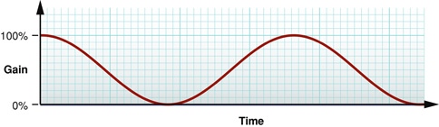

Stereo tremolo is similar but involves continuous left/right panning at a low frequency.

In this chapter you design and build a monaural tremolo effect that uses the generic view. The steps, described in detail in the following sections, are:

1. Install the Core Audio development kit if you haven't already done so.
2. Perform some design work, including:

   - Specify the sort of DSP your audio unit will perform
   - Design the parameter interface
   - Design the factory preset interface
   - Determine the configuration information for your audio unit bundle, such as the subtype and manufacturer codes, and the version number
3. Create and configure the Xcode project.
4. Implement your audio unit:

   - Implement the parameter and preset interfaces.
   - Implement signal processing—the heart of your audio unit.
5. Finally, validate and test your audio unit.

Your development environment for building any audio unit—simple or otherwise—should include the pieces described under [Required Tools for Audio Unit Development](Introduction.md#apple-f4xwc4dqnrsv64tfmyxwi33df52wszbpkridimbqgaztenzyfvbuqmjnknltc) in the [Introduction](Introduction.md#apple-f4xwc4dqnrsv64tfmyxwi33df52wszbpkridimbqgaztenzyfvbuqmjnknlte). You do not need to refer to the Xcode documentation or the Core Audio SDK documentation to complete the tasks in this chapter.

1. If you haven’t already done so, install the most recent Core Audio SDK. It is part of the Xcode Tools installation on the OS X DVD. You can also download it from Apple’s developer website at this location:

   [http://developer.apple.com/sdk/](https://developer.apple.com/sdk/)

   The Core Audio SDK installer places C++ superclasses, example Xcode projects, and documentation at this location on your system:

   `/Developer/Examples/CoreAudio`

   The SDK also installs Xcode project templates for audio units at this location on your system:

   `/Library/Application Support/Apple/Developer Tools/Project Templates/`
2. After you have installed the SDK, confirm that Xcode recognizes the audio unit templates, as follows:

   - Launch Xcode and then choose File > New Project.
   - In the Assistant window, confirm that there is an Audio Units group.

   __Figure 5-2__  Confirming that the audio unit templates are installed

   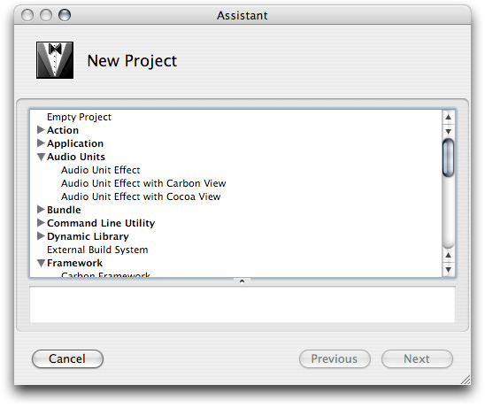

   Having confirmed the presence of the Audio Units template group, click Cancel, and then quit Xcode.

With tools in place, you begin your development of an effect unit by describing its digital signal processing. In this case, you specify an audio unit that provides monaural tremolo at a user selectable rate. You’ll implement the DSP later, but establishing a bird’s eye view up front lets you narrow down the implementation steps.

Next, pick an audio unit type based on the function the audio unit will perform. Look through the various types of standard audio units in the `AUComponent.h` file in the Audio Unit framework. Also, refer to the descriptions of types in _Audio Unit Specification_. The `kAudioUnitType_Effect`, with four-character code of `'aufx'`, looks appropriate for this purpose.

In this section you work out the parameter portion of the programmatic interface between your audio unit and its view. End users will vary these parameters to control your audio unit in real time.

First, specify which sound attributes you’d like the user to be able to control. For this project, use the following:

- Tremolo frequency—the number of tremolo cycles per second.
- Tremolo depth—the mix between the input signal and the signal with tremolo applied. At a depth of 0%, there is no tremolo effect. At a depth of 100%, the effect ranges from full amplitude to silence.
- Tremolo waveform—the shape of the tremolo effect, such as sine wave or square wave.

Second, specify for each parameter:

- _User interface name_ as it appears in the audio unit view
- _Programmatic name_, also called the parameter ID, used in the `GetParameterInfo` method in the audio unit implementation file
- _Unit of measurement_, such as gain, decibels, or hertz
- _Minimum value_
- _Maximum value_
- _Default value_

The following tables specify the parameter design. You'll use most of these values directly in your code. Specifying a "Description" is for your benefit while developing and extending the audio unit. You can reuse the description later in online help or a user guide.

__Table 5-1__  Specification of tremolo frequency parameter

| Parameter attribute | Value |
| User interface name | Frequency |
| Description | The frequency of the tremolo effect. When this parameter is set to 2 Hz, there are two cycles of the tremolo effect per second. This parameter’s value is continuous, so the user can set any value within the available range. The user adjusts tremolo frequency with a slider. |
| Programmatic name | `kTremolo_Frequency` |
| Unit of measurement | Hz |
| Minimum value | 0.5 |
| Maximum value | 10.0 |
| Default value | 2.0 |

__Table 5-2__  Specification of tremolo depth parameter

| Parameter attribute | Value |
| User interface name | Depth |
| Description | The depth, or intensity, of the tremolo effect. When set to 0%, there is no tremolo effect. When set to 100%, the tremolo effect ranges over each cycle from silence to unity gain. This parameter’s value is continuous, so the user can set any value within the available range. The user adjusts tremolo depth with a slider. |
| Programmatic name | `kTremolo_Depth` |
| Unit of measurement | Percent |
| Minimum value | 0.0 |
| Maximum value | 100.0 |
| Default value | 50.0 |

__Table 5-3__  Specification of tremolo waveform parameter

| Parameter attribute | Value |
| User interface name | Waveform |
| Description | The waveform that the tremolo effect follows. This parameter can take on a set of discrete values. The user picks a tremolo waveform from a menu. |
| Programmatic name | `kTremolo_Waveform` |
| Unit of measurement | Indexed |
| one value | Sine |
| another value | Square |
| Default value | Sine |

It's easy to add, delete, and refine parameters later. For example, if you were creating an audio level adjustment parameter, you might start with a linear scale and later change to a logarithmic scale. For the tremolo unit you're building, you might later decide to add additional tremolo waveforms.

Now that you’ve specified the parameters, you can specify interesting combinations of settings, or factory presets. For the tremolo unit, specify two factory presets. These two, invented for this tutorial, provide two easily distinguishable effects:

__Table 5-4__  Specification of Slow & Gentle factory preset

| Parameter | Value |
| User interface name | Slow & Gentle |
| Description | A gentle waver |
| `kTremolo_Frequency` value | 2.0 Hz |
| `kTremolo_Depth` value | 50% |
| `kTremolo_Waveform` value | Sine |

__Table 5-5__  Specification of Fast & Hard factory preset

| Parameter | Value |
| User interface name | Fast & Hard |
| Description | Frenetic, percussive, and intense |
| `kTremolo_Frequency` value | 20.0 Hz |
| `kTremolo_Depth` value | 90% |
| `kTremolo_Waveform` value | Square |

Now determine your audio unit bundle’s configuration information, such as name and version number. You enter this information into your project’s source files, as described later in [Set Your Company Name in Xcode](#apple-f4xwc4dqnrsv64tfmyxwi33df52wszbpkridimbqgaztenzyfvbuqnjnknlte). Here's what you determine and collect up front:

- _Audio unit bundle English name_, such as Tremolo Unit. Host applications will display this name to let users pick your audio unit.
- _Audio unit programmatic name_, such as TremoloUnit. You’ll use this to name your Xcode project, which in turn uses this name for your audio unit’s main class.
- _Audio unit bundle version number_, such as 1.0.2.
- _Audio unit bundle brief description_, such as "Tremolo Unit version 1.0, copyright © 2006, Angry Audio." This description appears in the Version field of the audio unit bundle’s Get Info window in the Finder.
- _Audio unit bundle subtype_, a four-character code that provides some indication (to a person) of what your audio unit does. For this audio unit, use `'tmlo'`.
- _Company English name_, such as Angry Audio. This string appears in the audio unit generic view.
- _Company programmatic name_, such as `angryaudio`. You’ll use this string in the reverse domain name-style identifier for your audio unit.
- _Company four-character code_, such as `'Aaud'`.

  You obtain this code from Apple, as a “creator code,“ by using the [Data Type Registration](https://developer.apple.com/datatype/) page. For the purposes of this example, for our fictitious company named Angry Audio, we'll use `'Aaud'`.
- _Reverse domain name identifier_, such as `com.angryaudio.audiounit.TremoloUnit`. The Component Manager will use this name when identifying your audio unit.
- _Custom icon_, for display in the Cocoa generic view—optional but a nice touch. This should be a so-called "Small" icon as built with Apple’s Icon Composer application, available on your system in the `/Developer/Applications/Utilities` folder.

Set your company name in Xcode (with Xcode not running) if you haven't already done so. Enter the following command in Terminal on one line:

```
defaults write com.apple.Xcode PBXCustomTemplateMacroDefinitions '{ORGANIZATIONNAME = "Angry Audio";}'
```

Now that you have set this so called “expert” preference, Xcode places your company’s name in the copyright notice in the source files of any new project.

Now you create and configure an Xcode project for your audio unit. This section may seem long—it includes many steps and screenshots—but after you are familiar with the configuration process you can accomplish it in about five minutes.

Launch Xcode and follow these steps:

1. Choose File > New Project

2. In the New Project Assistant dialog, choose the Audio Unit Effect template and click Next.

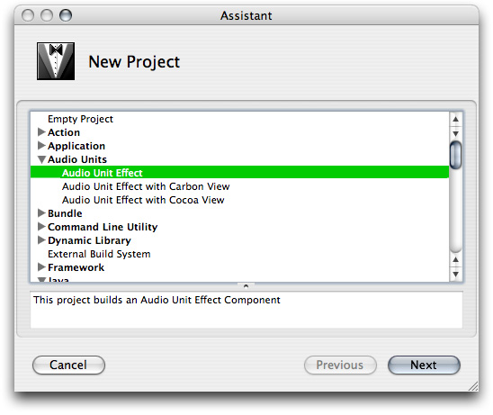

3. Name the project TremoloUnit and specify a project directory. Then click Finish.

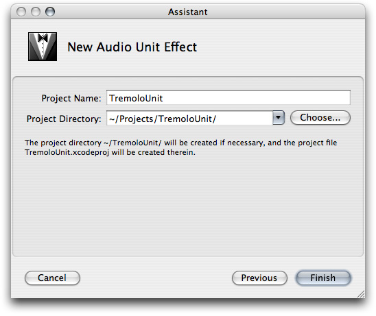

Xcode creates the project files for your audio unit and the Xcode project window opens.

At this point, Xcode has used the audio unit project template file to create a subclass of the `AUEffectBase` class. Your custom subclass is named according to the name of your project. You can find your custom subclass’s implementation file, `TremoloUnit.cpp`, in the AU Source group in the Xcode Groups & Files pane, shown next.

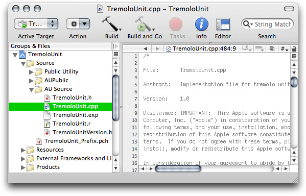

In later steps, you'll edit methods in your custom subclass to override the superclass’s methods. `TremoloUnit.cpp` also contains a couple of methods from the `AUKernelBase` helper class; these are the methods that you later modify to perform digital signal processing.

4. With the AU Source group open as shown in the previous step, click `TremoloUnitVersion.h`. Then click the Editor toolbar button, if necessary, to display the text editor. There are three values to customize in this file: `kTremoloUnitVersion`, `TremoloUnit_COMP_SUBTYPE`, and `TremoloUnit_COMP_MANF`.

Scroll down in the editing pane to the definitions of `TremoloUnit_COMP_SUBTYPE` and `TremoloUnit_COMP_MANF`. Customize the subtype field with the four-character subtype code that you've chosen. In this example, `'tmlo'` indicates (to developers and users) that the audio unit lets a user add tremolo.

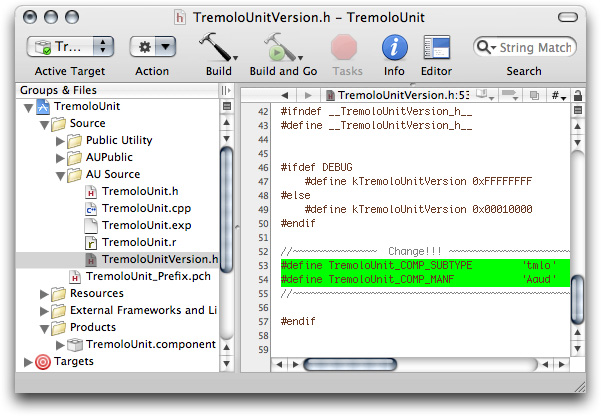

Also customize the manufacturer name with the unique four-character string that identifies your company.

Now set the version number for the audio unit. In the `TremoloUnitVersion.h` file, just above the definitions for subtype and manufacturer, you’ll see the definition statement for the `kTremoloUnitVersion` constant. By default, the template sets this constant’s value to 1.0.0, as represented by the hexadecimal number `0x00010000`. Change this, if you like. See [Audio Unit Identification](Audio%20Unit%20Development%20Fundamentals.md#apple-f4xwc4dqnrsv64tfmyxwi33df52wszbpkridimbqgaztenzyfvbuqnznknltc) for how to construct the hexadecimal version number.

Save the `TremoloUnitVersion.h` file.

5. Click the `TremoloUnit.r` resource file in the "Source/AU Source" group in the Groups & Files pane. There are two values to customize in this file: `NAME` and `DESCRIPTION`.

- `NAME` is used by the generic view to display both your company name and the audio unit name
- `DESCRIPTION` serves as the menu item for users choosing your audio unit from within a host application.

To work correctly with the generic view, the value for `NAME` must follow a specific pattern:

```
<company name>: <audio unit name>
```

For this example, use:

`Angry Audio: Tremolo Unit`

If you have set your company name using the Xcode expert preference as described earlier, it will already be in place in the `NAME` variable for this project; to follow this example, all you need to do is add a space between Tremolo and Unit in the audio unit name itself.

The Xcode template provides a default value for `DESCRIPTION`. If you customize it, keep it short so that the string works well with pop-up menus. The figure shows a customized `DESCRIPTION`.

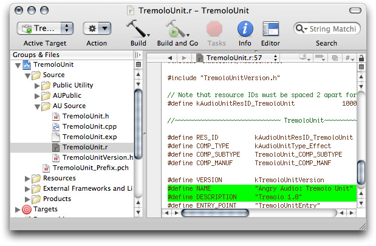

As you can see in the figure, the resource file uses a `#include` statement to import the Version header file that you customized in step 4, `TremoloUnitVersion.h`. The resource file uses values from that header file to define some variables such as component subtype (`COMP_SUBTYPE`) and manufacturer (`COMP_MANUF`).

Save the `TremoloUnit.r` resource file.

6. Open the Resources group in the Groups & Files pane in the Xcode project window, and click on the `InfoPlist.strings` file.

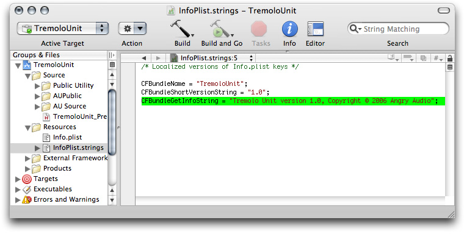

Using the editor, customize the value for `CFBundleGetInfoString` using the value you’ve chosen for the audio unit brief description. The figure provides an example. This string appears in the Version field of the audio unit bundle’s Get Info window in the Finder. Save the `InfoPlist.strings` file.

7. Open the Targets group in the Groups & Files pane in the Xcode project window. Double-click the audio unit bundle, which has the same name as your project—in this case, TremoloUnit.

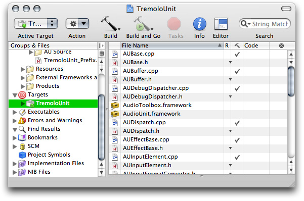

The Target Info window opens. Click the Properties tab.

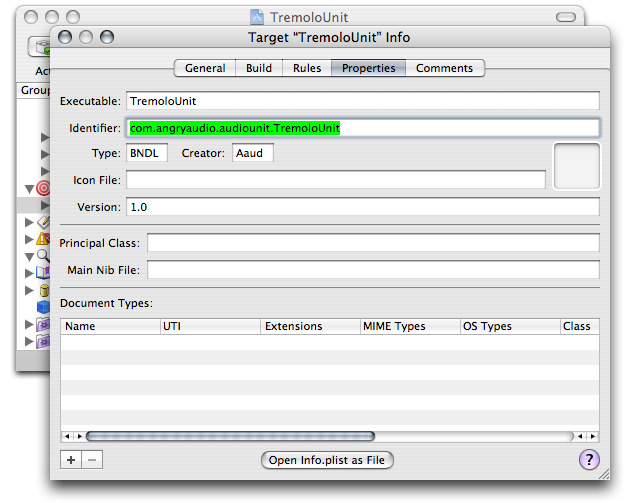

In the Target Info window’s Properties tab, provide values for Identifier, Creator, Version, and, optionally, a path to a Finder icon file for the bundle that you place in the bundle’s `Resources` folder.

The audio unit bundle identifier field should follow the pattern:

`com.<company_name>.audiounit.<audio_unit_name>`

For this example, use the identifier:

`com.angryaudio.audiounit.TremoloUnit`

For the Creator value, use the same four-character string used for the manufacturer field in step 4.

Xcode transfers all the information from the Properties tab into the audio unit bundle’s `Info.plist` file. You can open the `Info.plist` file, if you'd like to inspect it, directly from this dialog using the "Open Info.plist as File" button at the bottom of the window.

When finished, close the `Info.plist` file (if you've opened it) or close the Target Info window.

8. Now configure the Xcode project’s build process to copy your audio unit bundle to the appropriate location so that host applications can use it.

In the project window, disclose the Products group and the Targets group, as shown in the figure, so that you can see the icon for the audio unit bundle itself (`TremoloUnit.component`) as well as the build phases (under `Targets/TremoloUnit`).

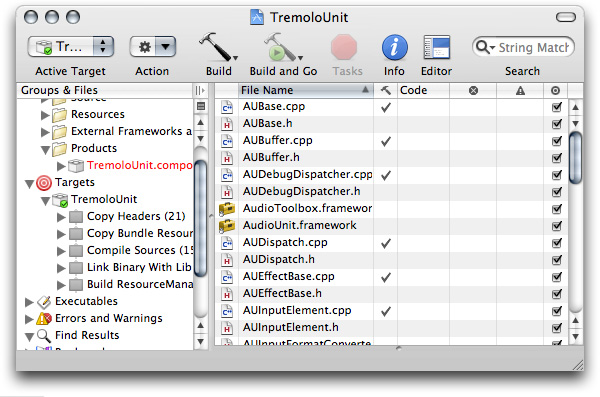

9. Now add a new build phase. Right-click (or control-click) the final build phase for TremoloUnit and choose Add > New Build Phase > New Copy Files Build Phase.

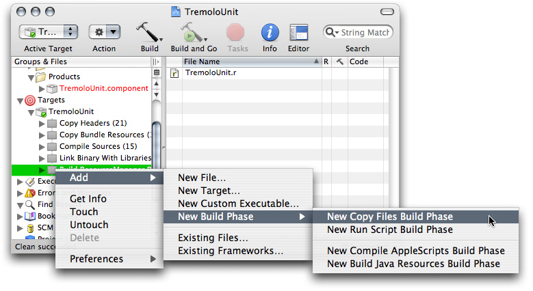

The new Copy Files build phase appears at the end of the list, and a dialog opens, titled Copy Files Phase for "TremoloUnit" Info.

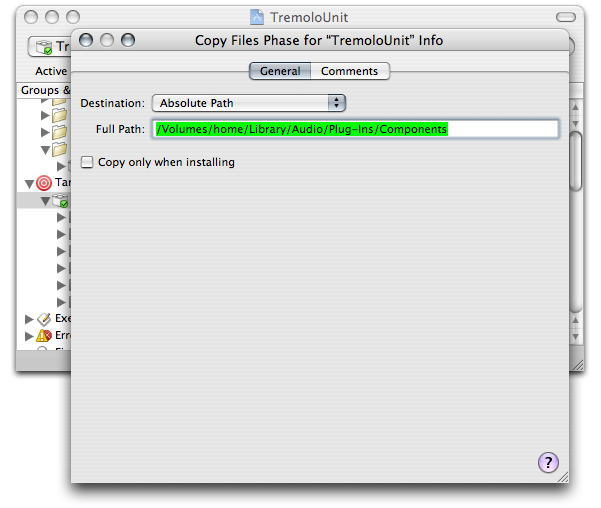

Change the Destination pop-up to Absolute Path, as shown in the figure.

Enter the absolute destination path for the built audio unit bundle in the Full Path field.

You can use either of the valid paths for audio unit bundles, as described in [Audio Unit Installation and Registration](Audio%20Unit%20Development%20Fundamentals.md#apple-f4xwc4dqnrsv64tfmyxwi33df52wszbpkridimbqgaztenzyfvbuqnznknlte). With the full path entered, close the dialog.

Now drag the `TremoloUnit.component` icon from the Products group to the new build phase.

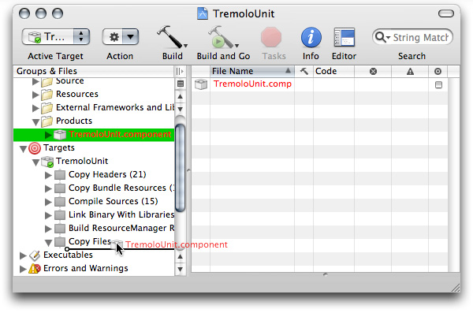

You can later change the Copy Files location, if you want, by double clicking the gray Copy Files build phase icon. Alternatively, click the Copy Files icon and then click the Info button in the toolbar.

At this point, you have have the makings for a working audio unit. You have not yet customized it to do whatever it is that you’ll have it do (in our present case, to provide a single-channel tremolo effect). It’s a good idea to ensure that you can build it without errors, that you can validate it with the auval tool, and that you can use it in a host application. Do this in the next step.

10. Build the project. You can do this in any of the standard ways: click the Build button in the toolbar, or choose Build from the Build button's menu, or choose Build > Build from the main menu, or type command-B.

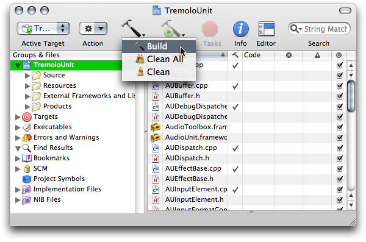

If everything is in order, your project will build without error.

The copy files build phase that you added in the previous step ensures that a copy of the audio unit bundle gets placed in the appropriate location for the Component Manager to find it when a host application launches. The next step ensures that is so, and lets you test that it works in a host application.

To test the newly built audio unit, use the AU Lab application:

- Use the `auval` tool to verify that OS X recognizes your new audio unit bundle
- Launch the AU Lab application
- Configure AU Lab to test your new audio unit, and test it

Apple’s Core Audio team provides AU Lab in the `/Developer/Applications/Audio` folder, along with documentation. You do not need to refer to AU Lab’s documentation to complete this task. The `auval` command-line tool is part of a standard OS X installation.

1. In Terminal, enter the command `auval -a`. If OS X recognizes your new audio unit bundle, you see a listing similar to this one:

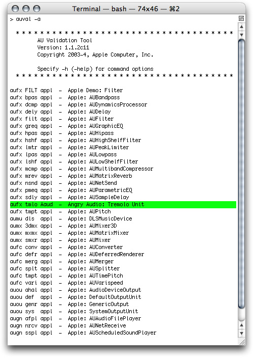

If your Xcode project builds without error, but you do not see the new audio unit bundle in the list reported by the `auval` tool, double check that you’ve entered the correct path in the Copy Files phase, as described in step 8 of [Set Your Company Name in Xcode](#apple-f4xwc4dqnrsv64tfmyxwi33df52wszbpkridimbqgaztenzyfvbuqnjnknlte).

2. Launch AU Lab and create a new AU Lab document. Unless you’ve configured AU Lab to use a default document style, the Create New Document window opens. If AU Lab was already running, choose File > New to get this window.


Ensure that the configuration matches the settings shown in the figure: Built-In Audio for the Audio Device, Line In for the Input Source, and Stereo for Output Channels. Leave the window’s Inputs tab unconfigured; you will specify the input later. Click OK.

A new AU Lab window opens, showing the output channel you specified.


3. Choose Edit > Add Audio Unit Generator. A dialog opens from the AU Lab window to let you specify the generator unit to serve as the audio source.


In the dialog, ensure that the AUAudioFilePlayer unit is selected in the Generator pop-up. To follow this example, change the Group Name to Player. Click OK.

The AU Lab window now shows a stereo input track. In addition, an inspector window has opened for the player unit. If you close the inspector, you can reopen it by clicking the rectangular "AU" button near the top of the Player track.


4. Add an audio file to the Audio Files list in the player inspector window. Do this by dragging the audio file from the Finder, as shown. Putting an audio file in the player inspector window lets you send audio through the new audio unit. Just about any audio file will do, although a continuous tone is helpful for testing.


Now AU Lab is configured and ready to test your audio unit.

5. Click the triangular menu button in the first row of the Effects section in the Player track, as shown in the figure.


A menu opens, listing all the audio units available on your system, arranged by category and manufacturer. There is an Angry Audio group in the pop-up, as shown in the next figure.

Choose your new audio unit from the Effects first row pop-up.

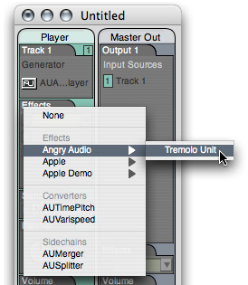

AU Lab opens your audio unit’s Cocoa generic view, which appears as a utility window.

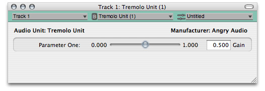

The generic view displays your audio unit’s interface as it comes directly from the parameter and property definitions supplied by the Xcode template. The template defines an audio unit that provides level adjustment. Its view, built by the AU Lab host application, features a Gain control. You modify the view in a later step in this task by changing your audio unit’s parameter definitions.

Refer to [Table 3-1](The%20Audio%20Unit%20View.md#apple-f4xwc4dqnrsv64tfmyxwi33df52wszbpkridimbqgaztenzyfvbuqmjtfvjvomy) for information on where you define each user interface element for the generic view.

6. Click the Play button in the AUAudioFilePlayer inspector to send audio through the unmodified audio unit. This lets you ensure that audio indeed passes through the audio unit. Vary the slider in the generic view, as you listen to the audio, to ensure that the parameter is working.

7. Save the AU Lab document for use later, giving it a name such as “Tremolo Unit Test.trak”. You will use it in the final section of this chapter, [Test your Completed Audio Unit](#apple-f4xwc4dqnrsv64tfmyxwi33df52wszbpkridimbqgaztenzyfvbuqnjnknlts).

Next, you'll define your tremolo effect unit’s parameter interface to give a user control over tremolo rate, depth, and waveform.

Up to this point in developing your audio unit, you have touched very little code. Here, you define the audio unit parameters by editing the source files for the audio unit custom subclass: `TremoloUnit.h` and `TremoloUnit.cpp`.

To define audio unit parameters you do three things:

- Name the parameters and give them values in the custom subclass’s header file
- Add statements to the audio unit’s constructor method to set up the parameters when the audio unit is instantiated
- Override the `GetParameterInfo` method from the SDK’s `AUBase` class, in the custom subclass’s implementation file, to define the parameters

The code you implement here does not make use of the parameters, per se. It is the DSP code that you implement later, in [Implement Signal Processing](#apple-f4xwc4dqnrsv64tfmyxwi33df52wszbpkridimbqgaztenzyfvbuqnjnknltq), that makes use of the parameters. Here, you are simply defining the parameters so that they will appear in the audio unit generic view and so that they’re ready to use when you implement the DSP code.

First, name your audio unit’s parameters and provide values for them. Do this by replacing the default parameter definition code in the `TremoloUnit.h` header file, provided by the Xcode template, with the following code. This listing implements the parameter design from the tables in [Design the Parameter Interface](#apple-f4xwc4dqnrsv64tfmyxwi33df52wszbpkridimbqgaztenzyfvbuqnjnknltm).

__Listing 5-1__  Parameter names and values (`TremoloUnit.h`)

```
#pragma mark ____TremoloUnit Parameter Constants

static CFStringRef kParamName_Tremolo_Freq      = CFSTR ("Frequency");    // 1
static const float kDefaultValue_Tremolo_Freq   = 2.0;                    // 2
static const float kMinimumValue_Tremolo_Freq   = 0.5;                    // 3
static const float kMaximumValue_Tremolo_Freq   = 20.0;                   // 4

static CFStringRef kParamName_Tremolo_Depth     = CFSTR ("Depth");        // 5
static const float kDefaultValue_Tremolo_Depth  = 50.0;
static const float kMinimumValue_Tremolo_Depth  = 0.0;
static const float kMaximumValue_Tremolo_Depth  = 100.0;

static CFStringRef kParamName_Tremolo_Waveform  = CFSTR ("Waveform");     // 6
static const int kSineWave_Tremolo_Waveform     = 1;
static const int kSquareWave_Tremolo_Waveform   = 2;
static const int kDefaultValue_Tremolo_Waveform = kSineWave_Tremolo_Waveform;

// menu item names for the waveform parameter
static CFStringRef kMenuItem_Tremolo_Sine       = CFSTR ("Sine");         // 7
static CFStringRef kMenuItem_Tremolo_Square     = CFSTR ("Square");       // 8

// parameter identifiers
enum {                                                                    // 9
    kParameter_Frequency  = 0,
    kParameter_Depth      = 1,
    kParameter_Waveform   = 2,
    kNumberOfParameters   = 3
};
```

Here’s how this code works:

1. Provides the user interface name for the Frequency (`kParamName_Tremolo_Freq`) parameter.
2. Defines a constant for the default value for the Frequency parameter for the tremolo unit, anticipating a unit of Hertz to be defined in the implementation file.
3. Defines a constant for the minimum value for the Frequency parameter.
4. Defines a constant for the maximum value for the Frequency parameter.
5. Provides a user interface name for the Depth (`kParamName_Tremolo_Depth`) parameter. The following three lines define constants for the default, minimum, and maximum values for the Depth parameter.
6. Provides a user interface name for the Waveform (`kParamName_Tremolo_Waveform`) parameter. The following three lines define constants for the minimum, maximum, and default values for the Waveform parameter.
7. Defines the menu item string for the sine wave option for the Waveform parameter.
8. Defines the menu item string for the square wave option for the Waveform parameter.
9. Defines constants for identifying the parameters; defines the total number of parameters.

For each parameter you’ve defined in the `TremoloUnit.h` file, your audio unit needs:

- A corresponding `SetParameter` statement in the constructor method, as described next in Edit the Constructor Method
- A corresponding parameter definition in the `GetParameterInfo` method, as described later in [Define the Parameters](#apple-f4xwc4dqnrsv64tfmyxwi33df52wszbpkridimbqgaztenzyfvbuqnjnknltc)

Next, replace the custom subclass constructor method in the `TremoloUnit.cpp` file with the code in this section. This code instantiates the audio unit, which includes setting up the parameter names and values that you defined in the previous section.

For now, the `SetParameter` statements shown here are the only lines to customize in the constructor method. In a later step you'll add code to define the default factory preset.

__Listing 5-2__  Setting parameters in the constructor (`TremoloUnit.cpp`)

```swift
TremoloUnit::TremoloUnit (AudioUnit component) : AUEffectBase (component) {

    CreateElements ();
    Globals () -> UseIndexedParameters (kNumberOfParameters);

    SetParameter (                                       // 1
        kParameter_Frequency,
        kDefaultValue_Tremolo_Freq
    );

    SetParameter (                                       // 2
        kParameter_Depth,
        kDefaultValue_Tremolo_Depth
    );

    SetParameter (                                       // 3
        kParameter_Waveform,
        kDefaultValue_Tremolo_Waveform
    );

    #if AU_DEBUG_DISPATCHER
        mDebugDispatcher = new AUDebugDispatcher (this);
    #endif
}
```

Here’s how this code works:

1. Sets up the first parameter for the audio unit, based on values from the header file. In this project, this parameter controls tremolo frequency. The `SetParameter` method is inherited from superclasses in the Core Audio SDK.
2. Sets up the second parameter for the audio unit, based on values from the header file. In this project, this parameter controls tremolo depth.
3. Sets up the third parameter for the audio unit, based on values from the header file. In this project, this parameter controls the tremolo waveform.

Replace the default override of the `GetParameterInfo` method from the Xcode template, which defines just one default (Gain) parameter. Here, use the three-parameter design described earlier in [Design the Parameter Interface](#apple-f4xwc4dqnrsv64tfmyxwi33df52wszbpkridimbqgaztenzyfvbuqnjnknltm).

__Listing 5-3__  The customized `GetParameterInfo` method (`TremoloUnit.cpp`)

```
#pragma mark ____Parameters
ComponentResult TremoloUnit::GetParameterInfo (
        AudioUnitScope          inScope,
        AudioUnitParameterID    inParameterID,
        AudioUnitParameterInfo  &outParameterInfo
) {
    ComponentResult result = noErr;

    outParameterInfo.flags =    kAudioUnitParameterFlag_IsWritable        // 1
                                | kAudioUnitParameterFlag_IsReadable;

    if (inScope == kAudioUnitScope_Global) {                              // 2
        switch (inParameterID) {
            case kParameter_Frequency:                                    // 3
                AUBase::FillInParameterName (
                    outParameterInfo,
                    kParamName_Tremolo_Freq,
                    false
                );
                outParameterInfo.unit =                                   // 4
                    kAudioUnitParameterUnit_Hertz;
                outParameterInfo.minValue =                               // 5
                        kMinimumValue_Tremolo_Freq;
                outParameterInfo.maxValue =                               // 6
                        kMaximumValue_Tremolo_Freq;
                outParameterInfo.defaultValue =                           // 7
                        kDefaultValue_Tremolo_Freq;
                outParameterInfo.flags                                    // 8
                        |= kAudioUnitParameterFlag_DisplayLogarithmic;
                break;

            case kParameter_Depth:                                        // 9
                AUBase::FillInParameterName (
                    outParameterInfo,
                    kParamName_Tremolo_Depth,
                    false
                );
                outParameterInfo.unit =                                   // 10
                    kAudioUnitParameterUnit_Percent;
                outParameterInfo.minValue =
                    kMinimumValue_Tremolo_Depth;
                outParameterInfo.maxValue =
                    kMaximumValue_Tremolo_Depth;
                outParameterInfo.defaultValue =
                     kDefaultValue_Tremolo_Depth;
                break;

            case kParameter_Waveform:                                     // 11
                AUBase::FillInParameterName (
                    outParameterInfo,
                    kParamName_Tremolo_Waveform,
                    false
                );
                outParameterInfo.unit =                                   // 12
                    kAudioUnitParameterUnit_Indexed;
                outParameterInfo.minValue =
                    kSineWave_Tremolo_Waveform;
                outParameterInfo.maxValue =
                    kSquareWave_Tremolo_Waveform;
                outParameterInfo.defaultValue =
                    kDefaultValue_Tremolo_Waveform;
                break;

            default:
                result = kAudioUnitErr_InvalidParameter;
                break;
        }
    } else {
        result = kAudioUnitErr_InvalidParameter;
    }
    return result;
}
```

Here’s how this code works:

1. Adds two flags to all parameters for the audio unit, indicating to the host application that it should consider all the audio unit’s parameters to be readable and writable.
2. All three parameters for this audio unit are in the “global” scope.
3. The first case in the switch statement, invoked when the view needs information for the `kTremolo_Frequency` parameter, defines how to represent this parameter in the user interface.
4. Sets the unit of measurement for the Frequency parameter to Hertz.
5. Sets the minimum value for the Frequency parameter.
6. Sets the maximum value for the Frequency parameter.
7. Sets the default value for the Frequency parameter
8. Adds a flag to indicate to the host that it should use a logarithmic control for the Frequency parameter.
9. The second case in the switch statement, invoked when the view needs information for the `kTremolo_Depth` parameter, defines how to represent this parameter in the user interface.
10. Sets the unit of measurement for the Depth parameter to percentage. The following three statements set the minimum, maximum, and default values for the Depth parameter.
11. The third case in the switch statement, invoked when the view needs information for the `kTremolo_Waveform` parameter, defines how to represent this parameter in the user interface.
12. Sets the unit of measurement for the Waveform parameter to “indexed,“ allowing it to be displayed as a pop-up menu in the generic view. The following three statements set the minimum, maximum, and default values for the depth parameter. All three are required for proper functioning of the parameter’s user interface.

Now you implement the `GetParameterValueStrings` method, which lets the audio unit’s generic view display the waveform parameter as a pop-up menu.

A convenient location for this code is after the `GetParameterInfo` method definition. If you add this method here as suggested, be sure to delete the placeholder method provided by the Xcode template elsewhere in the implementation file.

__Listing 5-4__  The customized `GetParameterValueStrings` method (`TremoloUnit.cpp`)

```
ComponentResult TremoloUnit::GetParameterValueStrings (
    AudioUnitScope          inScope,
    AudioUnitParameterID    inParameterID,
    CFArrayRef              *outStrings
) {
    if ((inScope == kAudioUnitScope_Global) &&             // 1
        (inParameterID == kParameter_Waveform)) {

        if (outStrings == NULL) return noErr;              // 2

        CFStringRef strings [] = {                         // 3
            kMenuItem_Tremolo_Sine,
            kMenuItem_Tremolo_Square
        };

        *outStrings = CFArrayCreate (                      // 4
            NULL,
            (const void **) strings,
            (sizeof (strings) / sizeof (strings [0])),     // 5
            NULL
        );
        return noErr;
    }
    return kAudioUnitErr_InvalidParameter;
}
```

Here’s how this code works:

1. This method applies only to the waveform parameter, which is in the global scope.
2. When this method gets called by the `AUBase::DispatchGetPropertyInfo` method, which provides a null value for the _outStrings_ parameter, just return without error.
3. Defines an array that contains the pop-up menu item names.
4. Creates a new immutable array containing the menu item names, and places the array in the _outStrings_ output parameter.
5. Calculates the number of menu items in the array.

Next, you define the audio unit factory presets, again by editing the source files for the audio unit custom subclass, `TremoloUnit.h` and `TremoloUnit.cpp`.

The steps, described in detail below, are:

- Name the factory presets and give them values.
- Modify the TremoloUnit class declaration by adding method signatures for handling factory presets.
- Edit the audio unit’s constructor method to set a default factory preset.
- Override the `GetPresets` method to set up a factory presets array.
- Override the `NewFactoryPresetSet` method to define the factory presets.

Define the constants for the factory presets. A convenient location for this code in the `TremoloUnit.h` header file is below the parameter constants section.

__Listing 5-5__  Factory preset names and values (`TremoloUnit.h`)

```
#pragma mark ____TremoloUnit Factory Preset Constants
static const float kParameter_Preset_Frequency_Slow = 2.0;    // 1
static const float kParameter_Preset_Frequency_Fast = 20.0;   // 2
static const float kParameter_Preset_Depth_Slow     = 50.0;   // 3
static const float kParameter_Preset_Depth_Fast     = 90.0;   // 4
static const float kParameter_Preset_Waveform_Slow            // 5
    = kSineWave_Tremolo_Waveform;
static const float kParameter_Preset_Waveform_Fast            // 6
    = kSquareWave_Tremolo_Waveform;
enum {
    kPreset_Slow    = 0,                                      // 7
    kPreset_Fast    = 1,                                      // 8
    kNumberPresets  = 2                                       // 9
};

static AUPreset kPresets [kNumberPresets] = {                 // 10
    {kPreset_Slow, CFSTR ("Slow & Gentle")},
    {kPreset_Fast, CFSTR ("Fast & Hard")}
};

static const int kPreset_Default = kPreset_Slow;              // 11
```

Here’s how this code works:

1. Defines a constant for the frequency value for the “Slow & Gentle” factory preset.
2. Defines a constant for the frequency value for the “Fast & Hard” factory preset.
3. Defines a constant for the depth value for the “Slow & Gentle; Hard” factory preset.
4. Defines a constant for the depth value for the “Fast & Hard” factory preset.
5. Defines a constant for the waveform value for the “Slow & Gentle” factory preset.
6. Defines a constant for the waveform value for the “Fast & Hard” factory preset.
7. Defines a constant for the “Slow & Gentle” factory preset.
8. Defines a constant for the “Fast & Hard” factory preset.
9. Defines a constant representing the total number of factory presets.
10. Defines an array containing two Core Foundation string objects. The objects contain values for the menu items in the user interface corresponding to the factory presets.
11. Defines a constant representing the default factory preset, in this case the “Slow & Gentle” preset.

Now, provide method declarations for overriding the `GetPresets` and `NewFactoryPresetSet` methods from the `AUBase` superclass. Add these method declarations to the `public:` portion of class declaration in the `TremoloUnit.h` header file. You implement these methods in a later step in this chapter.

__Listing 5-6__  Factory preset method declarations (`TremoloUnit.h`)

```
#pragma mark ____TremoloUnit
class TremoloUnit : public AUEffectBase {

public:
    TremoloUnit (AudioUnit component);
...
    virtual ComponentResult GetPresets (       // 1
        CFArrayRef        *outData
    ) const;

    virtual OSStatus NewFactoryPresetSet (     // 2
        const AUPreset    &inNewFactoryPreset
    );
protected:
...
};
```

Here’s how this code works:

1. Declaration for the GetPresets method, overriding the method from the AUBase superclass.
2. Declaration for the NewFactoryPresetSet method, overriding the method from the AUBase superclass.

Now you return to the TremoloUnit constructor method, in which you previously added code for setting the audio unit parameters. Here, you add a single statement to set the default factory preset, making use of the `kTremoloPreset_Default` constant.

__Listing 5-7__  Setting the default factory preset in the constructor (`TremoloUnit.cpp`)

```swift
TremoloUnit::TremoloUnit (AudioUnit component) : AUEffectBase (component) {

    CreateElements ();
    Globals () -> UseIndexedParameters (kNumberOfParameters);
    // code for setting default values for the audio unit parameters
    SetAFactoryPresetAsCurrent (                    // 1
        kPresets [kPreset_Default]
    );
    // boilerplate code for debug dispatcher
}
```

Here’s how this code works:

1. Sets the default factory preset.

For users to be able to use the factory presets you define, you must add a generic implementation of the `GetPresets` method. The following generic code works for any audio unit that can support factory presets.

A convenient location for this code in the `TremoloUnit.cpp` implementation file is after the `GetPropertyInfo` and `GetProperty` methods.

__Listing 5-8__  Implementing the `GetPresets` method (`TremoloUnit.cpp`)

```
#pragma mark ____Factory Presets
ComponentResult TremoloUnit::GetPresets (                     // 1
    CFArrayRef *outData
) const {

    if (outData == NULL) return noErr;                        // 2

    CFMutableArrayRef presetsArray = CFArrayCreateMutable (   // 3
        NULL,
        kNumberPresets,
        NULL
    );

    for (int i = 0; i < kNumberPresets; ++i) {                // 4
        CFArrayAppendValue (
            presetsArray,
            &kPresets [i]
        );
    }

    *outData = (CFArrayRef) presetsArray;                     // 5
    return noErr;
}
```

Here’s how this code works:

1. The `GetPresets` method accepts a single parameter, a pointer to a CFArrayRef object. This object holds the factory presets array generated by this method.
2. Checks whether factory presets are implemented for this audio unit.
3. Instantiates a mutable Core Foundation array to hold the factory presets.
4. Fills the factory presets array with values from the definitions in the `TremoloUnit.h` file.
5. Stores the factory presets array at the `outData` location.

The `NewFactoryPresetSet` method defines all the factory presets for an audio unit. Basically, for each preset, it invokes a series of `SetParameter` calls.

A convenient location for this code in the `TremoloUnit.cpp` implementation file is after the implementation of the `GetPresets` method.

__Listing 5-9__  Defining factory presets in the `NewFactoryPresetSet` method (`TremoloUnit.cpp`)

```
OSStatus TremoloUnit::NewFactoryPresetSet (                         // 1
    const AUPreset &inNewFactoryPreset
) {
    SInt32 chosenPreset = inNewFactoryPreset.presetNumber;          // 2

    if (                                                            // 3
        chosenPreset == kPreset_Slow ||
        chosenPreset == kPreset_Fast
    ) {
        for (int i = 0; i < kNumberPresets; ++i) {                  // 4
            if (chosenPreset == kPresets[i].presetNumber) {
                switch (chosenPreset) {                             // 5

                    case kPreset_Slow:                              // 6
                        SetParameter (                              // 7
                            kParameter_Frequency,
                            kParameter_Preset_Frequency_Slow
                        );
                        SetParameter (                              // 8
                            kParameter_Depth,
                            kParameter_Preset_Depth_Slow
                        );
                        SetParameter (                              // 9
                            kParameter_Waveform,
                            kParameter_Preset_Waveform_Slow
                        );
                        break;

                    case kPreset_Fast:                             // 10
                        SetParameter (
                            kParameter_Frequency,
                           kParameter_Preset_Frequency_Fast
                        );
                        SetParameter (
                            kParameter_Depth,
                            kParameter_Preset_Depth_Fast
                        );
                        SetParameter (
                            kParameter_Waveform,
                            kParameter_Preset_Waveform_Fast
                        );
                        break;
                }
                SetAFactoryPresetAsCurrent (                        // 11
                    kPresets [i]
                );
                return noErr;                                       // 12
            }
        }
    }
    return kAudioUnitErr_InvalidProperty;                           // 13
}
```

Here’s how this code works:

1. This method takes a single argument of type `AUPreset`, a structure containing a factory preset name and number.
2. Gets the number of the desired factory preset.
3. Tests whether the desired factory preset is defined.
4. This `for` loop, and the `if` statement that follows it, allow for noncontiguous preset numbers.
5. Selects the appropriate case statement based on the factory preset number.
6. The settings for the “Slow & Gentle” factory preset.
7. Sets the Frequency audio unit parameter for the “Slow & Gentle” factory preset.
8. Sets the Depth audio unit parameter for the “Slow & Gentle” factory preset.
9. Sets the Waveform audio unit parameter for the “Slow & Gentle” factory preset.
10. The settings for the “Fast & Hard” factory preset. The three `SetParameter` statements that follow work the same way as for the other factory preset.
11. Updates the preset menu in the generic view to display the new factory preset.
12. On success, returns a value of `noErr`.
13. If the host application attempted to set an undefined factory preset, return an error.

With the parameter and preset code in place, you now get to the heart of the matter: the digital signal processing code. As described in [Synthesis, Processing, and Data Format Conversion Code](The%20Audio%20Unit.md#apple-f4xwc4dqnrsv64tfmyxwi33df52wszbpkridimbqgaztenzyfvbuqmjsfvjvomju), the DSP performed by an _n_-to-_n_ channel effect unit takes place in the `AUKernelBase` class, a helper class for the `AUEffectBase` class. Refer to [Processing: The Heart of the Matter](Audio%20Unit%20Development%20Fundamentals.md#apple-f4xwc4dqnrsv64tfmyxwi33df52wszbpkridimbqgaztenzyfvbuqnznknltcmi) for more on how DSP works in audio units.

To implement signal processing in an _n_-to-_n_ channel effect unit, you override two methods from the `AUKernelBase` class:

- The `Process` method, which performs the signal processing
- The `Reset` method, which returns the audio unit to its pristine, initialized state

Along the way, you make changes to the default `TremoloUnitKernel` class declaration in the `TremoloUnit.h` header file, and you modify the `TremoloUnitKernel` constructor method in `TremoloUnit.cpp`.

The design and implementation of DSP code are central to real world audio unit development—but, as mentioned in the Introduction, they are outside the scope of this document. Nonetheless, this section describes the simple DSP used in this project to illustrate some of the issues involved with adding such code to an effect unit.

When you create a new audio unit project with an Xcode template, you get an audio unit with minimal DSP. It consists of only a multiplication that applies the value of a gain parameter to each sample of an audio signal. Here, you still use a simple multiplication—but with a bit more math up front, you end up with something a little more interesting; namely, tremolo. As you add the DSP code, you see where each part goes and how it fits in to the audio unit scaffolding.

The tremolo unit design uses a wave table to describe one cycle of a tremolo waveform. The `TremoloUnitKernel` class builds the wave table during instantiation. To make the project a bit more useful and instructive, the class builds not one but two wave tables: one representing a sine wave and one representing a pseudo square wave.

During processing, the tremolo unit uses sequential values from one of its wave tables as gain factors to apply to the audio signal, sample by sample. There’s code to determine which point in the wave table to apply to a given audio sample.

Following the audio unit parameter design described earlier in this chapter, there is code to vary tremolo frequency, tremolo depth, and the tremolo waveform, all in real time.

To begin the DSP implementation for the tremolo unit, add some constants as private member variables to the `TremoloUnitKernel` class declaration. Defining these as private member variables ensures that they are global to the `TremolUnitKernel` object and invisible elsewhere.

__Listing 5-10__  `TremoloUnitKernel` member variables (`TremoloUnit.h`)

```
class TremoloUnit : public AUEffectBase
{
public:
    TremoloUnit(AudioUnit component);

...

protected:
    class TremoloUnitKernel : public AUKernelBase {
        public:
            TremoloUnitKernel (AUEffectBase *inAudioUnit); // 1

            virtual void Process (
                const Float32    *inSourceP,
                Float32          *inDestP,
                UInt32           inFramesToProcess,
                UInt32           inNumChannels,   // equal to 1
                bool             &ioSilence
        );

        virtual void Reset();

        private:
            enum     {kWaveArraySize = 2000};             // 2
            float    mSine [kWaveArraySize];              // 3
            float    mSquare [kWaveArraySize];            // 4
            float    *waveArrayPointer;                   // 5
            Float32  mSampleFrequency;                    // 6
            long     mSamplesProcessed;                   // 7
            enum     {sampleLimit = (int) 10E6};          // 8
            float    mCurrentScale;                       // 9
            float    mNextScale;                          // 10
    };
};
```

Here’s how this code works (skip this explanation if you’re not interested in the math):

1. The constructor signature in the Xcode template contains a call to the superclass’s constructor, as well as empty braces representing the method body. Remove all of these because you implement the constructor method in the implementation file, as described in the next section.
2. The number of points in each wave table. Each wave holds one cycle of a tremolo waveform.
3. The wave table for the tremolo sine wave.
4. The wave table for the tremolo pseudo square wave.
5. The wave table to apply to the current audio input buffer.
6. The sampling frequency, or "sample rate" as it is often called, of the audio signal to be processed.
7. The number of samples processed since the audio unit started rendering, or since this variable was last set to `0`. The DSP code tracks total samples processed because:

   - The main processing loop is based on the number of samples placed into the input buffer…
   - But the DSP must take place independent of the input buffer size.
8. To keep the value of `mSamplesProcessed` within a reasonable limit, there's a test in the code to reset it when it reaches this value.
9. The scaling factor currently in use. The DSP uses a scaling factor to correlate the points in the wave table with the audio signal sampling frequency, in order to produce the desired tremolo frequency. The kernel object keeps track of a “current” and “next” scaling factor to support changing from one tremolo frequency to another without an audible glitch.
10. The desired scaling factor to use, resulting from a request by the user for a different tremolo frequency.

In the constructor method for your custom subclass of the `AUKernelBase` class, take care of any DSP work that can be done once per instantiation of the kernel object. In the case of the tremolo unit we're building, this includes:

- Initializing member variables that require initialization
- Filling the two wave tables
- Getting the sample rate of the audio stream.

A convenient location for the constructor is immediately below the `TremoloUnitEffectKernel` pragma mark.

__Listing 5-11__  Modifications to the `TremoloUnitKernel` Constructor (`TremolUnit.cpp`)

```
#pragma mark ____TremoloUnitEffectKernel
//~~~~~~~~~~~~~~~~~~~~~~~~~~~~~~~~~~~~~~~~~~~~~~~~~~~~~~~~~~~~~~~~~~~~~~~~~~~~~
//    TremoloUnit::TremoloUnitKernel::TremoloUnitKernel()
//~~~~~~~~~~~~~~~~~~~~~~~~~~~~~~~~~~~~~~~~~~~~~~~~~~~~~~~~~~~~~~~~~~~~~~~~~~~~~
TremoloUnit::TremoloUnitKernel::TremoloUnitKernel (AUEffectBase *inAudioUnit) :
    AUKernelBase (inAudioUnit), mSamplesProcessed (0), mCurrentScale (0) // 1
{
    for (int i = 0; i < kWaveArraySize; ++i) {                           // 2
        double radians = i * 2.0 * pi / kWaveArraySize;
        mSine [i] = (sin (radians) + 1.0) * 0.5;
    }

    for (int i = 0; i < kWaveArraySize; ++i) {                           // 3
        double radians = i * 2.0 * pi / kWaveArraySize;
        radians = radians + 0.32;
        mSquare [i] =
            (
                sin (radians) +
                0.3 * sin (3 * radians) +
                0.15 * sin (5 * radians) +
                0.075 * sin (7 * radians) +
                0.0375 * sin (9 * radians) +
                0.01875 * sin (11 * radians) +
                0.009375 * sin (13 * radians) +
                0.8
            ) * 0.63;
    }
    mSampleFrequency = GetSampleRate ();                                 // 4
}
```

Here’s how this code works:

1. The constructor method declarator and constructor-initializer. In addition to calling the appropriate superclasses, this code initializes two member variables.
2. Generates a wave table that represents one cycle of a sine wave, normalized so that it never goes negative and so that it ranges between 0 and 1.

   Along with the value of the Depth parameter, this sine wave specifies how to vary the audio gain during one cycle of sine wave tremolo.
3. Generates a wave table that represents one cycle of a pseudo square wave, normalized so that it never goes negative and so that it ranges between approximately `0` and approximately `1`.
4. Gets the sample rate for the audio stream to be processed.

Put your DSP code into an override of the `AUKernelBase` class’s `Process` method. The `Process` method gets called once each time the host application fills the audio sample input buffer. The method processes the buffer contents, sample by sample, and places the processed audio in the audio sample output buffer.

It’s important to put as much processing as possible outside of the actual processing loop. The code for the TremoloUnit project demonstrates that the following sort of work gets done just once per audio sample buffer, outside of the processing loop:

- Declare all variables used in the method
- Get the current values of all the parameters as set by the user via the audio unit’s view
- Check the parameters to ensure they're in bounds, and taking appropriate action if they're not
- Perform calculations that don't require updating with each sample. In this project's case, this means calculating the scaling factor to use when applying the tremolo wave table.

Inside the processing loop, do only work that must be performed sample by sample:

- Perform calculations that must be updated sample by sample. In this case, this means calculating the point in the wave table to use for tremolo gain
- Respond to parameter changes in a way that avoids artifacts. In this case, this means switching to a new tremolo frequency, if requested by the user, in a way that avoids any sudden jump in gain.
- Calculate the transformation to apply to each input sample. In this case, this means calculating a) the tremolo gain based on the current point in the wave table, and b) the current value of the Depth parameter.
- Calculate the output sample that corresponds to the current input sample. In this case, this means applying the tremolo gain and depth factor to the current input sample.
- Advance the indexes in the input and output buffers
- Advance other indexes involved in the DSP. In this case, this means incrementing the `mSamplesProcessed` variable.

__Listing 5-12__  The `Process` method (`TremoloUnit.cpp`)

```
void TremoloUnit::TremoloUnitKernel::Process (                        // 1
    const Float32   *inSourceP,                                       // 2
    Float32         *inDestP,                                         // 3
    UInt32          inSamplesToProcess,                               // 4
    UInt32          inNumChannels,                                    // 5
    bool            &ioSilence                                        // 6
) {
    if (!ioSilence) {                                                 // 7

        const Float32 *sourceP = inSourceP;                           // 8

        Float32  *destP = inDestP,                                    // 9
                 inputSample,                                         // 10
                 outputSample,                                        // 11
                 tremoloFrequency,                                    // 12
                 tremoloDepth,                                        // 13
                 samplesPerTremoloCycle,                              // 14
                 rawTremoloGain,                                      // 15
                 tremoloGain;                                         // 16

        int      tremoloWaveform;                                     // 17

        tremoloFrequency = GetParameter (kParameter_Frequency);       // 18
        tremoloDepth     = GetParameter (kParameter_Depth);           // 19
        tremoloWaveform  =
            (int) GetParameter (kParameter_Waveform);                 // 20

        if (tremoloWaveform != kSineWave_Tremolo_Waveform             // 21
            && tremoloWaveform != kSquareWave_Tremolo_Waveform)
                tremoloWaveform = kSquareWave_Tremolo_Waveform;

        if (tremoloWaveform == kSineWave_Tremolo_Waveform)  {         // 22
            waveArrayPointer = &mSine [0];
        } else {
            waveArrayPointer = &mSquare [0];
        }

        if (tremoloFrequency < kMinimumValue_Tremolo_Freq)            // 23
            tremoloFrequency = kMinimumValue_Tremolo_Freq;
        if (tremoloFrequency > kMaximumValue_Tremolo_Freq)
            tremoloFrequency = kMaximumValue_Tremolo_Freq;

        if (tremoloDepth     < kMinimumValue_Tremolo_Depth)           // 24
            tremoloDepth     = kMinimumValue_Tremolo_Depth;
        if (tremoloDepth     > kMaximumValue_Tremolo_Depth)
            tremoloDepth     = kMaximumValue_Tremolo_Depth;

        samplesPerTremoloCycle = mSampleFrequency / tremoloFrequency; // 25
        mNextScale = kWaveArraySize / samplesPerTremoloCycle;         // 26

        // the sample processing loop ////////////////
        for (int i = inSamplesToProcess; i > 0; --i) {                // 27

            int index =                                               // 28
                static_cast<long>(mSamplesProcessed * mCurrentScale) %
                    kWaveArraySize;

            if ((mNextScale != mCurrentScale) && (index == 0)) {      // 29
                mCurrentScale = mNextScale;
                mSamplesProcessed = 0;
            }

            if ((mSamplesProcessed >= sampleLimit) && (index == 0))   // 30
                mSamplesProcessed = 0;

            rawTremoloGain = waveArrayPointer [index];                // 31

            tremoloGain       = (rawTremoloGain * tremoloDepth -      // 32
                                tremoloDepth + 100.0) * 0.01;
            inputSample       = *sourceP;                             // 33
            outputSample      = (inputSample * tremoloGain);          // 34
            *destP            = outputSample;                         // 35
            sourceP           += 1;                                   // 36
            destP             += 1;                                   // 37
            mSamplesProcessed += 1;                                   // 38
        }
    }
}
```

Here’s how this code works:

1. The `Process` method signature. This method is declared in the `AUKernelBase` class.
2. The audio sample input buffer.
3. The audio sample output buffer.
4. The number of samples in the input buffer.
5. The number of input channels. This is always equal to 1 because there is always one kernel object instantiated per channel of audio.
6. A Boolean flag indicating whether the input to the audio unit consists of silence, with a `TRUE` value indicating silence.
7. Ignores the request to perform the `Process` method if the input to the audio unit is silence.
8. Assigns a pointer variable to the start of the audio sample input buffer.
9. Assigns a pointer variable to the start of the audio sample output buffer.
10. The current audio sample to process.
11. The current audio output sample resulting from one iteration of the processing loop.
12. The tremolo frequency requested by the user via the audio unit’s view.
13. The tremolo depth requested by the user via the audio unit’s view.
14. The number of audio samples in one cycle of the tremolo waveform.
15. The tremolo gain for the current audio sample, as stored in the wave table.
16. The adjusted tremolo gain for the current audio sample, considering the Depth parameter.
17. The tremolo waveform type requested by the user via the audio unit’s view.
18. Gets the current value of the Frequency parameter.
19. Gets the current value of the Depth parameter.
20. Gets the current value of the Waveform parameter.
21. Performs bounds checking on the Waveform parameter. If the parameter is out of bounds, supplies a reasonable value.
22. Assigns a pointer variable to the wave table that corresponds to the tremolo waveform selected by the user.
23. Performs bounds checking on the Frequency parameter. If the parameter is out of bounds, supplies a reasonable value.
24. Performs bounds checking on the Depth parameter. If the parameter is out of bounds, supplies a reasonable value.
25. Calculates the number of audio samples per cycle of tremolo frequency.
26. Calculates the scaling factor to use for applying the wave table to the current sampling frequency and tremolo frequency.
27. The loop that iterates over the audio sample input buffer.
28. Calculates the point in the wave table to use for the current sample. This, along with the calculation of the `mNextScale` value in comment , is the only subtle math in the DSP for this effect.
29. Tests if the scaling factor should change, and if it’s safe to change it at the current sample to avoid artifacts. If both conditions are met, switches the scaling factor and resets the `mSamplesProcessed` variable.
30. Tests if the mSamplesProcessed variable has grown to a large value, and if it's safe to reset it at the current sample to avoid artifacts. If both conditions are met, resets the `mSamplesProcessed` variable.
31. Gets the tremolo gain from the appropriate point in the wave table.
32. Adjusts the tremolo gain by applying the Depth parameter. With a depth of 100%, the full tremolo effect is applied. With a depth of 0%, there is no tremolo effect applied at all.
33. Gets an audio sample from the appropriate spot in the audio sample input buffer.
34. Calculates the corresponding output audio sample.
35. Places the output audio sample at the appropriate spot in the audio sample output buffer.
36. Increments the position counter for the audio sample input buffer.
37. Increments the position counter for the audio sample output buffer.
38. Increments the count of processed audio samples.

In your custom subclass’s override of the `AUKernelBase` class `Reset` method, you do whatever work is necessary to return the audio unit to its pristine, initialized state.

__Listing 5-13__  The `Reset` method (`TremoloUnit.cpp`)

```
void TremoloUnit::TremoloUnitKernel::Reset() {
    mCurrentScale        = 0;                    // 1
    mSamplesProcessed    = 0;                    // 2
}
```

Here’s how this code works:

1. Resets the `mCurrentScale` member variable to its freshly initialized value.
2. Resets the `mSamplesProcessed` member variable to its freshly initialized value.

Finally, to ensure that your audio unit plays well in host applications, implement the tail time property, `kAudioUnitProperty_TailTime`.

To do this, simply state in your `TremoloUnit` class definition that your audio unit supports the property by changing the return value of the `SupportsTail` method to `true`.

__Listing 5-14__  Implementing the tail time property (`TremoloUnit.h`)

```
virtual bool SupportsTail () {return true;}
```

Given the nature of the DSP your audio unit performs, its tail time is `0` seconds—so you don’t need to override the `GetTailTime` method. In the `AUBase` superclass, this method reports a tail time of `0` seconds, which is what you want your audio unit to report.

Now you’ve implemented all of the code for the tremolo unit project. Build the project and correct any errors you see. Then use the auval tool to validate your audio unit.

1. In Terminal, enter the command to validate the tremolo unit. This consists of the `auval` command name followed by the `-v` flag to invoke validation, followed by the type, subtype, and manufacturer codes that identify the tremolo unit. The complete command for this audio unit is:

```
auval -v aufx tmlo Aaud
```

If everything is in order, `auval` should report that your new audio unit is indeed valid. The figure shows the last bit of the log created by `auval`:

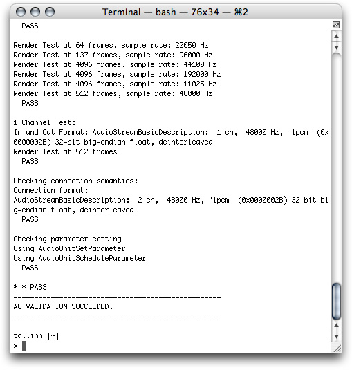

Your audio unit is ready for you to test in a host application. Apple recommends the AU Lab application for audio unit testing. You may also want to test your audio unit in other hosts. This section describes testing with AU Lab. Follow these steps:

1. Open the AU Lab document that you saved from the [Test the Unmodified Audio Unit](#apple-f4xwc4dqnrsv64tfmyxwi33df52wszbpkridimbqgaztenzyfvbuqnjnknltcma) section. If you don’t have that document, run through the steps in that section again to set up AU Lab for testing your audio unit.

2. Your completed audio unit appears with the generic view as shown in the figure:

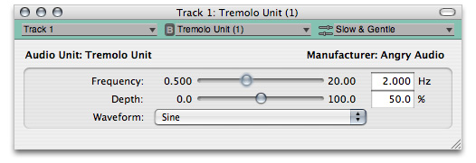

(You may need to quit and reopen AU Lab for your completed audio unit’s view to appear.)

Notice the sliders for the Frequency and Depth parameters, the pop-up menu for the Waveform parameter, and the default preset displayed in the Factory Presets pop-up menu.

3. Click the Play button in the AUAudioFilePlayer utility window. If everything is in order, the file you have selected in the player will play through your audio unit and you’ll hear the tremolo effect.

4. Experiment with the range of effects available with the tremolo unit: adjust the Frequency, Depth, and Waveform controls while listening to the output from AU Lab.

5. In the presets menu toward the upper right of the generic view, choose Show Presets.

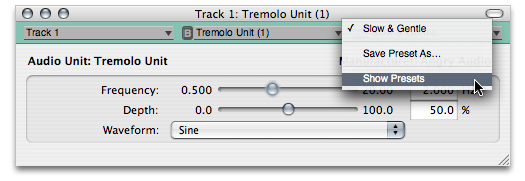

The presets drawer opens.

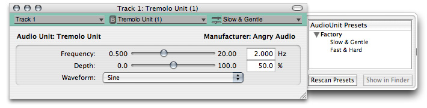

Disclose the presets in the Factory group and verify that the presets that you added to your audio unit, using the `NewFactoryPresetSet` method, are present. Double-click a preset to load it.

You can add user presets to the audio unit as follows:

- Set the parameters as desired
- In the presets menu, choose Save Preset As
- In the dialog that appears, enter a name for the preset.

[Next](Appendix-%20Audio%20Unit%20Class%20Hierarchy.md)[Previous](A%20Quick%20Tour%20of%20the%20Core%20Audio%20SDK.md)

