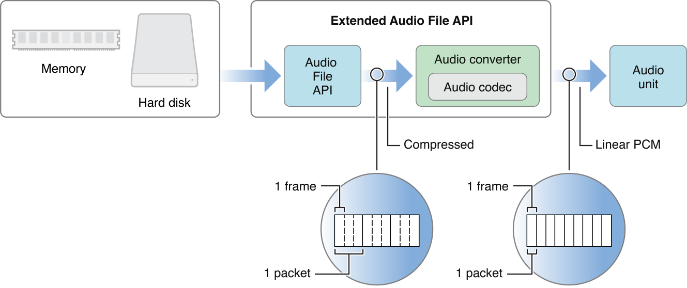
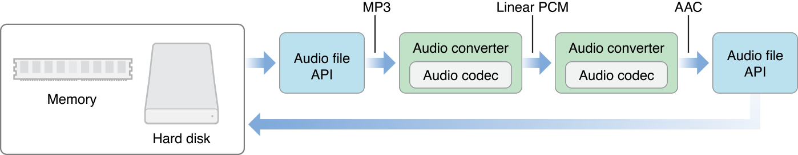
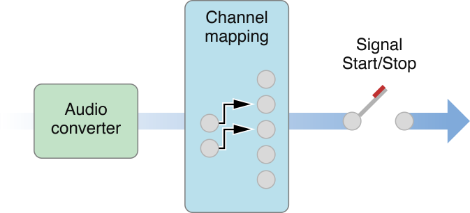
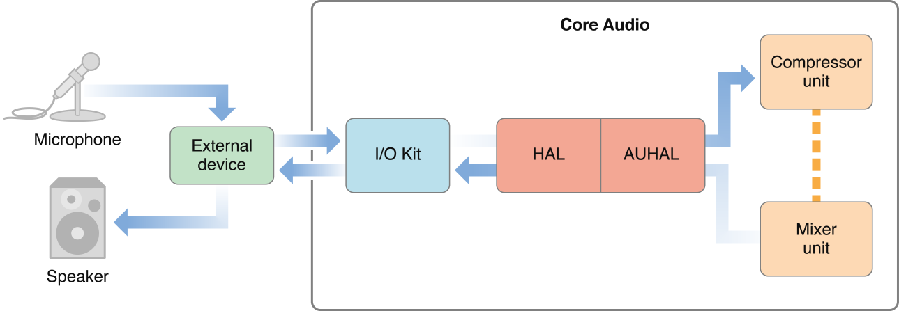
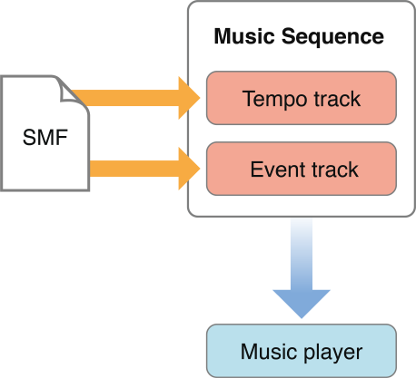
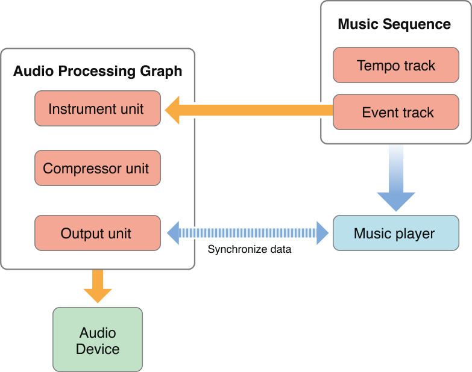
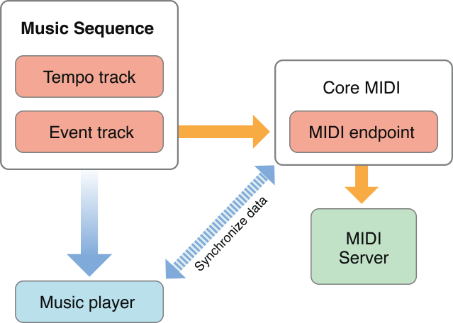
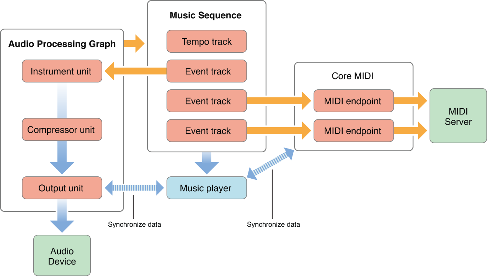
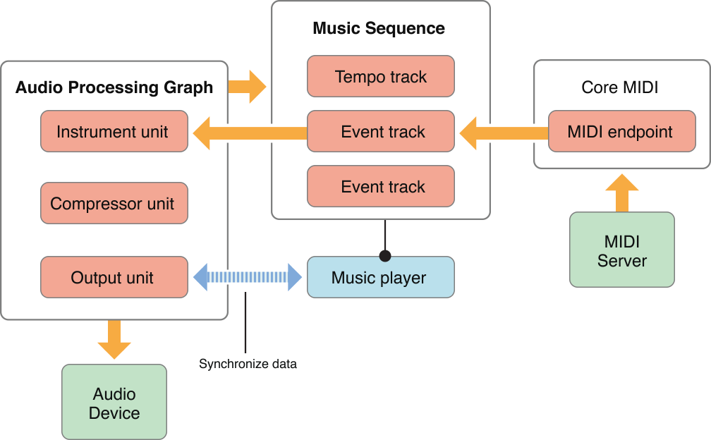
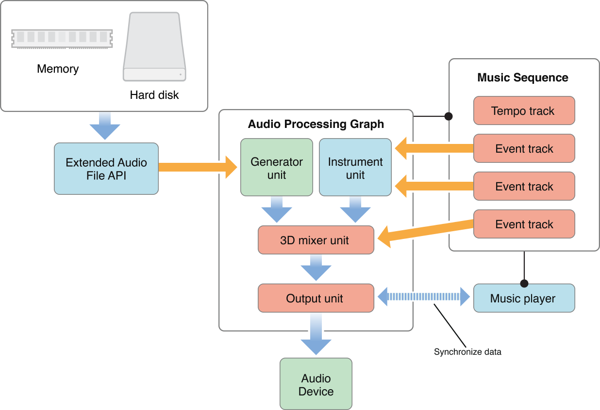

> 导航：[总目录](../../../README.md) · [documentation](../../../_indexes/documentation.md) · [Core Audio Overview](Introduction.md)

[Next](Core%20Audio%20Frameworks.md)[Previous](Core%20Audio%20Essentials.md)

# Common Tasks in OS X

This chapter describes how you can combine parts of Core Audio to accomplish some common tasks in OS X.

Core Audio is extremely modular, with few restrictions on how to use its various parts. In other words, you can often do things in more than one way. For example, your Mac app can call Audio File Services to read a compressed sound file from disk, Audio Converter Services to convert the data to linear PCM, and Audio Queue Services to play it. Alternatively, you could load the built-in File Player audio unit into your application. Each approach has its advantages and capabilities.

Many applications that handle audio need to read and write the data, either to disk or to a buffer. You typically want to read the file’s contained data and convert it to linear PCM. You can do so in one step using Extended Audio File Services.

As shown in Figure 3-1, Extended Audio File Services uses Audio File Services to read the audio data and then calls Audio Converter Services to convert it to linear PCM (assuming the data is not already in that format).

__Figure 3-1__  Reading audio data

If you need more control over the file reading and conversion procedure, you can call Audio File or Audio Converter functions directly. You use Audio File Services to read the file from disk or a buffer. This data may be in a compressed format, in which case it can be converted to linear PCM using an audio converter. You can also use an audio converter to handle changes in bit depth, sampling rate, and so on within the linear PCM format. You handle conversions by using Audio Converter Services to create an audio converter object, specifying the input and output formats you desire. Each format is defined in an ASBD (see [Universal Data Types in Core Audio](Core%20Audio%20Essentials.md#apple-f4xwc4dqnrsv64tfmyxwi33df52wszbpkridimbqgaztknzxfvbuqmjqfvjvomjt)).

Once converted to linear PCM, the data is ready to process—such as by an audio unit. To use an audio unit, you register a callback with the audio unit’s input. You design your callback to provide buffers of PCM data when called. When the audio unit needs more data to process, it invokes your callback.

If you want to output the audio data, you send it to an I/O unit. An I/O unit can accept only linear PCM format data. Such an audio unit is usually a proxy for a hardware device, but this is not a requirement.

Core Audio uses linear PCM as an intermediate format, which permits many permutations of conversions. To determine whether a particular format conversion is possible, you need to make sure that both a decoder (format A to linear PCM) and an encoder (linear PCM to format B) are available. For example, if you wanted to convert data from MP3 to AAC, you would need two audio converters: one to convert from MP3 to linear PCM, and another to convert linear PCM to AAC, as shown in Figure 3-2.

__Figure 3-2__  Converting audio data using two converters

For examples of using the Audio File and Audio Converter APIs, see the `SimpleSDK/ConvertFile` and `Services/AudioFileTools` samples in the Core Audio SDK. If you are interested in writing a custom audio converter codec, see the samples in the `AudioCodec` folder.

Most audio applications connect with external hardware, either to output sound (for example, to an amplifier and loudspeaker) or to obtain it (such as through a microphone). Core Audio’s lower layer makes these connections by talking to the I/O Kit and drivers. OS X provides an interface to these connections, called the _audio hardware abstraction layer_, or audio HAL. You find the audio HAL’s interfaces declared in the `AudioHardware.h` header file in the Core Audio framework.

However, in many cases, applications do not need to use the audio HAL directly. Apple provides three standard audio units that should address most hardware needs: the default output unit, the system output unit, and the AUHAL unit. Your application must explicitly load these audio units before you can use them.

The default I/O unit and system I/O unit send audio data to the default output (as selected by the user) or system output (where alerts and other system sounds are played) respectively. If you connect an audio unit output to one of these I/O units—such as in an audio processing graph—the audio unit’s render callback function is called when the output needs data. The I/O unit routes the data through the HAL to the appropriate output device, automatically handling the following tasks, as shown in Figure 3-3.

__Figure 3-3__  Inside an I/O unit

- Any required linear PCM data conversion. The output unit contains an audio converter that can translate your audio data to the linear PCM variant required by the hardware.
- Any required channel mapping. For example, if your unit is supplying two-channel data but the output device can handle five, you will probably want to map which channels go to which. You can do so by specifying a channel map using the `kAudioOutputUnitProperty_ChannelMap` property on the output unit. If you don't supply a channel map, the default is to map the first audio channel to the first device channel, the second to the second, and so on. The actual output heard is then determined by how the user has configured the device speakers in the Audio MIDI Setup application.
- Signal Start/Stop. Output units are the only audio units that can control the flow of audio data in the signal chain.

For an example of using the default output unit to play audio, see `SimpleSDK/DefaultOutputUnit` in the Core Audio SDK.

If you need to connect to an input device, or a hardware device other than the default output device, you need to use the AUHAL. Although designated as an output device, you can configure the AUHAL to accept input as well by setting the `kAudioOutputUnitProperty_EnableIO` property on the input. For more specifics, see [Technical Note TN2091: Device Input Using the HAL Output Audio Unit](https://developer.apple.com/technotes/tn2002/tn2091.html). When accepting input, the AUHAL supports input channel mapping and uses an audio converter ( if necessary) to translate incoming data to linear PCM format.

The AUHAL is a more generalized version of the default output unit. In addition to the audio converter and channel mapping capabilities, you can specify the device to connect to by setting the `kAudioOutputUnitProperty_CurrentDevice` property to the ID of an `AudioDevice` object in the HAL. Once connected, you can also manipulate properties associated with the `AudioDevice` object by addressing the AUHAL; the AUHAL automatically passes along any property calls meant for the audio device.

An AUHAL instance can connect to only one device at a time, so you can enable both input and output only if the device can accept both. For example, the built-in audio for PowerPC-based Macintosh computers is configured as a single device that can both accept input audio data (through the Mic in) and output audio (through the speaker).

For the purposes of signal flow, the AUHAL configured for both input and output behaves as two audio units. For example, when output is enabled, the AUHAL invokes the previous audio unit's render callback. If an audio unit needs input data from the device, it invokes the AUHAL’s render callback. Figure 3-4 shows the AUHAL used for both input and output.

__Figure 3-4__  The AUHAL used for input and output

An audio signal coming in through the external device is translated into an audio data stream and passed to the AUHAL, which can then send it on to another audio unit. After processing the data (for example, adding effects, or mixing with other audio data), the output is sent back to the AUHAL, which can then output the audio through the same external device.

For examples of using the AUHAL for input and output, see the _[CAPlayThrough](../../../samplecode/CAPlayThrough/CAPlayThrough.md#apple-f4xwc4dqnrsv64tfmyxwi33df52wszbpirkfgmjqgaydinbugm)_ code sample. `CAPlayThrough` shows how to implement input and output using an AUHAL for input and the default output unit for output.

When interfacing with hardware audio devices, Core Audio allows you to add an additional level of abstraction, creating aggregate devices which combine the inputs and outputs of multiple devices to appear as a single device. For example, if you need to accommodate five channels of audio output, you can assign two channels of output to one device and the other three to another device. Core Audio automatically routes the data flow to both devices, while your application can interact with the output as if it were a single device. Core Audio also works on your behalf to ensure proper audio synchronization and to minimize latency, allowing you to focus on details specific to your application or plug-in.

Users can create aggregate devices in the Audio MIDI Setup application by selecting the Audio > Open Aggregate Device Editor menu item. After selecting the sub devices to combine as an aggregate device, the user can configure the device’s input and output channels like any other hardware device. The user also needs to indicate which sub device’s clock should act as the master for synchronization purposes.

Any aggregate devices the user creates are global to the system. You can create aggregate devices that are local to the application process programmatically using HAL Services function calls. An aggregate device appears as an `AudioAggregateDevice` object (a subclass of `AudioDevice`) in the HAL.

An aggregate device retains knowledge of its sub devices. If the user removes a sub device (or configures it in an incompatible manner), those channels disappear from the aggregate, but those channels will reappear when the sub device is reattached or reconfigured.

Aggregate devices have some limitations:

- All the sub devices that make up the aggregate device must be running at the same sampling rate, and their data streams must be mixable.
- They don’t provide any configurable controls, such as volume, mute, or input source selection.
- You cannot specify an aggregate device to be a default input or output device unless all of its sub devices can be a default device. Otherwise, applications must explicitly select an aggregate device in order to use it.
- Currently only devices represented by an `IOAudio` family (that is, kernel-level) driver can be added to an aggregate device.

For detailed information about creating audio units, see _Audio Unit Programming Guide_.

Audio units, being plug-ins, require a host application to load and control them.

Because audio units are Component Manager components, a host application must call the Component Manager to load them. The host application can find and instantiate audio units if they are installed in one of the following folders:

- `~/Library/Audio/Plug-Ins/Components`. Audio units installed here may only be used by the owner of the home folder.
- `/Library/Audio/Plug-Ins/Components`. Audio units installed here are available to all users.
- `/System/Library/Components`. The default location for Apple-supplied audio units.

If you need to obtain a list of available audio units (to display to the user, for example), you need to call the Component Manager function `CountComponents` to determine how many audio units of a particular type are available, then iterate using `FindNextComponent` to obtain information about each unit. A `ComponentDescription` structure contains the identifiers for each audio unit (its type, subtype, and manufacturer codes). See [System-Supplied Audio Units in OS X](System-Supplied%20Audio%20Units%20in%20OS%20X.md#apple-f4xwc4dqnrsv64tfmyxwi33df52wszbpkridimbqgaztknzxfvbuqobnknlte) for a list of Component Manager types and subtypes for Apple-supplied audio units. The host can also open each unit (by calling `OpenComponent`) so it can query it for various property information, such as the audio unit’s default input and output data formats, which the host can then cache and present to the user.

In most cases, an audio processing graph is the simplest way to connect audio units. One advantage of using a processing graph is that the API takes care of making individual Component Manager calls to instantiate or destroy audio units. To create a graph, call `NewAUGraph`, which returns a new graph object. Then you can add audio units to the graph by calling `AUGraphNewNode`. A graph must end in an output unit, either a hardware interface (such as the default output unit or the AUHAL) or the generic output unit.

After adding the units that will make up the processing graph, call `AUGraphOpen`. This function is equivalent to calling `OpenComponent` on each of the audio units in the graph. At this time, you can set audio unit properties such as the channel layout, sampling rate, or properties specific to a particular unit (such as the number of inputs and outputs it contains).

To make individual connections between audio units, call `AUGraphConnectNodeInput`, specifying the output and input to connect. The audio unit chain must end in an output unit; otherwise the host application has no way to start and stop audio processing.

If the audio unit has a user interface, the host application is responsible for displaying it. Audio units may supply a Cocoa or a Carbon-based interface (or both). Code for the user interface is typically bundled along with the audio unit.

- If the interface is Cocoa-based, the host application must query the unit property `kAudioUnitProperty_CocoaUI` to find the custom class that implements the interface (a subclass of `NSView`) and create an instance of that class.
- If the interface is Carbon-based, the user interface is stored as one or more Component Manager components. You can obtain the component identifiers (type, subtype, manufacturer) by querying the `kAudioUnitProperty_GetUIComponentList` property. The host application can then instantiate the user interface by calling `AudioUnitCarbonViewCreate` on a given component, which displays its interface in a window as an HIView.

After building the signal chain, you can initialize the audio units by calling `AUGraphInitialize`. Doing so invokes the initialization function for each audio unit, allowing it to allocate memory for rendering, configure channel information, and so on. Then you can call `AUGraphStart`, which initiates processing. The output unit then requests audio data from the previous unit in the chain (by means of a callback), which then calls its predecessor, and so on. The source of the audio may be an audio unit (such as a generator unit or AUHAL) or the host application may supply audio data itself by registering a callback with the first audio unit in the signal chain (by setting the unit’s `kAudioUnitProperty_SetRenderCallback` property).

While an audio unit is instantiated, the host application may want to know about changes to parameter or property values; it can register a listener object to be notified when changes occur. For details on how to implement such a listener, see [Technical Note TN2104: Handling Audio Unit Events](https://developer.apple.com/technotes/tn2002/tn2104.html).

When the host wants to stop signal processing, it calls `AUGraphStop`.

To uninitialize all the audio units in a graph, call `AUGraphUninitialize`. When back in the uninitialized state, you can still modify audio unit properties and make or change connections. If you call `AUGraphClose`, each audio unit in the graph is deallocated by a `CloseComponent` call. However, the graph still retains the nodal information regarding which units it contains.

To dispose of a processing graph, call `DisposeAUGraph`. Disposing of a graph automatically disposes of any instantiated audio units it contains.

For examples of hosting audio units, see the `Services/AudioUnitHosting` and `Services/CocoaAUHost` examples in the Core Audio SDK.

For an example of implementing an audio unit user interface, see the `AudioUnits/CarbonGenericView` example in the Core Audio SDK. You can use this example with any audio unit containing user-adjustable parameters.

When working with MIDI data, an application might need to load track data from a standard MIDI file (SMF). You can invoke a Music Player function (`MusicSequenceLoadSMFWithFlags` or `MusicSequenceLoadSMFDataWithFlags`) to read in data in the Standard MIDI Format, as shown in Figure 3-5.

__Figure 3-5__  Reading a standard MIDI file

Depending on the type of MIDI file and the flags set when loading a file, you can store all the MIDI data in single track, or store each MIDI channel as a separate track in the sequence. By default, each MIDI channel is mapped sequentially to a new track in the sequence. For example, if the MIDI data contains channels 1, 3, and, 4, three new tracks are added to the sequence, containing data for channels 1, 3, and 4 respectively. These tracks are appended to the sequence at the end of any existing tracks. Each track in a sequence is assigned a zero-based index value.

Timing information (that is, tempo events) goes to the tempo track.

Once you have loaded MIDI data into the sequence, you can assign a music player instance to play it, as shown in Figure 3-6.

__Figure 3-6__  Playing MIDI data

The sequence must be associated with a particular audio processing graph, and the tracks in the sequence can be assigned to one or more instrument units in the graph. (If you don't specify a track mapping, the music player sends all the MIDI data to the first instrument unit it finds in the graph.) The music player assigned to the sequence automatically communicates with the graph's output unit to make sure the outgoing audio data is properly synchronized. The compressor unit, while not required, is useful for ensuring that the dynamic range of the instrument unit’s output stays consistent.

MIDI data in a sequence can also go to external MIDI hardware (or software configured as a virtual MIDI destination), as shown in Figure 3-7.

Tracks destined for MIDI output must be assigned a MIDI endpoint. The music player communicates with Core MIDI to ensure that the data flow to the MIDI device is properly synchronized. Core MIDI then coordinates with the MIDI Server to transmit the data to the MIDI instrument.

__Figure 3-7__  Sending MIDI data to a MIDI device

A sequence of tracks can be assigned to a combination of instrument units and MIDI devices. For example, you can assign some of the tracks to play through an instrument unit, while other tracks go through Core MIDI to play through external MIDI devices, as shown in Figure 3-8.

__Figure 3-8__  Playing both MIDI devices and a virtual instrument

The music player automatically coordinates between the audio processing graph's output unit and Core MIDI to ensure that the outputs are synchronized.

Another common scenario is to play back already existing track data while accepting new MIDI input, as shown in Figure 3-9.

__Figure 3-9__  Accepting new track input

The playback of existing data is handled as usual through the audio processing graph, which sends audio data to the output unit. New data from an external MIDI device enters through Core MIDI and is transferred through the assigned endpoint. Your application must iterate through this incoming data and write the MIDI events to a new or existing track. The Music Player API contains functions to add new tracks to a sequence, and to write time-stamped MIDI events or other messages to a track.

For examples of handling and playing MIDI data, see the following examples in the Core Audio SDK:

- [PlaySoftMIDI](https://developer.apple.com/library/archive/samplecode/PlaySoftMIDI/Introduction/Intro.html#//apple_ref/doc/uid/DTS40008635-Intro), which sends MIDI data to a simple processing graph consisting of an instrument unit and an output unit.
- [PlaySequence](https://developer.apple.com/library/archive/samplecode/PlaySequence/Introduction/Intro.html#//apple_ref/doc/uid/DTS40008652-Intro), which reads in a MIDI file into a sequence and uses a music player to play it.

Sometimes you want to combine audio data with audio synthesized from MIDI data and play back the result. For example, the audio for many games consists of background music, which is stored as an audio file on disk, along with noises triggered by events (footsteps, gunfire, and so on), which are generated as MIDI data. Figure 3-10 shows how you can use Core Audio to combine the two.

__Figure 3-10__  Combining audio and MIDI data

The soundtrack audio data is retrieved from disk or memory and converted to linear PCM using the Extended Audio File API. The MIDI data, stored as tracks in a music sequence, is sent to a virtual instrument unit. The output from the virtual instrument unit is in linear PCM format and can then be combined with the soundtrack data. This example uses a 3D mixer unit, which can position audio sources in a three-dimensional space. One of the tracks in the sequence is sending event data to the mixer unit, which alters the positioning parameters, making the sound appear to move over time. The application would have to monitor the player's movements and add events to the special movement track as necessary.

For an example of loading and playing file-based audio data, see `SimpleSDK/PlayFile` in the Core Audio SDK.

[Next](Core%20Audio%20Frameworks.md)[Previous](Core%20Audio%20Essentials.md)

