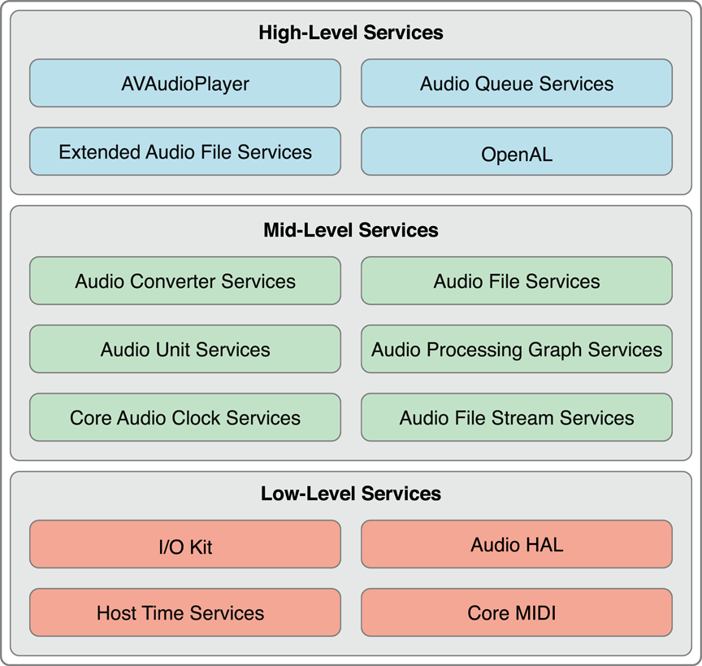
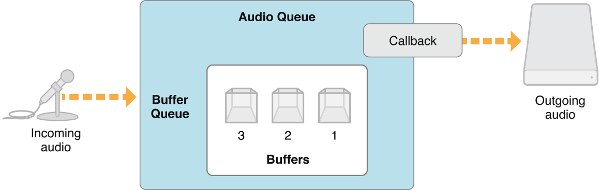
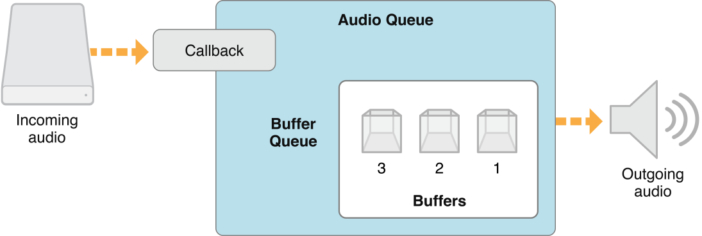
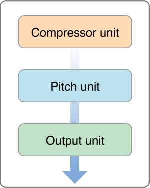
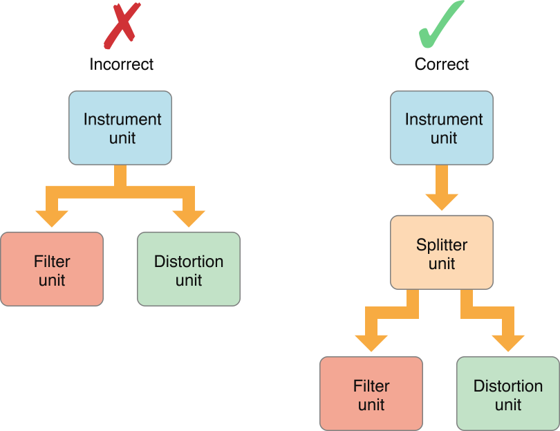
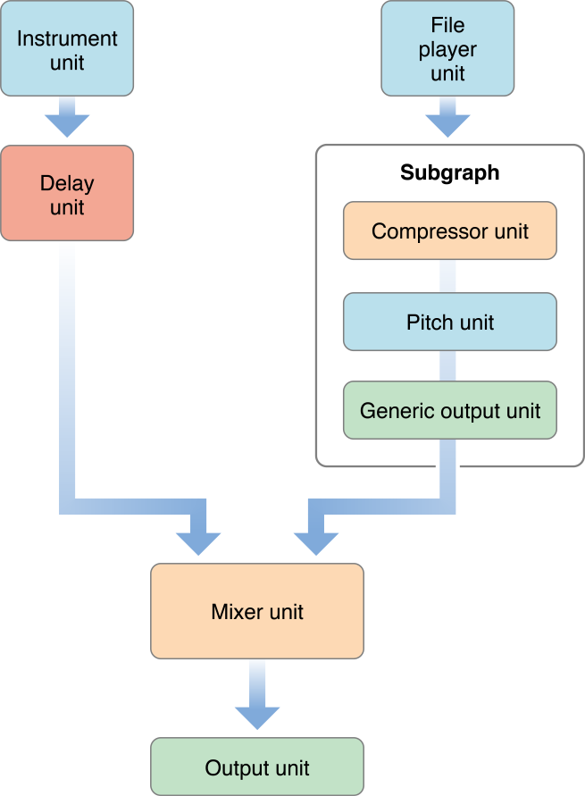
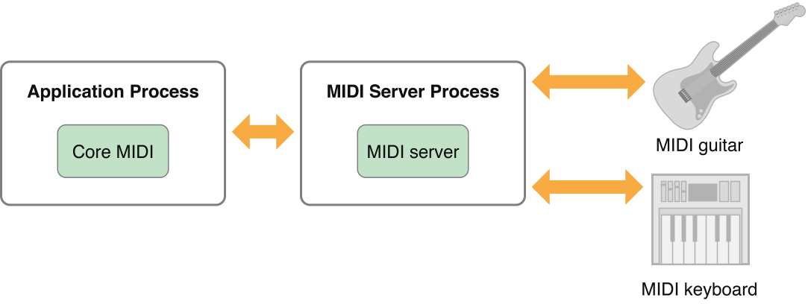
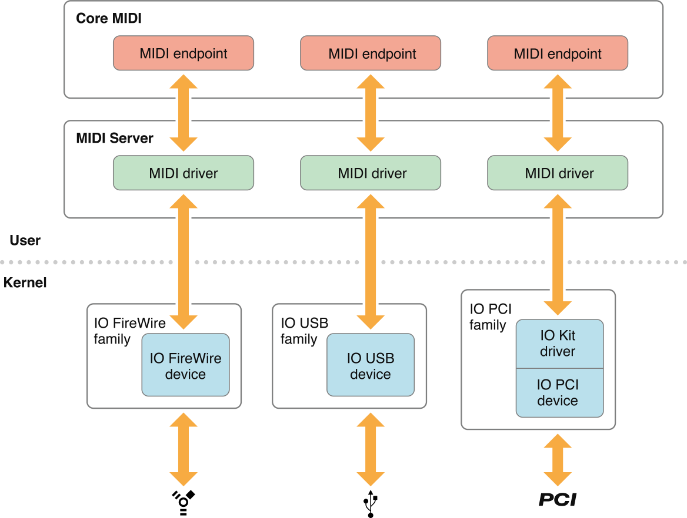
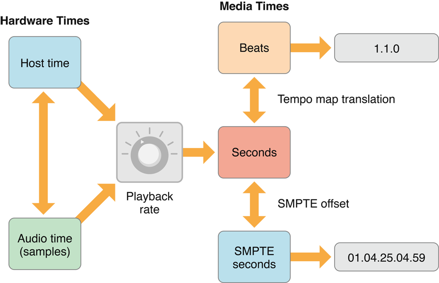

> 导航：[总目录](../../../README.md) · [documentation](../../../_indexes/documentation.md) · [Core Audio Overview](Introduction.md)


[Next](Common%20Tasks%20in%20OS%20X.md)[Previous](What%20Is%20Core%20Audio.md)

# Core Audio Essentials

Apple has designed the software interfaces to Core Audio using a layered, cooperative, task-focused approach. Read the first two sections in this chapter for a brief introduction to these interfaces and how they work together. Continue reading to understand the design principles, use patterns, and programming idioms that pervade Core Audio. The later sections in this chapter introduce you to how Core Audio works with files, streams, recording and playback, and plug-ins.

The programming interfaces for Core Audio are arranged into three layers, as illustrated in Figure 2-1.

__Figure 2-1__  The three API layers of Core Audio



The lowest layer includes:

- The I/O Kit, which interacts with drivers
- The audio hardware abstraction layer (audio HAL), which provides a device-independent, driver-independent interface to hardware
- Core MIDI, which provides software abstractions for working with MIDI streams and devices
- Host Time Services, which provides access to the computer’s clock

Mac apps can be written to use these technologies directly when they require the highest possible, real-time performance. Many audio applications, however, don’t access this layer. Indeed, Core Audio in iOS provides ways to achieve real-time audio using higher level interfaces. OpenAL, for example, employs direct I/O for real-time audio in games. The result is a significantly smaller, tuned API set appropriate for a mobile platform.

The middle layer in Core Audio includes services for data format conversion, reading and writing to disk, parsing streams, and working with plug-ins.

- Audio Converter Services lets applications work with audio data format converters.
- Audio File Services supports reading and writing audio data to and from disk-based files.
- Audio Unit Services and Audio Processing Graph Services let applications work with digital signal processing (DSP) plug-ins such as equalizers and mixers.
- Audio File Stream Services lets you build applications that can parse streams, such as for playing files streamed over a network connection.
- Core Audio Clock Services supports audio and MIDI synchronization as well as time-base conversions.
- Audio Format Services (a small API, not shown in the figure) assists with managing audio data formats in your application.

Core Audio in iOS supports most of these services, as shown in [Figure 1-2](What%20Is%20Core%20Audio.md#apple-f4xwc4dqnrsv64tfmyxwi33df52wszbpkridimbqgaztknzxfvbuqmznknltcny).

The highest layer in Core Audio includes streamlined interfaces that combine features from lower layers.

- Audio Queue Services lets you record, play, pause, loop, and synchronize audio. It employs codecs as necessary to deal with compressed audio formats.
- The `AVAudioPlayer` class provides a simple Objective-C interface for playing and looping audio as well as implementing rewind and fast-forward.
- Extended Audio File Services combines features from Audio File Services and Audio Converter services. It gives you a unified interface for reading and writing uncompressed and compressed sound files.
- OpenAL is the Core Audio implementation of the open-source OpenAL standard for positional audio. It is built on top of the system-supplied 3D Mixer audio unit. All applications can use OpenAL, although it is best suited for games development.

You get another view of Core Audio by considering its API frameworks, located in `/System/Library/Frameworks/`. This section quickly lists them to give you a sense of where to find the pieces that make up the Core Audio layers.

Take note that the Core Audio framework is not an umbrella to the other frameworks here, but rather a peer.

- The Audio Toolbox framework (`AudioToolbox.framework`) provides interfaces for the mid- and high-level services in Core Audio. In iOS, this framework includes Audio Session Services, the interface for managing your application’s audio behavior in the context of a device that functions as a mobile phone and iPod.
- The Audio Unit framework (`AudioUnit.framework`) lets applications work with audio plug-ins, including audio units and codecs.
- The AVFoundation framework (`AVFoundation.framework`) provides the `AVAudioPlayer` class, a streamlined and simple Objective-C interface for audio playback. It also provides the `AVAudioEngine` class for more sophisticated audio handling.
- The Core Audio framework (`CoreAudio.framework`) supplies data types used across Core Audio as well as interfaces for the low-level services.
- The Core Audio Kit framework (`CoreAudioKit.framework`) provides a small API for creating user interfaces for audio units. This framework is not available in iOS.
- The Core MIDI framework (`CoreMIDI.framework`) lets applications work with MIDI data and configure MIDI networks. This framework is not available in iOS.
- The Core MIDI Server framework (`CoreMIDIServer.framework`) lets MIDI drivers communicate with the OS X MIDI server. This framework is not available in iOS.
- The OpenAL framework (`OpenAL.framework`) provides the interfaces to work with OpenAL, an open source, positional audio technology.

The Appendix [Core Audio Frameworks](Core%20Audio%20Frameworks.md#apple-f4xwc4dqnrsv64tfmyxwi33df52wszbpkridimbqgaztknzxfvbuqojnknltc) describes all these frameworks, as well as each of their included header files.

Core Audio uses the notion of _proxy objects_ to represent such things as files, streams, audio players, and so on. When you want your application to work with an on-disk audio file, for example, the first step is to instantiate an audio file object of type `AudioFileID`. This object is declared as an opaque data structure in the `AudioFile.h` header file:

```
typedef struct OpaqueAudioFileID *AudioFileID;
```

You instantiate an audio file object—and create an actual audio file tied to that object—by calling the `AudioFileCreateWithURL` function. The function gives you a reference to the new audio file object. From that point on, you work with the real audio file by communicating with the proxy object.

This sort of pattern is consistent throughout Core Audio, whether you are working with audio files, iPhone audio sessions (described in [Audio Sessions: Cooperating with Core Audio](#apple-f4xwc4dqnrsv64tfmyxwi33df52wszbpkridimbqgaztknzxfvbuqmjqfvjvonbr)), or even hardware devices.

Most Core Audio interfaces use a _property_ mechanism for managing object state or refining object behavior. A property is a key-value pair.

- A property key is typically an enumerator constant with a mnemonic name, such as `kAudioFilePropertyFileFormat` or `kAudioQueueDeviceProperty_NumberChannels`.
- A property value is of a particular data type appropriate for the purpose of the property—a `void*`, a `Float64`, an `AudioChannelLayout` structure, and so on.

There are many Apple-defined properties. You’ll find their definitions in the various Core Audio framework header files. Some Core Audio interfaces, such as Audio Unit Services, let you define your own properties as well.

Core Audio interfaces use accessor functions for retrieving a property value from an object and, in the case of a writable property, changing its value. You’ll also find a third accessor function for getting information about properties. For example, the Audio Unit Services function `AudioUnitGetPropertyInfo` tells you a given property value data type’s size and whether you can change it. The Audio Queue Services function `AudioQueueGetPropertySize` gets a specified property value’s size.

Core Audio interfaces provide a mechanism for informing your application that a property has changed. You can read about this in the next section, [Callback Functions: Interacting with Core Audio](#apple-f4xwc4dqnrsv64tfmyxwi33df52wszbpkridimbqgaztknzxfvbuqmjqfvjvomzy).

In some cases, a property applies to an audio object as a whole. For example, to enable audio level metering in a playback audio queue object, you set the value of its `kAudioQueueProperty_EnableLevelMetering` property to `true`.

Other Core Audio objects have an internal structure, each part of which may have its own set of properties. For example, an audio unit has an input scope, an output scope, and a global scope. An audio unit’s input or output scope consists of one or more elements—each of which is analogous to a channel bus in audio hardware. When you call the `AudioUnitGetProperty` function with the `kAudioUnitProperty_AudioChannelLayout` property, you specify not only the audio unit you want information about but also the scope (input or output) and element (0, 1, 2, etc.).

Many Core Audio interfaces can communicate with your application using callback functions. Core Audio uses callbacks for such things as:

- Delivering a new set of audio data to your application (such as for recording; your callback then writes the new data to disk).
- Requesting a new set of audio data from your application (such as for playback; your callback reads from disk and provides the data).
- Telling your application that a software object has changed state (your callback takes appropriate action).

One way to understand callbacks is to reverse your perspective on who calls whom. In a normal function call, such as `AudioQueueNewOutput`, your application invokes behavior that is defined by Apple in the implementation of the operating system. You don’t know—and don’t need to know—what goes on under the hood. Your application requests a playback audio queue object and gets one back. It works because, in making the call, you adhere to the function interface specified in the function’s header file.

In the case of a callback, the operating system—when it chooses to—invokes behavior that you implement in your application. By defining a callback in your application according to a template, the operating system can successfully invoke it. For example, Audio Queue Services specifies a template for a callback—that you can implement—that lets you get and react to messages when an audio queue object property changes. This callback template, declared in the `AudioQueue.h` header file, is shown in Listing 2-1.

__Listing 2-1__  A template for a callback function

```
typedef void    (*AudioQueuePropertyListenerProc) (
                    void *                  inUserData,
                    AudioQueueRef           inAQ,
                    AudioQueuePropertyID    inID
                );
```

To implement and use a callback in your application, you do two things:

1. Implement the callback function. For example, you might implement the audio queue property listener callback to update the titles and the enabled/disabled state of buttons in your user interface, depending on whether an audio queue object is running or stopped.
2. Register your callback function with the object you want to interact with. One way to register a callback—typically used for callbacks that send or receive audio data—is during object creation: In the function call that creates the object, you pass a reference to your callback as a function parameter. The other way—typically used for property listeners—is by using a dedicated function call, as you will see later in this section.

Listing 2-2 shows one way you might implement a property listener callback function to respond to property changes in a playback audio queue object.

__Listing 2-2__  A property listener callback implementation

```
static void propertyListenerCallback (
    void                    *inUserData,
    AudioQueueRef           queueObject,
    AudioQueuePropertyID    propertyID
) {
    AudioPlayer *player = (AudioPlayer *) inUserData;
        // gets a reference to the playback object
    [player.notificationDelegate updateUserInterfaceOnAudioQueueStateChange: player];
        // your notificationDelegate class implements the UI update method
}
```

(In an Objective-C class definition, you place this callback definition outside the class implementation. This is why, in the body of the function, there is a statement to get a reference to your playback object—in this example, the `inUserData` parameter is your object. You make this reference available for use in the callback when you register the callback, described next.)

You would register this particular callback as shown in Listing 2-3.

__Listing 2-3__  Registering a property listener callback

```
AudioQueueAddPropertyListener (
    self.queueObject,                // the object that will invoke your callback
    kAudioQueueProperty_IsRunning,   // the ID of the property you want to listen for
    propertyListenerCallback,        // a reference to your callback function
    self
);
```


Core Audio insulates you from needing detailed knowledge of audio data formats. Not only does this make it easier to deal with a specific format in your code—it means that one set of code can work with any format supported by the operating system.

In Core Audio, you use two universal data types to represent any audio data format. These types are the data structures `AudioStreamBasicDescription` (Listing 2-4) and `AudioStreamPacketDescription` (Listing 2-5), both declared in the `CoreAudioTypes.h` header file and described in _[Core Audio Data Types Reference](https://developer.apple.com/documentation/coreaudio/core_audio_data_types)_.

__Listing 2-4__  The `AudioStreamBasicDescription` data type

```
struct AudioStreamBasicDescription {
    Float64 mSampleRate;
    UInt32  mFormatID;
    UInt32  mFormatFlags;
    UInt32  mBytesPerPacket;
    UInt32  mFramesPerPacket;
    UInt32  mBytesPerFrame;
    UInt32  mChannelsPerFrame;
    UInt32  mBitsPerChannel;
    UInt32  mReserved;
};
typedef struct AudioStreamBasicDescription  AudioStreamBasicDescription;
```

In this structure, the `mReserved` member must always have a value of `0`. Other members may have a value of `0` as well. For example, compressed audio formats use a varying number of bits per sample. For these formats, the value of the `mBitsPerChannel` member is `0`.

The audio stream packet description type comes into play for certain compressed audio data formats, as described in [Audio Data Packets](#apple-f4xwc4dqnrsv64tfmyxwi33df52wszbpkridimbqgaztknzxfvbuqmjqfvjvomjy).

__Listing 2-5__  The `AudioStreamPacketDescription` data type

```
struct  AudioStreamPacketDescription {
    SInt64  mStartOffset;
    UInt32  mVariableFramesInPacket;
    UInt32  mDataByteSize;
};
typedef struct AudioStreamPacketDescription AudioStreamPacketDescription;
```

For constant bit-rate audio data (as described in [Audio Data Packets](#apple-f4xwc4dqnrsv64tfmyxwi33df52wszbpkridimbqgaztknzxfvbuqmjqfvjvomjy)), the `mVariableFramesInPacket` member in this structure has a value of `0`.

You can fill in the members of an ASBD by hand in your code. When you do, you may not know the correct value for some (or any) of the structure’s members. Set those values to 0 and then use Core Audio interfaces to flesh out the structure.

For example, you can use Audio File Services to give you the complete audio stream basic description for a sound file on disk as shown in Listing 2-6.

__Listing 2-6__  Obtaining an audio stream basic description for playing a sound file

```objc
- (void) openPlaybackFile: (CFURLRef) soundFile {

    AudioFileOpenURL (
        (CFURLRef) self.audioFileURL,
        0x01,                  // read only
        kAudioFileCAFType,
        &audioFileID
    );

    UInt32 sizeOfPlaybackFormatASBDStruct = sizeof ([self audioFormat]);

    AudioFileGetProperty (
        [self audioFileID],
        kAudioFilePropertyDataFormat,
        &sizeOfPlaybackFormatASBDStruct,
        &audioFormat          // the sound file's ASBD is returned here
    );
}
```


Depending on the platform, Core Audio has one or two “canonical” audio data formats in the sense that these formats may be:

- Required as an intermediate format in conversions
- The format for which a service in Core Audio is optimized
- A default, or assumed, format, when you do not otherwise specify an ASBD

The canonical formats in Core Audio are as follows:

- _iOS input and output_ Linear PCM with 16-bit integer samples
- _iOS audio units and other audio processing_ Noninterleaved linear PCM with 8.24-bit fixed-point samples
- _Mac input and output_ Linear PCM with 32-bit floating point samples
- _Mac audio units and other audio processing_ Noninterleaved linear PCM with 32-bit floating point samples

Here is a fully fledged audio stream basic description example that illustrates a two-channel, canonical iPhone audio unit sample format with a 44.1 kHz sample rate.

```
struct AudioStreamBasicDescription {
    mSampleRate       = 44100.0;
    mFormatID         = kAudioFormatLinearPCM;
    mFormatFlags      = kAudioFormatFlagsAudioUnitCanonical;
    mBitsPerChannel   = 8 * sizeof (AudioUnitSampleType);                    // 32 bits
    mChannelsPerFrame = 2;
    mBytesPerFrame    = mChannelsPerFrame * sizeof (AudioUnitSampleType);    // 8 bytes
    mFramesPerPacket  = 1;
    mBytesPerPacket   = mFramesPerPacket * mBytesPerFrame;     // 8 bytes
    mReserved         = 0;
};
```

The constants and data types used as values here are declared in the `CoreAudioTypes.h` header file and described in _[Core Audio Data Types Reference](https://developer.apple.com/documentation/coreaudio/core_audio_data_types)_. Using the `AudioUnitSampleType` data type here (and the `AudioSampleType` data type when handling audio I/O) ensures that an ASBD is platform agnostic.

Two more concepts round out this introduction to audio data formats in Core Audio: magic cookies and packets, described next.

In the realm of Core Audio, a _magic cookie_ is an opaque set of metadata attached to a compressed sound file or stream. The metadata gives a decoder the details it needs to properly decompress the file or stream. You treat a magic cookie as a black box, relying on Core Audio functions to copy, read, and use the contained metadata.

For example, Listing 2-7 shows a method that obtains a magic cookie from a sound file and provides it to a playback audio queue object.

__Listing 2-7__  Using a magic cookie when playing a sound file

```objc
- (void) copyMagicCookieToQueue: (AudioQueueRef) queue fromFile: (AudioFileID) file {

    UInt32 propertySize = sizeof (UInt32);

    OSStatus result = AudioFileGetPropertyInfo (
                            file,
                            kAudioFilePropertyMagicCookieData,
                            &propertySize,
                            NULL
                        );

    if (!result && propertySize) {

        char *cookie = (char *) malloc (propertySize);

        AudioFileGetProperty (
            file,
            kAudioFilePropertyMagicCookieData,
            &propertySize,
            cookie
        );

        AudioQueueSetProperty (
            queue,
            kAudioQueueProperty_MagicCookie,
            cookie,
            propertySize
        );

        free (cookie);
    }
}
```


The previous chapter defined a packet as a collection of one or more frames. It is the smallest meaningful set of frames for a given audio data format. For this reason, it is the best unit of audio data to represent a unit of time in an audio file. Synchronization in Core Audio works by counting packets. You can use packets to calculate useful audio data buffer sizes, as shown in [Listing 2-8](#apple-f4xwc4dqnrsv64tfmyxwi33df52wszbpkridimbqgaztknzxfvbuqmjqfvjvomjz).

Every audio data format is defined, in part, by the way its packets are configured. The audio stream basic description data structure describes basic information about a format’s packets in its `mBytesPerPacket` and `mFramesPerPacket` members, as shown in [Listing 2-4](#apple-f4xwc4dqnrsv64tfmyxwi33df52wszbpkridimbqgaztknzxfvbuqmjqfvjvomq). For formats that require additional information, you use the audio stream packet description data structure, as described in a moment.

There are three kinds of packets used in audio data formats:

- In CBR (constant bit rate) formats, such as linear PCM and IMA/ADPCM, all packets are the same size.
- In VBR (variable bit rate) formats, such as AAC, Apple Lossless, and MP3, all packets have the same number of frames but the number of bits in each sample value can vary.
- In VFR (variable frame rate) formats, packets have a varying number of frames. There are no commonly used formats of this type.

To use VBR or VFR formats in Core Audio, you use the audio stream packet description structure ([Listing 2-5](#apple-f4xwc4dqnrsv64tfmyxwi33df52wszbpkridimbqgaztknzxfvbuqmjqfvjvomy)). Each such structure describes a single packet in a sound file. To record or play a VBR or VFR sound file, you need an array of these structures, one for each packet in the file.

Interfaces in Audio File Services and Audio File Stream Services let you work with packets. For example, the `AudioFileReadPackets` function in `AudioFile.h` gives you a set of packets read from a sound file on disk, placing them in a buffer. At the same time, it gives you an array of `AudioStreamPacketDescription` structures that describes each of those packets.

In CBR and VBR formats (that is, in all commonly used formats), the number of packets per second is fixed for a given audio file or stream. There is a useful implication here: the packetization implies a unit of time for the format. You can use packetization when calculating a practical audio data buffer size for your application. For example, the following method determines the number of packets to read to fill a buffer with a given duration of audio data:

__Listing 2-8__  Calculating playback buffer size based on packetization

```objc
- (void) calculateSizesFor: (Float64) seconds {

    UInt32 maxPacketSize;
    UInt32 propertySize = sizeof (maxPacketSize);

    AudioFileGetProperty (
        audioFileID,
        kAudioFilePropertyPacketSizeUpperBound,
        &propertySize,
        &maxPacketSize
    );

    static const int maxBufferSize = 0x10000;   // limit maximum size to 64K
    static const int minBufferSize = 0x4000;    // limit minimum size to 16K

    if (audioFormat.mFramesPerPacket) {
        Float64 numPacketsForTime =
            audioFormat.mSampleRate / audioFormat.mFramesPerPacket * seconds;
        [self setBufferByteSize: numPacketsForTime * maxPacketSize];
    } else {
        // if frames per packet is zero, then the codec doesn't know the
        // relationship between packets and time. Return a default buffer size
        [self setBufferByteSize:
            maxBufferSize > maxPacketSize ? maxBufferSize : maxPacketSize];
    }

    // clamp buffer size to our specified range
    if (bufferByteSize > maxBufferSize && bufferByteSize > maxPacketSize) {
        [self setBufferByteSize: maxBufferSize];
    } else {
        if (bufferByteSize < minBufferSize) {
            [self setBufferByteSize: minBufferSize];
        }
    }

    [self setNumPacketsToRead: self.bufferByteSize / maxPacketSize];
}
```


To convert audio data from one format to another, you use an audio converter. You can make simple conversions such as changing sample rate or interleaving/deinterleaving. You can also perform complex conversions such as compressing or decompressing audio. Three types of conversions are available:

- Decoding an audio format (such as AAC (Advanced Audio Coding)) to linear PCM format.
- Converting linear PCM data into a different audio format.
- Converting between different variants of linear PCM (for example, converting 16-bit signed integer linear PCM to 8.24 fixed-point linear PCM).

When you use Audio Queue Services (described in [Recording and Playback using Audio Queue Services](#apple-f4xwc4dqnrsv64tfmyxwi33df52wszbpkridimbqgaztknzxfvbuqmjqfvjvomzs)), you get the appropriate converter automatically. Audio Codec Services (Mac only) lets you create specialized audio codecs, such as for handling digital rights management (DRM) or proprietary audio formats. After you create a custom codec, you can use an audio converter to access and use it.

When you use an audio converter explicitly in OS X, you call a conversion function with a particular converter instance, specifying where to find the input data and where to write the output. Most conversions require a callback function to periodically supply input data to the converter. For examples of how to use audio converters, see `SimpleSDK/ConvertFile` and the `AFConvert` command-line tool in `Services/AudioFileTools` in the Core Audio SDK.

[Supported Audio File and Data Formats in OS X](Supported%20Audio%20File%20and%20Data%20Formats%20in%20OS%20X.md#apple-f4xwc4dqnrsv64tfmyxwi33df52wszbpkridimbqgaztknzxfvbuqnznknltc) lists standard Core Audio codecs for translating in either direction between compressed formats and Linear PCM. For more on codecs, see [Codecs](#apple-f4xwc4dqnrsv64tfmyxwi33df52wszbpkridimbqgaztknzxfvbuqmjqfvjvomrw).

Whenever you want to work with sound files in your application, you can use Audio File Services, one of the mid-level services in Core Audio. Audio File Services provides a powerful abstraction for accessing audio data and metadata contained in files, and for creating sound files.

Besides letting you work with the basics—unique file ID, file type, and data format—Audio File Services lets you work with regions and markers, looping, playback direction, SMPTE time code, and more.

You also use Audio File Services for discovering system characteristics. The functions you use are `AudioFileGetGlobalInfoSize` (to let you allocate memory to hold the information you want) and `AudioFileGetGlobalInfo` (to get that information). A long list of properties declared in `AudioFile.h` lets you programmatically obtain system characteristics such as:

- Readable file types
- Writable file types
- For each writable type, the audio data formats you can put into the file

This section also introduces you to two other Core Audio technologies:

- Audio File Stream Services, an audio stream parsing interface, lets you read audio data from disk or from a network stream.
- Extended Audio File Services (Mac only) encapsulates features from Audio File Services and Audio Converter Services, simplifying your code.

To create a new sound file to record into, you need:

- The file system path for the file, in the form of a `CFURL` or `NSURL` object.
- The identifier for the type of file you want to create, as declared in the Audio File Types enumeration in `AudioFile.h`. For example, to create a CAF file, you use the `kAudioFileCAFType` identifier.
- The audio stream basic description for the audio data you will put in the file. In many cases you can provide a partial ASBD and later ask Audio File Services to fill it in for you.

You give these three pieces of information to Audio File Services as parameters to the `AudioFileCreateWithURL` function, which creates the file and gives you back an `AudioFileID` object. You then use this object for further interaction with the sound file. The function call is shown in [Listing 2-9](#apple-f4xwc4dqnrsv64tfmyxwi33df52wszbpkridimbqgaztknzxfvbuqmjqfvjvomrr).

__Listing 2-9__  Creating a sound file

```
AudioFileCreateWithURL (
    audioFileURL,
    kAudioFileCAFType,
    &audioFormat,
    kAudioFileFlags_EraseFile,
    &audioFileID   // the function provides the new file object here
);
```


To open a sound file for playback, you use the `AudioFileOpenURL` function. You supply this function with the file’s URL, a file type hint constant, and the file access permissions you want to use. `AudioFileOpenURL` gives you back a unique ID for the file.

You then use property identifiers, along with the `AudioFileGetPropertyInfo` and `AudioFileGetProperty` functions, to retrieve what you need to know about the file. Some often-used property identifiers—which are fairly self-explanatory—are:

- `kAudioFilePropertyFileFormat`
- `kAudioFilePropertyDataFormat`
- `kAudioFilePropertyMagicCookieData`
- `kAudioFilePropertyChannelLayout`

There are many such identifiers available in Audio File Services that let you obtain metadata that may be in a file, such as region markers, copyright information, and playback tempo.

When a VBR file is long—say, a podcast—obtaining the entire packet table can take a significant amount of time. In such a case, two property identifiers are especially useful: `kAudioFilePropertyPacketSizeUpperBound` and `kAudioFilePropertyEstimatedDuration`. You can use these to quickly approximate a VBR sound file’s duration or number of packets, in lieu of parsing the entire file to get exact numbers.

In iOS you typically use Audio File Services to read audio data from, and write it to, sound files. Reading and writing are essentially mirror images of each other when you use Audio File Services. Both operations block until completion, and both can work using bytes or packets. However, unless you have special requirements, always use packets.

- Reading and writing by packet is the only option for VBR data.
- Using packet-based operations makes it much easier to compute durations.

Another option in iOS for reading audio data from disk is Audio File Stream Services. For an introduction to this technology, see [Sound Streams](#apple-f4xwc4dqnrsv64tfmyxwi33df52wszbpkridimbqgaztknzxfvbuqmjqfvjvomzt) later in this chapter.

Audio Queue Services, declared in the `AudioQueue.h` header file in the Audio Toolbox framework, is the Core Audio interface for recording and playback. For an overview of Audio Queue Services, see [Recording and Playback using Audio Queue Services](#apple-f4xwc4dqnrsv64tfmyxwi33df52wszbpkridimbqgaztknzxfvbuqmjqfvjvomzs) later in this chapter.

Core Audio provides a convenience API called Extended Audio File Services. This interface encompasses the essential functions in Audio File Services and Audio Converter Services, providing automatic data conversion to and from linear PCM. See [Reading and Writing Audio Data](Common%20Tasks%20in%20OS%20X.md#apple-f4xwc4dqnrsv64tfmyxwi33df52wszbpkridimbqgaztknzxfvbuqnrnknltcni) for more on this.

iOS supports the audio file formats listed in [Table 2-1](#apple-f4xwc4dqnrsv64tfmyxwi33df52wszbpkridimbqgaztknzxfvbuqmjqfvjvonjx). For information on audio data formats available in iOS, see [Codecs](#apple-f4xwc4dqnrsv64tfmyxwi33df52wszbpkridimbqgaztknzxfvbuqmjqfvjvomrw).

__Table 2-1__  iOS audio file formats

| Format name | Format filename extensions |
| AIFF | `.aif`, `.aiff` |
| CAF | `.caf` |
| MPEG-1, layer 3 | `.mp3` |
| MPEG-2 or MPEG-4 ADTS | `.aac` |
| MPEG-4 | `.m4a`, `.mp4` |
| WAV | `.wav` |
| AC-3 (Dolby Digital) | `.ac3` |
| Enhanced AC-3 (Dolby Digital Plus) | `.ec3` |

iOS and OS X have a native audio file format, the Core Audio Format (or _CAF_) file format. The CAF format was introduced in OS X v10.4 “Tiger” and is available in iOS 2.0 and newer. It is unique in that it can contain any audio data format supported on a platform.

CAF files have no size restrictions—unlike AIFF and WAVE files—and can support a wide range of metadata, such as channel information and text annotations. For detailed information about the CAF file format, see _[Apple Core Audio Format Specification 1.0](../Apple%20Core%20Audio%20Format%20Specification%201.0.md#apple-f4xwc4dqnrsv64tfmyxwi33df52wszbpkridimbqgaytqnrs)_.

Unlike a disk-based sound file, an _audio file stream_ is audio data whose beginning and end you may not have access to. You encounter streams, for example, when you build an Internet radio player application. A provider typically sends their stream continuously. When a user presses Play to listen in, your application needs to jump aboard no matter what data is going by at the moment—the start, middle, or end of an audio packet, or perhaps a magic cookie.

Also unlike a sound file, a stream’s data may not be reliably available. There may be dropouts, discontinuities, or pauses—depending on the vagaries of the network you get the stream from.

Audio File Stream Services lets your application work with streams and all their complexities. It takes care of the parsing.

To use Audio File Stream Services, you create an audio file stream object, of type `AudioFileStreamID`. This object serves as a proxy for the stream itself. This object also lets your application know what’s going on with the stream by way of properties (see [Properties, Scopes, and Elements](#apple-f4xwc4dqnrsv64tfmyxwi33df52wszbpkridimbqgaztknzxfvbuqmjqfvjvooi)). For example, when Audio File Stream Services has determined the bit rate for a stream, it sets the `kAudioFileStreamProperty_BitRate` property on your audio file stream object.

Because Audio File Stream Services performs the parsing, it becomes your application’s role to respond to being given sets of audio data and other information. You make your application responsive in this way by defining two callback functions.

First, you need a callback for property changes in your audio file stream object. At a minimum, you write this callback to respond to changes in the `kAudioFileStreamProperty_ReadyToProducePackets` property. The typical scenario for using this property is as follows:

1. A user presses Play, or otherwise requests that a stream start playing.
2. Audio File Stream Services starts parsing the stream.
3. When enough audio data packets are parsed to send them along to your application, Audio File Stream Services sets the `kAudioFileStreamProperty_ReadyToProducePackets` property to `true` (actually, to a value of `1`) in your audio file stream object.
4. Audio File Stream Services invokes your application’s property listener callback, with a property ID value of `kAudioFileStreamProperty_ReadyToProducePackets`.
5. Your property listener callback takes appropriate action, such as setting up an audio queue object for playback of the stream.

Second, you need a callback for the audio data. Audio File Stream Services calls this callback whenever it has collected a set of complete audio data packets. You define this callback to handle the received audio. Typically, you play it back immediately by sending it along to Audio Queue Services. For more on playback, see the next section, [Recording and Playback using Audio Queue Services](#apple-f4xwc4dqnrsv64tfmyxwi33df52wszbpkridimbqgaztknzxfvbuqmjqfvjvomzs).

In iOS, your application runs on a device that sometimes has more important things to do, such as take a phone call. If your application is playing sound and a call comes in, the iPhone needs to do the right thing.

For a first pass, this “right thing” means meeting user expectations. For a second pass, it also means that the iPhone needs to consider the current state of each running application when resolving competing requests.

An _audio session_ is an intermediary between your application and iOS. Each iPhone application has exactly one audio session. You configure it to express your application’s audio intentions. To start, you answer some questions about how you want your application to behave:

- How do you want your application to respond to interruptions, such as a phone call?
- Do you intend to mix your application’s sounds with those from other running applications, or do you intend to silence them?
- How should your application respond to an audio route change, for example, when a user plugs in or unplugs a headset?

With answers in hand, you employ the audio session interface (declared in `AudioToolbox/AudioServices.h`) to configure your audio session and your application. Table 2-2 describes the three programmatic features provided by this interface.

__Table 2-2__  Features provided by the audio session interface

| Audio session feature | Description |
| Categories | A category is a key that identifies a set of audio behaviors for your application. By setting a category, you indicate your audio intentions to iOS, such as whether your audio should continue when the screen locks. |
| Interruptions and route changes | Your audio session posts notifications when your audio is interrupted, when an interruption ends, and when the hardware audio route changes. These notifications let you respond to changes in the larger audio environment—such as an interruption due to in an incoming phone call—gracefully. |
| Hardware characteristics | You can query the audio session to discover characteristics of the device your application is running on, such as hardware sample rate, number of hardware channels, and whether audio input is available. |

An audio session comes with some default behavior. Specifically:

- When the user moves the Ring/Silent switch to silent, your audio is silenced.
- When the user presses the Sleep/Wake button to lock the screen, or when the Auto-Lock period expires, your audio is silenced.
- When your audio starts, other audio on the device—such as iPod audio that was already playing—is silenced.

This set of behaviors is specified by the default audio session category, namely `kAudioSessionCategory_SoloAmbientSound`. iOS provides categories for a wide range of audio needs, ranging from user-interface sound effects to simultaneous audio input and output, as you would use for a VOIP (voice over Internet protocol) application. You can specify the category you want at launch and while your application runs.

Audio session default behavior is enough to get you started in iPhone audio development. Except for certain special cases, however, the default behavior is unsuitable for a shipping application, as described next.

One feature conspicuously absent from a default audio session is the ability to reactivate itself following an interruption. An audio session has two primary states: active and inactive. Audio can work in your application only when the audio session is active.

Upon launch, your default audio session is active. However, if a phone call comes in, your session is immediately deactivated and your audio stops. This is called an _interruption_. If the user chooses to ignore the phone call, your application continues running. But with your audio session inactive, audio does not work.

If you use OpenAL, the I/O audio unit, or Audio Queue Services for audio in your application, you must write an interruption listener callback function and explicitly reactivate your audio session when an interruption ends. _[Audio Session Programming Guide](../../Audio/Audio%20Session%20Programming%20Guide/Introduction.md#apple-f4xwc4dqnrsv64tfmyxwi33df52wszbpkridimbqga3tqnzv)_ provides details and code examples.

If you use the `AVAudioPlayer` class, the class takes care of audio session reactivation for you.

A recording application on an iOS-based device can record only if hardware audio input is available. To test this, you use the audio session `kAudioSessionProperty_AudioInputAvailable` property. This is important when your application is running on devices like the iPod touch (2nd generation), which gain audio input only when appropriate accessory hardware is attached. Listing 2-10 shows how to perform the test.

__Listing 2-10__  Determining if a mobile device supports audio recording

```
UInt32 audioInputIsAvailable;
UInt32 propertySize = sizeof (audioInputIsAvailable);

AudioSessionGetProperty (
    kAudioSessionProperty_AudioInputAvailable,
    &propertySize,
    &audioInputIsAvailable // A nonzero value on output means that
                           // audio input is available
);
```


Your application has just one audio session category at a time—so, at a given time, all of your audio obeys the characteristics of the active category. (The one exception to this rule is audio that you play using System Sound Services—the API for alerts and user-interface sound effects. Such audio always uses the lowest priority audio session category.) [Responding to Interruptions](https://developer.apple.com/library/archive/documentation/Audio/Conceptual/AudioSessionProgrammingGuide/HandlingAudioInterruptions/HandlingAudioInterruptions.html#//apple_ref/doc/uid/TP40007875-CH4) in _[Audio Session Programming Guide](../../Audio/Audio%20Session%20Programming%20Guide/Introduction.md#apple-f4xwc4dqnrsv64tfmyxwi33df52wszbpkridimbqga3tqnzv)_ describes all the categories.

When you add audio session support to your application, you can still run your app in the Simulator for development and testing. However, the Simulator does not simulate session behavior. To test the behavior of your audio session code, you need to run on a device.

The `AVAudioPlayer` class provides a simple Objective-C interface for audio playback. If your application does not require stereo positioning or precise synchronization, and if you are not playing audio captured from a network stream, Apple recommends that you use this class for playback.

Using an audio player you can:

- Play sounds of any duration
- Play sounds from files or memory buffers
- Loop sounds
- Play multiple sounds simultaneously
- Control relative playback level for each sound you are playing
- Seek to a particular point in a sound file, which supports such application features as fast forward and rewind
- Obtain data that you can use for audio level metering

The `AVAudioPlayer` class lets you play sound in any audio format available in iOS. For a complete description of this class’s interface, see _[AVAudioPlayer Class Reference](https://developer.apple.com/documentation/avfoundation/avaudioplayer)_.

Unlike OpenAL, the I/O audio unit, and Audio Queue Services, the `AVAudioPlayer` class does not require that you use Audio Session Services. An audio player reactivates itself following an interruption. If you want the behavior specified by the default audio session category (see [Audio Sessions: Cooperating with Core Audio](#apple-f4xwc4dqnrsv64tfmyxwi33df52wszbpkridimbqgaztknzxfvbuqmjqfvjvonbr)), such as having your audio stop when the screen locks, you can successfully use the default audio session with an audio player.

To configure an audio player for playback, you assign a sound file to it, prepare it to play, and designate a delegate object. The code in Listing 2-11 would typically go into an initialization method of the controller class for your application.

__Listing 2-11__  Configuring an AVAudioPlayer object

```
NSString *soundFilePath =
                [[NSBundle mainBundle] pathForResource: @"sound"
                                                ofType: @"wav"];

NSURL *fileURL = [[NSURL alloc] initFileURLWithPath: soundFilePath];

AVAudioPlayer *newPlayer =
                [[AVAudioPlayer alloc] initWithContentsOfURL: fileURL
                                                       error: nil];
[fileURL release];

self.player = newPlayer;
[newPlayer release];

[self.player prepareToPlay];
[self.player setDelegate: self];
```

You use a delegate object (which can be your controller object) to handle interruptions and to update the user interface when a sound has finished playing. The delegate methods for the `AVAudioPlayer` class are described in _[AVAudioPlayerDelegate Protocol Reference](https://developer.apple.com/documentation/avfoundation/avaudioplayerdelegate)_. Listing 2-12 shows a simple implementation of one delegate method. This code updates the title of a Play/Pause toggle button when a sound has finished playing.

__Listing 2-12__  Implementing an AVAudioPlayer delegate method

```objc
- (void) audioPlayerDidFinishPlaying: (AVAudioPlayer *) player
                        successfully: (BOOL) flag {
    if (flag == YES) {
        [self.button setTitle: @"Play" forState: UIControlStateNormal];
    }
}
```

To play, pause, or stop an `AVAudioPlayer` object, call one of its playback control methods. You can test whether or not playback is in progress by using the `playing` property. Listing 2-13 shows a basic play/pause toggle method that controls playback and updates the title of a `UIButton` object.

__Listing 2-13__  Controlling an AVAudioPlayer object

```objc
- (IBAction) playOrPause: (id) sender {

    // if already playing, then pause
    if (self.player.playing) {
        [self.button setTitle: @"Play" forState: UIControlStateHighlighted];
        [self.button setTitle: @"Play" forState: UIControlStateNormal];
        [self.player pause];

    // if stopped or paused, start playing
    } else {
        [self.button setTitle: @"Pause" forState: UIControlStateHighlighted];
        [self.button setTitle: @"Pause" forState: UIControlStateNormal];
        [self.player play];
    }
}
```

The `AVAudioPlayer` class uses the Objective-C declared properties feature for managing information about a sound—such as the playback point within the sound’s timeline, and for accessing playback options—such as volume and looping. For example, you set the playback volume for an audio player as shown here:

```
[self.player setVolume: 1.0];    // available range is 0.0 through 1.0
```

For more information on the `AVAudioPlayer` class, see _[AVAudioPlayer Class Reference](https://developer.apple.com/documentation/avfoundation/avaudioplayer)_.

Audio Queue Services provides a straightforward, low overhead way to record and play audio. It lets your application use hardware recording and playback devices (such as microphones and loudspeakers) without knowledge of the hardware interface. It also lets you use sophisticated codecs without knowledge of how the codecs work.

Although it is a high-level interface, Audio Queue Services supports some advanced features. It provides fine-grained timing control to support scheduled playback and synchronization. You can use it to synchronize playback of multiple audio queues, to play sounds simultaneously, to independently control playback level of multiple sounds, and to perform looping. Audio Queue Services and the `AVAudioPlayer` class (see [Playback using the AVAudioPlayer Class](#apple-f4xwc4dqnrsv64tfmyxwi33df52wszbpkridimbqgaztknzxfvbuqmjqfvjvonbt)) are the only ways to play compressed audio on an iPhone or iPod touch.

You typically use Audio Queue Services in conjunction with Audio File Services (as described in [Sound Files](#apple-f4xwc4dqnrsv64tfmyxwi33df52wszbpkridimbqgaztknzxfvbuqmjqfvjvooa)) or with Audio File Stream Services (as described in [Sound Streams](#apple-f4xwc4dqnrsv64tfmyxwi33df52wszbpkridimbqgaztknzxfvbuqmjqfvjvomzt)).

As is the case with Audio File Stream Services, you interact with audio queue objects using callbacks and properties. For recording, you implement a callback function that accepts audio data buffers—provided by your recording audio queue object—and writes them to disk. Your audio queue object invokes your callback when there is a new buffer of incoming data to record. Figure 2-2 illustrates a simplified view of this process.

__Figure 2-2__  Recording with an audio queue object



For playback, your audio callback has a converse role. It gets called when your playback audio queue object needs another buffer’s worth of audio to play. Your callback then reads a given number of audio packets from disk and hands them off to one of the audio queue object’s buffers. The audio queue object plays that buffer in turn. Figure 2-3 illustrates this.

__Figure 2-3__  Playing back using an audio queue object



To use Audio Queue Services, you first create an audio queue object—of which there are two flavors, although both have the data type `AudioQueueRef`.

- You create a recording audio queue object using the `AudioQueueNewInput` function.
- You create a playback audio queue object using the `AudioQueueNewOutput` function.

To create an audio queue object for playback, perform these three steps:

1. Create a data structure to manage information needed by the audio queue, such as the audio format for the data you want to play.
2. Define a callback function for managing audio queue buffers. The callback uses Audio File Services to read the file you want to play.
3. Instantiate the playback audio queue using the `AudioQueueNewOutput` function.

Listing 2-14 illustrates these steps:

__Listing 2-14__  Creating an audio queue object

```swift
static const int kNumberBuffers = 3;
// Create a data structure to manage information needed by the audio queue
struct myAQStruct {
    AudioFileID                     mAudioFile;
    CAStreamBasicDescription        mDataFormat;
    AudioQueueRef                   mQueue;
    AudioQueueBufferRef             mBuffers[kNumberBuffers];
    SInt64                          mCurrentPacket;
    UInt32                          mNumPacketsToRead;
    AudioStreamPacketDescription    *mPacketDescs;
    bool                            mDone;
};
// Define a playback audio queue callback function
static void AQTestBufferCallback(
    void                   *inUserData,
    AudioQueueRef          inAQ,
    AudioQueueBufferRef    inCompleteAQBuffer
) {
    myAQStruct *myInfo = (myAQStruct *)inUserData;
    if (myInfo->mDone) return;
    UInt32 numBytes;
    UInt32 nPackets = myInfo->mNumPacketsToRead;

    AudioFileReadPackets (
        myInfo->mAudioFile,
        false,
        &numBytes,
        myInfo->mPacketDescs,
        myInfo->mCurrentPacket,
        &nPackets,
        inCompleteAQBuffer->mAudioData
    );
    if (nPackets > 0) {
        inCompleteAQBuffer->mAudioDataByteSize = numBytes;
        AudioQueueEnqueueBuffer (
            inAQ,
            inCompleteAQBuffer,
            (myInfo->mPacketDescs ? nPackets : 0),
            myInfo->mPacketDescs
        );
        myInfo->mCurrentPacket += nPackets;
    } else {
        AudioQueueStop (
            myInfo->mQueue,
            false
        );
        myInfo->mDone = true;
    }
}
// Instantiate an audio queue object
AudioQueueNewOutput (
    &myInfo.mDataFormat,
    AQTestBufferCallback,
    &myInfo,
    CFRunLoopGetCurrent(),
    kCFRunLoopCommonModes,
    0,
    &myInfo.mQueue
);
```


Audio queue objects give you two ways to control playback level.

To set playback level directly, use the `AudioQueueSetParameter` function with the `kAudioQueueParam_Volume` parameter, as shown in Listing 2-15. Level change takes effect immediately.

__Listing 2-15__  Setting playback level directly

```
Float32 volume = 1;
AudioQueueSetParameter (
    myAQstruct.audioQueueObject,
    kAudioQueueParam_Volume,
    volume
);
```

You can also set playback level for an audio queue buffer, using the `AudioQueueEnqueueBufferWithParameters` function. This lets you assign audio queue settings that are, in effect, carried by an audio queue buffer as you enqueue it. Such changes take effect when the audio queue buffer begins playing.

In both cases, level changes for an audio queue remain in effect until you change them again.

You can obtain the current playback level from an audio queue object by querying its `kAudioQueueProperty_CurrentLevelMeterDB` property. The value of this property is an array of `AudioQueueLevelMeterState` structures, one per channel. Listing 2-16 shows this structure:

__Listing 2-16__  The `AudioQueueLevelMeterState` structure

```
typedef struct AudioQueueLevelMeterState {
    Float32     mAveragePower;
    Float32     mPeakPower;
};  AudioQueueLevelMeterState;
```


To play multiple sounds simultaneously, create one playback audio queue object for each sound. For each audio queue, schedule the first buffer of audio to start at the same time using the `AudioQueueEnqueueBufferWithParameters` function.

Audio format is critical when you play sounds simultaneously on iPhone or iPod touch. This is because playback of certain compressed formats in iOS employs an efficient hardware codec. Only a single instance of one of the following formats can play on the device at a time:

- AAC
- ALAC (Apple Lossless)
- MP3

To play high quality, simultaneous sounds, use linear PCM or IMA4 audio.

The following list describes how iOS supports audio formats for individual or multiple playback:

- _Linear PCM and IMA/ADPCM (IMA4) audio_ You can play multiple linear PCM or IMA4 format sounds simultaneously in iOS without incurring CPU resource problems.
- _AAC, MP3, and Apple Lossless (ALAC) audio_ Playback for AAC, MP3, and Apple Lossless (ALAC) sounds uses efficient hardware-based decoding on iPhone and iPod touch. You can play only one such sound at a time.

For a complete description of how to use Audio Queue Services for recording and playback, including code samples, see _[Audio Queue Services Programming Guide](../Audio%20Queue%20Services%20Programming%20Guide/Introduction.md#apple-f4xwc4dqnrsv64tfmyxwi33df52wszbpkridimbqga2tgnbt)_.

The open-sourced OpenAL audio API—available in the OpenAL framework and built on top of Core Audio—is optimized for positioning sounds during playback. OpenAL makes it easy to play, position, mix, and move sounds, using an interface modeled after OpenGL. OpenAL and OpenGL share a common coordinate system, enabling you to synchronize the movements of sounds and on-screen graphical objects. OpenAL uses Core Audio’s I/O audio unit (see [Audio Units](#apple-f4xwc4dqnrsv64tfmyxwi33df52wszbpkridimbqgaztknzxfvbuqmjqfvjvomrv)) directly, resulting in lowest-latency playback.

For all of these reasons, OpenAL is your best choice for playing sound effects in game applications on iPhone and iPod touch. OpenAL is also a good choice for general iOS application playback needs.

OpenAL 1.1 in iOS does not support audio capture. For recording in iOS, use Audio Queue Services.

OpenAL in OS X provides an implementation of the OpenAL 1.1. specification, plus extensions. OpenAL in iOS has two Apple extensions:

- `alBufferDataStaticProcPtr` follows the use pattern for `alBufferData` but eliminates a buffer data copy.
- `alcMacOSXMixerOutputRateProcPtr` lets you control the sample rate of the underlying mixer.

For a Mac example of using OpenAL in Core Audio, see `Services/OpenALExample` in the Core Audio SDK.

To play short sound files when you do not need level, positioning, audio session, or other control, use System Sound Services, declared in the `AudioServices.h` header file in the Audio Toolbox framework. This interface is ideal when you just want to play a short sound in the simplest way possible. In iOS, sounds played using System Sound Services are limited to a maximum duration of 30 seconds.

In iOS, you call the `AudioServicesPlaySystemSound` function to immediately play a sound effect file that you designate. Alternatively, you can call `AudioServicesPlayAlertSound` when you need to alert the user. Each of these functions will invoke vibration on an iPhone if the user has set the silence switch. (Using the iOS Simulator or on the desktop, of course, there is no vibration or buzzing.)

You can explicitly invoke vibration on an iPhone by using the `kSystemSoundID_Vibrate` constant when you call the `AudioServicesPlaySystemSound` function.

To play a sound with the `AudioServicesPlaySystemSound` function, you first register your sound effect file as a system sound by creating a sound ID object. You can then play the sound. In typical use, which includes playing a sound occasionally or repeatedly, retain the sound ID object until your application quits. If you know that you will use a sound only once—for example, in the case of a startup sound—you can destroy the sound ID object immediately after playing the sound, freeing memory.

Listing 2-17 shows a minimal program that uses the interfaces in System Sound Services to play a sound. The sound completion callback, and the call that installs it, are primarily useful when you want to free memory after playing a sound in cases where you know you will not be playing the sound again.

__Listing 2-17__  Playing a short sound

```c
#include <AudioToolbox/AudioToolbox.h>
#include <CoreFoundation/CoreFoundation.h>

// Define a callback to be called when the sound is finished
// playing. Useful when you need to free memory after playing.
static void MyCompletionCallback (
    SystemSoundID  mySSID,
    void * myURLRef
) {
        AudioServicesDisposeSystemSoundID (mySSID);
        CFRelease (myURLRef);
        CFRunLoopStop (CFRunLoopGetCurrent());
}

int main (int argc, const char * argv[]) {
    // Set up the pieces needed to play a sound.
    SystemSoundID    mySSID;
    CFURLRef        myURLRef;
    myURLRef = CFURLCreateWithFileSystemPath (
        kCFAllocatorDefault,
        CFSTR ("../../ComedyHorns.aif"),
        kCFURLPOSIXPathStyle,
        FALSE
    );

    // create a system sound ID to represent the sound file
    OSStatus error = AudioServicesCreateSystemSoundID (myURLRef, &mySSID);

    // Register the sound completion callback.
    // Again, useful when you need to free memory after playing.
    AudioServicesAddSystemSoundCompletion (
        mySSID,
        NULL,
        NULL,
        MyCompletionCallback,
        (void *) myURLRef
    );

    // Play the sound file.
    AudioServicesPlaySystemSound (mySSID);

    // Invoke a run loop on the current thread to keep the application
    // running long enough for the sound to play; the sound completion
    // callback later stops this run loop.
    CFRunLoopRun ();
    return 0;
}
```


Core Audio has a plug-in mechanism for processing audio data. In iOS, the system supplies these plug-ins. In OS X, you have built-in plug-ins and can also create your own.

Multiple host application can each use multiple instances of an audio unit or codec.

In iOS, audio units provide the mechanism for applications to achieve low-latency input and output. They also provide certain DSP features, as described here.

In OS X, audio units are most prominent as add-ons to audio applications like GarageBand and Logic Studio. In this role, an audio unit has its own user interface, or _view_. Audio units in iOS do not have views.

On either platform, you find the programmatic names of the built-in audio units in the `AUComponent.h` header file in the Audio Unit framework.

iOS audio units use 8.24-bit fixed point linear PCM audio data for input and output. The one exception is data format converter units, as described in the following list. The iOS audio units are:

- _3D mixer unit_—Allows any number of mono inputs, each of which can be 8-bit or 16-bit linear PCM. Provides one stereo output in 8.24-bit fixed-point PCM. The 3D mixer unit performs sample rate conversion on its inputs and provides a great deal of control over each input channel. This control includes volume, muting, panning, distance attenuation, and rate control for these changes. Programmatically, this is the `kAudioUnitSubType_AU3DMixerEmbedded` unit.
- _Multichannel mixer unit_—Allows any number of mono or stereo inputs, each of which can be 16-bit linear or 8.24-bit fixed-point PCM. Provides one stereo output in 8.24-bit fixed-point PCM. Your application can mute and unmute each input channel as well as control its volume. Programmatically, this is the `kAudioUnitSubType_MultiChannelMixer` unit.
- _Converter unit_—Provides sample rate, bit depth, and bit format (linear to fixed-point) conversions. The iPhone converter unit’s canonical data format is 8.24-bit fixed-point PCM. It converts to or from this format. Programmatically, this is the `kAudioUnitSubType_AUConverter` unit.
- _I/O unit_—Provides real-time audio input and output and performs sample rate conversion as needed. Programmatically, this is the `kAudioUnitSubType_RemoteIO` unit.
- _iPod EQ unit_—Provides a simple equalizer you can use in your application, with the same presets available in the built-in iPhone iPod application. The iPod EQ unit uses 8.24-bit fixed-point PCM input and output. Programmatically, this is the `kAudioUnitSubType_AUiPodEQ` unit.

The special category of audio unit known as the _I/O unit_ is described further in [Audio Processing Graphs](#apple-f4xwc4dqnrsv64tfmyxwi33df52wszbpkridimbqgaztknzxfvbuqmjqfvjvomry), because of the important role that such audio units play there.

OS X provides more than 40 audio units, all of which you can find listed in [System-Supplied Audio Units in OS X](System-Supplied%20Audio%20Units%20in%20OS%20X.md#apple-f4xwc4dqnrsv64tfmyxwi33df52wszbpkridimbqgaztknzxfvbuqobnknlte). You can also create your own audio units, either as building blocks for your application or to provide to customers as products in their own right. Refer to _[Audio Unit Programming Guide](../Audio%20Unit%20Programming%20Guide/Introduction.md#apple-f4xwc4dqnrsv64tfmyxwi33df52wszbpkridimbqgaztenzy)_ for more information.

OS X audio units use noninterleaved 32-bit floating point linear PCM data for input and output—except in the case of an audio unit that is a data format converter, which converts to or from this format. OS X audio units may also support other linear PCM variants—but no formats other than linear PCM. This ensures compatibility with audio units from Apple and other vendors. To convert audio data of a different format to linear PCM, you can use an audio converter (see [Data Format Conversion](#apple-f4xwc4dqnrsv64tfmyxwi33df52wszbpkridimbqgaztknzxfvbuqmjqfvjvonzq).

In iOS and in OS X, host applications use functions in Audio Unit Services to discover and load audio units. Each audio unit is uniquely identified by a three-element combination of type, subtype, and manufacturer code. The type code, specified by Apple, indicates the general purpose of the unit (effect, generator, and so on). The subtype describes more precisely what an audio unit does, but is not programmatically significant for audio units. If your company provides more than one effect unit, however, each must have a distinct subtype to distinguish it from the others. The manufacturer code identifies you as the developer of your audio units. Apple expects you to register a manufacturer code, as a “creator code,“ on the [Data Type Registration](https://developer.apple.com/datatype/) page.

Audio units describe their capabilities and configuration information using properties, as described in [Properties, Scopes, and Elements](#apple-f4xwc4dqnrsv64tfmyxwi33df52wszbpkridimbqgaztknzxfvbuqmjqfvjvooi). Each audio unit type has some required properties, as defined by Apple, but you are free to add additional properties based on your audio unit’s needs. In OS X, host applications can use property information to create a generic view for an audio unit, and you can provide a custom view as an integral piece of your audio unit.

Audio units also use a _parameter_ mechanism for settings that are adjustable in real time, often by the end user. These parameters are not arguments to functions, but rather a mechanism that supports user adjustments to audio unit behavior. For example, a parametric filter unit may have parameters for center frequency and width of filter response, settable through a view.

To monitor changes in the state of an audio unit in OS X, applications can register callback functions (sometimes called _listeners_) that are invoked when particular audio unit events occur. For example, a Mac app might want to know when a user moves a slider in an audio unit’s view, or when audio data flow is interrupted. See [Technical Note TN2104: Handling Audio Unit Events](https://developer.apple.com/technotes/tn2002/tn2104.html) for more details.

The Core Audio SDK (in its `AudioUnits` folder) provides templates for common audio unit types (for example, effect units and instrument units) along with a C++ framework that implements most of the Component Manager plug-in interface for you. For detailed information about building audio units for OS X using the SDK, see _[Audio Unit Programming Guide](../Audio%20Unit%20Programming%20Guide/Introduction.md#apple-f4xwc4dqnrsv64tfmyxwi33df52wszbpkridimbqgaztenzy)_.

The recording and playback codecs available in iOS are chosen to balance audio quality, flexibility in application development, hardware features, and battery life.

There are two groups of playback codecs in iOS. The first group, listed in Table 2-3, includes highly efficient formats that you can use without restriction. That is, you can play more than one instance of each of these formats at the same time.

For information on audio file formats supported in iOS, see [iPhone Audio File Formats](#apple-f4xwc4dqnrsv64tfmyxwi33df52wszbpkridimbqgaztknzxfvbuqmjqfvjvonbx).

__Table 2-3__  iOS: unrestricted playback audio formats

| iLBC (internet Low Bitrate Codec, also a speech codec) |
| IMA/ADPCM (also known as IMA-4) |
| Linear PCM |
| µLaw and aLaw |

The second group of iOS playback codecs all share a single hardware path. Consequently, only a single instance of one of these formats can play at a time:

__Table 2-4__  iOS: restricted playback audio formats

| AAC |
| Apple Lossless |
| MP3 |

iOS contains the recording codecs listed in Table 2-5. As you can see, neither MP3 nor AAC recording is available. This is due to the high CPU overhead, and consequent battery drain, of these formats.

__Table 2-5__  iOS: recording audio formats

| Apple Lossless |
| iLBC (internet Low Bitrate Codec, a speech codec) |
| IMA/ADPCM (also known as IMA-4) |
| Linear PCM |
| µLaw and aLaw |

In OS X, you find a wide array of codecs and supported formats, described in [Supported Audio File and Data Formats in OS X](Supported%20Audio%20File%20and%20Data%20Formats%20in%20OS%20X.md#apple-f4xwc4dqnrsv64tfmyxwi33df52wszbpkridimbqgaztknzxfvbuqnznknltc).

OS X also provides interfaces for using and creating audio data codecs. These interfaces are declared in the `AudioConverter.h` header file (in the Audio Toolbox framework) and `AudioCodec.h` (in the Audio Unit framework). [Common Tasks in OS X](Common%20Tasks%20in%20OS%20X.md#apple-f4xwc4dqnrsv64tfmyxwi33df52wszbpkridimbqgaztknzxfvbuqnrnknltc) describes how you might use these services.

An _audio processing graph_ (sometimes called an _AUGraph_) defines a collection of audio units strung together to perform a complex task. For example, a graph could distort a signal, compress it, and then pan it to a particular location in the soundstage. When you define a graph, you have a reusable processing module that you can add to and remove from a signal chain in your application.

A processing graph typically ends in an I/O unit (sometimes called an _output unit_). An I/O unit often interfaces (indirectly—via low-level services) with hardware, but this is not a requirement. An I/O unit can send its output, instead, back to your application.

You may also see an I/O unit referred to as the _head node_ in a processing graph. I/O units are the only ones that can start and stop data flow in a graph. This is an essential aspect of the so-called _pull_ mechanism that audio units use to obtain data. Each audio unit in a graph registers a rendering callback with its successor, allowing that successor to request audio data. When an I/O unit starts the data flow (triggered, in turn, by your application), its render method calls back to the preceding audio unit in the chain to ask for data, which in turn calls its predecessor, and so on.

iOS has a single I/O unit, as described in [Audio Units](#apple-f4xwc4dqnrsv64tfmyxwi33df52wszbpkridimbqgaztknzxfvbuqmjqfvjvomrv). The story on OS X is a bit more complex.

- The _AUHAL unit_ is for dedicated input and output to a specific hardware device. See Technical Note TN2091, _[Device input using the HAL Output Audio Unit](https://developer.apple.com/library/archive/technotes/tn2091/_index.html#//apple_ref/doc/uid/DTS10003118)_.
- The _Generic I/O unit_ lets you connect the output of an audio processing graph to your application. You can also use a generic I/O unit as the head node of a subgraph, as you can see in [Figure 2-6](#apple-f4xwc4dqnrsv64tfmyxwi33df52wszbpkridimbqgaztknzxfvbuqmjqfvjvomzr).
- The _System I/O unit_ is for alerts and user interface sound effects.
- The _Default I/O unit_ is for all other audio input and output.

The Audio MIDI Setup application (Mac only; in the Utilities folder) lets a user direct the connections of the System I/O and Default I/O units separately.

Figure 2-4 shows a simple audio processing graph, in which signal flows from the top to the bottom.

__Figure 2-4__  A simple audio processing graph



Each audio unit in an audio processing graph can be called a _node_. You make a processing graph connection by attaching an output from one node to the input of another. You cannot connect a single output to more than one input unless you use an intervening splitter unit, as shown in Figure 2-5.

__Figure 2-5__  How to fan out an audio unit connection



However, an audio unit may be designed to provide multiple outputs or inputs, depending on its type. A splitter unit does this, for example.

You can use Audio Processing Graph Services to combine subgraphs into a larger graph, where a subgraph appears as a single node in the larger graph. Figure 2-6 illustrates this.

__Figure 2-6__  A subgraph connection



Each graph or subgraph must end in an I/O unit. A subgraph, or a graph whose output feeds your application, should end with the generic I/O unit, which does not connect to hardware.

While you can link audio units programmatically without using an audio processing graph, it’s rarely a good idea. Graphs offer important advantages. You can modify a graph dynamically, allowing you to change the signal path while processing data. In addition, because a graph encapsulates an interconnection of audio units, you instantiate a graph in one step instead of explicitly instantiating each of the audio units it references.

Core Audio uses Core MIDI Services for MIDI support. These services consist of the functions, data types, and constants declared in the following header files in `CoreMIDI.framework`:

- `MIDIServices.h`
- `MIDISetup.h`
- `MIDIThruConnection.h`
- `MIDIDriver.h`

Core MIDI Services defines an interface that applications and audio units can use to communicate with MIDI devices. It uses a number of abstractions that allow an application to interact with a MIDI network.

A _MIDI endpoint_ (defined by an opaque type `MIDIEndpointRef`) represents a source or destination for a standard 16-channel MIDI data stream. You can associate endpoints with tracks used by Music Player Services, allowing you to record or play back MIDI data. A MIDI endpoint is a proxy object for a standard MIDI cable connection. MIDI endpoints do not necessarily have to correspond to a physical device, however; an application can set itself up as a virtual source or destination to send or receive MIDI data.

MIDI drivers often combine multiple endpoints into logical groups, called _MIDI entities_ (`MIDIEntityRef`). For example, it would be reasonable to group a MIDI-in endpoint and a MIDI-out endpoint as a MIDI entity, which can then be easily referenced for bidirectional communication with a device or application.

Each physical MIDI device (not a single MIDI connection) is represented by a Core MIDI device object (`MIDIDeviceRef`). Each device object may contain one or more MIDI entities.

Core MIDI communicates with the MIDI Server, which does the actual job of passing MIDI data between applications and devices. The MIDI Server runs in its own process, independent of any application. Figure 2-7 shows the relationship between Core MIDI and MIDI Server.

__Figure 2-7__  Core MIDI and Core MIDI Server



In addition to providing an application-agnostic base for MIDI communications, MIDI Server also handles any MIDI thru connections, which allows device-to device chaining without involving the host application.

If you are a MIDI device manufacturer, you may need to supply a CFPlugin plug-in for the MIDI Server packaged in a CFBundle to interact with the kernel-level I/O Kit drivers. Figure 2-8 shows how Core MIDI and Core MIDI Server interact with the underlying hardware.

__Figure 2-8__  MIDI Server interface with I/O Kit



The drivers for each MIDI device generally exist outside the kernel, running in the MIDI Server process. These drivers interact with the default I/O Kit drivers for the underlying protocols (such as USB and FireWire). The MIDI drivers are responsible for presenting the raw device data to Core MIDI in a usable format. Core MIDI then passes the MIDI information to your application through the designated MIDI endpoints, which are the abstract representations of the MIDI ports on the external devices.

MIDI devices on PCI cards, however, cannot be controlled entirely through a user-space driver. For PCI cards, you must create a kernel extension to provide a custom user client. This client must either control the PCI device itself (providing a simple message queue for the user-space driver) or map the address range of the PCI device into the address of the MIDI server when requested to do so by the user-space driver. Doing so allows the user-space driver to control the PCI device directly.

For an example of implementing a user-space MIDI driver, see `MIDI/SampleUSBDriver` in the Core Audio SDK.

Music Player Services allows you to arrange and play a collection of MIDI music tracks.

A _track_ is a stream of MIDI or event data (represented by the `MusicTrack` data type). Tracks contain a series of time-based events, which can be MIDI data, Core Audio event data, or custom event messages. You can think of a track as sheet music for one instrument.

A _sequence_ is a collection of tracks (represented by the `MusicSequence` data type). A sequence always contains an separate tempo track, used for synchronizing all its tracks. You can think of a sequence as a musical score, which collects the sheet music for multiple instruments. Your Mac app can add, delete, or edit tracks in a sequence dynamically.

To play a sequence you assign it to a _music player_ object (of type `MusicPlayer`), which acts as the conductor, controlling the playback of the sequence. To produce sound, you send each track to an instrument unit or to an external MIDI device.

Track data does not have to represent musical information. You could instead use a track to implement audio unit automation. For example, a track assigned to a panner unit could control the apparent position of a sound source in the soundstage. Tracks can also contain proprietary user events that trigger an application-defined callback.

For more information about using Music Player Services to play MIDI data, see [Handling MIDI Data](Common%20Tasks%20in%20OS%20X.md#apple-f4xwc4dqnrsv64tfmyxwi33df52wszbpkridimbqgaztknzxfvbuqnrnknltcmy).

Core Audio Clock Services provides a reference clock that you can use to synchronize applications and devices. This clock may be a standalone timing source or it can be synchronized with an external trigger, such as a MIDI beat clock or MIDI time code. You can start and stop the clock yourself, or you can set the clock to activate or deactivate in response to certain events.

You can obtain the generated clock time in a number of formats, including seconds, beats, SMPTE time, audio sample time, and bar-beat time. The latter describes the time in a manner that is easy to display onscreen in terms of musical bars, beats, and subbeats. Core Audio Clock Services also contains utility functions that convert one time format to another and that display bar-beat or SMPTE times. Figure 2-9 shows the interrelationship between various Core Audio Clock formats.

__Figure 2-9__  Some Core Audio Clock formats



The hardware times represent absolute time values from either the host time (the system clock) or an audio time obtained from an external audio device (represented by an `AudioDevice` object in the HAL). You determine the current host time by calling `mach_absolute_time` or `UpTime`. The audio time is the audio device’s current time represented by a sample number. The sample number’s rate of change depends on the audio device’s sampling rate.

The media times represent common timing methods for audio data. The canonical representation is in seconds, expressed as a double-precision floating point value. However, you can use a tempo map to translate seconds into musical bar-beat time, or apply a SMPTE offset to convert seconds to SMPTE seconds.

Media times do not have to correspond to real time. For example, an audio file that is 10 seconds long will take only 5 seconds to play if you double the playback rate. The knob in [Services Available in iOS Only](Core%20Audio%20Services.md#apple-f4xwc4dqnrsv64tfmyxwi33df52wszbpkridimbqgaztknzxfvbuqnbnknlto) indicates that you can adjust the correlation between the absolute (“real”) times and the media-based times. For example, bar-beat notation indicates the rhythm of a musical line and what notes to play when, but does not indicate how long it takes to play. To determine that, you need to know the playback rate (say, in beats per second). Similarly, the correspondence of SMPTE time to actual time depends on such factors as the frame rate and whether frames are dropped or not.

[Next](Common%20Tasks%20in%20OS%20X.md)[Previous](What%20Is%20Core%20Audio.md)

