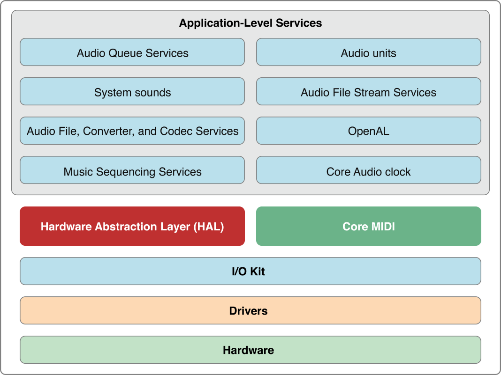
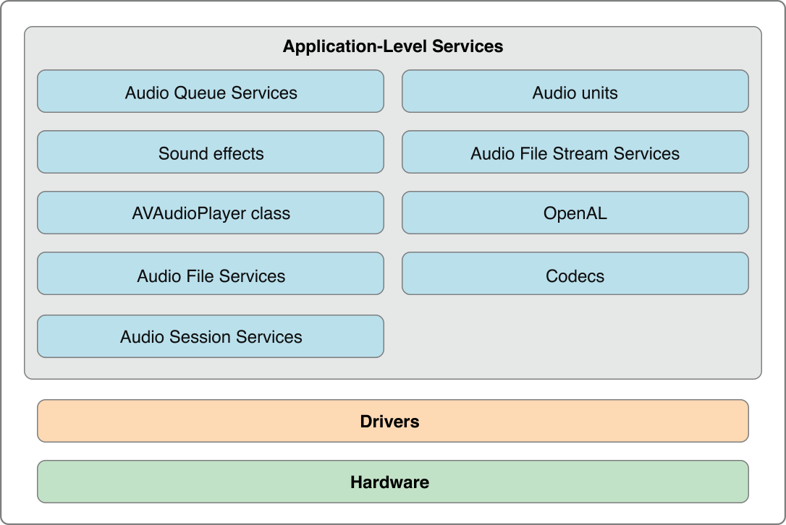
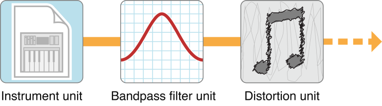
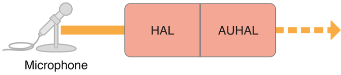
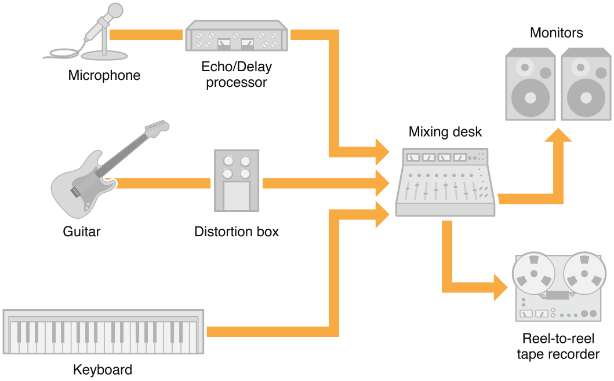
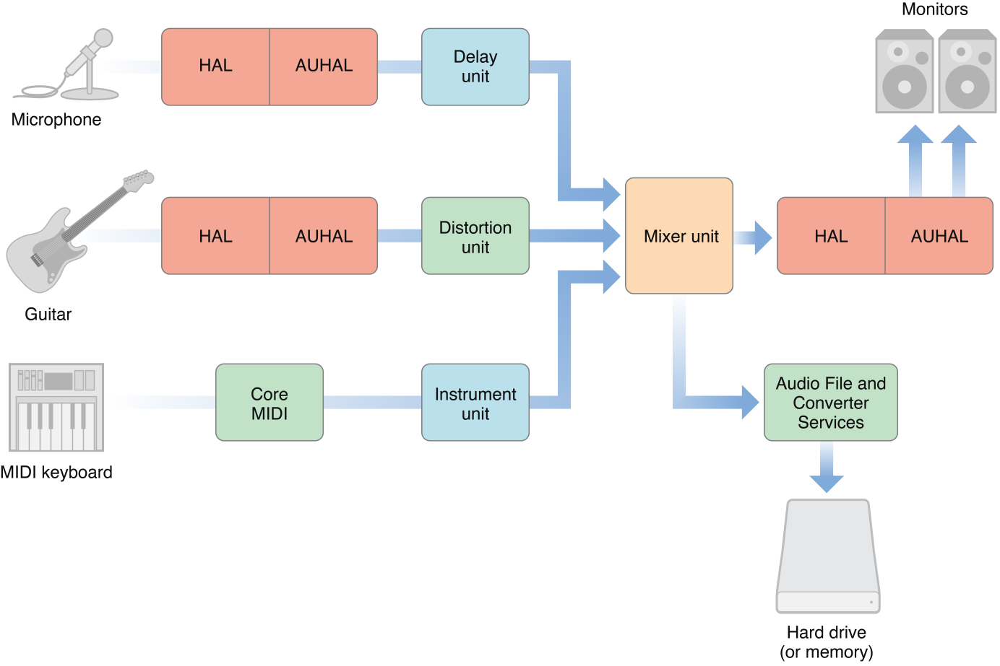

> 导航：[总目录](../../../README.md) · [documentation](../../../_indexes/documentation.md) · [Core Audio Overview](Introduction.md)

[Next](Core%20Audio%20Essentials.md)[Previous](Introduction.md)

# What Is Core Audio?

Core Audio is the digital audio infrastructure of iOS and OS X. It includes a set of software frameworks designed to handle the audio needs in your applications. Read this chapter to learn what you can do with Core Audio.

Core Audio is tightly integrated into iOS and OS X for high performance and low latency.

In OS X, the majority of Core Audio services are layered on top of the Hardware Abstraction Layer (HAL) as shown in Figure 1-1. Audio signals pass to and from hardware through the HAL. You can access the HAL using Audio Hardware Services in the Core Audio framework when you require real-time audio. The Core MIDI (Musical Instrument Digital Interface) framework provides similar interfaces for working with MIDI data and devices.

__Figure 1-1__  OS X Core Audio architecture

You find Core Audio application-level services in the Audio Toolbox and Audio Unit frameworks.

- Use Audio Queue Services to record, play back, pause, loop, and synchronize audio.
- Use Audio File, Converter, and Codec Services to read and write from disk and to perform audio data format transformations. In OS X you can also create custom codecs.
- Use Audio Unit Services and Audio Processing Graph Services (represented in the figure as “Audio units”) to host audio units (audio plug-ins) in your application. In OS X you can also create custom audio units to use in your application or to provide for use in other applications.
- Use Music Sequencing Services to play MIDI-based control and music data.
- Use Core Audio Clock Services for audio and MIDI synchronization and time format management.
- Use System Sound Services (represented in the figure as “System sounds”) to play system sounds and user-interface sound effects.

Core Audio in iOS is optimized for the computing resources available in a battery-powered mobile platform. There is no API for services that must be managed very tightly by the operating system—specifically, the HAL and the I/O Kit. However, there are additional services in iOS not present in OS X. For example, Audio Session Services lets you manage the audio behavior of your application in the context of a device that functions as a mobile telephone and an iPod. Figure 1-2 provides a high-level view of the audio architecture in iOS.

__Figure 1-2__  iOS Core Audio architecture

Most Core Audio services use and manipulate audio in linear pulse-code-modulated (_linear PCM_) format, the most common uncompressed digital audio data format. Digital audio recording creates PCM data by measuring an analog (real world) audio signal’s magnitude at regular intervals (the _sampling rate_) and converting each sample to a numerical value. Standard compact disc (CD) audio uses a sampling rate of 44.1 kHz, with a 16-bit integer describing each sample—constituting the resolution or _bit depth_.

- A _sample_ is single numerical value for a single channel.
- A _frame_ is a collection of time-coincident samples. For instance, a stereo sound file has two samples per frame, one for the left channel and one for the right channel.
- A _packet_ is a collection of one or more contiguous frames. In linear PCM audio, a packet is always a single frame. In compressed formats, it is typically more. A packet defines the smallest meaningful set of frames for a given audio data format.

In linear PCM audio, a sample value varies linearly with the amplitude of the original signal that it represents. For example, the 16-bit integer samples in standard CD audio allow 65,536 possible values between silence and maximum level. The difference in amplitude from one digital value to the next is always the same.

Core Audio data structures, declared in the `CoreAudioTypes.h` header file, can describe linear PCM at any sample rate and bit depth. [Audio Data Formats](Core%20Audio%20Essentials.md#apple-f4xwc4dqnrsv64tfmyxwi33df52wszbpkridimbqgaztknzxfvbuqmjqfvjvony) goes into more detail on this topic.

In OS X, Core Audio expects audio data to be in native-endian, 32-bit floating-point, linear PCM format. You can use Audio Converter Services to translate audio data between different linear PCM variants. You also use these converters to translate between linear PCM and compressed audio formats such as MP3 and Apple Lossless. Core Audio in OS X supplies codecs to translate most common digital audio formats (though it does not supply an encoder for converting to MP3).

iOS uses integer and fixed-point audio data. The result is faster calculations and less battery drain when processing audio. iOS provides a Converter audio unit and includes the interfaces from Audio Converter Services. For details on the so-called _canonical_ audio data formats for iOS and OS X, see [Canonical Audio Data Formats](Core%20Audio%20Essentials.md#apple-f4xwc4dqnrsv64tfmyxwi33df52wszbpkridimbqgaztknzxfvbuqmjqfvjvomjw).

In iOS and OS X, Core Audio supports most common file formats for storing and playing audio data, as described in [iPhone Audio File Formats](Core%20Audio%20Essentials.md#apple-f4xwc4dqnrsv64tfmyxwi33df52wszbpkridimbqgaztknzxfvbuqmjqfvjvonbx) and [Supported Audio File and Data Formats in OS X](Supported%20Audio%20File%20and%20Data%20Formats%20in%20OS%20X.md#apple-f4xwc4dqnrsv64tfmyxwi33df52wszbpkridimbqgaztknzxfvbuqnznknltc).

_Audio units_ are software plug-ins that process audio data. In OS X, a single audio unit can be used simultaneously by an unlimited number of channels and applications.

iOS provides a set of audio units optimized for efficiency and performance on a mobile platform. You can develop audio units for use in your iOS application. Because you must statically link custom audio unit code into your application, audio units that you develop cannot be used by other applications in iOS.

The audio units provided in iOS do not have user interfaces. Their main use is to provide low-latency audio in your application. For more on iPhone audio units, see [Core Audio Plug-ins: Audio Units and Codecs](Core%20Audio%20Essentials.md#apple-f4xwc4dqnrsv64tfmyxwi33df52wszbpkridimbqgaztknzxfvbuqmjqfvjvomjq).

In Mac apps that you develop, you can use system-supplied or third-party-supplied audio units. You can also develop an audio unit as a product in its own right. Users can employ your audio units in applications such as GarageBand and Logic Studio, as well as in many other audio unit hosting applications.

Some Mac audio units work behind the scenes to simplify common tasks for you—such as splitting a signal or interfacing with hardware. Others appear onscreen, with their own user interfaces, to offer signal processing and manipulation. For example, effect units can mimic their real-world counterparts, such as a guitarist’s distortion box. Other audio units generate signals, whether programmatically or in response to MIDI input.

Some examples of audio units are:

- A signal processor (for example, a high-pass filter, reverb, compressor, or distortion unit). Each of these is generically an _effect unit_ and performs digital signal processing (DSP) in a way similar to a hardware effects box or outboard signal processor.
- A musical instrument or software synthesizer. These are called _instrument units_ (or, sometimes, music devices) and typically generate musical notes in response to MIDI input.
- A signal source. Unlike an instrument unit, a _generator unit_ is not activated by MIDI input but rather through code. For example, a generator unit might calculate and generate sine waves, or it might source the data from a file or network stream.
- An interface to hardware input or output. For more information on _I/O units_, see [The Hardware Abstraction Layer](#apple-f4xwc4dqnrsv64tfmyxwi33df52wszbpkridimbqgaztknzxfvbuqmznknltm) and [Interfacing with Hardware](Common%20Tasks%20in%20OS%20X.md#apple-f4xwc4dqnrsv64tfmyxwi33df52wszbpkridimbqgaztknzxfvbuqnrnknltcmq).
- A format converter. A _converter unit_ can translate data between two linear PCM variants, merge or split audio streams, or perform time and pitch changes. See [Core Audio Plug-ins: Audio Units and Codecs](Core%20Audio%20Essentials.md#apple-f4xwc4dqnrsv64tfmyxwi33df52wszbpkridimbqgaztknzxfvbuqmjqfvjvomjq) for details.
- A mixer or panner. A _mixer unit_ can combine audio tracks. A _panner unit_ can apply stereo or 3D panning effects.
- An effect unit that works offline. An _offline effect unit_ performs work that is either too processor-intensive or simply impossible in real time. For example, an effect that performs time reversal on a file must be applied offline.

In OS X you can mix and match audio units in whatever permutations you or your end user requires. Figure 1-3 shows a simple chain of audio units. There’s an instrument unit to generate an audio signal based on control data received from an outboard MIDI keyboard. The generated audio then passes through effect units to apply bandpass filtering and distortion. A chain of audio units is called an _audio processing graph_.

__Figure 1-3__  A simple audio processing graph

If you develop audio DSP code that you want to make available to multiple applications, you should package your code as an audio unit.

If you develop Mac audio apps, supporting audio units lets you and your users leverage the library of existing audio units (both third-party and Apple-supplied) to extend the capabilities of your application.

To experiment with audio units in OS X, see the AU Lab application, available in the Xcode Tools installation at `/Developer/Applications/Audio`. AU Lab lets you mix and match audio units to build a signal chain from an audio source through an output device.

See [System-Supplied Audio Units in OS X](System-Supplied%20Audio%20Units%20in%20OS%20X.md#apple-f4xwc4dqnrsv64tfmyxwi33df52wszbpkridimbqgaztknzxfvbuqobnknlte) for a listing of the audio units that ship with OS X v10.5 and iOS 2.0.

Core Audio uses a hardware abstraction layer (HAL) to provide a consistent and predictable interface for applications to interact with hardware. The HAL can also provide timing information to your application to simplify synchronization or to adjust for latency.

In most cases, your code does not interact directly with the HAL. Apple supplies a special audio unit—called the AUHAL unit in OS X and the AURemoteIO unit in iOS—which allows you to pass audio from another audio unit to hardware. Similarly, input coming from hardware is routed through the AUHAL unit (or the AURemoteIO unit in iOS) and made available to subsequent audio units, as shown in Figure 1-4.

__Figure 1-4__  Hardware input through the HAL and the AUHAL unit

The AUHAL unit (or AURemoteIO unit) also takes care of any data conversion or channel mapping required to translate audio data between audio units and hardware.

Core MIDI is the part of Core Audio that supports the MIDI protocol. (MIDI is not available in iOS.) Core MIDI allows applications to communicate with MIDI devices such as keyboards and guitars. Input from MIDI devices can be stored as MIDI data or used to control an instrument unit. Applications can also send MIDI data to MIDI devices.

Core MIDI uses abstractions to represent MIDI devices and mimic standard MIDI cable connections (MIDI In, MIDI Out, and MIDI Thru) while providing low-latency input and output. Core Audio also supports a music player programming interface that you can use to play MIDI-based control or music data.

For more details about the capabilities of the MIDI protocol, see the MIDI Manufacturers Association site, [http://midi.org](http://midi.org/).

The Audio MIDI Setup application lets users:

- Specify the default audio input and output devices.
- Configure properties for input and output devices, such as sampling rate and bit depth.
- Map audio channels to available speakers (for stereo, 5.1 surround, and so on).
- Create aggregate devices. (For information about aggregate devices, see [Using Aggregate Devices](Common%20Tasks%20in%20OS%20X.md#apple-f4xwc4dqnrsv64tfmyxwi33df52wszbpkridimbqgaztknzxfvbuqnrnknltcna).)
- Configure MIDI networks and MIDI devices.

You find Audio MIDI Setup in the `/Applications/Utilities` folder.

A traditional—non-computer-based—recording studio can serve as a conceptual framework for approaching Core Audio. Such a studio may have a few “real” instruments and effect units feeding a mixing desk, as shown in Figure 1-5. The mixer can route its output to studio monitors and a recording device (shown here, in a rather retro fashion, as a tape recorder).

__Figure 1-5__  A simple non-computer-based recording studio

Many of the pieces in a traditional studio can be replaced by software-based equivalents—all of which you have already met in this chapter. On a desktop computing platform, digital audio applications can record, synthesize, edit, mix, process, and play back audio. They can also record, edit, process, and play back MIDI data, interfacing with both hardware and software MIDI instruments. Mac apps rely on Core Audio services to handle all of these tasks, as shown in Figure 1-6.

__Figure 1-6__  A Core Audio "recording studio"

As you can see, audio units can make up much of an audio signal chain. Other Core Audio interfaces provide application-level support, allowing applications to obtain audio or MIDI data in various formats and output it to files or output devices. [Core Audio Services](Core%20Audio%20Services.md#apple-f4xwc4dqnrsv64tfmyxwi33df52wszbpkridimbqgaztknzxfvbuqnbnknlti) discusses the constituent interfaces of Core Audio in more detail.

Core Audio lets you do much more than mimic a recording studio on a desktop computer. You can use it for everything from playing sound effects to creating compressed audio files to providing an immersive sonic experience for game players.

On a mobile device such as an iPhone or iPod touch, the audio environment and computing resources are optimized to extend battery life. After all, an iPhone’s most essential identity is as a telephone. From a development or user perspective, it wouldn’t make sense to place an iPhone at the heart of a virtual recording studio. On the other hand, an iPhone’s special capabilities—including extreme portability, built-in Bonjour networking, multitouch interface, and accelerometer and location APIs—let you imagine and create audio applications that were never possible on the desktop.

To assist audio developers, Apple supplies a software development kit (SDK) for Core Audio in OS X. The SDK contains many code samples covering both audio and MIDI services as well as diagnostic tools and test applications. Examples include:

- A test application to interact with the global audio state of the system, including attached hardware devices (HALLab).
- A reference audio unit hosting application (AU Lab). The AU Lab application is essential for testing audio units you create, as described in [Audio Units](#apple-f4xwc4dqnrsv64tfmyxwi33df52wszbpkridimbqgaztknzxfvbuqmznknltq).
- Sample code to load and play audio files (PlayFile) and MIDI files (PlaySequence).

This document points to additional examples in the Core Audio SDK that illustrate how to accomplish common tasks.

The SDK also contains a C++ framework for building audio units for OS X. This framework simplifies the amount of work you need to do by insulating you from the details of the Component Manager plug-in interface. The SDK also contains templates for common audio unit types; for the most part, you only need override those methods that apply to your custom audio unit. Some sample audio unit projects show these templates and frameworks in use. For more details on using the framework and templates, see _Audio Unit Programming Guide_.

The Core Audio SDK assumes you will use Xcode as your development environment.

You can download the latest SDK from [http://developer.apple.com/sdk/](https://developer.apple.com/sdk/). After installation, the SDK files are located in `/Developer/Examples/CoreAudio`. The HALLab and AU Lab applications are located in `/Developer/Applications/Audio`.

[Next](Core%20Audio%20Essentials.md)[Previous](Introduction.md)

