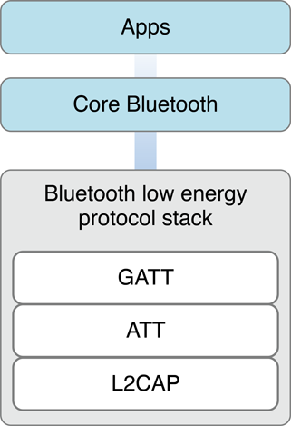

> 导航：[总目录](../../../README.md) · [documentation](../../../_indexes/documentation.md)

[Next](Core%20Bluetooth%20Overview.md)

# About Core Bluetooth

The Core Bluetooth framework provides the classes needed for your iOS and Mac apps to communicate with devices that are equipped with Bluetooth low energy wireless technology. For example, your app can discover, explore, and interact with low energy peripheral devices, such as heart rate monitors and digital thermostats. As of macOS 10.9 and iOS 6, Mac and iOS devices can also function as Bluetooth low energy peripherals, serving data to other devices, including other Mac and iOS devices.

Bluetooth low energy wireless technology is based on the Bluetooth 4.0 specification, which, among other things, defines a set of protocols for communicating between low energy devices. The Core Bluetooth framework is an abstraction of the Bluetooth low energy protocol stack. That said, it hides many of the low-level details of the specification from you, the developer, making it much easier for you to develop apps that interact with Bluetooth low energy devices.

### Centrals and Peripherals Are the Key Players in Core Bluetooth

In Bluetooth low energy communication, there are two key players: the central and the peripheral. Each player has a different role. A peripheral typically has data that is needed by other devices. A central typically uses the information served up by a peripheral to accomplish some task. For example, a digital thermostat equipped with Bluetooth low energy technology might provide the temperature of a room to an iOS app that then displays the temperature in a user-friendly way.

Each player performs a different set of tasks when carrying out its role. Peripherals make their presence known by advertising the data they have over the air. Centrals scan for nearby peripherals that might have data they’re interested in. When a central discovers such a peripheral, the central requests to connect to the peripheral and begins exploring and interacting with the peripheral’s data. The peripheral is responsible for responding to the central in appropriate ways.

### Core Bluetooth Simplifies Common Bluetooth Tasks

The Core Bluetooth framework abstracts away the low-level details from the Bluetooth 4.0 specification. As a result, many of the common Bluetooth low energy tasks you need to implement in your app are simplified. If you are developing an app that implements the central role, Core Bluetooth makes it easy to discover and connect with a peripheral, and to explore and interact with the peripheral’s data. In addition, Core Bluetooth makes it easy to set up your local device to implement the peripheral role.

### iOS App States Affect Bluetooth Behavior

When your iOS app is in the background or in a suspended state, its Bluetooth-related capabilities are affected. By default, your app is unable to perform Bluetooth low energy tasks while it is in the background or in a suspended state. That said, if your app needs to perform Bluetooth low energy tasks while in the background, you can declare it to support one or both of the Core Bluetooth background execution modes (there’s one for the central role, and one for the peripheral role). Even when you declare one or both of these background execution modes, certain Bluetooth tasks operate differently while your app is in the background. You want to take these differences into account when designing your app.

Even apps that support background processing may be terminated by the system at any time to free up memory for the current foreground app. As of iOS 7, Core Bluetooth supports saving state information for central and peripheral manager objects and restoring that state at app launch time. You can use this feature to support long-term actions involving Bluetooth devices.

### Follow Best Practices to Enhance the User Experience

The Core Bluetooth framework gives your app control over many of the common Bluetooth low energy transactions. Follow best practices to harness this level of control in a responsible way and enhance the user’s experience.

For example, many of the tasks you perform when implementing the central or the peripheral role use your device’s onboard radio to transmit signals over the air. Because your device’s radio is shared with other forms of wireless communication, and because radio usage has an adverse effect on a device’s battery life, always design your app to minimize how much it uses the radio.

If you have never used the Core Bluetooth framework, or if you are unfamiliar with basic Bluetooth low energy concepts, read this document in its entirety. In [Core Bluetooth Overview](Core%20Bluetooth%20Overview.md#apple-f4xwc4dqnrsv64tfmyxwi33df52wszbpkridimbqgeztenjxfvbuqmrnknltc), you learn the key terms and concepts that you need to know for the remainder of the book.

After you understand the key concepts, read [Performing Common Central Role Tasks](Performing%20Common%20Central%20Role%20Tasks.md#apple-f4xwc4dqnrsv64tfmyxwi33df52wszbpkridimbqgeztenjxfvbuqmznknltc) to learn how to develop your app to implement the central role on your local device. Similarly, to learn how to develop your app to implement the peripheral role on your local device, read [Performing Common Peripheral Role Tasks](Performing%20Common%20Peripheral%20Role%20Tasks.md#apple-f4xwc4dqnrsv64tfmyxwi33df52wszbpkridimbqgeztenjxfvbuqnbnknltc).

To ensure that your app is performing well and adhering to best practices, read the later chapters: [Core Bluetooth Background Processing for iOS Apps](Core%20Bluetooth%20Background%20Processing%20for%20iOS%20Apps.md#apple-f4xwc4dqnrsv64tfmyxwi33df52wszbpkridimbqgeztenjxfvbuqnznknltc), [Best Practices for Interacting with a Remote Peripheral Device](Best%20Practices%20for%20Interacting%20with%20a%20Remote%20Peripheral%20Device.md#apple-f4xwc4dqnrsv64tfmyxwi33df52wszbpkridimbqgeztenjxfvbuqnrnknltc), and [Best Practices for Setting Up Your Local Device as a Peripheral](Best%20Practices%20for%20Setting%20Up%20Your%20Local%20Device%20as%20a%20Peripheral.md#apple-f4xwc4dqnrsv64tfmyxwi33df52wszbpkridimbqgeztenjxfvbuqnjnknltc).

The official [Bluetooth Special Interest Group (SIG) website](http://www.bluetooth.org/) provides the definitive information about Bluetooth low energy wireless technology. There, you can also find the [Bluetooth 4.0 specification](https://www.bluetooth.org/en-us/specification/adopted-specifications).

If you are designing hardware accessories that use Bluetooth low energy technology to communicate with Apple products, including Mac, iPhone, iPad, and iPod touch models, read [Bluetooth Accessory Design Guidelines for Apple Products](https://developer.apple.com/hardwaredrivers/BluetoothDesignGuidelines.pdf). If your Bluetooth accessory (that connects to an iOS device through a Bluetooth low energy link) needs access to notifications that are generated on iOS devices, read _[Apple Notification Center Service (ANCS) Specification](../../Core%20Bluetooth/Apple%20Notification%20Center%20Service%20%28ANCS%29%20Specification/Introduction.md#apple-f4xwc4dqnrsv64tfmyxwi33df52wszbpkridimbqgeztinrq)_.

[Next](Core%20Bluetooth%20Overview.md)

