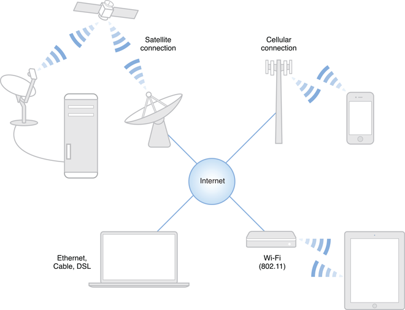

> 导航：[总目录](../../../README.md) · [documentation](../../../_indexes/documentation.md)

[Next](Designing%20for%20Real-World%20Networks.md)

# About Networking

The world of networking is complex. Users can connect to the Internet using a wide range of technologies—cable modems, DSL, Wi-Fi, cellular connections, satellite uplinks, Ethernet, and even traditional acoustic modems. Each of these connections has distinct characteristics, including differences in bandwidth, latency, packet loss, and reliability.

To add further complexity, the user’s connection to the Internet does not tell the whole story. On its way from the user to an Internet server, the user’s network data passes through anywhere from one to dozens of physical interconnects, any one of which could be a high-speed OC-768 line (at almost 40 billion bits per second), a meager 300 baud modem (at 300 bits per second), or anything in-between. Worse, at any moment, the speed of the user’s connection to a server could change drastically—someone could turn on a microwave oven that interferes with the user’s Wi-Fi communications, the user could walk or drive out of cellular range, someone on the other side of the world could start downloading a large movie from the server that the user is trying to access, and so on.

As a developer of network-based software, your code must be able to adapt to changing network conditions, including performance, availability, and reliability. This document tells you how.

Networks are inherently unreliable—cellular networks doubly so. As a result, good networking code tends to be somewhat complex. Among other things, your software should:

- __Transfer only as much data as required to accomplish a task.__ Minimizing the amount of data sent and received prolongs battery life, and may reduce the cost for users on metered Internet connections that bill by the megabyte.
- __Avoid timeouts whenever possible.__ You probably don’t want a webpage to stop loading just because the loading process took too long. Instead, provide a way for the user to cancel the operation.

  In certain rare situations, data becomes irrelevant if delayed substantially. In these situations, it may make sense to use a protocol that does not retransmit packets. For example, if you are writing a real-time multiplayer game that sends tiny state messages to another device over a local area network (LAN) or Bluetooth, it is often better to miss a message and make assumptions about what is happening on the other device than to allow the operating system to queue those packets and deliver them all at once. For most purposes, however, unless you have to maintain compatibility with existing protocols, you should generally use TCP.
- __Design user interfaces that allow the user to easily cancel transactions that are taking too long to complete.__ If your app performs downloads of potentially large files, you should also provide a way to pause those downloads and resume them later.
- __Handle failures gracefully.__ A connection might fail for any number of reasons—the network might be unavailable, a hostname might not resolve successfully, and so on. When failures occur, your program should continue to function to the maximum degree possible in an offline state.

  To add further complexity, sometimes a user may have access to resources only while on certain networks. For example, AirPlay can connect to an Apple TV only while on the same network. Corporate network resources can be accessed only while at work or over a virtual private network (VPN). Visual Voicemail may be accessible only over the cellular carrier’s network (depending on the carrier). And so on.

  In particular, you should avoid interfaces that require the user to babysit your program when the network is malfunctioning. Don’t display modal dialogs to tell the user that the network is down. Do retry automatically when the network is working again. Don’t alert the user to connection failures that the user did not initiate.
- __Degrade gracefully when network performance is slow.__ Because the bandwidth between the user's device and his or her ISP is limited, your app can reach other devices on the user’s home network much more quickly than servers on the other side of the world. This difference becomes even greater when someone else on the local network starts using that limited bandwidth for other purposes.
- __Choose APIs that are appropriate for the task.__ If there is a high-level API that can meet your needs, use it instead of rolling your own implementation using low-level APIs. If there is an API specific to what you are doing (such as a game-centric API), use it.

  By using the highest-level API, you are providing the operating system with more information about what you are actually trying to accomplish so that it can more optimally handle your request. These higher-level APIs also solve many of the most complex and difficult networking problems for you—caching, proxies, choosing from among multiple IP addresses for a host, and so on. If you write your own low-level code to perform the same tasks, you have to handle that complexity yourself (and debug and maintain the code in question).
- __Design your software carefully to minimize security risks.__ Take advantage of security technologies such as Secure Sockets Layer (SSL) and Transport Layer Security (TLS) to prevent spoofing and hide sensitive data from prying eyes, and scrutinize untrusted content to prevent buffer and integer overflows.

This document will help you learn these concepts and more.

### Learn Why Networking Is Hard

Although writing networking code can be easy, for all but the most trivial networking needs, writing _good_ networking code is not. Depending on your software’s needs, it may need to adapt to changing network performance, dropped network connections, connection failures, and other problems caused by the inherent unreliability of the Internet itself.

### OS X and iOS Provide APIs at Many Levels

You can accomplish the following networking tasks in both OS X and iOS with identical or nearly identical code:

- Performing HTTP/HTTPS requests, such as GET and POST requests
- Establishing a connection to a remote host, with or without encryption or authentication
- Listening for incoming connections
- Sending and receiving data with connectionless protocols
- Publishing, browsing, and resolving network services with Bonjour

### Secure Communication Is Your Responsibility

Proper networking security is a necessity. You should treat all data sent by your user as confidential and protect it accordingly. In particular, you should encrypt it during transit and protect against sending it to the wrong person or server.

Most OS X and iOS networking APIs provide easy integration with TLS for this purpose. TLS is the successor to the SSL protocol. In addition to encrypting data over the wire, TLS authenticates a server with a certificate to prevent spoofing.

Your server should also take steps to authenticate the client. This authentication could be as simple as a password or as complex as a hardware authentication token, depending on your needs.

Be wary of all incoming data. Any data received from an untrusted source may be a malicious attack. Your app should carefully inspect incoming data and immediately discard anything that looks suspicious.

### iOS and OS X Offer Platform-Specific Features

The networking environment on OS X is highly configurable and extensible. The System Configuration framework provides APIs for determining and setting the current network configuration. Additionally, network kernel extensions enable you to extend the core networking infrastructure of OS X by adding features such as a firewall or VPN.

On iOS, you can use platform-specific networking APIs to handle authentication for captive networks and to designate Voice over Internet Protocol (VoIP) network streams.

### Networking Must Be Dynamic and Asynchronous

A device’s network environment can change at a moment’s notice. There are a number of simple (yet devastating) networking mistakes that can adversely affect your app’s performance and usability, such as executing synchronous networking code on your program’s main thread, failing to handle network changes gracefully, and so on. You can save a lot of time and effort by designing your program to avoid these issues to begin with instead of debugging it later.

This document is intended to be read sequentially.

The first chapter, [Designing for Real-World Networks](Designing%20for%20Real-World%20Networks.md#apple-f4xwc4dqnrsv64tfmyxwi33df52wszbpkridimbqgeydemrqfvbuqmjtfvjvomi), explains the challenges you will face when writing software that uses networking, why latency matters, and other concepts that you should know before you write the first line of networking code.

The next chapter, [Assessing Your Networking Needs](Assessing%20Your%20Networking%20Needs.md#apple-f4xwc4dqnrsv64tfmyxwi33df52wszbpkridimbqgeydemrqfvbuqnznknltm), provides more details about choosing an API family and determining what types of networking tasks your program will perform. This chapter then points you to other chapters ([Discovering and Advertising Network Services](Discovering%20and%20Advertising%20Network%20Services.md#apple-f4xwc4dqnrsv64tfmyxwi33df52wszbpkridimbqgeydemrqfvbuqojnknltc), [Making HTTP and HTTPS Requests](Making%20HTTP%20and%20HTTPS%20Requests.md#apple-f4xwc4dqnrsv64tfmyxwi33df52wszbpkridimbqgeydemrqfvbuqobnknltc), and [Using Sockets and Socket Streams](Using%20Sockets%20and%20Socket%20Streams.md#apple-f4xwc4dqnrsv64tfmyxwi33df52wszbpkridimbqgeydemrqfvbuqmrqgmwugsscivdeosch)) that describe some common networking tasks that your program might need to perform.

[Using Networking Securely](Using%20Networking%20Securely.md#apple-f4xwc4dqnrsv64tfmyxwi33df52wszbpkridimbqgeydemrqfvbuqmjnknltc) and [Avoiding Common Networking Mistakes](Avoiding%20Common%20Networking%20Mistakes.md#apple-f4xwc4dqnrsv64tfmyxwi33df52wszbpkridimbqgeydemrqfvbuqnbnknltc) provide guidance that can help you avoid common networking mistakes.

Finally, [Supporting IPv6 DNS64/NAT64 Networks](Supporting%20IPv6%20DNS64-NAT64%20Networks.md#apple-f4xwc4dqnrsv64tfmyxwi33df52wszbpkridimbqgeydemrqfvbuqmrrgmwvgvzr) explains how to make sure your app is compatible with IPv6-only networks.

This document is intended as a high-level overview of networking concerns in OS X and iOS. The documents below provide additional depth and breadth.

### Learn What’s Happening Under the Hood

A basic understanding of the way networks work can help you understand why they behave (or misbehave) as they do. Thus, you should learn at least the basic underlying concepts before you write the first line of code. At minimum, you should be familiar with packets and encapsulation, connection-based versus connectionless protocols, subnets and routing, domain name lookup, bandwidth, and latency. To learn about this subject, read the following document:

- _[Networking Concepts](../../Networking%20Internet/Networking%20Concepts/Introduction.md#apple-f4xwc4dqnrsv64tfmyxwi33df52wszbpkridimbqgezdiobx)_

### Learn About Specific Technologies

For more in-depth information, consult one of the following guides for the primary documentation on a particular subject:

- _URL Loading System Programming Guide_
- _[Stream Programming Guide](../../Cocoa/Stream%20Programming%20Guide/Introduction%20to%20Stream%20Programming%20Guide%20for%20Cocoa.md#apple-f4xwc4dqnrsv64tfmyxwi33df52wszbpgeydambqge4dq2i)_
- _[CFNetwork Programming Guide](../../Networking/CFNetwork%20Programming%20Guide/Introduction%20to%20CFNetwork%20Programming%20Guide.md#apple-f4xwc4dqnrsv64tfmyxwi33df52wszbpkridgmbqgaytcmzs)_
- _[NSNetServices and CFNetServices Programming Guide](../../Networking/NSNetServices%20and%20CFNetServices%20Programming%20Guide/About%20NSNetServices%20and%20CFNetServices.md#apple-f4xwc4dqnrsv64tfmyxwi33df52wszbpkridimbqgazdomzw)_

### Learn How to Share Documents Between OS X and iOS

The following documents describe techniques you can use to share documents between OS X and iOS:

- _[iCloud Design Guide](../../General/iCloud%20Design%20Guide/About%20Incorporating%20iCloud%20into%20Your%20App.md#apple-f4xwc4dqnrsv64tfmyxwi33df52wszbpkridimbqgezdaoju)_
- _[Document Transfer Strategies](https://developer.apple.com/library/archive/technotes/tn2152/_index.html#//apple_ref/doc/uid/DTS40009179)_

[Next](Designing%20for%20Real-World%20Networks.md)

