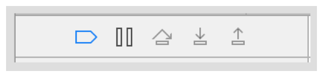
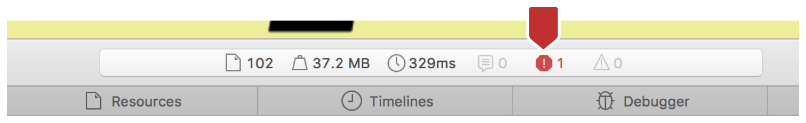
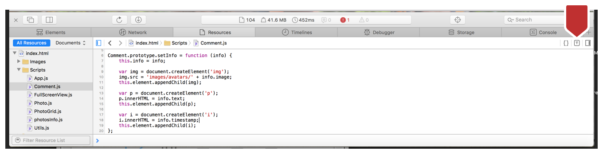

> 导航：[总目录](../../../README.md) · [documentation](../../../_indexes/documentation.md) · [Web Inspector Tutorial](Introduction.md)

[Next](Enhancing%20the%20Performance%20of%20Your%20Webpage.md)[Previous](Editing%20Code%20to%20Change%20Your%20Webpage.md)

# Debugging Your Webpage

Web Inspector does allow you to make changes to a webpage. But it primarily allows you to inspect behavior when your code loads and runs in a browser, so you can fix anything that is unexpected or problematic. Now you can start fixing the bugs.

Start with the Shuffle button: if you click it now, only some of the photos shuffle, not all of them. You need to fix the `shufflePhotos` function in your code. To find out what is happening in the code when the photos are shuffled, you will add a _breakpoint_, a marker that indicates a pause in script execution.

1. In Web Inspector, navigate to the Resources tab.
2. In the sidebar, click the `PhotoGrid.js` file to open it in the main viewer.

   This file contains functions that populate the webpage with photos, resize them, and shuffle them.
3. Scroll down to the `shufflePhotos` function, which begins on line 55.

   You will set a breakpoint inside this function.
4. Inside the `shufflePhotos` function, to the left of the first line of code, click the number 58.

   A small blue flag appears over the number. Now that the breakpoint is set, you can start debugging.
5. In the webpage, click the Shuffle button and wait for the application to stop at the breakpoint.

   Web Inspector automatically goes to the Debugger tab.

In the Debugger tab, there are three sections with information about code execution. The main section in the middle contains your code and looks like the Resources tab. In the left sidebar, there is a subsection called Breakpoints. In this subsection, you can see your breakpoint in line 58.

At the top of this sidebar, there are debugger controls in a small toolbar. You use these controls to advance the code execution. The controls consist of a disable breakpoint button, a pause and play button, a step-over button, to go to the next line of code, and buttons to step into and out of a block of code.

In the `shufflePhotos` function are variables to reference the first and last visible photo on the screen. Try scrolling to the first photo in the Work block of your page. If your code is correct, the index of the first visible photo will be 0.

1. Scroll so the top edge of the first photo touches the top of the browser window, which in this case is behind your “sticky” header.
2. Click the “Step over” button 5 times to get to line 68, after the code assigning the `firstVisiblePhoto` variable is executed.

The breakpoint allowed you to debug the program by stopping the code execution. Now you can look at the value of the `firstVisiblePhoto` variable.

You can use the Console in Web Inspector to look at the values of variables and function executions during runtime. The Console is like the Terminal of your web content. It has access to the DOM and JavaScript of the open page.

1. Click the Console tab to open it.
2. In the Console tab, type `firstVisiblePhoto`.

   It should autocomplete before you finish typing.
3. Click Enter.

Next to the numeric value of `firstVisiblePhoto` is a number in light gray lettering. This is a temporary selector that has been assigned to the variable `firstVisiblePhoto`. For as long as you use the console in this execution, this selector will reference the value in `firstVisiblePhoto`. You can also use `$_`, which references the last evaluated expression in the Console. As you evaluate more expressions, more selectors are added to the list: `$1`, `$2`, `$3`, `$4`, and so on. You can even use a DOM selector to evaluate an expression with `$(`selector`)`.

Alternatively, you can use the Scope Chain to look at the value of `firstVisiblePhoto`. In the Debugger tab, the Scope Chain is in the right sidebar. It displays the values of local and global variables at the current point in execution. These values change as you advance the debugger. Before a value is set, a gray `?` icon sits to the left of the variable, and it is undefined. When a variable is assigned a value, the left icon changes to a colored icon with a letter that reflects the variable’s data type.

With `firstVisiblePhoto`, the value of the first photo should be 0, but it is greater than 0. This means that there is an error in the calculation of `firstVisiblePhoto`. When you debug the code, you will find that the error is with the variable `scrollY`. Your `scrollY` variable is relative to the top of the webpage you created, not the browser window’s scroll bar value. You need to offset the browser window’s scroll bar value with the amount of space that comes before the photos section in your portfolio. This offset value is about 770 pixels.

To offset the `window.scrollY` property in your code, you need to change the JavaScript. This process is similar to changing the CSS.

1. In Web Inspector, go to the Resources tab and open the `PhotoGrid.js` file.
2. Change `var scrollY = Math.max(window.scrollY, 0);` to `var scrollY = Math.max(window.scrollY - 770, 0);`.
3. Press Command-S to save the changes to the source file.

Next you need to check the comments for each photo, to make sure they display correctly. Click a photo with a speech bubble in the lower-right corner.

When you open a commented photo, you see that the comments have undefined content. An error icon appears in the dashboard of Web Inspector (see the figure below). The number to the right of the error icon indicates the number of errors present in the already executed code.

Clicking the error icon takes you to the Console tab. In this tab, an error message indicates that a resource cannot be found during code execution. Normally, clicking this icon takes you to the Resources tab, to the exact line where the error is. But because something that was required was not found, you need to go to the `Comments.js` code file to see what was missing during code execution.

1. Go to the Resources tab, and select the `Comments.js` file.
2. Go to line 6 in the file.

   The function `setInfo` gets the data for each comment.

Because of the error and the undefined comments, you need to see if the `setInfo` function is getting the correct data.

To examine the data more closely, you can use two features: the Type Profiling tool and token popovers.

The Type Profiling tool shows the most current type information of your variables as they are assigned values during code execution.

To turn on the Type Profiling tool, click the “T” icon at the top right of the Resources tab.

When you click the Type Profiling icon, some of the code is immediately dimmed, which means it has not been executed yet. So in addition to type profiling, you can use this tool for code coverage, to find out which code has been reached and which has not.

Right now, with this tool on, you can see the HTML elements that you are creating. Each contains the comment data. You know this because you can see the placeholders on the desktop screen. The elements resolve to the correct types.

To see the content assigned to each element, you can use token popovers. If you hover over the `info` part of `info.image`, a popup shows the data stored in the info variable: `avatar`, `comment`, and `date`. However, you see that `image`, `text`, and `timestamp`, the variable names in your code, are not in the `info` object.

Change these names in your code to `avatar`, `comment`, and `date`, respectively. Save the changes, and reload your webpage.

[Next](Enhancing%20the%20Performance%20of%20Your%20Webpage.md)[Previous](Editing%20Code%20to%20Change%20Your%20Webpage.md)

