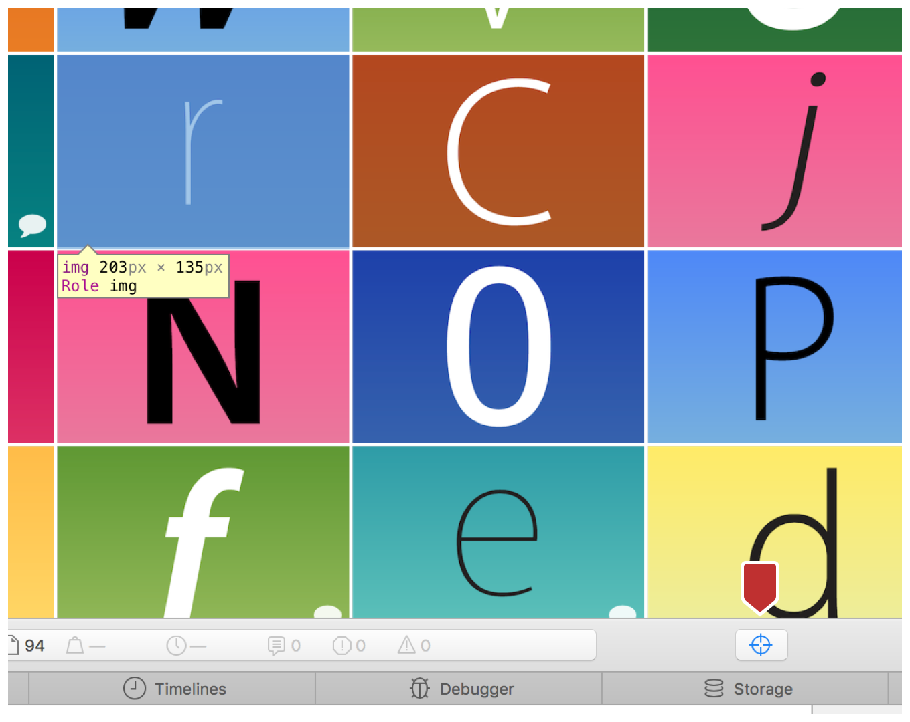
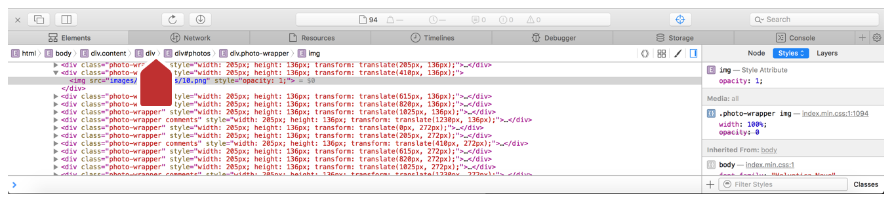
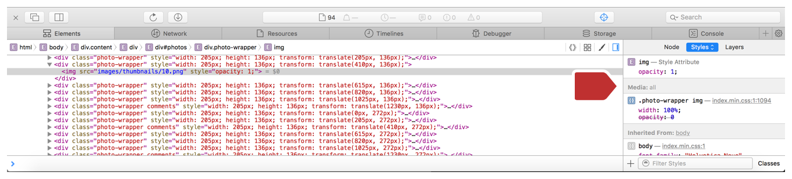
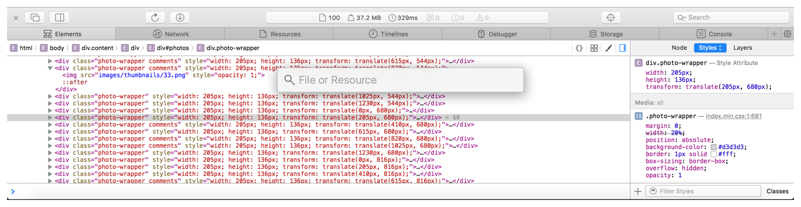
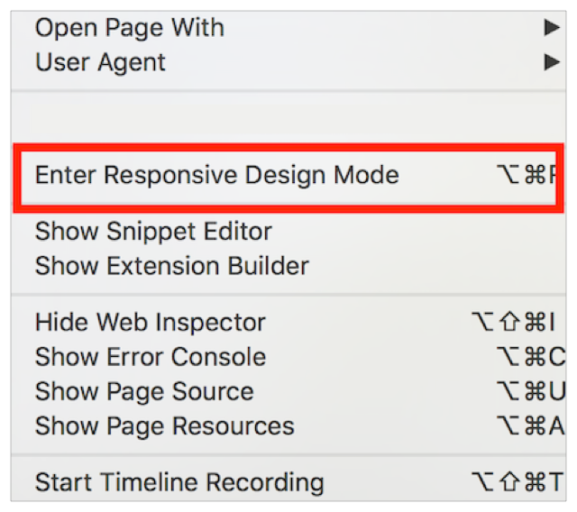
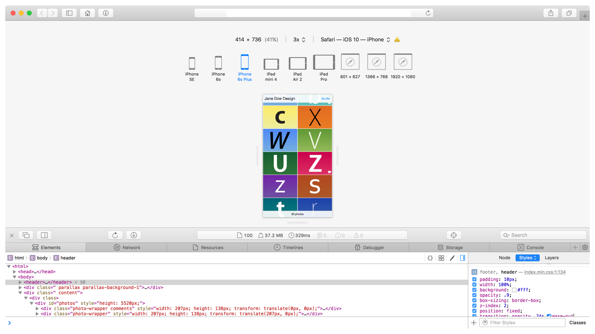

> 导航：[总目录](../../../README.md) · [documentation](../../../_indexes/documentation.md) · [Web Inspector Tutorial](Introduction.md)


[Next](Debugging%20Your%20Webpage.md)[Previous](Enabling%20Web%20Inspector.md)

# Editing Code to Change Your Webpage

After you initially create a webpage, you will probably want to make changes based on behavior in a browser. You can use Web Inspector to revise and edit a webpage after you initially create it.

In your portfolio, you see the webpage with a header bar at the top that contains the title Jane Doe Design and a shuffle button. But when you scroll down the page, the header bar disappears, and the footer bar is not visible until you scroll to the bottom. Because this is a portfolio, you’ll want to make the header with the name and the footer with the photo count persistent when scrolling, especially on mobile devices.

To do this, you select an element and change its CSS properties. In this case, you will select the header element, by doing either of the following:

- Right click the element (in this case, the header Jane Doe Design), and select Inspect Element from the menu.
- In Web Inspector, click the Element Selection button (see the figure below). Then move the pointer to the header and click it when it becomes highlighted.

  

After you select an element, Web Inspector automatically takes you to the element in the Elements tab. This tab displays a hierarchical structure of your HTML file with all the Document Object Model (DOM) elements. The path of DOM elements nested around the selected element is visible in the jump bar at the top of the Elements Tab (see the figure below). The DOM is partially unfolded, and the header markup identified by the tag `<header>` is highlighted.



At the right side of the Elements tab is a sidebar divided into three sections. The default section in focus when you select an element is the Styles sidebar. It shows all of the CSS styles that pertain to the selected element.



The Styles sidebar is open from when you selected the header element. You need to change the property for the header’s position.

1. In the Styles sidebar, click inside the CSS section for the header.
2. Add the position property by entering `position: fixed;`
3. Press Command-S to save the file with the new position property.

   You can save any CSS changes made in the Elements tab to the original file. A popup window appears, asking you for the name of the file. Because the file already exists in your directory, you may also be asked to replace the original file with the new, changed file.

Next you need to add a property so a photo zooms in when you hover over it. This hover property will give a better indication of the photo being selected. To do this, you go into the `index.min.css` file using Quick Open (see the figure below), a feature that allows you to quickly search for a file in Web Inspector.



1. Press Command-Shift-O, and start typing `index.min.css` until the file name autocompletes.
2. Press Enter.

   Web Inspector takes you to the correct file and opens the Resources tab.

Now you need to find the `.photo-wrapper img` property, so you can add the hover property immediately after it in the CSS file.

1. Press Command-F to make the Search bar appear at the top of the Resources tab.
2. Start typing `.photo-wrapper img`.

After you find the CSS block in the file, you need to add another property and create a new hover block.

1. Add this line to the `.photo-wrapper img` selector:

```
.photo-wrapper: hover img {
     -webkit-transform: scale(1.3)
}
```
2. Add this CSS block for the hover property:

```
.photo-wrapper:hover img{
     -webkit-transform: scale(1.3)
}
```
3. Press Command-S to save the file, responding to any system prompts.
4. To see your changes, go to Web Inspector and click Reload.

Now that you have fixed these properties, check your page to see how it looks on different devices. A webpage that looks good on many devices is called responsive because it visually adapts to the device on which it is displayed. Responsive design ensures that your content automatically fits any screen size. To test your webpage’s responsiveness, you first need to enter Responsive Design Mode.

1. From the Develop menu, choose Enter Responsive Design Mode.

   

   Your screen should now look like the image below. Your browser is replaced with a gray window containing several device views.

   
2. To test your webpage on a mobile device, click one of the iPhone or iPad icons at the top of the page.

The elements on your webpage are resized to fit the device you selected. Multiple clicks on the same icon can change the orientation of the device. In the case of the iPad devices, multiple clicks can enable split screen views of your webpage. In the mobile device views, you can see that the images resize to fit the screen and that the header and footer stay fixed.

[Next](Debugging%20Your%20Webpage.md)[Previous](Enabling%20Web%20Inspector.md)

