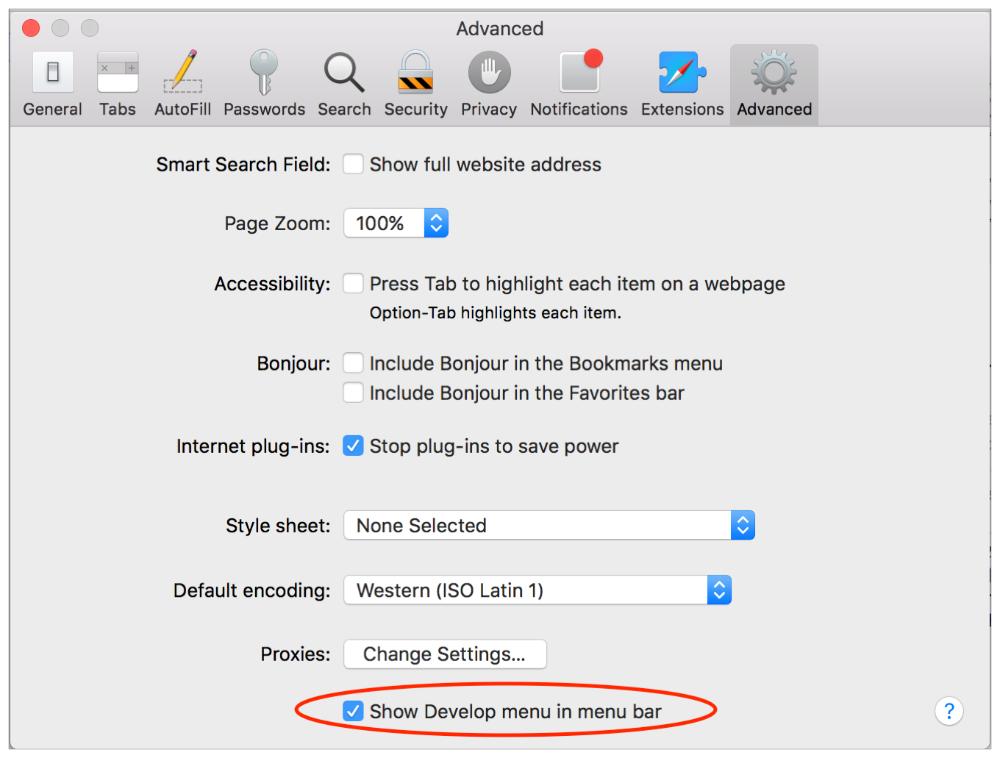

> 导航：[总目录](../../../README.md) · [documentation](../../../_indexes/documentation.md) · [Web Inspector Tutorial](Introduction.md)

[Next](Editing%20Code%20to%20Change%20Your%20Webpage.md)[Previous](Introduction.md)

# Enabling Web Inspector

To start using Web Inspector, you must first enable the Develop menu.

1. Choose Safari > Preferences, and click Advanced.
2. At the bottom of the pane, select the “Show Develop menu in menu bar” checkbox.

   
3. Choose Develop > Show Web Inspector.

[Next](Editing%20Code%20to%20Change%20Your%20Webpage.md)[Previous](Introduction.md)

