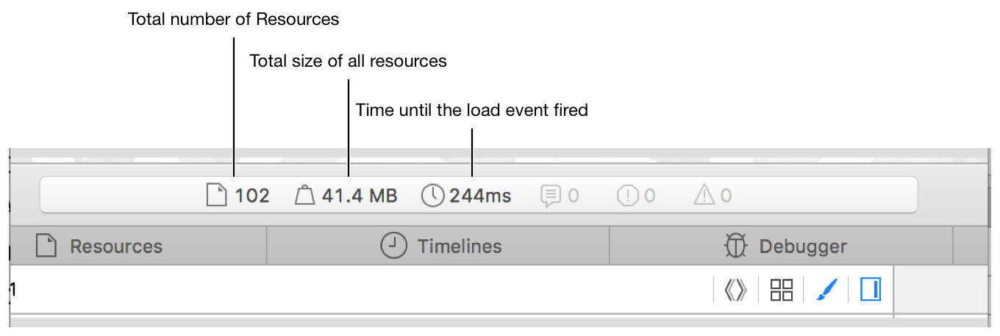
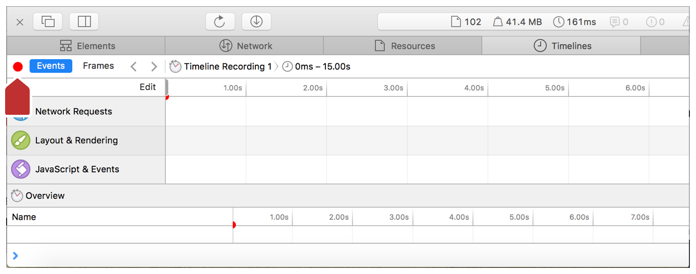
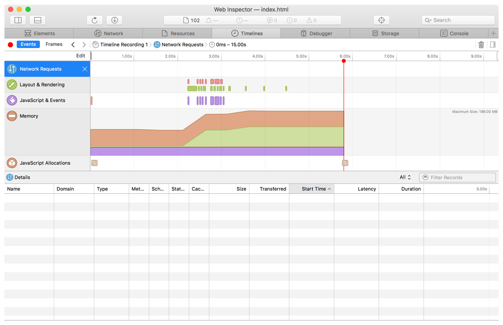
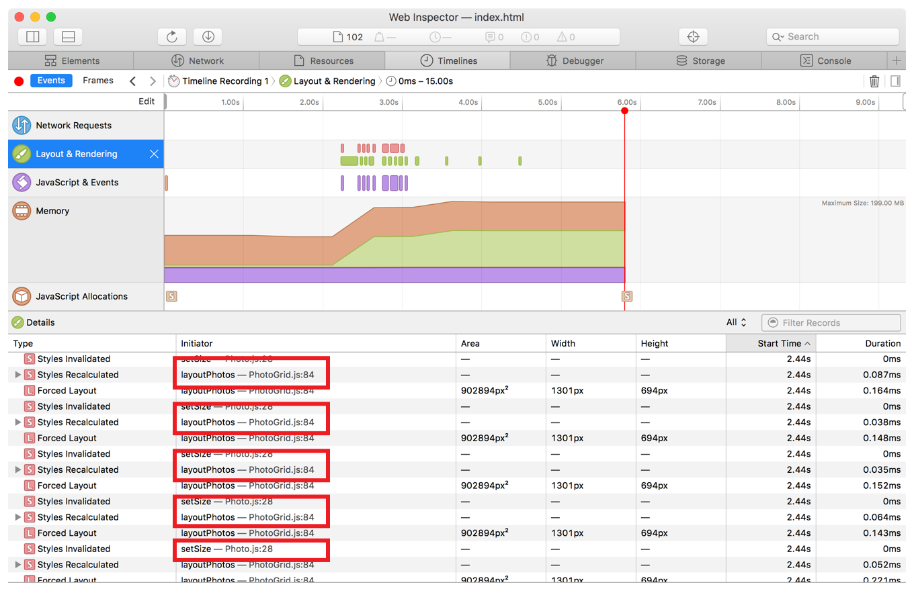
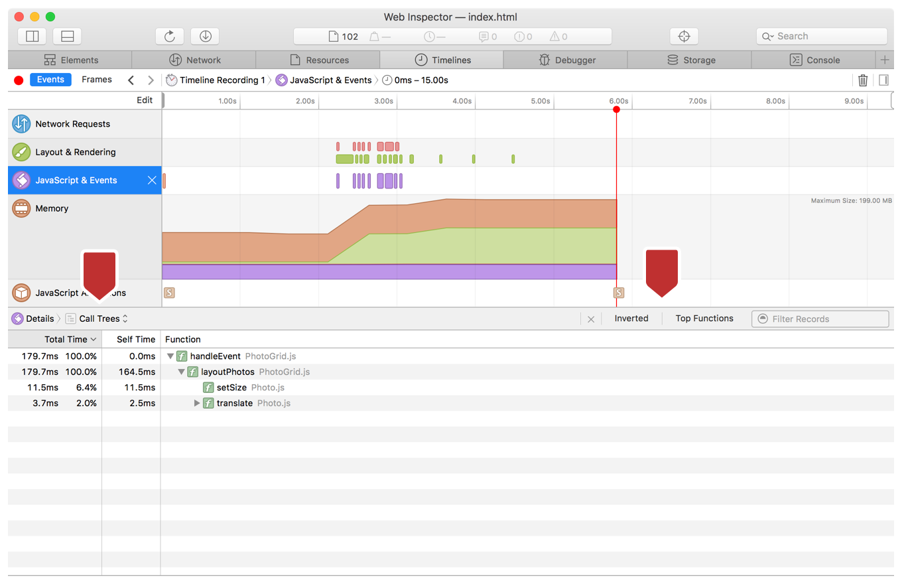
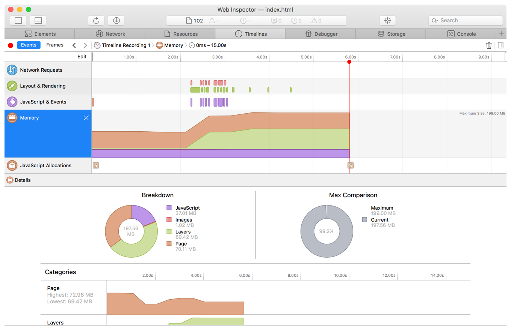
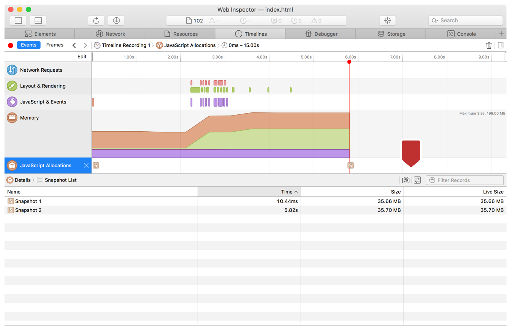

> 导航：[总目录](../../../README.md) · [documentation](../../../_indexes/documentation.md) · [Web Inspector Tutorial](Introduction.md)

[Next](Document%20Revision%20History.md)[Previous](Debugging%20Your%20Webpage.md)

# Enhancing the Performance of Your Webpage

An optimized webpage does not use excessive amounts of memory, and it runs fast. When you resize your page, it seems slow and it stutters. You’ll need to examine various types of data to ensure that your webpage performs well.

When you reload the page, you see that the values in the dashboard of Web Inspector are updated. Besides the three rightmost icons that indicate console messages, statistics are available to help you analyze your page. The figure below shows that these statistics include the time and space costs of your webpage.

Because there are a lot of photos to paint, your webpage could take a long time to load. To find out how much time, you can use Timelines. Timelines is a visual download analyzer and JavaScript and events recording that helps you make your webpage load and your scripts run as quickly and responsively as possible.

1. In Web Inspector, go to the Timelines tab.
2. In the left sidebar, click the Edit button at the top right and select the checkboxes for all of the timelines.
3. Click the red Record button at the top left of the tab (see the figure below).

   Recording starts for all activity on the open page, including network requests, CSS rendering, and JavaScript events.

   
4. Resize the page.
5. Stop the recording by clicking the Record button again.

Once you are on the Timelines tab, every time you reload the page, a new timeline recording will automatically start. You can switch between these recordings by clicking on the Timeline Recording in the jump bar.

In total, there are five potential timelines you can record: Network Requests, Layout & Rendering, JavaScript & Events, Memory, and JavaScript Allocations. After you record all the timelines, you can see a graphic timeline of blue, red, green, and purple data points.

You can use either of the following views for timeline data:

- __Events View:__ This view is selected by default in the left sidebar. In this view, each data point indicates a distinct event triggered during the reload of the page. (The exception to this is Memory, which shows a contiguous line of memory usage.) If you hover over the time ruler above the data point graph, you can drag and select a subset of frames from the graph, to examine a specific section of frames more closely. Looking at this section can reveal slow callback handlers, slow timers, or slow script initialization.
- __Frames View/Rendering Frames View:__ This view shows a bar graph, where each bar represents a rendered frame of activity during the reload process. Below this bar graph is a list of the frames, each of which can be expanded to show the individual events fired. Notice that when you switch to Frames View when examining any timeline, the jump bar at the top of the Timelines tab indicates that this view is also called Rendering Frames. In this view, purple is used for scripts and event timers, red is used for layout and rendering, and gray is used for background engine work. _The goal is to keep each of these frame bars underneath the middle line, which indicates 60 frames per second._ As you can see from your resizing recording, you are far above 60 frames per second, so you will need to fix this in the next section. Similar to Events View, you can drag and select a subset of frames from the graph to examine a specific section of frames more closely.

If you select this timeline in the left sidebar, the Details section at the bottom of the Timelines tab changes (if you cannot see the Details section, enlarge Web Inspector). This timeline shows all of the requests made to get the files and resources for your webpage. The metadata includes how long it took to get each resource, the size of each resource, and the latency of the server. There is also a filter feature so you can examine certain resources more closely.

In your recording, you don’t see any network requests, because all the resources were already loaded when you resized the page. If you would like to see the network requests section populated with data, try recording during a page reload.

In this timeline, you can see the composite layering and the layout changes that occurred during your recording.

It seems that there is an enormous amount of activity happening around line 84 in the `layoutPhotos` function. Later in this tutorial, you’ll examine the time spent in this function more closely.

If you select this timeline in the left sidebar, the Details section displays only the purple JavaScript events triggered and garbage collection events, along with time metadata.

The Details section gives you two subview options: Events view (the default) and Call Trees view. Events view shows a collapsible list of triggered events, and Call Trees view shows the recorded cumulative time used to execute functions in the call stack. In Call Trees, the default view is Top Down, which you can use to look through the call tree to uncover functions that take a lot of time to execute. You can change to the Inverted view or the Top Functions view to better see the functions that are sampled most often.

In the recording, only one event, `layoutPhotos`, was triggered. This event calls `setSize` and `translate`.

This timeline shows how memory has been allocated across different categories over time, how it’s currently being used, and how it’s being divided up. When you select this timeline, you can see memory usage charts in the Details section. The Breakdown Chart shows how memory is allocated for JavaScript, for images, for the layers, and for the rest of the engine-related page memory. The Max Comparison Chart shows maximums in memory usage. The Categories section shows line charts by category of memory usage.

In your recording, most of the variation in memory usage happens for layers and for page memory.

This timeline uses snapshots (quick captures of the JavaScript heap at specific moments) to show memory usage growing over time. By comparing snapshots over time, you can identify unnecessary allocations quickly and modify your code to eliminate them.

By default, a snapshot is taken every 10 seconds, once at the beginning of the recording, and once at the end. However, you can manually take snapshots during the recording period with the Take Snapshot button (the camera icon at the top right of the Details section). Next to this button is the Compare Snapshots button, which, when selected, allows you to examine two snapshots side by side in greater detail.

You can even trigger snapshots directly from your JavaScript code with the takeHeapSnapshot API. However, adding these statements can affect the performance of your code.

In the recording are two snapshots, each indicated by a square “S” icon. One snapshot was taken shortly after the beginning of the recording, and one was taken at the end.

From looking through the timelines, you can see that there is a huge amount of work being done in the `layoutPhotos` section. You need to see how long the `layoutPhotos` function is taking. To do this, you will insert some console statements into your JavaScript code. Specifically, you will use the `console.time` and `console.timeEnd` functions. These two functions, when given the same label, will output to the console the amount of time it takes to run the lines of code in between their calls.

1. Navigate to the Resources tab and open the `PhotoGrid.js` file.
2. Add `console.time("layoutPhotos");` as the first line of the `layoutPhotos` function.
3. Add `console.timeEnd("layoutPhotos");` as the last line of the `layoutPhotos` function. Make sure the label names match.
4. Resize the page window.

You can see that the amount of time to run this function is well over 16.67 ms. For smooth animation, an optimal webpage should take no more than _16.67 ms_ to complete all of these events. It looks like the statements that are causing the problem start at line 84. What follows this line is a block of values that need to be calculated only once, not in a loop. If you put these statements before the loop, save the file, and resize the window, you will see a dramatic improvement in the time output to the console.

You can use additional console statements specific to Web Inspector to display information to the console. You can also use `console.markTimeline(label)`, which adds a green, vertical dashed line to the timeline as a benchmark. The functions `console.profile(name)` and `console.profileEnd(name)` keep track of all JavaScript calls made in an interaction and put that information in a data grid in the sidebar.

[Next](Document%20Revision%20History.md)[Previous](Debugging%20Your%20Webpage.md)

