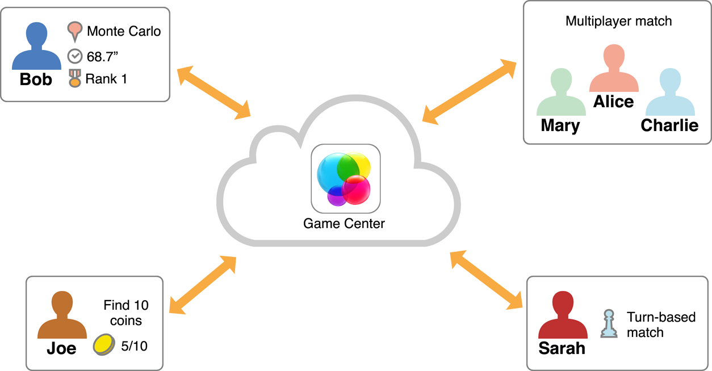

> 导航：[总目录](../../../README.md) · [documentation](../../../_indexes/documentation.md)

[Next](Developing%20a%20Game%20Center-Aware%20Game.md)

# About Game Center

People love to play games. Games on the App Store are no exception—games continue to be the most popular category of apps on iOS. Games are inherently a social activity. Sometimes, this social interaction is part of the game itself, such as when the game provides competitive or cooperative multiplayer gameplay. But even for games intended for single-player experiences, players like to see and share their accomplishments.

Because social gaming is such an important part of the game-playing experience, Apple supports it directly with the Game Center service. Game Center allows a player’s devices to connect to the Game Center service and exchange information. The following figure shows several ways users can interact with Game Center.

Each player performs different activities but all of them are interacting with Game Center:

- Bob uses the Game Center app provided by Apple to view his scores earned in a game that supports Game Center. The Game Center app shows both Bob’s scores and scores earned by other players. Even though the scores are displayed by the Game Center app, the score data and formatting are provided to Game Center by the game.
- Joe is playing an adventure game that supports achievements. He just discovered an item for a quest he wants to complete. The game sends a message to Game Center to update the progress stored there.
- Mary, Alice, and Charlie are playing a game that supports Game Center’s matchmaking. Game Center provides a platform for the player’s devices to find and connect to each other. The game exchanges data between the participants through Game Center’s servers.
- Sara plays another multiplayer game also using Game Center’s matchmaking. Sara’s game supports turn-based play and Sara has received a push notification indicating that it is her turn to act.

Game Center is best viewed as a collection of interconnected components that provide features both to game developers and to end users:

- The Game Center service is the online portion of Game Center. The Game Center servers store player and game data and vend the data and other services to Mac and iOS devices.
- The Game Kit framework provides classes that developers use to add support for Game Center to their games. Game Kit is available starting in iOS 4.1 and OS X v10.8.
- The Game Center app provides a centralized app that players use to access Game Center’s features.

For players to take advantage of Game Center in your game—and for your game to be visible in the Game Center app—you must explicitly add support for Game Center to your game. You do this by implementing authentication and then at least one other Game Center feature.

### Some Game Resources Are Provided at Runtime by the Game Center Service

All apps include images and localized text inside of its bundle that are used to display the app’s user interface. The app loads these resources from the bundle as needed. When you design a Game Center-aware game, some of the resources you create are not stored in the bundle. Instead, those resources are uploaded to the Game Center service during development of your game. At runtime, your game downloads the resources from Game Center. The main reason for storing these resources on Game Center is that those resources are also used by the Game Center app. For example, when the Game Center app displays one of your game’s leaderboards, it downloads the resources you provided so that it displays the score data the same way as your game.

The requirement that some of your resources be provided to Game Center affects how you design, develop, and test your game.

### Your Game Displays Game Center’s User Interface Elements

Game Kit provides many classes that present full-screen user interfaces to the player. Standard classes are provided to display leaderboards, achievements, and matchmaking screens. For example, the [GKGameCenterViewController](https://developer.apple.com/documentation/gamekit/gkgamecenterviewcontroller) class provides the simplest way to display Game Center content in your game.

In iOS, these are provided as view controllers. A view controller in your game presents one of these view controllers when necessary. On OS X, the same classes are used, but Game Center provides the infrastructure required to display them in a window.

Game Kit also provides support for banners. A banner appears for a short time to display a message to the player. Game Kit automatically presents some banner messages to the player when certain events occur, but your game can use the [GKNotificationBanner](https://developer.apple.com/documentation/gamekit/gknotificationbanner) class to display your own messages.

### Game Center Features Require an Authenticated Player

All of Game Center’s features require an authenticated player on the device, known as the _local player_. Before your game uses any Game Center features, it must successfully authenticate the local player. Most Game Center classes function only if there is an authenticated player, and those classes implicitly reference the local player. For example, when your game reports scores to a leaderboard, it always reports scores for the local player.

Your game must disable all Game Center features when there is not an authenticated player.

### Leaderboards Require Your Game to Have a Scoring Mechanism

Leaderboards allow your game to post scores to the Game Center service. Players can view these scores by viewing a leaderboard in the Game Center app, but your game can also display the standard leaderboard interface with just a few lines of code. Or, if you'd rather customize the appearance of a leaderboard, your game can download the raw score data. You can create multiple leaderboards for your game and customize each with your game’s scoring mechanisms.

### Leaderboard Sets Allow You to Manage Your Leaderboards

Combine leaderboards into leaderboard sets to logically group leaderboards for your game. Implementing leaderboard sets raises the number of leaderboards that your game is allowed to contain. Combine all of the leaderboards for a single level into a set or combine the high score leaderboard from each level into a set, the decision on how to combine your leaderboards is up to you.

### Achievements Require Your Game to Measure Player’s Progress

An achievement is a specific goal that the player accomplishes within your game, such as “Find 10 gold coins” or “Capture the flag in less than 30 seconds”. As with leaderboards, a player views achievements within the Game Center app or in your game. Within the Game Center app, players can compare earned achievements with those earned by friends. Within your game, you can choose to display the standard user interface or you can download the raw data to create your own custom interface.

### Challenges Allow Players to Challenge Each Other

A challenge is sent from one player to another. Each challenge is a specific goal that the challenged player must complete. When a challenge is completed, both the challenger and the challenged player are notified. Challenges are automatically provided in any game that supports either leaderboards or achievements. However, you can also take the extra step of implementing customized support for challenges directly in your game.

### Matchmaking Requires Your Game Design to Incorporate Multiplayer Gaming

Matchmaking allows players interested in playing online multiplayer games to discover each other and be connected into a match. Game Center supports three kinds of matchmaking:

- A _real-time match_ requires all of the players to be connected to Game Center simultaneously. Game Kit provides classes that implement the low-level networking infrastructure to allow the devices to exchange data in real time.
- A _hosted match_ is similar to a real-time match, but involves your own server in the match. In this model, you use Game Center to perform matchmaking but design and implement your own low-level networking code.
- A _turn-based match_ uses a store-and-forward model. Your game stores a snapshot of the match data on Game Center’s servers where it can later be downloaded by any players in the match. At any given time, one of the players is designated as the person who can take a turn in the match. Your game downloads the match data, the player takes a turn, then your game uploads the modified match data to Game Center. When a player’s turn ends, your game designates the next player to act and that player receives a push notification.

  - _Exchanges_ allow players who are not the current player to take actions within your game. A player initiates an exchange by sending an exchange request to one or more other players. These players are then able to respond to the exchange or let it time out. During the exchange, updates are also sent to the current player so that match data can be updated.

If you are new to developing Game Center-aware games, start by reading [Developing a Game Center-Aware Game](Developing%20a%20Game%20Center-Aware%20Game.md#apple-f4xwc4dqnrsv64tfmyxwi33df52wszbpkridimbqga4dgmbufvbuqnjnknlto). This chapter describes the process for designing and implementing a game that supports Game Center. Then read [Displaying Game Center User Interface Elements](Displaying%20Game%20Center%20User%20Interface%20Elements.md#apple-f4xwc4dqnrsv64tfmyxwi33df52wszbpkridimbqga4dgmbufvbuqmjwfvjvomi) which describes common conventions for displaying Game Center’s user interface elements in your game. This topic is particularly important for OS X developers as it explains the infrastructure Game Kit provides for displaying Game Center content over your own user interface. iOS developers will find that Game Center conforms to the standard programming model for view controllers.

All developers must read [Working with Players in Game Center](Working%20with%20Players%20in%20Game%20Center.md#apple-f4xwc4dqnrsv64tfmyxwi33df52wszbpkridimbqga4dgmbufvbuqobnknltm) to learn how to authenticate players in their game. Then, as necessary, read the other chapters to learn how to implement specific Game Center features.

Although this guide describes many aspects of communicating with Game Center and using Game Center’s networking features, it is not a reference for low-level networking design patterns. Game Kit provides some networking infrastructure, but to implement a real-time network game, you need to understand and be prepared to handle common networking problems such as slow networks and disconnects.

Before attempting to create a Game Center-aware game, you should already be familiar with developing apps on whichever platform you are targeting:

- _[Start Developing iOS Apps (Swift)](https://developer.apple.com/library/archive/referencelibrary/GettingStarted/DevelopiOSAppsSwift/index.html#//apple_ref/doc/uid/TP40015214)_

Game Kit also relies heavily on [delegation](https://developer.apple.com/library/archive/documentation/General/Conceptual/DevPedia-CocoaCore/Delegation.html#//apple_ref/doc/uid/TP40008195-CH14) and [block objects](https://developer.apple.com/library/archive/documentation/General/Conceptual/DevPedia-CocoaCore/Block.html#//apple_ref/doc/uid/TP40008195-CH3).

See _[Game Kit Framework Reference](https://developer.apple.com/documentation/gamekit)_ for details on the Game Kit framework.

The _[GKAuthentication](../../../samplecode/GKAuthentication/GKAuthentication.md#apple-f4xwc4dqnrsv64tfmyxwi33df52wszbpirkfgnbqgaytaojtgm)_ sample demonstrates how to implement user authentication.

The _[GKLeaderboards](../../../samplecode/GKLeaderboards/GKLeaderboards.md#apple-f4xwc4dqnrsv64tfmyxwi33df52wszbpirkfgnbqgaytcmzwha)_ sample demonstrates how to implement leaderboards.

The _[GKAchievements](../../../samplecode/GKAchievements/GKAchievements.md#apple-f4xwc4dqnrsv64tfmyxwi33df52wszbpirkfgnbqgaytcmzwg4)_ sample demonstrates how to implement achievements.

To learn how to code sign and provision your app to use Game Center, read _App Distribution Quick Start_.

[Next](Developing%20a%20Game%20Center-Aware%20Game.md)

