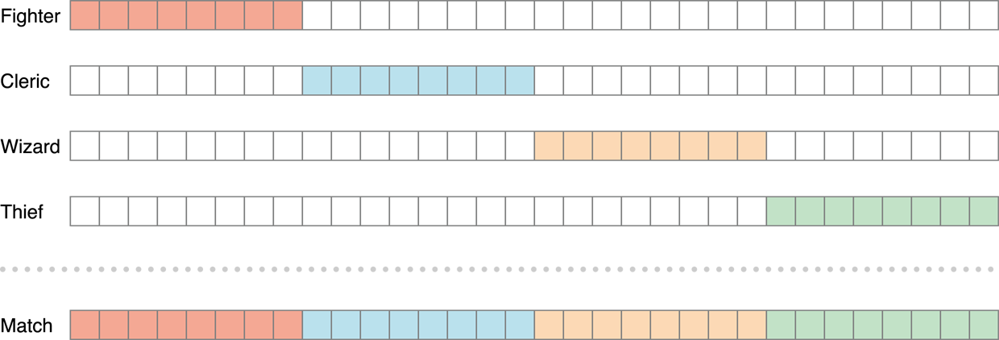

> 导航：[总目录](../../../README.md) · [documentation](../../../_indexes/documentation.md) · [Game Center Programming Guide](About%20Game%20Center.md)


[Next](Real-Time%20Matches.md)[Previous](Saving%20A%20Game.md)

# Matchmaking Overview

In Game Center, a match is formed when a group of players want to play a game together. Each player plays the game on their own device, and the experience on each device is tailored to the player playing on that device with the match as a whole representing a shared experience. To accomplish this, the instances of the game share data with each other so that there is agreement about the state of the match.

Game Center matchmaking provides the infrastructure needed to allow players to find other players interested in playing in a match. It allows players to invite specific players—almost always a friend—or to simply find other players looking for a match in your game. Once those players have been discovered and formed into a match, Game Center makes it easy for you to implement the networking code needed for your game. When necessary, Game Kit routes network data through Game Center’s servers so that all of the match’s participants are connected to each other, regardless of where they are or what kind of network they are on.

Matchmaking on Game Center is a complex topic, as there are many kinds of matches you can create and many ways to create them. This chapter provides an overview of the process. The chapters that follow provide details on the specific kinds of matches that Game Center offers.

Table 6-1 lists the different kinds of matches supported by Game Center matchmaking. Each kind of match has different restrictions and capabilities.

__Table 6-1__  Game Center match types

| Match Type | Description |
| Real-time | All of the players are connected to Game Center simultaneously and for the duration of the match. Game Kit provides all of the low-level networking support for a real-time match in the [GKMatch](https://developer.apple.com/documentation/gamekit/gkmatch) class. Your game implements its own logic to sit on top of this networking infrastructure. Although intended for real-time games, it is usable for any game that requires the players to be connected simultaneously. |
| Turn-based | The state of the match is stored on Game Center’s servers. It is transmitted to the participants when needed. The participants of the match are not connected to each other, and are connected to Game Center only when they want to read or write the match data. When a player takes a turn, his instance of the game updates the match data stored on Game Center. Game Kit provides support for this match type in the [GKTurnBasedMatch](https://developer.apple.com/documentation/gamekit/gkturnbasedmatch) class. |
| Self-hosted | A networking implementation provided by your game and your own servers. When you create a hosted match, Game Center helps you find players for your match (matchmaking), but relies on your game to implement its own low-level networking code. It is primarily intended for games that already have existing network implementations. |

Game Center makes it as easy as possible for your game to connect players into a match:

- Your game can present the standard matchmaking user interface. This interface allows players to invite friends to the match or to allow the remaining empty slots to be filled by other players searching for a match.
- Your game can programmatically invite players or search for other waiting players. In this case, you are responsible for implementing your own matchmaking user interface to give the player control over this process. You typically use this approach when you want to add your own steps to the matchmaking process or when you want the matchmaking user interface to fit with your game’s artistic style.
- A player can use the Game Center app to create a match with another player.

A player can be invited to join a match even when a game is not launched on that player’s device. When a player is sent an invitation, a push notification is sent to that player’s device. When the player accepts the invitation, the game is launched immediately to handle the invitation. This behavior is important because it increases the likelihood of players playing your game. In fact, a player can be invited to play in a match for a game he or she does not own. In this case, the player is immediately offered an opportunity to purchase and download your game.

Finding players for a match is a distinct behavior that is different from actually playing a match. In most circumstances, matchmaking and gameplay occur at different times. The typical behavior for most games is to first create a match and then to play the match. However, other scenarios are possible:

- For a real-time match, it is possible for a match to already exist even while you search for more players. In this case, the match exists simultaneously with the matchmaking process, which means that match participants can exchange data while additional players are discovered.
- For a turn-based match, matchmaking does not need to be complete before a match starts. Instead, whenever a new player is needed to continue the match, matchmaking automatically executes to fill that position.

In iTunes Connect, you can provide compatibility information that describes which versions of your game can see each other during the matchmaking process. Each compatible group of devices and versions of your game are matched as separate groups. The ability to create these matchmaking groups is quite flexible:

- When you create a new version of a game (such as a bug fix), you can declare whether the new version is compatible with the older versions (and which ones, specifically).
- You can create distinct games (with different bundle identifiers) and still allow them to play against each other.
- You can create distinct games on both OS X and iOS and match them against each other.

For more information on configuring multiplayer compatibility, see [Distributing Game Center Apps](https://developer.apple.com/library/archive/documentation/LanguagesUtilities/Conceptual/iTunesConnectGameCenter_Guide/DistributingGameCenterApps/DistributingGameCenterApps.html#//apple_ref/doc/uid/TP40013726-CH26).

All new matches start with a match request that describes the desired parameters for the match. Essentially, the match request tells Game Center how many players to find and which players to find for the match. Game Kit also uses the match request to customize its matchmaking behavior. For example, when your game displays the standard matchmaking interface, the request is used to customize the screen’s appearance. The way that Game Kit and Game Center use match requests is described in later chapters for each type of match. However, because all of the matches share a common infrastructure, you need to understand how to create and configure a match request before reading other chapters.

When designing your game’s match infrastructure, start by implementing the basic support for matchmaking and get your network game working. Then, consider adding some of the more advanced features.

The match request is defined in Game Kit by the [GKMatchRequest](https://developer.apple.com/documentation/gamekit/gkmatchrequest) class. Table 6-2 lists the properties of a match request.

__Table 6-2__  Important match request properties

| Property | Description |
| [minPlayers](https://developer.apple.com/documentation/gamekit/gkmatchrequest/1520550-minplayers) | The minimum number of players to find for the match. This property must be set on every match request. See [A Match Request Must Specify the Number of Players in the Match](#apple-f4xwc4dqnrsv64tfmyxwi33df52wszbpkridimbqga4dgmbufvbuqmjsfvjvony). |
| [maxPlayers](https://developer.apple.com/documentation/gamekit/gkmatchrequest/1521083-maxplayers) | The maximum number of players to find for the match. This property must be set on every match request. See [A Match Request Must Specify the Number of Players in the Match](#apple-f4xwc4dqnrsv64tfmyxwi33df52wszbpkridimbqga4dgmbufvbuqmjsfvjvony). |
| [defaultNumberOfPlayers](https://developer.apple.com/documentation/gamekit/gkmatchrequest/1520608-defaultnumberofplayers) | The default number of players to find for the match. This is used to configure the default user interface to show the appropriate number of player slots. However, the player can add or subtract slots so long as the number of players stays between the minimum and maximum number of players, inclusive. |
| [recipients](https://developer.apple.com/documentation/gamekit/gkmatchrequest/1520800-recipients) | An optional property that declares a list of player IDs for a set of players to invite to the match. See [Inviting a List of Players](#apple-f4xwc4dqnrsv64tfmyxwi33df52wszbpkridimbqga4dgmbufvbuqmjsfvjvooa). |
| [inviteMessage](https://developer.apple.com/documentation/gamekit/gkmatchrequest/1521164-invitemessage) | If you are inviting a set of players to the match, you can provide a custom string message that is displayed to those players. Typically, you provide the player an opportunity to create this string in your custom user interface, then use the string provided to populate your match request. |
| [playerGroup](https://developer.apple.com/documentation/gamekit/gkinvite/1520563-playergroup) | An optional property that allows you to create distinct subsets of players in your game. Each subset is matched separately against each other. Use these subsets to allow players to provide more information about exactly what kind of match they are looking for. See [Player Groups](#apple-f4xwc4dqnrsv64tfmyxwi33df52wszbpkridimbqga4dgmbufvbuqmjsfvjvomjq). |
| [playerAttributes](https://developer.apple.com/documentation/gamekit/gkmatchrequest/1520912-playerattributes) | An optional property that allows you to specify a distinct role the player wants to play in the match. Use player attributes to allow players to define what or how they want to play your game. See [Player Attributes](#apple-f4xwc4dqnrsv64tfmyxwi33df52wszbpkridimbqga4dgmbufvbuqmjsfvjvomjs). |

When creating a new match request, you are required to set the minimum and maximum players allowed for the match. Do this my setting the [minPlayers](https://developer.apple.com/documentation/gamekit/gkmatchrequest/1520550-minplayers) and [maxPlayers](https://developer.apple.com/documentation/gamekit/gkmatchrequest/1521083-maxplayers) properties after creating the match. Game Center enforces these boundaries and always ensures that the final match has the correct number of players.

The minimum number of players must be at least `2`. The maximum number of players allowed varies depending on the kind of match being created. [Table 6-2](#apple-f4xwc4dqnrsv64tfmyxwi33df52wszbpkridimbqga4dgmbufvbuqmjsfvjvomi) lists the current maximum; this maximum is subject to change.

__Table 6-3__  Maximum number of players for each kind of match

| Match Type | Maximum Number of Players |
| Peer-to-Peer | 4 |
| Hosted | 16 |
| Turn-based | 16 |

At runtime, your game calls the [maxPlayersAllowedForMatchOfType:](https://developer.apple.com/documentation/gamekit/gkmatchrequest/1521150-maxplayersallowedformatch) method to determine the exact number of players allowed for each kind of match.

By default, Game Center uses a match request to find other waiting players to fill a match. For example, if a match requires four people to be present before it can start, then Game Center finds four waiting participants, forms them into a match, and then returns that match. This scenario is useful because it allows waiting players to be quickly matched together. However, not everyone wants to play with a randomized set of players each time a match is played. Often, players want to play specifically against friends. For this reason, the standard user interface allows a player to invite specific friends to the game. However, your game can also choose to provide this support programmatically by assigning an array of player identifier strings to the match request.

Providing a list of players alters Game Center’s matching behavior. Here are a few examples of how the behavior changes:

- The standard user interface allows a player to pick a specific slot in the match and invite a specific person to fill it. Game Kit reserves places for invited players until they respond or the process times out.
- If you are using the programmatic interface for creating a real-time match and you provide a list of players to invite, Game Center attempts to add only those players into the match. It does not perform the normal matchmaking process. However, if the match needs more players, your game can create another match request that performs normal matchmaking. This separation of behaviors allows you to precisely control when randomized matchmaking occurs.
- In a turn-based match, the players are added to the match immediately, but a player is sent an invitation to join the match only when it becomes that player’s turn.

Game Center’s default behavior is to automatically match any player waiting to play your game into any match that needs more players. This has the advantage of matching players quickly into matches, but it also means that players can be added to matches that they are not interested in playing. In that case, you can allow the players to define the kind of matches they want to play, and then match them only with like-minded players. This is accomplished with a player group.

A player group is defined by an unsigned 32-bit integer. When you set the [playerGroup](https://developer.apple.com/documentation/gamekit/gkmatchrequest/1521071-playergroup) property on a match request to `0`, then the player can be matched into any waiting match. When you set the [playerGroup](https://developer.apple.com/documentation/gamekit/gkmatchrequest/1521071-playergroup) property to a nonzero number, then the player is matched only with players whose match requests share the same player group number. Typically, if your game uses player groups, it provides a custom interface that allows the player to pick the precise options he or she is interested in. It takes the choices of the player and combines them to form a player group number.

Here are some examples of how you can partition a list of players:

- Separate players by skill level.
- Separate players by the set of rules used to adjudicate the match.
- Separate players based on the map the match is played on.

Although it is up to you to determine exactly how many player groups you want to create, don’t create groups just to create them. Creating many smaller player groups can result in every player waiting for a long time to play a match. Instead, create large groups that players can identify with.

A player attribute allows a player to pick the role he or she wants to play within a match. With player attributes, each player can choose a specific role and Game Center finds a proper mix of players to ensure that all of the roles are filled.

Here are some ways you can use player attributes in your game:

- A game like chess can use player attributes to determine whether a player wants to be the black or white pieces.
- A role-playing game can offer different character roles with distinct strengths, weaknesses, and abilities that player brings to the match.
- A sports game can use player attributes to allow players to specify positions, such as pitcher or quarterback, on the team.
- A turn-based match can assign different locations on the map to distinct factions and use attributes to ensure that each location is filled.

Player attributes have a few limitations:

- Roles are checked only for auto-matched players. If the player invites friends to join the match, friends do not pick a role and do not have an attribute set.
- Roles are not displayed in the standard user interface for matchmaking provided by Game Kit. Your game must provide its own custom user interface to allow players to choose a role.
- The match object returned to your game does not tell you which roles the players selected. Your game must send the role-selection information separately after the match is created.
- Your game defines a complete set of roles; all roles defined by your game must be filled by the time the match is created. Because this calls for careful coordination between the roles that you define and the number of players allowed in the match. Thus, player attributes require additional design and testing effort.

Player attributes are implemented using the [playerAttributes](https://developer.apple.com/documentation/gamekit/gkmatchrequest/1520912-playerattributes) property on the match request. By default, the value of this property is `0`, which means that the attributes property is ignored. If the property’s value is non-zero, Game Center uses it to match a specific role.

To create the roles a player can play in your game, you create a 32-bit mask for each role a player can fill. It is up to you to add a custom user interface in your game that allows the player to select a role. You set the `playerAttributes` property on the match request to the mask for the player’s selection, as shown in Listing 6-1. Then, perform the standard or custom matchmaking as you normally would.

__Listing 6-1__  Setting the player attributes on the match request

```
GKMatchRequest *request = [[GKMatchRequest alloc] init];
request.minPlayers = 4;
request.maxPlayers = 4;
request.playerAttributes = MyRole_Wizard;
```

If Game Center sees a nonzero player attribute in the match request, it adds players to the match intelligently so that all of the players, when combined using a bitwise OR operation, have a complete mask of `FFFFFFFFh`.

The algorithm looks roughly like this:

1. A match’s mask starts with the mask of the inviting player.
2. Game Center looks for players with match requests that have a non-zero player attributes value. Game Center searches for players whose masks include set bits that are not currently in the match’s mask.
3. After a player is added to the match, the value of the new player’s player attributes value is bitwise ORed into the match’s mask.
4. If the match’s mask does not equal `FFFFFFFFh`, Game Center searches for other players to join the match. If the match is complete, but the game still requires more players to reach the minimum, Game Center continues to search for more players to add.

Assume that you are creating a role-playing game with four roles: Fighter, Wizard, Thief, and Cleric. Every match consists of four players, and the match must have one and only one player for each role. To implement this requirement, your game creates masks for each role that matches the four-step algorithm described earlier. Listing 6-2 provides an example set of masks.

__Listing 6-2__  Creating the masks for the character classes

```
#define MyRole_Fighter 0xFF000000
#define MyRole_Cleric 0x00FF0000
#define MyRole_Wizard 0x0000FF00
#define MyRole_Thief 0x000000FF
```



None of the role masks overlap; if any two masks are joined by AND, the resulting value is always `00000000h`. When all four role masks are bitwise ORed together, the entire match mask is filled (`FFFFFFFFh`). This ensures, in a match with four players, that each role is filled exactly once.

For chess, you might want to allow players to choose whether they want to play the black pieces, the white pieces, or they don’t care what color they start with. [Listing 6-3](#apple-f4xwc4dqnrsv64tfmyxwi33df52wszbpkridimbqga4dgmbufvbuqmjsfvjvooi) provides an example set of masks for this design.

__Listing 6-3__  Creating the masks for chess

```
#define MyRole_Black  0xFFFF0000
#define MyRole_White  0x0000FFFF
#define MyRole_Either 0xFFFFFFFF
```

A chess match always requires two players, so with these masks there are four possible combinations of players that can satisfy the condition for a completed mask:

- One black player and one white player
- One white player and one player that doesn’t care
- One black player and one player that doesn’t care
- Two players that do not care which color their pieces are

__Figure 6-1__  Possible mask combinations

!

[Next](Real-Time%20Matches.md)[Previous](Saving%20A%20Game.md)

