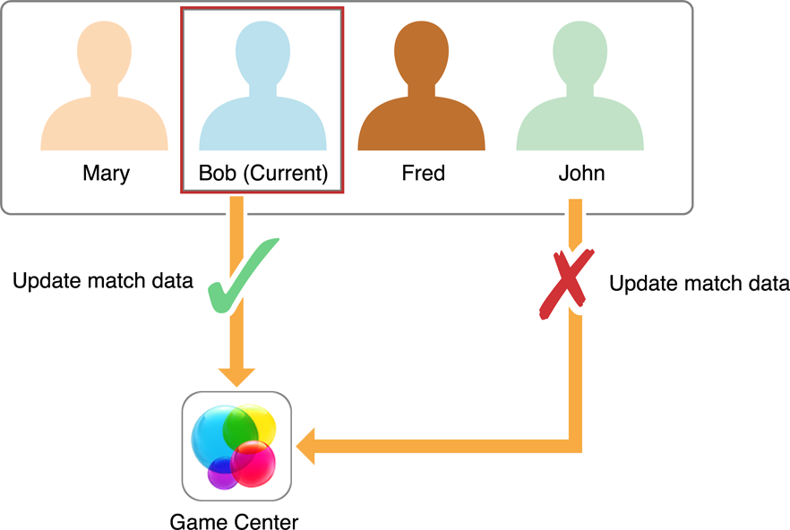
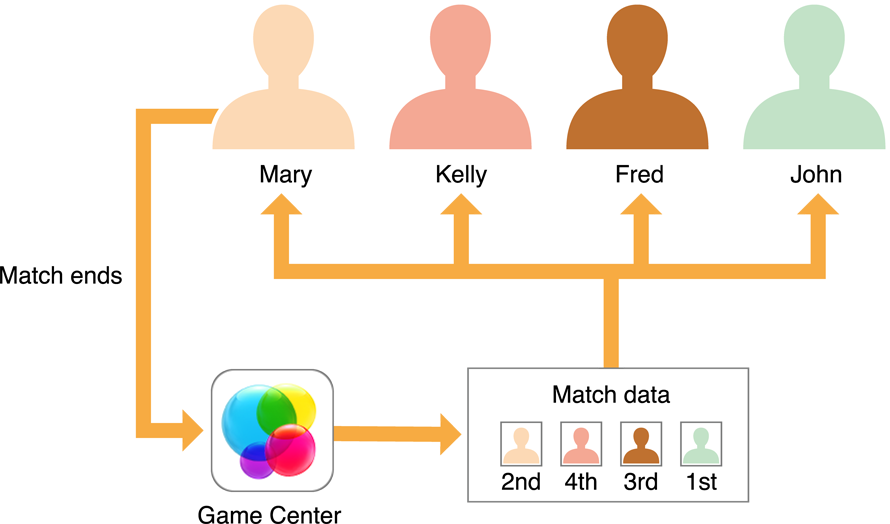

> 导航：[总目录](../../../README.md) · [documentation](../../../_indexes/documentation.md) · [Game Center Programming Guide](About%20Game%20Center.md)

[Next](Document%20Revision%20History.md)[Previous](Hosted%20Matches.md)

# Turn-Based Matches

In a turn-based match, the players of the match do not need to be simultaneously connected to Game Center to play a match together. Instead, the game uses a store-and-forward approach; one player takes a turn before passing the next play to another player. The players continue to take turns until the match ends with only one player able to make changes to the game at a time.

Turn-based matches have many useful characteristics that make them great for implementing board games and other similar styles of games; for example:

- A player can participate in multiple matches simultaneously. A game loads whichever match the player is interested in viewing or advancing.
- Players must connect to Game Center only to take a turn.
- A match can be created with less than a full complement of players, even a single player. Other players are added as needed.

In iOS 7, _exchanges_ were introduced to turn-based matches. Exchanges allow two or more players to take an action, even when it is not their turn. This allows developers to create more complex and diverse turn-based games than are currently possible by allowing more than just the local player to make changes to the game. Some possible uses for exchanges are:

- Two players want to trade cards in your game. This can be accomplished during another player’s turn.
- One player wants to auction a card and all players have a chance to bid on the card at the same time.
- Two players attack each other. They both take turns through exchanges until finished.

You can build a game by adding exchanges to the existing turn-based gaming model or create a game solely through the use of exchanges. This chapter first describes how to implement a traditional turn-based match and then adds information about exchanges later.

When you implement turn-based matches in your game, the list of players, the data for matches, and other details are all stored on Game Center. Your game downloads this information as needed. Game Center is primarily responsible for storing data. You are responsible for providing the game logic that uses this infrastructure. In particular, you define:

- What data must be stored on Game Center
- When the match data needs to be updated
- When play passes to another player

To add turn-based support to your game, you write code to handle the following activities:

- Allow the local player to join a match. See [Joining a New Match](#apple-f4xwc4dqnrsv64tfmyxwi33df52wszbpkridimbqga4dgmbufvbuqmjvfvjvomrt).
- Allow the local player to see the list of existing matches. See [Working with Existing Matches](#apple-f4xwc4dqnrsv64tfmyxwi33df52wszbpkridimbqga4dgmbufvbuqmjvfvjvomry).
- Allow the local player to view the state of a match in progress. See [Working with Match Data](#apple-f4xwc4dqnrsv64tfmyxwi33df52wszbpkridimbqga4dgmbufvbuqmjvfvjvomzq).
- Allow the player to take a turn in the match. See [Advancing the State of the Match](#apple-f4xwc4dqnrsv64tfmyxwi33df52wszbpkridimbqga4dgmbufvbuqmjvfvjvomzt).
- When a player leaves a match, set the player’s match outcome. See [Setting the Match Outcome When a Participant Leaves a Match](#apple-f4xwc4dqnrsv64tfmyxwi33df52wszbpkridimbqga4dgmbufvbuqmjvfvjvomjr).
- When all the players have a match outcome set, end the match. See [Ending a Match](#apple-f4xwc4dqnrsv64tfmyxwi33df52wszbpkridimbqga4dgmbufvbuqmjvfvjvomjs).
- Handle invitations and other match events. See [Responding to Match Notifications](#apple-f4xwc4dqnrsv64tfmyxwi33df52wszbpkridimbqga4dgmbufvbuqmjvfvjvooa).
- Expand your game to include exchanges. See [Adding Exchanges to a Turn-Based Match](#apple-f4xwc4dqnrsv64tfmyxwi33df52wszbpkridimbqga4dgmbufvbuqmjvfvjvonbr).

Think of a turn-based match on Game Center as a board game in the middle of a table. Around the table are empty seats, waiting to be filled by potential players. The number of players is set when the match is first created and never changes.

When a match begins, only some of the seats may be filled by players. The other seats may be reserved for specific players or to be filled by Game Center’s matching service. For example, consider Figure 9-1. Mary has created a new match with four seats. Because Mary created the match, she performs the first turn and then play passes to another player.

__Figure 9-1__  Mary starts a new match

!

At this point, Game Center sees that this match needs a new player to continue play. When Bob searches for a match, Game Center sees that Bob wants to play the same game as Marry and assigns Bob as a new player of Mary’s match. Because this game was waiting on a new player to continue the match, it is now Bob’s turn.

Game Center always tracks the players of a match in a specific order. That order never changes for the duration of the match, regardless of which device your game is running on. In this example, if Mary is in the first seat (slot), she stays in the first seat for the entire game.

Every match has the concept of the _current player_. The current player changes throughout the match and represents the player whose turn it is to act. When that player finishes taking a turn, your game chooses another player to act. That player is notified that it is now his or her turn and becomes the current player.

Your game sends to Game Center _match data_ that describes the state of a match. Game Center sets a limit on the size of this match data but otherwise does not care about its contents. Your game should store whatever data is necessary to preserve the match state.

At any time, a player in the match can launch your game to view the match. When a player launches the game, your game loads the match data, interprets it, and displays it to the player.

__Figure 9-2__  The current player wants to view the match

!

Only the current player is allowed to change the match data. Provide the current player with a user interface that allows them to take actions in the game. As the player takes actions, your game updates the match data and transmits it back to Game Center.

When you design a turn-based game, you create the rules that dictate play. You decide exactly what actions a player is allowed to take and when play passes to another player. When play passes to another player, you decide which player plays next.

As an example, consider chess. The player with the white pieces moves first. After white moves, play passes to the player controlling the black pieces. After black makes a move, play passes back to white. The players alternate turns until the match ends in either a checkmate or a stalemate. The rules dictate that play alternates and each player makes a single move each time.

The rules that chess uses for players are very consistent, but Game Center allows you to design more flexible games. For example, each time a player takes a turn, you can show them a different user interface screen and present the player with different options for play. A player’s turn can be as simple as making a single decision or as complex as choosing what to build, deciding where to send resources, and engaging in combat with another player. Your game tracks the moves a player makes and the moves they are allowed to make as part of your match data.

Consider another popular style of strategy game: the 4X game that encourages players to explore, expand, exploit, and exterminate. In this style of game, multiple types of turns are used at different points in the match. Here is one possible way to organize this:

- At the start of the match, each player takes a starting turn. Play passes sequentially through the entire player list. On a starting turn, a player action consists of naming the player’s empire and choosing options for how they intend to play in the match. For example, a common 4X trope is for a player to choose a faction that provides specific advantages and disadvantages during play. After all the players have completed their starting turns, the match begins by allowing players to administrate their empires.
- On an administrative game turn, each active player takes a turn, and play passes sequentially through the player list. Each participant performs all the actions necessary to control their empire. After all players complete their orders, the administrative turn ends. Your game then executes all the orders simultaneously, usually on the client of the last player to take an administrative turn. If any player units come into conflict, then a conflict game turn is executed; otherwise, a new administrative game turn starts.
- On a conflict game turn, the game creates a list of all of the players involved in conflicts. Then, each player on the list is given a turn to allow them to give combat orders. After all players give orders, the orders are executed simultaneously and the conflicts are resolved at once. If any players are eliminated as a result of combat, the game takes them out of the match on future turns. If only one player remains active in the match, the match ends and that player is declared the winner. Otherwise, play continues with another administrative game turn.

Figure 9-3 shows how this hypothetical game’s logic is processed. It has three distinct kinds of player turns, each with a different user interface, possible user actions, and data to be stored in the match data.

__Figure 9-3__  A turn flowchart for a hypothetical 4X game

!

Whenever a player takes a turn, the match data indicates what type of turn the player takes. After a player takes a turn, their actions are stored in the match data. The design also avoids passing turns to other players for nontrivial reasons. Every player makes multiple decisions at once before passing control to another player. When the final player completes a turn, that player’s game client processes everyone’s turns simultaneously, writing any necessary changes to the match data. Although this kind of design is not required, it keeps the game moving by avoiding small, trivial player turns.

The current player’s device can save the data to Game Center immediately whenever any action is taken, without transferring control to another player. You should save match data whenever anything interesting happens. Consider the following list as critical places where data should be sent to Game Center:

- The action should be immediately visible to other players if those players choose to look at the match.
- The action should be irrevocable, such as when the action reveals information previously hidden from the player or generates a randomized result that needs to be persistent.
- The action changes the current player.

To implement turn-based support in your game, you use the classes listed in Table 9-1.

__Table 9-1__  Classes in Game Kit used to implement turn-based match support

| Class Name | Class Function |
| [GKTurnBasedMatch](https://developer.apple.com/documentation/gamekit/gkturnbasedmatch) | Describes a turn-based match stored on Game Center. You use this object to inspect the current state of the match and to update the state of the match when the current player takes a turn. |
| [GKMatchRequest](https://developer.apple.com/documentation/gamekit/gkmatchrequest) | Describes the characteristics of a match and may include an initial list of players to invite. |
| [GKTurnBasedParticipant](https://developer.apple.com/documentation/gamekit/gkturnbasedparticipant) | Describes a player in a match. Most of its properties are read-only, but the [matchOutcome](https://developer.apple.com/documentation/gamekit/gkturnbasedparticipant/1521110-matchoutcome) property is not; you assign an outcome to this property when a player leaves a match. |
| [GKTurnBasedMatchmakerViewController](https://developer.apple.com/documentation/gamekit/gkturnbasedmatchmakerviewcontroller) | Provides a standard user interface that allows the local player to create new matches or view existing matches. |
| [GKTurnBasedEventHandler](https://developer.apple.com/documentation/gamekit/gkturnbasedeventhandler) | Handles events when the player receives an invitation to join a match or a notification that an existing match has been updated. There is a single event handler object provided to you by Game Kit. After the player is authenticated, you assign an event handler to this [singleton object](https://developer.apple.com/library/archive/documentation/General/Conceptual/DevPedia-CocoaCore/Singleton.html#//apple_ref/doc/uid/TP40008195-CH49). The exact events delivered to your game vary depending upon whether your game is currently the foreground app on the device. When your game is in the foreground, it receives all events related to turn-based matches. If not running in the foreground, your game is launched or brought to the foreground only when important events are received. |
| [GKTurnBasedEventListener](https://developer.apple.com/documentation/gamekit/gkturnbasedeventlistener) | Handles events for turn-based games. Do not implement this class directly, instead use [GKLocalPlayerListener](https://developer.apple.com/documentation/gamekit/gklocalplayerlistener). |

Table 9-2 describes two of the important limits you need to consider when designing your game. These limits are subject to change and can both be queried at runtime.

__Table 9-2__  Important match limits

| Item | Limit | Runtime Access |
| Number of Players | 16 | Call the [maxPlayersAllowedForMatchOfType:](https://developer.apple.com/documentation/gamekit/gkmatchrequest/1521150-maxplayersallowedformatch) class method of the [GKMatchRequest](https://developer.apple.com/documentation/gamekit/gkmatchrequest) class. |
| Size of Match Data | 64k | Read the [matchDataMaximumSize](https://developer.apple.com/documentation/gamekit/gkturnbasedmatch/1520731-matchdatamaximumsize) property of the `GKTurnBasedMatch` object. |

For players, a new match begins when the player joins a match. As with other forms of matchmaking, your game starts the process by creating a [GKMatchRequest](https://developer.apple.com/documentation/gamekit/gkmatchrequest) object, as described in [Creating Any Kind of Match Starts with a Match Request](Matchmaking%20Overview.md#apple-f4xwc4dqnrsv64tfmyxwi33df52wszbpkridimbqga4dgmbufvbuqmjsfvjvonq). A match request does not guarantee that a new match is going to be created; it may also match the player into an existing match that has an empty position as the current player.

You can choose to display a standard user interface provided by Game Center or implement your own custom user interface. Regardless of which technique you use, the match returned to your game always has the local player as the current player expected to take a turn.

You use a [GKTurnBasedMatchmakerViewController](https://developer.apple.com/documentation/gamekit/gkturnbasedmatchmakerviewcontroller) object to display the standard user interface.

The presenting view controller in this example implements the [GKTurnBasedMatchmakerViewControllerDelegate](https://developer.apple.com/documentation/gamekit/gkturnbasedmatchmakerviewcontrollerdelegate) pattern. For matchmaking, you need to handle three of the protocol’s methods:

- The [turnBasedMatchmakerViewControllerWasCancelled:](https://developer.apple.com/documentation/gamekit/gkturnbasedmatchmakerviewcontrollerdelegate/1521000-turnbasedmatchmakerviewcontrolle) delegate method is called when the player dismisses the matchmaking screen by tapping the Cancel button. In most cases, you should simply return to the previous screen in your game.
- The [turnBasedMatchmakerViewController:didFailWithError:](https://developer.apple.com/documentation/gamekit/gkturnbasedmatchmakerviewcontrollerdelegate/1521028-turnbasedmatchmakerviewcontrolle) delegate method is called when matchmaking encounters an error while trying to find the match. For example, the device may have lost its network connection. Your implementation should also return to your game’s previous screen.
- The [turnBasedMatchmakerViewController:didFindMatch:](https://developer.apple.com/documentation/gamekit/gkturnbasedmatchmakerviewcontrollerdelegate/1520653-turnbasedmatchmakerviewcontrolle) method is called when a match has been found or created. The match object is returned to your delegate. Typically, your game dismisses the matchmaker view controller and immediately starts its own user interface to allow the player to play a turn.

To create your own custom match interface, you typically use methods on the [GKTurnBasedMatch](https://developer.apple.com/documentation/gamekit/gkturnbasedmatch) class. Create a new match request and then find a new match using the [findMatchForRequest:withCompletionHandler:](https://developer.apple.com/documentation/gamekit/gkturnbasedmatch/1521008-find) method. (Typically, if your game was implementing a custom match interface, it might set other properties of the request object, such as the [playersToInvite](https://developer.apple.com/documentation/gamekit/gkmatchrequest/1520921-playerstoinvite) property.) If a match is found, transition to the gameplay screen.

One common scenario is supported automatically by Game Center. When a match ends, you can call its [rematchWithCompletionHandler:](https://developer.apple.com/documentation/gamekit/gkturnbasedmatch/1520794-rematch) instance method to create a new match with the same participants.

If a match request includes a list of players to invite, then those players are added to the list of players in the newly created match. However, invitations are not actually delivered until one of those players becomes the current player. When that happens, a push notification is sent to the player. The process for handling notifications is described later in [Responding to Match Notifications](#apple-f4xwc4dqnrsv64tfmyxwi33df52wszbpkridimbqga4dgmbufvbuqmjvfvjvooa). For now, all you need to know is that you can display your own interface that allows the player to accept or decline the match invitation. You call the match object’s [acceptInviteWithCompletionHandler:](https://developer.apple.com/documentation/gamekit/gkturnbasedmatch/1520515-acceptinvite) method to accept the invitation or its [declineInviteWithCompletionHandler:](https://developer.apple.com/documentation/gamekit/gkturnbasedmatch/1520940-declineinvite) method to decline the invitation.

If you display the standard matchmaking user interface, then the player sees existing matches as well. The player can choose an existing match already in progress and perform other common tasks. If the player picks an existing match, the [turnBasedMatchmakerViewController:didFindMatch:](https://developer.apple.com/documentation/gamekit/gkturnbasedmatchmakerviewcontrollerdelegate/1520653-turnbasedmatchmakerviewcontrolle) method is called, exactly as it was called when a new match was created. Note that in this case, the player may not be the current player.

A player can choose to resign from a match from within the standard user interface. Your delegate must implement a [turnBasedMatchmakerViewController:playerQuitForMatch:](https://developer.apple.com/documentation/gamekit/gkturnbasedmatchmakerviewcontrollerdelegate/1520967-turnbasedmatchmakerviewcontrolle) method to handle a player resignation. Your game must set a match outcome for the resigning player, and if necessary, choose another player to act in the match. For more information, see [Setting the Match Outcome When a Participant Leaves a Match](#apple-f4xwc4dqnrsv64tfmyxwi33df52wszbpkridimbqga4dgmbufvbuqmjvfvjvomjr).

Table 9-3 lists the most common actions a player might want to perform on a match.

__Table 9-3__  Common actions to perform on a match

| Action | Implementation |
| View a match | Present your gameplay user interface, using the match object as an input. |
| Delete a completed match | Call the match object’s [removeWithCompletionHandler:](https://developer.apple.com/documentation/gamekit/gkturnbasedmatch/1520651-remove) method. |
| Resign from a match | Set the player’s outcome and then call a method to resign from the match. See [Setting the Match Outcome When a Participant Leaves a Match](#apple-f4xwc4dqnrsv64tfmyxwi33df52wszbpkridimbqga4dgmbufvbuqmjvfvjvomjr). |
| End a match for all participants | Set outcomes for all of the players and then call the match’s [endMatchInTurnWithMatchData:completionHandler:](https://developer.apple.com/documentation/gamekit/gkturnbasedmatch/1520907-endmatchinturn) method. See [Ending a Match](#apple-f4xwc4dqnrsv64tfmyxwi33df52wszbpkridimbqga4dgmbufvbuqmjvfvjvomjs). |
| Create a rematch | Call the [rematchWithCompletionHandler:](https://developer.apple.com/documentation/gamekit/gkturnbasedmatch/1520794-rematch) method on an ended match. |

When a player decides to view a match, your game reads the properties of the match to determine the current state of the match. Table 9-4 lists the most common properties you need to access.

__Table 9-4__  Important properties of a match object

| Property | Description |
| [matchID](https://developer.apple.com/documentation/gamekit/gkturnbasedmatch/1520625-matchid) | A string that uniquely identifies the match. If you want to store match-specific data elsewhere, use this string as a key. Your game could also save this ID and use it later to load this specific match. To load a specific match, call the [loadMatchWithID:withCompletionHandler:](https://developer.apple.com/documentation/gamekit/gkturnbasedmatch/1521102-loadmatchwithid) class method. |
| [status](https://developer.apple.com/documentation/gamekit/gkturnbasedmatch/1520548-status) | States whether the match is still in progress. |
| [message](https://developer.apple.com/documentation/gamekit/gkturnbasedmatch/1520721-message) | A text string your game sets to provide a human-readable status for the match. Typically, you update this property before changing the current player. The message is displayed by the standard user interface. If you display a custom interface, you should also display the message. |
| [participants](https://developer.apple.com/documentation/gamekit/gkturnbasedmatch/1520875-participants) | An array of `GKTurnBasedParticipant` objects. The objects in the array are always stored in the same order. You read the properties of participant objects to build your user interface. These objects are also used as inputs to certain methods on the match object. Table 9-5 lists the most common properties used to implement your game. |
| [currentParticipant](https://developer.apple.com/documentation/gamekit/gkturnbasedmatch/1520643-currentparticipant) | The participant object for the next player expected to act in the match. This object is always one of the objects stored in the `participants` array. |

Table 9-5 lists the most common participant properties used to implement your game.

__Table 9-5__  Important properties of a participant object

| Property | Description |
| [playerID](https://developer.apple.com/documentation/gamekit/gkturnbasedparticipant/1520474-playerid) | The player identifier for the player, assuming this seat is filled. Use it to load display names and photos for the player. |
| [status](https://developer.apple.com/documentation/gamekit/gkturnbasedparticipant/1520514-status) | Declares whether or not this seat is filled and, if it is, declares whether the player is still active in the match. |
| [timeoutDate](https://developer.apple.com/documentation/gamekit/gkturnbasedparticipant/1521187-timeoutdate) | The time at which the player must act before forfeiting a turn. Your game decides what happens when a turn is forfeited. For some games, a forfeited turn might end the match. For other games, you might choose a reasonable set of default actions for the player, or simply do nothing. |
| [matchOutcome](https://developer.apple.com/documentation/gamekit/gkturnbasedparticipant/1521110-matchoutcome) | When a player leaves a match, this property describes what happened to the player. The player may have won or lost the match. |

When a match is first created, the match data is empty. But once the match begins and players start taking turns, your game is expected to provide match data that makes sense for your game. The match data is an [NSData](https://developer.apple.com/library/archive/documentation/LegacyTechnologies/WebObjects/WebObjects_3.5/Reference/Frameworks/ObjC/Foundation/Classes/NSDataClassCluster/Description.html#//apple_ref/occ/cl/NSData) object and its size is limited, so you need to be creative and encode your game’s data so that it fills as little space as possible.

In general, the match data needs to store enough information so that your game can display the current state of the match. If the player is the current player, then the match data should also store enough data so that your game knows what kind of turn the player may take. Here are a few possible strategies you can follow when designing your match data format:

- __Encode only player actions__: In this design, your match data simply consists of the moves made by the players. For example, in chess, you know that white goes first, moves always alternate, and a piece moves from one board position to another. This makes it easy for you to encode each move as the starting and ending position of the piece moved. The rest of the data (who made the moves) can be completely inferred. When your game loads the match data, it quickly replays the moves to generate the current board position.

  This strategy works best for games with a small number of possible kinds of actions and a small number of moves per match. Also, with this model, it is very possible for your game to replay the moves in its user interface, allowing players to see exactly what moves other opponents made to get the board into the new state. Showing a player these moves makes it very easy for a player to understand how the game got to the current state.
- __Encode only the current state of the match__: For very complex games, the actual state required to encode the game could be very large. In this case, you may need to encode the current state of the match without worrying about the actions that generated that match data. This is particularly true for very complex games where the list of moves might grow too large to fit in the available storage space.

  This strategy is recommended as a last resort. Players lose all context of what happened on previous turns of the match. For games with long timeouts between turns, players may grow bored or frustrated if they cannot remember the state of a match they were playing. This is particularly true when players participate in multiple matches simultaneously.
- __Encode the current state of the match and a set of recent player actions__: This is a hybrid strategy that borrows elements from the other two strategies. Essentially, the match data stored on Game Center consists of a recent snapshot of the match plus other data that encodes recent actions since that last snapshot was taken. When the data that records the actions grows too large, your game replays some of those moves to update the match snapshot and then deletes those moves from its list of actions.

  With this strategy, you typically need to determine which actions the current player has seen (based on when they last took a turn). When your game flattens the match data, it never removes any data that hasn’t been seen by all the participants. This allows all participants to see the moves their opponents made.

And here are some other general guidelines:

- Avoid using the `NSCoder` class except for the most trivial of games. Although useful for general-purpose apps, the `NSCoder` class may not archive data in a compact enough format for your game. You cannot precisely predict the size of the archive it produces. Instead, you allocate your own block of memory and perform your own data serialization.
- Encode individual items as compactly as needed. For example, in a 16-player game, you can encode the participant number of the player in 4 bits. Balance the need for compactness with the need for readability in your code. For example, a chess position could be encoded in as little as 6 bits, but in practice a chess match does not approach the match data limit.
- If your game runs in both OS X and iOS, use network data encoding techniques to avoid byte ordering problems.

When you need to load the match data, you call the match object’s [loadMatchDataWithCompletionHandler:](https://developer.apple.com/documentation/gamekit/gkturnbasedmatch/1521005-loadmatchdata) method to retrieve the match data. When the completion handler is called, you receive the match data. After the operation completes, the match object’s [matchData](https://developer.apple.com/documentation/gamekit/gkturnbasedmatch/1520991-matchdata) property is also updated to point at the same data object.

If the player takes an action that is irrevocable (but control is not yet passed to another player), encode the updated match data and send it to Game Center by calling the [saveCurrentTurnWithMatchData:completionHandler:](https://developer.apple.com/documentation/gamekit/gkturnbasedmatch/1520761-savecurrentturn) method.

Eventually, the current player takes an action that either ends the match or requires another participant to act. Typically, your game updates the [message](https://developer.apple.com/documentation/gamekit/gkturnbasedmatch/1520721-message) property of the match object, encodes the match data, and determines who acts next in the match. Usually, this means encoding the list of all participants in the match in the order they will act next. The reason you do this is that sometimes players drop from a match without forfeiting; they just stop playing. You don’t want the match to end because it is stuck waiting forever for an absent player. Instead, you encode the list of participants so that if one participant forfeits a turn, the match advances to another participant. Use the [endTurnWithNextParticipants:turnTimeout:matchData:completionHandler:](https://developer.apple.com/documentation/gamekit/gkturnbasedmatch/1520765-endturnwithnextparticipants) method to actually pass control to that list of players.

As the match progresses, participants may leave the match. For example, your game logic might determine that a participant has been eliminated from the match.

If the local player resigns from the match and is also the match’s current player, your game must call the match object’s [participantQuitInTurnWithOutcome:nextParticipants:turnTimeout:matchData:completionHandler:](https://developer.apple.com/documentation/gamekit/gkturnbasedmatch/1520500-participantquitinturnwithoutcome) method. This method is similar to the [endTurnWithNextParticipants:turnTimeout:matchData:completionHandler:](https://developer.apple.com/documentation/gamekit/gkturnbasedmatch/1520765-endturnwithnextparticipants) method in that it gives control to another participant. Because of this, you are required to update the match data and provide a participant list. However, your game also provides a __match outcome__ for the player that just exited the match — essentially, a numerical value that indicates why that player left the match. The participant object for that player is updated to include this new match state. Once a participant has exited the match, your game may not make that player the current player.

Game Kit provides some standard values you can use to set the match outcome. See Setting the Match Outcome.

For example, in Figure 9-4, Bob has just been eliminated from the match. The game chooses to set an outcome of [GKTurnBasedMatchOutcomeFourth](https://developer.apple.com/documentation/gamekit/gkturnbasedmatchoutcome/fourth) and make Mary the new current player. Bob may still view the match, but may not take actions.

__Figure 9-4__  Bob has been eliminated from the match

!

Occasionally a player may resign the game when they are not the current player. To handle this, your game calls the match object’s [participantQuitOutOfTurnWithOutcome:withCompletionHandler:](https://developer.apple.com/documentation/gamekit/gkturnbasedmatch/1521106-participantquitoutofturnwithoutc) method. You provide a match outcome but do not provide new match data or a participant list.

Eventually, your game logic is going to decide that the match is over. All participants in the match must have a valid match outcome before ending the match. Your game calls the match object’s [endMatchInTurnWithMatchData:completionHandler:](https://developer.apple.com/documentation/gamekit/gkturnbasedmatch/1520907-endmatchinturn) method to formally end the match. This method is similar to the other methods that update the match state, but in this case you do not provide a list of participants because no further actions are allowed in this match. You do update the saved match data to describe how the match ended. Players can still select this match from the matchmaking user interface; your game should display the match ending but not allow the player to take actions.

A player can receive notifications about turn-based matches. For example, the most common notification a player receives is when that player becomes the current player for a match (and is expected to take action). In all cases, after a player accepts a notification, your game is called to handle the event. It should process the event and display an appropriate user interface specific to your game.

Your game receives turn-based match events by installing an event handler. As with other similar handlers, you almost always install this handler as soon as the local player is authenticated. If your game was launched specifically to handle an event, the event handler is called immediately.

To respond to events, your event handler implements the methods defined by the [GKTurnBasedEventHandlerDelegate](https://developer.apple.com/documentation/gamekit/gkturnbasedeventhandlerdelegate) protocol. Table 9-6 lists the events. Events received via a push notification launch your game or bring your game to the foreground (if necessary) and are then delivered to the game. Foreground events are delivered only if your game was running in the foreground when the event was received.

When an event is received, your game should pause what it is doing and display a user interface that allows the player to decide whether to load the notification’s match for display. Even if this match is already loaded, you should reload the match’s data, because it may have been updated by the event.

__Table 9-6__  Turn-based event handler methods

| Event | Event Type | Event Handler Method |
| Player receives an invitation | Push | [handleInviteFromGameCenter:](https://developer.apple.com/documentation/gamekit/gkturnbasedeventhandlerdelegate/1520926-handleinvite) |
| It becomes the player’s turn | Push | [handleTurnEventForMatch:didBecomeActive:](https://developer.apple.com/documentation/gamekit/gkturnbasedeventhandlerdelegate/1521103-handleturnevent) |
| A match ended | Push | [handleMatchEnded:](https://developer.apple.com/documentation/gamekit/gkturnbasedeventhandlerdelegate/1521053-handlematchended) |
| It becomes someone else’s turn | Foreground | [handleTurnEventForMatch:didBecomeActive:](https://developer.apple.com/documentation/gamekit/gkturnbasedeventhandlerdelegate/1521103-handleturnevent) |
| A player updated the match data | Foreground | [handleTurnEventForMatch:didBecomeActive:](https://developer.apple.com/documentation/gamekit/gkturnbasedeventhandlerdelegate/1521103-handleturnevent) |
| A player receives an exchange request | Push | [player:receivedExchangeRequest:forMatch:](https://developer.apple.com/documentation/gamekit/gkturnbasedeventlistener/1521209-player) |
| A player cancels an exchange request | Push | [player:receivedExchangeCancellation:forMatch:](https://developer.apple.com/documentation/gamekit/gkturnbasedeventlistener/1520649-player) |
| All players have responded or timed out while responding to an exchange | Push | [player:receivedExchangeReplies:forCompletedExchange:forMatch:](https://developer.apple.com/documentation/gamekit/gkturnbasedeventlistener/1520827-player) |

By default, when your game receives a notification, a badge is added to the game icon. Add `GKGameCenterBadgingDisabled` to your `Info.plist` to change this behavior. See [Cocoa Keys](https://developer.apple.com/library/archive/documentation/General/Reference/InfoPlistKeyReference/Articles/CocoaKeys.html#//apple_ref/doc/uid/TP40009251) for details.

Add exchanges to your game to expand what your game can do. Exchanges allow players other than the current player to affect the current turn. Whether through trading items with another player or directly affecting the current player’s turn, exchanges provide for greater flexibility in how you design your game.

In the basic turn-based match, control of the game moves from player to player, following rules defined by the app. Only the current player can affect the match, with all other players relegated to observing the match. This works very well for certain types of games, but as a game turn becomes more complicated, it is not uncommon for multiple players needing to interact at the same time. Turn-based matches can quickly become bogged down when each player must perform a small action in order for a turn to be completed. Exchanges provide you with a way to create complex turns without slowing down the pace of the match.

Using exchanges, you can design your game so that players other than the current player can take actions during a turn. An exchange is an interaction between the exchange initiator and one or more exchange recipients. The following workflow is used for an exchange:

- The initiator sends an exchange request to a recipient.
- The recipients is notified that they have received an exchange request.
- The recipient acts on the exchange request and sends their action back to the initiator.
- The initiator is notified of the completed exchange.
- The current player is notified of the completed exchange and updates the match data.

Depending on how you design your game, any player can initiate an exchange request, whether they are the current player or not. For example, during Mary’s turn, Fred decides that he wants to trade cards with Kelly. Fred chooses the cards he wants to trade to Kelly and what he wants in return. He then sends the exchange request to Kelly. After the request is sent, an update is sent to Mary so that the match can be updated. See Figure 9-5 .

__Figure 9-5__  Initializing a trade through an exchange

!

When a player sends an exchange request, several pieces of information are required to successfully send the request. There is no particular order in which this information needs to be collected. For example, your game may ask who the sender wants to trade with before asking which cards to trade, or the sender could choose cards to give and then designate who will receive the cards.

- The sender chooses whom to send the exchange request to.
- The nature of the request has to be determined. Is the player asking to trade cards, asking for help in attacking another player, or something else?
- The amount of time the recipients have to respond to the exchange request must be set. You can allow the sender to choose this or set a hard time limit.

The amount of data that you can send is limited to a maximum of 1k. The data must be comprehensive enough that the receiving player’s game can act and present the data to the player in a way that makes sense in the context of your game. When the exchange request is sent, using the [sendExchangeToParticipants:data:localizableMessageKey:arguments:timeout:completionHandler:](https://developer.apple.com/documentation/gamekit/gkturnbasedmatch/1520451-sendexchangetoparticipants) method, ensure that the current player also receives the request data so that the current match can be updated.

Before any recipients respond to an exchange request, the sender can cancel the request. When the sender cancels an exchange using the [cancelWithLocalizableMessageKey:arguments:completionHandler:](https://developer.apple.com/documentation/gamekit/gkturnbasedexchange/1520779-cancel) method, a push notification is sent to all of the recipients telling them that the exchange has been canceled.

After an exchange request is created, the players in the recipients array receive a push notification. Opening the game will present the exchange message. The recipient can choose to respond to the exchange request or let it time out. Figure 9-6 shows Kelly accepting Fred’s trade and responding to his exchange request. After the exchange is completed, the exchange result is sent to the current player. The exchange is reconciled at the end of the current player’s turn.

__Figure 9-6__  Accepting a trade through an exchange

!

The recipient responds to the exchange request using the [replyWithLocalizableMessageKey:arguments:data:completionHandler:](https://developer.apple.com/documentation/gamekit/gkturnbasedexchange/1520478-reply) method and sends any relevant data back to the original sender. Your game also needs to send the results of the exchange to the current player so that they can update the match.

[Next](Document%20Revision%20History.md)[Previous](Hosted%20Matches.md)

