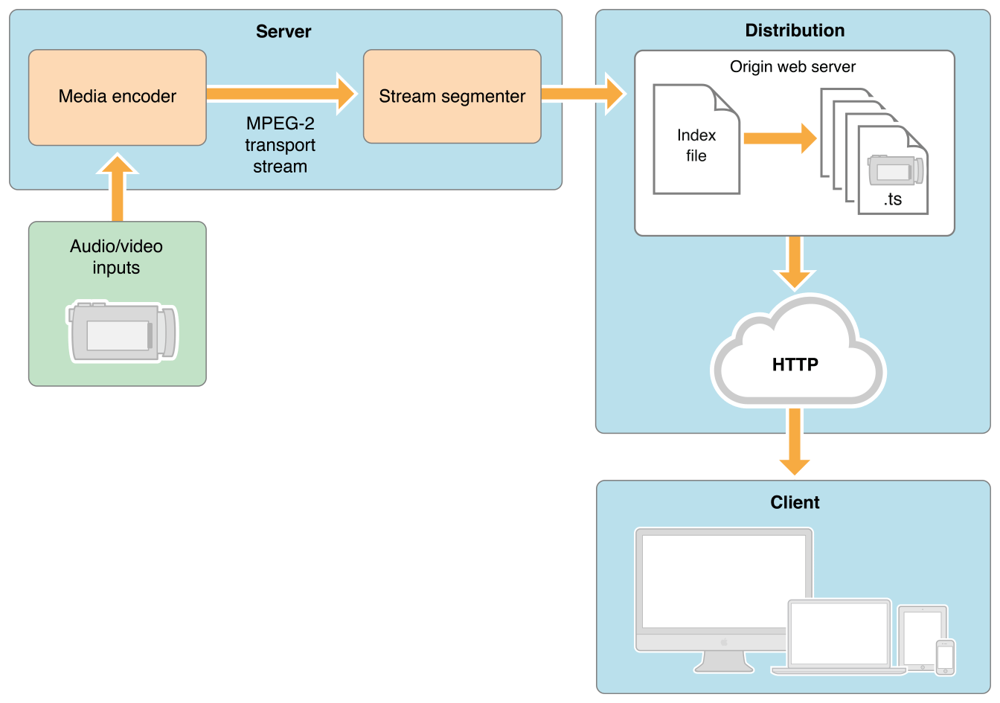

> 导航：[总目录](../../../README.md) · [documentation](../../../_indexes/documentation.md)

[Next](HTTP%20Streaming%20Architecture.md)

# Introduction

If you are interested in any of the following:

- Streaming audio or video to iPhone, iPod touch, iPad, or Apple TV
- Streaming live events without special server software
- Sending video on demand with encryption and authentication

you should learn about HTTP Live Streaming.

HTTP Live Streaming lets you send audio and video over HTTP from an ordinary web server for playback on iOS-based devices—including iPhone, iPad, iPod touch, and Apple TV—and on desktop computers (Mac OS X). HTTP Live Streaming supports both live broadcasts and prerecorded content (video on demand). HTTP Live Streaming supports multiple alternate streams at different bit rates, and the client software can switch streams intelligently as network bandwidth changes. HTTP Live Streaming also provides for media encryption and user authentication over HTTPS, allowing publishers to protect their work.

All devices running iOS 3.0 and later include built-in client software for HTTP Live Streaming. The Safari browser can play HTTP streams within a webpage on iPad and desktop computers, and Safari launches a full-screen media player for HTTP streams on iOS devices with small screens, such as iPhone and iPod touch. Apple TV 2 and later includes an HTTP Live Streaming client.

Safari plays HTTP Live streams natively as the source for the `<video>` tag. Mac OS X developers can use the QTKit and AVFoundation frameworks to create desktop applications that play HTTP Live Streams, and iOS developers can use the MediaPlayer and AVFoundation frameworks to create iOS apps.

Because it uses HTTP, this kind of streaming is automatically supported by nearly all edge servers, media distributors, caching systems, routers, and firewalls.

The HTTP Live Streaming specification is an IETF Internet-Draft. For a link to the specification, see the See Also section below.

HTTP Live Streaming is a way to send audio and video over HTTP from a web server to client software on the desktop or to iOS-based devices.

You can serve HTTP Live Streaming audio and video from an ordinary web server. The client software can be the Safari browser or an app that you’ve written for iOS or Mac OS X.

HTTP Live Streaming sends audio and video as a series of small files, typically of about 10 seconds duration, called media segment files. An index file, or playlist, gives the clients the URLs of the media segment files. The playlist can be periodically refreshed to accommodate live broadcasts, where media segment files are constantly being produced. You can embed a link to the playlist in a webpage or send it to an app that you’ve written.

For video on demand from prerecorded media, Apple provides a free tool to make media segment files and playlists from MPEG-4 video or QuickTime movies with H.264 video compression, or audio files with AAC or MP3 compression. The playlists and media segment files can be used for video on demand or streaming radio, for example.

For live streams, Apple provides a free tool to make media segment files and playlists from live MPEG-2 transport streams carrying H.264 video, AAC audio, or MP3 audio. There are a number of hardware and software encoders that can create MPEG-2 transport streams carrying MPEG-4 video and AAC audio in real time.

These tools can be instructed to encrypt your media and generate decryption keys. You can use a single key for all your streams, a different key for each stream, or a series of randomly generated keys that change at intervals during a stream. Keys are further protected by the requirement for an initialization vector, which can also be set to change periodically.

You should have a general understanding of common audio and video file formats and be familiar with how web servers and browsers work.

- _iOS Human Interface Guidelines_—how to design web content for iOS-based devices.
- [HTTP Live Streaming protocol](http://tools.ietf.org/html/draft-pantos-http-live-streaming)—the IETF Internet-Draft of the HTTP Live Streaming specification.
- [HTTP Live Streaming Resources](https://developer.apple.com/streaming/)—a collection of information and tools to help you get started.
- _[MPEG-2 Stream Encryption Format for HTTP Live Streaming](../../Audio%20Video/MPEG-2%20Stream%20Encryption%20Format%20for%20HTTP%20Live%20Streaming/1.0%20Introduction.md#apple-f4xwc4dqnrsv64tfmyxwi33df52wszbpkridimbqgezdqnrs)_—a detailed description of an encryption format.
[Next](HTTP%20Streaming%20Architecture.md)

