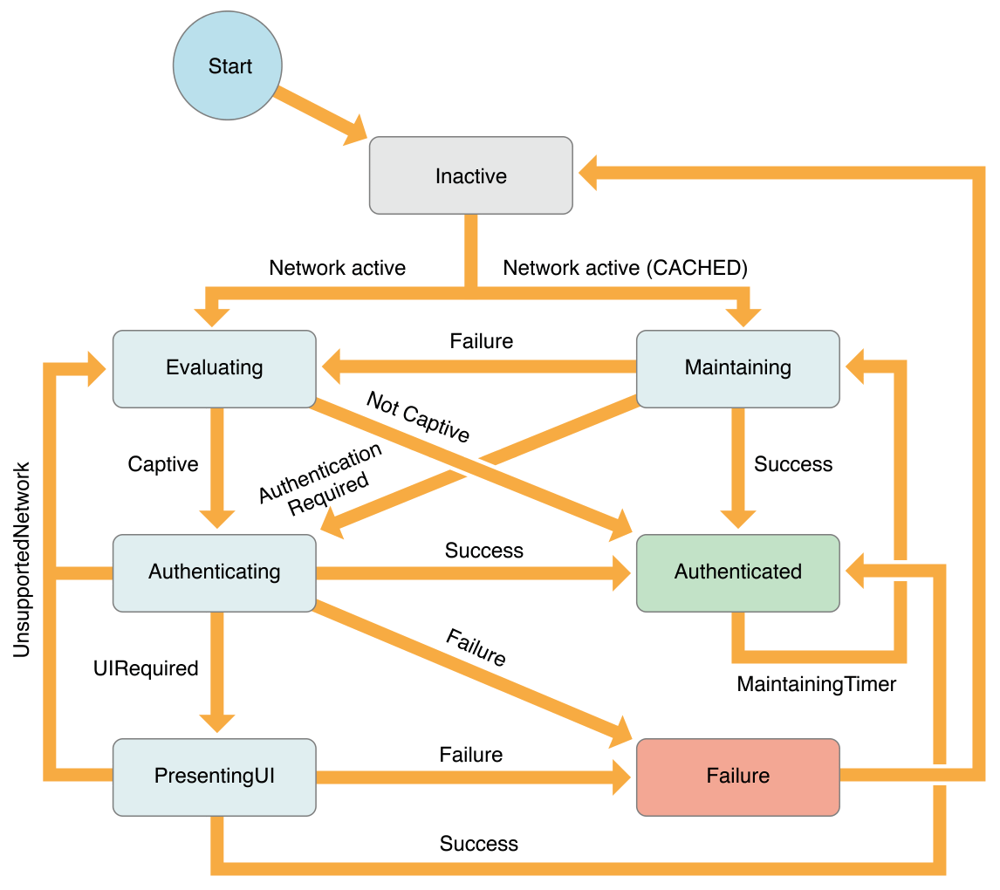

> 导航：[总目录](../../../README.md) · [documentation](../../../_indexes/documentation.md) · [Hotspot Network Subsystem Programming Guide](About%20the%20Hotspot%20Network%20Subsystem.md)

[Next](Hotspot%20Network%20Scan%20List%20Filtering.md)[Previous](About%20the%20Hotspot%20Network%20Subsystem.md)

# Authentication State Machine

One main function of the Hotspot Helper is to participate in the authentication state machine summarized in Figure 1-1. This state machine incorporates feedback from the helpers at various times after associating to a Wi-Fi network.

__Figure 1-1__  Authentication state machine

The state machine maintains a cache of results for each network that is visited, which lets it remember which helper was last chosen for a given network.

To help understand how the state machine works, consider the typical sequences of events for the following scenarios.

1. State machine is in __Inactive__ state.
2. Associate to Wi-Fi network.
3. IP connectivity is established.
4. State machine moves to __Evaluating__ state.
5. Sends `Evaluate` command to each Hotspot Helper.
6. Each Hotspot Helper processes the `Evaluate` command and determines whether the network is captive (it requires authentication).
7. Results from `Evaluate` indicate that network is captive; the “best” Hotspot Helper is chosen (`best_helper`).
8. State machine moves to __Authenticating__ state; cache entry is created specifying `best_helper`.
9. Sends `Authenticate` command to `best_helper`.
10. `best_helper` performs necessary operation to authenticate to the network and returns `kNEHotspotHelperResultSuccess`.
11. State machine moves to __Authenticated__ state and sets a __Maintaining__ timer.
12. Timer fires; State machine moves to __Maintaining__ state.
13. Sends `Maintain` command to `best_helper`.
14. `best_helper` processes command and returns `kNEHotspotHelperResultSuccess`.
15. Repeat steps 11 though 14.

1. State machine is in __Inactive__ state.
2. Associate to Wi-Fi network.
3. IP connectivity is established.
4. State machine moves to __Evaluating__ state.
5. Sends `Evaluate` command to each Hotspot Helper.
6. Each helper processes the `Evaluate` command to determine whether the network is captive.
7. Results from `Evaluate` indicate the network is not captive.
8. State machine moves to __Authenticated__ state; cache entry is created indicating network not captive.

1. State machine is in __Inactive__ state.
2. Associate to Wi-Fi network.
3. IP connectivity is established.
4. State machine moves to __Evaluating__ state.
5. Sends `Evaluate` command to each Hotspot Helper.
6. Each helper processes the `Evaluate` command to determine whether the network is captive.
7. Results from `Evaluate` indicate the network is captive; the “best” Hotspot Helper (`best_helper`) is chosen.
8. State machine moves to __Authenticating__ state.
9. Sends `Authenticate` command to `best_helper`.
10. `best_helper` determines that it needs user input to continue; creates `UILocalNotification` and returns `kNEHotspotHelperResultUIRequired`.
11. State machine moves to __PresentingUI__ state.
12. Sends `PresentUI` command to `best_helper`.
13. `best_helper` gets brought to the foreground as the result of the `UILocalNotification`, performs necessary authentication, and returns `kNEHotspotHelperResultSuccess`.
14. State machine moves to __Authenticated__ state; cache entry is created specifying `best_helper`.

1. State machine is in __Inactive__ state.
2. Associate to Wi-Fi network.
3. IP connectivity is established.
4. Cache entry is found specifying `best_helper`.
5. State machine moves to __Maintaining__ state.
6. Sends `Maintain` command to `best_helper`.
7. `best_helper` performs necessary operation to authenticate to the network and returns `kNEHotspotHelperResultSuccess`.
8. State machine moves to __Authenticated__ state; sets a __Maintaining__ timer.
9. Timer fires; State machine moves to __Maintaining__ state.
10. Sends `Maintain` command to `best_helper`.
11. `best_helper` processes command and returns `kNEHotspotHelperResultSuccess`.
12. Repeat steps 8 though 11.

This section describes each state in the authentication state machine in detail.

The __Inactive__ state is entered when interface has no IP connectivity. It is also the initial state when the state machine first starts up. This state clears the `best_helper` and `exclude_list` (see below).

The interface’s IP connectivity is suppressed until the __Authenticated__ state is reached. This is done to avoid sending application traffic over an interface that is not yet able to carry general network traffic.

The __Evaluating__ state is entered when the interface gains IP connectivity and no cache entry specifies a Hotspot Helper. This state is also entered from other states (see [Figure 1-1](#apple-f4xwc4dqnrsv64tfmyxwi33df52wszbpkridimbqge3dmmzzfvbuqmrnknlte)). Each helper that is not in the `exclude_list` (see below) is given the `kNEHotspotHelperCommandTypeEvaluate` command. The helper indicates its level of confidence in its ability to handle the network (none, low, high).

If no helper claims the network with any confidence, the state machine transitions to the __Authenticated__ state.

Of the helpers that claim the network, the state machine selects the one with the highest confidence, the `best_helper`, and transitions to the __Authenticating__ state. As an optimization, the first helper to claim the network with high confidence becomes the `best_helper`.

The __Authenticating__ state is entered when the interface requires authentication. The `best_helper` is given the `kNEHotspotHelperCommandTypeAuthenticate` command. If the helper returns `kNEHotspotHelperResultSuccess`, the state machine transitions to the __Authenticated__ state. If the helper returns `kNEHotspotHelperResultUIRequired`, the state machine transitions to the __PresentingUI__ state. If the helper returns `kNEHotspotHelperResultUnsupportedNetwork`, the helper is added to an `exclude_list` and the state machine transitions to the __Evaluating__ state. For all other results, the state machine enters the __Failure__ state.

The __Authenticated__ state is entered when the interface either requires no authentication or the network is successfully authenticated. In this state, the interface’s IP connectivity is no longer suppressed and is eligible to carry general network traffic.

A maintaining timer is scheduled to fire in 300 seconds. When the timer fires, the state machine transitions to the __Maintaining__ state.

The __Maintaining__ state is entered in two instances:

- When the maintaining timer fires from the __Authenticated__ state.
- When the interface gains IP connectivity and a cache entry is found
that specifies the helper `best_helper`.

The `best_helper` is given the `kNEHotspotHelperCommandTypeMaintain` command. If the result returned is `kNEHotspotHelperResultSuccess`, the state machine transitions back to the __Authenticated__ state. If the result returned is `kNEHotspotHelperResultAuthenticationRequired`, it enters the __Authenticating__ state. If any other result is returned, the interface’s IP connectivity is once again suppressed and the state machine enters the __Evaluating__ state.

The __PresentingUI__ state is entered when the `best_helper` indicates that it needs to present some UI. The `kNEHotspotHelperCommandTypePresentUI` command is given to the `best_helper` to process in the foreground. If the helper returns `kNEHotspotHelperResultSuccess`, the state machine transitions to the __Authenticated__ state. If the helper returns `kNEHotspotHelperResultUnsupportedNetwork`, the helper is added to an `exclude_list` and the state machine transitions to the __Evaluating__ state. For all other results, the state machine enters the __Failure__ state.

The __Failure__ state is entered when an unrecoverable error occurs. The Wi-Fi network is disassociated, and the state machine transitions to its __Inactive__ state.

[Next](Hotspot%20Network%20Scan%20List%20Filtering.md)[Previous](About%20the%20Hotspot%20Network%20Subsystem.md)

