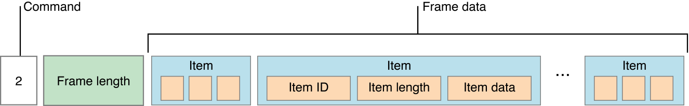
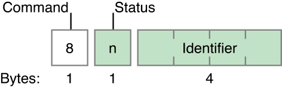
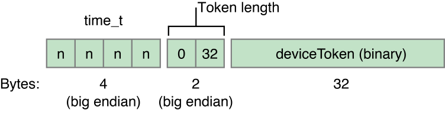

> 导航：[总目录](../../../README.md) · [documentation](../../../_indexes/documentation.md) · [Local and Remote Notification Programming Guide](index.md)

## Binary Provider API

The legacy binary interface required your provider server to employ the binary API described in this appendix. All developers should migrate their remote notification provider servers to the more capable and more efficient HTTP/2-based API described in [Communicating with APNs](CommunicatingwithAPNs.md#apple-f4xwc4dqnrsv64tfmyxwi33df52wszbpkridimbqga4dcojufvbuqmjrfvjvomi).

### General Provider Requirements

As a provider, you can communicate with Apple Push Notification service over a binary interface. This interface is a high-speed, high-capacity interface for providers; it uses a streaming TCP socket design in conjunction with binary content. The binary interface is asynchronous. The interface is supported, but you should prefer the use of the modern APNs API if possible.

The binary interface of the production environment is available through `gateway.push.apple.com`, port 2195; the binary interface of the development environment is available through `gateway.sandbox.push.apple.com`, port 2195.

For each interface, use TLS (or SSL) to establish a secured communications channel. The SSL certificate required for these connections is obtained from [your developer account](https://developer.apple.com/account/). (See [APNs Overview](https://developer.apple.com/library/archive/documentation/NetworkingInternet/Conceptual/RemoteNotificationsPG/APNSOverview.html#//apple_ref/doc/uid/TP40008194-CH8-SW1) for details.) To establish a trusted provider identity, present this certificate to APNs at connection time using peer-to-peer authentication.

> [!NOTE]
> 

As a provider, you are responsible for the following aspects of remote notifications:

- You must compose the notification payload (see [Creating the Remote Notification Payload](CreatingtheNotificationPayload.md#apple-f4xwc4dqnrsv64tfmyxwi33df52wszbpkridimbqga4dcojufvbuqmjqfvjvomi)).
- You are responsible for supplying the badge number to be displayed on the app icon.
- Connect regularly with the feedback service and fetch the current list of those devices that have repeatedly reported failed-delivery attempts. Then stop sending notifications to the devices associated with those apps. See [The Feedback Service](#apple-f4xwc4dqnrsv64tfmyxwi33df52wszbpkridimbqga4dcojufvbuqmjtfvjvomjs) for more information.

If you intend to support notification messages in multiple languages, but do not use the `loc-key` and `loc-args` properties of the `aps` payload dictionary for client-side fetching of localized alert strings, you need to localize the text of alert messages on the server side. To do this, you need to find out the current language preference from the client app. [Supplying the User’s Language Preference to Your Server](CreatingtheNotificationPayload.md#apple-f4xwc4dqnrsv64tfmyxwi33df52wszbpkridimbqga4dcojufvbuqmjqfvjvomjs) suggests an approach for obtaining this information. See [Creating the Remote Notification Payload](CreatingtheNotificationPayload.md#apple-f4xwc4dqnrsv64tfmyxwi33df52wszbpkridimbqga4dcojufvbuqmjqfvjvomi) for information about the `loc-key` and `loc-args` properties.

### The Binary Interface and Notification Format

The binary interface employs a plain TCP socket for binary content that is streaming in nature. For optimum performance, batch multiple notifications in a single transmission over the interface, either explicitly or using a TCP/IP Nagle algorithm. The format of notifications is shown in Figure A-1.

__Figure A-1__Notification format

> [!NOTE]
> 

The top level of the notification format is made up of the following, in order:

__Table A-1__Top-level fields for remote notifications

| Field name | Length | Discussion |
| --- | --- | --- |
| Command | 1 byte | Populate with the number `2`. |
| Frame length | 4 bytes | The size of the frame data. |
| Frame data | Variable length | The frame contains the body, structured as a series of items. |

The frame data is made up of a series of items. Each item is made up of the following, in order:

__Table A-2__Fields for remote notification frames

| Field name | Length | Discussion |
| --- | --- | --- |
| Item ID | 1 byte | The item identifier, as listed in [Table A-3](#apple-f4xwc4dqnrsv64tfmyxwi33df52wszbpkridimbqga4dcojufvbuqmjtfvjvooi). For example, the item identifier of the payload is `2`. |
| Item data length | 2 bytes | The size of the item data. |
| Item data | Variable length | The value for the item. |

The items and their identifiers are as follows:

__Table A-3__Item identifiers for remote notifications

| Item ID | Item Name | Length | Data |
| --- | --- | --- | --- |
| 1 | Device token | Up to 100 bytes | The device token in binary form, as was registered by the device.  A remote notification must have exactly one device token. |
| 2 | Payload | Variable length, less than or equal to 2 kilobytes | The JSON-formatted payload. A remote notification must have exactly one payload.  The payload must not be null-terminated. |
| 3 | Notification identifier | 4 bytes | An arbitrary, opaque value that identifies this notification. This identifier is used for reporting errors to your server.  Although this item is not required, you should include it to allow APNs to restart the sending of notifications upon encountering an error. |
| 4 | Expiration date | 4 bytes | A UNIX epoch date expressed in seconds (UTC) that identifies when the notification is no longer valid and can be discarded.  If this value is non-zero, APNs stores the notification tries to deliver the notification at least once. Specify zero to indicate that the notification expires immediately and that APNs should not store the notification at all. |
| 5 | Priority | 1 byte | The notification’s priority. Provide one of the following values:   - `10` The push message is sent immediately.  The remote notification must trigger an alert, sound, or badge on the device. It is an error to use this priority for a push that contains only the `content-available` key. - `5` The push message is sent at a time that conserves power on the device receiving it.  Notifications with this priority might be grouped and delivered in bursts. They are throttled, and in some cases are not delivered. |

If you send a notification that is accepted by APNs, nothing is returned.

If you send a notification that is malformed or otherwise unintelligible, APNs returns an error-response packet and closes the connection. Any notifications that you sent after the malformed notification using the same connection are discarded, and must be resent. Figure A-2 shows the format of the error-response packet.

__Figure A-2__Format of error-response packet

The packet has a command value of 8 followed by a one-byte status code and the notification identifier of the malformed notification. Table A-4 lists the possible status codes and their meanings.

__Table A-4__Codes in error-response packet

| Status code | Description |
| --- | --- |
| 0 | No errors encountered |
| 1 | Processing error |
| 2 | Missing device token |
| 3 | Missing topic |
| 4 | Missing payload |
| 5 | Invalid token size |
| 6 | Invalid topic size |
| 7 | Invalid payload size |
| 8 | Invalid token |
| 10 | Shutdown |
| 128 | Protocol error (APNs could not parse the notification) |
| 255 | None (unknown) |

A status code of 10 indicates that the APNs server closed the connection (for example, to perform maintenance). The notification identifier in the error response indicates the last notification that was successfully sent. Any notifications you sent after it have been discarded and must be resent. When you receive this status code, stop using this connection and open a new connection.

Take note that the device token in the production environment and the device token in the development environment are not the same value.

### The Feedback Service

The Apple Push Notification service includes a feedback service to give you information about failed remote notifications. When a remote notification cannot be delivered because the intended app does not exist on the device, the feedback service adds that device’s token to its list. Remote notifications that expire before being delivered are not considered a failed delivery and don’t impact the feedback service. By using this information to stop sending remote notifications that will fail to be delivered, you reduce unnecessary message overhead and improve overall system performance.

Query the feedback service daily to get the list of device tokens. Use the timestamp to verify that the device tokens haven’t been reregistered since the feedback entry was generated. For each device that has not been reregistered, stop sending notifications. APNs monitors providers for their diligence in checking the feedback service and refraining from sending remote notifications to nonexistent apps on devices.

> [!NOTE]
> 

The feedback service has a binary interface similar to the interface used for sending remote notifications. You access the production feedback service via `feedback.push.apple.com` on port 2196 and the development feedback service via `feedback.sandbox.push.apple.com` on port 2196. As with the binary interface for remote notifications, use TLS (or SSL) to establish a secured communications channel. You use the same SSL certificate for connecting to the feedback service as you use for sending notifications. To establish a trusted provider identity, present this certificate to APNs at connection time using peer-to-peer authentication.

Once you are connected, transmission begins immediately; you do not need to send any command to APNs. Read the stream from the feedback service until there is no more data to read. The received data is in tuples with the following format:

__Figure A-3__Binary format of a feedback tuple

__Table A-5__Table

| Timestamp | A timestamp (as a four-byte `time_t` value) indicating when APNs determined that the app no longer exists on the device. This value, which is in network order, represents the seconds since 12:00 midnight on January 1, 1970 UTC. |
| Token length | The length of the device token as a two-byte integer value in network order. |
| Device token | The device token in binary format. |

The feedback service’s list is cleared after you read it. Each time you connect to the feedback service, the information it returns lists only the failures that have happened since you last connected.

[Payload Key Reference](PayloadKeyReference.md#apple-f4xwc4dqnrsv64tfmyxwi33df52wszbpkridimbqga4dcojufvbuqmjxfvjvomi)

[Legacy Notification Format](LegacyNotificationFormat.md#apple-f4xwc4dqnrsv64tfmyxwi33df52wszbpkridimbqga4dcojufvbuqmjufvjvomi)
