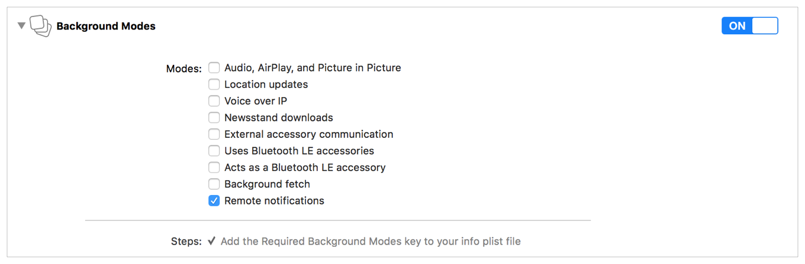

> 导航：[总目录](../../../README.md) · [documentation](../../../_indexes/documentation.md) · [Local and Remote Notification Programming Guide](index.md)

## Creating the Remote Notification Payload

Each notification your provider server sends to the Apple Push Notification service (APNs) includes a payload. The payload contains any custom data that you want to send to your app and includes information about how the system should notify the user. You construct this payload as a JSON dictionary and send it as the body content of your HTTP/2 message. The maximum size of the payload depends on the notification you are sending:

- For regular remote notifications, the maximum size is 4KB (4096 bytes)
- For Voice over Internet Protocol (VoIP) notifications, the maximum size is 5KB (5120 bytes)

> [!NOTE]
> 

APNs refuses notifications whose payload exceeds the maximum allowed size.

Because the delivery of remote notifications is not guaranteed, never include sensitive data or data that can be retrieved by other means in your payload. Instead, use notifications to alert the user to new information or as a signal that your app has data waiting for it. For example, an email app could use remote notifications to badge the app’s icon or to alert the user that new email is available in a specific account, as opposed to sending the contents of email messages directly. Upon receiving the notification, the app should open a direct connection to your email server to retrieve the email messages.

### Creating the JSON Dictionary

The following examples illustrate the structure of the JSON dictionary and the keys you can include for your notifications. The most important part of the payload is the `aps` dictionary, which contains Apple-defined keys and is used to determine how the system receiving the notification should alert the user, if at all. The examples also includes keys whose names include the string “acme”, which represent custom data included by a fictional app. Although the examples include whitespace and line breaks for readability, in practice, you should omit whitespace and line breaks to reduce the size of the payload.

__Example 1.__ The following payload contains an `aps` dictionary with a simple alert message. The `acme2` key contains an array of app-specific data.

1. `{`
2. `"aps" : { "alert" : "Message received from Bob" },`
3. `"acme2" : [ "bang", "whiz" ]`
4. `}`

__Example 2.__ The following payload asks the system to display an alert with a Close button and a single action button. The `title` and `body` keys provide the contents of the alert. The “PLAY” string is used to retrieve a localized string from the appropriate `Localizable.strings` file of the app. The resulting string is used by the alert as the title of an action button. This payload also asks the system to badge the app’s icon with the number 5.

1. `{`
2. `"aps" : {`
3. `"alert" : {`
4. `"title" : "Game Request",`
5. `"body" : "Bob wants to play poker",`
6. `"action-loc-key" : "PLAY"`
7. `},`
8. `"badge" : 5`
9. `},`
10. `"acme1" : "bar",`
11. `"acme2" : [ "bang", "whiz" ]`
12. `}`

__Example 3.__ The following payload specifies that the device should display an alert message, plays a sound, and badges the app’s icon.

1. `{`
2. `"aps" : {`
3. `"alert" : "You got your emails.",`
4. `"badge" : 9,`
5. `"sound" : "bingbong.aiff"`
6. `},`
7. `"acme1" : "bar",`
8. `"acme2" : 42`
9. `}`

__Example 4.__ The following payload uses the `loc-key` to specify a localized string in the app’s `Localizable.strings` file. That string is displayed as the message of the alert. The `loc-args` contains values to substitute into the string before displaying it. The payload also specifies a custom sound to play with the alert.

1. `{`
2. `"aps" : {`
3. `"alert" : {`
4. `"loc-key" : "GAME_PLAY_REQUEST_FORMAT",`
5. `"loc-args" : [ "Jenna", "Frank"]`
6. `},`
7. `"sound" : "chime.aiff"`
8. `},`
9. `"acme" : "foo"`
10. `}`

For a complete list of Apple-specific keys that you can include in notification payloads, see [Payload Key Reference](PayloadKeyReference.md#apple-f4xwc4dqnrsv64tfmyxwi33df52wszbpkridimbqga4dcojufvbuqmjxfvjvomi).

### Configuring a Background Update Notification

Background update notifications improve the user experience by giving you a way to wake up your app periodically so that it can refresh its data in the background. When apps do not run for extended periods of time, their data can become outdated. When the user finally launches the app again, the outdated data must be replaced, which can cause a delay in using the app. A background update notification can alert the user or it can occur silently.

> [!IMPORTANT]
> 

To support a background update notification, make sure that the payload’s `aps` dictionary includes the `content-available` key with a value of `1`. If there are user-visible updates that go along with the background update, you can set the `alert`, `sound`, or `badge` keys in the `aps` dictionary, as appropriate.

When a background update notification is delivered to the user’s device, iOS wakes up your app in the background and gives it up to 30 seconds to run. In iOS, the system delivers background update notifications by calling the [application:didReceiveRemoteNotification:fetchCompletionHandler:](https://developer.apple.com/documentation/uikit/uiapplicationdelegate/1623013-application) method of your app delegate. Use that method to initiate any download operations needed to fetch new data. Processing remote notifications in the background requires that you add the appropriate background modes to your app.

__To configure your app to process background update notifications__

1. In the Project Navigator, select your project.
2. In the editor, select your iOS app target.
3. Select the Capabilities tab.
4. Enable the Background Modes capability.
5. Enable the Remote notifications background mode. 

Listing 7-1 shows an example of a JSON payload for a background update notification.

__Listing 7-1__Configuring a background update notification

1. `{`
2. `"aps" : {`
3. `"content-available" : 1`
4. `},`
5. `"acme1" : "bar",`
6. `"acme2" : 42`
7. `}`

For more information about how to handle remote notifications, see [Handling Remote Notifications](HandlingRemoteNotifications.md#apple-f4xwc4dqnrsv64tfmyxwi33df52wszbpkridimbqga4dcojufvbuqnrnknlte).

### Assigning Custom Actions to a Remote Notification

To display custom actions with a remote notification, include the `category` key in the `aps` dictionary of the notification’s payload. At launch time, apps can register categories that include custom actions. When a notification includes the `category` key, the system displays the actions for that category as buttons in the banner or alert interface. When the user selects a button, the system notifies your app so that it can perform any associated tasks. Notifications configured with a category must also be configured to display an alert.

Listing 7-2 shows a sample payload for a notification that displays an alert and includes a category with custom actions. The “NEW_MESSAGE_CATEGORY” string corresponds to the name of a category already registered by the app. In this case, the category includes custom actions for responding to the message.

__Listing 7-2__Including a category in the payload

1. `{`
2. `"aps" : {`
3. `"category" : "NEW_MESSAGE_CATEGORY"`
4. `"alert" : {`
5. `"body" : "Acme message received from Johnny Appleseed",`
6. `},`
7. `"badge" : 3,`
8. `"sound" : “chime.aiff"`
9. `},`
10. `"acme-account" : "jane.appleseed@apple.com",`
11. `"acme-message" : "message123456"`
12. `}`

For information about how to register the categories and custom actions that your app supports, see [Configuring Categories and Actionable Notifications](SupportingNotificationsinYourApp.md#apple-f4xwc4dqnrsv64tfmyxwi33df52wszbpkridimbqga4dcojufvbuqnbnknltenq). For information about how to handle the selection of custom actions in your app, see [Responding to the Selection of a Custom Action](SchedulingandHandlingLocalNotifications.md#apple-f4xwc4dqnrsv64tfmyxwi33df52wszbpkridimbqga4dcojufvbuqnjnknlte).

### Localizing the Content of Your Remote Notifications

There are two ways to localize the content of remote notifications:

- Provide localized content from your provider server.
- Store localized message strings in your app bundle.

Both localization approaches have advantages and disadvantages and you should choose the technique that best fits your needs. Providing localized content from your server lets you specify any text you want, but it also requires discovering and tracking the user’s current language preference and potentially translating content dynamically. Storing localized strings in your app bundle is simpler, but requires that you define all of your notification messages in advance and include them in your app’s `Localizable.strings` resource files.

### Supplying the User’s Language Preference to Your Server

If your provider server handles the localization of notification messages, your app should communicate the user’s language preference to that server. Users set language preferences locally on the device, and apps can retrieve these preferences using the [preferredLanguages](https://developer.apple.com/documentation/foundation/nslocale/1415614-preferredlanguages) property of `NSLocale`.

Listing 7-3 illustrates a technique for obtaining the currently selected language and communicating it to your provider server. The example fetches the user’s first preferred language and encodes it as a UTF8 string. It then sends that string to its provider using a custom method. You might also consider sending the first few languages from the [preferredLanguages](https://developer.apple.com/documentation/foundation/nslocale/1415614-preferredlanguages) property in case the user’s first language is not one that you support. If you do not support any of the user’s preferred languages, consider using a widely spoken language such as English or Spanish as a fallback.

__Listing 7-3__Getting the current supported language and sending it to the provider

1. `NSString *preferredLang = [[NSLocale preferredLanguages] objectAtIndex:0];`
2. `const char *langStr = [preferredLang UTF8String];`
3. `[self sendProviderCurrentLanguage:langStr]; // custom method`
4. `}`

Because users can change their preferred language settings, apps should observe the [NSCurrentLocaleDidChangeNotification](https://developer.apple.com/documentation/foundation/nslocale/1418141-currentlocaledidchangenotificati) notification. Use that notification to send any language-related changes to your server.

### Storing Localized Content in Your App Bundle

If you use a consistent set of messages for your notifications, you can store localized versions of the message text in your app bundle and use the `loc-key` and `loc-args` keys in your payload to specify which message to display. The `loc-key` and `loc-args` keys define the message content of the notification. When present, the local system searches the app’s `Localizable.strings` files for a key string matching the value in `loc-key`. It then uses the corresponding value from the strings file as the basis for the message text, replacing any placeholder values with the strings specified by the `loc-args` key. (You can also specify a title string for the notification using the `title-loc-key` and `title-loc-args` keys.)

To illustrate how to use these keys, consider an example of a game app whose provider server sends notifications when a user is invited to play the game. Because the invitation text never changes, that text is included in the app’s `Localizable.strings` files using the following entry:

1. `"GAME_PLAY_REQUEST_FORMAT" = "%@ and %@ have invited you to play Monopoly";`

When the provider server wants to send a notification about a game request, it builds the payload using the `loc-key` and `loc-args` keys. It sets the value of `loc-key` to the string `GAME_PLAY_REQUEST_FORMAT` and sets the value of `loc-args` to the names of the participants initiating the game play request. For example, if two users named Jenna and Frank initiated the request, the provider server would send a payload with the following contents:

1. `{`
2. `"aps" : {`
3. `"alert" : {`
4. `"loc-key" : "GAME_PLAY_REQUEST_FORMAT",`
5. `"loc-args" : [ "Jenna", "Frank"]`
6. `}`
7. `}`
8. `}`

Upon receiving the remote notification with the preceding payload, the device fetches the `GAME_PLAY_REQUEST_FORMAT` string from the appropriate `Localizable.strings` file of the app and incorporates the provided player names. For a user whose preferred language is English, the resulting message string becomes “Jenna and Frank have invited you to play Monopoly.” For other languages, the string would be an appropriately translated version of the message that incorporates the provided names.

When crafting message strings for your `Localizable.strings` file, you can use the same format specifiers that you use for any localized content. For example, you can use positional specifiers of the form `%`_n_`$@` to allow for the rearranging of parameters and you can use the `%%` specifier to create a percent sign character.

For additional information about the keys you can include in the notification’s payload, see [Payload Key Reference](PayloadKeyReference.md#apple-f4xwc4dqnrsv64tfmyxwi33df52wszbpkridimbqga4dcojufvbuqmjxfvjvomi). For more information about internationalization and providing localized content for your app, see _[Internationalization and Localization Guide](../../Mac%20OSX/Internationalization%20and%20Localization%20Guide/About%20Internationalization%20and%20Localization.md#apple-f4xwc4dqnrsv64tfmyxwi33df52wszbpgeydambqge3tc2i)_.

[APNs Overview](https://developer.apple.com/library/archive/documentation/NetworkingInternet/Conceptual/RemoteNotificationsPG/APNSOverview.html#//apple_ref/doc/uid/TP40008194-CH8-SW1)

[Communicating with APNs](CommunicatingwithAPNs.md#apple-f4xwc4dqnrsv64tfmyxwi33df52wszbpkridimbqga4dcojufvbuqmjrfvjvomi)
