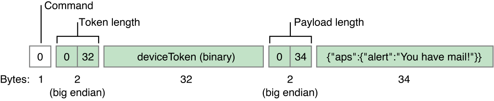
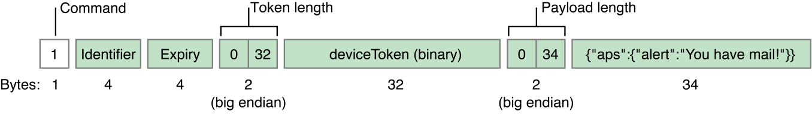

> 导航：[总目录](../../../README.md) · [documentation](../../../_indexes/documentation.md) · [Local and Remote Notification Programming Guide](index.md)

## Legacy Notification Format

New development should use the modern format to connect to APNs, as described in [Communicating with APNs](CommunicatingwithAPNs.md#apple-f4xwc4dqnrsv64tfmyxwi33df52wszbpkridimbqga4dcojufvbuqmjrfvjvomi).

These formats do not include a priority; a priority of `10` is assumed.

### Legacy Notification Format

Figure B-1 shows this format.

__Figure B-1__Legacy notification format

The first byte in the legacy format is a command value of 0 (zero). The other fields are the same as the enhanced format. Listing B-1 gives an example of a function that sends a remote notification to APNs over the binary interface using the legacy notification format. The example assumes prior SSL connection to `gateway.push.apple.com` (or `gateway.sandbox.push.apple.com`) and peer-exchange authentication.

__Listing B-1__Sending a notification in the legacy format via the binary interface

1. `static bool sendPayload(SSL *sslPtr, char *deviceTokenBinary, char *payloadBuff, size_t payloadLength)`
2. `{`
3. `bool rtn = false;`
4. `if (sslPtr && deviceTokenBinary && payloadBuff && payloadLength)`
5. `{`
6. `uint8_t command = 0; /* command number */`
7. `char binaryMessageBuff[sizeof(uint8_t) + sizeof(uint16_t) +`
8. `DEVICE_BINARY_SIZE + sizeof(uint16_t) + MAXPAYLOAD_SIZE];`
9. `/* message format is, |COMMAND|TOKENLEN|TOKEN|PAYLOADLEN|PAYLOAD| */`
10. `char *binaryMessagePt = binaryMessageBuff;`
11. `uint16_t networkOrderTokenLength = htons(DEVICE_BINARY_SIZE);`
12. `uint16_t networkOrderPayloadLength = htons(payloadLength);`
14. `/* command */`
15. `*binaryMessagePt++ = command;`
17. `/* token length network order */`
18. `memcpy(binaryMessagePt, &networkOrderTokenLength, sizeof(uint16_t));`
19. `binaryMessagePt += sizeof(uint16_t);`
21. `/* device token */`
22. `memcpy(binaryMessagePt, deviceTokenBinary, DEVICE_BINARY_SIZE);`
23. `binaryMessagePt += DEVICE_BINARY_SIZE;`
25. `/* payload length network order */`
26. `memcpy(binaryMessagePt, &networkOrderPayloadLength, sizeof(uint16_t));`
27. `binaryMessagePt += sizeof(uint16_t);`
29. `/* payload */`
30. `memcpy(binaryMessagePt, payloadBuff, payloadLength);`
31. `binaryMessagePt += payloadLength;`
32. `if (SSL_write(sslPtr, binaryMessageBuff, (binaryMessagePt - binaryMessageBuff)) > 0)`
33. `rtn = true;`
34. `}`
35. `return rtn;`
36. `}`

### Enhanced Notification Format

The enhanced format has several improvements over the legacy format:

- __Error response__. With the legacy format, if you send a notification packet that is malformed in some way—for example, the payload exceeds the stipulated limit—APNs responds by severing the connection. It gives no indication why it rejected the notification. The enhanced format lets a provider tag a notification with an arbitrary identifier. If there is an error, APNs returns a packet that associates an error code with the identifier. This response enables the provider to locate and correct the malformed notification.
- __Notification expiration__. APNs has a store-and-forward feature that keeps the most recent notification sent to an app on a device. If the device is offline at time of delivery, APNs delivers the notification when the device next comes online. With the legacy format, the notification is delivered regardless of the pertinence of the notification. In other words, the notification can become “stale” over time. The enhanced format includes an expiry value that indicates the period of validity for a notification. APNs discards a notification in store-and-forward when this period expires.

Figure B-2 depicts the format for notification packets.

__Figure B-2__Enhanced notification format

The first byte in the notification format is a command value of 1. The remaining fields are as follows:

- __Identifier__—An arbitrary value that identifies this notification. This same identifier is returned in a error-response packet if APNs cannot interpret a notification.
- __Expiry__—A fixed UNIX epoch date expressed in seconds (UTC) that identifies when the notification is no longer valid and can be discarded. The expiry value uses network byte order (big endian). If the expiry value is non-zero, APNs tries to deliver the notification at least once. Specify zero to request that APNs not store the notification at all.
- __Token length__—The length of the device token in network order (that is, big endian)
- __Device token__—The device token in binary form.
- __Payload length__—The length of the payload in network order (that is, big endian). The payload must not exceed 256 bytes and must _not_ be null-terminated.
- __Payload__—The notification payload.

Listing B-2 composes a remote notification in the enhanced format before sending it to APNs. It assumes prior SSL connection to `gateway.push.apple.com` (or `gateway.sandbox.push.apple.com`) and peer-exchange authentication.

__Listing B-2__Sending a notification in the enhanced format via the binary interface

1. `static bool sendPayload(SSL *sslPtr, char *deviceTokenBinary, char *payloadBuff, size_t payloadLength)`
2. `{`
3. `bool rtn = false;`
4. `if (sslPtr && deviceTokenBinary && payloadBuff && payloadLength)`
5. `{`
6. `uint8_t command = 1; /* command number */`
7. `char binaryMessageBuff[sizeof(uint8_t) + sizeof(uint32_t) + sizeof(uint32_t) + sizeof(uint16_t) +`
8. `DEVICE_BINARY_SIZE + sizeof(uint16_t) + MAXPAYLOAD_SIZE];`
9. `/* message format is, |COMMAND|ID|EXPIRY|TOKENLEN|TOKEN|PAYLOADLEN|PAYLOAD| */`
10. `char *binaryMessagePt = binaryMessageBuff;`
11. `uint32_t whicheverOrderIWantToGetBackInAErrorResponse_ID = 1234;`
12. `uint32_t networkOrderExpiryEpochUTC = htonl(time(NULL)+86400); // expire message if not delivered in 1 day`
13. `uint16_t networkOrderTokenLength = htons(DEVICE_BINARY_SIZE);`
14. `uint16_t networkOrderPayloadLength = htons(payloadLength);`
16. `/* command */`
17. `*binaryMessagePt++ = command;`
19. `/* provider preference ordered ID */`
20. `memcpy(binaryMessagePt, &whicheverOrderIWantToGetBackInAErrorResponse_ID, sizeof(uint32_t));`
21. `binaryMessagePt += sizeof(uint32_t);`
23. `/* expiry date network order */`
24. `memcpy(binaryMessagePt, &networkOrderExpiryEpochUTC, sizeof(uint32_t));`
25. `binaryMessagePt += sizeof(uint32_t);`
27. `/* token length network order */`
28. `memcpy(binaryMessagePt, &networkOrderTokenLength, sizeof(uint16_t));`
29. `binaryMessagePt += sizeof(uint16_t);`
31. `/* device token */`
32. `memcpy(binaryMessagePt, deviceTokenBinary, DEVICE_BINARY_SIZE);`
33. `binaryMessagePt += DEVICE_BINARY_SIZE;`
35. `/* payload length network order */`
36. `memcpy(binaryMessagePt, &networkOrderPayloadLength, sizeof(uint16_t));`
37. `binaryMessagePt += sizeof(uint16_t);`
39. `/* payload */`
40. `memcpy(binaryMessagePt, payloadBuff, payloadLength);`
41. `binaryMessagePt += payloadLength;`
42. `if (SSL_write(sslPtr, binaryMessageBuff, (binaryMessagePt - binaryMessageBuff)) > 0)`
43. `rtn = true;`
44. `}`
45. `return rtn;`
46. `}`

[Binary Provider API](BinaryProviderAPI.md#apple-f4xwc4dqnrsv64tfmyxwi33df52wszbpkridimbqga4dcojufvbuqmjtfvjvomi)
