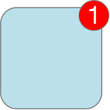

> 导航：[总目录](../../../README.md) · [documentation](../../../_indexes/documentation.md)

## Local and Remote Notifications Overview

> [!IMPORTANT]
> 

Local notifications and remote notifications are ways to inform users when new data becomes available for your app, even when your app is not running in the foreground. For example, a messaging app might let the user know when a new message has arrived, and a calendar app might inform the user of an upcoming appointment. The difference between local and remote notifications is straightforward:

- With _local notifications_, your app configures the notification details locally and passes those details to the system, which then handles the delivery of the notification when your app is not in the foreground. Local notifications are supported on iOS, tvOS, and watchOS.
- With _remote notifications_, you use one of your company’s servers to push data to user devices via the Apple Push Notification service. Remote notifications are supported on iOS, tvOS, watchOS, and macOS.

Both local and remote notifications require you to add code to support the scheduling and handling of notifications in your app. For remote notifications, you must also provide a server environment that is capable of receiving data from user devices and sending notification-related data to the _Apple Push Notification service (APNs)_, which is an Apple-provided service that handles the delivery of remote notifications to user devices.

### The User Notifications and User Notifications UI Frameworks

The User Notifications framework provides a consistent way to schedule and handle local notifications starting in iOS 10, watchOS 3, and tvOS 10. In addition to managing local notifications, the framework also supports the handling of remote notifications, although the configuration of remote notifications still requires some platform-specific APIs. Because it is a separate framework, you can use it both from the apps you create and from the extensions you create, such as your WatchKit extension.

> [!NOTE]
> 

The User Notifications framework also supports the creation of _notification service app extensions_, which let you modify the content of remote notifications before they are delivered. If you include a notification service app extension with your app, the system passes incoming notifications to your extension before delivering them to the user. You might use this type of extension to implement end-to-end encryption for your app’s notifications, to modify the notification content before delivery, or to download additional images or media related to the notification.

The User Notifications UI framework is a companion to the User Notifications framework that lets you customize the appearance of the system’s notification interface. You use the User Notifications UI framework to define a _notification content app extension_, whose job is to provide a view controller with custom content to display in the notification interface. The system displays your custom view controller instead of the default system interface. You might use this type of extension to incorporate media or dynamic content into your notification interfaces.

For more information about the classes of the User Notifications framework, see _[User Notifications Framework Reference](https://developer.apple.com/documentation/usernotifications)_. For information about the classes you use to create a notification content app extension, see _[User Notifications UI Framework Reference](https://developer.apple.com/documentation/usernotificationsui)_.

### When to Use Local and Remote Notifications

Because apps on iOS, tvOS, and watchOS are not always running, local notifications provide a way to alert the user when your app has new information to present. For example, an app that pulls data from a server in the background can schedule a local notification when some interesting piece of information is received. Local notifications are also well suited for apps such as calendar and to-do list apps that need to alert the user at a specific time or when a specific geographic location is reached.

Remote notifications are appropriate when some or all of the app’s data is managed by your company’s servers. With remote notifications, you decide when you want to push a notification to the user’s device. For example, a messaging app would use remote notifications to let users know when new messages arrive. Because they are sent from your server, you can send remote notifications at any time, including when the app is not running on the user’s device.

### Local and Remote Notifications Look the Same to Users

To the user, there is no difference between a local and remote notification when presented on a given device. Both types of notifications have the same default appearance, which is provided by the system. You can customize the appearance in some cases, but mostly you choose how you want the user to be notified. Specifically, you choose one of the following options for delivering the notification:

- An onscreen alert or banner
- A badge on your app’s icon
- A sound that accompanies an alert, banner, or badge

When configuring local and remote notifications, choose the interaction type that is most appropriate for the type of information you are delivering. For example, a to-do list app might have a list of items, each of which has a time when the item must be completed and a priority. For high-priority items, you might display an alert when the completion time passes to let the user know that they should act on the item right away. For lower-priority items, you might apply a badge to the app’s icon or play a sound to provide a more subtle reminder to complete the item.

Alerts let you display messages directly to the user, but the meaning of badges and sounds depends on your app. You might use different sounds to communicate specific types of events, such as the arrival of a message or the completion of a task. Badges always contain a numerical value and are commonly used to indicate the number of items that await the user’s attention. Figure 1-1 shows the positioning of a badge on the icon of an iOS app.

__Figure 1-1__An app icon with a badge number (iOS)

Always use local and remote notifications judiciously to avoid annoying the user. The system lets users enable and disable the presentation of alerts, sounds, and badges on a per-app basis. Although notifications may still be delivered to your app, the system notifies the user only with the currently enabled options. If the user disables notifications altogether, APNs does not deliver your app’s notifications to the user’s device and the scheduling of local notifications always fails.

[Managing Your App’s Notification Support](SupportingNotificationsinYourApp.md#apple-f4xwc4dqnrsv64tfmyxwi33df52wszbpkridimbqga4dcojufvbuqnbnknltc)
