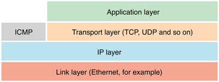

> 导航：[总目录](../../../README.md) · [documentation](../../../_indexes/documentation.md) · [Networking Concepts](Introduction.md)

[Next](Understanding%20Latency.md)[Previous](Networking%20Terminology.md)

# Networking Layers

The TCP/IP networking model consists of four basic layers: the link layer, the IP layer (short for Internet protocol), the transport layer, and the application layer. These layers are described in the following sections.

The bottommost layer is the _link layer_, or _physical layer_. This layer of the networking stack involves the actual hardware used to communicate with nearby physically connected hosts. The link layer transports raw packets from one host to another on the same physical network.

Most end users encounter only five link layers directly: Wi-Fi, cellular networking, Ethernet, Bluetooth, and FireWire. However, their data passes through links of many different types on its way to its destination. A user might send data over a cable modem based on DOCSIS or a DSL modem based on VHDSL. From there, the user’s data might pass across a SONET/SDH link (used for trunk lines) or a satellite connection using IPoS (IP over satellite) or IPoDVB (IP over digital video broadcast).

A _network interface_ is a piece of hardware that provides a link-layer interconnect. A host can have many network interfaces. For example, you might have one or more (wired) Ethernet interfaces, a Wi-Fi interface, a Bluetooth interface, or even a cellular modem (whether attached by USB to a Mac or built into an iPhone or iPad). In addition, certain pieces of software provide (virtual) network interfaces—VPN software, virtualization environments (like the Classic environment in OS X 10.4 and earlier), and so on.

Each network interface is generally connected to one or more additional interfaces; the connection between them is called a _link_. Although these interfaces are not always physically connected to one another, a link appears to be equivalent to a physical wire as far as the operating system and software are concerned. For example, two computers connected by an Ethernet hub or switch have a link between them (because the hub and switch are transparent), but two computers separated by a network router do not (because the operating system has to know to send data to the router instead of sending it directly to that host—more on routing later).

When writing software, unless your software interacts with the link layer directly (by sending and receiving raw packets, configuring a network interface, reading the hardware ID of a network interface, and so on), the operating system largely hides the differences between link layers from you (although it cannot fully isolate you from differences in bandwidth, latency, or reliability).

Sitting on top of the link layer is the _IP layer_. The IP layer provides packet transport from one host to another in such a way that the packets can pass across multiple physical networks.

The IP layer adds the notion of routing to the picture, which lets you send a packet to a distant destination. Briefly put, the packets from a host travel to a nearby router across some physical link, which routes the packet to another router, which routes it to another router, and so on, until it reaches its destination. Reply packets travel back in much the same way. The path your packets take is called a _route_, and each link that the packets follow from one router to another along the route is called a _hop_.

The IP layer also helps abstract away differences in the link layer. In particular, different link layers support packets with different maximum sizes—referred to as the _maximum transmission unit (MTU)_. To hide this difference, the IP layer splits packets into multiple pieces—a process known as _fragmentation_—and reassembles them at the other end. (Note that fragmentation applies only to taking a packet and splitting it; in the case of TCP/IP, the sending host packetizes TCP, but because it did not start out as discrete packets, this is not considered fragmentation.)

On most networks, the amount of time a network takes to deliver a single packet is independent of the packet’s size up to the MTU. For example, on an Ethernet network, it takes the same time slice whether you send a packet that is 100 bytes or 1500 bytes in length. For this reason, repeatedly fragmenting a packet results in a hefty overhead.

For example, if you send a 1500-byte packet through a network with a 1400-byte MTU on its way to a third network with an MTU of 1300 (these numbers are arbitrary), your 1500-byte packet would first get broken up into a 1400-byte packet and a 100-byte packet. Later, the 1400 byte packet would get broken up into a 1300-byte packet and a second 100-byte packet, for a total of three packets (1300 + 100 + 100). If you instead sent a 1300-byte packet and a 200-byte packet, your data would take one-third less bandwidth on the final network.

Fragmentation also has another cost. If a fragment of a packet is lost, the entire packet is lost. This means that on a network with high packet loss, fragmentation can increase the rate of retransmission required (which, in turn, can make the packet loss worse).

To avoid this problem, when performing TCP communication, most modern operating systems use a technique called path MTU discovery to determine the largest packet that can pass from one host to another without fragmentation, thus maximizing the use of available bandwidth. If you are writing code that sends and receives raw packets, you should consider taking similar steps. Where possible, however, you should use TCP/IP, which does this for you.

On top of the IP layer, you’ll find several _transport layers_. When writing networking code, you will almost invariably be working with one of these transport layers or with a higher-level layer built on top of them.

The two most common protocols at this layer are the _transmission control protocol (TCP)_ and the _user datagram protocol (UDP)_.

Both TCP and UDP provide basic data transport from one host to another, much like IP, but add the notion of _port numbers_. These port numbers let you run multiple services on a single host by providing a way to tell the receiving host which service should receive that particular message.

Like the layers below it, UDP provides no guarantee that the data will ever reach its destination. If your program uses UDP, you must handle any retransmission yourself, if necessary. UDP may be a good choice for situations where low latency is required, such as real-time game communication, because if the client state update isn’t available within a few milliseconds, the data is no longer useful anyway. However, as a rule, you should generally avoid UDP unless you have to support an existing protocol that uses it.

Unlike UDP, TCP adds:

- Delivery guarantees—Data transmitted using TCP is guaranteed to be received in the order in which it was sent and (connection failures notwithstanding) in its entirety. If data cannot be transmitted, the connection is torn down after a long timeout. However, all data received up to that point in time is guaranteed to be in order and without missing fragments in the middle.
- Congestion control—Sending hosts back off the speed of transmission (and retransmission) if data is getting dropped along the way due to an over-utilized link.
- Flow control—When busy, receiving hosts tell sending hosts to wait until they are ready to handle more data.
- Stream-based data flow—Your software sees the data as a series of bytes instead of as a series of discrete records (messages, in UDP parlance). Note that if you want to use TCP to send a series of discrete records, you must encode the record boundaries yourself (using MIME multipart message encoding, for example).
- Path MTU discovery—TCP chooses the largest packet size that avoids fragmentation en route.

By contrast, UDP supports three things that TCP does not:

- _Broadcast_ messages in IPv4—packets sent to a broadcast address are received by every host within its broadcast domain (which is usually its subnet).
- _Multicast_ messages—UDP packets sent to a multicast address are sent out to any host that subscribes to them; those hosts may be on the local area network (LAN) or may be behind a router, but in practice are usually limited to the LAN.
- Preservation of record (packet) boundaries. With UDP, the receiver sees each message individually instead of as a continuous stream of bytes.

TCP and UDP also depend on another protocol, the _Internet control message protocol (ICMP)_ that sits on top of the IP layer. ICMP packets are used for reporting connection failures (destination unreachable, for example) back to the connecting or sending host. Although TCP and UDP sockets can connect successfully without ICMP, the ability to detect connection failures is significantly reduced.

In addition to providing support for TCP and UDP, ICMP echo packets form the basis for the `ping` tool, which is commonly used to diagnose network problems. When the destination host (or router) receives an ICMP echo packet, it echoes the packet back to the sender, thus giving you some idea of the rate of packet loss between two hosts.

On top of these transport layer protocols, you can optionally have encryption layers such as TLS (transport layer security) on top of TCP or DTLS over UDP.

Similarly, various encapsulation schemes are built on top of transport layer protocols—the L2TP and PPTP protocols used by many VPNs, for example. These encapsulation layers appear to your program as a separate network interface (because they provide a virtual link layer). Under the hood, however, traffic over that interface looks like any other TCP/IP stream to a single host (the VPN server).

The _application layer_ sits at the top of the protocol stack. This layer includes such protocols as hypertext transfer protocol (HTTP) and file transfer protocol (FTP).

The application layer is so named because the details of this layer are specific to a particular application or class of applications. In other words, this is the layer that is under your program’s direct control, whether you are implementing your own application-layer protocols or are merely asking the operating system to do so on your behalf.

[Next](Understanding%20Latency.md)[Previous](Networking%20Terminology.md)

