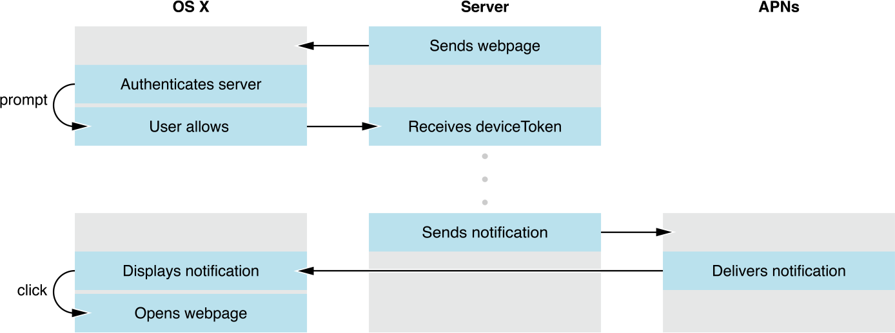
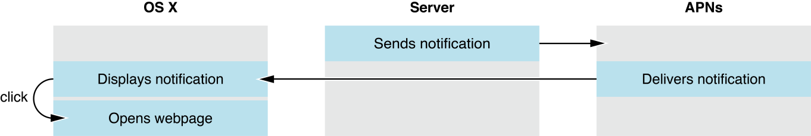

> 导航：[总目录](../../../README.md) · [documentation](../../../_indexes/documentation.md) · [Notification Programming Guide for Websites](About%20Notifications%20for%20Websites.md)


[Next](Configuring%20Local%20Notifications.md)[Previous](Understanding%20the%20User%20Experience.md)

# Configuring Safari Push Notifications

In OS X v10.9 and later, you can dispatch Safari Push Notifications from your web server directly to OS X users by using the Apple Push Notification service (APNs). Not to be confused with local notifications, push notifications can reach your users regardless of whether your website or Safari is open.



To integrate push notifications in your website, you first present an interface that allows the user to opt in to receive notifications. If the user consents, Safari contacts your website requesting its credentials in the form of a file called a _push package_. The push package also contains notification assets used throughout OS X and data used to communicate to a web service you configure. If the push package is valid, you receive a unique identifier for the user on the device known as a _device token_. The user receives the notification when you send the combination of this device token and your message, or _payload_, to APNs.

Upon receiving the notification, the user can click on it to open a webpage of your choosing in Safari.

You are required to register in the [Certificates, Identifiers & Profiles](https://developer.apple.com/account/ios/certificate) section of your developer account to send push notifications. Registration requires an [Apple developer license](https://developer.apple.com/programs). For more details on registering with Apple, see [Developer Account Help](https://help.apple.com/developer-account/).

When registering, include the following information:

- __Identifier__. This is your unique reverse-domain string, such as `web.com.example.domain` (the string must start with `web.`). This is also known as the Website Push ID.
- __Website Push ID Description__. This is the name used throughout the Provisioning Portal to refer to your website. Use it for your own benefit to label your Website Push IDs into a more human-readable format.

The registration process looks like the form in Figure 2-1.

__Figure 2-1__  Register as a push provider with Apple

!

After you have successfully entered this information, the certificate you use to sign your credentials and to push notifications becomes available to download.

To protect OS X users, Apple reserves the right to revoke your certificate if you abuse the push notification service or fail to adhere to Apple’s [guidelines](https://developer.apple.com/app-store/review/guidelines/#push-notifications). Certificate revocation results in the inability to issue new push notifications.

If your push certificate has been compromised, you can manually revoke it from Apple’s servers in the [Certificates, Identifiers & Profiles](https://developer.apple.com/account/ios/certificate) section of your developer account, located at [https://developer.apple.com/account](https://developer.apple.com/account).

When a user is asked for permission to receive push notifications, Safari asks your web server for a package. The package contains data that is used by the notification UI, such as your website name and icon, as well as a cryptographic signature. The signature verifies that your notification hasn’t been intercepted by a man-in-the-middle attack and that it is indeed coming from a trusted source: you.

You create the push package by first populating a folder with a specific set of files. The push package contains a website JSON dictionary, a set of icons (referred to as an _iconset_), a manifest, and a signature. Listing 2-1 exemplifies the complete push package file structure.

__Listing 2-1__  File structure of a push package

```
BayAirlines.pushpackage/
    icon.iconset/
        icon_16x16.png
        icon_16x16@2x.png
        icon_32x32.png
        icon_32x32@2x.png
        icon_128x128.png
        icon_128x128@2x.png
    manifest.json
    signature
    website.json
```

After the required files are in place, compress the folder into a ZIP archive to create the finalized push package. The push package is a static file that should live on your server. Return the push package from your web server in the location you specify in [Downloading Your Website Package](#apple-f4xwc4dqnrsv64tfmyxwi33df52wszbpkridimbqgeztemrvfvbuqmznknltena).

The website JSON dictionary named `website.json` contains metadata used by Safari and Notification Center to present UI to the user and to communicate with your web service.

The keys of the website JSON dictionary shown in Listing 2-2 are described in [Table 2-1](#apple-f4xwc4dqnrsv64tfmyxwi33df52wszbpkridimbqgeztemrvfvbuqmznknltcoa).

__Listing 2-2__  A sample valid website.json file

```json
{
    "websiteName": "Bay Airlines",
    "websitePushID": "web.com.example.domain",
    "allowedDomains": ["http://domain.example.com"],
    "urlFormatString": "http://domain.example.com/%@/?flight=%@",
    "authenticationToken": "19f8d7a6e9fb8a7f6d9330dabe",
    "webServiceURL": "https://example.com/push"
}
```


__Table 2-1__  Allowed keys in the website.json file

| Key | Description |
| `websiteName` | The website name. This is the heading used in Notification Center. |
| `websitePushID` | The Website Push ID, as specified in your developer account. |
| `allowedDomains` | An array of websites that are allowed to request permission from the user. |
| `urlFormatString` | The URL to go to when the notification is clicked. Use `%@` as a placeholder for arguments you fill in when delivering your notification. This URL must use the `http` or `https` scheme; otherwise, it is invalid. |
| `authenticationToken` | A string that helps you identify the user. It is included in later requests to your web service. This string must 16 characters or greater. |
| `webServiceURL` | The location used to make requests to your web service. The trailing slash should be omitted. |

The iconset is a directory called `icon.iconset` that contains PNG images in varying sizes. The images in your iconset populate the icons displayed to the user in the permission prompt, Notification Center, and the notification itself. Because your icon is static, it is unnecessary to include it in every push notification. Instead, your icons are downloaded once from your server and stored on the user’s computer. Icons in the icon set are named with the convention shown in [Listing 2-1](#apple-f4xwc4dqnrsv64tfmyxwi33df52wszbpkridimbqgeztemrvfvbuqmznknlts) with the dimensions each name implies.

The manifest is a JSON dictionary named `manifest.json` that contains an entry for each file, where the local file path is the entry’s key, and a dictionary object is the entry’s value. This dictionary contains the `hashType` and `hashValue`, which is the file’s SHA512 checksum; for example:

```
{
    "website.json": {
        "hashType": "sha512",
        "hashValue": "4309a0cf6ee37909423fb4f5f762eb530d4a7cfe9e1d30b9c85b602afb9296a508f5df00c6f63439e4dcc4484aae4cd77d1f632678ece0ef1b62ca6c9cbdebb3"
    },
    "icon.iconset/icon_16x16.png": {
        "hashType": "sha512",
        "hashValue": "8bb462e25ca79cca241355f5ae97ffab352acf7d2a0390f6547f1d0a55ade59e01e725bea70778ad2822b1ec137a8c0547197727ae2e9fed620b0d3ddea6803b"
    },
    ...
}
```

Every file in the package must appear in the manifest, except for the manifest itself and the signature. Each key and value must be a string and a dictionary, respectively.

To manually generate a SHA512 checksum, type `shasum -a 512 <filepath>` in a Terminal prompt. The `create_manifest` function in the attached `createPushPackage.php` companion file (the link is near the top of the page) iterates through each file and generates a checksum for you.

The signature is a PKCS #7 detached signature of the manifest file. Sign the manifest file with the private key associated with your web push certificate that you obtained while registering with Apple. In PHP, you can do this with the `openssl_pkcs7_sign` function. The `create_signature` function in the attached `createPushPackage.php` companion file (the link is near the top of the page) shows how you can do this.

If the contents of your push package ever change, you’ll need to recompute your signature.

There are two important JavaScript functions to keep in mind when dealing with push notifications. The first is a lightweight function that checks the user’s permission level without talking to the server. The second contacts with the server and displays the permission dialog to the user, as shown in Figure 2-2.

__Figure 2-2__  The user controls their notification permissions

!

To check the permission level a user has set for your website, call `window.safari.pushNotification.permission()` with your Website Push ID as an argument. This synchronous call returns a permission object for the given identifier by looking in the user’s preferences. This function does not contact your server.

The permission object contains the keys as described in Table 2-2.

__Table 2-2__  The permission object structure

| Key | Description |
| `permission` | The permission level set by the user; possible values are:   - `default` — The user hasn’t yet been asked his or her permission. This also is the value if the user removes the permission for this site in Safari preferences. - `granted` — The user has allowed permission for the website to send push notifications. - `denied` — The user denied permission for the website to send push notifications. |
| `deviceToken` | The unique identifier for the user on the device. Only present if `permission` is `granted`. |

To request permission to send the user push notifications, call `window.safari.pushNotification.requestPermission()`. Requesting permission is an asynchronous call.

```
window.safari.pushNotification.requestPermission(url, websitePushID, userInfo, callback);
```

A description of each argument is as follows:

- `url`—The URL of the web service, which must start with `https`. The web server does not need to be the same domain as the website requesting permission.
- `websitePushID`—The Website Push ID, which must start with `web.`.
- `userInfo`—An object to pass to the server. Include any data in this object that helps you identify the user requesting permission.
- `callback`—A callback function, which is invoked upon completion. The callback must accept a permission object with the same structure as described in [Table 2-2](#apple-f4xwc4dqnrsv64tfmyxwi33df52wszbpkridimbqgeztemrvfvbuqmznknltgma).

__Listing 2-3__  Handling permissions for website push notifications

```
var p = document.getElementById("foo");
p.onclick = function() {
    // Ensure that the user can receive Safari Push Notifications.
    if ('safari' in window && 'pushNotification' in window.safari) {
        var permissionData = window.safari.pushNotification.permission('web.com.example.domain');
        checkRemotePermission(permissionData);
    }
};

var checkRemotePermission = function (permissionData) {
    if (permissionData.permission === 'default') {
        // This is a new web service URL and its validity is unknown.
        window.safari.pushNotification.requestPermission(
            'https://domain.example.com', // The web service URL.
            'web.com.example.domain',     // The Website Push ID.
            {}, // Data that you choose to send to your server to help you identify the user.
            checkRemotePermission         // The callback function.
        );
    }
    else if (permissionData.permission === 'denied') {
        // The user said no.
    }
    else if (permissionData.permission === 'granted') {
        // The web service URL is a valid push provider, and the user said yes.
        // permissionData.deviceToken is now available to use.
    }
};
```


When a webpage requests permission to display push notifications, an HTTP request for your credentials is sent to your web server. Similarly, when a user changes their website push notification settings in Safari or System Preferences, an HTTP request is sent to your web server. You need to configure a RESTful web service on your server to respond to these requests accordingly. The web service does not need to be hosted on the same server(s) or domain(s) that serve your webpages.

To properly implement the web service, craft your endpoints as specified in the following sections using the URL fragments listed in Table 2-3.

__Table 2-3__  A web service’s endpoint URL fragments

| Fragment | Description |
| `webServiceURL` | The URL to your web service; this is the same as the `url` parameter in `window.safari.pushNotification.requestPermission()`. Must start with `https`. |
| `version` | The version of the API. Currently, “v2”. |
| `deviceToken` | The unique identifier for the user on the device. |
| `websitePushID` | The Website Push ID. |

When a user allows permission to receive push notifications, a `POST` request is sent to the following URL:

```
webServiceURL/version/pushPackages/websitePushID
```

This `POST` request contains the following information:

- __In the HTTP body__. The same user info JSON object that is passed as the third argument of the `requestPermission()` call. Use the user info dictionary to identify the user.

When serving the push package, return `application/zip` for the `Content-type` header.

When users first grant permission, or later change their permission levels for your website, a `POST` request is sent to the following URL:

```
webServiceURL/version/devices/deviceToken/registrations/websitePushID
```

This `POST` request contains the following information:

- __In the HTTP header__. An Authorization header. Its value is the word `ApplePushNotifications` and the authentication token, separated by a single space. The authentication token is the same token that’s specified in your package’s `website.json` file. Your web service can use this token to determine which user is registering or updating their permission policy.

Respond to this request by saving the device token in a database that you can later reference when you send push notifications. Also, change the user’s settings in your database to the values indicated by the parameterized dictionary for the device.

If you have an iOS app that sends push notifications, and users log in to your app with the same credentials they use to log in to your website, set their website push notification settings to match their existing iOS push notification settings.

If a user removes permission of a website in Safari preferences, a `DELETE` request is sent to the following URL:

```
webServiceURL/version/devices/deviceToken/registrations/websitePushID
```

This `DELETE` request contains the following information:

- __In the HTTP header__. An Authorization header. Its value is the word `ApplePushNotifications` and the authentication token, separated by a single space. The authentication token is the same token that’s specified in your package’s `website.json` file. Your web service can use this authentication token to determine which user is removing their permission policy.

Use this authentication token to remove the device token from your database, as if the device had never registered to your service.

If an error occurs, a `POST` request is sent to the following URL:

```
webServiceURL/version/log
```

This `POST` request contains the following information:

- __In the HTTP body__. A JSON dictionary containing a single key, named `logs`, which holds an array of strings describing the errors that occurred.

Use this endpoint to help you debug your web service implementation. The logs contain a description of the error in a human-readable format. See [Troubleshooting](#apple-f4xwc4dqnrsv64tfmyxwi33df52wszbpkridimbqgeztemrvfvbuqmznknltcny) for a list of possible errors.

You send push notifications to clients in the same way that iOS and OS X apps push notifications to APNs. As a push notification provider, you communicate with APNs over a binary interface. This a high-speed, high-capacity interface uses a streaming TCP socket design with binary content. The binary interface is asynchronous.



The binary interface of the production environment is available through `gateway.push.apple.com`, port 2195. Do not connect to the development environment to send Safari Push Notifications. You may establish multiple parallel connections to the same gateway or to multiple gateway instances.

For each interface, use TLS (or SSL) to establish a secured communications channel. The SSL certificate required for these connections is the same one that’s provisioned when you registered your Website Push ID in your developer account. To establish a trusted provider identity, present this certificate to APNs at connection time.

A JSON dictionary like the one in Listing 2-4 produces a notification that looks like the one in Figure 2-3. The JSON object must strictly conform to [RFC 4627](http://tools.ietf.org/html/rfc4627).

__Listing 2-4__  A JSON dictionary showing a sample notification payload

```json
{
    "aps": {
        "alert": {
            "title": "Flight A998 Now Boarding",
            "body": "Boarding has begun for Flight A998.",
            "action": "View"
        },
        "url-args": ["boarding", "A998"]
    }
}
```


__Figure 2-3__  The resulting push notification

!

The outermost dictionary, which is identified by the `aps` key, should contain another dictionary named `alert`. The `alert` dictionary may contain only the keys listed in Table 2-4. Custom keys are not supported.

__Table 2-4__  Alert dictionary structure

| Key | Description |
| `title` | _Required_. The title of the notification. (“Flight A998 Now Boarding” in Figure 2-3.) |
| `body` | _Required_. The body of the notification. (“Boarding has begun for Flight A998.” in Figure 2-3.) |
| `action` | _Optional_. The label of the action button, if the user sets the notifications to appear as alerts. This label should be succinct, such as “Details” or “Read more”. If omitted, the default value is “Show”. |

The `url-args` key specifies an array of values that are paired with the placeholders inside the `urlFormatString` value of your `website.json` file. The `url-args` key must be included. The number of elements in the array must match the number of placeholders in the `urlFormatString` value and the order of the placeholders in the URL format string determines the order of the values supplied by the `url-args` array. The number of placeholders may be zero, in which case the array should be empty. However, it is common practice to always include at least one argument so that the user is directed to a web page specific to the notification received.

For a low-level breakdown of notification packets, as well as a code listing of how to send a notification over a binary interface, read Provider Communication with Apple Push Notification Service in _[Local and Remote Notification Programming Guide](https://developer.apple.com/library/archive/documentation/NetworkingInternet/Conceptual/RemoteNotificationsPG/index.html#//apple_ref/doc/uid/TP40008194)_.

If something goes wrong in downloading your push package or delivery of your push notifications, the logging endpoint on your web service as described in [Logging Errors](#apple-f4xwc4dqnrsv64tfmyxwi33df52wszbpkridimbqgeztemrvfvbuqmznknlteny) will be contacted with an error message describing the error. Table 2-5 lists the possible errors and steps you can take to fix them.

__Table 2-5__  Logging endpoint error messages

| Error message | Resolution |
| `authenticationToken` must be at least 16 characters. | The `authenticationToken` key in your `website.json` file must be 16 characters or greater. See [The Website JSON Dictionary](#apple-f4xwc4dqnrsv64tfmyxwi33df52wszbpkridimbqgeztemrvfvbuqmznknlti). |
| Downloading push notification package failed. | The push package could not be retrieved from the location specified in [Downloading Your Website Package](#apple-f4xwc4dqnrsv64tfmyxwi33df52wszbpkridimbqgeztemrvfvbuqmznknltena). |
| Extracting push notification package failed. | Make sure that your push package is zipped correctly. See [Building the Push Package](#apple-f4xwc4dqnrsv64tfmyxwi33df52wszbpkridimbqgeztemrvfvbuqmznknlto). |
| Missing file in push notification package. | Make sure that your push package contains all of the files specified in [Building the Push Package](#apple-f4xwc4dqnrsv64tfmyxwi33df52wszbpkridimbqgeztemrvfvbuqmznknlto). |
| Missing image in push notification package. | Make sure that your push package contains all of the files specified in [The Iconset](#apple-f4xwc4dqnrsv64tfmyxwi33df52wszbpkridimbqgeztemrvfvbuqmznknltk). |
| Missing key in `website.json`. | Make sure that your `website.json` file has all of the keys listed in [The Website JSON Dictionary](#apple-f4xwc4dqnrsv64tfmyxwi33df52wszbpkridimbqgeztemrvfvbuqmznknlti). |
| Serialization of JSON in `website.json` failed. | The `website.json` file in your push package is not valid JSON. See [The Website JSON Dictionary](#apple-f4xwc4dqnrsv64tfmyxwi33df52wszbpkridimbqgeztemrvfvbuqmznknlti). |
| Signature verification of push package failed. | The manifest was not signed correctly or was signed using an invalid certificate. See [The Signature](#apple-f4xwc4dqnrsv64tfmyxwi33df52wszbpkridimbqgeztemrvfvbuqmznknltcma). |
| Unable to create notification bundle for push notification package. | The extracted push package could not be saved to the user’s disk. |
| Unable to generate ICNS file for push notification package. | Your iconset may have malformed PNGs. See [The Iconset](#apple-f4xwc4dqnrsv64tfmyxwi33df52wszbpkridimbqgeztemrvfvbuqmznknltk). |
| Unable to parse `webServiceURL`. | Make sure that the value for `webServiceURL` in your `website.json` file is a valid URL. See [The Website JSON Dictionary](#apple-f4xwc4dqnrsv64tfmyxwi33df52wszbpkridimbqgeztemrvfvbuqmznknlti). |
| Unable to save push notification package. | The push package could not be saved to the user’s disk. |
| `urlFormatString` must have `http` or `https` scheme. | Make sure that the value for `urlFormatString` in your `website.json` file starts with `http` or `https`. See [The Website JSON Dictionary](#apple-f4xwc4dqnrsv64tfmyxwi33df52wszbpkridimbqgeztemrvfvbuqmznknlti). |
| Verifying hashes in `manifest.json` failed. | The SHA512 checksums specified in your `manifest.json` file do not compute to their actual values. See [The Manifest](#apple-f4xwc4dqnrsv64tfmyxwi33df52wszbpkridimbqgeztemrvfvbuqmznknltm). |
| Web Service API URL must be `https`. | Make sure that the URL at your push package endpoint starts with `https`. See [Downloading Your Website Package](#apple-f4xwc4dqnrsv64tfmyxwi33df52wszbpkridimbqgeztemrvfvbuqmznknltena). |
| `webServiceURL` must be equal to URL in call to `requestPermission`. | Cross-check that the web service URL in your JavaScript call matches the web service URL in your `website.json` file. See [Requesting Permission](#apple-f4xwc4dqnrsv64tfmyxwi33df52wszbpkridimbqgeztemrvfvbuqmznknltq). |
| `websitePushID` must be equal to identifier in call to `requestPermission`. | Cross-check that the identifier in your JavaScript call matches the identifier in your `website.json` file. See [Requesting Permission](#apple-f4xwc4dqnrsv64tfmyxwi33df52wszbpkridimbqgeztemrvfvbuqmznknltq). |
| _x_ cannot be used as a format string for URLs. | The URL created by inserting the notification payload’s `url-args` values into the placeholders specified in the push package’s `urlFormatString` is not valid, or there are a different number of values than placeholders. See [Pushing Notifications](#apple-f4xwc4dqnrsv64tfmyxwi33df52wszbpkridimbqgeztemrvfvbuqmznknltcmq). |

Also check Web Inspector for errors that might occur in your JavaScript. To learn how to use Web Inspector, read _[Safari Web Inspector Guide](../../Apple%20Applications/Safari%20Web%20Inspector%20Guide/About%20Safari%20Web%20Inspector.md#apple-f4xwc4dqnrsv64tfmyxwi33df52wszbpkridimbqga3tqnzu)_.

[Next](Configuring%20Local%20Notifications.md)[Previous](Understanding%20the%20User%20Experience.md)

