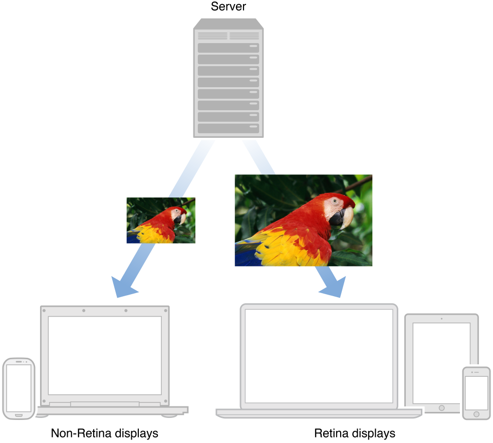

> 导航：[总目录](../../../README.md) · [documentation](../../../_indexes/documentation.md)

[Next](Serving%20Images%20Efficiently%20to%20Displays%20of%20Varying%20Pixel%20Density.md)

# About Proper Image Delivery on the Web

You may have noticed that images on your website aren’t as sharp as other elements when viewed on a Retina display. The text on your site might look crisp, but the images aren’t as sharp as you would like them to be. Since a Retina display contains four times the amount of pixels compared to a non-Retina display, Safari automatically enlarges the width and height of all HTML elements by a factor of two. Text and form elements maintain high definition, but images look subpar because they lack sufficient image data.

To banish blurry images on a Retina display, you need to supply a high-resolution version of each image on your website. Safari is able to determine the pixel density of the user’s screen and selects the most suitable version of the image for the user to download. The benefit for users is that your website looks great regardless of whether it is viewed in Safari on their Mac or on their iOS device, but most importantly it prevents wasted bandwidth because Safari chooses the appropriate image size to load based on the display, as illustrated in Figure I-1. The concept is the same as supplying high-resolution assets in a Cocoa app: devices with Retina displays load high-resolution images, while devices with standard displays load standard-resolution images.

__Figure I-1__  A server delivering the correct resolution image based on display pixel density

Because high-resolution images are of a larger filesize, a concern you should address is the amount of resources a user must download to finish loading each webpage. Your visitors may be accessing your web content on a 3G connection, where speed is limited. You should attempt to reduce the amount of HTTP requests, because the fewer you make, the shorter your visitors wait for content to finish loading. Tricks like replacing raster images with vector formats and combining multiple image resources into one will eliminate the need for unnecessary HTTP connections bogging down your server.

By following these practices, your web content will look sharp and crisp on all devices and computers, and you will reduce the overall latency of your website.

Your goal as a web developer is to configure your website to deliver content in the most efficient manner possible. Delivering high-resolution images is not exempt from this goal. By minimizing the number of images transferred over the network, and serving only the images necessary to build each page, you will be able to fully support Retina displays without sacrificing website robustness.

### Optimize Image Delivery for Retina Displays

Text and HTML forms are already optimized for Retina displays. However, it is up to you to supply high-resolution versions of all your images, otherwise they’ll look blurry on Retina displays.

### Consider Vector Alternatives for Your Raster Images

Reconsider if the image files on your website need to indeed be image files. Solutions such as CSS, SVG, and icon fonts can be used to replace the need for image files, while maintaining clarity on all resolutions at all levels of zoom. Your site will benefit from having less HTTP connections and less bytes to transfer.

### Speed Up Pageloads with Sprite Sheets

A good practice many web developers follow is to concatenate scripts and style sheets. Likewise, you should concatenate images where appropriate. When you combine images, there are fewer files to download, which makes your website load faster.

This document assumes the reader has an understanding of HTML and CSS.

_[Safari HTML5 Canvas Guide](../../Audio%20Video/Safari%20HTML5%20Canvas%20Guide/About%20Canvas.md#apple-f4xwc4dqnrsv64tfmyxwi33df52wszbpkridimbqgeydknbs)_ provides details regarding how to make HTML5 canvases compatible with Retina displays.

_[Safari Web Content Guide](../../Apple%20Applications/Safari%20Web%20Content%20Guide/Developing%20Web%20Content%20for%20Safari.md#apple-f4xwc4dqnrsv64tfmyxwi33df52wszbpkridimbqgazdanjr)_ discusses web development specific to iOS devices.

_[Safari CSS Visual Effects Guide](../../Internet%20Web/Safari%20CSS%20Visual%20Effects%20Guide/Introduction.md#apple-f4xwc4dqnrsv64tfmyxwi33df52wszbpkridimbqga4damzs)_ showcases examples of visual effects achieved with CSS.

_[Safari CSS Reference](../../Apple%20Applications/Safari%20CSS%20Reference/Introduction%20to%20Safari%20CSS%20Reference.md#apple-f4xwc4dqnrsv64tfmyxwi33df52wszbpkridimbqgazdanjq)_ lists CSS properties and values available to Safari.

[High Resolution Guidelines for OS X](https://developer.apple.com/library/mac/documentation/GraphicsAnimation/Conceptual/HighResolutionOSX/Introduction/Introduction.html) explains how to draw to Retina displays in OS X apps.

[Next](Serving%20Images%20Efficiently%20to%20Displays%20of%20Varying%20Pixel%20Density.md)

