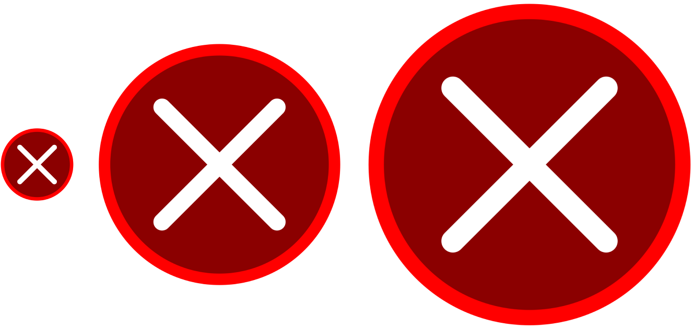
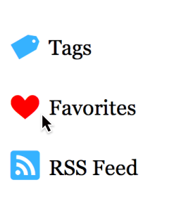

> 导航：[总目录](../../../README.md) · [documentation](../../../_indexes/documentation.md) · [Safari Image Delivery Best Practices](About%20Proper%20Image%20Delivery%20on%20the%20Web.md)


[Next](Reducing%20HTTP%20Requests%20with%20Sprite%20Sheets.md)[Previous](Serving%20Images%20Efficiently%20to%20Displays%20of%20Varying%20Pixel%20Density.md)

# Substituting Raster Images for Vector Alternatives

Before you make high-resolution versions of all your images, you should consider refactoring them into vector formats. Vector-based images contain mathematical instructions instead of raster-based RGBA pixel values, so they can scale to any resolution without losing quality. There are many benefits of implementing a vector-based image solution:

- You can modify the appearance without needing an image editor.
- You can animate properties of the image, such as its color, or change properties based on a CSS pseudo-state or JavaScript event.
- Using pure CSS, you can avoid sending extra HTTP requests.
- Vector-based images are always crisp, even when the user zooms in.

Consider the following methods of refactoring your images.

You can achieve complex visual effects such as gradients, drop shadows, borders with rounded corners, blurs, opacity, and so on by using only CSS, as shown in Figure 2-1. Not only does CSS look great on all displays, but it reduces the amount of unnecessary HTTP connections to your server, and decreases the number of resources users download. You can also animate CSS properties and set them to react to user interactions like mouseovers.

Familiarize yourself with CSS to determine if any image resource can be replaced with CSS.

__Figure 2-1__  A visually complex Delete button composed of only CSS


The CSS rule for the Delete button in Figure 2-1 is shown in Listing 2-1.

__Listing 2-1__  CSS properties that generate a detailed button without images

```
.deleteButton {
    background: -webkit-linear-gradient(top, #be6868 0%,  #941b17 50%,
                                             #880d07 50%, #be483c 100%);
    border: 3px solid #000;
    color: #fff;
    cursor: pointer;
    font-size: 15pt;
    padding: 10px 34px;
    text-shadow: 0 -1px 0 #000; /* recessed text */
    -webkit-border-radius: 13px; /* rounded corners */
    -webkit-box-shadow: 0 1px 0 #454545; /* subtle border bevel */
}
```


CSS can produce stunning visual effects, but the amount of CSS rules and HTML elements needed to create advanced visuals can quickly balloon in size, resulting in difficult upkeep and code bloat. Unlike CSS, SVG allows you to specify drawing instructions for your images, and is great for illustrations and icons. You can draw lines, curves, and shapes in different colors, as shown in Figure 2-2. SVG code can be self-contained in a file, so all of your drawing instructions are in one place, or inline with the rest of your HTML.

__Figure 2-2__  Scalable Vector Graphics are crisp at any size



Listing 2-2 shows the SVG code used to draw the circle-X, depicted in Figure 2-2. As you can see, SVG enables you to scale the image to the needs of your site.

__Listing 2-2__  A red circle-X in SVG

```
<!DOCTYPE svg PUBLIC "-//W3C//DTD SVG 1.0//EN" "http://www.w3.org/TR/SVG/DTD/svg10.dtd">
<svg viewBox="0 0 100 100" width="100%" height="100%" xmlns="http://www.w3.org/2000/svg" xmlns:xlink="http://www.w3.org/1999/xlink">
    <circle fill="darkred" stroke="red" cx="50" cy="50" r="40" stroke-width="4" />
    <g stroke="white" fill="none">
        <line x1="30" y1="30" x2="70" y2="70" stroke-width="6" stroke-linecap="round" />
        <line x1="30" y1="70" x2="70" y2="30" stroke-width="6" stroke-linecap="round" />
    </g>
</svg>
```

You can paste the code in Listing 2-2 into a file with the `.svg` extension, and reference the file in the `src` attribute of an `` element. Or, to reduce HTTP connections, you can paste the `<svg>` tag directly into your HTML. To change the scale of the graphic, edit the `width` and `height` attributes’ values of the `` or `<svg>`.

For more information about SVG, consult the W3C’s [SVG specification](http://www.w3.org/TR/SVG/).

If you use an image to display text, you should reevaluate the need of using an image resource. Text should not be represented by images, because search engine crawlers and screen readers may lose semantic context of your pages. Using image resources for text is less flexible and more difficult to upkeep, as it is more difficult to change than raw text. Above all, the bytes required to transfer an image is vastly greater than the bytes required to transfer text.

You may have decided to use an image instead of raw text because you wanted the text to appear in a certain font. A better solution would be to use the CSS `@font-face` construct, which allows you to load and display a font on on your website, regardless if the user has the font installed.

To attach a font, reference it at the __beginning__ of your CSS file:

```
@font-face {
    font-family: 'FontName';
    src: url(path/to/font.woff);
}
```

You must declare the your fonts at the beginning of your CSS file so they are available for properties to use, as CSS evaluates from top-to-bottom. If you’d like to include multiple fonts, declare one `@font-face` block per font. Then you can reference the font throughout your CSS like you do with regular web fonts:

```
p {
    font-family: 'FontName', 'Helvetica', sans-serif;
}
```

You should still identify fallback fonts, just in case there is a network error when loading your custom font.

Icon fonts are fonts with special icons or symbols in the place of standard alphanumeric characters. Using icon fonts like [Heydings](http://www.heydonworks.com/article/a-free-icon-web-font) eliminates the need for image resources. You can create your own icon fonts, or search on the web for existing ones. Some fonts are paid, while some are free. Some follow a theme, such as icons representing social media, including Facebook and Twitter.

Load a font with the `@font-face` construct, and you have a scalable, styleable set of icons that Safari treats as text, as shown in Figure 2-3 and Listing 2-3.

__Figure 2-3__  An icon font changing color on mouseover



__Listing 2-3__  CSS properties that insert an icon font before text

```
@font-face {
    font-family: 'Heydings';
    src: url(fonts/heydings_icons.ttf);
}
.icon-font {
    font-family: 'Georgia', serif;
    font-size: 15pt;
}
.icon-font:before {
    color: #36b2ff;
    content: attr(data-icon); /* pulls value from the data-icon HTML attribute */
    font-family: 'Heydings';
    font-size: 24pt;
    padding-right: 6px;
    position: relative;
    top: 4px;
}
.icon-font:hover:before {
    color: #f00;
}
```

By using the `:before` pseudo-class, CSS tells Safari to place the icon before the text starts. You could similarly omit the text contained within the HTML elements to display an icon by itself.

To select an icon to use, set its corresponding character to the value in the `data-icon` attribute:

```
<p class="icon-font" data-icon="t">Tags</p>
<p class="icon-font" data-icon="h">Favorites</p>
<p class="icon-font" data-icon="R">RSS Feed</p>
```

The value for the `data-icon` attribute refers to the desired glyph in the font. In this case, the tag, heart, and RSS icons, shown in Figure 2-3, are represented by the `t`, `h`, and `R` characters of the font, respectively. You can discover which icon maps to which character in Font Book.

For extra optimization, run your font through a font builder like [IcoMoon's HTML5 App](http://keyamoon.com/icomoon/app/). Font builders can reduce the filesize of a font by outputting a subset of only the glyphs that you need, and can combine glyphs from separate fonts into one font.

[Next](Reducing%20HTTP%20Requests%20with%20Sprite%20Sheets.md)[Previous](Serving%20Images%20Efficiently%20to%20Displays%20of%20Varying%20Pixel%20Density.md)

