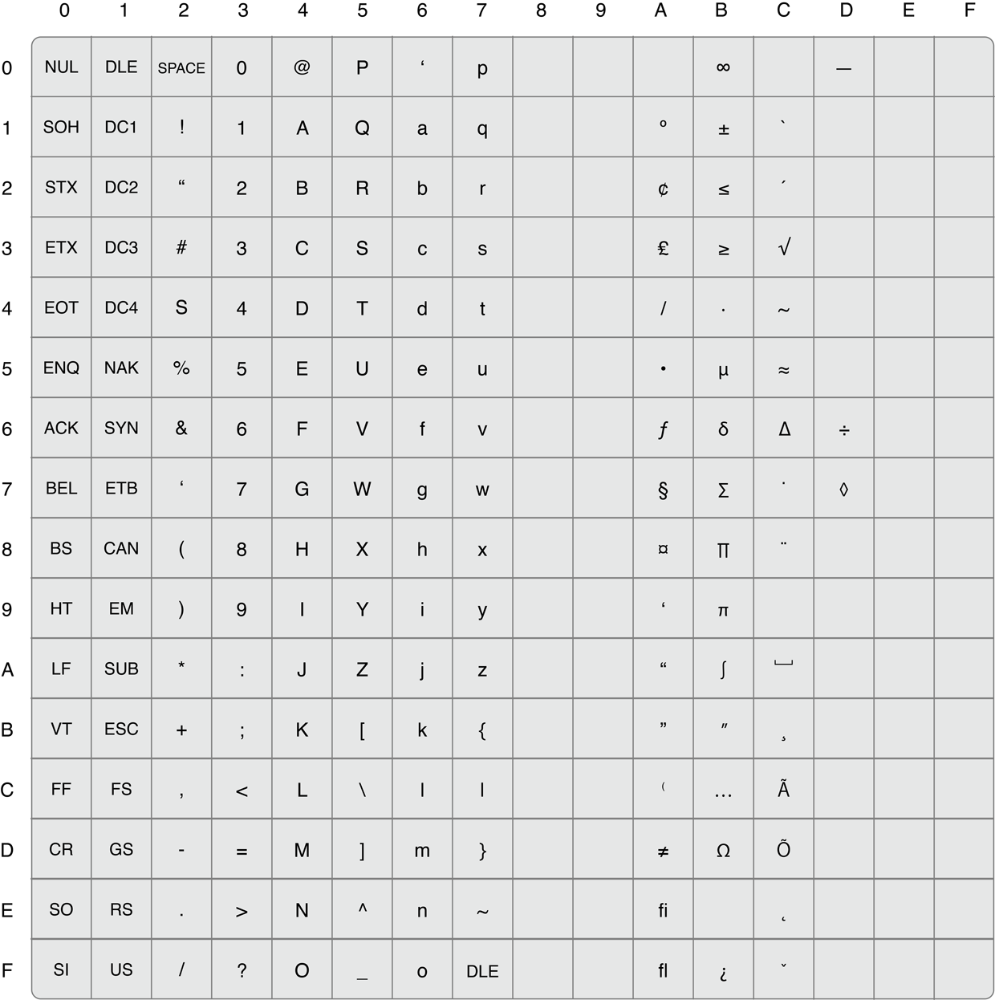

> 导航：[总目录](../../../README.md) · [documentation](../../../_indexes/documentation.md) · [Apple Filing Protocol Programming Guide](Introduction.md)

[Next](AFP%20File%20Server%20Security.md)[Previous](Apple%20Filing%20Protocol%20Concepts.md)

# AFP Character Encoding

If the server and the sharepoint support UTF-8 names, the AFP server and client send and receive decomposed UTF-8. However, characters in the range of U2000 to U2FFF, UFE30 to UFE4F, and U2F800 to U2FA1F are not decomposed. For complex characters, Unicode 3.2-based tables are used. For additional information, see [http://developer.apple.com/technotes/tn/tn1150.html#UnicodeSubtleties](https://developer.apple.com/technotes/tn/tn1150.html#UnicodeSubtleties) and the Unicode specifications.

For Macintosh Roman, AFP utilizes character string entity names that can be composed of any 8-bit character. Character representations are exactly the same as those used by the Mac OS and are shown in [Figure 2-1](#apple-f4xwc4dqnrsv64tfmyxwi33df52wszbpkridimbqgaydqnjufvbuqmrshewtkobwg43q).

__Figure 2-1__  AFP character set mapping

Throughout AFP, character string comparison is done in a case-insensitive manner (that is, K = k) except when a case-sensitive volume is mounted. String comparison must also be done in a diacritical-sensitive manner (for example, e is not equal to é).

Technical Note TN1150: _[HFS Plus Volume Format](https://developer.apple.com/library/archive/technotes/tn/tn1150.html#//apple_ref/doc/uid/DTS10002989)_ describes the rules for uppercase equivalence of characters in AFP. Note that this mapping does not exactly conform to the standards used in all human languages. In certain languages (French, for example), the uppercase equivalent of é is E; in other languages (and in AFP), the uppercase equivalent of é is É.

[Next](AFP%20File%20Server%20Security.md)[Previous](Apple%20Filing%20Protocol%20Concepts.md)

