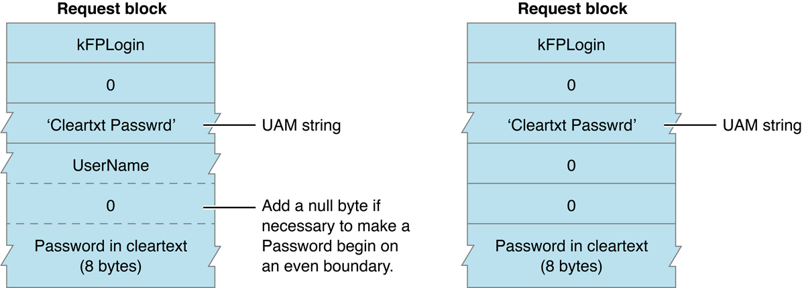
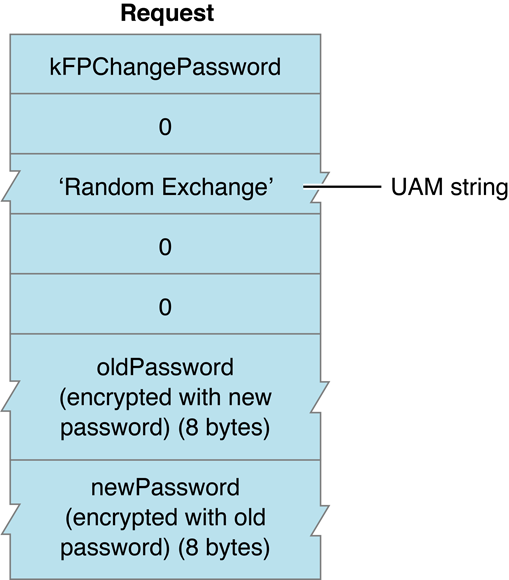
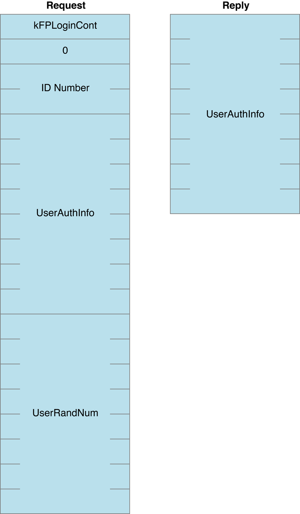
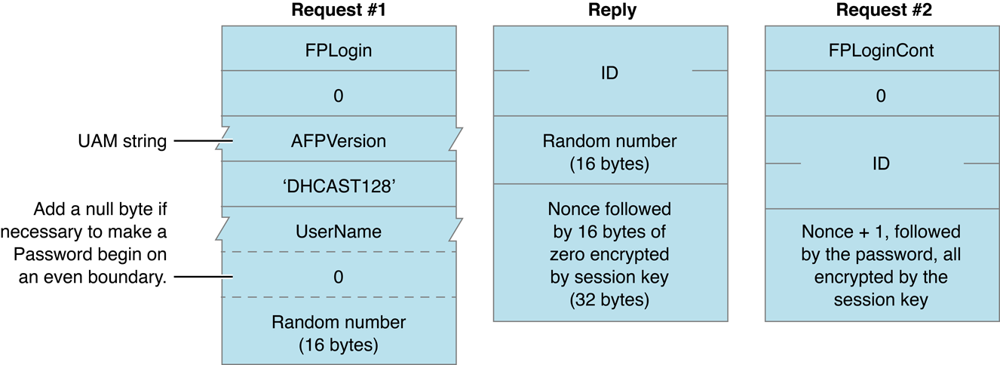
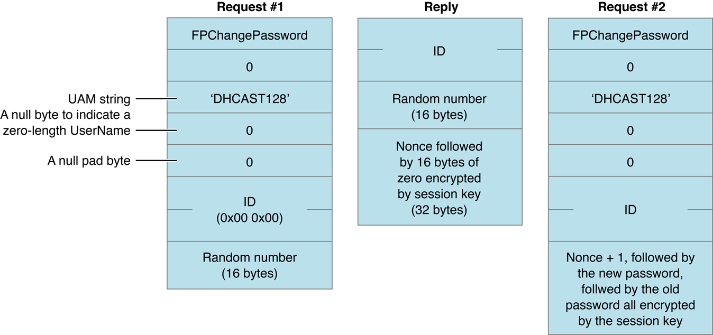
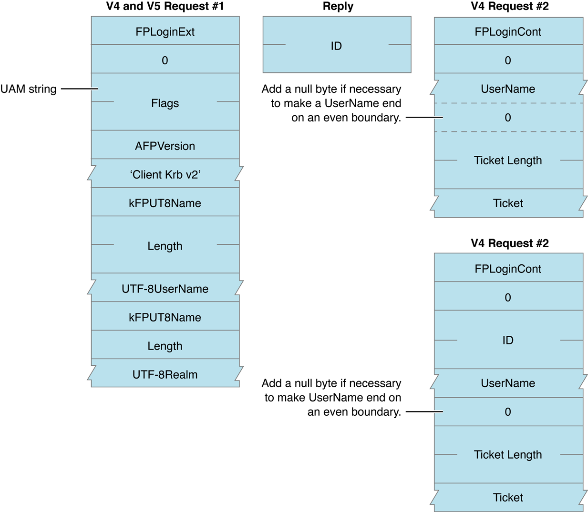

> 导航：[总目录](../../../README.md) · [documentation](../../../_indexes/documentation.md) · [Apple Filing Protocol Programming Guide](Introduction.md)


[Next](File%20Sharing%20Modes.md)[Previous](AFP%20Character%20Encoding.md)

# AFP File Server Security

Information stored in a shared resource needs protection from unauthorized users. The role of file server security is to provide varying amounts and kinds of protection, depending on what users feel is necessary.

AFP provides security in three ways:

- user authentication when the user logs in to the server
- an optional volume-level password when the user first attempts to gain access to a volume
- directory access controls

AFP provides the capability for servers and AFP clients to use a variety of methods to authenticate users when they log in. Five user authentication methods are defined: no user authentication, cleartext password, random number exchange, two-way random number exchange, and Diffie-Hellman Key Exchange. Some UAMs are also used to change a password after the user logs in.

The AFP client indicates its choice of UAM by giving the server a UAM string. These strings are intended to be case-insensitive and diacritical-sensitive.

Some UAMs require additional user authentication information to be passed to the server in the `FPLogin` or `FPLoginExt` command. The following sections describe the UAMs and the kinds of information they require.

The No User Authentication UAM requires no authentication information. When the `FPLogin` and `FPLoginExt` commands use the No User Authentication UAM, there is no _UserAuthInfo_ parameter. The corresponding case-insensitive UAM protocol name for the No User Authentication UAM is `No User Authent`. The No User Authentication UAM is used when a user logs on as the Guest user.

In order to implement the directory access controls described later in this section, the server must assign a User ID and a Group ID to the user for the session.

User ID numbers and Group ID numbers are assigned from the same pool of numbers. In addition, starting with AFP 2.1, AFP servers must assign zero to users who log in as the Guest user and 1 to the Administrator/Owner.

In this UAM, the server assigns to the user “Everyone” access privileges for every directory in every server volume. “Everyone” access privileges are described in the section [Directory Access Controls](#apple-f4xwc4dqnrsv64tfmyxwi33df52wszbpkridimbqgaydqnjufvbuqmrtgiwtknrsge4q).

The Cleartext Password UAM transmits the user name and password to the server as cleartext (that is, not encoded). The protocol name for the Cleartext Password UAM is `Cleartxt Passwrd`.

For the `FPLogin` command, the `UserAuthInfo` parameter consists of a user name (which is a string of up to 255 Macintosh Roman characters) followed by the user’s password (up to 8 bytes). For the `FPLoginExt` command, the `UserAuthInfo` parameter consists of a user name (which is a string of up to 255 Unicode characters) followed by the user’s password (up to 8 bytes). To ensure that the user’s password is aligned on an even byte boundary in the packet, the AFP client may have to insert a null byte (0x00) between the user name and the password. If the user provides a password that is shorter than 8 bytes, it must be padded at the end with null bytes to make the password eight bytes long. The permissible set of characters in passwords consists of all 8-bit ASCII characters.

User name comparison is case-insensitive, but password comparison is case-sensitive for this UAM. If there is a user of the specified name whose password matches the password supplied by the caller of `FPLogin` or `FPLoginExt`, the user has been authenticated and the login succeeds. If the passwords do not match, a `kFPUserNotAuth` result code is returned.

The Cleartext Password UAM should be used by AFP clients only if the intervening network is secure against eavesdropping. Otherwise, the password information can be read from `FPLogin` or `FPLoginExt` command packets by anyone listening on the network.

[Figure 3-1](#apple-f4xwc4dqnrsv64tfmyxwi33df52wszbpkridimbqgaydqnjufvbuqmrtgiwtknbxg44a) shows the request block for calling `FPChangePassword` when using the Cleartext Password UAM.

__Figure 3-1__  Request block when using the Cleartext Password UAM



In environments in which the network is not secure against eavesdropping, Random Number Exchange is a more secure user authentication method. The protocol name for this UAM is `Randnum Exchange`. With Random Number Exchange, the user’s password is never sent over the network and cannot be picked up by eavesdropping. Deriving the password from information sent over the network is as difficult as breaking a DES-encrypted password.

With the Random Number Exchange UAM, only the user name is sent in the UserAuthInfo parameter of the `FPLogin` or `FPLoginExt` command. If the user name is valid, the server generates an eight-byte random number and sends it back to the AFP client, along with an ID number and a `kFPAuthContinue` result code. The `kFPAuthContinue` result code indicates that all is well at this point, but the user has not yet been authenticated. The AFP client then encrypts the random number with the user’s password and sends the result to the server in the `UserAuthInfo` parameter of the `FPLoginCont` command along with the ID number returned earlier by the server in the reply block from the `FPLogin` or `FPLoginExt` command. The server uses the ID number to associate an earlier `FPLogin` or `FPLoginExt` command with this call to `FPLoginCont`. The server looks up the password for that user and uses it as a key to encrypt the same random number. If the two encrypted numbers match, the user has been authenticated and the login succeeds. Otherwise, the server returns a `kFPUserNotAuth` result code.

The following steps explain the Random Number Exchange UAM in greater detail:

1. The AFP client sends the `FPLogin` or `FPLoginExt` command block with the UAM string and the `UserAuthInfo` parameter containing the user name string. For `FPLogin`, the user name can be up to 255 Macintosh Roman characters long; for `FPLoginExt`, the user name can be up to 255 Unicode characters long.
2. Upon receiving this command block, the server examines its user database to determine whether the user name is valid. User name comparison is case-insensitive and diacritical-sensitive.
3. If the server does not find the user name in the user database, it sends an error code to the AFP client indicating that the user name is not valid and denies the login request. If the server finds the name in the user database, it generates an eight-byte random number and sends it to the AFP client, along with an ID number and an `kFPAuthContinue` result code. The `kFPAuthContinue` result code indicates that all is well at this point, but the user is not yet authenticated.
4. Both the AFP client and the server use the National Institute of Standards and Technology Data Encryption Standard (NIST DES) algorithm to encrypt the random number. The user’s case-sensitive password is applied as the encryption key to generate an eight-byte value. The server applies the same algorithm to the password it finds associated with the user name in its database.
5. The AFP client sends the encrypted value to the server in the `UserAuthInfo` parameter of the `FPLoginCont` command, along with the ID number it received from the server. The server uses the ID number to associate a previous `FPLogin` or `FPLoginExt` command with its corresponding `FPLoginCont` command.
6. The server compares the AFP client’s encrypted value with the encrypted value obtained using the password from its user database. If the two encrypted values match, the authentication process is complete and the login succeeds. The server returns a result code of `kFPNoErr` to the AFP client. If the two encrypted values do not match, the server returns the `kFPUserNotAuth` result code.

[Figure 3-2](#apple-f4xwc4dqnrsv64tfmyxwi33df52wszbpkridimbqgaydqnjufvbuqmrtgiwtknbzhazq) shows the request block for calling `FPChangePassword` when using the Random Number Exchange UAM.

__Figure 3-2__  Request block when using the Random Number Exchange UAM to change a password



With the Two-Way Random Number Exchange UAM, the user is authenticated to the server and the server is authenticated to the user, which guards against spoofing (that is, using a fake server to get passwords or data). This method uses the same steps as the Random Number Exchange UAM with three additional steps. The corresponding UAM string is `2-Way Randnum`.

Like the Random Number Exchange UAM, the Two-Way Random Number Exchange UAM starts when the client sends the `FPLogin` or `FPLoginExt` request to the server that includes the user’s user name. If the server finds the user name in the user name database, the server returns an ID number, an eight-byte random number, and a result code of `kFPAuthContinue`. The client then encodes the random number with the user’s password and sends the encoded number and the ID number to the server in an `FPLoginCont` request. If the encoded password matches the server’s copy of the random number encoded by the server’s copy of the password, the client is authenticated and `kFPNoErr` is returned.

The additional steps of the Two-Way Random Number Exchange are

1. The client sends to the server an `FPLoginCont` request that includes a second eight-byte random number.
2. The server encodes the second eight-byte random number with it’s copy of the user’s password from the user database and returns the encoded random number in the `FPLoginCont` reply block.
3. The client encodes the random number with the user’s password and compares it with the encoded random number from the server. If they match, the server is also authenticated.

[Figure 3-3](#apple-f4xwc4dqnrsv64tfmyxwi33df52wszbpkridimbqgaydqnjufvbuqmrtgiwtknjqha4a) shows the request and reply block formats for the `FPLoginCont` command when the Two-Way Random Number Exchange UAM is used.

__Figure 3-3__  Request and reply blocks for Two-Way Random Number Exchange



The Two-Way Random Number Exchange UAM is not available for use with the `FPChangePassword` command. Instead, the Random Number Exchange UAM should be used to change a password. A user who has already logged in using the Two-Way Random Number Exchange UAM and who is changing his or her password has already authenticated the server, so there is no need to authenticate the server again by using the Two-Way Random Number Exchange UAM.

Diffie-Hellman Key Exchange (DHX) is an implementation of the Diffie-Hellman Key Agreement Protocol using the SSLeay/OpenSSL implementation of CAST 128 in CBC mode. The UAM protocol name for DHX is `‘DHCAST128’`.

DHX is strong against packet sniffing attacks but vulnerable to active attacks such “Man in the Middle.” There is no way for the client to verify that the server knows the password, so the server could easily be spoofed. There is some weakness in using fixed initialization vectors, p and g. DHX is useful when the server requires passwords in cleartext.

With DHX, the client and the server each generate a random number, Ra and Rb respectively, which serve as “private keys” for the session. The client and server use modulus exponentiation to derive “public keys”, Ma and Mb, from the private keys and exchange them. The client combines Ra and Mb, and the server combines Ma with Rb to generate identical session keys, K.

After the key exchange is complete, a key verification phase follows. Each side generates a random number (nonce), encrypts it with the session key, and sends it to the other side. Each side takes the other’s verifier, decrypts to get the nonce, modifies the nonce in a way that is known to both parties, encrypts it with the session key, and sends it back. The originator verifies that the nonce was modified as expected. Incrementing the nonce is a simple and effective way of modifying the verifier.

Table 3-1 lists the values used to calculate the content of messages exchanged between the client and server when the UAM is DHX.

__Table 3-1__  Variables and notation used by the DHX UAM

| Value | Meaning |
| password | User password padded with nulls to 64 bytes. |
| username | Pascal string (pstring), padded to an even byte length. |
| ServerSig | Obtained from the server by sending `FPGetSrvrInfo` command.Due to a problem in the initial implementation, the ServerSig must be set to 16 bytes of 0x00 in message #2. |
| AFP Vers | Pascal string (pstring) denoting the version of the AFP protocol used for the session. |
| ID | A two-byte number used by the server to keep track of the login/change password request. The server may send any two-byte number, the client passes it back unchanged. |
| x^y | Raise x to the yth power. |
| nonce | A random number. |
| nonce + 1 | Add one to the nonce. |
| Ra | 32 byte (256 bits) random number used internally by the client. |
| Rb | 32-byte (256 bit) random number used internally by the server. |
| p | 16 byte (128 bit) prime number satisfying the property that (p - 1)/2 is also prime (called a Sophie Germain prime). |
| g | A small number that is primitive mod p. |
| Ma | g^Ra mod p (sent by the client to the server in the first message); 16 bytes. |
| Mb | g^Rb mod p (sent by the server to the client in the second message); 16 bytes. |
| K | Key = Mb^Ra mod p = Ma^Rb mod p. |
| (dataBytes, IV)K | Encrypt dataBytes using CAST 128 CBC using initialization vector (IV). |
| C2SIV | Client-to-server initialization vector. |
| S2CIV | Server-to-client initialization vector. |

For DHX, the constants p and g are defined as follows (MSB first):

```
UInt8 p = { 0xBA, 0x28, 0x73, 0xDF, 0xB0, 0x60, 0x57, 0xD4, 0x3F,  0x20, 0x24, 0x74,  0x4C, 0xEE, 0xE7, 0x5B  };
UInt8 g = { 0x07 };
```

For DHX, the client-to-server (C2SIV) and server-to-client S2CIV) initialization vectors are defined as follows:

```
UInt8 C2SIV[] = { 0x4c, 0x57, 0x61, 0x6c, 0x6c, 0x61, 0x63, 0x65  };
Uint8 S2CIV[] = { 0x43, 0x4a, 0x61, 0x6c, 0x62, 0x65, 0x72, 0x74  };
```


The login sequence when using the DHX UAM consists of an exchange of the four messages shown in Table 3-2. In Table 3-2, the pipe symbol (|) is used to separate the elements that make up the message.

__Table 3-2__  Login sequence using DHX

| Message | Sender/Receiver | Content |
| 1 | Client to server | | `FPLogin` (2 bytes) | AFP Vers | `‘DHCAST128’` | username (padded) | Ma | |
| 2 | Server to client | | ID | Mb | (nonce, ServerSig, S2CIV)K | and a result code |
| 3 | Client to server | | `FPLoginCont` (2 bytes) | ID | (nonce + 1, password, C2SIV)K | |
| 4 | Server to client | A result code of `kFPNoErr` if authentication was successful |

In response to Message 1, the server may return the following result codes (but it may delay sending some of these result codes until Message 4):

- `kFPBadUAM` — the server doesn’t support the DHX UAM.
- `kFPBadVersNum` — the server doesn't support the requested AFP version.
- `kFPParamErr` — the user name is not valid.
- `kFPMiscErr` — the session is already authenticated.
- `kFPServerGoingDown` — the server is shutting down.
- `kFPUserAlreadyLoggedOnErr` — the server allows only one active session per user.
- `kFPAuthContinue` — the server is prepared to continue to login process.

The server may delay sending some of the above result codes until the fourth message or may report a `kFPUserNotAuth` result as `kFPParamErr`  to limit the amount of information disclosed to the client.

In response to Message 3, the server may return any of the following result codes:

- `kFPNoErr` — authentication was successful; the server decrypted the nonce/password and verified that the nonce was incremented properly and the password sent by the client matches the password on the server.
- `kFPUserNotAuth` — the password is incorrect.
- `kFPParamErr` — authentication failed and the server prefers not to indicate whether the user name or the password is invalid.
- `kFPPwdExpiredErr` — the user’s password has expired.
- `kFPPwdNeedsChangeErr` — the user’s password needs to be changed.

[Figure 3-4](#apple-f4xwc4dqnrsv64tfmyxwi33df52wszbpkridimbqgaydqnjufvbuqmrtgiwtqmzqge4a) shows the request and reply blocks for `FPLogin` when using the DHX UAM.

__Figure 3-4__  Request and reply blocks when using DHX with `FPLogin`



There is no equivalent to `FPLoginCont` when changing a password, so the client has to send the `FPChangePassword` command at least twice and use the ID to keep track of the state of the password-changing process. The ID first appears in Message 1 and is set to 2 bytes of 0x00. The server sends a non-zero value for ID in Message 2, and the client must copy it from Message 2 into Message 3. The key used to encrypt the old and new passwords is created in the same way as the key when logging in. The values of p and g are the same values that are used when logging in.

When using the DHX UAM, the password changing sequence consists of an exchange of at least four messages shown in Table 3-3. In Table 3-3, the pipe symbol (|) is used to separate the elements that make up the message.

__Table 3-3__  Password-changing sequence using DHX

| Message | Sender/Receiver | Content |
| 1 | Client to server | | `FPChangePassword` (2 bytes) | `‘DHCAST128’` | Username (padded) | ID (0x00 0x00) | Ma | |
| 2 | Server to client | | ID | Mb | (nonce, ServerSig, S2CIV)K | and a result code |
| 3 | Client to server | | `FPChangePassword` (2 bytes) | `‘DHCAST128’` | Username (padded) | ID | (nonce + 1, newPassword, oldPassword, C2SIV)K | |
| 4 | Server to client | A result code of `kFPNoErr` if the password was changed |

In response to Message 1, the server may return any of the following result codes (or may wait until it receives the second `FPChangePassword` command to return the first three result codes):

- `kFPBadUAM` —the server doesn’t support DHX for changing passwords.
- `kFPParamErr` — the user name is not valid.
- `kFPServerGoingDown` — the server is shutting down.
- `kFPAuthContinue` — the server is prepared to continue the password-changing process.

In response to Message 3, the server may return any of the following result codes:

- `kFPNoErr` — the password was changed.
- `kFPUserNotAuth` — the old password is incorrect.
- `kFPParamErr` — to limit the amount of information released to the client.
- `kFPPwdPolicyErr` — the new password does not conform to the server’s password policy.
- `kFPPwdSameErr` — the new password is the same as the old password.
- `kFPPwdTooShortErr` — the new password is too short.

[Figure 3-5](#apple-f4xwc4dqnrsv64tfmyxwi33df52wszbpkridimbqgaydqnjufvbuqmrtgiwtqmzzha2a) shows the request and reply blocks for calling `FPChangePassword` with the DHX UAM.

__Figure 3-5__  Request and reply blocks when using DHX with `FPChangePassword`



Diffie-Hellman Key Exchange 2 (DHX2) is an implementation of the Diffie-Hellman Key Agreement Protocol using the SSLeay/OpenSSL implementation of CAST 128 in CBC mode. The UAM protocol name for DHX2 is `‘DHX2’`.

DHX2 differs from DHX in that DHX2 uses variable-sized prime (p) and generator (g) values, which allows servers to choose an appropriate level of security. The minimum size of the prime is increased to 512 bits to improve resistance to numerical methods of attack. In addition, unlike DHX, DHX2 does not use the server signature(ServerSig) in Message 2.

DHX2 is strong against packet sniffing attacks but vulnerable to active attacks such “Man in the Middle.” There is no way for the client to verify that the server knows the password, so the server could easily be spoofed. There is some weakness in using fixed initialization vectors, p and g, which is alleviated by putting the random nonces first in the encrypted portions of the messages. DHX2 is useful when the server requires passwords in cleartext.

As with DHX, in DHX2 the client and server each generate a random number, Ra and Rb respectively, which serve as “private keys” for the session. The client and server use modulus exponentiation to derive “public keys”, Ma and Mb, from the private keys and exchange them. The client combines Ra and Mb, and the server combines Ma with Rb to generate identical session keys, K.

After the key exchange is complete, a key verification phase follows. Each side generates a random number (nonce), encrypts it with the session key, and sends it to the other side. Each side takes the other’s verifier, decrypts to get the nonce, modifies the nonce in a way that is known to both parties, encrypts it with the session key, and sends it back. The originator verifies that the nonce was modified as expected. Incrementing the nonce is a simple and effective way of modifying the verifier.

Table 3-4 lists the values used to calculate the content of messages exchanged between the client and server when the UAM is DHX2.

__Table 3-4__  Variables used by the DHX2 UAM

| Value | Meaning |
| password | User password padded with nulls to 256 bytes. |
| username | Pascal string (pstring), padded to an even byte length. |
| AFP Vers | Pascal string (pstring) denoting the version of the AFP protocol used for the session. |
| ID | A two-byte number used by the server to keep track of the login/change password request. The server may send any two-byte number, the client passes it back unchanged. |
| ID + 1 | The ID incremented by one. |
| clientNonce | A 16-byte random number used in the key verification portion of the exchange. |
| serverNonce | A 16-byte random number used in the key verification portion of the exchange. |
| clientNonce + 1 | The clientNonce incremented by one. |
| MD5(data) | Take the MD5 hash of the data, which results in a 16-byte (128 bit) value. |
| p | A variable length prime number (at minimum 512 bits in size) satisfying the property that (p - 1)/2 is also a prime(called a Sophie Germain prime) sent by the server to the client. (Two byte length followed by data.) |
| g | A small number that is primitive mod p sent by the server to the client. (Four bytes.) |
| x^y | Raise x to the yth power. |
| Ra | An x bit random number used internally by the client. |
| Rb | An x bit random number used internally by the server. |
| Ma | g^Ra mod p (sent by the client to the server); the same number of bytes as p, padded with nulls at the MSB end. |
| Mb | g^Rb mod p (sent by the server to the client); the same number of bytes as p, padded with nulls at the MSB end. |
| x | The size of p in bits. |
| len | The size of p & Ma & Mb in bytes; a two-byte value. |
| K | Key = MD5(Mb^Ra mod p) = MD5(Ma^Rb mod p) |
| (dataBytes, IV)K | Encrypt dataBytes using CAST 128 CBC using initialization vector (IV) |
| C2SIV | Client-to-server initialization vector. |
| S2CIV | Server-to-client initialization vector. |

For DHX2, the client-to-server (C2SIV) and server-to-client (S2CIV) initialization vectors are defined as follows:

```
UInt8 C2SIV[] = { 0x4c, 0x57, 0x61, 0x6c, 0x6c, 0x61, 0x63, 0x65  };
Uint8 S2CIV[] = { 0x43, 0x4a, 0x61, 0x6c, 0x62, 0x65, 0x72, 0x74  };
```


When using the DHX2 UAM, the login sequence consists of an exchange of the six messages shown in Table 3-5. In Table 3-5, the pipe symbol (|) is used to separate the elements that make up the message.

__Table 3-5__  Login sequence using DHX2

| Message | Sender/Receiver | Content |
| 1 | Client to server | | `FPLogin` (2 bytes) | AFP Vers | `‘DHX2’` | Username (padded) | |
| 2 | Server to client | | ID | g | len | p | Mb | and a result code |
| 3 | Client to server | | `FPLoginCont` (2 bytes) | ID | Ma | (client nonce, C2SIV)K | |
| 4 | Server to client | | ID + 1 | (clientNonce + 1, serverNonce, S2CIV)K | and a result code |
| 5 | Client to server | | `FPLoginCont` (2 bytes) | ID + 1 | (serverNonce+1, password, C2SIV)K | |
| 6 | Server to client | A result code of `kFPNoErr` if authentication was successful |

Some older implementations of Apple's AFP client add ten extra bytes to the end of the `FPLoginCont` packet (message five in Table 3-5). Similarly, two extra bytes are added to the end of message two in Table 3-5. Servers should ignore the presence and contents of these bytes.

In response to Message 1, the server may return the following result codes (but it may delay sending some of these result codes until Message 6):

- `kFPBadUAM` — the server doesn’t support the DHX2 UAM.
- `kFPBadVersNum` — the server doesn't support the requested AFP version.
- `kFPParamErr` — the user name is not valid.
- `kFPMiscErr` — the session is already authenticated.
- `kFPServerGoingDown` — the server is shutting down.
- `kFPUserAlreadyLoggedOnErr` — the server allows only one active session per user.
- `kFPAuthContinue` — the server is prepared to continue to login process.

The server may delay sending some of the above result codes until the sixth message or may report a `kFPUserNotAuth` result as `kFPParamErr`  to limit the amount of information disclosed to the client.

In response to the `FPLoginCont` command, the server may return any of the following result codes:

- `kFPNoErr` — authentication was successful; the server decrypted the nonce/password and verified that the nonce was incremented properly and the password sent by the client matches the password on the server
- `kFPUserNotAuth` — the password is incorrect
- `kFPParamErr` — authentication failed and the server prefers not to indicate whether the user name or the password is invalid
- `kFPPwdExpiredErr` — the user’s password has expired
- `kFPPwdNeedsChangeErr` — the user’s password needs to be changed

There is no equivalent to `FPLoginCont` when changing a password, so the client has send the `FPChangePassword` command at least twice and use the ID to keep track of the state of the password-changing process. The ID first appears in Message 1 and is set to 2 bytes of 0x00. The server sends a non-zero value for ID in Message 2, and the client must copy it from Message 2 into Message 3 as well as from Message 4 into Message 5. The key used to encrypt the old and new passwords is created in the same way as the key when logging in. The values of p and g are the same values that are used when logging in.

When using the DHX2 UAM, the password changing sequence consists of an exchange of at least six messages shown in Table 3-6. In Table 3-6, the pipe symbol (|) is used to separate the elements that make up the message.

__Table 3-6__  Password-changing sequence using DHX2

| Message | Sender/Receiver | Content |
| 1 | Client to server | | `FPChangePassword` (2 bytes) | `‘DHX2’` | Username (padded) | ID (0x00 0x00) | |
| 2 | Server to client | | ID | g | len | p | Mb | and a result code |
| 3 | Client to server | | `FPChangePassword` (2 bytes) | `‘DHX2’` | Username (padded) | ID | Ma | (clientNonce, C2SIV)K | |
| 4 | Server to client | | ID+1 | (clientNonce+1, serverNonce, S2CIV)K | and a result code |
| 5 | Client to server | | `FPChangePassword` (2 bytes) | `‘DHX2’` | Username (padded) | ID+1 | (serverNonce+1, newPassword, oldPassword, C2SIV)K | |
| 6 | Server to client | A result code of `kFPNoErr` if the password was changed |

In response to Message 1, the server may return `kFPAuthContinue` or any of the following result codes:

- `kFPBadUAM` —the server doesn’t support DHX2 for changing passwords.
- `kFPParamErr` — the user name is not valid.
- `kFPServerGoingDown` — the server is shutting down.

In response to Message 3, the server may return `kFPAuthContinue` or any of the following result codes:

- `kFPUserNotAuth` — the old password is incorrect.
- `kFPPwdPolicyErr` — the new password does not conform to the server’s password policy.
- `kFPPwdSameErr` — the new password is the same as the old password.
- `kFPPwdTooShortErr` — the new password is too short.

The AFP client learns whether a server supports the Kerberos UAM by examining the `kSupportsDirServices` bit in the `Flags` parameter returned by the `FPGetSrvrInfo` command. If that bit is set, a server that supports Kerberos UAM places its principal name in the `DirectoryNames` parameter returned by `FPGetSrvrInfo`.

The AFP client uses the principal name to determine if the server supports Kerberos v4 or v5.

Then the client tries to get a service ticket from the server. If it cannot get a ticket, the client must use some other authentication method. If the client gets a service ticket, it can call `FPLoginExt`, providing the following values in the request block:

- two-byte `Flags` parameter
- AFP Version string
- UAM string (`Client Krb v2`)
- `kFPUTF8Name` (defined as 3)
- length of the user name that follows
- UTF-8–encoded user name
- `kFPUTF8Name` (defined as 3)
- length of the realm in that follows
- UTF-8–encoded realm

The server replies with a result code of `kFPAuthContinue`. The reply block contains a two-byte `ID` value.

If the client is using Kerberos v4, it calls `FPLoginCont,` providing the following values in the request block:

- UTF-8–encoded user name
- pad byte if one is necessary to force user name to end on an even boundary
- length of the ticket that follows
- ticket, created by `KClientGetTicketForService()`

The user is authenticated if the server returns a result code of `kFPNoErr` and a reply block consisting of a two-byte length parameter and an authenticator.

If the client is using Kerberos v5, it calls `FPLoginCont`, providing the following values in the request block:

- ID returned by `FPLoginExt`

- UTF-8–encoded user name
- pad byte if one is necessary to force user name to end on an even boundary
- length of the ticket that follows
- ticket, created by `gss_init_sec_context` with `GSS_C_MUTUAL_FLAG` and `GSS_C_REPLAY_FLAG` set and no channel bindings

The user is authenticated if the server returns a result code of `kFPNoErr` and a reply block consisting of a two-byte length parameter and an authenticator.

After the client receives the `FPLoginCont` reply packet, the client sends an `FPGetSessionToken` command with a type of `kGetKerberosSessionKey` (8) in order to get a random session key from the server. This session key is encrypted on the server using `gss_wrap()` and is decrypted on the client using `gss_unwrap()`. Note that the client may call `FPGetSessionToken` later on in order to get a disconnect token.

[Figure 3-6](#apple-f4xwc4dqnrsv64tfmyxwi33df52wszbpkridimbqgaydqnjufvbuqmrtgiwtqnzzgy3q) shows the request and reply blocks for `FPLoginExt` and `FPLoginCont` when using the Kerberos UAM.

__Figure 3-6__  Request and reply blocks when using Kerberos with `FPLoginExt`



Unlike the other UAMs described in this section, which are used to log in to an AFP server, the Reconnect UAM is used only to reconnect to a server. The Reconnect UAM can be used when the original connection was made using a UAM that provides a session key, such as DHX, DHX2, and Kerberos. The UAM protocol name for the Reconnect UAM is `‘Recon1’`.

The goals of the Reconnect UAM are:

- Store in a token returned by the `FPGetSessionToken` command all of the information required to reconnect, even if the server has been rebooted.
- Use only a secure hash function and a symmetric encryption algorithm.
- Provide mutual authentication to prove that the server to which the client is reconnecting is the same server that was originally authenticated.
- Ensure that a compromised session key or seed value will not compromise the long term server key.

Table 3-7 lists the variables used to calculate values for the Reconnect UAM.

__Table 3-7__  Variables used by the Reconnect UAM

| Value | Size in Bytes | Meaning |
| k1 | 16 | Initial session key returned by the UAM that was used to log in; known to both the client and the server at the time of reconnect. |
| ks | 16 | Long-term server key. This key contains a cryptographically pseudorandom value chosen by the server.  The long-term server key is typically stored in persistent storage on the server in such as way that it can only be read by the server itself. This allows the server to continue using the same key after a server restart.  Apple's AFP server changes this key periodically, but keeps a copy of the previous key to allow clients using older credentials to reconnect. The lifetime of a long-term server key should be much greater than the credential expiration time. |
| s | 8 | Lamports hash seed. This is a cryptographically pseudorandom value chosen by the server. |
| n | 4 | Number of times to run the hash function. |
| m | 4 | Maximum number of times to run the hash function (m >= n). |
| clientNonce | 16 | A random number selected by the client nonce. |
| serverNonce | 16 | A random number selected by the server. |
| ts | 4 | Timestamp when the client first loaded the AFP code. Used to determine whether the client machine has been rebooted. |
| t1 | 4 | Initial timestamp. |
| t2 | 4 | Timestamp used when reconnecting. |
| t3 | 4 | Time interval between the server’s clock and the client’s clock. |
| exp | 4 | Credential’s expiration time. |
| now | 4 | Current time as known by the server or by the client. |
| user/domain |  | Username information that uniquely identifies the user. |
| sessionInfo |  | An 8-byte value chosen by the server as a unique identifier for a session. For example, the Apple AFP server puts the server start time in the first four bytes and a session ID (incremented for each new session) in the remaining four bytes. |
| (data)key |  | Data encrypted using a symmetric encryption algorithm using key. (CBC mode) This uses the same CAST 128 CBC algorithm as DHX2. |
| (data)H |  | Data hashed with a secure hash function (the same 128 byte MD5 hash function used by DHX2). |
| (data)H(n) |  | Data hashed n times with a secure hash function (the same 128 byte MD5 hash function used by DHX2). |
| (data)HMAC(key) |  | Data signed by a keyed HMAC algorithm (the 128 bit MD5 HMAC algorithm; see [RFC 2104](http://www.ietf.org/rfc/rfc2104.txt)). |
| revocation list |  | List of hash value and time-to-live pairs. Pairs stay in the list until the time-to-live value has passed. |
| credSize |  | A 4-byte value containing the total size of the credential. |
| csize |  | A 4-byte value containing the total size of the credential, rounded up to be an even multiple of 8 bytes. |
| cred |  | (s, m, exp, t3, csize, user, domain)ks |

For the reconnect UAM, the client-to-server (C2SIV) and server-to-client S2CIV) initialization vectors are defined as follows:

```
UInt8 C2SIV[] = { 0x57, 0x4f, 0x4d, 0x44, 0x4d, 0x4f, 0x41, 0x42 };
Uint8 S2CIV[] = { 0x57, 0x4f, 0x4d, 0x44, 0x4d, 0x4f, 0x41, 0x42 };
```

Table 3-8 describes common methods of attack and the ways in which the Reconnect UAM is protected from these attacks.

__Table 3-8__  Attacks on the Reconnect UAM

| Attack | Defense |
| Man in the Middle | If the original UAM used to connect to the server was resistant to Man in the Middle attacks, nonce checks in message _a_, which require knowledge of _s_, should keep out the Man in the Middle. |
| Replay | The timestamp in message _a_, protected by the HMAC, and the credential revocation list should prevent simple replay attacks. Even if the attacker succeeds in controlling the clock on the server and manages to force a server restart, the attacker cannot log in because s is not known, so the challenge/response step cannot be performed successfully. |
| Reflection | This type of attack is thwarted by the use of chained nonces, by having the user information in the credential, and by having each message be non-symmetrical. |
| Interleaving | This type of attack is thwarted by the use of chained nonces. |
| Chosen Text | The server’s key is not used to encrypt any data that is obtained from the client. |
| Forced Delay | Timestamps, key expiration and the use of the revocation list should thwart this type of attack. |

After the client successfully logs in and mounts a remote volume, it calls `FPGetSessionToken`, setting the `Type` parameter to `kRecon1Login` (5), and sending to the server the current timestamp (`t1`) and its client id (`cid`) encrypted with the session key (`k1`):

```
id = (t1, cid)k1
```

The client also supplies the `IDLength` field (the length of `id`) and the `Timestamp` field (`ts`).

As a result of the login process, the server also knows the session key (`k1`) and the `sessionInfo` value for this session. The server also has a long term session key (`ks`).

The server uses `k1` to extract `t1` and `cid`. It uses `t1` to compute the clock skew (`t3`) and determine an appropriate expiration time for the credential it is about to create. The server then generates a credential by concatenating the Lamports hash seed (`s`), the maximum number of times to run the hash function (`m`), the expiration time (`exp`), the clock skew (`t3`), the user, and the domain, then encrypting the concatenated data using its long term session key (`ks`):

```
cred = (s, m, exp, t3, user, domain)ks
```

The server then uses the session key (`k1`) to encrypt a concatenation of `sessionInfo`, the Lamports hash seed (`s`), the maximum number of times to run the hash function (`m`), the expiration time (`exp`), and the credential (`cred`), and sends the result to the client. The formula for this calculation is:

```
(sessionInfo, s, m, exp, cred)k1
```

At this time, the server also searches for saved reconnect sessions that match the client ID (`cid`). If a previous session is found with a different time stamp (`ts`), the previous session is destroyed, releasing any byte range locks and closing any open files with deny modes.

The client uses the session key (`k1`) to decrypt the result, obtaining the encrypted credential (`cred`), the Lamports hash seed (`s`), the maximum number of times to run the hash function (`m`), the encrypted credential’s expiration time (`exp`), and the `sessionInfo` value. The client is responsible for storing this information so that it can use it later.

Table 3-9 summarizes the exchange between client and server when getting a credential.

__Table 3-9__  Getting a credential

| Message | Sender/Receiver | Content |
| 1 | Client to server | | `FPGetSessionToken` (2 bytes) | `kRecon1Login` | `IDLength` | `timeStamp` | `ID` | |
| 2 | Server to client | | (sessionInfo, s, m, exp, cred)k1 | |

Before the credential expires, the client calls `FPGetSessionToken` again, setting the `Type` parameter to `kRecon1RefreshToken` (7) and sending to the server the current timestamp (`t1`) and the current credential encrypted with the session key (`k1`). The formula for calculating this value is:

```
id = (t1, cred)k1
```

The client also supplies the `IDLength` field (the length of `id`) and the `Timestamp` field (the initial connection timestamp, `ts`).

Both the client and the server then compute `k2` using the following formula:

```
k2 = (cred, s)H
```

The server decrypts the value sent by the client. If the credential is valid, the server creates a new credential (`cred'`) consisting of the concatenation of the new Lamports hash seed (`s'`), the maximum number of times to run the hash function (`m'`), the expiration time (`exp'`), and the new clock skew (`t3'`) and encrypts this with the encrypted with the long term session key (`ks`) as shown in the following formula:

```
cred' = (s', m', exp', t3', user, domain)ks
```

The server returns the encrypted credential to the client along with the new Lamports hash seed, the new maximum number of times to run the hash function, and the `sessionInfo`, all encrypted by `k2`. The formula for creating this value is:

```
(sessionInfo, s', m', exp', cred')k2
```

The client uses `k2` to decrypt the reply, obtaining the new credential, the new Lamports hash seed, the new maximum number of times to run the hash function, the new expiration and the `sessionInfo`. Both the client and server discard `k2`. Before this credential expires, the client refreshes it again.

Table 3-10 summarizes the exchange between client and server when refreshing a credential.

__Table 3-10__  Refreshing a credential

| Message | Sender/Receiver | Content |
| 1 | Client to server | | `FPGetSessionToken` (2 bytes) | `kRecon1RefreshToken` | `IDLength` | `timeStamp` | `ID` | |
| 2 | Server to client | | `(sessionInfo, s', m', exp', cred')k2` | |

If the connection to the server goes down for any reason, the client has the current credential (`cred`), the Lamports hash seed (`s`), and the maximum number of times to run the hash (`m`). The server knows the long-term server key (`ks`).

1. The client logs back in using the `FPLoginExt` command, specifying `Recon1ReconnectLogin` as the UAM, and sending the following information to the server:

```
(sig, (s)H(n), n, t2, (clientNonce)k, cred)
```

   Where `sig` is

```
((s)H(n), n, t2, (clientNonce)k)HMAC(s)
```

   and `k` is

```
(s)H(n-1)
```
2. The server uses its long term session key (`ks`) to decrypt `cred`. If decryption fails, the server fails the login attempt.
3. If the decryption succeeds, the server retrieves `s`, `m`, `exp`, `t3`, `user`, and `domain` from the credential.
4. The server computes `(cred)H` and looks it up in the revocation list. If found, the credential has expired, so the server fails the login attempt.
5. If `(cred)H` is not found in the revocation list, the server checks `exp`, `m >= n`, and `HMAC(s) user/domain`. If any are invalid, the server fails the login attempt.
6. The server computes `(s)H(n)` using `s` from the decrypted credential and `n` from the client packet and compares the result with the value of `(s)H(n)` provided in the client message. If they don’t match, the server fails the login attempt.
7. The server decrypts and hashes `clientNonce`, chooses `serverNonce`, adds `(cred)H, t3+now` to the revocation list, and sends the following value to the client:

```
(serverNonce, (clientNonce)H)k
```

   where `k` is

```
(s)H(n-1)
```
8. The client decrypts the value, verifies `(clientNonce)H`, and hashes `serverNonce`. The client uses the `FPLoginCont` command to send the following value to the server:

```
((serverNonce)H)k
```

   where `k` is

```
(s)H(n-1)
```
9. The server decrypts the value and verifies `(serverNonce)H`. If they don’t match, the server fails the login attempt.
10. If they match, the server replies to the client with a result code of `kFPNoErr`. The client is now logged in.
11. Both the server and the client make the following calculation:

```
k1' = (clientNonce, serverNonce)H
```
12. The client calls `FPGetSessionToken` using `k1'` as the session key to get a new credential. It also calls `FPDisconnectOldSession` to tell the server to disconnect the old session and transfer its resources to the new session.

Table 3-11 summarizes the exchange between client and server when reconnecting.

__Table 3-11__  Reconnecting using the Recon1 UAM

| Message | Sender/Receiver | Content |
| 1 | Client to server | | `FPLoginExt` (2 bytes) | Flags | AFP version | `‘Recon1’` | `UserNameType` | `UserName` | `PathType` | `Pathname` | `sig, (s)H(n), n, t2, (client_nonce)k, cred)` |    Where  `k = (s)H(n-1)`  and  `sig = ((s)H(n), n, t2, (clientNonce)k)HMAC(s)` |
| 2 | Server to client | |`(serverNonce, (clientNonce)H)k` | and a result code |
| 3 | Client to server | | `FPLoginCont` (2 bytes) | `ID` | `((serverNonce)H)k` | |
| 4 | Server to client | `kFPNoErr` or another result code indicating login failure |
| 5 | Client to server if result is `kFPNoErr` | | `FPGetSessionToken` (2 bytes) | `kRecon1ReconnectLogin` | `IDLength` | `(t1, cred)k1'` | `ID` | |

AFP provides an optional second-level of access control through volume passwords. A server can associate a fixed-length 8-character password with each volume it makes visible to AFP clients.

The AFP client can issue an `FPGetSrvrParms` command to the server to discover the names of each volume and to get an indication of whether each of them is password-protected.

To send AFP commands that refer to a server volume, the AFP client uses a volume identifier called the Volume ID. The AFP client obtains this ID by sending an `FPOpenVol` command to the server. This command contains the name of the volume as one of its parameters. If a password is associated with the volume, the command must also include the password as another parameter.

Volume passwords constitute a simple protection for servers that do not need to implement the directory access controls described in the next section. However, volume passwords are not as secure as directory access controls.

Directory access controls provide the greatest degree of network security in AFP by access privileges to users. Once the user has logged in, access privileges allow users varying degrees of freedom for performing actions within the directory structure.

AFP defines three directory access privileges: search, read, and write:

- A user with _search_ access to a directory can list the parameters of directories contained within the directory.
- A user with _read_ access to a directory can list the parameters of files contained within the directory in addition to being able to read the contents of a file.
- A user with _write_ access to a directory can modify the contents of a directory including the parameters of files and directories contained within the directory. Write access allows the user to ad and delete directories and files as well as modify the data contained within a file.

Each directory on a server volume has an owner and a group affiliation. Initially, the owner is the user who created the directory, although ownership of a directory may be transferred to another user. Only the owner of a directory can change its access privileges. The server uses a name of up to 31 characters and a four-byte ID number to represent owners of directories. Owner name and Owner ID are synonymous with User name and User ID.

The group affiliation is used to assign a different set of access privileges for the directory to a group of users. For each group, the server maintains a name of up to 31 characters, a four-byte ID number and a list of users belonging to the group. Assigning group access privileges to a directory gives those privileges to that set of users.

Each user may belong to any number of groups or to no group. One of the user’s group affiliations may be designated as the user’s primary group. This group will be assigned initially to each new directory created by the user. The directory’s group affiliation may be removed or changed later by the owner of the directory.

The term _Everyone_ is used to indicate every user that is able to log in to the server. A directory may be assigned certain access privileges for Everyone that would be granted to a user who is neither the directory’s owner nor a member of the group with which the directory is affiliated.

With each directory, the file server stores three access privileges bytes, which correspond to the owner of the directory, its group affiliation, and Everyone. Each of these bytes is a bitmap that encodes the access privileges (search, read, and write) that correspond to each category. The most significant bits of each access privileges byte must be zero.

To perform directory access control, AFP associates the five parameters shown in Table 3-12 with each directory.

__Table 3-12__  Directory access control parameters

| Parameter | Size |
| Owner ID | Four bytes |
| Group ID | Four bytes |
| Owner access privileges | One byte |
| Group access privileges | One byte |
| Everyone access privileges | One byte |

The Owner ID is the same as the owner’s User ID. The Group ID is the ID number of the group with which the directory is affiliated, or zero. The file server maintains a one-to-one mapping between the Owner ID and the user name and between the Group ID and the group name. As a result, each name is associated with a unique ID. AFP includes commands that allow users to map IDs to names and names to IDs. Assignment of User IDs, Group IDs, and primary groups is an administrative function and is outside the scope of this protocol.

A Group ID of zero means that the directory has no group affiliation. The groups access privileges are ignored.

When a user logs on to a server, identifiers are retrieved from a user database maintained on the server. These identifiers include the User ID (a four-byte number unique among all server users) and one or more four-byte Group IDs, which indicate the user’s group memberships. The exact number of group memberships is implementation-dependent. One of these Group IDs may represent the user’s primary group.

The server must be able to derive what access privileges a particular user has to a certain directory. The user access privileges (UARights) contain a summary of the privileges, regardless of the category (Owner, Group, Everyone) from which they were obtained. In addition, the user access privileges contain a flag indicating whether the user owns the directory.

The server uses the following algorithm to extract user access privileges. The OR in this algorithm indicates inclusive OR operations.

```
UARights := Everyone’s access rights;
clear UARights owner flag
If (Owner ID = 0) then
    set UARights own flag
If (User ID = Owner ID) then
    UARights := UARights OR owner’s access privileges;
    set UARights owner flag
If (any of user’s Group IDs = directory’s Group ID) then
    UARights := UARights OR directory’s group access privileges
```

An Owner ID of zero means that the directory is not owned or is owned by another user. The owner bit of the access privileges byte is always set for such a directory.

The access privileges required by the user to perform most file management functions are explained in the following paragraphs according to the symbols listed in Table 3-13.

__Table 3-13__  Access privilege notation

| Symbol | Meaning |
| _SA_ | Search access to all ancestors down to, but not including the parent directory |
| _WA_ | Search or write access to all ancestors down to, but not including, the parent directory |
| _SP_ | Search access to the parent directory |
| _RP_ | Read access to the parent directory |
| _WP_ | Write access to the parent directory |

Almost all operations require _SA_. To perform any action within a given directory, the user must have permission to search every directory in the path from the root to the parent’s parent directory. Access to files and directories within the parent directory is then determined by _SP_, _RP_, and _WP_.

Specific file management functions and the access privileges needed to perform them are listed in Table 3-14.

__Table 3-14__  File management functions and required privileges

| Function | Required access privileges |
| Create a file or a directory | The user must have _WA_ plus _WP_. A hard create (delete first of the file exists) requires the same privileges as deleting a file. |
| Enumerate a directory | To enumerate a directory is to list in numerical order the offspring of the directory and selected parameters of those offspring. The user must have search access to all directories down to but not necessarily including the directory being enumerated (_SA_). In addition, to view its directory offspring, the user must have search access to the directory being enumerated (_SP_). To view its file offspring, search access to the directory is not required, but the user must have read access to the directory (_RP_). |
| Delete a file | The user must have _SA_, _RP_, and _WP_. A file can be deleted only it if is not open at that time. |
| Delete a directory | The user must have _WA_ plus _WP_. A hard create (delete first of the file exists) requires the same privileges as deleting a file. |
| Rename a file | To enumerate a directory is to list in numerical order the offspring of the directory and selected parameters of those offspring. The user must have search access to all directories down to but not necessarily including the directory being enumerated (_SA_). In addition, to view its directory offspring, the user must have search access to the directory being enumerated (_SP_). To view its file offspring, search access to the directory is not required, but the user must have read access to the directory (_RP_). |
| Rename a directory | The user must have _SA_, _RP_, and _WP_. A file can be deleted only it if is not open at that time. |
| Rename a file | The user must have _SA_, _SP_, and _WP_. A directory can be deleted only if it is empty |
| Rename a directory | The user must have _SA_, _RP_, and _WP_. |
| Read directory parameters | The user must have SA and SP. |
| Open a file for reading | A file’s fork must be opened in read mode before its contents can be read. To open a file in read mode, the user must have _SA_ and _RP_. Read mode and other access modes are described in the next section. |
| Open a file for writing | A file’s fork must be opened in write mode in order to write to it. To open an empty fork for writing, the user must have _WA_ and _WP_. (The empty fork must belong to a file that has both forks of zero length. To open an existing fork (when either fork is not empty) for writing, _SA_, _RP_, and _WP_ are required. |
| Write file parameters | For an empty file (where both forks are zero length), the user must have _WA_ plus _WP_. For a non-empty file (where one or both forks are not zero length), the user must have _SA_, _RP_, and _WP_. |
| Write directory parameters | For directories that contain offspring, the user must _SA_, _SP_, and _WP_. For directories that are empty, the user must have _WA_ and _WP_. |
| Move a directory or a file | Through AFP, a directory or a file can be moved from its parent directory to a destination parent directory on the same volume. To move a directory, the use must have _SA_ and _SP_ to the source parent directory, _WA_ to the destination parent directory, plus _WA_ to both the source and the destination parent directories. To move a file, the user needs _SA_ plus _RP_ to the source parent directory, plus _WP_ to both the source and the destination parent directories. |
| Modify a directory’s privileges | A directory’s Owner ID, Group ID, and the three access privileges bytes can be modified only if the user is the directory’s owner and then only if the user has _WA_ plus _WP_ or _SP_ access to the parent directory. |
| Copy a file (`FPCopyFile`) | To copy a file, on a single volume or across volumes managed by the server, the user must have _SA_ plus _RP_ access to the source parent and _WA_ plus _WP_ to the destination parent directory. |

AFP Version 2.1 and later supports inherited access privileges through the directory’s Blank Access Privileges bit in the Directory bitmap. When the Blank Access Privileges bit is set for a directory, its other access privilege bits are ignored, and the access privilege bits of the directory’s parent apply to the directory, including the parent’s group affiliation.

The Blank Access Privileges bit cannot be set for a directory that is a share point. Likewise, the Blank Access Privileges bit cannot be set for a volume root directory (Directory ID = 2) of a shared volume because it is always a share point for the administrator/owner.

This version of AFP includes support for OS X access control lists (ACLs), which can be enabled on a per volume basis. The inheritance and multiple ownership capabilities of ACLs improve workflow in environments where files and directories require different owners at various phases of work.

When ACLs are enabled for a volume, each file and directory has privileges determined by:

- a set of flags, including flags indicating whether the ACL inherits the settings of the ACLs above it.
- an owner UUID, similar to the UNIX file owner
- a primary group UUID, similar to the UNIX file group owner
- an access control list (ACL) that specifies which permissions are granted or denied to which users or groups

Access control entries (ACEs) in the ACLS contain the following information:

- a UUID specifying the user or group to which the ACE applies
- a set of flags, including inheritance flags (listed in Table 3-15)

__Table 3-15__  Inheritance flags

| Flag | Description |
| `ACL_ENTRY_INHERITED` | Indicates whether the entry was inherited from a parent ACL. |
| `ACL_ENTRY_ONLY_INHERIT` | Indicates whether the entry exists only to be propagated to children and is used only when child objects are created or when that entry is changed. If set, the entry is not checked when access or audit checks are done. |
| `ACL_ENTRY_DIRECTORY_INHERIT` | Indicates whether the entry should be inherited by directories below the object to which the entry applies. |
| `ACL_ENTRY_FILE_INHERIT` | Indicates whether the entry should be inherited by files below the object to which the entry applies. |
| `ACL_ENTRY_LIMIT_INHERIT` | Indicates, when the entry is copied to a child, whether the settings of the `ACL_ENTRY_DIRECTORY_INHERIT` and `ACL_ENTRY_FILE_INHERIT` flags should be cleared, so that changes to the entry don’t propagate to grandchildren or objects below grandchildren. |

- a set of access right bits (listed in Table 3-16); for DACL entries, the access rights bits allow or deny permission; for SACL entries, the access rights bits specifying the types of accesses to be audited

__Table 3-16__  Access rights bits

| Access right bit | Description |
| __Standard access rights__ | A set of standard access rights that correspond to operations common to most types of securable object. Constants defined for the standard access rights bits include the following: |
| `ACL_DELETE` | Right to delete the object |
| `ACL_READ_SECURITY` | Right to read the object's security settings (permissions, ACLs, and so on). |
| `ACL_WRITE_SECURITY` | Right to modify the object's security settings (permissions, ACLs, and so on). |
| `ACL_CHANGE_OWNER` | Right to change the object’s owner in the object’s security settings. |
| __File and directory access rights__ | Rights referring to modifying a file or directory itself, including appending to or executing a file, and creating, renaming, and deleting files and directories within a directory. |
| `ACL_ADD_FILE` | Right to create a file in a directory |
| `ACL_ADD_SUBDIRECTORY` | Right to create a directory in a directory |
| `ACL_APPEND_DATA` | Right to create a new directory within a directory. Also, right to append data to a file if set on a file. |
| `ACL_DELETE_CHILD` | Right to delete a directory and all the files it contains |
| `ACL_EXECUTE` | Right to execute a program |
| `ACL_LIST_DIRECTORY` | Right to list the contents of a directory |
| `ACL_READ_ATTRIBUTES` | Right to read a file’s POSIX and Finder attributes, including hidden, read-only, system, and archive attributes. |
| `ACL_READ_DATA` | Right to read data from a file or pipe (when set for a file or pipe), or to list the contents of a directory (when set for a directory) |
| `ACL_READ_EXTATTRIBUTES` | Right to read an object’s extended attributes |
| `ACL_WRITE_ATTRIBUTES` | Right to write a file’s attributes. |
| `ACL_WRITE_DATA` | Right to write to a file (when set for a file) or create a file in a directory (when set for a directory); when applied to a directory, this bit is equivalent to `ACL_ADD_FILE`. |
| `ACL_WRITE_EXTATTRIBUTES` | Right to write extended attributes |

An ACL can have a mixture of explicitly set and inherited ACEs. When a file or directory is created, ACEs are copied to the new object in the following order:

1. Explicit ACL entries that deny an UUID certain rights
2. Explicit ACL entries that grant an UUID certain rights
3. Inherited ACL entries that deny an UUID certain rights
4. Inherited ACL entries that grant an UUID certain rights

Inherited entries are placed in the order in which they are inherited. ACEs inherited from the parent come first, then entries inherited from the grandparent (that is, entries that the parent inherited and passed on), and so on. Because ACEs are processed from first to last, this means that explicit entries override entries inherited from further up the tree.

Inheritance occurs when the object is created and at the time an ACL for a directory is changed, and does not occur at the time that an object is moved into the directory tree. When a folder or file is moved within the volume, its ACL is also moved without change and without updating inherited permissions. Instead, the ACL is updated the next time its permissions are changed, which forces the parent to propagate its permissions.

ACEs are copied only if the `ACL_ENTRY_DIRECTORY_INHERIT` or `ACL_ENTRY_FILE_INHERIT` bit is set.

ACEs in which the `ACL_ENTRY_DIRECTORY_INHERIT` bit is set are copied when a directory is created, but not when a file is created. The `ACL_ENTRY_ONLY_INHERIT` bit is cleared on the resulting directory.

ACEs in which the `ACL_ENTRY_FILE_INHERIT` bit is set are copied when a file or a directory is created. If copied to a file, the `ACL_ENTRY_ONLY_INHERIT` bit is cleared. If copied to a directory, the `ACL_ENTRY_ONLY_INHERIT` bit is set. The intention is to allow directories to give one set of permissions to subdirectories and another set of permissions to files.

The `ACL_ENTRY_INHERITED` bit is set on all ACEs that are copied.

If the `ACL_ENTRY_LIMIT_INHERIT` bit is set on the entry being copied, the `ACL_ENTRY_DIRECTORY_INHERIT` and `ACL_ENTRY_FILE_INHERIT` bits are cleared in the copy.

When ACLs are enabled for a volume, they are mapped to effective owner, group, and other UNIX permissions.

When accessing remote volumes for which ACLs are enabled, use the `FPAccess` command to determine whether the client has access to the file or directory; use the `FPGetACL`and `FPSetACL` commands to get and set the ACLs for a file or directory, respectively.

OS X prior to version 10.6 supported a mapped permissions model. In this model, the user that mounts the volume is shown as the owner for all items and that user’s group is shown as the group for all items on the server. The owner privileges are derived from the `UARights`, the group privileges are a copy of the other user privileges and the other user privileges are provided by the server. This mapping is described in the support article [TA21221: OS X Server: About Privilege Mapping and When It Is Used](http://support.apple.com/kb/TA21221).

This mapped privilege set causes problems for some applications that save modified files on the server. Some applications look at these mapped privileges and assume they are the real privileges, then copy the POSIX permissions from the original file and set them on the newly created saved file.

Beginning in OS X v.10.6, the AFP client presents the exact privileges reported by the server. The server is responsible for enforcing access to any item regardless of what its POSIX permissions may show, and most servers support ACLs.

With this new model, the problem of applications incorrectly copying permissions is avoided.

[Next](File%20Sharing%20Modes.md)[Previous](AFP%20Character%20Encoding.md)

