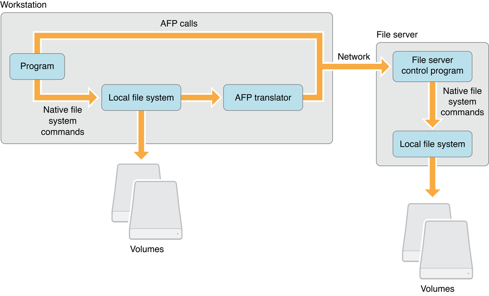
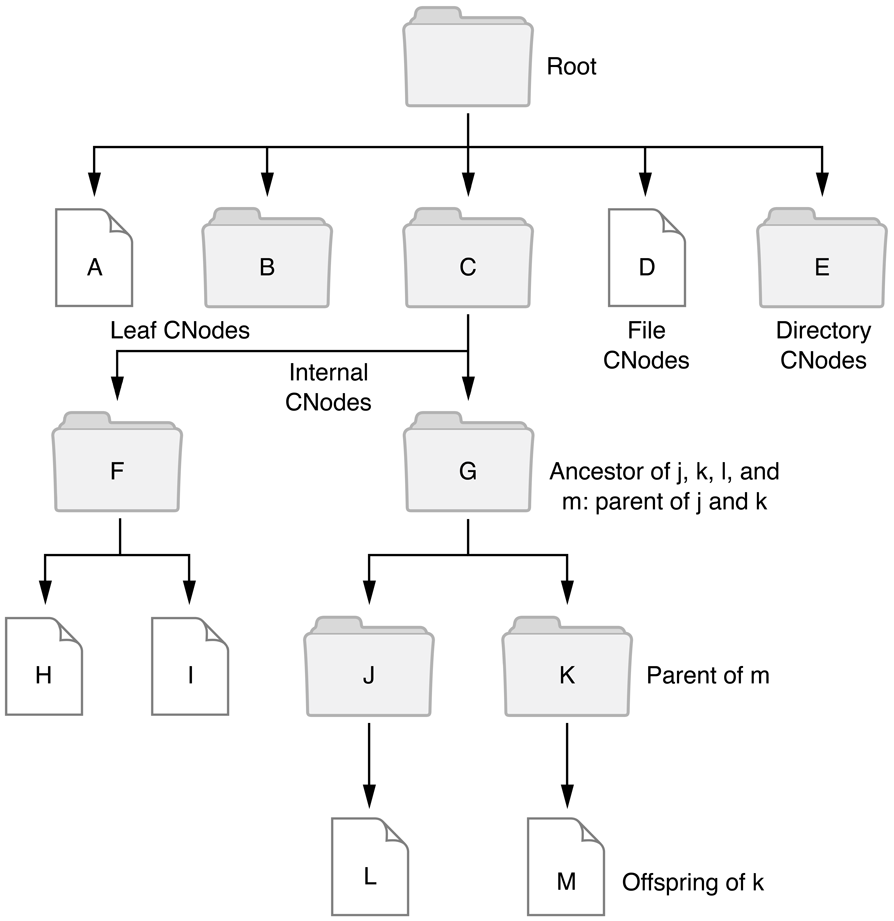
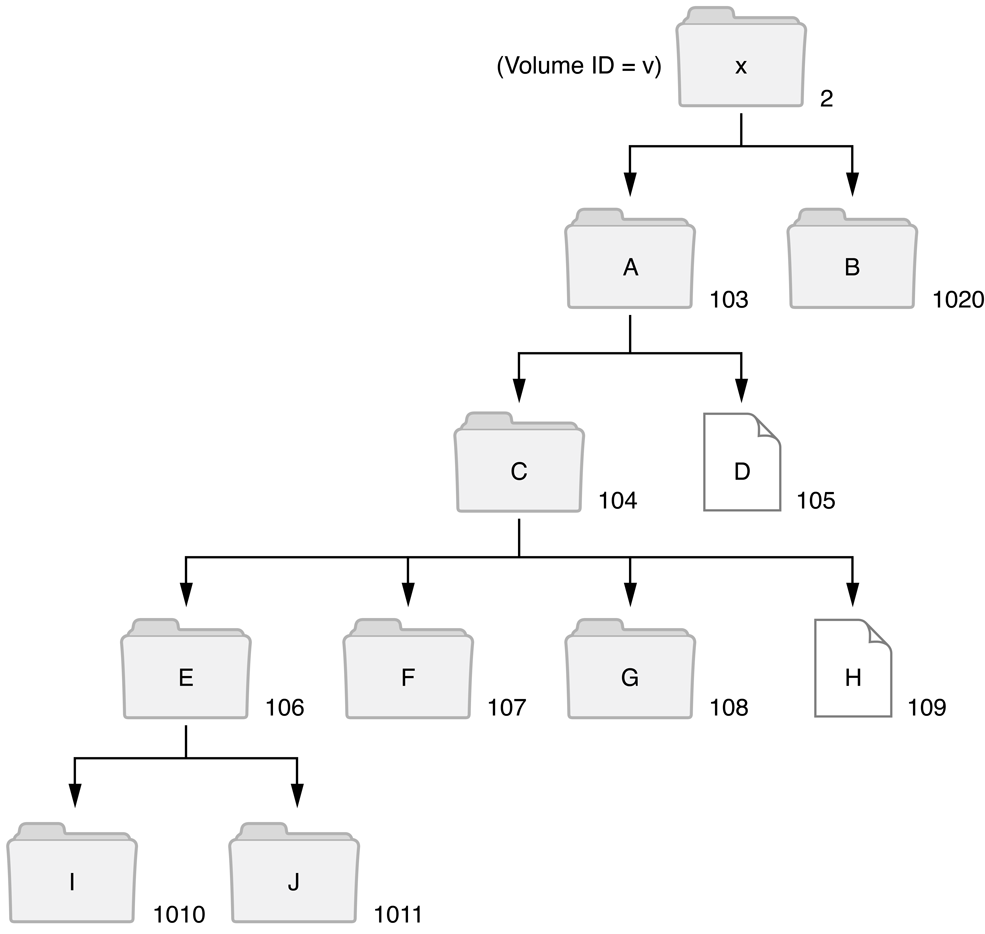

> 导航：[总目录](../../../README.md) · [documentation](../../../_indexes/documentation.md) · [Apple Filing Protocol Programming Guide](Introduction.md)


[Next](AFP%20Character%20Encoding.md)[Previous](Introduction.md)

# Apple Filing Protocol Concepts

This section introduces the file access model used by AFP to enable file sharing and discusses the components of AFP software.

__Figure 1-1__  AFP file access model



A program running in a local computer requests and manipulates files by using that computer’s native file system commands. These commands manipulate files on disk or other memory resource that is physically connected to the local computer. Through AFP, a program can use the same native file system commands to manipulate files on a shared resource that resides on a remote computer (for example, a file server).

A program running on the local computer sends a command to the native file system. A data structure in local memory indicates whether the volume is managed by the native file system or by some external file system. The native file system discovers whether the requested file resides locally or remotely by looking at this data structure. If the data structure indicates an external file system, the native file system routes the command to the AFP translator.

The translator, as its name implies, translates the native commands into AFP commands and sends them through to the file server that manages the remote resource. The AFP translator is not defined in the AFP specification; it is up to the applications programmer to design it.

A program running on the local computer may also need to send AFP commands for which no equivalent command exists in the native file system. In this case, the AFP command is sent directly to the desired external file system, as shown in Figure 1-1. For example, user authentication might have to be handled through an interface written for that purpose.

AFP supports computers using Mac OS and personal computers using MS-DOS. AFP can be extended to support additional types of computers. Any implementation of AFP must take into account the capabilities of the networked computer’s native file system and simulate its functionality in the shared environment. In other words, the shared file system should duplicate the characteristics of a local computer’s file system. Simulating the functionality of each local computer’s native file system becomes increasingly complex as different computer types share the same file server. Because each computer type has different characteristics in the way it manipulates files, the shared file system needs to possess the combined capabilities of all computers on the same network.

Three system components make up AFP:

- a file system structure, which is made up of resources (such as file servers, volumes, directories, files, and forks) that are addressable through the network. These resources are called AFP-file-system-visible entities. AFP specifies the relationship between these entities. For example, one directory can be the parent of another. For descriptions of AFP-file-system-visible entities, see File System Structure later in this chapter.
- AFP commands, which are the commands the local computer uses to manipulate the AFP file system structure. As mentioned earlier, the translator sends file system commands to the file server in the form of AFP commands, or the application running on the local computer can make AFP commands directly. Each AFP command is described in detail in the “Tasks” section of this document.
- algorithms associated with the commands, which specify the actions performed by the AFP commands.

Although this chapter distinguishes between local computers and file servers, AFP can support these two functions within the same node. However, AFP does not solve the concurrency problems that can arise when a computer is both an AFP client and an AFP server. The software on such combined nodes must be carefully designed to avoid potential conflicts.

AFP does not provide commands that support administration of the file server. Administrative functions, such as registering users and changing passwords, must be handled by separate network-administration software. Additional software must also be provided to add, remove, and find servers within the network.

This section describes the AFP file system structure and the parameters associated with its AFP-file-system-visible entities. These entities include the file server, its volumes, directories (“folders” in Mac OS terminology), files. and file forks. This section also describes the tree structure, called the volume catalog, which is a description of the relationships between directories and files.

By sending AFP commands, the AFP client can

- obtain information about the file server and other parts of the file system structure
- modify information that is obtained from a file server
- create and delete files and directories
- retrieve and store information within individual files

The following sections describe the file system structure’s AFP-file-system-visible entities.

A file server is a computer with at least one large-capacity disk that allows other computers on the network to share information stored in it. AFP imposes no limit on the number of shared disks. Each disk attached to a file server usually contains one volume, although the disk may be subdivided into multiple volumes. Each volume appears as a separate entity to the AFP client.

A file server has a unique name and other identifying parameters. These parameters identify the server’s machine type and number of attached volumes, as well as the AFP versions user authentication methods (UAMs) that the server supports. Some of the more common AFP file server parameters are listed Table 1-1. For a complete list, see `FPGetSrvrInfo`.

__Table 1-1__  File server parameters

| Parameter | Description |
| UTF8ServerName | A UTF-8 string containing the server name. |
| MachineType | A string in Pascal format of up to 16 characters that describes the file server’s hardware and software but has no significance to AFP. |
| AFPVersions | Supported AFP versions—one or more strings of up to 16 characters each. For more information, see _Apple Filing Protocol Reference_. |
| UAMs | One or more strings of up to 16 characters each. For more information, see [Table 1-5](#apple-f4xwc4dqnrsv64tfmyxwi33df52wszbpkridimbqgaydqnjufvbuqmzngu4tomjv). |
| VolumeIconAndMask | Deprecated. An optional value of 256 bytes that is used to customize the appearance of server volumes on the Mac OS Desktop. It consists of a 32-by-32 bit (128 bytes) icon bitmap followed by a 32-by-32 bit (128 bytes) icon mask. The mask usually consists of the icon’s outline filled with black (bits that are set). For more information about icons, refer to _Inside OS X_. |
| ServerSignature | A 16-byte value that uniquely identifies a server used to prevent an AFP client from logging on to the same server twice. |

A file server can make one or more volumes visible to AFP clients. Each volume has parameters associated with it, as listed in Volume Bitmap. To provide security at the volume level, the server can maintain an optional password parameter for any volume.

The `FPGetVolParms` command provides additional information about the volume. `Volume Bitmap` lists the information it can return.

An AFP volume is structured hierarchically. There are two types of hierarchical volumes: fixed and variable. A fixed Directory ID volume contains multiple directories, with each directory having its own permanent Directory ID that is assigned when the directory is created. The Directory ID is not used for any other directory during the lifetime of the volume, even if the directory to which it is assigned is later deleted.

A variable Directory ID volume also maintains the uniqueness of its Directory IDs but differs from a fixed Directory ID volume in that it does not associate a permanent Directory ID with each directory. For variable Directory ID volumes, the file server creates a unique Directory ID for a directory whenever the AFP client sends an `FPOpenDir` command. The file server then maintains this Directory ID until the client sends an `FPCloseDir` command or the AFP session terminates. A Directory ID obtained by sending an `FPOpenDir` command to a variable Directory ID volume must be used only for that session. If the Directory ID is stored and used to reference the directory in a later session, the results cannot be predicted: the command may fail, manipulate the wrong directory, or accidentally manipulate the correct directory.

__Table 1-2__  Volume types

| Value | Description |
| 1 | Flat (no directories supported). Deprecated. |
| 2 | Fixed Directory ID. |
| 3 | Variable Directory ID. Deprecated. |

The volume types have the following support capabilities and constraints: Personal computers using MS-DOS can gain access to any type of server volume because the concept of Directory IDs is foreign to their file systems. However, Macintosh computers using the hierarchical file system (HFS) cannot directly use variable Directory ID volumes. Macintosh HFS volumes are fixed Directory ID volumes and hierarchical volumes on the file server can be handled by HFS only if they are fixed Directory ID volumes. Mac OS applications, such as the Finder, save Directory IDs and do no expect them to vary.

The volume catalog is the structure that describes the branching tree arrangement of files and directories on fixed and variable Directory ID volumes. The catalog does not span multiple volumes; the AFP client sees a separate volume catalog for each server volume that is visible to AFP clients. [Figure 1-2](#apple-f4xwc4dqnrsv64tfmyxwi33df52wszbpkridimbqgaydqnjufvbuqmznguydgojs) shows an example of a volume catalog and illustrates its elements.

The volume catalog contains directories and files branching from a base directory known as the root. These directories and files are referred to as catalog nodes or CNodes (not to be confused with devices on a network, which are also known as nodes). Within the tree structure, CNodes can be positioned in two ways:

- at the end of a limb, in which case the CNode is called a leaf; a leaf CNode can be a file or an empty directory
- connected from above and below to other CNodes, which case the CNode is called an internal CNode. Internal CNodes are always directories

CNodes have a parent/offspring relationship. A given CNode is the offspring of the CNode above it in the catalog tree, and the higher CNode is considered its parent directory. Offspring are contained within the parent directory. The only CNode that does not have a parent directory is the root directory.

When an AFP command makes its way through the volume catalog, it can take only one shortest path from the root to a specific CNode. The CNodes along that path are said to be ancestors of the destination node, which in turn is called the descendent of each of its ancestors.

__Figure 1-2__  Volume catalog



CNode names identify every directory and file in a volume catalog. Each directory and file has a Long Name, a Short Name, and may also have an AFPName.

Long Names and Short Names correspond in two of the native file systems that AFP supports: the Mac OS refers to files and directories by Long Names; MS-DOS computers use Short Names.

AFPNames are encoded in conformance to the Unicode standard (UTF-8), which uses 16-bits to encode more than 65,000 characters. To keep character coding simple and efficient, the Unicode Standard assigns each character a unique numeric value and name. To help when converting from UTF-8 to other script systems, AFPNames begin with a four-byte text encoding hint that specifies the script that was originally used to compose the name. The text encoding hint is followed by a two-byte length field specifying the length of the UTF-8 encoded name that follows.

The header file, `TextCommon.h`, for the Text Encoding Conversion Manager defines the constants for the text encoding hint. See [AFP Text Encodings](https://developer.apple.com/documentation/coreservices/1399980-afp_text_encodings) for a list.

To allow dissimilar computers to share resources, the file server provides CNode names in all three formats. When creating or renaming files and directories, the user provides a name consistent with the native file system. The server then uses an algorithm to generate the other name (Long or Short). This section describes the rules for forming CNode names and the algorithm used for creating and maintaining dual names.

The syntax for forming AFP Long Names is the same as the naming syntax used by the Macintosh HFS, with one exception: Null (0x00) is not a permissible character in AFP Long Names. Otherwise, the mapping of character code to character is the same for AFP as it is for OS X. [See (AFP Character Encoding](AFP%20Character%20Encoding.md#apple-f4xwc4dqnrsv64tfmyxwi33df52wszbpkridimbqgaydqnjufvbuqmrshewvgvzr).] AFP Long Names are made up of at most 31 characters; valid characters are any printable ASCII code except colon (0x3A) and null (0x00). The volume name, and by inference the root’s Long Name, cannot be longer than 27 bytes.

The syntax for forming AFP Short Names is the same as the naming syntax used by MS-DOS, which is more restrictive than the naming syntax used in the Mac OS: Names may be up to eight alphanumeric characters, optionally followed by a period (0x2E) and a one-to-three character alphanumeric character extension.

To ensure that a CNode can be uniquely specified by either name, AFP defines the following rules:

- no two offspring of a given directory can have the same Short Name or the same Long Name.
- a Short Name can match a Long Name if and only if they both belong to the same file or directory.

Therefore, either name, Long or Short, uniquely identifies CNodes within the same directory.

AFP naming rules are such that any MS-DOS name can be used directly as a CNode Short Name, and any OS X name can be used as a Long Name. The file server generates the other name for each CNode, deriving it from the first name specified and matching the second name as closely as possible. The Long Name format is a superset of the Short Name format. The name management algorithm mandates that whenever a CNode is created or renamed with a Short Name, the Long Name will always match. Deriving a Short Name from a Long Name is not so simple, and AFP does not stipulate an exact algorithm for this derivation. Therefore, different servers may create Short Names differently.

When a CNode is created, the caller supplies the node’s name and a name type that indicates whether the name is a Long or Short Name. The server then checks the name to verify that the name conforms to the accepted format. The algorithm that follows describes how servers assign Short and Long Names to a CNode (referred to as an object in this algorithm).

```
IF name type is Short or name is in Short format
THEN check for new name in list of Short Names
    IF name already exists
    THEN return ObjectExists result
    ELSE set object’s Short and Long Names to new name

ELSE { name type is Long OR name is in Long format }
    check for new name in list of Long Names
    IF name already exists
    THEN return ObjectExists result
    ELSE set object’s Long Name to new name
        derive Short Name from Long Name
```

This algorithm is used for renaming as well as for creating new names. When a user renames an object, its other name is changed using the above algorithm.

One limitation of this algorithm is that it does not prevent a user from specifying a Long Name that matches the Short Name generated by the file server for another file. A server-generated Short Name is normally not visible to an user that sees only Long Names. If a user inadvertently specifies a Long Name that matches a Short Name, the command fails and the server returns a kFPObjectErr.

For example, for a file created with the Long Name “MacFileLongName”, a file server can generate a Short Name of “MacFile”. When the user tries to create a new file with the Long Name “MacFile” in the same directory, the command fails because the above algorithm stipulates that the Long Name and the Short Name would both have to be set to “MacFile”.

If an AFP client creates a file having a UTF-8–encoded name, the file server is required to generate a valid Long Name and a valid Short Name for the file. The algorithm for generating Long and Short Names for a file having a UTF-8–encoded file name is beyond the scope of this specification.

Directories and files are stored in volumes and constitute the next level of the file system structure visible to AFP clients. As was shown in [Figure 1-2](#apple-f4xwc4dqnrsv64tfmyxwi33df52wszbpkridimbqgaydqnjufvbuqmznguydgojs), directories branch to files and other directories. Each directory has an identifier through which it and its offspring can be addressed. Therefore, directories can be thought of as logically containing their offspring directories and files with the parameters described below.

Each directory in the volume catalog is identified by a four-byte long integer known as its Directory ID. Because two directories on the same volume cannot have the same Directory ID, the Directory ID uniquely identifies a directory within a volume.

Within the volume catalog, as mentioned earlier, directories have ancestor, parent, and offspring relationships with each other. The Directory ID of a CNode’s parent is called the CNode’s Parent ID.

A CNode can have only one parent, so a given CNode has an unique Parent ID. However, a CNode can have several ancestor directory identifiers, one for each ancestor. The parent directory is considered an ancestor.

Directory IDs from 1 to 16 are reserved. The Directory ID of the root is always 2. The root’s Parent ID is always 1. (The root does not really have a parent; this value is returned only if an AFP command asks for the root’s Parent ID.) Zero (0) is not a valid Directory ID.

For each directory, the server must maintain the parameters listed in File and Directory Bitmap. The parameters are obtained by calling `FPGetFileDirParms` and specifying in the `DirBitMap` parameter the directory parameters that are to be obtained. Some directory parameters can be set by calling `FPSetDirParms` or `FPSetFileDirParms`.

The Attributes parameter for directories provides additional information about the directory. `File and Directory Attributes Bitmap` lists the bit definitions for the Attributes parameter for directories.

No specific bit exists to inhibit moving a directory, but directory movement is constrained by the RenameInhibit bit when a directory is moved or moved and renamed.

Access Rights (a four-byte quantity) contains the read, write, and search access privileges corresponding to the directory’s owner, group, and Everyone. The upper byte of the Access Rights parameter is the User Access Rights Summary byte, which indicates the privileges the current user of the AFP client has to this directory. `Access Rights Bitmap` lists the bit definitions for the Access Rights parameter for directories.

An `FPUnixPrivs` structure is used to return UNIX privileges if a file or directory resides on a volume that supports UNIX privileges.

For each file, the server must maintain the parameters listed in `File Bitmap`. The parameters are obtained by calling `FPGetFileDirParms` and specifying in the `FileBitmap` parameter the file parameters that are to be obtained, by calling `FPResolveID` and specifying the file’s File ID, or by calling `FPGetForkParms`. Some file parameters can be set by sending `FPSetFileParms`, `FPSetFileDirParms`, and `FPSetForkParms` commands.

The file number is a unique number associated with each file on the volume. This number is purely informative; AFP does not allow the specification of a file by its file number.

The Attributes parameter for files provides additional information about the file. `File and Directory Attributes Bitmap` lists the bit definitions for the `Attributes` parameter for files.

No specific bit exists to inhibit moving a file, but file movement is constrained by the `RenameInhibit` bit only when a file is moved and renamed, not when it is simply moved.

The data fork length and resource fork length are equal to the number of bytes in the corresponding fork.

The creation, backup, and modification date-time parameters are described next.

All date-time quantities used by AFP specify values of the server’s clock. These values correspond to the number of seconds measured from 12:00 am on January 1, 2000 in Greenwich Mean Time (GMT).

AFP represents date-time values with four-byte signed integers. The `FPGetSrvrParms` command allows the AFP client to obtain the current value of the server’s clock. At login time, the AFP client should read this value (_s_) and the value of the AFP client’s clock (_w_) and computer the offset between these values (_s - w_). All subsequent date-time values read from the server should be adjusted by adding this offset to the date-time. This adjustment will correct for differences between the two clocks and will ensure that all computers see a consistent time base.

The creation date-time of a directory or a file is set to the server’s system clock when the file or directory is created. The backup date-time is set by backup programs. When a file or directory is created, the server sets the backup date-time to `0x80000000`, which is the earliest representable time.

The server changes the modification date-time of a directory each time the directory’s contents are modified. Therefore, any of the following actions will cause the server to assign a new modification date to the directory: renaming the directory; creating or deleting a CNode in the directory; moving the directory; changing its access privileges, Finder Info, or changing the Invisible attributes of one of its offspring.

An AFP client with the appropriate privileges can set the creation and modification date-time parameters to any value.

A file consists of two forks: a data fork and a resource fork. The bytes in a file fork are sequentially numbered starting with 0. The data fork is an unstructured finite sequence of bytes. The resource fork is used to hold Mac OS resources, such as icons and drivers, and a data structure for mapping them within the fork. AFP is designed to consider both forks as finite-length byte sequences; however, AFP contains no rules relating to the structure of the resource fork. For more information about resource forks, refer to _Inside OS X_.

Either or both forks of a given file can be empty. Non-Mac OS AFP clients that need only one file fork must use the data fork. Files created by a computer with an MS-DOS operating system will have an empty resource fork because a resource fork is unintelligible to that operating system. Consequently, an MS-DOS computer that has gained access to a server file created by a Macintosh may not be aware of the existence of the file’s resource fork.

Although AFP allows the creation of MS-DOS applications that can understand and manipulate resource forks, such applications would have to preserve the internal structure of the forks. Mac OS computers expect a specific format in the resource fork of any file, so AFP clients of computers that cannot manage the internal structure of the resource fork should never alter the contents of a resource fork.

To read from or write to the contents of a file’s data or resource fork, the AFP client first sends a command to open the particular fork of the file, creating an access path to that file fork. The access path is not be confused with the paths and pathnames described in the next section.

Once the AFP client creates this access path, all subsequent read and write commands refer to it for the duration of the session. For each access path, the server maintains the parameters listed in Table 1-3.

__Table 1-3__  Access path parameters

| Parameter | Description |
| `OForkRefNum` | Two bytes (0 is invalid) |
| `AccessMode` | Two-byte bitmap |
| `Flag` | Bit 7 of a one-byte value |

The `OForkRefNum` parameter uniquely identifies the access path among all access paths within a given session. The `AccessMode` parameter indicates to the server whether this access path allows reading or writing. It is maintained by the server and is inaccessible to clients of AFP. The `Flag` parameter indicates to the server that the access path belongs to the data or the resource fork.

In addition to the above parameters, the server must provide a way to gain access to the parameters of the file to which an open fork belongs. For details, see the `FPGetForkParms` command in the Reference section.

In order to perform any action on a CNode, the AFP client must designate a path to the CNode. AFP provides rules for specifying a path to any CNode in the volume catalog. A CNode (file or directory) can be unambiguously specified to the server by the identifiers shown in Figure 1-3.

__Figure 1-3__  CNode specification


The Volume ID specifies the volume on which the destination CNode resides. The Directory ID can belong to the destination CNode (if the CNode is a directory) or to any one of its ancestor directories, up to and including the root directory and the root’s parent directory.

An AFP pathname is formatted as a Pascal string (one length byte followed by the number of characters specified by the length byte) or a UTF-8 string (a four-byte text encoding hint followed by two length bytes followed by the number of characters specified by the length bytes). An AFP pathname is made up of CNode names, concatenated with intervening null-byte separators. Each element of a pathname must be the name of a directory, except for the last one, which can be the name of a directory or a file.

The elements of a pathname can be Long or Short Names. However, a given pathname cannot contain a mixture of Long and Short Names. A path type byte, which indicates whether the elements of the pathname are all Short or all Long Names, is associated with each pathname. A pathname consisting of Short Names has a path type of 1. A pathname consisting of Long Names has a path type of 2.

An AFP pathname that consists of Long or Short Names can be up to 255 characters long. A single null byte as the length byte indicates that no pathname is supplied. Because the length byte is included at the beginning of the string, each pathname element (CNode name) does not include a length indicator. Similarly, an AFP pathname that consists of UTF-8–encoded names is limited to 255 Unicode characters.

The syntax of an AFP pathname follows this paragraph. The asterisk (`*`) represents a sequence of zero or more of the preceding elements of the pathname; the plus (`+`) represents a sequence of one or more of the preceding elements; `<Sep>` represents the separators in the pathname; the vertical bar (`|`) is an OR operator; and the term on the left side of the `::=` symbol is defined as the term(s) on the right side.

```
<Sep> ::= <null-byte>+
<Pathname> ::= empty-string |
    <Sep>*<CNode name>(<Sep><Pathname>*
```

The syntax represents a concatenation of CNode names separated by one or more null bytes. Pathnames can also start or end with a string of null bytes.

A pathname can be used to traverse the volume catalog in any direction. The pathname syntax allows paths either to descend from a particular CNode through its offspring or to ascend from a CNode to its ancestors. In either case, the directory that is the starting point of this path is defined separately from the pathname by its Directory ID. The first element of the pathname is an offspring of the starting point of the directory. The pathname must be parsed from left to right to obtain each element that is used as the next node on the path.

To descend through a volume, a valid pathname must proceed in order from parent to offspring. A single null-byte separator preceding this first element is ignored.

To ascend through a volume, a valid pathname must proceed from a particular CNode to its ancestor. To ascend one level in the catalog tree, two consecutive null bytes should follow the offspring CNode name. To ascend two levels in the catalog tree, three consecutive null bytes are used as the separator, and so on.

A particular volume may descend and ascend through the volume catalog. Because of this, many valid pathnames may refer to the same CNode.

A complete path specification can take a number of forms. The table that follows summarizes the different kinds of path specifications that can be used to traverse the volume catalog illustrated in [Figure 1-4](#apple-f4xwc4dqnrsv64tfmyxwi33df52wszbpkridimbqgaydqnjufvbuqmznguztkojs). A zero in square brackets `[0]` represents a null-byte separator.

The descriptors and examples that follow refer to this table and the corresponding volume catalog illustrated in Figure 1-4. To simplify these examples, the CNodes in this catalog are named _a_ through _j_, except the root, which is named _x_. The path type is ignored in this example. The letter _v_ represents the volume’s two-byte Volume ID. Lines connect the CNodes; the unconnected lines indicate that other CNodes in this volume are not shown.

__Figure 1-4__  Example of a volume catalog



Table 1-4 provides the Volume ID, Directory ID, and pathname for some sample path specifications in [Figure 1-4](#apple-f4xwc4dqnrsv64tfmyxwi33df52wszbpkridimbqgaydqnjufvbuqmznguztkojs).

__Table 1-4__  Sample path specifications

| Example | Volume ID | Directory IDs | Pathname |
| First | v | 2 | a[0]c[0]e[0]j[o] |
| Second | v | 104 | e[0]j |
| Third | v | 106 | [0]j |
| Fourth | v | 106 | j |
| Fifth | v | 106 | [0] |
| Sixth | v | 104 | e[0][0]g[0][0]h |
| Seventh | v | 104 | e[0][0][0] |
| Eighth | v | 1 | x[0]a[0]c[0]h |

The first example of a path specification in Table 1-4 contains the Volume ID, the root directory’s Directory ID, which is always 2, and a pathname. In this case, the pathname must contain the names of all of the destination file’s ancestors except the root, and it must end with the name of the file itself. The single trailing null byte is ignored.

The second example contains the Volume ID, the Directory ID of an ancestor, and a pathname.

The third example is essentially the same as the second example. The single leading null byte is ignored.

In the fourth example, the Directory ID is the Parent ID of the destination file. In this case, the pathname need contain only the name of the destination file itself.

The fifth example illustrates another way to uniquely specify a descending path to a directory. It includes the CNode’s Volume ID, its Directory ID, and a null pathname. This path specification is used to specify the directory _e_.

The sixth example illustrates a descending path. The first CNode in the pathname is the offspring of the starting point Directory ID. Then the pathname ascends though _e_’s parent (c) down to directory _g_, backup to _g_’s parent (_c_), and down again to _h_.

The seventh shows an ascending pathname that starts at directory _c_ (whose Directory ID is 104), moves down to _e_, and then ascends to _e_’s parent’s parent (_a_).

The eighth example is a special case in which the starting point of the path is Directory ID 1, the parent of the root. The first name of the pathname must be the volume name or root directory name corresponding to Volume ID _v_; beyond that, pathname traversal is performed as in the other examples.

To make use of any resource managed by a file server, the AFP client must first log in to the server. This section provides an overview of the AFP login process.

After a user selects an AFP server to log in to, the AFP client sends the `FPGetSrvrInfo` command to request information about that server. The server returns information that includes

- the AFP versions the server supports
- the user authentication methods (UAMs) the server supports
- the server’s machine type
- the server’s name
- the server’s network address
- the server’s signature
- whether the server supports optional functionality, such as reconnect, Open Directory, `FPCopyFile`, `FPChangePassword`, saving passwords, and server notifications

During the AFP login process, the AFP client tells the server which AFP version the client will use to establish the connection and which UAM it will use to authenticate the user.

Each AFP version is uniquely described by a string of up to 16 characters called the AFP version string. The AFP version strings for the AFP versions supported by AFP 3._x_ are listed in _Apple Filing Protocol Reference_.

When working with different versions of AFP, the following differences in behavior occur:

- AFP 2.x—UNIX permissions and UTF-8 name support are disabled.
- AFP 3.x—GMT adjustments are disabled, and all time stamps are based on GMT.

The UAMs supported by AFP 3._x_ and their corresponding strings are listed in [Table 1-5](#apple-f4xwc4dqnrsv64tfmyxwi33df52wszbpkridimbqgaydqnjufvbuqmzngu4tomjv).

__Table 1-5__  AFP UAM strings

| String | UAM name |
| `No User Authent` | No User Authentication UAM. For details, see [No User Authentication](AFP%20File%20Server%20Security.md#apple-f4xwc4dqnrsv64tfmyxwi33df52wszbpkridimbqgaydqnjufvbuqmrtgiwtknbwgq4a). |
| `Cleartxt Passwrd` | Cleartext Password. For details, see [Cleartext Password](AFP%20File%20Server%20Security.md#apple-f4xwc4dqnrsv64tfmyxwi33df52wszbpkridimbqgaydqnjufvbuqmrtgiwtknbwhe3q). |
| `Randnum Exchange` | Random Number Exchange. For details, see [Random Number Exchange](AFP%20File%20Server%20Security.md#apple-f4xwc4dqnrsv64tfmyxwi33df52wszbpkridimbqgaydqnjufvbuqmrtgiwtknbxheza). |
| `2-Way Randnum` | Two-Way Random Number Exchange. For details, see [Two-Way Random Number Exchange](AFP%20File%20Server%20Security.md#apple-f4xwc4dqnrsv64tfmyxwi33df52wszbpkridimbqgaydqnjufvbuqmrtgiwtknbzhe3q). |
| `DHCAST128` | Diffie-Hellman Key Exchange. Allows the client to send a password of up to 64 bytes to the server through a strongly encrypted “tunnel.” This type of encryption is useful for servers that require the use of cleartext password. For details, see [Diffie-Hellman Key Exchange](AFP%20File%20Server%20Security.md#apple-f4xwc4dqnrsv64tfmyxwi33df52wszbpkridimbqgaydqnjufvbuqmrtgiwtknjrge4q). |
| `DHX2` | Diffie-Hellman Key Exchange 2. Allows the client to send a password of up to 256 bytes to the server through a strongly encrypted “tunnel.” This type of encryption is useful for servers that require the use of cleartext password. For details, see [Diffie-Hellman Key Exchange 2](AFP%20File%20Server%20Security.md#apple-f4xwc4dqnrsv64tfmyxwi33df52wszbpkridimbqgaydqnjufvbuqmrtgiwtqmjug44q). |
| `Client Krb v2` | Kerberos. Allows the client to use Kerberos v4 and Kerberos v5 tickets to authenticate a user. |
| `Recon1` | The Reconnect UAM. Allows the client to use the `FPLoginExt` command to reconnect using a reconnect token (also known as a _credential_) containing all of the information required to authenticate. |

The prospective AFP client initiates the login process by sending an `FPLogin` or an `FPLoginExt` command to the server. Both commands include the AFP version string and the UAM string that the client has selected. Depending on the selected UAM method, the `FPLogin` or `FPLoginExt` command may include user login information (such as a user name or password), or a subsequent `FPLoginCont` command may include such information. The sending of additional `FPLoginCont` commands may be required to complete user authentication, as described in [AFP File Server Security](AFP%20File%20Server%20Security.md#apple-f4xwc4dqnrsv64tfmyxwi33df52wszbpkridimbqgaydqnjufvbuqmrtgiwvgvzr).

If the UAM succeeds, an AFP session between the AFP client and the server begins.

After login, the AFP client should immediately call `FPGetUserInfo` to see if the user’s password has expired.

As mentioned earlier, in addition to the AFP and UAM versions that the server supports, the `FPGetSrvrInfo` command returns a `Flags` parameter whose bits provide additional information about the server that is useful to an AFP client. The bits of the `Flags` parameter are listed in `Server Flags Bitmap`.

If an AFP session is disconnected due, for example, a network outage, but the AFP client still has the required information, the AFP client can reconnect the session.

Clients that use the Reconnect UAM, described in [Reconnect](AFP%20File%20Server%20Security.md#apple-f4xwc4dqnrsv64tfmyxwi33df52wszbpkridimbqgaydqnjufvbuqmrtgiwtqnzzha2q), follow these steps to reconnect:

1. Log in successfully by calling using a UAM that provides a session key.
2. Call `FPGetSessionToken` to get a token, specifying `kLoginWithTimeAndID` (3) in the `Type` parameter.
3. Periodically call `FPGetSessionToken` with `kRecon1RefreshToken` (7) in the `Type` parameter to refresh the token before it expires.
4. If a disconnect occurs, call `FPLoginExt` to log in again, specifying the Reconnect UAM as the UAM, and passing the current token obtained by calling `FPGetSessionToken` in step 2 or 3. The reconnect token contains all of the user name and password information required for the server to authenticate the client, so logging in again does not require the client to repeat the authentication steps that took place in step 1.
5. If the login in step 4 completes successfully, call `FPDisconnectOldSession` and pass the token obtained in step 2. If the server can find the previous session identified by the token, it attempts to transfer all the previous session’s open files and locked resources to the new session. If this transfer is successful, this is considered to be a successful primary reconnect, and the server returns a result code of `kFPNoErr`.

   A successful Primary Reconnect results in _no_ data loss. All files, state, and so on are restored exactly as they were before losing contact with the server. Primary reconnect is always attempted first. If that fails, then the client tries a secondary reconnect. The expectation is that primary reconnect should only occur rarely (only if some other problem is causing the client to lose its connection).
6. Call `FPGetSessionToken` to get a new token, specifying the `Type` parameter as `kReconnWithTimeAndID`.

Clients that don’t use the Reconnect UAM follow these steps to reconnect:

1. Log in successfully by calling `FPLogin` or `FPLoginExt`. The AFP client should save the UAM, username, and password used.
2. Call `FPGetSessionToken` to get a token, specifying the `Type` parameters as `kLoginWithTimeAndID` (3).
3. If a disconnect occurs, log in again using the same UAM, user name and password that were used in step 1.
4. Call `FPDisconnectOldSession` and pass the token obtained in step 2. If the server can find the previous session identified by the token, it will transfer all the previous session’s open files and locked resources to the new session and return a result code of `kFPNoErr`.

   If the previous state is found on the server and the transfer is successful, then this is considered to e a successful primary reconnect. A successful primary reconnect results in _no_ data loss. All files, state, etc are restored exactly as they were before losing contact with the server. Primary reconnect is always attempted first. If that fails, then the client tries a secondary reconnect. The expectation is that primary reconnect should only occur rarely (only if some other problem is causing the client to lose its connection).
5. Call `FPGetSessionToken` to get a new token specifying the `Type` parameter as `kReconnWithTimeAndID`.

In either case, if the login succeeds, but the `FPDisconnectOldSession` request fails, the AFP client should perform a secondary reconnect. A secondary reconnect is used when the server does not have the saved session and state information. Any open files that had deny modes or byte range locks are now closed, and unsaved data may be lost (although most applications will let you save the current data to a new file). Applications that are currently using those files typically display an error stating that the file is no longer accessible. You can reopen the files using the same application. Any open files that did not use deny modes or byte range locks are automatically reopened. The expectation is that secondary reconnect should be very, very rare since it indicates that the server has crashed or been restarted.

If the server returns a result code other than `kFPNoErr`, the AFP client can attempt to reopen its files. If the files were previously opened without Deny Modes and the AFP client did not apply byte range locks, the client should be able to reopen those files. In this case, reconnect is also deemed successful. If the reconnect is not successful, an AFP client can take the steps described in the next section, Recovering From a System Crash.

If an AFP session is disconnected and the client reconnect information is lost due to a local system crash, the AFP client will not be able to reconnect the session. If the server allows reconnect, any files that were left open on the remote server when the local system crashed will be saved but will not be available for opening until the reconnect timeout expires. This also applies to the case where a sleeping AFP client fails to wake up or crashes and the server is saving the information until the sleep timeout expires.

To tell the server to close files left open by an old session and disconnect that session, an AFP client that supports AFP 3.1 and later can create and save a unique client-defined identifier and use the `FPGetSessionToken` command to send it the server. The client must do this before the local system crashes, for example, as part of its login sequence. When it receives the identifier, the server associates the identifier with the current session.

Later, if the local system crashes and is restarted, the AFP client can log in and send the `FPGetSessionToken` command again, this time telling the server to look for a session having the specified identifier. If the server finds such a session, it closes the files that are associated with it, frees any other associated resources, and disconnects the old session.

Detecting a client crash occurs in two ways, depending on the connection method. With the older connection methods, `kLoginWithID` and `kReconnWithID`, the client provides only a client ID to identify itself. When the server sees a new connection from the same client, it must assume that the client has crashed and reconnected, so it disconnects the first session. Unfortunately, this makes multiple concurrent sessions by a single client impossible, which causes problems for network home directories, Time Machine, and so on.

The `kLoginWithTimeAndID` and `kReconnWithTimeAndID` connection methods remove this limitation by providing an additional session identifier, the client’s startup time stamp. All concurrent sessions from a given client must provide the same time stamp. Thus, when the server sees multiple connections with the same client ID and the same time stamp, it can safely assumes that the existing sessions should remain valid.

If the AFP client crashes, the restart occurs at a different time than the original startup (obviously), and thus the time stamps do not match. When the server sees such a connection with the same client ID and a different time stamp, it assumes that the AFP client has crashed and rebooted, and thus disconnects all previous sessions associated with that client ID.

In previous versions of AFP, there was only one timer for determining whether a disconnect had occurred. Beginning in OS X v.10.2, there are two timers for determining disconnections:

- Active timer, which is set to 60 seconds by default
- Idle timer, which is set to 120 seconds by default

If the client has an outstanding request to the server and has not received any data (including tickles) from the server, the client waits until the active timer expires before assuming that a disconnect has occurred.

If the client has no outstanding requests to the server, the client waits until the idle timer expires before assuming that a disconnect has occurred.

Special considerations arise when the system is awakening from sleep:

- If the system is on a LAN, the active timer is set to (activeTimer / 4).
- If the system is on a WAN, the active timer is set to (activeTimer / 2).

If the client is connected to an AFP 2.x server (or earlier), the Active timer and the Idle timer are both set to 120 seconds.

In all situations, after a disconnect, if the server supports reconnect, reconnect is started.

For file server volumes, AFP provides an interface that replaces the Finder’s direct use of the Desktop file. This interface is necessary because the Desktop file was designed for a standalone environment and could not be shared by multiple users. The AFP interface to the Desktop database replaces the Desktop file and can be used transparently for both local and remote volumes.

The Desktop database is used by the file server to hold information needed specifically by the Finder to build its unique user interface, in which icons are used to represent objects on a disk volume. To create certain parts of this interface, the Finder uses the Desktop database to perform three functions:

- to associate documents and applications with particular icons and store the icon bitmaps
- to locate the corresponding application when a user opens a document
- to hold text comments associated with files and directories

Macintosh applications usually contain an icon that is to be displayed for the application itself as well as other icons to be displayed for documents that the application creates. These icons are stored in the application’s resource fork and in the Desktop database. The Desktop database associates these icons with each file’s creator (the `fdCreator` field in the `FInfo` record) and the type (the `fdType` field in the `FInfo` record), which are stored as part of the file’s Finder information.

The Finder allows a Mac OS user to open a document, that is, to select a file and implicitly start the application that created the file. To do this, the Desktop database maintains a mapping between the file creator and a list of the locations of each application that has that file creator associated with it. This mapping is referred to as an APPL mapping because all Macintosh applications have a file creator of `‘APPL’`. The Finder obtains the first item in the list and tries to start the application. If for some reason the application cannot be started (for example, if it is currently in use), the Finder will obtain the next application from the Desktop database’s list and try that one. This list is dynamically filtered to present to the Finder only those applications for which the AFP client has the proper access rights.

The Desktop database is also a repository for the text of comments associated with files and directories on the volume. The Finder will make calls to the Desktop database to read or write these comments, which can be viewed and modified by selecting the Get Info item in the Finder’s File menu. Comments are completely uninterpreted by the Desktop database.

For more information about the Finder and the use of the Desktop file, refer to _Inside OS X_.

Beginning in version 10.6, OS X supports submounting—mounting a folder within a given sharepoint.

For example, if you want to mount the folder myfolder within a sharepoint called mysharepoint on the server example.com, you would mount it with this AFP URL:

```
afp://example.com/mysharepoint/myfolder
```

Prior to OS X v.10.6, the sharepoint itself is mounted. Beginning in version 10.6, the requested folder is mounted.

This is mainly intended for supporting AFP home directories in which you have a "Users" sharepoint with multiple users inside that folder.

[Next](AFP%20Character%20Encoding.md)[Previous](Introduction.md)

