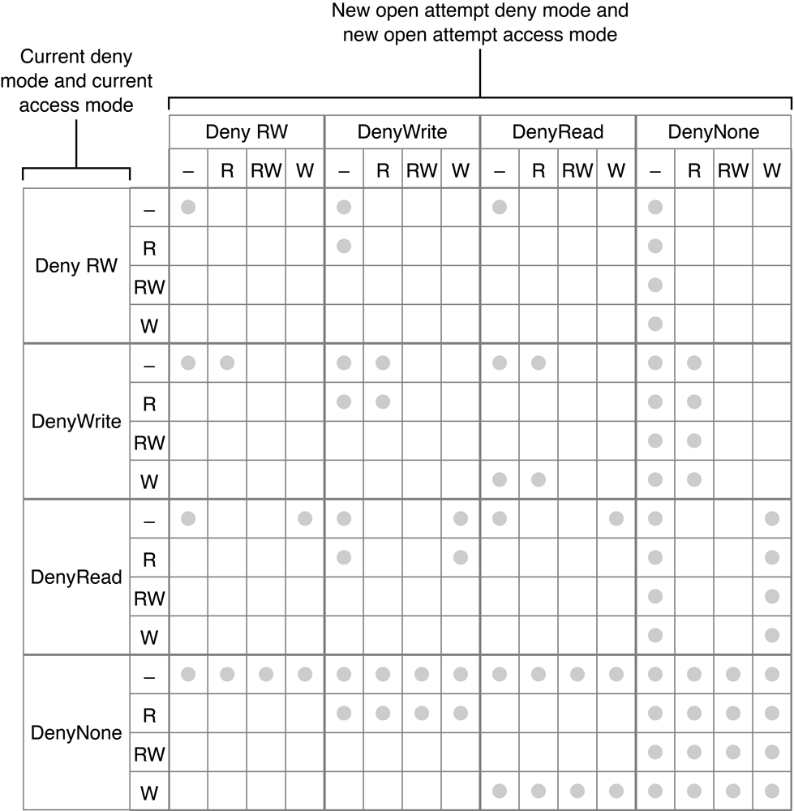

> 导航：[总目录](../../../README.md) · [documentation](../../../_indexes/documentation.md) · [Apple Filing Protocol Programming Guide](Introduction.md)

[Next](Using%20Login%20Commands.md)[Previous](AFP%20File%20Server%20Security.md)

# File Sharing Modes

AFP controls user access to shared files in two ways. The first, described in [AFP File Server Security](AFP%20File%20Server%20Security.md#apple-f4xwc4dqnrsv64tfmyxwi33df52wszbpkridimbqgaydqnjufvbuqmrtgiwvgvzr), provides security by controlling user access to specific directories. The second, described in this section, preserves data integrity by controlling a user’s access to a file while it is being used by another user.

To control simultaneous file access, the file server must enforce synchronization rules. These rules prevent applications from damaging each other’s files by modifying the same version simultaneously. These rules also prevent users from obtaining access to information while it is being changed.

Synchronization rules are built from the mode in which a first user and subsequent users open a file. AFP provides two classes of modes: access modes and deny modes.

Most file systems use a set of permissions to regulate the opening of files. This set includes permission to modify the contents of a file (read-write) and permission to see the file’s contents (read only). In a stand-alone system, these two file-access modes are sufficient.

In the shared environment of a file server, this set of permissions, or access modes, is expanded. In addition to the expanded set of access modes, a set of restrictions is provided by deny modes.

A user application can specify an access mode and a deny mode when it opens a file on the file server. AFP supports the access modes: read, write, read-write, and none. None access allows no further access to the fork, except to close it, and may be useful in implementing synchronization. In addition to one of these access modes, the user indicates a deny mode to the server to specify which rights should be denied to others trying to open the fork while the first user has it open. Users that subsequently try to open that fork can be denied read, write, read-write, or none access.

A user sending an `FPOpenFork` command can be denied file access for the following reasons:

- The user does not possess the rights (as owner, group, or Everyone) to open the file with the requested access mode. A result code of `kFPAccessDenied` is returned.
- The fork is already open with a deny mode that prohibits the second user’s requested access. For example, the first user opened the fork with a deny mode of DenyWrite, and the second user tries to open the for in the write mode. A `kFPDenyConflict` result code is returned to the second user.
- The fork is already open with an access mode that conflicts with the second user’s requested deny mode. For example, the first user opened the fork for Write access and a deny mode of DenyNone. The second user tries to open the fork with a deny mode indicating DenyWrite. This request is not granted because the fork is already open for Write access. A `kFPDenyConflict` result code is returned to the second user.

Deny modes are cumulative in that each successful opening of a fork combines its deny mode with previous deny modes. Therefore, if the first user opening a file specifies a deny mode of DenyRead, and the second user specifies DenyWrite, the fork’s current deny mode is DenyRead-Write. DenyNone and DenyRead combine to form a current deny mode of DenyRead.

Similarly, access modes are cumulative. If the first user opening a file has Read access and the second has Write access, the current access mode is Read-Write.

Synchronization rules, as previously discussed, allow or deny simultaneous access to a file fork. They are based on the current deny mode and current access mode of the fork and on the new deny and access modes being requested in a new `FPOpenFork` command. Synchronization rules are summarized in [Figure 4-1](#apple-f4xwc4dqnrsv64tfmyxwi33df52wszbpkridimbqgaydqnjufvbuqmrtgmwtknzugqza). A dot indicates that a new open command has succeeded; otherwise, it has failed.

__Figure 4-1__  Synchronization rules

[Next](Using%20Login%20Commands.md)[Previous](AFP%20File%20Server%20Security.md)

