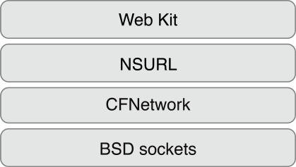
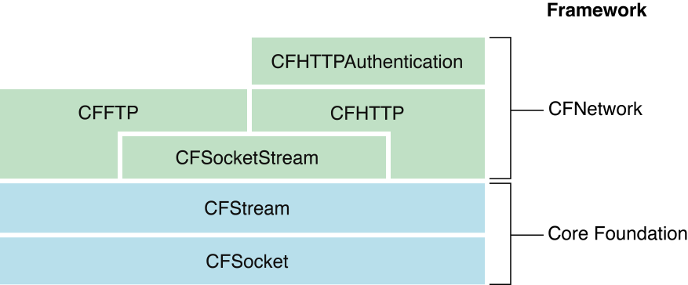
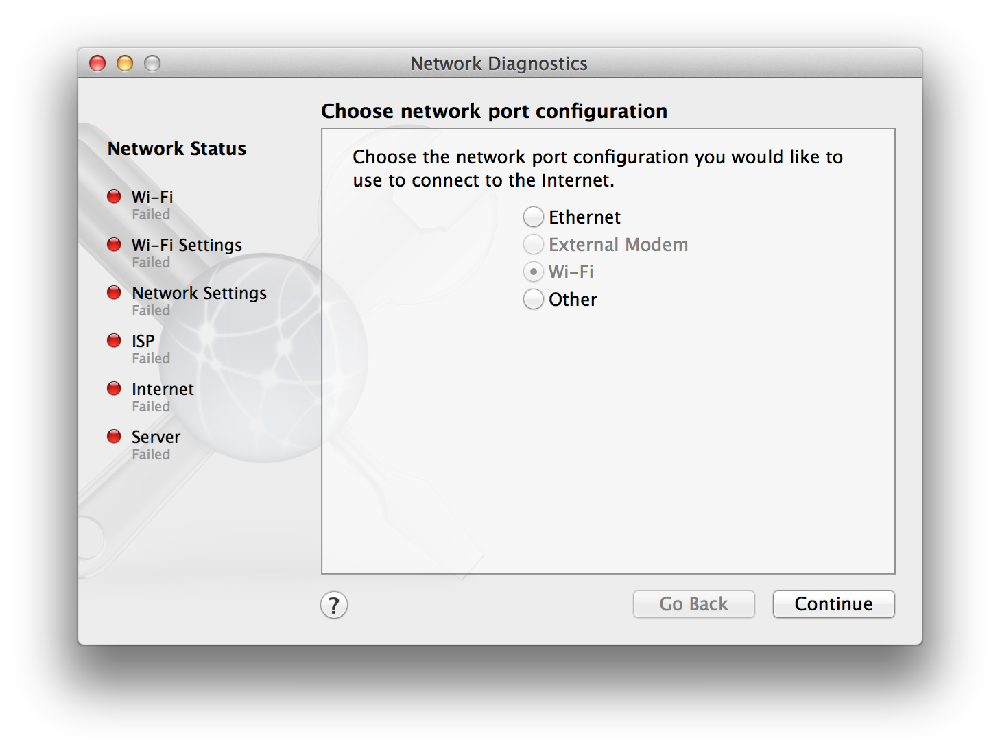

> 导航：[总目录](../../../README.md) · [documentation](../../../_indexes/documentation.md) · [CFNetwork Programming Guide](Introduction%20to%20CFNetwork%20Programming%20Guide.md)


[Next](Working%20with%20Streams.md)[Previous](Introduction%20to%20CFNetwork%20Programming%20Guide.md)

# CFNetwork Concepts

CFNetwork is a low-level, high-performance framework that gives you the ability to have detailed control over the protocol stack. It is an extension to BSD sockets, the standard socket abstraction API that provides objects to simplify tasks such as communicating with FTP and HTTP servers or resolving DNS hosts. CFNetwork is based, both physically and theoretically, on BSD sockets.

Just as CFNetwork relies on BSD sockets, there are a number of Cocoa classes that rely on CFNetwork (`NSURL`, for example). In addition, the Web Kit is a set of Cocoa classes to display web content in windows. Both of these classes are very high level and implement most of the details of the networking protocols by themselves. Thus, the structure of the software layers looks like the image in Figure 1-1.

__Figure 1-1__  CFNetwork and other software layers on OS X



CFNetwork has a number of advantages over BSD sockets. It provides run-loop integration, so if your application is run loop based you can use network protocols without implementing threads. CFNetwork also contains a number of objects to help you use network protocols without having to implement the details yourself. For example, you can use FTP protocols without having to implement all of the details with the CFFTP API. If you understand the networking protocols and need the low-level control they provide but don't want to implement them yourself, then CFNetwork is probably the right choice.

There are a number of advantages of using CFNetwork instead of Foundation-level networking APIs. CFNetwork is focused more on the network protocols, whereas the Foundation-level APIs are focused more on data access, such as transferring data over HTTP or FTP. Although Foundation APIs do provide some configurability, CFNetwork provides a lot more. For more information on Foundation networking classes, read _URL Loading System_.

Now that you understand how CFNetwork interacts with the other OS X networking APIs, you're ready to become familiar with the CFNetwork APIs along with two APIs that form the infrastructure for CFNetwork.

Before learning about the CFNetwork APIs, you must first understand the APIs which are the foundation for the majority of CFNetwork. CFNetwork relies on two APIs that are part of the Core Foundation framework, CFSocket and CFStream. Understanding these APIs is essential to using CFNetwork.

Sockets are the most basic level of network communications. A socket acts in a similar manner to a telephone jack. It allows you to connect to another socket (either locally or over a network) and send data to that socket.

The most common socket abstraction is BSD sockets. CFSocket is an abstraction for BSD sockets. With very little overhead, CFSocket provides almost all the functionality of BSD sockets, and it integrates the socket into a run loop. CFSocket is not limited to stream-based sockets (for example, TCP), it can handle any type of socket.

You could create a CFSocket object from scratch using the `CFSocketCreate` function, or from a BSD socket using the `CFSocketCreateWithNative` function. Then, you could create a run-loop source using the function `CFSocketCreateRunLoopSource` and add it to a run loop with the function `CFRunLoopAddSource`. This would allow your CFSocket callback function to be run whenever the CFSocket object receives a message.

Read _[CFSocket Reference](https://developer.apple.com/documentation/corefoundation/cfsocket-rg7)_ for more information about the CFSocket API.

Read and write streams provide an easy way to exchange data to and from a variety of media in a device-independent way. You can create streams for data located in memory, in a file, or on a network (using sockets), and you can use streams without loading all of the data into memory at once.

A stream is a sequence of bytes transmitted serially over a communications path. Streams are one-way paths, so to communicate bidirectionally an input (read) stream and output (write) stream are necessary. Except for file-based streams, you cannot seek within a stream; once stream data has been provided or consumed, it cannot be retrieved again from the stream.

CFStream is an API that provides an abstraction for these streams with two new CFType objects: CFReadStream and CFWriteStream. Both types of stream follow all of the usual Core Foundation API conventions. For more information about Core Foundation types, read _[Core Foundation Design Concepts](../../Core%20Foundation/Core%20Foundation%20Design%20Concepts/Introduction%20to%20Core%20Foundation%20Design%20Concepts.md#apple-f4xwc4dqnrsv64tfmyxwi33df52wszbpgeydambqgezde2i)_.

CFStream is built on top of CFSocket and is the foundation for CFHTTP and CFFTP. As you can see in Figure 1-2, even though CFStream is not officially part of CFNetwork, it is the basis for almost all of CFNetwork.

__Figure 1-2__  CFStream API structure



You can use read and write streams in much the same way as you do UNIX file descriptors. First, you instantiate the stream by specifying the stream type (memory, file, or socket) and set any options. Next, you open the stream and read or write any number of times. While the stream exists, you can get information about the stream by asking for its properties. A stream property is any information about the stream, such as its source or destination, that is not part of the actual data being read or written. When you no longer need the stream, close and dispose of it.

CFStream functions that read or write a stream will suspend, or _block_, the current process until at least one byte of the data can be read or written. To avoid trying to read from or write to a stream when the stream would block, use the asynchronous version of the functions and schedule the stream on a run loop. Your callback function is called when it is possible to read and write without blocking.

In addition, CFStream has built-in support for the Secure Sockets Layer (SSL) protocol. You can set up a dictionary containing the stream's SSL information, such as the security level desired or self-signed certificates. Then pass it to your stream as the `kCFStreamPropertySSLSettings` property to make the stream an SSL stream.

The chapter [Working with Streams](Working%20with%20Streams.md#apple-f4xwc4dqnrsv64tfmyxwi33df52wszbpkridgmbqgaytcmzsfvbuqnrnknltc) describes how to use read and write streams.

To understand the CFNetwork framework, you need to be familiar with the building blocks that compose it. The CFNetwork framework is broken up into separate APIs, each covering a specific network protocol. These APIs can be used in combination, or separately, depending on your application. Most of the programming conventions are common among the APIs, so it's important to comprehend each of them.

Communicating with an FTP server is made easier with CFFTP. Using the CFFTP API, you can create FTP read streams (for downloading) and FTP write streams (for uploading). Using FTP read and write streams you can perform functions such as:

- Download a file from an FTP server
- Upload a file to an FTP server
- Download a directory listing from an FTP server
- Create directories on an FTP server

An FTP stream works like all other CFNetwork streams. For example, you can create an FTP read stream by calling the function `CFReadStreamCreateWithFTPURL` function. Then, you can call the function `CFReadStreamGetError` at any time to check the status of the stream.

By setting properties on FTP streams, you can adapt your stream for its particular application. For example, if the server that the stream is connecting to requires a user name and password, you need to set the appropriate properties so the stream can work properly. For more information about the different properties available to FTP streams read [Setting up the Streams](Working%20with%20FTP%20Servers.md#apple-f4xwc4dqnrsv64tfmyxwi33df52wszbpkridgmbqgaytcmzsfvbuqojnknlte).

A CFFTP stream can be used synchronously or asynchronously. To open the connection with the FTP server that was specified when the FTP read stream was created, call the function `CFReadStreamOpen`. To read from the stream, use the `CFReadStreamRead` function and provide the read stream reference, `CFReadStreamRef`, that was returned when the FTP read stream was created. The `CFReadStreamRead` function fills a buffer with the output from the FTP server.

For more information on using CFFTP, see [Working with FTP Servers](Working%20with%20FTP%20Servers.md#apple-f4xwc4dqnrsv64tfmyxwi33df52wszbpkridgmbqgaytcmzsfvbuqojnknltc).

To send and receive HTTP messages, use the CFHTTP API. Just as CFFTP is an abstraction for FTP protocols, CFHTTP is an abstraction for HTTP protocols.

Hypertext Transfer Protocol (HTTP) is a request/response protocol between a client and a server. The client creates a request message. This message is then serialized, a process that converts the message into a raw byte stream. Messages cannot be transmitted until they are serialized first. Then the request message is sent to the server. The request typically asks for a file, such as a webpage. The server responds, sending back a string followed by a message. This process is repeated as many times as is necessary.

To create an HTTP request message, you specify the following:

- The request method, which can be one of the request methods defined by the Hypertext Transfer Protocol, such as `OPTIONS`, `GET`, `HEAD`, `POST`, `PUT`, `DELETE`, `TRACE`, and `CONNECT`
- The URL, such as `http://www.apple.com`
- The HTTP version, such as version 1.0 or 1.1
- The message’s headers, by specifying the header name, such as `User-Agent`, and its value, such as `MyUserAgent`
- The message’s body

After the message has been constructed, you serialize it. Following serialization, a request might look like this:

```
    GET / HTTP/1.0\r\nUser-Agent: UserAgent\r\nContent-Length: 0\r\n\r\n
```

Deserialization is the opposite of serialization. With deserialization, a raw byte stream received from a client or server is restored to its native representation. CFNetwork provides all of the functions needed to get the message type (request or response), HTTP version, URL, headers, and body from an incoming, serialized message.

More examples of using CFHTTP are available in [Communicating with HTTP Servers](Communicating%20with%20HTTP%20Servers.md#apple-f4xwc4dqnrsv64tfmyxwi33df52wszbpkridgmbqgaytcmzsfvbuqnjnknlte).

If you send an HTTP request to an authentication server without credentials (or with incorrect credentials), the server returns an authorization challenge (more commonly known as a 401 or 407 response). The CFHTTPAuthentication API applies authentication credentials to challenged HTTP messages. CFHTTPAuthentication supports the following authentication schemes:

- Basic
- Digest
- NT LAN Manager (NTLM)
- Simple and Protected GSS-API Negotiation Mechanism (SPNEGO)

New in OS X v10.4 is the ability to carry persistency across requests. In OS X v10.3 each time a request was challenged, you had to start the authentication dialog from scratch. Now, you maintain a set of CFHTTPAuthentication objects for each server. When you receive a 401 or 407 response, you find the correct object and credentials for that server and apply them. CFNetwork uses the information stored in that object to process the request as efficiently as possible.

By carrying persistency across request, this new version of CFHTTPAuthentication provides much better performance. More information about how to use CFHTTPAuthentication is available in [Communicating with Authenticating HTTP Servers](Communicating%20with%20Authenticating%20HTTP%20Servers.md#apple-f4xwc4dqnrsv64tfmyxwi33df52wszbpkridgmbqgaytcmzsfvbuqobnknltc).

You use the CFHost API to acquire host information, including names, addresses, and reachability information. The process of acquiring information about a host is known as _resolution_.

CFHost is used just like CFStream:

- Create a CFHost object.
- Start resolving the CFHost object.
- Retrieve either the addresses, host names, or reachability information.
- Destroy the CFHost object when you are done with it.

Like all of CFNetwork, CFHost is IPv4 and IPv6 compatible. Using CFHost, you could write code that handles IPv4 and IPv6 completely transparently.

CFHost is integrated closely with the rest of CFNetwork. For example, there is a CFStream function called `CFStreamCreatePairWithSocketToCFHost` that will create a CFStream object directly from a CFHost object. For more information about the CFHost object functions, see _CFHost Reference_.

If you want your application to use Bonjour to register a service or to discover services, use the CFNetServices API. Bonjour is Apple's implementation of zero-configuration networking (ZEROCONF), which allows you to publish, discover, and resolve network services.

To implement Bonjour the CFNetServices API defines three object types: CFNetService, CFNetServiceBrowser, and CFNetServiceMonitor. A CFNetService object represents a single network service, such as a printer or a file server. It contains all the information needed for another computer to resolve that server, such as name, type, domain and port number. A CFNetServiceBrowser is an object used to discover domains and network services within domains. And a CFNetServiceMonitor object is used to monitor a CFNetService object for changes, such as a status message in iChat.

For a full description of Bonjour, see _[Bonjour Overview](../../Cocoa/Bonjour%20Overview/About%20Bonjour.md#apple-f4xwc4dqnrsv64tfmyxwi33df52wszbpgeydambqgeyts2i)_. For more information about using CFNetServices and implementing Bonjour, see _[NSNetServices and CFNetServices Programming Guide](../NSNetServices%20and%20CFNetServices%20Programming%20Guide/About%20NSNetServices%20and%20CFNetServices.md#apple-f4xwc4dqnrsv64tfmyxwi33df52wszbpkridimbqgazdomzw)_.

Applications that connect to networks depend on a stable connection. If the network goes down, this causes problems with the application. By adopting the CFNetDiagnostics API, the user can self-diagnose network issues such as:

- Physical connection failures (for example, a cable is unplugged)
- Network failures (for example, DNS or DHCP server no longer responds)
- Configuration failures (for example, the proxy configuration is incorrect)

Once the network failure has been diagnosed, CFNetDiagnostics guides the user to fix the problem. You may have seen CFNetDiagnostics in action if Safari failed to connect to a website. The CFNetDiagnostics assistant can be seen in Figure 1-3.

__Figure 1-3__  Network diagnostics assistant



By providing CFNetDiagnostics with the context of the network failure, you can call the `CFNetDiagnosticDiagnoseProblemInteractively` function to lead the user through the prompts to find a solution. Additionally, you can use CFNetDiagnostics to query for connectivity status and provide uniform error messages to the user.

To see how to integrate CFNetDiagnotics into your application read [Using Network Diagnostics](Using%20Network%20Diagnostics.md#apple-f4xwc4dqnrsv64tfmyxwi33df52wszbpkridgmbqgaytcmzsfvbuqnznknltc). CFNetDiagnostics is a new API in OS X v10.4.

[Next](Working%20with%20Streams.md)[Previous](Introduction%20to%20CFNetwork%20Programming%20Guide.md)

