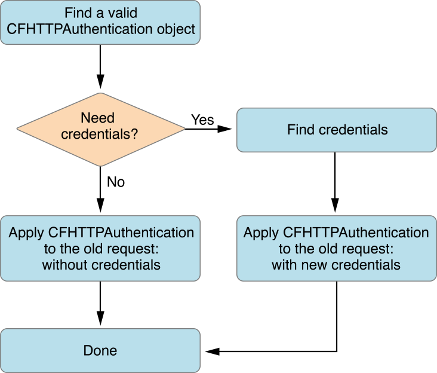
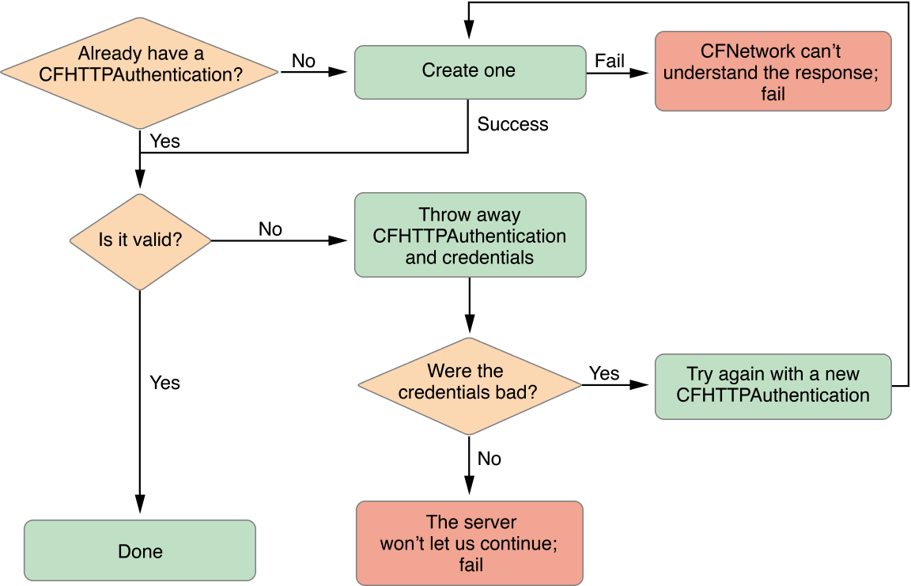

> 导航：[总目录](../../../README.md) · [documentation](../../../_indexes/documentation.md) · [CFNetwork Programming Guide](Introduction%20to%20CFNetwork%20Programming%20Guide.md)


[Next](Working%20with%20FTP%20Servers.md)[Previous](Communicating%20with%20HTTP%20Servers.md)

# Communicating with Authenticating HTTP Servers

This chapter describes how to interact with authenticating HTTP servers by taking advantage of the CFHTTPAuthentication API. It explains how to find matching authentication objects and credentials, apply them to an HTTP request, and store them for later use.

In general, if an HTTP server returns a 401 or 407 response following your HTTP request, it means that the server is authenticating and requires credentials. In the CFHTTPAuthentication API, each set of credentials is stored in a CFHTTPAuthentication object. Therefore, every different authenticating server and every different user connecting to that server requires a separate CFHTTPAuthentication object. To communicate with the server, you need to apply your CFHTTPAuthentication object to the HTTP request. These steps are explained in more detail next.

Adding support for authentication will allow your application to talk with authenticating HTTP servers (if the server returns a 401 or 407 response). Even though HTTP authentication is not a difficult concept, it is a complicated process to execute. The procedure is as follows:

1. The client sends an HTTP request to the server.
2. The server returns a challenge to the client.
3. The client bundles the original request with credentials and sends them back to the server.
4. A negotiation takes place between the client and server.
5. When the server has authenticated the client, it sends back the response to the request.

Performing this procedure requires a number of steps. A diagram of the entire procedure can be seen in Figure 4-1 and Figure 4-2.

__Figure 4-1__  Handling authentication



__Figure 4-2__  Finding an authentication object



When an HTTP request returns a 401 or 407 response, the first step is for the client to find a valid CFHTTPAuthentication object. An authentication object contains credentials and other information that, when applied to an HTTP message request, verifies your identity with the server. If you've already authenticated once with the server, you will have a valid authentication object. However, in most cases, you will need to create this object from the response with the `CFHTTPAuthenticationCreateFromResponse` function. See Listing 4-1.

__Listing 4-1__  Creating an authentication object

```
if (!authentication) {
    CFHTTPMessageRef responseHeader =
        (CFHTTPMessageRef) CFReadStreamCopyProperty(
            readStream,
            kCFStreamPropertyHTTPResponseHeader
        );

    // Get the authentication information from the response.
    authentication = CFHTTPAuthenticationCreateFromResponse(NULL, responseHeader);
    CFRelease(responseHeader);
}
```

If the new authentication object is valid, then you are done and can continue to the second step of [Figure 4-1](#apple-f4xwc4dqnrsv64tfmyxwi33df52wszbpkridgmbqgaytcmzsfvbuqobnknlti). If the authentication object is not valid, then throw away the authentication object and credentials and check to see if the credentials were bad. For more information about credentials, read "[Security Credentials](https://developer.apple.com/library/mac/qa/qa2001/qa1277.html)".

Bad credentials mean that the server did not accept the login information and it will continue to listen for new credentials. However, if the credentials were good but the server still rejected your request, then the server is refusing to speak with you, so you must give up. Assuming the credentials were bad, retry this entire process beginning with creating an authentication object until you get working credentials and a valid authentication object. In code, this procedure should look like the one in Listing 4-2.

__Listing 4-2__  Finding a valid authentication object

```
CFStreamError err;
if (!authentication) {
    // the newly created authentication object is bad, must return
    return;

} else if (!CFHTTPAuthenticationIsValid(authentication, &err)) {

    // destroy authentication and credentials
    if (credentials) {
        CFRelease(credentials);
        credentials = NULL;
    }
    CFRelease(authentication);
    authentication = NULL;

    // check for bad credentials (to be treated separately)
    if (err.domain == kCFStreamErrorDomainHTTP &&
        (err.error == kCFStreamErrorHTTPAuthenticationBadUserName
        || err.error == kCFStreamErrorHTTPAuthenticationBadPassword))
    {
        retryAuthorizationFailure(&authentication);
        return;
    } else {
        errorOccurredLoadingImage(err);
    }
}
```

Now that you have a valid authentication object, continue following the flowchart in [Figure 4-1](#apple-f4xwc4dqnrsv64tfmyxwi33df52wszbpkridgmbqgaytcmzsfvbuqobnknlti). First, determine whether you need credentials. If you don't, then apply the authentication object to the HTTP request. The authentication object is applied to the HTTP request in [Listing 4-4](#apple-f4xwc4dqnrsv64tfmyxwi33df52wszbpkridgmbqgaytcmzsfvbuqobnknlts) (`resumeWithCredentials`).

Without storing credentials (as explained in [Keeping Credentials in Memory](#apple-f4xwc4dqnrsv64tfmyxwi33df52wszbpkridgmbqgaytcmzsfvbuqobnknltm) and [Keeping Credentials in a Persistent Store](#apple-f4xwc4dqnrsv64tfmyxwi33df52wszbpkridgmbqgaytcmzsfvbuqobnknltk)), the only way to obtain valid credentials is by prompting the user. Most of the time, a user name and password are needed for the credentials. By passing the authentication object to the `CFHTTPAuthenticationRequiresUserNameAndPassword` function you can see if a user name and password are necessary. If the credentials do need a user name and password, prompt the user for them and store them in the credentials dictionary. For an NTLM server, the credentials also require a domain. After you have the new credentials, you can apply the authentication object to the HTTP request using the `resumeWithCredentials` function from [Listing 4-4](#apple-f4xwc4dqnrsv64tfmyxwi33df52wszbpkridgmbqgaytcmzsfvbuqobnknlts). This whole process is shown in Listing 4-3.

__Listing 4-3__  Finding credentials (if necessary) and applying them

```
// ...continued from Listing 4-2
else {
    cancelLoad();
    if (credentials) {
        resumeWithCredentials();
    }
    // are a user name & password needed?
    else if (CFHTTPAuthenticationRequiresUserNameAndPassword(authentication))
        {
        CFStringRef realm = NULL;
        CFURLRef url = CFHTTPMessageCopyRequestURL(request);

         // check if you need an account domain so you can display it if necessary
        if (!CFHTTPAuthenticationRequiresAccountDomain(authentication)) {
            realm = CFHTTPAuthenticationCopyRealm(authentication);
        }
        // ...prompt user for user name (user), password (pass)
        // and if necessary domain (domain) to give to the server...

        // Guarantee values
        if (!user) user = CFSTR("");
        if (!pass) pass = CFSTR("");

        CFDictionarySetValue(credentials, kCFHTTPAuthenticationUsername, user);
        CFDictionarySetValue(credentials, kCFHTTPAuthenticationPassword, pass);

        // Is an account domain needed? (used currently for NTLM only)
        if (CFHTTPAuthenticationRequiresAccountDomain(authentication)) {
            if (!domain) domain = CFSTR("");
            CFDictionarySetValue(credentials,
                                 kCFHTTPAuthenticationAccountDomain, domain);
        }
        if (realm) CFRelease(realm);
        CFRelease(url);
    }
    else {
        resumeWithCredentials();
    }
}
```


__Listing 4-4__  Applying the authentication object to a request

```
void resumeWithCredentials() {
    // Apply whatever credentials we've built up to the old request
    if (!CFHTTPMessageApplyCredentialDictionary(request, authentication,
                                                credentials, NULL)) {
        errorOccurredLoadingImage();
    } else {
        // Now that we've updated our request, retry the load
        loadRequest();
    }
}
```


If you plan on communicating with an authenticating server often, it may be worth reusing credentials to avoid prompting the user for the server's user name and password multiple times. This section explains the changes that should be made to one-time use authentication code (such as in [Handling Authentication](#apple-f4xwc4dqnrsv64tfmyxwi33df52wszbpkridgmbqgaytcmzsfvbuqobnknltg)) to store credentials in memory for reuse later.

To reuse credentials, there are three data structure changes you need to make to your code.

1. Create a mutable array to hold all the authentication objects.

```
CFMutableArrayRef authArray;
```

   instead of:

```
CFHTTPAuthenticationRef authentication;
```
2. Create a mapping from authentication objects to credentials using a dictionary.

```
CFMutableDictionaryRef credentialsDict;
```

   instead of:

```
CFMutableDictionaryRef credentials;
```
3. Maintain these structures everywhere you used to modify the current authentication object and the current credentials.

```
CFDictionaryRemoveValue(credentialsDict, authentication);
```

   instead of:

```
CFRelease(credentials);
```

Now, after creating the HTTP request, look for a matching authentication object before each load. A simple, unoptimized method for finding the appropriate object can be seen in Listing 4-5.

__Listing 4-5__  Looking for a matching authentication object

```
CFHTTPAuthenticationRef findAuthenticationForRequest {
    int i, c = CFArrayGetCount(authArray);
    for (i = 0; i < c; i ++) {
        CFHTTPAuthenticationRef auth = (CFHTTPAuthenticationRef)
                CFArrayGetValueAtIndex(authArray, i);
        if (CFHTTPAuthenticationAppliesToRequest(auth, request)) {
            return auth;
        }
    }
    return NULL;
}
```

If the authentication array has a matching authentication object, then check the credentials store to see if the correct credentials are also available. Doing so prevents you from having to prompt the user for a user name and password again. Look for the credentials using the `CFDictionaryGetValue` function as shown in Listing 4-6.

__Listing 4-6__  Searching the credentials store

```
credentials = CFDictionaryGetValue(credentialsDict, authentication);
```

Then apply your matching authentication object and credentials to your original HTTP request and resend it.

With these changes, you application will be able to store authentication objects and credentials in memory for use later.

Storing credentials in memory prevents a user from having to reenter a server's user name and password during that specific application launch. However, when the application quits, those credentials will be released. To avoid losing the credentials, save them in a persistent store so each server's credentials need to be generated only once. A keychain is the recommended place for storing credentials. Even though you can have multiple keychains, this document refers to the user's default keychain as _the_ keychain. Using the keychain means that the authentication information that you store can also be used in other applications trying to access the same server, and vice versa.

Storing and retrieving credentials in the keychain requires two functions: one for finding the credentials dictionary for authentication and one for saving the credentials of the most recent request. These functions will be declared in this document as:

```
CFMutableDictionaryRef findCredentialsForAuthentication(
        CFHTTPAuthenticationRef auth);

void saveCredentialsForRequest(void);
```

The function `findCredentialsForAuthentication` first checks the credentials dictionary stored in memory to see whether the credentials are cached locally. See [Listing 4-6](#apple-f4xwc4dqnrsv64tfmyxwi33df52wszbpkridgmbqgaytcmzsfvbuqobnknltq) for how to implement this.

If the credentials are not cached in memory, then search the keychain. To search the keychain, use the function `SecKeychainFindInternetPassword`. This function requires a large number of parameters. The parameters, and a short description of how they are used with HTTP authentication credentials, are:

**`keychainOrArray`**
: `NULL` to specify the user's default keychain list.

**`serverNameLength`**
: The length of `serverName`, usually `strlen(serverName)`.

**`serverName`**
: The server name parsed from the HTTP request.

**`securityDomainLength`**
: The length of security domain, or `0` if there is no domain. In the sample code, `realm ? strlen(realm) : 0` is passed to account for both situations.

**`securityDomain`**
: The realm of the authentication object, obtained from the `CFHTTPAuthenticationCopyRealm` function.

**`accountNameLength`**
: The length of `accountName`. Since the `accountName` is `NULL`, this value is `0`.

**`accountName`**
: There is no account name when fetching the keychain entry, so this should be `NULL`.

**`pathLength`**
: The length of `path`, or `0` if there is no path. In the sample code, `path ? strlen(path) : 0` is passed to account for both situations.

**`path`**
: The path from the authentication object, obtained from the `CFURLCopyPath` function.

**`port`**
: The port number, obtained from the function `CFURLGetPortNumber`.

**`protocol`**
: A string representing the protocol type, such as HTTP or HTTPS. The protocol type is obtained by calling the `CFURLCopyScheme` function.

**`authenticationType`**
: The authentication type, obtained from the function `CFHTTPAuthenticationCopyMethod`.

**`passwordLength`**
: `0`, because no password is necessary when fetching a keychain entry.

**`passwordData`**
: `NULL`, because no password is necessary when fetching a keychain entry.

**`itemRef`**
: The keychain item reference object, `SecKeychainItemRef`, returned upon finding the correct keychain entry

When called properly, the code should look like that in Listing 4-7.

__Listing 4-7__  Searching the keychain

```
didFind =
    SecKeychainFindInternetPassword(NULL,
                                    strlen(host), host,
                                    realm ? strlen(realm) : 0, realm,
                                    0, NULL,
                                    path ? strlen(path) : 0, path,
                                    port,
                                    protocolType,
                                    authenticationType,
                                    0, NULL,
                                    &itemRef);
```

Assuming that `SecKeychainFindInternetPassword` returns successfully, create a keychain attribute list (`SecKeychainAttributeList`) containing a single keychain attribute (`SecKeychainAttribute`). The keychain attribute list will contain the user name and password. To load the keychain attribute list, call the function `SecKeychainItemCopyContent` and pass it the keychain item reference object (`itemRef`) that was returned by `SecKeychainFindInternetPassword`. This function will fill the keychain attribute with the account's user name, and a `void **` as its password.

The user name and password can then be used to create a new set of credentials. Listing 4-8 shows this procedure.

__Listing 4-8__  Loading server credentials from the keychain

```
if (didFind == noErr) {

    SecKeychainAttribute     attr;
    SecKeychainAttributeList attrList;
    UInt32                   length;
    void                     *outData;

    // To set the account name attribute
    attr.tag = kSecAccountItemAttr;
    attr.length = 0;
    attr.data = NULL;

    attrList.count = 1;
    attrList.attr = &attr;

    if (SecKeychainItemCopyContent(itemRef, NULL, &attrList, &length, &outData)
        == noErr) {

        // attr.data is the account (username) and outdata is the password
        CFStringRef username =
            CFStringCreateWithBytes(kCFAllocatorDefault, attr.data,
                                    attr.length, kCFStringEncodingUTF8, false);
        CFStringRef password =
            CFStringCreateWithBytes(kCFAllocatorDefault, outData, length,
                                    kCFStringEncodingUTF8, false);
        SecKeychainItemFreeContent(&attrList, outData);

        // create credentials dictionary and fill it with the user name & password
        credentials =
            CFDictionaryCreateMutable(NULL, 0,
                                      &kCFTypeDictionaryKeyCallBacks,
                                      &kCFTypeDictionaryValueCallBacks);
        CFDictionarySetValue(credentials, kCFHTTPAuthenticationUsername,
                             username);
        CFDictionarySetValue(credentials, kCFHTTPAuthenticationPassword,
                             password);

        CFRelease(username);
        CFRelease(password);
    }
    CFRelease(itemRef);
}
```

Retrieving credentials from the keychain is only useful if you can store credentials in the keychain first. The steps are very similar to loading credentials. First, see if the credentials are already stored in the keychain. Call `SecKeychainFindInternetPassword`, but pass the user name for `accountName` and the length of `accountName` for `accountNameLength`.

If the entry exists, modify it to change the password. Set the `data` field of the keychain attribute to contain the user name, so that you modify the correct attribute. Then call the function `SecKeychainItemModifyContent` and pass the keychain item reference object (`itemRef`), the keychain attribute list, and the new password. By modifying the keychain entry rather than overwriting it, the keychain entry will be properly updated and any associated metadata will still be preserved. The entry should look like the one in Listing 4-9.

__Listing 4-9__  Modifying the keychain entry

```
// Set the attribute to the account name
attr.tag = kSecAccountItemAttr;
attr.length = strlen(username);
attr.data = (void*)username;

// Modify the keychain entry
SecKeychainItemModifyContent(itemRef, &attrList, strlen(password),
                             (void *)password);
```

If the entry does not exist, then you will need to create it from scratch. The function `SecKeychainAddInternetPassword` accomplishes this task. Its parameters are the same as `SecKeychainFindInternetPassword`, but in contrast with the call to `SecKeychainFindInternetPassword`, you supply `SecKeychainAddInternetPassword` both a user name and a password. Release the keychain item reference object following a successful call to `SecKeychainAddInternetPassword` unless you need to use it for something else. See the function call in Listing 4-10.

__Listing 4-10__  Storing a new keychain entry

```
SecKeychainAddInternetPassword(NULL,
                               strlen(host), host,
                               realm ? strlen(realm) : 0, realm,
                               strlen(username), username,
                               path ? strlen(path) : 0, path,
                               port,
                               protocolType,
                               authenticationType,
                               strlen(password), password,
                               &itemRef);
```


Authenticating firewalls is very similar to authenticating servers except that every failed HTTP request must be checked for both proxy authentication and server authentication. This means that you need separate stores (both local and persistent) for proxy servers and origin servers. Thus, the procedure for a failed HTTP response will now be:

- Determine whether the response's status code was 407 (a proxy challenge). If it is, find a matching authentication object and credentials by checking the local proxy store and the persistent proxy store. If neither of those has a matching object and credentials, then request the credentials from the user. Apply the authentication object to the HTTP request and try again.
- Determine whether the response's status code was 401 (a server challenge). If it is, follow the same procedure as with a 407 response, but use the origin server stores.

There are also a few minor differences to enforce when using proxy servers. The first is that the arguments to the keychain calls come from the proxy host and port, rather than from the URL for an origin server. The second is that when asking the user for a user name and password, make sure the prompt clearly states what the password is for.

By following these instructions, your application should be able to work with authenticating firewalls.

[Next](Working%20with%20FTP%20Servers.md)[Previous](Communicating%20with%20HTTP%20Servers.md)

