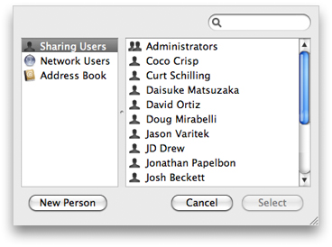

> 导航：[总目录](../../../README.md) · [documentation](../../../_indexes/documentation.md) · [Identity Services Programming Guide](Introduction%20to%20Identity%20Services%20Programming%20Guide.md)


[Next](Finding%20and%20Monitoring%20Identities.md)[Previous](Identity%20Services%20Overview.md)

# Using the Identity Picker

Most applications that use identities require someone to select users to be added to an access control list (ACL). Enter the Identity Picker. The Identity Picker is managed by the `CBIdentityPicker` class in the Collaboration framework. It allows users an easy interface for not only selecting identities but also for promoting entries in the Address Book to sharing users. As an application developer, no extra work is needed to allow users to create identities; this capability comes free from invoking the Identity Picker. This chapter describes how to customize the Identity Picker for your application and how to invoke the correct implementation of the Identity Picker.



For every Identity Picker your application requires, you should create a separate instance of the `CBIdentityPicker` class.

The ability of the Identity Picker to select multiple entries at once is a customizable feature. By default, the Identity Picker does not allow multiple selections. To change the default setting, call the `setAllowsMultipleSelection:` method and pass the value `YES`. See Listing 2-1 for an example of how to use these methods.

__Listing 2-1__  Customizing an `CBIdentityPicker` instance

```
// Instantiate an ABIdentityPicker object.
CBIdentityPicker *picker = [[CBIdentityPicker alloc] init];

// Allow the Identity Picker to select multiple entries.
[picker setAllowsMultipleSelection:YES];
```


The `beginSheetModalForWindow:modalDelegate:didEndSelector:contextInfo:` method invokes the Identity Picker as a sheet.

The first argument is the window in which the sheet should open. In most cases, this is `[sender window]`. The `modalDelegate` argument is the delegate object. The `didEndSelector` argument is the method that will be called when the user selects identities and chooses either the OK or Cancel button. It should be a method that contains three arguments of its own: a `CBIdentityPicker` object, a return code, and a context. Finally, the `contextInfo` argument is any object you want sent to the delegate method.

__Listing 2-2__  Invoking the Identity Picker sheet

```objc
- (IBAction)plusButton:(id)sender
{
    [picker beginSheetModalForWindow:[sender window]
            modalDelegate:self
            didEndSelector:@selector(identityPickerDidEnd:returnCode:contextInfo:)
            contextInfo:nil];
}
```

When the user closes the Identity Picker, the delegate method (`identityPickerDidEnd:identities:contextInfo:`) is called. This method passes the selected identities as an array of `CBIdentity` objects and the context defined by the method `beginSheetModalForWindow:modalDelegate:didEndSelector:contextInfo:`. See Listing 2-3.

__Listing 2-3__  Retrieving identities from the Identity Picker

```objc
- (void)identityPickerDidEnd:(CBIdentityPicker *)identityPickerController returnCode:(NSInteger)returnCode contextInfo:(void *)contextInfo
{
    NSEnumerator *enumerator = [[identityPickerController identities] objectEnumerator];
    CBIdentity *nextIdentity;

    while (nextIdentity = [enumerator nextObject]) {

        //Do something interesting with the nextIdentity object

    }
}
```


To use the Identity Picker modal dialog, call the method `runModal`. This method invokes the modal identity picker. If the user selects the OK button in the Identity Picker window, you can return the selected identities with the `identities` method. The `identities` method returns an array of `CBIdentity` objects. See Listing 2-4.

__Listing 2-4__  Invoking the modal Identity Picker

```objc
- (IBAction)plusButton:(id)sender
{
    NSArray *identities;
    NSEnumerator *enumerator;
    CBIdentity *nextIdentity;

    if ([picker runModal] == NSOKButton) {
        identities = [picker identities];
        enumerator = [identities objectEnumerator];

        // Enumerate over the returned identities
        while ((nextIdentity = [enumerator nextObject])) {

            // Do something interesting with the identity object
        }
    }
}
```

[Next](Finding%20and%20Monitoring%20Identities.md)[Previous](Identity%20Services%20Overview.md)

