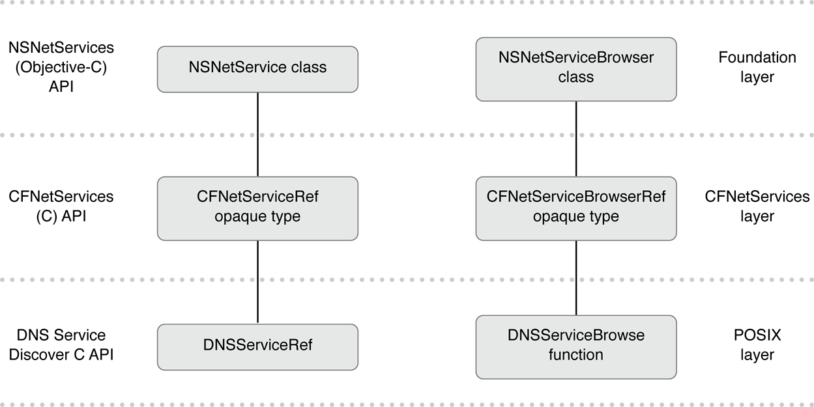

> 导航：[总目录](../../../README.md) · [documentation](../../../_indexes/documentation.md)

[Next](Foundation%20Network%20Services%20Architecture.md)

# About NSNetServices and CFNetServices

The `NSNetService` class and the `CFNetServices` C API provide high-level abstractions for advertising, browsing, discovering, and resolving Bonjour services. After publishing or discovering a service, your app is responsible for providing networking code to do the actual communication.

Both the `NSNetService` class and the `CFNetServices` C API are based on run loops, and can be integrated with your own networking code written using CFNetwork or Foundation networking APIs.

The [NSNetService](https://developer.apple.com/documentation/foundation/netservice) class is a Cocoa class that provides easy integration with GUI apps, Foundation run loops, and the `NSStream` family of networking classes. If you are writing Bonjour code to interface with code at this level, you should generally use the `NSNetService` class.

The `CFNetServices` API (described in _CFNetServices Reference_) is a CFNetwork-based class that provides easy integration with the CFNetwork family of networking APIs. If you are writing Bonjour code to interface with Core Foundation–level code, you can use either the `CFNetServices` API or the `NSNetService` class.

Whether you want to use the `NSNetService` class or the `CFNetServices` API, read [Foundation Network Services Architecture](Foundation%20Network%20Services%20Architecture.md#apple-f4xwc4dqnrsv64tfmyxwi33df52wszbpkridimbqgazdkmrvfvjvomi) to gain an understanding of the Foundation classes available. These Foundation classes map fairly neatly onto `CFNetServices` opaque types; only the names and calling conventions differ.

Next, decide what Bonjour tasks your app needs to perform and read the appropriate chapter or chapters for the Foundation-level API (even if you intend to use the `CFNetServices` API). These chapters provide conceptual information about how to perform each task, along with code snippets based on the Foundation-level API.

Next, if you want to use the lower-level CFNetwork-based API, read [Using CFNetServices](Using%20CFNetServices.md#apple-f4xwc4dqnrsv64tfmyxwi33df52wszbpgmydambrgi3tmlktk4zq), which provides code snippets that show you how to do so.

Finally, if you want to provide additional user control over which domains your app uses when browsing for or advertising services, read the appendix, [Browsing for Domains](Browsing%20for%20Domains.md#apple-f4xwc4dqnrsv64tfmyxwi33df52wszbpkridgmbqgaytenzvfvjvony).

This document assumes that you are familiar with Bonjour, and have already read _[Bonjour Overview](../../Cocoa/Bonjour%20Overview/About%20Bonjour.md#apple-f4xwc4dqnrsv64tfmyxwi33df52wszbpgeydambqgeyts2i)_. This document also assumes that you are familiar with OS X and iOS networking as a whole, including the concepts described in _[Networking Overview](../../Networking%20Internet%20Web/Networking%20Overview/About%20Networking.md#apple-f4xwc4dqnrsv64tfmyxwi33df52wszbpkridimbqgeydemrq)_.

[Next](Foundation%20Network%20Services%20Architecture.md)

