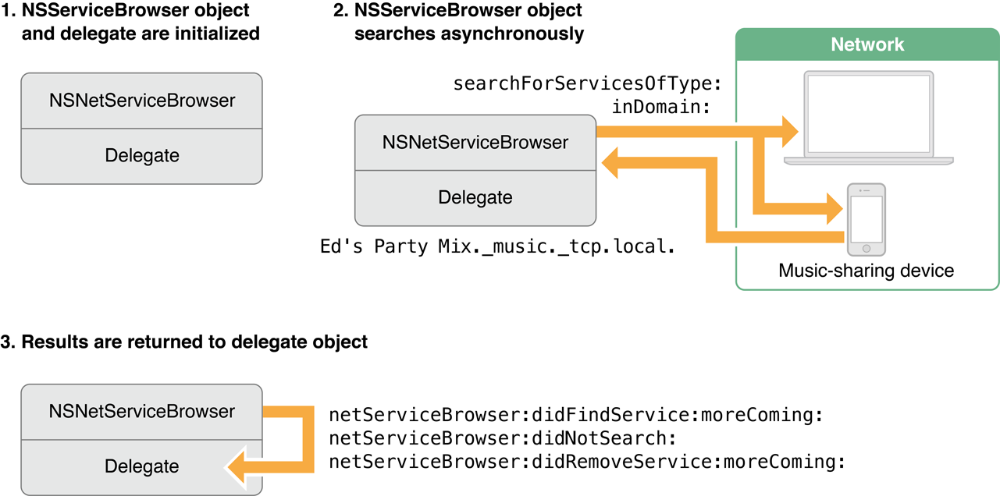
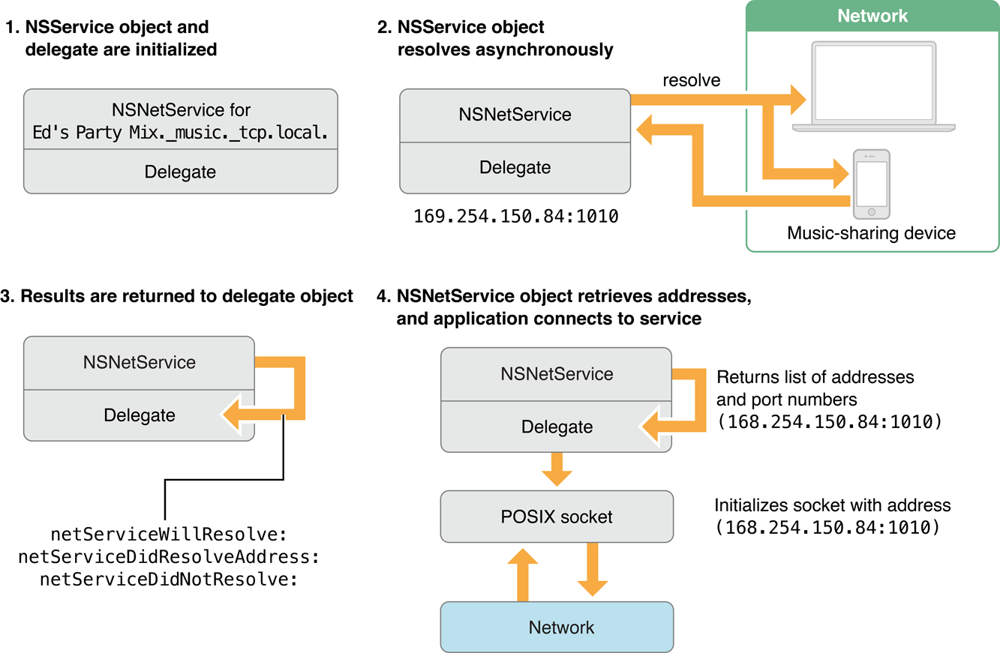

> 导航：[总目录](../../../README.md) · [documentation](../../../_indexes/documentation.md) · [NSNetServices and CFNetServices Programming Guide](About%20NSNetServices%20and%20CFNetServices.md)

[Next](Publishing%20Network%20Services.md)[Previous](About%20NSNetServices%20and%20CFNetServices.md)

# Foundation Network Services Architecture

The architecture for Bonjour network services in the Foundation framework is designed so that you do not need to understand the details of DNS record management, instead letting you manage services in terms of the four fundamental operations defined for Bonjour network services:

- Advertising a service, a process known as _publication_
- Browsing for available services, also called _service discovery_
- Connecting to services directly (the preferred technique)
- Resolving services (translating service names into something that lets you connect to them)

To support these operations, the Foundation framework defines two classes—one that you use to browse for services and domains, and one that represents an individual service.

The [NSNetServiceBrowser](https://developer.apple.com/documentation/foundation/netservicebrowser) class has two purposes: browsing for services and browsing for Bonjour domains. At any given time, a single `NSNetServiceBrowser` object can execute at most one search operation; if you need to search for multiple types of services at once, use multiple `NSNetServiceBrowser` objects.

When browsing for a specific type of service—for example, searching for FTP services on the local network—this class provides you with filled-out instances of [NSNetService](https://developer.apple.com/documentation/foundation/netservice) for each remote service.

When browsing for domains, whether for registration or browsing, this class provides you with a list of available domain names. (Note that domain browsing is outside the scope of this chapter. For step-by-step instructions and code examples about domain browsing, and guidance about how to use browsing in your code, read [Browsing for Domains](Browsing%20for%20Domains.md#apple-f4xwc4dqnrsv64tfmyxwi33df52wszbpkridgmbqgaytenzvfvjvony).)

The [NSNetService](https://developer.apple.com/documentation/foundation/netservice) class represents a single service (either a remote service that your app wants to use or a local service that your app is publishing). Instances of this class are involved in all of the Bonjour operations described in this chapter.

`NSNetService` objects that represent remote services come preinitialized with the service name, type, and domain, but no host name, IP address or port number. The name, type, and domain are used to resolve the instance into the information needed to connect to the service (IP addresses and port number) upon request.

`NSNetService` objects used for publishing local services to the network must be initialized (by your code) with the service name, type, domain, and port number. Bonjour uses this information to announce the availability of your service over the network.

Because network discovery can take a long time to complete, the `NSNetService` and `NSNetServiceBrowser` classes perform all their operations asynchronously. The methods provided by `NSNetService` and `NSNetServiceBrowser` return immediately. As a result, your app can continue executing while network operations take place.

Both classes require delegate objects in your app that must implement appropriate methods to handle the resulting data. In some cases, these classes may call your delegate methods more than once, providing additional data with each call.

The `NSNetService` class handles service publication. To publish a service:

1. The app sets up a socket and begins listening for incoming connections on that socket, as described in _[Networking Programming Topics](../../Networking%20Internet/Networking%20Programming%20Topics/Introduction.md#apple-f4xwc4dqnrsv64tfmyxwi33df52wszbpkridimbqgezdioby)_.
2. The app initializes an `NSNetService` object, providing the port number, the name of the service, and domain information, and then sets up a delegate object to receive results. The object automatically schedules itself with the current run loop.
3. The app sends a message to the `NSNetService` object, requesting that the service be published to the network, and publication proceeds asynchronously.
4. The `NSNetService` object calls its delegate with information about the status of the publication.

When the service has been successfully published, the delegate is notified. If publication fails for any reason, the delegate is also notified, along with appropriate error information. If publication proceeds successfully, no further messages are sent to the delegate.

For step-by-step instructions and code examples about service publication, see [Publishing Network Services](Publishing%20Network%20Services.md#apple-f4xwc4dqnrsv64tfmyxwi33df52wszbpgiydambrga3tmlkcineuercci5bq).

To discover services advertised on the network, you use the [NSNetServiceBrowser](https://developer.apple.com/documentation/foundation/netservicebrowser) class, as shown in Figure 1-1.

__Figure 1-1__  Service discovery with `NSNetServiceBrowser`

In step 1, the app initializes an `NSNetServiceBrowser` object and associates a delegate object with it. In step 2, the `NSNetServiceBrowser` object searches asynchronously for services. In step 3, results are returned to the delegate object in the form of `NSNetService` objects.

Step 3 usually occurs multiple times. Initially, the browser calls you once for each service that it currently knows about. When it calls your delegate method with the last of these currently known services, it passes `NO` for the `moreComing` parameter.

However, because the browser object continues to browse until your app explicitly tells it to stop, your delegate learns about new services as they come online and learns about the disappearance of services as they shut down. As a result, your `didFindService:moreComing:` method may be called with new services even after you get a `moreComing` value of `NO`.

For step-by-step service discovery instructions and sample code snippets, read [Browsing for Network Services](Browsing%20for%20Network%20Services.md#apple-f4xwc4dqnrsv64tfmyxwi33df52wszbpgiydambrga3tolkcineuerkiincq).

To connect to a Bonjour-advertised service, an app typically calls a method such as [getInputStream:outputStream:](https://developer.apple.com/documentation/foundation/netservice/1418325-getinputstream), which provides a stream or pair of streams for communicating with the service (as shown in Figure 1-2). When the app opens that stream, the stream object itself connects to the Bonjour service in the same way that it would connect if you had passed it a hostname. The stream object, in turn, uses the `NSNetService` object to perform DNS lookups on its behalf.

__Figure 1-2__  Connecting to a Bonjour Service (`NSNetService`)

!

Although the steps above describe the recommended way to connect to a Bonjour-advertised service, you can also connect in two other ways:

- By resolving the `NSNetService` object, and then asking the `NSNetService` object to provide the service’s hostname, then passing that hostname to a connect-by-name API.
- By asking the `NSNetService` object to resolve the service to a set of IP addresses (as described in [Resolving Services Manually](#apple-f4xwc4dqnrsv64tfmyxwi33df52wszbpkridimbqgazdkmrvfu4tqnjqge)), and then attempting to connect to the host yourself. This technique is discouraged, however, because of the complexity caused by multihoming.

For step-by-step service connection instructions and sample code snippets, read [Connecting to and Monitoring Network Services](Connecting%20to%20and%20Monitoring%20Network%20Services.md#apple-f4xwc4dqnrsv64tfmyxwi33df52wszbpgiydambrga3tqlkdjjbeircdifba).

In the most common usage, resolution is performed transparently, either when you connect to a service by calling a connect-to-service method such as [getInputStream:outputStream:](https://developer.apple.com/documentation/foundation/netservice/1418325-getinputstream) or when you later reconnect to a service using a name obtained by calling [hostName](https://developer.apple.com/documentation/foundation/nsnetservice/1413300-hostname) on an already resolved service object.

If for some reason you need to know the actual IP addresses for a service, you can also ask the object to resolve a service name explicitly. To prevent your app from slowing down, resolution takes place asynchronously, returning results or error messages to the `NSNetService` object’s delegate. If valid addresses were found for the service, your app can use them to make a socket connection.

Figure 1-3 illustrates this process.

__Figure 1-3__  Service resolution with `NSNetService`

In step 1, the app either explicitly initializes or otherwise obtains an `NSNetService` instance for the service—in this case a local `music` service over TCP called `Ed's Party Mix`. In step 2, the `NSNetService` object receives a `resolve` message. The resolution proceeds asynchronously, and at some point it receives an IP address and port number for the service (`169.254.150.84:1010`). In step 3, the delegate is notified, and in step 4, the delegate asks the `NSNetService` object for a list of addresses and a port number. A service can have multiple IP addresses, but always has exactly one port.

For step-by-step service resolution instructions and sample code snippets, read [Connecting to and Monitoring Network Services](Connecting%20to%20and%20Monitoring%20Network%20Services.md#apple-f4xwc4dqnrsv64tfmyxwi33df52wszbpgiydambrga3tqlkdjjbeircdifba).

[Next](Publishing%20Network%20Services.md)[Previous](About%20NSNetServices%20and%20CFNetServices.md)

