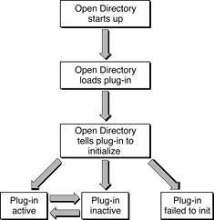

> 导航：[总目录](../../../README.md) · [documentation](../../../_indexes/documentation.md) · [Open Directory Plug-in Programming Guide](Introduction.md)

[Next](Required%20Entry%20Points.md)[Previous](Introduction.md)

# Retired Document

__Important:__
Support for DirectoryService plug-ins has been deprecated and will be removed in a future release.

A new architecture was introduced in OS X v10.9 to allow the creation of native Open Directory modules. Unlike DirectoryService, `opendirectoryd` uses modules implemented as a standalone process that uses XPC to communicate with `opendirectoryd`. Implementing a module as an XPC service ensures a private address space and improves security and reliability, because modules cannot crash another module or `opendirectoryd`.

# Runtime Environment

[Figure 1-1](#apple-f4xwc4dqnrsv64tfmyxwi33df52wszbpkridimbqgaydsmjyfvbuqmznge2dimju) summarizes the flow of events that occur with regard to plug-ins when Open Directory starts up.

__Figure 1-1__  Open Directory startup and plug-in states

When Open Directory starts up, it uses the CFBundle mechanism to load into memory each plug-in that it finds in the following directories:

- `/System/Library/Frameworks/DirectoryService.framework/Resources/Plugins`
- `/Library/DirectoryServices/PlugIns`

The `/Library/DirectoryServices/PlugIns` directory is the recommended location for your plug-in.

After a plug-in loads, it is in the “loaded but not initialized” state. For each successfully loaded plug-in, Open Directory calls the plug-in’s Initialize entry point. If a plug-in fails to initialize itself, it is in the “failed to initialize” state. When a plug-in successfully initializes itself, it enters the “active” state. In response to settings in the Directory Access application, Open Directory may tell an active plug-in to become inactive or an inactive plug-in to become active at any time.

Loading of plug-ins that are not configured to be loaded at startup is deferred until loading the plug-in becomes absolutely necessary when, for example an application opens a node for which the as-yet-unloaded plug-in is responsible. Search requests from clients such as the automounter can also cause a plug-in to be loaded. This type of deferred plug-in loading is know as _lazy loading_.

Prior to OS X v10.4, plug-ins that were disabled by the Directory Access application were loaded if an event occurred to trigger lazy loading. Starting with OS X v10.4, plug-ins that have been disabled by the Directory Access application are not longer subject to lazy loading. This change allows disabled plug-ins to be configured without the risk of them being inadvertently loaded.

A plug-in that is in the active or inactive state can only be called through certain entry points:

- In the active state, the plug-in can be called through its periodic task, process request, shutdown, and set plug-in state entry points.
- In the inactive state, the plug-in can be called through its periodic task, set plug-in state, and shutdown entry points.

In three special cases, an inactive plug-in can be called through its process entry point:

- when a node having the same name as the plug-in is opened in order to configure the plug-in. For example, when inactive, the LDAPv3 plug-in’s process entry point is called when an application opens the node `/LDAPv3` and calls `dsDoPluginCustomCall` to configure the plug-in.

- after the plug-in is loaded and initialized in order to receive the `sHeader` structure. The `fContextData` field of that structure contains the DirectoryService daemon’s current run loop, which your plug-in can use to set timers.
- after the plug-in is loaded and initialized in order to receive the Kerberos mutex.

Entry points are described in the next chapter, [Required Entry Points](Required%20Entry%20Points.md#apple-f4xwc4dqnrsv64tfmyxwi33df52wszbpkridimbqgaydsmjyfvbuqnbnknltc)

[Next](Required%20Entry%20Points.md)[Previous](Introduction.md)
