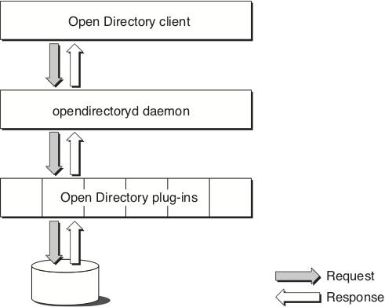
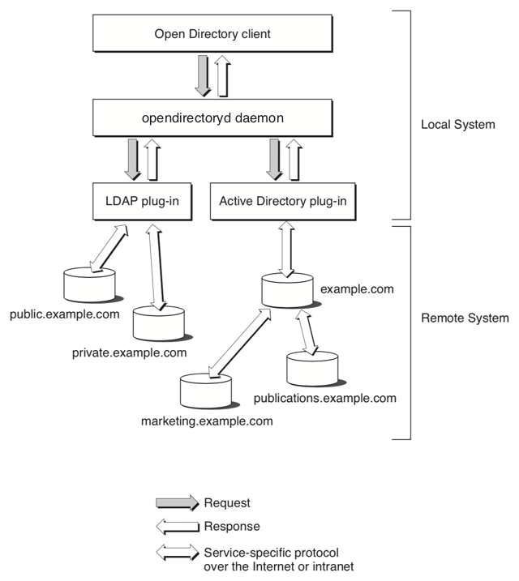

> 导航：[总目录](../../../README.md) · [documentation](../../../_indexes/documentation.md) · [Open Directory Programming Guide](Introduction.md)


[Next](Working%20with%20Sessions%20and%20Nodes.md)[Previous](Introduction.md)

# Concepts

Open Directory is a directory service architecture. Its programming interface provides a centralized way for applications and services to retrieve information stored in directories. Often, the information that is being sought is configuration information stored in a directory server or in flat files, with each file having its own record format and field delimiters. Examples of configuration information include users and groups (`/etc/passwd` and `/etc/group`), and automount information (`/mounts`). Open Directory uses standard record types and attributes to describe configuration information so that Open Directory clients have no need to know the details of record formats and data encoding.

Open Directory’s primary protocol is LDAPv3. Open Directory provides seamless and automatic integration of Apple’s directory services and third-party directory services including Active Directory, iPlanet and OpenLDAP.

## Open Directory Overview

Open Directory consists of the opendirectoryd daemon and Open Directory plug-ins. Apple provides Open Directory plug-ins for LDAPv3, Active Directory, BSD flat files, NIS, and the local DS data store. Each of these plug-ins provides information from its data source for all supported Directory Service data types. For information on writing your own Open Directory plug-in, see _[Open Directory Plug-in Programming Guide](../Open%20Directory%20Plug-in%20Programming%20Guide/Introduction.md#apple-f4xwc4dqnrsv64tfmyxwi33df52wszbpkridimbqgaydsmjy)_.

__Figure 1-1__  Flow of an Open Directory request



The Open Directory programming interface identifies the basic features that are common to many directory services and provides the functions necessary to support the development of high-quality applications that can work with a wide range of dissimilar directory services.

### Nodes

From the viewpoint of Open Directory, a directory service is a collection of one or more nodes, where a node is a place that can be searched for information. Each LDAP service configured by the Directory Utility tool is a separate node. The following rules apply to nodes.

- A node is either the root of a directory or a child of another node.
- A registered node is a node that an Open Directory plug-in has registered with Open Directory or that an administrator has registered using the Directory Utility tool.
- A node is a collection of records and child nodes.
- A record can belong only to one node. Augmented records can contain information across multiple nodes, but they still belong to a single node.
- A record has a type and can be of no more than one type. Examples of record types include user records and group records.
- A record has a name and type that together make the record unique within its node. For example, there can’t be two user records that have the name “admin,” but there can be a user record named “admin” and a group record named “admin” within the same node.
- Nodes and records can contain any number of attributes.
- An attribute can have a value. Certain attributes can have more than one value.
- An attribute value is arbitrary data whose structure is unknown to the Open Directory programming interface. Open Directory clients are responsible for interpreting the value of any particular attribute.

Figure 1-2 shows how Open Directory and the Open Directory LDAPv3 plug-ins might locate nodes over a network.

__Figure 1-2__  An Open Directory request over a network



Given the topology shown in Figure 1-2, the Open Directory function for listing registered nodes (`ODSessionCopyNodeNames`) might return the following list:

```
/LDAPv3/private.example.com
/LDAPv3/public.example.com
```

The first part of the node name (`LDAPv3` in this example) is the name of the plug-in that handles that node.

__Note:__ An Open Directory plug-in is not required to return information that conforms exactly to the information that the directory service maintains. A plug-in can generate information “on the fly.” In addition, a plug-in may not return information about certain nodes; the plug-in's behavior in this respect can be configurable.

### Search Policies and Search Nodes

A search policy defines the locations that are to be searched and the order in which those locations are searched in order to get certain kinds of information.

Search nodes implement search policies, which are configured by administrators through the Directory Utility application. Search nodes are easy for Open Directory applications to find and are guaranteed to always be available. When an Open Directory client application uses a search node to search for information, it can request the fully qualified path for any record that matches a specific search criteria. As a result, Open Directory can perform extremely precise searches with a high degree of control over the type of information that is returned.

There are four search node types:

- __Authentication search node.__ Use this search node when you are looking for information that is needed to authenticate a user. Use the pattern matching constant `kODNodeTypeAuthentication` to locate the authentication search node. Examples of applications that use the authentication search node include the login window and applications that set System Preferences.
- __Contacts search node.__ Use this search node when you are looking for contact information, such as an e-mail address, a telephone number, or a street address. Use the pattern matching constant `kODNodeTypeContacts` to locate the contacts search node. Mail.app and Address Book use the contacts search node to look up e-mail addresses and other types of contact information.
- __Network search node.__ Use this search node, which consolidates all of the nodes that are local to a machine for service discovery purposes, to find services on the local network. When third-party Open Directory plug-ins are loaded, they register their nodes with Open Directory so they can be found by the network search node. Use the pattern matching constant `kODNodeTypeNetwork` to locate the network search node.
- __Locally hosted nodes.__ Use a locally hosted node to find domains stored on this machine (that is, the local domain plus any shared domains that are running locally). The backend data storage for this node is in the form of plist files stored in `/var/db/dslocal`. The local directory service node is always queried first when using the authentication search node. The local directory service node is referenced with `/Local/Default`. You can also use the pattern matching constant `kODNodeTypeLocalNodes` to locate the local directory service node.

### Record Types

Apple has defined a series of standard record types. The standard record types include but are not limited to user records, group records, machine records, and printer records.

Providers of services can define their own record types (known as native record types) and are encouraged to publish information about them. Developers are encouraged to use Apple’s standard record types whenever possible. For a list of standard record types, see `Record_Types`.

### Standard Attribute Types

Apple has defined a series of standard attributes. Developers can define their own attributes (known as native attributes). An attribute can be required or optional. Each record type defines the attributes that it requires.

Open Directory clients are responsible for interpreting the value of any particular attribute. All configuration and discovery of information in the directory service can be accomplished by requesting the appropriate attribute value.

See `General Attribute Types` and `Configuration Attribute Types` for the complete list of attributes.

### Native Attribute Types

Developers can define their own attributes (known as native attributes). Open Directory maps the namespace of each directory system onto native types, while the standard types are the same across all Open Directory plug-ins.

### Plug-ins

Open Directory plug-ins provide an interface between Open Directory and a particular data store. You can configure Open Directory plug-ins in the Accounts pane of System Preferences or with the Directory Utility application.

### Authentication

Open Directory supports authentication on a per-user basis. User records have an authentication authority attribute that specifies:

- The type of authentication that is to be used to authenticate a particular user
- All of the information required to use the specified authentication method, such as encoded password information

__Note:__ The information in this section is of interest to Open Directory clients that create user records or that want to change the authentication authority for a user. These clients must write the authentication authority attribute and may have to do a set password operation to have the change take effect. Open Directory clients that only do directory native authentication or that only change existing passwords do not need to interpret the authentication authority attribute because the Open Directory plug-ins handle the supported authentication authority attribute values.

OS X supports the following types of authentication:

- Basic, which supports crypt password authentication. For more information, see [Basic Authentication](#apple-f4xwc4dqnrsv64tfmyxwi33df52wszbpkridimbqgaydsmjxfvbuqmzngy4denzq).
- Apple Password Server authentication, which uses an OS X Password Server to perform authentication. For more information, see [Apple Password Server Authentication](#apple-f4xwc4dqnrsv64tfmyxwi33df52wszbpkridimbqgaydsmjxfvbuqmzngy4dgmjs).
- Shadow Hash authentication, which uses salted SHA-1 hashes. The hash type of can be configured using the authentication authority data. By default, NT and LAN Manager hashes are not stored in local files, but storing them in local files can be enabled. This is the default authentication for this version of OS X. For more information, see [Shadow Hash Authentication](#apple-f4xwc4dqnrsv64tfmyxwi33df52wszbpkridimbqgaydsmjxfvbuqmzngy4dinzu).
- Local Cached User authentication, which is appropriate for mobile home directories using directory-based authentication such as LDAP. For more information, see [Local Cached User Authentication](#apple-f4xwc4dqnrsv64tfmyxwi33df52wszbpkridimbqgaydsmjxfvbuqmzngy4dkmry).
- Kerberos Version 5 authentication, which is used to authenticate users to Kerberos v5 systems. For more information, see [Kerberos Version 5 Authentication](#apple-f4xwc4dqnrsv64tfmyxwi33df52wszbpkridimbqgaydsmjxfvbuqmzngy4dkojz).
- Disabled User authentication, which prevents any authentication from taking place. For more information, see [Disabled User Authentication](#apple-f4xwc4dqnrsv64tfmyxwi33df52wszbpkridimbqgaydsmjxfvbuqmzngy4dmojx).

__Note:__ For compatibility with previous versions of OS X, user records that do not have an authentication authority attribute are authenticated using Basic password authentication.

User records contain an optional authentication authority attribute. The authentication authority attribute can have one or more values specifying how authentication and password changing should be conducted for that user. The format of this attribute is a semicolon-delimited string consisting of fields in the following order:

- __Version.__ A numeric value that identifies the structure of the attribute. This field is currently not used and usually is blank. This field may contain up to three 32-bit integer values (ASCII 0–9) separated by periods (.). If this field is empty or its value is 1, the version is consideration to be 1.0.0. If the second or the third field is empty; the version is interpreted as 0. Most client software will only needs to check the first digit of the version field. This field cannot contain a semi-colon (;) character.
- __Authority tag.__ A string value containing the authentication type for this user. Each authentication type defines the format of the authority data field and specifies how the authority data field is interpreted. The authority tag field is treated as a UTF8 string in which leading, embedded, and trailing spaces are significant. When compared with the list of known types of authentication, the comparison is case-insensitive. Open Directory clients that encounter an unrecognized type of authentication must treat the authentication attempt as a failure. This field cannot contain a semi-colon character.
- __Authority data.__ A field whose value depends on the type of authentication in the authority tag field. This field may be empty and is allowed to contain semi-colon characters.

#### Basic Authentication

An Open Directory client that encounters a user record containing the Basic authentication type should conduct authentication with crypt password authentication.

If the user record does not have an authentication authority attribute, the Open Directory client should use the Basic authentication type.

Here are some examples of authentication authority attributes that use the Basic authentication type:

```
;basic;
1.0.0;basic;
1;basic;
```

All three examples have the same result: authentication is conducted using crypt.

#### Apple Password Server Authentication

The Apple Password Server authentication type requires an Open Directory client to contact a Simple Authentication and Security Layer (SASL) password server at the network address stored in the authority data field. After contacting the Password Server, the Open Directory client can interrogate it to determine an appropriate network-based authentication method, such as CRAM-MD5, APOP, NT, LAN Manager, DHX, or Web-DAV Digest. Note that the Password Server’s administrator may disable some authentication methods in accordance with local security policies.

The authority data field must contain two strings separated by a single colon (:) character. The first string begins with a SASL ID. The SASL ID is provided to the Password Server to identify who is attempting to authenticate. Apple’s Password Server implementation uses a unique pseudo-random 128-bit number encoded as hex-ASCII assigned when the password was created to identify user passwords in its private password database. However, Open Directory clients should not assume that the first string will always be a fixed-size value or a simple number.

The SASL ID is followed by a comma (`,`) and a public key, which is used when the client challenges the Password Server before authentication begins to confirm that the Password Server is not being spoofed.

The second string is a network address consisting of two sub-strings separated by the slash (`/`) character. The first substring is optional and indicates the type of network address specified by the second substring. The second substring is the actual network address. If the first substring and the slash character are not specified, the second substring is assumed to be an IPv4 address.

If specified, there are three possible values for the first substring:

- __IPv4.__ The client can expect the second substring to contain a standard 32-bit IPv4 network address in dotted decimal format.
- __IPv6.__ The client can expect the second substring to contain a standard 64-bit IPv6 network address.
- __dns.__ The client can expect the second substring to contain a fully qualified domain name representing the network location of the password server.

If the authority data field is missing or malformed, the entire authentication authority attribute value must be ignored and any attempt to authenticate using it must be failed.

In the following example of an authentication authority attribute for OS X Password Server authentication, the version field is empty, so the version is assumed to 1.0.0. The SASL ID is `0x3d069e157be9c1bd0000000400000004`. The IP address is not preceded by `ipv6/`, so the IP address is assumed to be an IPv4 address.

```
;ApplePasswordServer;0x3d069e157be9c1bd0000000400000004,1024 35
16223833417753121496884462913136720801998949213408033369934701878980130072
13381175293354694885919239435422606359363041625643403628356164401829095281
75978839978526395971982754647985811845025859418619336892165981073840052570
65700881669262657137465004765610711896742036184611572991562110113110995997
4708458210473 root@pwserver.example.com:17.221.43.124
```

In the following example, the appearance of `dns` indicates that the network address in the second substring is a fully qualified domain name.

```
;ApplePasswordServer;0x3d069e157be9c1bd0000000400000004,1024 35
16223833417753121496884462913136720801998949213408033369934701878980130072
13381175293354694885919239435422606359363041625643403628356164401829095281
75978839978526395971982754647985811845025859418619336892165981073840052570
65700881669262657137465004765610711896742036184611572991562110113110995997
4708458210473 root@pwserver.example.com:dns/sasl.password.example.com
```

#### Shadow Hash Authentication

The Shadow Hash authentication type is the default password method for OS X v10.3 and later. Starting with OS X v10.4, OS X desktop systems do not store NT and LAN Manager hashes by default, while OS X Server systems store certain hashes by default. When storage of hashes is enabled, only a salted SHA-1 hash is stored. When a password is changed, all stored versions of the password are updated.

If the value of the authority data field is `BetterHashOnly`, only the NT hash is used.

Shadow Hash authentication supports cleartext authentication (used, for example, by `loginwindow`) as well as the NT and LAN Manager authentication methods. Starting with OS X v10.4, ShadowHash authentication also supports the CRAM-MD5, DIGEST-MD5, and APOP authentication methods if the proper hashes are stored.

Here are some examples of properly formed authentication authority attribute values for Shadow Hash authentication:

```
;ShadowHash;
1.0.0;ShadowHash;
1;ShadowHash;
```

In OS X v10.4 and later, the authority data field can be customized with a list of hashes that are to be stored. Here is an example:

```
;ShadowHash;HASHLIST:<SALTED-SHA-1,SMB-NT,SMB-LAN-MANAGER>
```

Other valid hash types are `CRAM-MD5`, `RECOVERABLE`, and `SECURE`.

#### Local Cached User Authentication

Local Cached User authentication is used for mobile home directories. The authority data field must be present. Its format is:

_DS Nodename_`:`_DS Recordname_`:`_DS GUID_

where the colon (`:`) character delimits the three individual strings. All three strings are required. The first string is any valid node name in UTF-8 format. The second string is any valid record name in UTF-8 format. The third string is any valid generated unique identifier (GUID) in UTF-8 format.

If the authority data field is absent or malformed, the authentication authority attribute value must be ignored and must result in failure to authenticate any client that attempts authentication using it. No other authentication type can be combined with this authentication type.

Here are some examples of properly formed authentication authority attribute values for Local Cached User authentication:

```
;LocalCachedUser;/LDAPv3/bh1234.example.com:bjensen:AFE453BF-284E-4BCE-
ADB2-206C2B169F41
1.0.0;LocalCachedUser;/LDAPv3/bh1234.example.com:bjensen:AFE453BF-284E-
4BCE-ADB2-206C2B169F41
1;LocalCashedUser;/LDAPv3/bh1234.example.com:bjensen:AFE453BF-284E-4BCE-
ADB2-206C2B169F41
```

#### Kerberos Version 5 Authentication

For Kerberos Version 5 authentication, the authority data field is formatted as follows:

[UID];[user principal (with realm)]; realm; [realm public key]

The optional 128-bit UID is encoded in the same way as for Apple Password Server authentication.

The optional user principal is the user principal for this user within the Kerberos system. If the user principal is not present, the user name and the realm are used to generate the principal name (_user_@_REALM_). This allows a fixed authentication authority value to be set up and applied to all user records in a database.

The required realm is the name of the Kerberos realm to which the user belongs.

The optional realm public key may be used to authenticate the KDC in a future release.

The following example yields a user principal of kerbdude@LDAP.EXAMPLE.COM:

```
;Kerberosv5;0x3f71f7ed60eb4a19000003dd000003dd;kerbdude@LDAP.
EXAMPLE.COM;LDAP.EXAMPLE.COM;1024 35
148426325667675065063924525312889134704829593528054246269765042088452509
603776033113420195398827648618077455647972657589218029049259485673725023
256091629016867281927895944614676546798044528623395270269558999209123531
180552515499039496134710921013272317922619159540456184957773705432987195
533509824866907128303 root@ldap.example.com
```

#### Disabled User Authentication

The Disabled User authentication is used to indicate that an account has been disabled. The complete previous authentication attribute value is retained in the authority data field and is enclosed by left and right angle brackets. If the authority data field is absent, Basic authentication is assumed.

Here are some examples of properly formed authentication authority attribute values for Disabled User authentication:

```
;DisabledUser;;ShadowHash;
;DisabledUser;<;ShadowHash;>
```

The left ( `<` ) and right ( `>` ) angle brackets around the old authentication authority value are optional. Any tool that re-enables the user should check to see if the brackets are used and strip them when restoring the original authentication authority value.

#### Multiple Authentication Attribute Values

An authentication attribute can have multiple values. When changing a password, all authentication authority values are tried until the password is successfully changed or an error occurs. When verifying a password, the order of authentication authority values determines which value is used first. The first authentication authority that returns something other than `kODErrorCredentialsMethodNotSupported` is used.

#### Authentication Versus Authorization

It is important to distinguish authentication and authorization:

- __Authentication.__ A process that uses a piece of information provided by the user (typically a password) to verify the identity of that user
- __Authorization.__ The determination of whether a user has permission to access a particular set of information

Open Directory allows an Open Directory client to use any method to authenticate a user. Open Directory does not provide any facility for determining whether a user is authorized to access any particular set of information. Moreover, Open Directory does not provide an authorization model. Instead, Open Directory clients are responsible for granting or denying a user access to a particular set of information based on the user’s authenticated identity.

When developing an authorization model, Open Directory clients must consider the following:

- The authorization information to store
- Where and how to store authorization information
- Which applications can see, create, or modify authorization information
- Who is authorized to see and change authorization information

Often authorization is based on membership in a particular group. Many directory services store authorization information in the directory service itself. These directory services use the identity that is currently being used to access the directory service to determine whether to grant access to this information.

Other directory services store authorization information outside of the service. By providing an interface between clients of directory services and the directory services themselves, authorization information that is stored outside of the directory service can be shared. For example, you could design a system that controls authorization based on a common token (such as a user entry in a common directory) so that when an administrator creates, deletes, or modifies a token, all services use that same token for authorization.

Here are some ways that could be used to establish an identity that is authorized to access a foreign directory:

- Have the Open Directory client use a preference to establish a “configuration” identity that can access a given directory
- Configure the Open Directory plug-in with identity information

It will be necessary for the administrator of the foreign directory to set up, provide, or configure an identity with sufficient access so that a service or plug-in can access or modify all of the necessary information in the foreign directory. Allowing anonymous read access is an alternative to storing a username and password on each client machine. Whether this is possible depends on the directory server in use.

OS X v10.4 and later optionally uses trusted directory binding, which establishes a trust relationship between a client machine and the directory server.

#### Directory Native Authentication

Open Directory supports a mechanism that frees Open Directory clients from having to provide specific information about a particular authentication method. This mechanism is called directory native authentication.

When using directory native authentication to authenticate a user to a node, the Open Directory client passes to the Open Directory plug-in the user’s name, password, and an optional specification that cleartext is not an acceptable authentication method.

Upon receipt of the authentication request, the Open Directory plug-in determines the appropriate authentication method based on its configuration (if the plug-in is configurable) or on authentication methods the plug-in has been coded to handle. When the authentication is successful, the Open Directory client receives the authentication type that the plug-in used.

When cleartext is the only available authentication method, the plug-in would deny the authentication if the Open Directory client specifies that cleartext authentication is unacceptable.

### Directory Proxy

In OS X v10.2 and later, applications can open an authenticated and encrypted Open Directory session with a remote opendirectoryd daemon over TCP/IP. The `ODSession` class is responsible for opening remote Open Directory sessions. After a remote Open Directory session is successfully opened, Open Directory automatically sends all calls to Open Directory functions that use the remote directory reference to the opendirectoryd daemon over the encrypted TCP/IP connection. There is nothing the application has to do in order for its actions to take effect on the remote system.

## The opendirectoryd Daemon

### Caching

In OS X v10.5 and later, caching is handled within the opendirectoryd daemon. The cache can be viewed and flushed with the `odutil` command-line utility.

### Group Membership

In OS X v10.5 and later, group membership resolution, user identity resolution, and caching are handled by the opendirectoryd daemon. The caching for group membership and user identities is separate from the rest of the cache. This functionality is programatically accessible with the Membership API. See _Membership Functions Reference_ for more information on the Membership API. You can also query for group and user identity information with the `dsmemberutil` command-line utility.

## Directory Service Command-Line Utility

The directory service command-line utility, `dscl`, operates on Open Directory nodes. The `dscl` utility’s options allow you to create, read, and manage Open Directory data. For more information on the `dscl` utility, see the man page for `dscl.`

[Next](Working%20with%20Sessions%20and%20Nodes.md)[Previous](Introduction.md)
