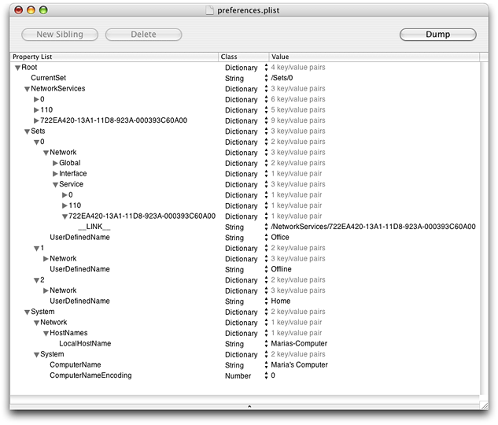

> 导航：[总目录](../../../README.md) · [documentation](../../../_indexes/documentation.md) · [System Configuration Programming Guidelines](Introduction%20to%20System%20Configuration%20Programming%20Guidelines.md)

[Next](The%20System%20Configuration%20Schema.md)[Previous](System%20Configuration%20Goals%20and%20Architecture.md)

# Components of the System Configuration Framework

If you’re developing a network-configuration application, you need to know how the components of the System Configuration framework work together and how your application interacts with them. This chapter describes each component in greater detail.

If you’re developing a network-aware application, you do not need in-depth information on the dynamic and persistent stores, the schema, or the configuration agents. Instead, you should concentrate on the reachability and connection APIs described in [Determining Reachability and Getting Connected](Determining%20Reachability%20and%20Getting%20Connected.md#apple-f4xwc4dqnrsv64tfmyxwi33df52wszbpkridimbqgaytanrvfvbuqmrqgqwuescbizbecscj).

The persistent store contains the network preferences set by the user and by applications that configure network services. It is a hierarchically structured database that holds configuration information for all locations, services, and interfaces defined in the system, whether or not they are currently active. The information is kept in a large dictionary of keys (CFString types) and values (CFPropertyList types, typically CFDictionary types). The System Configuration schema (described in [The Schema: Hierarchy and Definitions](#apple-f4xwc4dqnrsv64tfmyxwi33df52wszbpkridimbqgaytanrvfvbuqmrqg4wugscejbdeeqsi)) dictates the precise combinations of key-value pairs required to define each service and entity. The dictionary is maintained as an XML file which, in OS X version 10.3 and above, currently resides in the default location `/Library/Preferences/SystemConfiguration/preferences.plist`. (The default location in earlier versions of OS X is `/var/db/SystemConfiguration/preferences.xml`.)

This section presents an overview of the persistent store, focusing on the top-level preferences. If you’re developing a network-configuration application, you need to know how to define your service with specific key-value pairs. For more information on the precise layout of the preferences, see [The System Configuration Schema](The%20System%20Configuration%20Schema.md#apple-f4xwc4dqnrsv64tfmyxwi33df52wszbpkridimbqgaytanrvfvbuqmrqgmwugscejfeeiq2h).

Currently, the persistent store contains four top-level preferences:

- _Sets_. A CFDictionary object that lists all locations currently configured on the system, such as Office or Home. There is one set for each location. (Recall that “location” refers to the user-visible configuration of a network environment.)
- _CurrentSet_. A CFString object that contains the identity of the currently active location (a member of the Sets dictionary).
- _NetworkServices_. A CFDictionary object that contains the complete list of network services defined for all sets. Each service contains the protocol entities defined for that service.
- _System_. A CFDictionary object that contains configuration information that is system-specific rather than location-specific, such as the computer name.

Together, these four preferences describe the configurations of all locations and network services on the system. If you install the Developer Tools package, you can use the Property List Editor application (located in `/Developer/Applications/Utilities/Property List Editor`) to examine the persistent store on your computer. For example, [Figure 2-1](#apple-f4xwc4dqnrsv64tfmyxwi33df52wszbpkridimbqgaytanrvfvbuqmrqg4wueqkci5cesq2i) shows a portion of the persistent store from the computer of the fictional executive Maria (introduced in [An Example of Mobility](System%20Configuration%20Goals%20and%20Architecture.md#apple-f4xwc4dqnrsv64tfmyxwi33df52wszbpkridimbqgaytanrvfvbuqmrqgiwugscejbaukskd)), as displayed by Property List Editor:

__Figure 2-1__  Partial listing of a persistent store

As you can see in [Figure 2-1](#apple-f4xwc4dqnrsv64tfmyxwi33df52wszbpkridimbqgaytanrvfvbuqmrqg4wueqkci5cesq2i), the top-level preference CurrentSet contains a string that refers to a member of the Sets dictionary (in this example, the currently active location is Office).

The Sets dictionary contains a subdictionary representing the set associated with each location Maria has defined on her system. In [Figure 2-1](#apple-f4xwc4dqnrsv64tfmyxwi33df52wszbpkridimbqgaytanrvfvbuqmrqg4wueqkci5cesq2i), you can see dictionaries for the locations Office, Offline, and Home.

The NetworkServices dictionary contains a subdictionary for each network service defined on Maria’s computer. Notice that in [Figure 2-1](#apple-f4xwc4dqnrsv64tfmyxwi33df52wszbpkridimbqgaytanrvfvbuqmrqg4wueqkci5cesq2i), the NetworkServices dictionary contains only the dictionaries representing the three services listed in the Office location; services listed in the other locations are not shown. Each service subdictionary in the NetworkServices dictionary is identified by a unique ID string. These ID strings have no inherent meaning and are not associated with the user-visible name for the service or location. In OS X version 10.3 and above, the ID strings often consist of a GUID, or globally unique ID.

Each network service subdictionary contains the configuration information for all the entities associated with that service, such as PPP or AppleTalk. The system-wide information in the System dictionary consists of the computer name (“Maria’s Computer”) and the local host name (“Marias-Computer”).

In a running OS X system, the dynamic store contains a snapshot of the current network state. It also holds a copy of the preferences that define the currently active configuration. Because it contains the current configuration, as opposed to all configurations the user has defined, this part of the dynamic store is a subset of the persistent store. As such, the dynamic store’s hierarchical structure and combinations of key-value pairs are also determined by the System Configuration schema.

Various configuration agents (introduced in [Configuration Agents](#apple-f4xwc4dqnrsv64tfmyxwi33df52wszbpkridimbqgaytanrvfvbuqmrqg4wugsceircuirsk)) keep the dynamic store up to date. To do this, they use the information in some keys to decide what to do and they publish the results of their actions in other keys. This interaction between the configuration agents and the dynamic store is an ongoing process and is not limited to the initial configuration of network services that occurs when you turn on your computer. Instead, the configuration agents update the dynamic store whenever system or network events affect the current system state. The ability of the dynamic store to reflect the current system state is at the heart of OS X network mobility.

In addition to holding the current network state, the dynamic store provides a level of abstraction between low-level networking and system events and the applications that need to know about them. For example, when you unplug your Ethernet cable a configuration agent gets this information from a low-level kernel event and updates the value of the appropriate dynamic store key. Through the dynamic store, an application can get this information without having to monitor low-level system events. This is because the System Configuration framework provides notification services that allow an application to register interest in specific keys. When a key’s value changes, an interested application is notified that a change occurred. It is then the application’s responsibility to inspect the value of the key.

Although you can register interest in any key, it’s best to be very selective about the notifications you choose to receive. For one thing, to be sure you’re watching the correct key and to interpret the information you get from it, you need detailed knowledge of the complex System Configuration schema. In many cases, you can use System Configuration APIs to receive notifications of specific events without resorting to watching individual keys. For information on some of these APIs, see [System Configuration APIs](System%20Configuration%20Goals%20and%20Architecture.md#apple-f4xwc4dqnrsv64tfmyxwi33df52wszbpkridimbqgaytanrvfvbuqmrqgiwugscejfdeuqkc) and [Determining Reachability and Getting Connected](Determining%20Reachability%20and%20Getting%20Connected.md#apple-f4xwc4dqnrsv64tfmyxwi33df52wszbpkridimbqgaytanrvfvbuqmrqgqwuescbizbecscj).

The System Configuration schema describes the complex hierarchical layout of the persistent and dynamic stores. In addition to imposing the overall structure, the schema also defines the exact combinations of key-value pairs that describe all services available on the system. All configuration agents must fully understand the part of the schema that defines their area of interest to be able to read and correctly update the dynamic store.

Although the schema is not private system API, it is very low level. As much as possible, an application should avoid depending directly on the schema and employ higher-level interfaces instead. For example, a network-aware application can use the notification services in the reachability and connection APIs instead of requesting notifications on specific keys the schema defines. However, for some applications this is not an option. A network-configuration application, for example, must combine the correct key-value pairs to define new locations and services. Developers of such applications should read [The System Configuration Schema](The%20System%20Configuration%20Schema.md#apple-f4xwc4dqnrsv64tfmyxwi33df52wszbpkridimbqgaytanrvfvbuqmrqgmwugscejfeeiq2h) for more information on how the schema defines specific services.

The `SCSchemaDefinitions.h` file in the System Configuration framework defines the keys and values the schema uses, but does not indicate how they’re used. This section gives a brief overview of the types of keys and values you find in the `SCSchemaDefinitions.h` file. For in-depth information on the keys and values of the schema, see [The System Configuration Schema](The%20System%20Configuration%20Schema.md#apple-f4xwc4dqnrsv64tfmyxwi33df52wszbpkridimbqgaytanrvfvbuqmrqgmwugscejfeeiq2h).

The `SCSchemaDefinitions.h` file groups the keys and values into the following types:

- Generic keys. These are keys, such as `kSCPropUserDefinedName` and `kSCPropVersion`, that can be used at different levels in the persistent store. For example, `kSCPropUserDefinedName` is an appropriate key for both a service dictionary and a location dictionary.
- Preference keys. These keys define the top-level preferences in the persistent store, such as `kSCPrefCurrentSet` and `kSCPrefSystem`. (The top-level preferences are described in [The Persistent Store](#apple-f4xwc4dqnrsv64tfmyxwi33df52wszbpkridimbqgaytanrvfvbuqmrqg4wugsceizcusq2e).)
- Component keys. These keys define the main categories in the dynamic and persistent stores, such as `kSCCompSystem` and `kSCCompInterface`.
- Entity keys. The entity keys name network entities, such as `kSCEntNetIPv4` and `kSCEntNetDNS`.
- Property keys. These keys identify the properties for each entity, such as the IPv4 `kSCPropNetIPv4ConfigMethod` property.
- Value keys. These keys provide appropriate values for specific property keys. For example, `kSCValNetIPv4ConfigMethodBOOTP` is a possible value for the IPv4 `kSCPropNetIPv4ConfigMethod` property.

The System Configuration framework communicates with a system-level daemon, `configd`, to manage network configuration. When you turn on your computer, `configd` runs early in the boot process to configure the network. To keep the network state data current, `configd` initializes the dynamic store and loads the configuration agents as bundles (or plug-ins). These agents run within the `configd` memory space, as part of its process. Each agent is responsible for a well-defined aspect of configuration management, such as IPv4 or PPP. An agent monitors low-level kernel events, relevant configuration sources, and the status reported by other configuration agents, to configure its area of interest and update the dynamic store.

To communicate with the dynamic store, the configuration agents use the keys and values defined in the `SCSchemaDefinitions.h` file and follow the hierarchy defined by the System Configuration schema. Each agent understands a well-defined subset of key-value pairs that relates to its area of interest. The agent uses some keys to obtain configuration information and others to publish the results of events it detects and actions it takes.

In OS X, `configd` loads several configuration agents, some of which are of internal interest only. Your application might be aware of the following configuration agents:

- Preferences monitor. Populates the dynamic store with the preferences associated with the currently active configuration set (specified in the user’s CurrentSet preference).
- Kernel event monitor. Maintains information about the network interfaces defined in the system and monitors low-level kernel events.
- IPv4 configuration agent. Configures Ethernet-type devices for IP networking.
- IPv6 configuration agent. Configures Ethernet-type devices, FireWire devices, and 6to4 interfaces for IP networking.
- IP monitor. Selects the primary network service (the service associated with the default route and default DNS for the system).
- PPP controller. Configures PPP interfaces for IP networking.

For more information on these configuration agents and the specific keys and values they use, see [Behavior of the Configuration Agents](The%20System%20Configuration%20Schema.md#apple-f4xwc4dqnrsv64tfmyxwi33df52wszbpkridimbqgaytanrvfvbuqmrqgmwugsceircuirsk).

[Next](The%20System%20Configuration%20Schema.md)[Previous](System%20Configuration%20Goals%20and%20Architecture.md)

