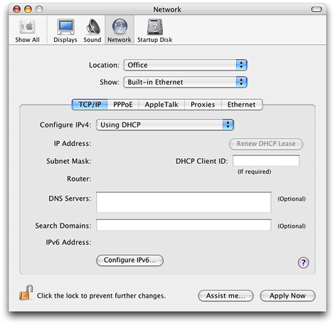
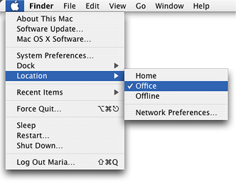
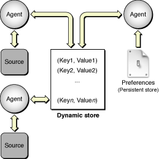

> 导航：[总目录](../../../README.md) · [documentation](../../../_indexes/documentation.md) · [System Configuration Programming Guidelines](Introduction%20to%20System%20Configuration%20Programming%20Guidelines.md)

[Next](Components%20of%20the%20System%20Configuration%20Framework.md)[Previous](Introduction%20to%20System%20Configuration%20Programming%20Guidelines.md)

# System Configuration Goals and Architecture

This chapter provides an overview of the System Configuration framework goals and architecture. You should read this chapter if you’re new to OS X network configuration or if you need to know which APIs and services in the System Configuration framework your application should use. In particular, if your application needs to determine the reachability of a remote host or request a PPP-based connection, you might choose to skim this chapter for context and then read [Determining Reachability and Getting Connected](Determining%20Reachability%20and%20Getting%20Connected.md#apple-f4xwc4dqnrsv64tfmyxwi33df52wszbpkridimbqgaytanrvfvbuqmrqgqwuescbizbecscj).

The OS X System Configuration framework provides the foundation for network configuration on OS X. The dual goals of the framework are:

- To provide dynamic network configuration that supports seamless user mobility
- To support applications that need to create, modify, or access network services. This includes applications that create or manipulate network configurations and applications that need to determine remote-host reachability and make connections

The first goal of the System Configuration framework is user-oriented. In the System Preferences application’s Network preferences panel (which is a client of the System Configuration framework), a user can set up multiple network configurations. Each of these configurations can describe a different networking environment. This means that a user can enter a few values in Network preferences and her system automatically detects, configures, and starts the appropriate network service. The user can impose a preferred order on the services and the system automatically switches between them, according to which network interfaces are currently available, without requiring a restart. For an example of how this works, see [An Example of Mobility](#apple-f4xwc4dqnrsv64tfmyxwi33df52wszbpkridimbqgaytanrvfvbuqmrqgiwugscejbaukskd).

The second goal of the System Configuration framework is to provide network configuration and access services to a wide range of applications. At one end of the range is a network-configuration application such as one an Internet service provider (ISP) might offer to define new services and provide dial-up support. Such an application needs to access System Configuration framework components at a low level to provide network services.

At the other end of the range are what can be termed network-aware applications. For the most part, a network-aware application simply needs to use existing network services, not define new ones. Such an application might need to determine if a remote host is reachable or request a network connection so it can provide content to its users.

The System Configuration framework supports applications throughout this range by providing:

- Access to current network configuration information
- APIs that allow applications to determine the reachability of remote hosts and start PPP-based connections
- Notification of changes to network status and configurations and to system state
- A flexible schema that allows definition of and access to stored preferences and the current network configuration

The System Configuration framework offers a level of abstraction that allows your application to manage a wide range of configuration tasks. To achieve this, the framework takes advantage of Core Foundation run loop technology and property list types.

In addition, the source code for the System Configuration framework is available in Darwin as part of Apple’s Open Source initiative, so you can see exactly how things work. In Darwin, the source code for the System Configuration framework and related entities is divided among three projects:

- `configd`. This project includes `configd` (the network configuration daemon) and the System Configuration framework itself.
- `configd_plugins`. This project contains various built-in plug-ins, such as the kernel event monitor and the IP monitor.
- `bootp`. This project includes BootP and DHCP, which inform the IPv4 and IPv6 configuration agents.

The System Configuration framework allows users to set up multiple network interfaces in various combinations and supports dynamic network reconfiguration without requiring user intervention. To see how this works, consider Maria, a PowerBook-toting executive on her way to deliver a presentation at a remote office.

Because Maria uses her PowerBook in different network environments, she uses Network preferences to establish a collection of network configurations for each environment. Each collection of network configurations is called a location.[Figure 1-1](#apple-f4xwc4dqnrsv64tfmyxwi33df52wszbpkridimbqgaytanrvfvbuqmrqgiwvgvzs) shows a location named Office in Maria’s Network preferences.

__Figure 1-1__  A location in Network preferences

Maria establishes three locations:

- Office. The Office location sets the built-in Ethernet interface to be the primary interface. If the built-in Ethernet interface isn’t available, the system uses the AirPort interface instead.
- Offline. This location disables all network interfaces so that no connection attempts are made.
- Home. This location sets an Ethernet-based DSL modem to be the primary interface. If the DSL modem isn’t available, the system uses a 56K dial-up modem instead.

In her office, Maria plugs in the Ethernet cable and selects the Office location from the Apple menu, as shown in [Figure 1-2](#apple-f4xwc4dqnrsv64tfmyxwi33df52wszbpkridimbqgaytanrvfvbuqmrqgiwvgvzt).

__Figure 1-2__  A location in the Apple menu

To attend a meeting, Maria unplugs the Ethernet cable and enters the conference room. When her PowerBook wakes up in the conference room, it determines that the cabled LAN is not active and automatically switches to the corporate AirPort network.

In the taxi to the airport, with no network services available, Maria writes her meeting notes. While waiting for her flight, she wakes the PowerBook and uses the wireless network available at the airport to send her presentation slides ahead to the remote office for finishing touches. To this point, Maria has not adjusted her network preferences, but she’s had no problems using available network services, even across sleep-wake cycles.

As she boards the airplane, Maria uses the Apple menu to select the Offline location which shuts off all networking (as required during air travel). During the flight, she works on the introduction to her presentation.

When she arrives at the remote office, Maria again selects the Office location and gives her presentation. She uses the newly polished slides she retrieves over AirPort from the local server.

When she returns home, Maria plugs in the Ethernet and phone cables and selects the Home location from the Apple menu. Now she can work on last-minute business whether her DSL connection is active today or not.

Because of the System Configuration framework’s dynamic network reconfiguration support, Maria never had to restart her PowerBook to take advantage of changing network environments.

The System Configuration framework comprises many components that work together to support configurable network resources. This section introduces these components and defines several terms the System Configuration framework (and this document) uses to describe a user’s network configuration.

For developers of network-aware applications, this section provides enough background information to get started using the reachability and connection APIs. For an overview of all the APIs the System Configuration framework offers, read [System Configuration APIs](#apple-f4xwc4dqnrsv64tfmyxwi33df52wszbpkridimbqgaytanrvfvbuqmrqgiwugscejfdeuqkc). Then, you may choose to skip ahead to [Determining Reachability and Getting Connected](Determining%20Reachability%20and%20Getting%20Connected.md#apple-f4xwc4dqnrsv64tfmyxwi33df52wszbpkridimbqgaytanrvfvbuqmrqgqwuescbizbecscj) for specific information on how to use the reachability and connection APIs.

A developer of network-configuration applications, however, needs more in-depth information about the individual components of the System Configuration framework. To learn more about these components, you should read [Components of the System Configuration Framework](Components%20of%20the%20System%20Configuration%20Framework.md#apple-f4xwc4dqnrsv64tfmyxwi33df52wszbpkridimbqgaytanrvfvbuqmrqg4wugsceireecqsj). In addition, if you’re developing an application that defines new locations or services, be sure to read [The System Configuration Schema](The%20System%20Configuration%20Schema.md#apple-f4xwc4dqnrsv64tfmyxwi33df52wszbpkridimbqgaytanrvfvbuqmrqgmwugscejfeeiq2h).

Before you read any further, be sure you’re familiar with the System Configuration terms this document uses:

- _Location_. A collection of network configurations a user creates in Network preferences to describe a specific environment, such as the home environment.
- _Set_. The complete configuration for a single location. The configuration typically includes IP and interface configuration information, as well as system-wide information.
- _Network service_. A collection of network entities for a single network interface or network connection. Together, these entities contain all the information required to make the service active.
- _Network entity_. A collection of properties that are specific to some protocol or area of interest, such as PPP or DNS.
- _Interface_. The physical connection, such as Ethernet.

The System Configuration framework comprises several components that work together to provide powerful, flexible support for establishing and maintaining access to configurable network resources. These components are:

- A persistent storage structure for network configuration preferences and selected system information
- A dynamic storage structure for current network state information
- Configuration agents that manage the data in the two storage areas, handle low-level configuration events, and provide notification services
- A comprehensive and flexible schema that defines both the data types in the persistent and dynamic stores and their hierarchical structure
- A full range of APIs that provide access to the current network state information and furnish notifications, handle reachability and connectivity, and support the definition of new sets and services. For an overview of the APIs the System Configuration framework provides, see [System Configuration APIs](#apple-f4xwc4dqnrsv64tfmyxwi33df52wszbpkridimbqgaytanrvfvbuqmrqgiwugscejfdeuqkc).

[Figure 1-3](#apple-f4xwc4dqnrsv64tfmyxwi33df52wszbpkridimbqgaytanrvfvbuqmrqgiwvgvzr) shows the first three of these components (the schema and the APIs are not shown) and how they interact.

__Figure 1-3__  Architecture and interaction of System Configuration framework components

As shown in [Figure 1-3](#apple-f4xwc4dqnrsv64tfmyxwi33df52wszbpkridimbqgaytanrvfvbuqmrqgiwvgvzr), the dynamic store is the conceptual heart of the System Configuration architecture. The dynamic store:

- Contains a copy of the configuration information for the currently active location
- Contains the current network state information (and also some system state information)
- Provides input to the configuration agents
- Receives up-to-date status information from the configuration agents
- Supports the notification process

The dynamic store is kept up-to-date by various configuration agents and is recreated after every system restart. [The Dynamic Store](Components%20of%20the%20System%20Configuration%20Framework.md#apple-f4xwc4dqnrsv64tfmyxwi33df52wszbpkridimbqgaytanrvfvbuqmrqg4wugsceircegsch) describes the dynamic store in more detail.

The persistent store houses:

- The user’s network preferences (entered in Network preferences)
- Some system values, such as the computer name and selected power management information

As its name implies, the persistent store persists across reboots and is only changed by explicit actions of the user, the system, or network-configuration applications. The persistent store is described in more detail in [The Persistent Store](Components%20of%20the%20System%20Configuration%20Framework.md#apple-f4xwc4dqnrsv64tfmyxwi33df52wszbpkridimbqgaytanrvfvbuqmrqg4wugsceizcusq2e).

[Figure 1-3](#apple-f4xwc4dqnrsv64tfmyxwi33df52wszbpkridimbqgaytanrvfvbuqmrqgiwvgvzr) shows three configuration agents. In a running OS X system, there are several more configuration agents (some of which are internal implementation details that are not discussed in this document). Each configuration agent is responsible for a well-defined area of configuration management, such as IPv4 or PPP. In general, an agent gets preferences and status information from the dynamic store and combines it with information the agent receives from various system and network events. The agent publishes the merged information and the results of any actions it takes back into the dynamic store. See [Configuration Agents](Components%20of%20the%20System%20Configuration%20Framework.md#apple-f4xwc4dqnrsv64tfmyxwi33df52wszbpkridimbqgaytanrvfvbuqmrqg4wugsceircuirsk) for more information about individual configuration agents.

Although it is not shown in [Figure 1-3](#apple-f4xwc4dqnrsv64tfmyxwi33df52wszbpkridimbqgaytanrvfvbuqmrqgiwvgvzr), the schema serves as the common language that allows the various components of the System Configuration framework to communicate. The information in both the dynamic and persistent stores is held in key-value pairs. The configuration agents use the key-value pairs to access configuration information and to update the dynamic store. Applications can use the key-value pairs to define new services and watch for changes in network state or configuration. The schema defines these keys and values and the hierarchy that binds them together to describe specific services. The schema is described in more detail in [The Schema: Hierarchy and Definitions](Components%20of%20the%20System%20Configuration%20Framework.md#apple-f4xwc4dqnrsv64tfmyxwi33df52wszbpkridimbqgaytanrvfvbuqmrqg4wugscejbdeeqsi). For information on how to use the schema to define new sets or services, see [The System Configuration Schema](The%20System%20Configuration%20Schema.md#apple-f4xwc4dqnrsv64tfmyxwi33df52wszbpkridimbqgaytanrvfvbuqmrqgmwugscejfeeiq2h).

The System Configuration framework also contains a full complement of APIs. These APIs include low-level functions an ISP application might use to provide new services and higher-level functions any application can use to connect to a remote host. It is important to remember that if your application is primarily concerned with the reachability of a remote host and subsequent connection to it, knowledge of the System Configuration framework architecture is not essential. Instead, you should focus on the reachability and connection APIs discussed in [Determining Reachability and Getting Connected](Determining%20Reachability%20and%20Getting%20Connected.md#apple-f4xwc4dqnrsv64tfmyxwi33df52wszbpkridimbqgaytanrvfvbuqmrqgqwuescbizbecscj).

The architecture of the System Configuration framework lends itself to other types of dynamic state management, as well. The structure and flexibility of the dynamic store and the interaction of the configuration agents are well suited to the communication of system information, such as power management status. Although it is possible for third-party developers to use the dynamic store structure for purposes other than network configuration, this is not covered in this document. For help with such a project, you should contact Apple Worldwide Developer Relations directly.

The System Configuration framework provides APIs to support a wide range of network applications, from network-aware applications that need to connect to a remote host to ISP and dialer applications.

It’s useful to view the System Configuration APIs as divided into two groups:

- High-level reachability and connection APIs
- Low-level configuration APIs

Applications that need to find out if a remote host is reachable or establish a PPP connection use the high-level reachability and connection APIs. These APIs combine the power of the System Configuration architecture with the convenience of high-level functions. For more information on these APIs, see [Determining Reachability and Getting Connected](Determining%20Reachability%20and%20Getting%20Connected.md#apple-f4xwc4dqnrsv64tfmyxwi33df52wszbpkridimbqgaytanrvfvbuqmrqgqwuescbizbecscj).

Applications that need to create or duplicate sets, or activate or deactivate services have a more complicated task. They must use the low-level configuration APIs. In addition, to develop these applications you must understand and use the System Configuration schema to interpret and build dictionaries that describe the new sets and services.

It’s also important to realize that to modify network preferences (in other words, to change the persistent store), your application must acquire root privileges. This is not a trivial task; for more information, you can read _[Authorization Services Programming Guide](../../Security/Authorization%20Services%20Programming%20Guide/Introduction%20to%20Authorization%20Services%20Programming%20Guide.md#apple-f4xwc4dqnrsv64tfmyxwi33df52wszbpkridgmbqgaydsojv)_ and review the code samples `AuthSample` and `MoreAuthSample` available at [http://developer.apple.com/samplecode/Security/idxAuthorization-date.html](https://developer.apple.com/samplecode/Security/idxAuthorization-date.html).

Currently, the low-level configuration APIs are very basic and somewhat difficult to use. In fact, to perform common operations, such as creating a new set, you must combine the System Configuration APIs with I/O Kit access. In future versions of OS X, the System Configuration framework may provide higher-level APIs to perform such network-configuration tasks.

Until then, however, if you’re developing an application that needs to create new sets or activate or deactivate services, you should examine the _[MoreSCF](../../../samplecode/MoreSCF/MoreSCF.md#apple-f4xwc4dqnrsv64tfmyxwi33df52wszbpirkfgmjqgaydanzqgi)_ sample code. Apple’s Developer Technical Support created this sample to provide a library of high-level functions that make performing these tasks comparatively easy. In particular, the `MoreSCF` sample provides you with some help using the complex System Configuration schema to build set and service dictionaries. Following the lead of this sample, combined with perusal of the System Configuration API reference (available in the [Networking Reference Library](https://developer.apple.com/library/archive/navigation/redirect.html#//apple_ref/doc/uid/TP30000943-TP30000429)), should provide a foundation to get you started. In addition, be sure to read [The System Configuration Schema](The%20System%20Configuration%20Schema.md#apple-f4xwc4dqnrsv64tfmyxwi33df52wszbpkridimbqgaytanrvfvbuqmrqgmwugscejfeeiq2h) to gain an understanding of the keys and values you may have to use.

You can use the following applications to view and, in some ways, change system configuration information:

- _scutil_. Provides command-line access to the dynamic store.
- _scselect_. Allows you to view and change the current location.
- _Property List Editor_. Provides a user-friendly way to view the persistent store.

You can use the `scutil` command-line utility to view the dynamic store, monitor notifications, and create and modify dictionaries for testing. Using the Terminal application (located at `/Applications/Utilities/Terminal`), type `scutil` at the prompt. For a list of commands, type ‘help’ at the `scutil` prompt.

The `scselect` tool is a setuid tool (a tool that has its setuid bit set to allow it to perform privileged operations) that the Apple menu launches to allow a non-privileged user to change locations. `scselect` is not an API. If your application needs to change locations, you should use the preferences APIs in the System Configuration framework.

For a brief description of Property List Editor, see [The Persistent Store](Components%20of%20the%20System%20Configuration%20Framework.md#apple-f4xwc4dqnrsv64tfmyxwi33df52wszbpkridimbqgaytanrvfvbuqmrqg4wugsceizcusq2e).

[Next](Components%20of%20the%20System%20Configuration%20Framework.md)[Previous](Introduction%20to%20System%20Configuration%20Programming%20Guidelines.md)

