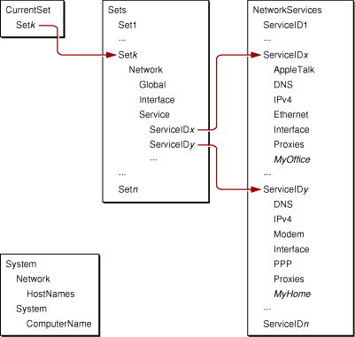

> 导航：[总目录](../../../README.md) · [documentation](../../../_indexes/documentation.md) · [System Configuration Programming Guidelines](Introduction%20to%20System%20Configuration%20Programming%20Guidelines.md)


[Next](Determining%20Reachability%20and%20Getting%20Connected.md)[Previous](Components%20of%20the%20System%20Configuration%20Framework.md)

# The System Configuration Schema

The System Configuration schema defines the layout of network configuration information in the persistent store. This chapter describes this layout and some of the specific combinations of key-value pairs that define sets and services. It then describes which key-value pairs the configuration agents use to manage their areas of interest. Finally, this chapter describes how to use your knowledge of the schema to provide preferences that define a service. You should read this chapter if your application defines sets or services. Additionally, if your application needs detailed information about the status of a PPP connection, you should read this chapter to find out how to interpret the information you receive.

Most network-aware applications do not need to access network preferences or the dynamic store to perform their tasks. If your application requests network connections or finds out if a remote server is reachable, you might choose to skip ahead to [Determining Reachability and Getting Connected](Determining%20Reachability%20and%20Getting%20Connected.md#apple-f4xwc4dqnrsv64tfmyxwi33df52wszbpkridimbqgaytanrvfvbuqmrqgqwuescbizbecscj).

The hierarchical placement of keys and values in the persistent store is dictated by the System Configuration schema. This section describes the hierarchy of key-value pairs and identifies some of the specific combinations of preferences that define individual services.

[The Persistent Store](Components%20of%20the%20System%20Configuration%20Framework.md#apple-f4xwc4dqnrsv64tfmyxwi33df52wszbpkridimbqgaytanrvfvbuqmrqg4wugsceizcusq2e) introduces the four top-level preferences in the persistent store:

- Sets
- CurrentSet
- NetworkServices
- System

The system uses the information in these four preferences to configure network services. [Figure 3-1](#apple-f4xwc4dqnrsv64tfmyxwi33df52wszbpkridimbqgaytanrvfvbuqmrqgmwuer2cirbuuskc) shows how these preferences are related.

__Figure 3-1__  Relationship among top-level preferences in the persistent store



As you can see in [Figure 3-1](#apple-f4xwc4dqnrsv64tfmyxwi33df52wszbpkridimbqgaytanrvfvbuqmrqgmwuer2cirbuuskc), the System preference is separate from the other three preferences. This is because the System dictionary contains global, system-wide information, such as the computer name. This information is applicable to the machine as a whole, regardless of the current network configuration. A network-configuration application has no need to add values to the System preference.

The CurrentSet preference always contains the internal ID that represents the currently active set in the Sets preference (in [Figure 3-1](#apple-f4xwc4dqnrsv64tfmyxwi33df52wszbpkridimbqgaytanrvfvbuqmrqgmwuer2cirbuuskc), this is Set_k_). When a user selects a different location in Network preferences or from the Apple menu, the preferences monitor notices and updates the dynamic store to reflect the change. For more information on the preferences monitor, see [Preferences Monitor](#apple-f4xwc4dqnrsv64tfmyxwi33df52wszbpkridimbqgaytanrvfvbuqmrqgmwugsceizducrkg)).

The remaining two top-level preferences, Sets and NetworkServices, contain the bulk of the information the system needs to configure network services. As you can see in [Figure 3-1](#apple-f4xwc4dqnrsv64tfmyxwi33df52wszbpkridimbqgaytanrvfvbuqmrqgmwuer2cirbuuskc), a set listed in the Sets dictionary contains the internal IDs that represent individual services listed in the NetworkServices dictionary. The following sections describe the Sets and NetworkServices dictionaries in more detail.

The Sets dictionary contains a subdictionary for each set defined in the system. Generally, sets represent the locations created by the user in Network preferences, although network-configuration applications can also create them. For example, an ISP might provide an application that defines a new location that makes it easy for a user to connect to the ISP. To offer this new location, the application creates a new set dictionary and some number of new services. The new set dictionary contains configuration information for the location, including a property that holds the ISP’s name, and references to the new services.

Each individual set dictionary within the top-level Sets dictionary contains the following properties:

- UserDefinedName
- Network

The _UserDefinedName_ property is a string that holds the location name the user enters in Network preferences. An application that defines a new location would use this key to provide a suitable location name, for example, the name of the ISP. The ISP’s name is then displayed in the Location menu of Network preferences and in the Apple menu.

The _Network_ property is a dictionary that describes the network configuration for the set, including a list of services defined for the set. Every Network dictionary within a set should contain the following properties, all of which are dictionaries:

- Global
- Interface
- Service

As its name implies, the _Global_ dictionary supplies information that is not specific to any particular service. Currently, the Global dictionary contains two member dictionaries: IPv4 and NetInfo, both of which are required.

The IPv4 dictionary should contain the ServiceOrder key. This key’s value is an array that allows the user to impose an ordering on his network services in Network preferences. When multiple services are active at the same time, the system uses the ServiceOrder array to determine which service should be deemed primary. The primary service determines the default route and the DNS and proxy server configurations.

The IPv4 dictionary may also contain the PPPOverridePrimary key. This is a legacy key that allows any active PPP-based service to be treated as if it were first in the ServiceOrder array. This functionality has been replaced by allowing any individual service to include an OverridePrimary key in its own (per service) IPv4 dictionary.

The NetInfo dictionary contains NetInfo binding preferences. As the use of Directory Services becomes more widespread, however, the NetInfo dictionary will become less common.

The _Interface_ dictionary holds per-interface settings. Each member of the Interface dictionary is a subdictionary identified by the BSD name of the interface, such as `en0`. Each subdictionary contains a dictionary named Ethernet, which holds the results of a manual configuration of the interface. Speed, duplex, and maximum packet size (maximum transfer unit, or MTU) values are stored here. This information is stored at the interface level to prevent individual services from attempting to configure the same interface in different ways.

Typically, however, the user accepts the default Ethernet configuration by choosing the Automatically option in the Ethernet configuration tab of Network preferences. When this is the case, the Ethernet dictionary is either not present or contains the key `__INACTIVE__`.

The _Service_ dictionary contains references to the services defined for this set. Every member of the Service dictionary is itself a dictionary that contains a single member—an internal service ID that refers to a service listed in the top-level NetworkServices dictionary. Network preferences uses the information in the Service dictionary to display the services and whether or not they’re enabled. The preferences monitor also uses this information as it loads the current configuration preferences into the dynamic store (for more information on this process, see [Preferences Monitor](#apple-f4xwc4dqnrsv64tfmyxwi33df52wszbpkridimbqgaytanrvfvbuqmrqgmwugsceizducrkg)).

The top-level NetworkServices dictionary contains all the network services defined for the system. Each network service is represented by a dictionary (identified by a unique key) that contains the configuration properties for the entities associated with that service. The combination of entities is determined by the type of service. For example, a modem-based service needs the Interface, PPP, Modem, and IPv4 entities, but not the AppleTalk entity, because OS X does not support AppleTalk over PPP.

If you are developing an application that adds a service to a new set, you need to create a network service dictionary that describes it. This section outlines the contents of a network service dictionary.

A network service dictionary can include the following properties:

- An interface dictionary that describes the network interface underlying the service
- A variable number of protocol entity dictionaries, each of which describes the configuration of a protocol entity (such as PPP or AppleTalk) that’s defined for the service. (Note that some protocol entity dictionaries may be present in a network service dictionary but be empty or marked as inactive.)
- One hardware entity dictionary, depending on the type of service (the type of service is specified in the interface entity dictionary)
- A proxies dictionary that identifies which proxies are enabled for the service
- A user-visible name for the service

The Interface dictionary describes the transport of the service’s network connection. The contents of the Interface dictionary vary according to the type of the service, but three members are required:

- DeviceName
- Hardware
- Type

The value of the _DeviceName_ key supplies the BSD device name for the network connection, for example, `en0` or `en1`. For serial-like devices, the value of the DeviceName key is the base name, minus any prefix. For example, the DeviceName value for a modem with the name `cu.modem` is `modem`. Currently, the System Configuration framework does not supply API to find all ports suitable for networking. See [Programmatically Setting Preferences](#apple-f4xwc4dqnrsv64tfmyxwi33df52wszbpkridimbqgaytanrvfvbuqmrqgmwugscejbauqq2j) for a reference to a library of sample code that can help with this.

The value of the _Hardware_ key is a property of type CFString that names the type of hardware underlying the network connection, such as Ethernet or AirPort. You can view the contents of this dictionary as a reference to the hardware entity dictionary of the same name (for more information on hardware entity dictionaries, see [Hardware Entity Dictionaries](#apple-f4xwc4dqnrsv64tfmyxwi33df52wszbpkridimbqgaytanrvfvbuqmrqgmwugsceivbucqkj)).

The _Type_ key identifies the type of connection, which could be Ethernet, FireWire, PPP, or 6to4.

In addition to the required keys, the Interface dictionary usually contains the _UserDefinedName_ key, which holds the user-visible name of the network port.

The Interface dictionary keys and values are summarized in Table 3-1, along with associated actions of configuration agents.

__Table 3-1__  Keys and values for the Interface dictionary

| Key | Value | Further action required | Notes |
| DeviceName | BSD device name | None |  |
| Hardware | AirPort | None |  |
| Hardware | Ethernet | None |  |
| Hardware | Modem | None |  |
| Type | Ethernet | None |  |
| Type | FireWire | None |  |
| Type | 6to4 | None |  |
| Type | PPP | Must supply a SubType key. | PPP controller configures this service. |
| SubType | PPPoE | Required for PPP over Ethernet services. |  |
| SubType | PPPSerial | Required for PPP over serial, modem, Bluetooth, etc. services. |  |
| SubType | PPTP | Required for VPN (using PPTP) services. |  |
| SubType | L2TP | Required for VPN (using L2TP) services. |  |
| UserDefinedName | Human readable name | None |  |

Each protocol entity dictionary contains the information the system needs to configure the protocol. For example, the ConfigMethod property in the IPv4 entity dictionary might tell the system to use DHCP to configure IPv4.

Currently, the protocol entities that can be defined for a service are:

- AppleTalk
- DNS
- IPv4
- IPv6
- PPP

For the most part, a service dictionary can contain any combination of these protocol entity dictionaries. If an interface does not support a protocol, however, the corresponding dictionary is ignored. For example, in OS X version 10.3, the AppleTalk dictionary is ignored for PPP services because OS X does not support AppleTalk over PPP.

The contents of some protocol entity dictionaries (such as PPP) affect the contents of other members of a network service dictionary. The following sections describe the contents of each protocol entity dictionary, including any effect those contents might have on other properties.

The AppleTalk protocol entity dictionary is an optional protocol entity dictionary. If it is present, it contains the following required key:

- ConfigMethod (`kSCValNetAppleTalkConfigMethod`)

The possible values for the ConfigMethod key are:

- Node (`kSCPropNetAppleTalkConfigMethodNode`). The standard AppleTalk configuration, which is suitable for general workstations.
- Router (`kSCPropNetAppleTalkConfigMethodRouter`). Used for AppleTalk routers.
- SeedRouter (`kSCPropNetAppleTalkConfigMethodSeedRouter`). Used for AppleTalk seed routers.

Depending on which configuration method you choose, other key-value pairs may be required. For example, if you select the SeedRouter configuration method, you must also supply values for the SeedNetworkRange and SeedZones keys.

For more information on AppleTalk configuration options, you can view the man page for the `appletalk.cfg` file (the default configuration file the `appletalk` command reads) at [http://developer.apple.com/documentation/Darwin/Reference/ManPages/index.html](https://developer.apple.com/documentation/Darwin/Reference/ManPages/index.html).

The key-value pairs in the AppleTalk protocol entity dictionary have no effect on the contents of other dictionaries in a network service dictionary.

The DNS protocol entity dictionary is an optional protocol entity dictionary. It is usually present in a service’s network service dictionary, but is often empty. An empty DNS protocol dictionary means that the user chooses not to manually configure DNS, allowing the DNS server names and search domains to be automatically supplied by the ISP.

If you want to require the use of specific DNS servers and search domains, you can add any of the following optional keys to the DNS protocol entity dictionary:

- DomainName (`kSCPropNetDNSDomainName`)
- SearchDomains (`kSCPropNetDNSSearchDomains`)
- ServerAddresses (`kSCPropNetDNSServerAddresses`)
- SortList (`kSCPropNetDNSSortList`)

For more information on the SortList key, you can view the man page for the resolver configuration file format at [http://developer.apple.com/documentation/Darwin/Reference/ManPages/index.html](https://developer.apple.com/documentation/Darwin/Reference/ManPages/index.html).

The key-value pairs in the DNS protocol entity dictionary have no effect on the contents of other dictionaries in a network service dictionary.

The IPv4 protocol entity dictionary is an optional protocol entity dictionary. It has one required key:

- ConfigMethod (`kSCPropNetIPv4ConfigMethod`)

[Table 3-2](#apple-f4xwc4dqnrsv64tfmyxwi33df52wszbpkridimbqgaytanrvfvbuqmrqgmwuer2ci5fesscj) shows the six possible values of the ConfigMethod key. It also shows the additional keys you must supply with certain ConfigMethod values.

__Table 3-2__  Optional values for the IPv4 ConfigMethod key

| Value | Further action required |
| BOOTP | None |
| DHCP | None |
| LinkLocal | None |
| INFORM | Provide values for Addresses, Router, SubnetMasks `Setup:` keys. |
| Manual | Provide values for Addresses, Router, SubnetMasks `Setup:` keys. |
| PPP | Can specify a manual address. |

For all ConfigMethod values except PPP, the IPv4 configuration agent publishes values for the Addresses, SubnetMasks, Router, and InterfaceName `State:` keys. When the ConfigMethod is PPP, the PPP controller publishes values for the Addresses, DestAddresses, Router, and InterfaceName `State:` keys. For more information on these configuration agents, see [Behavior of the Configuration Agents](#apple-f4xwc4dqnrsv64tfmyxwi33df52wszbpkridimbqgaytanrvfvbuqmrqgmwugsceircuirsk).

The IPv6 protocol entity dictionary is an optional protocol entity dictionary. The IPv6 protocol entity dictionary has much the same composition as the IPv4 protocol entity dictionary and it, too, has a single required key:

- ConfigMethod (`kSCPropNetIPv6ConfigMethod`)

[Table 3-3](#apple-f4xwc4dqnrsv64tfmyxwi33df52wszbpkridimbqgaytanrvfvbuqmrqgmwuer2cireeqrci) shows the four possible values of the ConfigMethod key, along with any further action required.

__Table 3-3__  Optional values for the IPv6 ConfigMethod key

| Value | Further action required | Notes |
| Automatic | None | IPv6 configuration agent publishes values for Addresses, PrefixLength, Flags, and InterfaceName `State:` keys. |
| Manual | Provide values for Addresses, Router, and PrefixLength | IPv6 configuration agent publishes values for Addresses, PrefixLength, Flags, Router, and InterfaceName `State:` keys. |
| RouterAdvertisement | None | IPv6 configuration agent publishes values for PrefixLength, Flags, and InterfaceName `State:` keys. |
| 6to4 | Provide value for 6to4 Relay | IPv6 configuration agent publishes values for Addresses, PrefixLength, Flags, and InterfaceName `State:` keys. |

If an IPv6 protocol entity dictionary is present in a network service dictionary, the PPP controller triggers IPv6 negotiation within PPP. It then configures the LinkLocal address if the IPv6 negotiation with the server was successful.

The PPP protocol entity dictionary is an optional protocol entity dictionary. The schema provides many keys and values for use in this dictionary to allow developers to define finely grained services. The content of the PPP protocol entity dictionary affects the contents of some of the other dictionaries in a network service, most notably, the IPv4 and Interface dictionaries. In addition, the presence of a PPP service in a set requires the presence of the PPPOverridePrimary key in the IPv4 subdictionary in the set’s Global dictionary (as described in [The Sets Dictionary](#apple-f4xwc4dqnrsv64tfmyxwi33df52wszbpkridimbqgaytanrvfvbuqmrqgmwugsceinbuqskb)).

OS X recognizes a wide range of options for PPP services, many of which are used only in very special circumstances. This document does not attempt to describe them all. Instead, this section focuses on the PPP options a user sees in Network preferences. Because you can connect to the vast majority of PPP services using these more generic options, you can create a PPP protocol entity dictionary using the keys described in this section (and their default values), and your connection should succeed. Then, you can refine your service by adding other keys defined in the `SCSchemaDefinitions.h` file.

Table 3-4 shows the keys for the user-visible PPP options, along with some possible values.

__Table 3-4__  Optional keys and values for the PPP protocol entity dictionary

| Key | Value | Notes |
| DialOnDemand | 0 | Enables automatic dial-up. This key should be used with care to avoid unwanted dialing. |
| IdleReminder | 0 | Prompts the user to maintain the PPP connection when the seconds in the IdleReminderTimer value elapse. If the user doesn’t acknowledge the onscreen dialog, PPP automatically disconnects. |
| IdleReminderTimer | 1800 | The number of seconds to elapse before the user is reminded to maintain the PPP connection (if IdleReminder is enabled). |
| DisconnectOnIdle | 1 | Automatically disconnects if there is no traffic for the number of seconds in the DisconnectOnIdleTimer value. |
| DisconnectOnIdleTimer | 900 | The number of idle seconds to elapse before the PPP connection automatically disconnects (if DisconnectOnIdle is enabled). |
| DisconnectOnLogout | 1 | Automatically disconnects when the user logs out or when the user switches out with fast user switching. |
| CommRedialEnabled | 1 | For modem-based connections, enables redial if busy. |
| CommRedialCount | 1 | The number of times to redial if busy (if CommRedialEnabled is enabled). |
| CommRedialInterval | 30 | The interval in seconds to wait between redialing if busy (if CommRedialEnabled is enabled). |
| LCPEchoEnabled | 1 | Enables the PPP echo protocol. This protocol allows the rapid detection of an unreported modem disconnection. Enabling this protocol generates additional traffic and may not be suitable if the user pays by traffic load instead of by connection time. |
| IPCPCompressionVJ | 1 | Enables VJ (Van Jacobson) compression on the PPP link. For PPPSerial connections, the value can be 1 (“on”) or 0 (“off”). For PPPoE, PPTP, and L2TP connections, the value should be 0 (“off”). |
| CommDisplayTerminalWindow | 0 | Enables display of a Terminal window to show login and password interaction with a server. This works only with PPPSerial connections. |
| VerboseLogging | 0 | Enables the logging of the entire PPP negotiation, which can be useful for debugging a connection failure. |
| UserDefinedName |  | Optional name for the connection. This value has no effect on the PPP protocol. |
| AuthName |  | User name for authentication purposes. |
| AuthPassword |  | Password for authentication purposes. |
| CommRemoteAddress |  | The address or name of the remote server. This can be a phone number for a PPPSerial connection, a ServiceName for a PPPoE connection, or an IP address or name for a PPTP or L2TP connection. |
| CommAlternateRemoteAddress |  | Used only for PPPSerial connections, this is an alternate address to use when the address in CommRemoteAddress is busy. |

The definition of a PPP service requires a few changes in some of the other members of your network service dictionary. If you are providing a PPP service, you need to make the following changes to the network service dictionary you are building:

- The Type key in the Interface dictionary must have the value PPP. This ensures the PPP Controller agent will act on this service.
- You must add the SubType key to the Interface dictionary and give it the value that describes the type of PPP service you’re providing, such as PPPoE or L2TP.
- If you’re defining a PPP service meant to be used over a modem, you’ll need to add a modem hardware entity dictionary to the network service dictionary.

Your network service dictionary must contain exactly one hardware entity dictionary, which should provide information on a per-service basis. Its name must match the value of the Hardware property of the Interface dictionary (described in [The Interface Dictionary](#apple-f4xwc4dqnrsv64tfmyxwi33df52wszbpkridimbqgaytanrvfvbuqmrqgmwugsceivfecq2c)). The hardware entity dictionary can be:

- Ethernet
- AirPort
- Modem

A hardware entity dictionary contains details about the network hardware underlying the service defined by the network service dictionary. Therefore, the keys and values in the dictionary vary according to the type of hardware the dictionary describes.

The _AirPort_ hardware entity dictionary can contain some combination of the keys shown in Table 3-5.

__Table 3-5__  Keys and values for the AirPort hardware entity dictionary

| Key | Value |
| AllowNetCreation | 0 or 1 |
| AuthPassword |  |
| AuthPasswordEncryption | Keychain |
| JoinMode | Automatic |
| JoinMode | Preferred |
| JoinMode | Recent |
| JoinMode | Strongest |
| PowerEnabled | 0 or 1 |
| PreferredNetwork |  |
| SavePasswords | 0 or 1 |

The _Modem_ hardware entity dictionary supports a large number of options that allow you to specify a highly detailed setup. Table 3-6 displays some of the keys the schema defines along with some typical values.

__Table 3-6__  Keys and typical values for the Modem hardware entity dictionary

| Key | Value | Notes |
| ConnectionScript | Name of file in modem scripts folder | This is the CCL (connection control language) script. |
| DataCompression | 1 |  |
| DialMode | WaitForDialTone | Other values are IgnoreDialTone and Manual. |
| ErrorCorrection | 1 |  |
| HoldCallWaitingAudibleAlert | 0 or 1 |  |
| HoldDisconnectOnAnswer | 0 or 1 |  |
| HoldEnabled | 0 or 1 |  |
| HoldReminder | 0 or 1 |  |
| HoldReminderTime |  |  |
| PulseDial | 0 |  |
| Speaker | 1 |  |
| Speed |  | The speed the serial port is opened with to communicate with the modem. |

As the developer of a network-configuration application, you supply the modem options required by your setup. When a user opens Network preferences, she can set the options that matter to her. For example, an application can set the ConnectionScript property to point to a file in the modem scripts folder at `/Library/Modem Scripts`. A user might choose different Speaker and DialMode options depending on the environment in which she is making the connection.

The Proxies dictionary in each network service dictionary contains the proxy server configuration information. The System Configuration schema defines several properties that allow a user to specify how to configure proxies for the given service. For example, a user can:

- Choose which proxies to enable
- Identify the server and port associated with enabled proxies
- List network resources that should be accessed without a proxy server

A network-configuration application might deliver a custom set of default proxy information for the user to accept or modify. To do this, the application supplies a Proxies dictionary that includes specific proxy servers, ports, and enable status.

For most proxy types, the `SCSchemaDefinitions.h` file defines three keys that provide the name of the proxy, the port, and whether or not the proxy is enabled. The keys are of the form _Protocol_Proxy, _Protocol_Port, and ProtocolEnable, where _Protocol_ is the name of the service to be proxied. In addition, the schema defines the ExceptionsList key which allows you to list specific hosts and domains for which the proxy settings should be bypassed. Table 3-7 lists the keys and values you can use to create a Proxies dictionary.

__Table 3-7__  Keys and values for the Proxies dictionary

| Key | Value | Notes |
| ExceptionsList | Array of host and domain names |  |
| FTPPassive | 0 or 1 | Controls whether or not FTP clients use passive FTP. Note that passive FTP can cause problems with older servers and some network configurations. Default value is 1 (passive FTP enabled). |
| FTPEnable | 0 or 1 | If the value of FTPEnable is 1, the FTP proxy server is specified by the value of the FTPProxy key. |
| FTPPort | Port number |  |
| FTPProxy | Proxy server |  |
| GopherEnable | 0 or 1 | If the value of GopherEnable is 1, the gopher proxy server is specified by the value of the GopherProxy key. |
| GopherPort | Port number |  |
| GopherProxy | Proxy server |  |
| HTTPEnable | 0 or 1 | If the value of HTTPEnable is 1, the HTTP proxy server is specified by the value of the HTTPProxy key. |
| HTTPPort | Port number |  |
| HTTPProxy | Proxy server |  |
| HTTPSEnable | 0 or 1 | If the value of HTTPSEnable is 1, the HTTPS proxy server is specified by the value of the HTTPSProxy key. |
| HTTPSPort | Port number |  |
| HTTPSProxy | Proxy server |  |
| RTSPEnable | 0 or 1 | If the value of RTSPEnable is 1, the RTSP proxy server is specified by the value of the RTSPProxy key. |
| RTSPPort | Port number |  |
| RTSPProxy | Proxy server |  |
| SOCKSEnable | 0 or 1 | If the value of SOCKSProxy is 1, the SOCKS proxy server is specified by the value of the SOCKSProxy key. |
| SOCKSPort | Port number |  |
| SOCKSProxy | Proxy server |  |

Recall that the system-level daemon, `configd`, keeps the network state data current by initializing the dynamic store and loading the configuration agents as bundles (or plug-ins). The agents run within the `configd` memory space and are each responsible for a well-defined area of configuration management.

The configuration agents use the keys and values defined in the `SCSchemaDefinitions.h` file to communicate with the dynamic store. The agents use some keys to obtain configuration information and others to publish the results of events they detect and actions they take.

Although some configuration agents are of internal interest only, others affect the dynamic store in ways your application might need to understand. This section describes the behavior of these configuration agents and lists many of the keys and values they use.

The preferences monitor reads the currently active configuration set specified by the user’s CurrentSet preference and loads the associated preferences into the dynamic store. Loading the preferences involves a mapping process that flattens into a single level the hierarchy of nested dictionaries that make up the currently active set. The mapping replaces each nested dictionary with a new key-value pair. The new key is the path from the root of the set dictionary to the nested dictionary and the value is the nested dictionary’s value, minus any additional nested dictionaries. In this way, an arbitrarily deep hierarchy of nested dictionaries can be represented as a series of top-level dictionaries, none of which contain nested dictionaries.

The mapping process also removes dictionaries that are empty or marked inactive and it resolves all references and links. It’s important to note that a dictionary is considered inactive when it contains the `__INACTIVE__` key, regardless of the key’s value.

As it maps the contents of the set dictionary into the dynamic store, the preferences monitor prefixes each key with the string `Setup:`. This identifies these keys as having come from the user’s preferences in the persistent store. Other keys in the dynamic store begin with other strings, such as `State:`. The `State:` keys are those the other configuration agents use to hold transient network and system state information.

As an example of the mapping process the preferences monitor performs, Listing 3-1 shows a subset of a user’s preferences as it appears in the persistent store.

__Listing 3-1__  Subset of service dictionary (`ServiceID` 100)

```
<key>100</key>
<dict>
    <key>IPv4</key>
    <dict>
        <key>ConfigMethod</key>
        <string>BootP</string>
    </dict>
    <key>DNS</key>
    </dict>
    <key>Interface</key>
    <dict>
        <key>DeviceName</key>
        <string>en0</string>
        <key>Hardware</key>
        <string>Ethernet</string>
        <key>Type</key>
        <string>Ethernet</string>
        <key>UserDefinedName</key>
        <string>Built-in Ethernet</string>
    </dict>
    <key>UserDefinedName</key>
    <string>Built-in Ethernet</string>
</dict>
```

Listing 3-2 shows what this dictionary looks like after the preferences monitor maps it.

__Listing 3-2__  Subset of service dictionary, after mapping into the dynamic store

```
/Network/Service/100
/Network/Service/100/IPv4
<dictionary>
    <key>ConfigMethod</key>
    <string>BootP</string>
</dictionary>

/Network/Service/100/Interface
<dictionary>
    <key>DeviceName</key>
    <string>en0</string>
    <key>Hardware</key>
    <string>Ethernet</string>
    <key>Type</key>
    <string>Ethernet</string>
    <key>UserDefinedName</key>
    <string>Built-in Ethernet</string>
</dictionary>

<dictionary>
    <key>UserDefinedName</key>
    <string>Built-in Ethernet</string>
</dictionary>
```

As you can see in [Listing 3-2](#apple-f4xwc4dqnrsv64tfmyxwi33df52wszbpkridimbqgaytanrvfvbuqmrqgmwugscejbbuirci), the IPv4 and Interface subdictionaries are now at the same level as their parent (the service dictionary) and have keys that describe their position in the parent dictionary. In addition, the empty DNS subdictionary in [Listing 3-1](#apple-f4xwc4dqnrsv64tfmyxwi33df52wszbpkridimbqgaytanrvfvbuqmrqgmwugsceineeissg) is not represented in the mapping.

When it generates a new mapping, the preferences monitor keeps track of the differences from the old mapping. Applying these differences to the dynamic store triggers notifications associated with keys that have changed. This ensures that reconfiguration is automatic when, for example, a user selects a different location in Network preferences or from the Apple menu.

The kernel event monitor maintains a list of all network interfaces defined in the system, the link status associated with each interface, and any assigned addresses. It monitors low-level kernel events and watches the network stacks, keeping track of the link status of each network interface. The kernel event monitor’s main job is to post the status of each network interface in the dynamic store. This frees applications from having to reach into the kernel to find out, for example, if the Ethernet cable is plugged in or if the assigned addresses have changed.

Unlike most other agents, the kernel event monitor does not retrieve configuration information from `Setup:` keys in the dynamic store. Instead, it receives its input directly from the kernel and publishes its observations in some of the `State:` keys, as shown in Table 3-8.

__Table 3-8__  Keys the kernel event monitor publishes

| Key | Property | Notes |
| State:/Network/Interface/_InterfaceName_/IPv4 | Addresses | Published for all interfaces. |
| State:/Network/Interface/_InterfaceName_/IPv4 | SubnetMasks | Published for broadcast interfaces. |
| State:/Network/Interface/_InterfaceName_/IPv4 | BroadcastAddresses | Published for broadcast interfaces. |
| State:/Network/Interface/_InterfaceName_/IPv4 | DestAddresses | Published for point-to-point interfaces. |
| State:/Network/Interface/_InterfaceName_/Link | Active | `TRUE` when interface is active. |
| State:/Network/Interface | Interfaces | This is an array of interface names. |

The IPv4 configuration agent configures Ethernet-type devices for IP networking. When the preferences monitor loads an updated mapping from the persistent store into the dynamic store, the IPv4 configuration agent receives a notification for each configured service. It gets the configuration information from the relevant `Setup:` keys and applies that configuration to the indicated interface. It then updates the dynamic store to reflect the actual IP addresses that were assigned. For some configurations, such as DHCP and BootP, the IPv4 configuration agent also updates the dynamic store with any configuration options it received from the server.

When a user switches locations or makes a change to the IP configuration preferences in Network preferences, the preferences monitor loads the new settings into the dynamic store. The IPv4 configuration agent receives notification of the changes and updates the network configuration according to the new settings. It then publishes the new network status information in the appropriate `State:` keys.

The IPv4 configuration agent also monitors changes in link status. It does this by registering interest in the `State:` keys the kernel event monitor publishes (shown in [Table 3-8](#apple-f4xwc4dqnrsv64tfmyxwi33df52wszbpkridimbqgaytanrvfvbuqmrqgmwugscejfcumq2g)). This supports the automatic configuration of network interfaces when the computer is plugged into the network. Table 3-9 shows the keys the IPv4 configuration agent uses.

__Table 3-9__  Keys the IPv4 configuration agent uses

| Key | Property | Notes |
| State:/Network/Interface | Interfaces | The list of network interfaces. |
| State:/Network/Interface/_InterfaceName_/Link | Active | The link status of a given interface. |
| Setup:/Network/Global/IPv4 | ServiceOrder | An array of service IDs used for ranking and prioritization. |
| Setup:/Network/Service/_ServiceID_/Interface | DeviceName | The BSD interface name to be configured. |
| Setup:/Network/Service/_ServiceID_/Interface | Type | Configures services when Type is Ethernet. |
| Setup:/Network/Service/_ServiceID_/IPv4 | ConfigMethod | Manual, BootP, DHCP, PPP, INFORM, LinkLocal. |
| Setup:/Network/Service/_ServiceID_/IPv4 | Addresses | For Manual and INFORM, the IP address to be assigned. |
| Setup:/Network/Service/_ServiceID_/IPv4 | SubnetMasks | For Manual and INFORM, the IP mask to be assigned. |

The IPv4 configuration agent also publishes values in the dynamic store. Table 3-10 shows the keys the IPv4 configuration agent publishes and the circumstances under which it does so.

__Table 3-10__  Keys the IPv4 configuration agent publishes

| Key | Property | Notes |
| State:/Network/Service/_ServiceID_/IPv4 | Addresses | The IP address assigned for this service. For Manual and INFORM, this should be the same address specified in the `Setup:` keys. |
| State:/Network/Service/_ServiceID_/IPv4 | SubnetMasks | The IP mask assigned for this service. For Manual and INFORM, this should be the same address specified in the `Setup:` keys. |
| State:/Network/Service/_ServiceID_/IPv4 | Router |  |
| State:/Network/Service/_ServiceID_/IPv4 | InterfaceName | The BSD interface name associated with this service. |
| State:/Network/Service/_ServiceID_/DNS | DomainName | Published when ConfigMethod is DHCP, BootP, or INFORM and required data has been provided by the server. |
| State:/Network/Service/_ServiceID_/DNS | ServerAddresses | Published when ConfigMethod is DHCP, BootP, or INFORM and required data has been provided by the server. |
| State:/Network/Service/_ServiceID_/NetInfo | ServerAddresses | Published when ConfigMethod is DHCP, BootP, or INFORM and required data has been provided by the server. |
| State:/Network/Service/_ServiceID_/NetInfo | ServerTags | Published when ConfigMethod is DHCP, BootP, or INFORM and required data has been provided by the server. |
| State:/Network/Service/_ServiceID_/DHCP |  | DHCP-specific information, such as the lease time. |

Like the IPv4 configuration agent, the IPv6 configuration agent also configures Ethernet-type devices for IP networking. In addition, the IPv6 configuration agent configures FireWire devices and the new 6to4 interface. When the preferences monitor loads an updated mapping from the persistent store into the dynamic store, the IPv6 configuration agent receives a notification for each configured service. It gets the configuration information from the relevant `Setup:` keys and applies that configuration to the indicated interface. It then updates the dynamic store to reflect the actual IP addresses that were assigned.

The IPv6 configuration agent also monitors changes in link status. It does this by registering interest in the `State:` keys the kernel event monitor publishes (shown in [Table 3-8](#apple-f4xwc4dqnrsv64tfmyxwi33df52wszbpkridimbqgaytanrvfvbuqmrqgmwugscejfcumq2g)). This supports the automatic configuration of network interfaces when the computer is plugged into the network. Table 3-11 shows the keys the IPv6 configuration agent uses.

__Table 3-11__  Keys the IPv6 configuration agent uses

| Key | Property | Notes |
| State:/Network/Global/IPv4 | PrimaryService | Used to determine which interface to use for 6to4 tunnelling. |
| State:/Network/Interface | Interfaces | The list of network interfaces. |
| State:/Network/Interface/_InterfaceName_/IPv6 | Addresses | Manual or automatically assigned IP address. |
| State:/Network/Interface/_InterfaceName_/IPv6 | Flags | Address-specifics flags. |
| State:/Network/Interface/_InterfaceName_/IPv6 | PrefixLength | Length of address prefix or subnet. |
| State:/Network/Interface/_InterfaceName_/IPv6 | Router |  |
| State:/Network/Interface/_InterfaceName_/Link | Active | The link status of a given interface. |
| Setup:/Network/Service/_ServiceID_/IPv6 | Addresses | The IP address to be assigned. |
| Setup:/Network/Service/_ServiceID_/IPv6 | ConfigMethod | Automatic, Manual, RouterAdvertisement, 6to4. |
| Setup:/Network/Service/_ServiceID_/IPv6 | Flags | Address-specific flags. |
| Setup:/Network/Service/_ServiceID_/IPv6 | PrefixLength | Length of address prefix or subnet. |
| Setup:/Network/Service/_ServiceID_/IPv6 | Router | Updates routing table with the default route. |
| Setup:/Network/Service/_ServiceID_/Interface | Type | Configures services when Type is Ethernet, FireWire or 6to4. Also configures IPv4 services over FireWire. |
| Setup:/Network/Service/_ServiceID_/6to4 | Relay | 6to4 relay address. |

The IPv6 configuration agent also publishes values in the dynamic store. [Table 3-12](#apple-f4xwc4dqnrsv64tfmyxwi33df52wszbpkridimbqgaytanrvfvbuqmrqgmwueqkcjbcemqke) shows the keys the IPv6 configuration agent publishes and, for some keys, the circumstances under which it does so.

__Table 3-12__  Keys the IPv6 configuration agent publishes

| Key | Property | Notes |
| State:/Network/Service/_ServiceID_/IPv6 | Addresses |  |
| State:/Network/Service/_ServiceID_/IPv6 | Flags |  |
| State:/Network/Service/_ServiceID_/IPv6 | PrefixLength |  |
| State:/Network/Service/_ServiceID_/IPv6 | Router | When ConfigMethod is Manual. |
| State:/Network/Service/_ServiceID_/IPv6 | InterfaceName |  |

The main job of the IP monitor agent is to select the primary network service. This is typically the service that is associated with the default route and default DNS for the system. To make its determination, the IP monitor agent examines both the user’s preferred priority of services and the current status of those services. It then selects the currently available service that is highest on the user’s priority list and marks that service as primary in the dynamic store.

The IP monitor agent is driven by information other agents publish in the dynamic store. It monitors the user’s preferences mapped in by the preferences monitor and the configuration status of services published by the IPv4 and IPv6 configuration agents and the PPP controller. Table 3-13 shows the keys the IP monitor agent uses.

__Table 3-13__  Keys the IP monitor uses

| Key | Property | Notes |
| State:/Network/Interface/_InterfaceName_/Link | Active |  |
| Setup:/Network/Global/IPv4 | ServiceOrder |  |
| Setup:/Network/Service/_ServiceID_/IPv4 | Router | Specified by the user. In general, these settings are preferred over values derived from the network. |
| Setup:/Network/Service/_ServiceID_/DNS | DomainName |  |
| Setup:/Network/Service/_ServiceID_/DNS | ServerAddresses |  |
| Setup:/Network/Service/_ServiceID_/DNS | SearchDomains |  |
| Setup:/Network/Service/_ServiceID_/DNS | SortList |  |
| Setup:/Network/Service/_ServiceID_/NetInfo | BindingMethods |  |
| Setup:/Network/Service/_ServiceID_/NetInfo | ServerAddresses |  |
| Setup:/Network/Service/_ServiceID_/NetInfo | ServerTags |  |
| Setup:/Network/Service/_ServiceID_/Proxies | All properties |  |
| State:/Network/Service/_ServiceID_/IPv4 | Addresses | Settings derived from the type of configuration. In general, these settings are used when a user-specified setting is unavailable. |
| State:/Network/Service/_ServiceID_/IPv4 | Router |  |
| State:/Network/Service/_ServiceID_/DNS | DomainName |  |
| State:/Network/Service/_ServiceID_/DNS | ServerAddresses |  |
| State:/Network/Service/_ServiceID_/DNS | SearchDomains |  |
| State:/Network/Service/_ServiceID_/DNS | SortList |  |
| State:/Network/Service/_ServiceID_/NetInfo | ServerAddresses |  |
| State:/Network/Service/_ServiceID_/NetInfo | ServerTags |  |
| State:/Network/Service/_ServiceID_/Proxies | All properties |  |

The IP monitor also publishes values in the dynamic store. Table 3-14 shows the keys the IP monitor publishes and the circumstances under which it does so.

__Table 3-14__  Keys the IP monitor publishes

| Key | Property | Notes |
| State:/Network/Global/IPv4 | PrimaryService | Identifies which network service is deemed primary. |
| State:/Network/Global/IPv4 | PrimaryInterface | Identifies which network interface is deemed primary. |
| State:/Network/Global/IPv4 | Router | Updates routing table with the PrimaryService default route. Handles “proxy arp” which is enabled if the Router value is the same as one of the service’s Addresses values (enabled automatically if Router has no value). |
| State:/Network/Global/DNS | DomainName | Checks each of the DNS properties for the primary service, favoring a property from the `Setup:` key over one from the `State:` key. |
| State:/Network/Global/DNS | ServerAddresses |  |
| State:/Network/Global/DNS | SearchDomains |  |
| State:/Network/Global/DNS | SortList |  |
| State:/Network/Global/NetInfo | ServerAddresses | Generates the list of NetInfo server addresses and server tags based on the primary service’s NetInfo information. |
| State:/Network/Global/NetInfo | ServerTags |  |
| State:/Network/Global/Proxies | All properties | If available, uses the primary service’s proxy information in the `Setup:` key, otherwise, uses the proxy information in the `State:` key. |
| State:/Network/Service/_ServiceID_/IPv6 | Router | For ConfigMethod other than Manual. |

The PPP controller configures PPP interfaces for IP networking. It manages connections through dial-up modems and through PPP over Ethernet (PPPoE) and VPN (virtual private network) connections using PPTP (point-to-point tunneling protocol) and L2TP (layer 2 tunneling protocol). The PPP controller interacts with dialer applications and instantiates PPP interfaces as needed.

The PPP controller gets its configuration information from the `Setup:` keys provided by the preferences monitor and receives notification when these keys change. After an interface is configured, the PPP controller publishes the IP, destination, and router addresses and the DNS information provided by the PPP server. Table 3-15 shows the keys the PPP controller uses.

__Table 3-15__  Keys the PPP controller uses

| Key | Property | Notes |
| Setup:/Network/Service/_ServiceID_/Interface | DeviceName |  |
| Setup:/Network/Service/_ServiceID_/Interface | Type | Configures services with Type PPP |
| Setup:/Network/Service/_ServiceID_/Interface | SubType | PPPSerial, PPPoE, PPTP, L2TP |
| Setup:/Network/Global/IPv4 | ServiceOrder |  |
| Setup:/Network/Service/_ServiceID_/PPP | All properties |  |

The PPP controller publishes many keys in the dynamic store. Table 3-16 shows some of them.

__Table 3-16__  Some keys the PPP controller publishes

| Key | Property | Notes |
| State:/Network/Service/_ServiceID_/IPv4 | Addresses |  |
| State:/Network/Service/_ServiceID_/IPv4 | DestAddresses |  |
| State:/Network/Service/_ServiceID_/IPv4 | Router |  |
| State:/Network/Service/_ServiceID_/IPv4 | InterfaceName |  |
| State:/Network/Service/_ServiceID_/DNS | DomainName |  |
| State:/Network/Service/_ServiceID_/DNS | ServerAddresses |  |
| State:/Network/Service/_ServiceID_/DNS | SearchDomains |  |
| State:/Network/Service/_ServiceID_/DNS | SortList |  |
| State:/Network/Service/_ServiceID_/PPP |  | Reserved for Apple use |

The previous section describes how the System Configuration schema structures the persistent store and which key-value combinations define sets and specific services. This is essential knowledge for any developer writing an application that defines a set or provides a network service, because the information must be presented in the correct format. It is also essential knowledge for the developer of an application that requires detailed PPP connection information or that requests notifications. This is because the configuration agents and the dynamic store also adhere to the schema. Whether you need to register for notifications or get information about current connection status, you need to know which key-value pairs hold the data you’re interested in.

This section describes three situations in which knowledge of the schema is essential.

The System Configuration framework provides an API to programmatically set the keys and values that define sets and services. Unfortunately, the API is very low level. For the most part, it consists of functions to get and set individual key-value pairs. It provides no guidance on how to lay out a set or network service dictionary and no support for building these complex structures.

To help meet the needs of developers, Apple’s Developer Technical Support provides a large library of sample code that wraps some of the low-level System Configuration API in higher-level functions. Not only does this library insulate you from much of the low-level manipulation of key-value pairs, it also provides a streamlined template you can use to define a basic service. When you get this basic service working, you can then tweak the settings, using the information in [Layout of the Persistent Store](#apple-f4xwc4dqnrsv64tfmyxwi33df52wszbpkridimbqgaytanrvfvbuqmrqgmwugsceizceqrsh) as a guide.

The System Configuration framework provides API that allows you to get detailed information about the current PPP connection. Available in OS X version 10.3 and later, this API gives you access to information gathered by the PPP controller. To use this API, you should be familiar with the layout of the network service dictionary and PPP protocol entity dictionary, as defined by the schema. This is because the information the API returns to you follows the same structure.

Recall that the preferences monitor reads the persistent store and populates the dynamic store with flattened keys and values that describe the user’s currently active configuration. This information is in the setup portion of the dynamic store, using keys prefixed by `Setup:` (for more information on how these keys are created, see [Preferences Monitor](#apple-f4xwc4dqnrsv64tfmyxwi33df52wszbpkridimbqgaytanrvfvbuqmrqgmwugsceizducrkg)). The other configuration agents read the setup keys they’re interested in, monitor sources of network status information, and publish the results of their observations and configuration actions in the state portion of the dynamic store. Although it is tempting to go directly to the dynamic store and get the value of a specific key, in some cases, it’s not as effective as you might expect.

In particular, to get current PPP status, it’s much better to use the `SCNetworkConnectionCopyExtendedStatus` function in the SCNetworkConnection API (defined in the `SCNetworkConnection.h` file in the System Configuration framework). Using this function, you can get very detailed connection-status information from the PPP controller, including some information that is never copied into the state portion of the dynamic store.

For example, when a user chooses to make a PPP connection through a modem, there are several steps the modem takes before connection is finally established. If you register for notification on the PPP Status key in the dynamic store (`State:/Network/Service/serviceID/PPP/Status`), you’ll receive notification when this key’s value is updated. If you need connection-status information sooner, you might choose to retrieve the value of the PPP Status key immediately after a connection is initiated. When you do this, however, you’ll receive the value Disconnected until after the connection completes. This is because the PPP controller does not update the dynamic store PPP Status key until after the connection is complete. If, instead, you use the `SCNetworkConnectionCopyExtendedStatus` function to request immediate notification, you’ll be able to observe intermediate states, such as Initialize, Connect, Negotiate, Authenticate, and Connected. In this way, you can get much more detailed (and more accurate) information than if you simply watched the dynamic store.

It’s important to remember that the SCNetworkConnection API, like most other System Configuration APIs, depends on the schema-defined layout of network-service dictionaries and of the dynamic store. When you use the `SCNetworkConnectionCopyExtendedStatus` function to get PPP connection-status information, you receive a dictionary that contains a subdictionary for each of the service’s subcomponents, such as PPP, IPv4, and Modem. To successfully interpret the information in these dictionaries, you need to know how the schema defines the layout of the key-value pairs. For more information on the structure of these dictionaries, see the appropriate sections in [The NetworkServices Dictionary](#apple-f4xwc4dqnrsv64tfmyxwi33df52wszbpkridimbqgaytanrvfvbuqmrqgmwugsceizbeiq2c).

Understanding how the schema positions the information in the dynamic store gives you a lot of power. In particular, it gives you access to a great deal of low-level network status information. On the other hand, it also fosters the notion that you should be paying attention to every small change in network status. Conceivably, you could write an application that watches large numbers of keys and provides the user with constant updates on every network status change. This is seldom necessary, however, and it is not advisable.

Although the System Configuration framework enables you to request information at this level, it also provides APIs that abstract some of it and provide it in more palatable forms. Therefore, it’s important to know when it’s appropriate to request notifications on individual keys and when it’s appropriate to use the API to get information.

For example, if your application needs to be aware of changes to network proxy settings while it runs, you should watch the dynamic store key associated with the network proxy settings. This is will ensure you receive a notification when any of these settings change. If, instead, you call the `SCDynamicStoreCopyProxies` function to get the proxy settings in force when your application starts, you won’t get notified of changes as your application runs.

On the other hand, watching configuration keys (the `Setup:` keys in the dynamic store) is usually a bad idea unless you’re developing a configuration agent. This is because your application has no way of knowing if, or more importantly when, configuration changes are reflected in the system’s running configuration.

[Next](Determining%20Reachability%20and%20Getting%20Connected.md)[Previous](Components%20of%20the%20System%20Configuration%20Framework.md)

