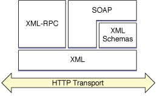
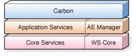

> 导航：[总目录](../../../README.md) · [documentation](../../../_indexes/documentation.md) · [Web Services Core Programming Guide](Introduction.md)


[Next](Using%20the%20Web%20Services%20Core%20Framework.md)[Previous](Introduction.md)

# About Web Services

Web services provide web-based APIs to support machine-to-machine communication over networks. Because these APIs are web-based, they inherently support interaction between devices running on different architectures and speaking different native languages.

Common examples of web services include weather forecasts, stock market quotes, and book inventories. A server with a database responds to remote queries for data, where the client specifies a particular city, stock symbol, or book title, for example. The client application sends queries to the server, parses the response, and processes the returned data.

All web service schemes utilize a web-based transport mode, such as HTTP, HTTPS, or SMTP, and a method for packaging the queries and responses, typically some sort of XML schema.

Some terminology is unique to web services. Creating an XML file containing outbound messages is sometimes called __serialization__. Extracting information from an incoming XML file is sometimes called __deserialization__. Calling a function or method on a remote server is often called an __invocation__. A web service may expose procedural functions or object-oriented methods. The general term __operation__ is used to describe either a function or a method.

The earliest implementations of web services implemented APIs that closely resembled function calls in existing computer languages such as C or Java. These are called remote procedural calls (RPC). A W3C standard has been established for providing web services using XML-based RPC, called XML-RPC. Clients access web services through XML-RPC by calling a series of remote functions, which execute on the server. Parameters are passed and returned in a predefined order. To use XML-RPC services, you must know the URL of the service, the functions that are exposed, and the data type and order of parameters to be sent and received.

A higher-level, more object-oriented approach was later developed called service-oriented architecture. The most popular implementation of this approach is SOAP (formerly Simple Object Access Protocol). In this approach to web services, the client and server exchange messages, rather than making calls and expecting returns. This provides a more loosely coupled interface and is less tied to particular languages. SOAP implementations are extremely common. SOAP parameters are named, rather than sent and received in predefined order, making SOAP calls easier to read and debug. To use SOAP services, you need to know the URL of the service, the methods exposed, and the names and data types of the message parameters.

At a still higher level, there is a definition for a Web Services Description Language (WSDL). This defines an XML document type that describes available web services. WSDL is often used in combination with SOAP to access services over the Internet. A client program connects to a remote server and reads a WSDL file to determine what remote services are available, including a list of operations, parameters, and data types. The client can then use SOAP to call operations listed in the WSDL file.

If a SOAP service is described in a WSDL file, you do not need any preexisting information to access the service except the URL of the WSDL file.

Currently, OS X provides no high-level support for extracting SOAP functions from WSDL files. You can use [NSXMLParser](https://developer.apple.com/documentation/foundation/xmlparser) to read a WSDL file into memory from a URL, however. It is then relatively simple to search the file for a particular method name or to find a URL associated with a service. With a bit more effort, you can extract method names, data types, and parameter names to build a SOAP call. You can then use the Web Services Core framework to make SOAP calls and parse the responses.

OS X has high-level support for SOAP and XML-RPC, as well as low-level support for XML and HTTP that allows you to access other implementations and schemes. The architecture is illustrated in Figure 1-1.

__Figure 1-1__  XML-RPC and SOAP encodings on top of XML on top of HTTP



You can make SOAP or XML-RPC calls directly from AppleScript or from within procedural C or Cocoa applications. You can make these calls using either Apple events or the Web Services Core framework.

Web Services Core is a low-level framework that sits alongside CFNetwork, Core Foundation, and Carbon Core, a subframework of Core Services, as shown in Figure 1-2. It is available to all applications, plugins, tools, and daemons.

__Figure 1-2__  Web Services Core framework



The framework has no dependency on the window server or login window. It is fully integrated with the OS X system, sitting inside Core Services, and leverages CFXMLParser and CFNetwork. The framework is thread-safe and based on the run loop.

Whether using XML-RPC or SOAP, you use the Web Services Core API to create a call to a server in essentially the same manner:

1. Create a dictionary containing the URL of the server, the name of the operation, and a constant specifying the protocol (XML-RPC, SOAP 1.1, or SOAP 1.2).
2. Create a method invocation ref using `WSMethodInvocationCreate`, passing in the dictionary.
3. Create a dictionary containing the method parameters and their names, and another dictionary specifying their order.
4. Pass these two dictionaries into the invocation ref using `WSMethodInvocationSetParameters`.
5. Pass any additional settings, such as SOAP action headers and debug flags, into the invocation ref using calls to `WSMethodInvocationSetPropery`.
6. Create a callback to handle the response and pass it into the invocation ref using `WSMethodInvocationSetCallback`. This callback parses a dictionary containing the CFTypes deserialized from the response.
7. Invoke the procedure using `WSMethodInvocationInvoke` or `WSMethodInvocationScheduleWithRunLoop`.
8. Check the HTML status for authentication challenge or network errors, authenticating if necessary.

The web services API encourages you to asynchronously issue invocation requests on the run loop and receive a reply on your bundle. Because it is CFType-based, you have to create CFType objects for your strings, records, dictionaries and arrays. If you’re an Objective-C programmer, you get “toll-free” bridging with Objective-C types.

Simple data types can be serialized and deserialized using the built-in capabilities of the method invocation. If you need to, you can invoke a custom serializer or deserializer to convert more complex outbound data into XML or to extract data from returned XML. Use `WSMethodInvocationAddSerializationOverride` or `WSMethodInvocationAddDeserializationOverride` to add a custom serializer or deserializer.

You can specify that the response dictionary should contain the raw XML that was sent and/or returned to assist in deserialization or debugging using `WSMethodInvocationSetPropery`.

The web services core framework consists of three header files: `WSTypes.h`, `WSMethodInvocation.h`, and `WSProtocolHandler.h`.

`WSTypes.h` contains the error codes and types unique to the web services framework, and also includes a number of web services types that correspond to core foundation types, such as `eWSNullType`, `eWSBooleanType`, `eWSIntegerType`, and so on.

Because CFTypes are determined at runtime, it isn't always possible to produce a static mapping between Core Foundation types and the corresponding serialized XML types used to interact with remote servers. What this means is that when converting between serialized XML data and deserialized CFTypes, you need to do a conversion from WSTypes to CFTypes, and vice versa. An enum of WSTypes, combined with an API to convert between CFTypes and WSTypes, can also be found in `WSTypes.h`.

`WSMethodInvocation.h` provides the main client-side API described throughout this document: creating an invocation reference, setting parameters, invoking remote operations, and parsing responses.

`WSProtocolHandler.h` contains the API for converting between dictionaries and XML messages without invoking web services. You can use this to support either client-side or server-side operations.

The fundamental object of the `WSProtocolHandler` API is the `WSProtocolHandlerRef`. This references an object that translates dictionaries into a web services request, or an XML message into a dictionary. Typically, it is used to implement the server side of a web service by converting received XML into core foundation types, but you can use the protocol handler API to serialize and deserialize data prior to, after, or instead of invoking an operation for client-side operations as well.

You can use the Web Services Core framework to access XML-RPC or SOAP-based web services. To access SOAP or XML-RPC services starting with a WSDL document, you must first parse the WSDL document using the OS X XML library (`NSXML...` functions). In most cases, you can then call the described service using the Web Services Core framework. If the described SOAP service uses data whose types are encoded in other WSDL files, however, you need to use XML and network messaging (CFNetwork) to access the service as well.

A properly formatted XML-RPC message is an HTTP POST request whose body is in XML. The specified remote server executes the requested call and returns any requested data in XML format.

XML-RPC recognizes function parameters by position. Parameters and return values can be simple types such as numbers, strings, and dates, or more complex types such as structures and arrays.

XML-RPC has a significant limitation, in that it defines string parameters as being ASCII text. Some XML-RPC servers enforce this, forcing the user to pass internationalized text as Base-64 encoded data. XML-RPC does support passing binary data in an XML document using Base-64 encoding.

To learn more about XML-RPC messages, see the XML-RPC specification at [http://www.xmlrpc.com/spec](http://www.xmlrpc.com/spec).

SOAP is an RPC protocol designed to access servers containing objects whose methods can be called over the Internet. A SOAP request contains a header and an envelope; the envelope in turn contains the body of the request.

SOAP supports two styles for representing web service operation invocations: RPC (remote procedure call) messaging and document-style messaging. RPC messaging is fairly rigid but can generally make use of the Web Services Core framework’s built-in serializers and deserializers. Document-style messaging, on the other hand, provides greater flexibility; it allows messages to contain arbitrary data elements. Parsing such messages is more complicated and commonly requires you to provide custom serializers or deserializers. Examples of both representation styles are given in the following two listings.

__Listing 1-1__  RPC-style SOAP envelope

```
<soapenv:Envelope
    xmlns:soapenv="soap_ns"
    xmlns:xsd="xml_schema_ns"
    xmlns:xsi="type_ns">
    <soapenv:Body>
        <ns1:getStockPrice
            xmlns:ns1="app_ns"
            soapenv:encodingStyle="encoding_ns">
            <stockSymbol xsi:type="xsd:string">AAPL</stockSymbol>
        </ns1:getStockPrice>
    </soapenv:Body>
</soapenv:Envelope>
```


__Listing 1-2__  Document-style SOAP envelope

```
<soapenv:Envelope
    xmlns:soapenv="soap_ns"
    xmlns:xsd="xml_schema_ns"
    xmlns:xsi="type_ns">
    <soapenv:Body>
        <ns1:customerOrder
            soapenv:encodingStyle="encoding_ns"
            xmlns:ns1="app_ns">
            <order>
                <customer>
                    <name>Plastic Pens, Inc.</name>
                    <address>
                        <street>123 Yukon Drive</street>
                        <city>Phoenix</city>
                        <state>AZ</state>
                        <zip>85021</zip>
                    </address>
                </customer>
                <orderInfo>
                    <item>
                        <partNumber>88</partNumber>
                        <description>Blue pen</description>
                        <quantity>250</quantity>
                    </item>
                    <item>
                        <partNumber>563</partNumber>
                        <description>Red stapler</description>
                        <quantity>30</quantity>
                    </item>
            </order>
        </ns1:customerOrder
    </soapenv:Body>
</soapenv:Envelope
```

To learn more about SOAP messages, see the SOAP specification at [http://www.w3.org/TR/soap/](http://www.w3.org/TR/soap/).

WSDL files contain namespace definitions that define web services, their URLs, operations, data types, and binding. Many SOAP services can be accessed without prior knowledge of the method names and data types by accessing a WSDL file on the server to obtain this information.

OS X does not currently provide high-level support for WSDL directly. However, it is relatively straightforward to parse the XML of a WSDL file using [NSXMLParser](https://developer.apple.com/documentation/foundation/xmlparser), then use SOAP or RPC to call the functions described in the WSDL file.

Some web services integrate WSDL and SOAP in more complex ways, actually encoding the SOAP data in external WSDL files. The current implementation of the Web Services Core framework does not support this type of data encoding.

To access services that use external data encoding, you must use lower-level techniques. For example, you can use [NSXMLParser](https://developer.apple.com/documentation/foundation/xmlparser) to read and parse the WSDL file from the URL, then use [NSXMLDocument](https://developer.apple.com/documentation/foundation/xmldocument) to construct an appropriate XML message, then use HTTP or HTTPS messaging to post the message, again using `NSXMLParser` to read and parse the response.

To learn more about WSDL, see the specification at [http://www.w3.org/TR/wsdl](http://www.w3.org/TR/wsdl).

[Next](Using%20the%20Web%20Services%20Core%20Framework.md)[Previous](Introduction.md)

