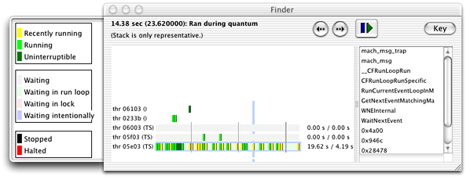

> 导航：[总目录](../../../README.md) · [documentation](../../../_indexes/documentation.md) · [Code Speed Performance Guidelines](Introduction%20to%20Code%20Speed%20Performance%20Guidelines.md)

[Next](Accelerating%20Critical%20Code.md)[Previous](Perceived%20Responsiveness.md)

# Detecting Polling Behavior

Polling is an inefficient way to process events. Not only does it waste CPU time, it ties up memory with code that could otherwise be paged out and used by other programs.

If you’re not sure your application is polling, you can find out very quickly. Put your application in an idle state and do one of the following:

- 

  Run `top` and make sure the `%CPU` field shows 0.
- 

  Run Thread Viewer and see if any of your application’s threads are active.

Checking the `%CPU` field in `top` is a quick way to determine _if_ your application is polling. You can also run `top` with the `-d` option, which displays the number of context switches, messages, and system calls made by your application. If these numbers change over time, your application is polling the system in some way. Regardless of how you use it, `top` does not tell you which part of your application is responsible for polling. For that, you need to use Thread Viewer.

Thread Viewer graphically displays the activity of each of your application’s threads along a color-coded time-line view. Clicking on the time line displays a backtrace of function calls made by the selected thread at that point in time. This backtrace is only a snapshot and may not reflect the current activity of the thread but it can help isolate the location of polling code.

Figure 1 shows the Thread Viewer display window. The drawer on the left side provides a key for interpreting the time-line information. Clicking in the time-line shows the stack trace in the right-side scroll box.

__Figure 1__  Thread Viewer display window

[Next](Accelerating%20Critical%20Code.md)[Previous](Perceived%20Responsiveness.md)

