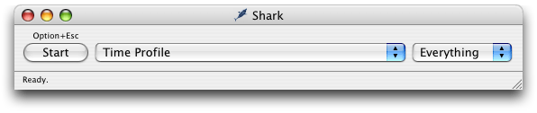
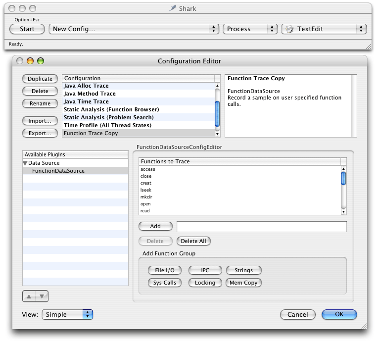
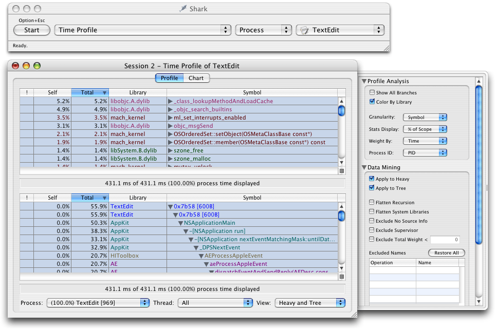

> 导航：[总目录](../../../README.md) · [documentation](../../../_indexes/documentation.md) · [Code Speed Performance Guidelines](Introduction%20to%20Code%20Speed%20Performance%20Guidelines.md)

[Next](Check%20Your%20Algorithms.md)[Previous](Introduction%20to%20Code%20Speed%20Performance%20Guidelines.md)

# Diagnosing Slow Operations

Diagnosing slow behavior in an application requires a bit of detective work. In a few cases, poor performance may have nothing to do with your code, but in most cases your code is being inefficient in some way. When you detect a drop in your application’s performance, follow the steps described in the following sections to isolate the problem.

Before you start gathering data on exactly which parts of your code are slow, you should run through the following checklist to eliminate any obvious problems.

- _Are other processes slowing down the system?_ Run `top` to see how much CPU time is being taken up by other processes.
- _Are specific operations slow?_ Run Shark or `sample` to find out where your application is spending its time. See [Finding Time-Consuming Operations](#apple-f4xwc4dqnrsv64tfmyxwi33df52wszbpgiydambrha3dsljzg4ztsoa) for more information.
- _Did your I/O patterns change significantly?_ Run `fs_usage` to see if file operations are slowing down your system. For information on how to diagnose file performance issues, see _[File-System Performance Guidelines](../File-System%20Performance%20Guidelines/Introduction%20to%20File-System%20Performance%20Guidelines.md#apple-f4xwc4dqnrsv64tfmyxwi33df52wszbpgeydambqge3dc2i)_.
- _Is your application silently generating errors?_ If your application is encountering errors, it may be spending much of its time handling those errors or working around them. Watch your code in the debugger or set up some error handling notifications to locate potential errors.
- _Are compiler optimizations enabled?_ Build your application with compiler optimizations enabled to see if that improves performance. For information on the available compiler optimizations, see [Managing Code Size](https://developer.apple.com/library/archive/documentation/Performance/Conceptual/CodeFootprint/Articles/CompilerOptions.html#//apple_ref/doc/uid/20001861) in _[Code Size Performance Guidelines](../Code%20Size%20Performance%20Guidelines/Introduction%20to%20Code%20Size%20Performance%20Guidelines.md#apple-f4xwc4dqnrsv64tfmyxwi33df52wszbpgeydambqge2ds2i)_.
- _Is your application prebound?_ If you are running a Mach-O executable on OS X version 10.3.3 or earlier, prebinding can improve the performance of your application. If you are running on OS X version 10.3.4 or later, prebinding might offer some gains but is less critical for performance. For information on how to enable prebinding, see [Prebinding Your Application](https://developer.apple.com/library/archive/documentation/Performance/Conceptual/LaunchTime/Articles/Prebinding.html#//apple_ref/doc/uid/20001858) in _[Launch Time Performance Guidelines](../Launch%20Time%20Performance%20Guidelines/Introduction%20to%20Launch%20Time%20Performance%20Guidelines.md#apple-f4xwc4dqnrsv64tfmyxwi33df52wszbpgeydambqge2dq2i)_.

Running Shark or `sample` can help you quickly identify operations in your code that are taking too much time. once identified,

Apple provides several tools that let you sample your application at runtime to find out where it is spending its time. Sampling lets you gather information without recompiling your application. The sampling tools take a snapshot of your application’s stack at regular intervals and then collect that information into a call graph of functions. This information can help you identify inefficient algorithms and slow functions.

The sections that follow describe how to use these tools and understand the data they generate.

Shark is a powerful tool for finding hot spots and more subtle performance problems in your application. Shark samples either a single process or all system processes and records information about the call stacks for each process. It then displays the recorded information using tree views, charts, and other formats that can help reveal problems quickly.

Shark provides several different options for sampling processes. The most common option is the time profile, which gathers call stack data at a fixed interval and displays the most frequently called functions (the hot spots). You can also track specific function calls in your application, including malloc calls, file I/O calls. You can also gather information about specific hardware or software events, including cache misses, processor stalls, PCI requests, and page in requests.

For most common operations, Shark requires little or no configuration. When you first launch Shark, the application is configured for a basic time profile, which gathers samples of all system processes at a fixed interval. You can select a different configuration preset from the sampling configuration popup menu, shown in Figure 1. When you are ready to sample, click the Start button or use the Option-Escape hot key.

__Figure 1__  Shark main window

If you do not want to use one of the existing configurations, you can create your own custom configurations by choosing New Config from the sampling configuration popup menu. This brings up the Configuration Editor window (Figure 2), from which you can choose the data you want to gather during sampling sessions. Configurations you create with this window are automatically added to the sampling configuration popup menu.

__Figure 2__  Configuration editor window

For more information about configuring the performance monitor counters, see the Shark User Manual.

Shark provides several ways of viewing sample data and provides controls for managing the display granularity. Each session window has Profile and Chart buttons for displaying data textually or graphically. The Profile view is shown in Figure 3. In this view, you can view hot spots (heavy view), a tree view of your call stacks, or both simultaneously (as shown here). You can view call stack information for a specific process or thread or for all processes and threads. You can hide irrelevant call stack information using the Data Mining features found in the side drawer.

__Figure 3__  Data displayed in heavy and tree view

The heavy view shows you your program’s hot spots, that is, it shows you the functions that were encountered most frequently. This view can point out places where your code is spending a lot of time. Hot spots tell only part of the story though. If a function appears to consume 50% of your program’s processing time, there are two potential reasons why: it is slow or it is called too frequently by a different function. You can also use the data mining features to charge the cost of a given function to whoever called it. Doing so might point out a higher level function is the real culprit.

The tree view provides a top-down view of a process and is probably more familiar to users of the `sample` command-line tool. This view can be useful for finding high-level functions that are consuming too much CPU time. As with the heavy view, you can use the data mining features to charge the costs of a function to whoever called it.

The Chart tab of the data window shows data gathered by the performance monitor counters. For a basic time profile, the charts show call stack depth plotted over time. However, if you have additional performance counters set up, the charts display the values of those counters over time. For more information about setting up performance counters, see the Shark User Manual.

If you have source code, double-clicking a function will display a source code view for that function. The source code view provides you with a low-level performance analysis of the function code. This low-level analysis can show you how to tweak your code to get the best possible performance for of the current processor. For example, Shark can point out processor stalls or places that might benefit from parallelization through AltiVec. This analysis may not always yield big gains for your entire application but can be important in the final stages of tuning critical code.

When gathering samples in time profile mode, it is important to remember that Shark’s results are not comprehensive. Shark gathers samples only at predetermined intervals, gathering call stack information for the target threads during each interval. And while the sampling granularity in Shark is high, it is still possible for a function to be called more often than is actually reported.

To improve the data reported by Shark, you can change the sampling interval or vary the interval dynamically. Shark includes an advanced feature that automatically adds a random increment of time to the sample period to prevent harmonic phenomena, such as the same thread being active every 10 milliseconds.

The `sample` command-line tool provides another way to sample a process at regular intervals. The `sample` tool gathers sample data at regular intervals and creates a textual report of the call stack data, including the number of times each function was discovered. Because `sample` is a command-line tool, you can run it situations where you couldn’t run Shark, such as from a remote machine.

To run `sample`, execute it from the command line, specifying the process ID of the program you want to sample along with the sample interval and duration. If you want to sample the launch of an application, specify the name of the application and the `-wait` option when calling `sample`. For more information on sampling the launch of an application, see [Gathering Launch Time Metrics](https://developer.apple.com/library/archive/documentation/Performance/Conceptual/LaunchTime/Articles/MeasuringLaunch.html#//apple_ref/doc/uid/20001856) in _[Launch Time Performance Guidelines](../Launch%20Time%20Performance%20Guidelines/Introduction%20to%20Launch%20Time%20Performance%20Guidelines.md#apple-f4xwc4dqnrsv64tfmyxwi33df52wszbpgeydambqge2dq2i)_.

You should let `sample` complete its sampling period before killing the target process. If you think the process might die before sampling is complete, specify the `-mayDie` option when calling `sample`. With this option specified, `sample` gathers symbol information before it starts sampling to ensure that it can display that information in its report. Without this symbol information, you may be unable to decipher the call-graph data.

Statistical sampling can provide you with good insight into how much time an application is spending doing something. However, given the nature of statistical sampling, there is always a possibility that the data you receive is somewhat misleading. It happens rarely, but if you really want to know exactly which functions are called, how often they are called, and how long they take to run, you need to instrument your code. To do this, you must profile your code using `gprof`.

For instructions on how to profile your code with `gprof`, see [Improving Locality of Reference](https://developer.apple.com/library/archive/documentation/Performance/Conceptual/CodeFootprint/Articles/ImprovingLocality.html#//apple_ref/doc/uid/20001862) in _[Code Size Performance Guidelines](../Code%20Size%20Performance%20Guidelines/Introduction%20to%20Code%20Size%20Performance%20Guidelines.md#apple-f4xwc4dqnrsv64tfmyxwi33df52wszbpgeydambqge2ds2i)_ or the `gprof` man page.

Once you’ve gathered some data from Shark or `sample`, how do you use it to find performance problems in your code? If the problem is really in your code, then you should be able to get enough information from either program to find the problem. One way to identify that information is to do the following:

1. If you are using Shark, look at the heavy view to see if your code is included in the hot spots. If your program needs only minor tuning, your code may not immediately appear in the hot spots. Try using Shark’s data mining capabilities to hide system libraries and frameworks. That might reveal the hot spots in your own code.
2. If the heavy view does not reveal any clear hot spots, use the tree view of either Shark or `sample` to find the heaviest branches. Follow each branch down until you reach your own code so that you can determine what high-level operation was being performed. Use that as the starting point for tuning that particular operation.
3. Within the code of each heavy branch, walk down through any heavily called functions and examine the work you are doing:

   - Is your algorithm efficient for the amount of data you are processing? (See [Check Your Algorithms](Check%20Your%20Algorithms.md#apple-f4xwc4dqnrsv64tfmyxwi33df52wszbpgiydambrha3dmlkdjjbegskgivba)).
   - Are you calling a lot of other functions? If so, you might be trying to do too much work and might benefit from delaying that work or moving it to another thread. (See _[Threading Programming Guide](../../Cocoa/Threading%20Programming%20Guide/Introduction.md#apple-f4xwc4dqnrsv64tfmyxwi33df52wszbpgeydambqga2to2i)_.)
   - Are you spending a lot of time converting from one data type to another? Perhaps you should modify your data structures to avoid the conversions altogether. (See [Impedance Mismatches](Impedance%20Mismatches.md#apple-f4xwc4dqnrsv64tfmyxwi33df52wszbpgiydambrha3dolkcijbusq2kivaq).)
4. After tuning each branch, run Shark or `sample` again to see if you successfully removed or reduced the problem. If problems persist, keep tuning other branches or start tuning the parent code that calls those branches.

[Next](Check%20Your%20Algorithms.md)[Previous](Introduction%20to%20Code%20Speed%20Performance%20Guidelines.md)

