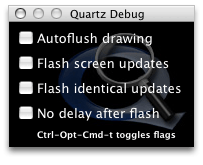

> 导航：[总目录](../../../README.md) · [documentation](../../../_indexes/documentation.md) · [Drawing Performance Guidelines](Introduction%20to%20Drawing%20Performance%20Guidelines.md)


[Next](Flushing%20to%20the%20Window%20Buffer.md)[Previous](Cocoa%20Drawing%20Tips.md)

# Measuring Drawing Performance

Eliminating unnecessary drawing can dramatically improve the performance of any application. Drawing calls require a lot of overhead, both in setting up the drawing environment and in rendering the final image. The Xcode Tools CD comes with tools for analyzing the performance of your application’s drawing code. You can use these tools to identify areas that are being redrawn unnecessarily.

Quartz Debug is a Cocoa application that lets you view screen updates as they happen. The application is located in the `/Developer/Applications/Performance Tools` directory. Upon launching Quartz Debug, you are presented with the options window, shown in Figure 1. This window contains several debugging checkboxes (all initially deselected) and a Show Window List button.

__Figure 1__  Quartz Debug options window



The “Autoflush drawing” checkbox causes the window server to flush the contents of a Core Graphics graphics context after each drawing operation.

When “Flash screen updates” is selected, regions of the screen that are about to be updated are painted yellow, followed by a brief pause, followed by the actual screen update. Similarly, areas that are about to be updated via hardware acceleration are painted green. This allows you to see screen updates as they occur. The pause allows you to see the colored region before it disappears; without it, the screen would be updated immediately, possibly faster than you can perceive it. To turn off the pause, enable the “No delay after flash” check box.

When “Flash identical updates” is selected, regions of the screen that were modified, but whose pixels did not change, are painted red, followed by a brief pause, followed by the update. To turn off the pause, enable the “No delay after flash” check box.

By watching the rectangles that Quartz Debug displays, you can determine how often and where your application redraws itself. If you see a large area being refreshed but know the application needs to update only a small portion of that area, you should go back and check your update rectangles. Similarly, if you see any red rectangles, your application is drawing content that has not changed and does not need to be redrawn.

Choose Tools > Show Window List to display a static snapshot of the system-wide window list. The list identifies the owner of each window and the memory the window occupies. This is useful for understanding the impact of buffered windows on your application’s memory footprint.

[Table 1](#apple-f4xwc4dqnrsv64tfmyxwi33df52wszbpgiydambrha3tkljzhaytemjnijbusqsdi5eeq) explains the meaning of each column in the window list.

__Table 1__  QuartzDebug window list columns

| Column | Description |
| `CID` | The connection ID of the window. Used internally by the window server. Typically, the connection ID is the same for all windows owned by a process. |
| `Application` | The name of the application that owns the window. |
| `WID` | The ID of the window itself. |
| `kBytes` | The amount of memory occupied by the window buffer and other large data structures. Specified in kilobytes. The letter `I` is appended to the size if the buffer is invalid (in need of an update). The letter `C` is appended if the window has been compressed automatically by the window server. The letter `A` is appended if the window is accelerated. |
| `Origin` | The screen-relative location of the window’s upper-left corner, measured in pixels. |
| `Size` | The width and height dimensions of the window, measured in pixels. |
| `Type` | `Buffered` windows are buffered in shared memory. All graphics operations are recorded in the backing buffer and drawn to screen by the window server as necessary.  Only the portions of a `Retained` window that are obscured by other windows are saved in the buffer. This results in some memory savings, but disables translucency.  Graphics operations in `NonRetained` windows are not recorded at all. |
| `Encoding` | Depth of the window’s buffer (the number of bits per pixel). The letter `A` is appended if the window buffer has an alpha channel. Note that the window buffer includes the window’s title bar and frame. |
| `OnScreen` | `Yes` if the window is currently visible; otherwise `No`. |
| `Shared` | `Yes` if the window is currently shared; otherwise `No`. Shared windows can be manipulated by multiple applications. A non-shared window can be modified only by the application that owns it. |
| `Fade` | Opacity of the window. Opacity is separate from the window’s alpha channel. Ranges from 0% to 100%, where 0% indicates a completely transparent window; 100% indicates a completely opaque window. |
| `Level` | The window level. Windows at higher levels can never be placed visually below windows at lower levels. Values from `LONG_MIN` + 1 to `LONG_MAX` - 16 are supported. |

The Quartz Debug Tools menu includes additional options for testing the performance of your application. From this menu you can view a frame meter that displays the current rendering speed of the system, along with the impact on CPU usage. You can also display a control window for getting and setting the current screen resolution. You can use this latter window to test your resolution-independent rendering code.

You can take advantage of several AppKit debugging options to gather data about their application’s drawing performance. These options are in the form of command-line parameters that you pass to your application at launch time. You must launch your application from Terminal to use these parameters.

Table 2 lists the parameters you can use when launching your application.

__Table 2__  Cocoa application debugging parameters

| Parameter | Description |
| `-NSAllWindowsRetained`_<YES | NO>_ | Set to `YES` to retain all windows. |
| `-NSShowAllDrawing`_<msec>_ | Pause for the specified number of milliseconds between each drawing command. |
| `-NSShowAllDrawingColor`_<color |_`cycle`_>_ | Colors the area for pending drawing operations with the specified color. Use the NSColor class methods to specify the desired color. To cycle through the available colors, specify the value `cycle`. |

For example, to display drawing updates, for the TextEdit application using the color blue, and pausing for 500 milliseconds between updates, you would specify the following commands from Terminal:

```shell
% cd /Applications/TextEdit.app/Contents/MacOS
% ./TextEdit -NSShowAllDrawing 500 -NSShowAllDrawingColor blueColor
```

[Next](Flushing%20to%20the%20Window%20Buffer.md)[Previous](Cocoa%20Drawing%20Tips.md)

