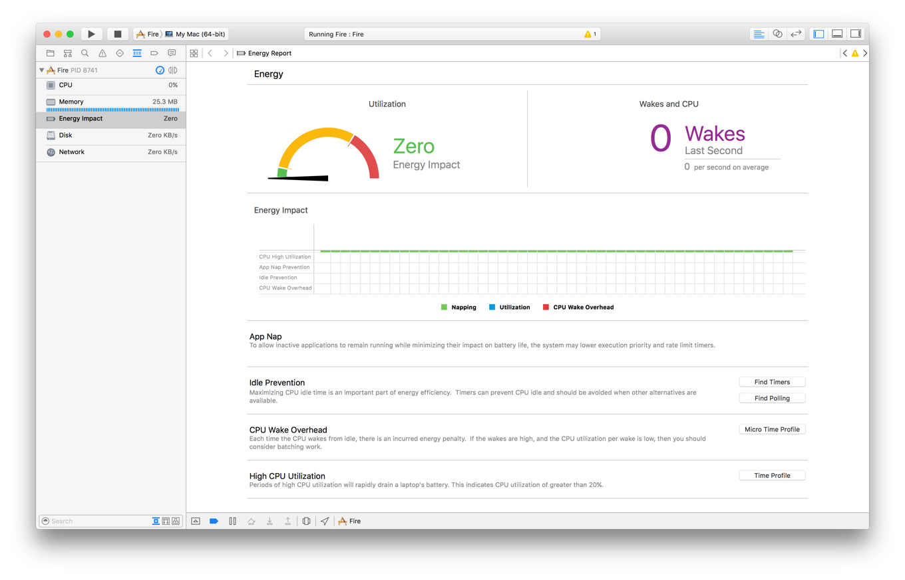
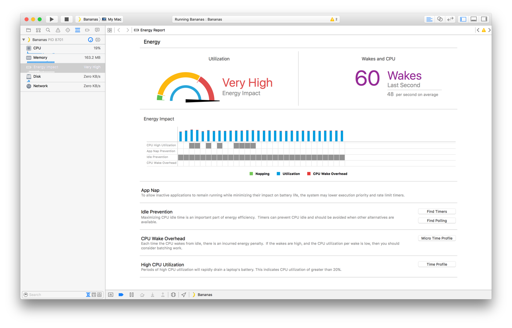
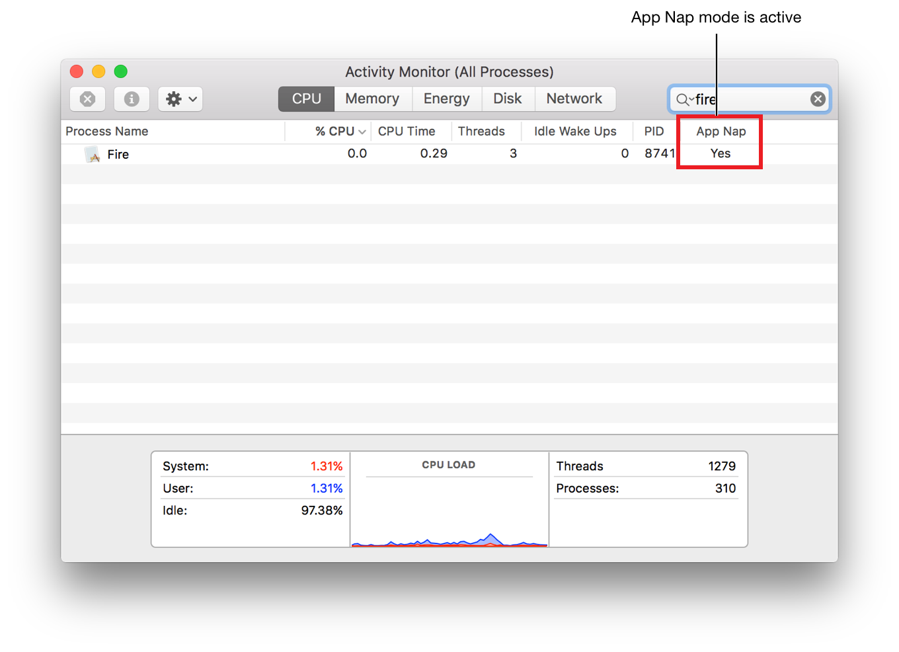
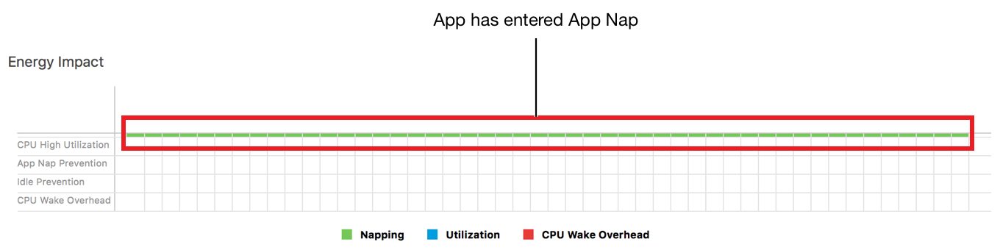

> 导航：[总目录](../../../README.md) · [documentation](../../../_indexes/documentation.md) · [Energy Efficiency Guide for Mac Apps](index.md)

## Extend App Nap

When the user isn’t interacting with your app, ideally, your app is absolutely idle.

If an app isn’t performing user-initiated work such as updating content on screen, playing music, or downloading a file, the system may put the app in App Nap. App Nap conserves battery life by regulating the app’s CPU usage and by reducing the frequency with which its timers are fired.

However, you need not—and should not—wait for App Nap to start suspending your app’s activities. By taking a proactive approach to reaching idle, you can enhance App Nap’s features by reducing the amount of work it has to do.

### What App Nap Does

The energy impact of App Nap is illustrated in Figure 3-1. When the user resumes interacting with the app, OS X instantly shifts the app back to full speed, as shown in Figure 3-2.

__Figure 3-1__Zero energy impact of an app in App Nap

__Figure 3-2__High energy impact of an app not in App Nap

For any app that's not performing important user work, App Nap triggers a number of measures, including:

- Priority reduction, which reduces the process priority of the app so it receives a smaller share of available processor time
- Timer throttling, which reduces the frequency with which the app’s timers are fired
- I/O throttling, which reduces the rate at which the app can read or write data from a device while foreground apps need the device

> [!IMPORTANT]
> 

### How App Nap Works

OS X uses a set of heuristics to determine when to put an app in App Nap. These heuristics take into account factors such as drawing activity, event processing, audio playback, foreground or background state, and app type. Generally, an app is a candidate for App Nap if:

- It isn’t the foreground app
- It hasn’t recently updated content in the visible portion of a window
- It isn’t audible
- It hasn’t taken any IOKit power management or NSProcessInfo assertions
- It isn’t using OpenGL

When the above conditions are met, OS X may put the app in App Nap. When the user brings the app to the foreground or when the app receives an XPC message or an Apple event, the app is automatically taken out of App Nap and resumes normal execution.

### Knowing When Your App Is in App Nap

Use the Energy Impact gauge in Xcode and the Energy pane in the Activity Monitor app to determine whether your app is in App Nap.

__Activity Monitor.__ Launch your app with the Activity Monitor app (found in `/Applications/Utilities`) running. Click the Energy button, and view the status of your app in the App Nap column. Figure 3-3 shows an app that’s currently in App Nap.

__Figure 3-3__Activity Monitor showing App Nap status for an app

__Xcode Energy Impact gauge.__ When you build and run your app in Xcode, you can monitor it with the Energy Impact gauge. Open the debug navigator (choose View > Navigators > Show Debug Navigator), and select the Energy Impact gauge. On the Energy Impact timeline graph (see Figure 3-4), green bars and/or a lack of utilization and CPU wake overhead bars indicate when the app is in App Nap.

__Figure 3-4__Energy Impact timeline with an app in App Nap

### Enhancing App Nap

App Nap is automatic in OS X; you don’t need to do anything special for it to work with your app. But App Nap can’t make up for the energy effects of poorly designed apps. Fortunately, with very little effort, you can enhance its capabilities, actively reducing your energy footprint and further lengthening the time users can use their device without plugging into power.

By default, your app becomes eligible for App Nap if it’s not actively engaged with the user and hasn’t updated a visible window for some length of time. However, your app knows the most about the importance of its activity, and shouldn’t rely on App Nap to put it into an idle state. The most effective way to enhance App Nap is for your app to listen for notifications that it’s no longer in active use and to suspend energy-intensive work as quickly as possible—well before the system puts the app in App Nap. See [Notify Your App When Visibility Changes](WorkWhenVisible.md#apple-f4xwc4dqnrsv64tfmyxwi33df52wszbpkridimbqgeztsmrzfvbuqmjyfvjvomi) and [Notify Your App When Active State Changes](WorkWhenActive.md#apple-f4xwc4dqnrsv64tfmyxwi33df52wszbpkridimbqgeztsmrzfvbuqmjxfvjvomi).

You can also help the system determine when to put your app in App Nap by distinguishing between important user-initiated activities and your app’s discretionary or asynchronous activities. When your app communicates that it’s performing discretionary activities, the system efficiently puts your app in App Nap. When your app tells the system the user has initiated a long-running operation that the user expects to complete “now,” the system does not put your app in App Nap. See [Inform the System About Lengthy User-Initiated Activities](PrioritizeWorkAtTheAppLevel.md#apple-f4xwc4dqnrsv64tfmyxwi33df52wszbpkridimbqgeztsmrzfvbuqmzwfvjvomy) in [Prioritize Work at the App Level](PrioritizeWorkAtTheAppLevel.md#apple-f4xwc4dqnrsv64tfmyxwi33df52wszbpkridimbqgeztsmrzfvbuqmzwfvjvomi).

[Fundamental Concepts](FundamentalConcepts.md#apple-f4xwc4dqnrsv64tfmyxwi33df52wszbpkridimbqgeztsmrzfvbuqobnknltc)

[Notify Your App When Active State Changes](WorkWhenActive.md#apple-f4xwc4dqnrsv64tfmyxwi33df52wszbpkridimbqgeztsmrzfvbuqmjxfvjvomi)
