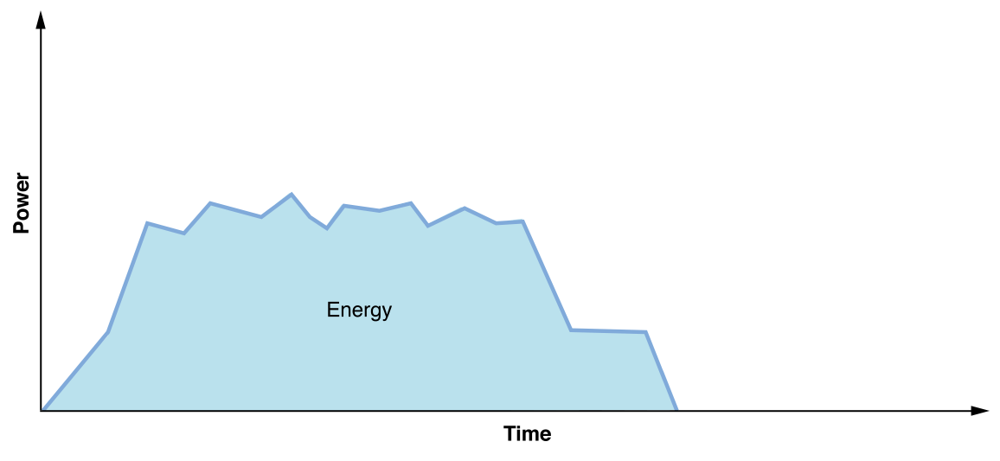
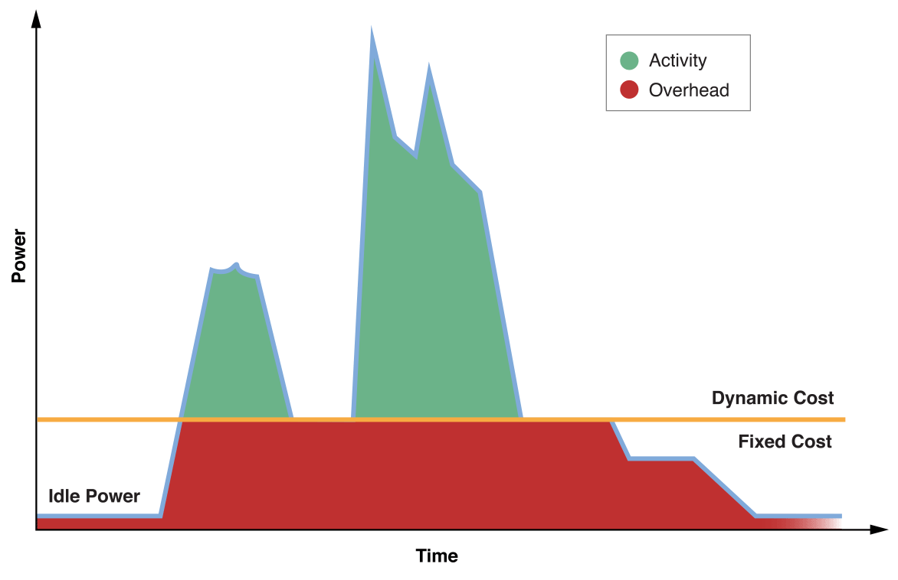
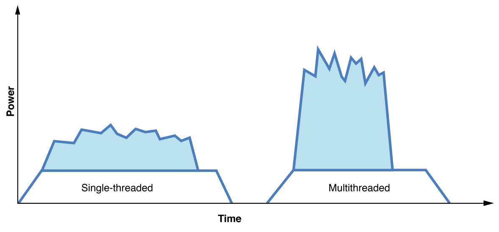

> 导航：[总目录](../../../README.md) · [documentation](../../../_indexes/documentation.md) · [Energy Efficiency Guide for Mac Apps](index.md)

## Fundamental Concepts

There’s no single solution for conserving energy on a device. Numerous technologies and operations influence how energy is used:

__CPU.__ The CPU is a major consumer of energy. Periods of high CPU use rapidly drain a user’s battery. Your app uses the CPU for almost everything it does, and it should do so wisely—by doing work only when necessary through batching, scheduling, and prioritizing.

__Timers.__ Timers allow your app to perform repeating actions or delay actions for a later time. Whenever a timer fires, the CPU and various other systems wake from their low-power, idle states, incurring an energy cost that adds up over time. Timers are often used when more efficient tools and methods can achieve the same result.

__Graphics.__ Every time your app’s content updates on screen, it uses energy to produce those pixels. Animations and videos can be especially taxing. Unexpected and unnecessary content updates also drain power. Your app should avoid updating content when its interface isn’t visible to the user. Also, follow recommended guidelines under Animation in _OS X Human Interface Guidelines_.

__Disk I/O.__ Writes to disk require significantly more energy than reads. This is especially true when writing to flash memory. Writing content to disk should occur only when necessary. Ideally, writes are done in aggregate to achieve higher efficiency.

__Networking operations.__ Most apps perform networking operations. When networking occurs, components such as Wi-Fi and Bluetooth power up and use energy. By batching and reducing transactions, compressing data, and appropriately handling errors, your app can make significant contributions to energy conservation.

### Energy and Power

Energy and power are two separate but related concepts. Power is an instantaneous measurement (watts) of energy required at any given point in time (Figure 2-1). Energy is a measurement of power used (joules) over a period of time (watt hours). Energy is finite. It’s stored in the battery and dissipates over time as more power is required.

By being aware of energy and taking it into account while developing your app, you can proactively take measures that make your code more efficient. As more apps improve efficiency, users will have batteries that last much longer, in addition to cooler and quieter devices.

__Figure 2-1__Energy is power over time

### CPU Usage and Power Draw

CPU usage is expensive. As more CPU is used, more power draw occurs, more energy is used, and the device’s battery drains faster. Power draw varies based on the device, processor, peripherals, and so on, but Table 2-1 provides a rough comparison of varying CPU usage against an idle state.

The majority of techniques and recommendations throughout this document result in less usage of the CPU.

__Table 2-1__Example of idle vs. CPU power draw

| Idle | 10x greater power draw over sleep |
| 1% CPU use | 10% greater power draw over idle |
| 10% CPU use | 2x power draw over idle |
| 100% CPU use | 10x power draw over idle |

### Fixed Cost and Dynamic Cost

OS X is very good at getting a device into a low power state when it’s not being used. Even at the microsecond scale, such as between keystrokes, the system is able to power down resources that aren’t being used.

At idle, very little power is drawn and energy impact is low. When tasks are actively occurring, system resources are being used and those resources require energy. However, sporadic tasks can cause the device to enter an intermediate state—neither idle nor active—when the device isn’t doing anything. There may not be enough time during these intermediate states for the device to reach absolute idle before the next task executes. When this occurs, energy is wasted and the user’s battery drains faster.

Tasks your app performs have a _dynamic cost_—how much energy your app uses by doing actual work. They also have a _fixed cost_—how much energy is used by bringing the system and various resources up in order for your app to do work, and back down after that work is complete. When lots of sporadic work is occurring, there are dynamic costs and a significant fixed cost too, as resources may never get the chance to reach true idle between the sporadic tasks. This situation results in a lot of energy being used for a relatively small amount of actual work. See Figure 2-2.

__Figure 2-2__Fixed vs. dynamic energy costs

### Trading Dynamic Cost for Fixed Cost

Your app can avoid sporadic work by batching tasks and performing them less frequently. For example, instead of performing a series of sequential tasks on the same thread, distribute those same tasks simultaneously across multiple threads, as shown in Figure 2-3. Each time the CPU is accessed, memory, caches, buses, and so forth must be powered up. By batching activity, components can be powered up once and used over a shorter period of time.

This strategy incurs a greater up-front dynamic cost—more work is done at a given time, requiring more power. In exchange, you get a dramatic reduction in fixed cost, which results in tremendous energy savings over time. You app draws more power, but it does so more efficiently and over less time. This lets the CPU get back to idle and other components to power down much more quickly.

As you develop your app, think holistically about its behavior, and try to reduce fixed costs wherever possible.

__Figure 2-3__Use multithreading to trade power for energy

[Energy Efficiency and the User Experience](index.md#apple-f4xwc4dqnrsv64tfmyxwi33df52wszbpkridimbqgeztsmrzfvbuqmjvfvjvomi)

[Extend App Nap](AppNap.md#apple-f4xwc4dqnrsv64tfmyxwi33df52wszbpkridimbqgeztsmrzfvbuqmrnknltc)
