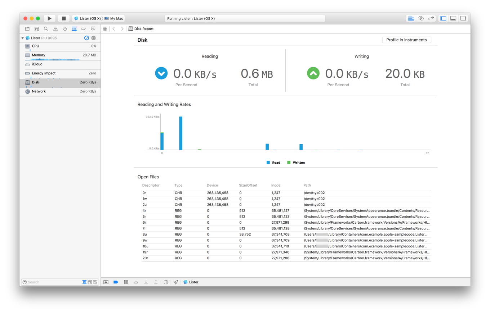
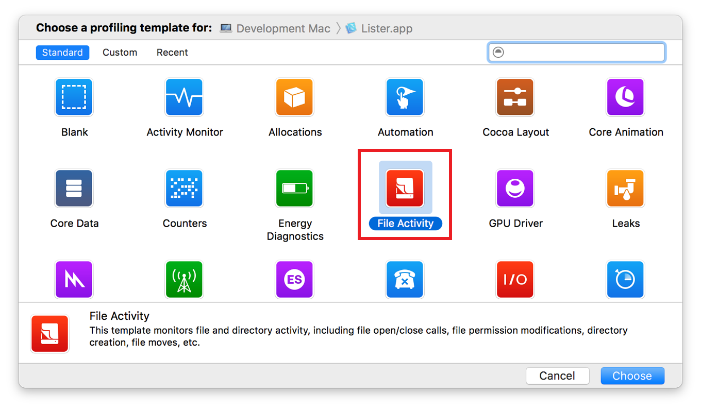
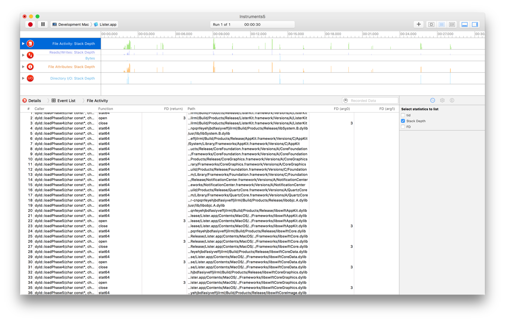

> 导航：[总目录](../../../README.md) · [documentation](../../../_indexes/documentation.md) · [Energy Efficiency Guide for Mac Apps](index.md)

## Minimize I/O

Every time your app performs I/O-related tasks, such as writing to disk, it brings the system out of an idle state. Writing to flash memory is especially energy-draining. By writing data less, aggregating writes together, using caching wisely, scheduling network transactions, and minimizing overall I/O, you can boost the energy efficiency and performance of your app.

### Optimize File Access

Here are some guidelines for optimizing file access in your app:

- Minimize the data you write to the disk. Write files only when their content has changed, and aggregate changes into a single write whenever possible. Avoid writing out an entire file if only a few bytes have changed. If you frequently change small portions of large files, consider using a database to store the data instead.
- Avoid accessing the disk too frequently. If your app saves state information to the disk, make it do so only when that state information changes. Batch changes whenever possible to avoid writing small changes at frequent intervals.
- Read and write data sequentially whenever possible. Jumping around within a file takes extra time to seek to the new location.
- Read and write larger blocks of data from files whenever possible, keeping in mind that reading too much data at once might cause other problems. For example, reading the entire contents of a 32 MB file might trigger paging of those contents before the operation is complete.
- For reading or writing significant amounts of data, consider using `dispatch_io`, which provides a GCD-based asynchronous API for doing file I/O. Using `dispatch_io` lets you specify your data needs at a high level, so the system can optimize your disk access.
- If your data consists of structured content that is randomly accessed, store it in a database and access it using, for example, SQLite or Core Data. Using a database is especially important if the amount of data you are manipulating could grow to more than a few megabytes.
- Understand how the system caches file data and know how to optimize the use of those caches. Avoid caching data yourself unless you plan to refer to it more than once. See [The System Has Its Own File Caching Mechanism](../File-System%20Performance%20Guidelines/File-System%20Performance%20Tips.md#apple-f4xwc4dqnrsv64tfmyxwi33df52wszbpgiydambrhe4doljzhe3tgmq) in _[File System Programming Guide](../../File%20Management/File%20System%20Programming%20Guide/About%20Files%20and%20Directories.md#apple-f4xwc4dqnrsv64tfmyxwi33df52wszbpkridimbqgeydmnzs)_.

For information on how to identify and fix file-related performance problems, see [Performance Tips](https://developer.apple.com/library/archive/documentation/FileManagement/Conceptual/FileSystemProgrammingGuide/PerformanceTips/PerformanceTips.html#//apple_ref/doc/uid/TP40010672-CH7) in _[File System Programming Guide](../../File%20Management/File%20System%20Programming%20Guide/About%20Files%20and%20Directories.md#apple-f4xwc4dqnrsv64tfmyxwi33df52wszbpkridimbqgeydmnzs)_.

### Monitor I/O

Several tools can help you monitor the I/O activity your app produces.

### fs_usage

The `fs_usage` command-line tool provides a running list of system calls related to activity in the file system. It has options that allow you to specify a timeout, filtering, and more.

The `fs_usage` command provides global file system activity across all running processes, as shown in Listing 6-1.

__Listing 6-1__Determining I/O activity for the entire system

1. `$ sudo fs_usage`

To monitor activity for a specific app, you can target it by its process name or ID, as shown in Listing 6-2 and Listing 6-3.

__Listing 6-2__Determining I/O activity for a process by name

1. `$ sudo fs_usage Mail`
2. `16:20:51.693058 open F=30 (_WCA__) ple.mail/Data/Library/Logs/Mail/2015-02-10_AccountManager.log 0.000135 Mail.2315137`
3. `16:20:51.693917 write F=30 B=0x64 0.000801 W Mail.2315137`
4. `16:20:51.708853 open F=35 (_WCA__) apple.mail/Data/Library/Logs/Mail/2015-02-10_AccountFetch.log 0.000086 Mail.2315137`
5. `16:20:51.709179 write F=35 B=0x88 0.000288 W Mail.2315137`
6. `16:20:51.709332 write F=35 B=0x7f 0.000007 Mail.2315137`
7. `16:20:51.709750 read F=87 [ 35] 0.000005 Mail.2315136`
8. `16:20:51.709774 read F=87 [ 35] 0.000001 Mail.2315136`
9. `...`

__Listing 6-3__Determining I/O activity for a process by PID

1. `$ sudo fs_usage <pid>`

Listing 6-4 uses options to monitor Mail for filesystem-related I/O activity only, and specifies a timeout of 10 seconds.

__Listing 6-4__Filtering for filesystem-related activity only activity for a process

1. `$ sudo fs_usage -w -f filesys -t 10 Mail`
2. `07:57:32.574069 open F=30 (_WCA__) /Users/yourUserName/Library/Containers/com.apple.mail/Data/Library/Logs/Mail/2015-02-11_AccountManager.log 0.000120 Mail.2705843`
3. `07:57:32.574128 write F=30 B=0x64 0.000012 Mail.2705843`
4. `07:57:32.587519 write F=95 B=0x88 0.000011 Mail.2705843`
5. `07:57:32.587639 write F=95 B=0x7f 0.000004 Mail.2705843`
6. `07:57:32.588018 read F=65 [ 35] 0.000004 Mail.2706962`
7. `07:57:32.588038 read F=65 [ 35]`
8. `...`

See fs_usage(1) Mac OS X Manual Page for complete documentation on this command.

### Xcode Debug Navigator

While testing your app in Xcode, choose View > Navigators > Show Debug Navigator to display the debug navigator pane. This pane provides useful information about the state and behavior of your app through a series of gauges. As you test your app, monitor its activity here carefully and look for areas where you may be able to reduce I/O activity. For more detailed I/O analysis, consider profiling your app more extensively with [Instruments](#apple-f4xwc4dqnrsv64tfmyxwi33df52wszbpkridimbqgeztsmrzfvbuqmrwfvjvoni).

__Figure 6-1__The Disk activity gauge in the Xcode debug navigator

The Disk (see Figure 6-1) and Network gauges show the I/O behavior of your app, including:

- Amount of data read from and written to disk
- Rates of reads from and writes to disk
- Files opened
- Network data received and sent
- Network data receiving and sending rates
- Active network connections

### Instruments

The File Activity profiling template in Instruments (see Figure 6-2) can help diagnose the file activity of your app.

__Figure 6-2__The File Activity profiling template in Instruments

This template includes the following instruments:

- File Activity—Records file opens, closes, and stat operations.
- Reads/Writes—Records reads and writes of bytes to files.
- File Attributes—Observes changes to file attributes, such as owner, group, and mode.
- Directory I/O—Monitors directory activity, such as links, directory creation, and moves.

__Figure 6-3__File activity traced with Instruments

As shown in Figure 6-3, the instruments in this profiling template present a very detailed representation of how your app is interacting with the file system. Use this information to determine whether your app can be refactored in order to batch activity or otherwise do I/O more effectively and efficiently.

For information about using Instruments to analyze the behavior of your app and diagnose problems, see _[Instruments User Guide](https://developer.apple.com/library/archive/documentation/DeveloperTools/Conceptual/InstrumentsUserGuide/index.html#//apple_ref/doc/uid/TP40004652)_.

[Notify Your App When Visibility Changes](WorkWhenVisible.md#apple-f4xwc4dqnrsv64tfmyxwi33df52wszbpkridimbqgeztsmrzfvbuqmjyfvjvomi)

[Minimize Timer Usage](Timers.md#apple-f4xwc4dqnrsv64tfmyxwi33df52wszbpkridimbqgeztsmrzfvbuqnjnknltc)
